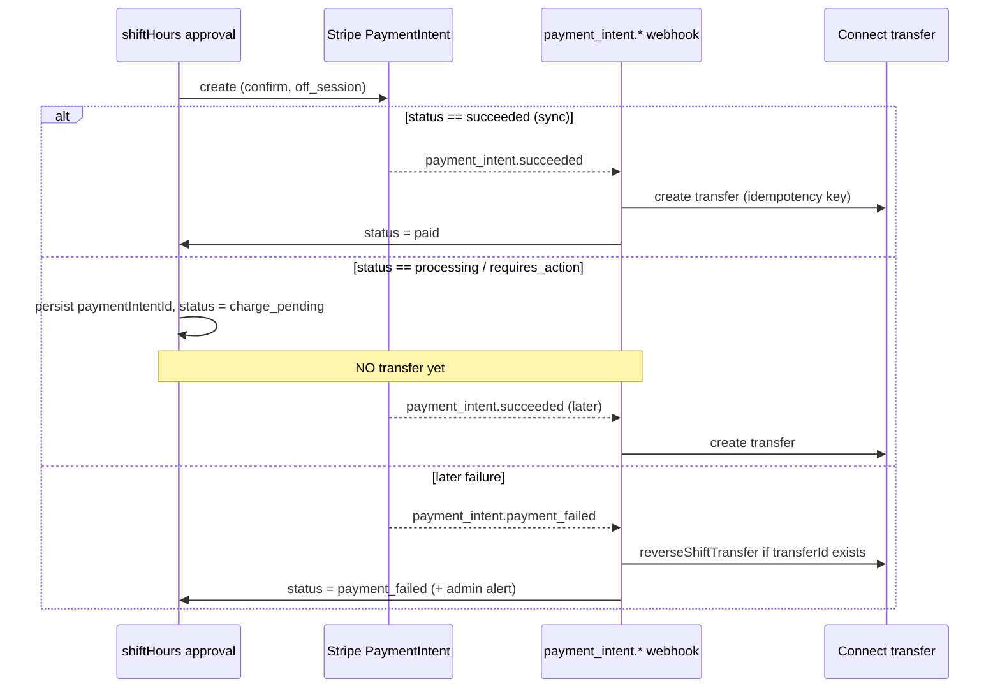
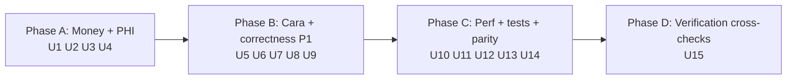

# fix: Strict-migration Rebuild — Code Review Remediation

## Summary

The `session/strict-migration-rebuild` branch passed a multi-agent code review with a **Not ready** verdict. This plan sequences the remediation of every surfaced finding — 4 P0, ~12 P1, and a set of P2/test/parity items — grouped into risk-tiered phases. The release-gating work is money-movement safety, PHI authorization, and two data-contract breaks that silently lose production data; everything else is hardening, test backfill, and quality follow-up.

The one finding already fixed during review — swap handlers reading non-existent `time`/`duration` appointment fields — is **applied and verified** (`tsc` clean) on the working tree, listed here only for traceability.

---

## Problem Frame

The rebuild decomposed the monolithic Linq SMS handler and added safety machinery (webhook exactly-once ledger, eligibility contract, shift-offer state machine, data-parity contract). Review found the new machinery is mostly sound, but several seams are unsafe:

- **Money can move without being collected**, and no transfer-reversal path exists anywhere in the codebase.
- **Cross-tenant PHI** is readable through MCP senior tools that skip the ownership check the write tools have.
- **Two write/read contract mismatches** (appointment status, care_journal shape) make new production data invisible to the UI that should display it.
- **Two CLAUDE.md hard rules** (no regex intent-parsing, the conversational-handler checklist) are violated in the new referral flow.
- Large new routing surfaces (~3k lines) have **zero unit tests**; webhook idempotency tests miss two handlers.

Scope is the review's full finding set. Pure-quality items (god-file decomposition, `session as any` reduction, admin-panel subscription limit) are captured under Deferred to Follow-Up Work — in the plan, but not release-gating.

---

## Requirements (traceability to review findings)

Each requirement cites the review finding number(s) it resolves.

- **R1** — A caregiver is never paid before the client charge is confirmed collected; if a charge later fails after payout, the transfer is reversed or alerted. *(Findings #1, #10)*
- **R2** — MCP senior read tools (`get_senior_profile`, `get_care_journal`, `get_health_signals`) deny access to seniors the session user does not own. *(Finding #5)*
- **R3** — Appointment status has a single coherent contract; web-booked appointments are visible in the client dashboard under the no-silent-booking model. *(Findings #2, and `services/api.ts` divergence)*
- **R4** — `care_journal` entries written by the SMS path and the MCP path share one schema and mood vocabulary; all entries are retrievable and render correctly. *(Findings #3, #12)*
- **R5** — No free-form SMS intent is parsed by regex/keyword; new conversational handlers follow the CLAUDE.md handler checklist. *(Findings #4, #16)*
- **R6** — Concurrent caregiver swap acceptance cannot double-assign a shift. *(Finding #8)*
- **R7** — `add_family_member` adds the intended member, not the acting user, on the QA-agent path. *(Finding #9)*
- **R8** — External HTTP calls (Stripe, Checkr) have bounded timeouts. *(Finding #11)*
- **R9** — `reschedule_appointment` communicates its pending-vs-applied outcome to the agent reliably. *(Finding #13)*
- **R10** — The weekly digest does not exceed the function deadline or scan unbounded collections at realistic scale. *(Finding #14)*
- **R11** — The new routing surfaces and the two under-covered webhook handlers have unit tests. *(Finding #15, testing gaps)*
- **R12** — The `agent_action_ledger` / `AuditTrail` merge renders correctly and has admin read access + required indexes. *(AuditTrail cluster, agent-native deploy gate)*
- **R13** — Agent-native parity: Cara can query and resolve the admin alerts it creates. *(agent-native gap)*
- **R14** — Verification cross-checks confirmed: Linq webhook secret fail-closed, eligibility-file parity, all Stripe handlers use the claim/settle ledger. *(learnings cross-checks)*

---

## Key Technical Decisions

- **KTD-1 (status contract direction).** Make readers accept `pending_caregiver_confirmation` and unify all writers on the gated model, rather than reverting writers to `confirmed`. Rationale: the rebuild's explicit goal is "no silent auto-booking"; reverting would discard that guarantee. *(Open to redirect — see Open Questions.)*
- **KTD-2 (transfer timing).** Caregiver Connect transfers fire from `handleShiftPaymentIntentSucceeded` (the `payment_intent.succeeded` webhook), not inline after `paymentIntents.create`. Inline transfer is only safe for synchronously-`succeeded` intents; async/`processing` settlement is the failure window. Rationale: correctness over the few-seconds latency saved.
- **KTD-3 (reversal vs. alert).** On `payment_intent.payment_failed` for a shift that already has a `stripeTransferId`, attempt `transfers.createReversal`; if reversal fails, raise a high-severity admin alert. Introduce a single `reverseShiftTransfer` helper rather than scattering reversal logic.
- **KTD-4 (care_journal canonical shape).** The SMS-path shape (`handleCareNotes`, with `wellness.{...}`) becomes canonical because it carries richer structure; the MCP write tool and `CareJournalFeed` adapt to it, and `clientId` is added to the SMS write. Mood vocabulary unifies on the renderer's set (`CareJournalFeed` MOOD_EMOJI keys).
- **KTD-5 (intent parsing).** Replace `isCaregiverReferralIntent` / `stripReferralIntent` regex with `quickComplete` (gpt-4o-mini) per CLAUDE.md model cheat-sheet; keep only the deterministic YES/NO binary after the LLM classifies.
- **KTD-6 (swap concurrency).** Re-check `swap.status` inside `runTransaction`, mirroring `shiftOffer.ts` `claimOffer` — establish that transaction pattern as the standard for all caregiver-assignment races.

---

## High-Level Technical Design

### Payment settlement flow (R1) — target state

Today the transfer is created inline regardless of `intent.status`; the target moves the transfer to the webhook and adds the failure→reversal edge that does not exist anywhere yet.

### Phasing

---

## Implementation Units

### U1. Charge-before-transfer + transfer reversal
**Goal:** Caregiver payout never precedes confirmed collection; failed charges after payout are reversed or alerted.
**Requirements:** R1.
**Dependencies:** none (lead unit).
**Files:** `functions/src/shiftHours.ts`, `functions/src/stripe.ts`, `functions/src/__tests__/webhookIdempotency.test.ts` (extend), new `functions/src/__tests__/shiftPayment.settlement.test.ts`.
**Approach:** Per KTD-2/KTD-3. In `processShiftPayment`, branch on `intent.status`: on `succeeded` keep current behavior; on `processing`/`requires_action` persist `paymentIntentId`, set `status='charge_pending'`, skip transfer. Extend `handleShiftPaymentIntentSucceeded` to create the transfer for `charge_pending` shifts (reuse the existing `shift-transfer-${id}` idempotency key). Add `reverseShiftTransfer(shift)` helper; call it from `handleShiftPaymentIntentFailed` when `stripeTransferId` is set, falling back to a high-severity admin alert. Guard `onShiftHoursApproved` re-fire with `if (after.stripeTransferId) return`.
**Patterns to follow:** existing Stripe idempotency-key usage in `processShiftPayment`; admin-alert write shape in `functions/src/billing/visitBilling.ts`.
**Test scenarios:**
- Charge returns `succeeded` → transfer created once, status `paid`.
- Charge returns `processing` → no transfer, status `charge_pending`, `paymentIntentId` persisted.
- `payment_intent.succeeded` webhook on a `charge_pending` shift → transfer created, status `paid`.
- `payment_intent.payment_failed` with existing `stripeTransferId` → `reverseShiftTransfer` invoked; on reversal error → high-severity admin alert written.
- Re-approve cycle (`approved → payment_failed → approved`) with `stripeTransferId` set → trigger returns early, no second transfer.
- Idempotent redelivery of `payment_intent.succeeded` → exactly one transfer.
**Verification:** A shift whose charge settles asynchronously is payable only after the success webhook; a post-payout charge failure leaves no un-reversed payout.

### U2. Senior-PHI read-tool ownership checks
**Goal:** MCP senior read tools deny cross-tenant access.
**Requirements:** R2.
**Dependencies:** none.
**Files:** `functions/src/mcp/server.ts`, `functions/src/mcp/__tests__/seniorIsolation.test.ts` (extend).
**Approach:** In `get_senior_profile` (~:1748), `get_care_journal` (~:1777), and `get_health_signals`, after fetching the senior resolve its owning client (`senior_profiles.clientId` / `seniors.userId`) and compare to the session-injected `userId`/`clientId`; return `PERMISSION_DENIED` on mismatch. Mirror the existing `update_senior_profile` ownership check. Confirm the canonical ownership field before coding (the model has both `seniors` and `senior_profiles`).
**Patterns to follow:** `update_senior_profile` ownership guard already in `server.ts`.
**Test scenarios:**
- Session for client A reading client B's senior via each of the three tools → `PERMISSION_DENIED`.
- Session for the owning client → success unchanged.
- Missing/unknown `seniorId` → `NOT_FOUND` (not a silent leak).
- `Covers` the seniorIsolation suite's existing update-tool pattern, extended to reads.
**Verification:** `seniorIsolation.test.ts` proves denial on all three read tools.

### U3. Appointment status contract unification
**Goal:** Web-booked appointments are visible under the gated (`pending_caregiver_confirmation`) model; one consistent contract.
**Requirements:** R3.
**Dependencies:** none.
**Files:** `components/client/ClientDashboard.tsx`, `components/BookingModal.tsx`, `services/api.ts`, `functions/src/data/contract.ts`.
**Approach:** Per KTD-1. Audit every reader that filters `status === 'confirmed'` (ClientDashboard ~513, ~1363, ~1413) and extend them to include `pending_caregiver_confirmation` where "upcoming/awaiting" semantics apply (distinguish "awaiting caregiver" visually from "confirmed"). Unify writers: `services/api.ts:832` job-board path and `:941` conditional should resolve to one rule. Update `contract.ts` notes to document the canonical status lifecycle.
**Patterns to follow:** existing status-filter predicates in ClientDashboard; `contract.ts` collection annotations.
**Test scenarios:**
- Web booking → appears in dashboard "upcoming/awaiting" with a distinct awaiting-caregiver indicator.
- Caregiver accepts shift offer → status transitions to `confirmed`, indicator clears.
- Job-board accept and direct-booking paths produce the same status for equivalent bookings.
- Recurring/non-direct booking path no longer diverges to immediate `confirmed` unless intended (document if it is).
**Verification:** No code path leaves a fresh web booking invisible to the client dashboard.

### U4. care_journal schema + mood unification
**Goal:** SMS-path and MCP-path journal entries share one schema and mood vocabulary; all entries retrievable and rendered.
**Requirements:** R4.
**Dependencies:** none.
**Files:** `functions/src/mcp/server.ts` (`create_care_journal_entry` write + `get_care_journal_client` read + mood enum ~:747), `functions/src/linq/inboundHelpers.ts` (`handleCareNotes` write), `components/client/CareJournalFeed.tsx`, `services/api.ts` (`subscribeCareJournal`).
**Approach:** Per KTD-4. Add `clientId` to the `handleCareNotes` write (resolve from appointment/senior). Make `create_care_journal_entry` write the canonical `wellness.{ateWell,tookMeds,wasActive,mood}` + `activities` + `observations` shape; have `get_care_journal_client` read mood from `wellness.mood` with top-level fallback. Unify the mood enum on `CareJournalFeed` MOOD_EMOJI keys across the tool schema and the SMS extraction prompt.
**Patterns to follow:** existing `handleCareNotes` write shape (becomes canonical).
**Test scenarios:**
- SMS note with mood `agitated` → retrievable by `get_care_journal_client` / `subscribeCareJournal` (filtered by `clientId`) and renders the correct emoji in `CareJournalFeed`.
- MCP-created entry → same schema, retrievable by the same readers.
- Mood value outside the unified set → renderer falls back gracefully (no blank).
- `Covers` end-to-end: caregiver SMS → care_journal → client feed.
**Verification:** No journal entry is unretrievable due to a missing `clientId` or unrenderable due to mood mismatch.

### U5. Replace referral regex intent-parsing + handler checklist
**Goal:** Caregiver referral flow obeys the CLAUDE.md no-regex-intent rule and conversational-handler checklist.
**Requirements:** R5.
**Dependencies:** none.
**Files:** `functions/src/linq/routeCaregiver.ts`, `functions/src/linq/__tests__/caregiverReferral.test.ts` (extend).
**Approach:** Per KTD-5. Replace `isCaregiverReferralIntent` (regex) with a `quickComplete` YES/NO classify. Remove `stripReferralIntent`; rely on `quickComplete`/`parseWithClaude` extraction for the name. Add an `isQuestionOrOther` guard at the top of `handleCaregiverReferral` that answers the question then re-asks the current collection step. Phone-format regex for *validation* (not intent) may remain.
**Patterns to follow:** `parseWithClaude` pattern in CLAUDE.md; existing `isQuestionOrOther` usage in `clientSwapRequestHandler.ts`.
**Test scenarios:**
- "I have a colleague who might be a good fit" (no `refer` keyword) → routes into referral flow.
- Mid-flow question ("how long does onboarding take?") → answered, then current step re-asked.
- Name/phone extraction from natural phrasing → correct values stored.
- Non-referral message containing "refer" → not falsely intercepted.
**Verification:** No regex/keyword path decides referral intent; handler passes the CLAUDE.md checklist.

### U6. Swap double-accept transaction guard
**Goal:** Concurrent swap acceptance cannot double-assign.
**Requirements:** R6.
**Dependencies:** none.
**Files:** `functions/src/agents/caregiverSwapHandler.ts`, new `functions/src/agents/__tests__/swapAcceptance.test.ts`.
**Approach:** Per KTD-6. Move the `swap.status === 'open'` check inside `runTransaction` (re-get `swapRef`, early-return if not open). Note: the swap-field defect (#6/#7) is already fixed and verified on the tree — no action here beyond confirming it remains.
**Patterns to follow:** `shiftOffer.ts` `claimOffer` transaction.
**Test scenarios:**
- Two caregivers accept the same swap "concurrently" (second call enters after first commits) → exactly one wins; loser told it's taken.
- Accept after swap already filled → rejected.
**Verification:** No interleaving produces two winners or a last-write-wins overwrite.

### U7. add_family_member phone-key collision
**Goal:** The intended member is added, not the acting user, on the QA-agent path.
**Requirements:** R7.
**Dependencies:** none.
**Files:** `functions/src/mcp/server.ts` (tool schema ~:631 + handler ~:2538), `functions/src/linq/routeIntent.ts` (ADD_FAMILY_MEMBER caller), `functions/src/mcp/__tests__/family.test.ts` (extend).
**Approach:** Rename the member parameter `phone → memberPhone` in the tool schema and handler, mirroring the already-fixed `remove_family_member`. Update the `routeIntent` caller to pass `memberPhone`. This stops qaAgent's `phone` auto-injection from overwriting the member.
**Patterns to follow:** the `remove_family_member` fix in this same branch.
**Test scenarios:**
- `add_family_member` via the qaAgent enrichedInput path → the member's phone is added, not the acting user's.
- Direct `routeIntent` path → unchanged behavior.
- Missing `memberPhone` → `INVALID_INPUT`.
**Verification:** family.test.ts covers the qaAgent path, not just the direct caller.

### U8. External fetch timeouts
**Goal:** Stripe/Checkr HTTP calls cannot hang to the function deadline.
**Requirements:** R8.
**Dependencies:** none.
**Files:** `functions/src/stripe.ts` (fetch ~:361, ~:379), `functions/src/checkr.ts` (`checkrPost` ~:36), `functions/src/agents/interviewLinks.ts` (FaceTime link fetch).
**Approach:** Wrap raw `fetch` calls with `AbortController` + ~10s timeout. For the Stripe SDK, set `new Stripe(key, { timeout: 10000 })`. Add the invitation-retry gap fix noted in review (retry only the invitation when `invitationStatus === 'error'` and `candidateId` exists).
**Patterns to follow:** standard `AbortController` timeout idiom.
**Test scenarios:**
- `fetch` exceeding the timeout → rejects fast, handler degrades rather than hanging.
- Checkr candidate succeeds but invitation fails → next retry retries the invitation, not the (idempotent) candidate.
**Verification:** No external call can block past the configured timeout.

### U9. reschedule_appointment output contract
**Goal:** The agent reliably distinguishes "applied" vs "pending caregiver confirmation".
**Requirements:** R9.
**Dependencies:** none.
**Files:** `functions/src/mcp/server.ts` (`reschedule_appointment` ~:2804), `functions/src/agents/qaAgent.ts` (system prompt / tool description).
**Approach:** Move the anti-hallucination instruction from the runtime `note` into the tool **description** (always in-context). Optionally add an explicit `output` contract so the agent branches on `status`. Mirror the same review for `requestShiftTimeChange`-backed tools.
**Patterns to follow:** existing tool descriptions in `MCP_TOOLS`.
**Test scenarios:** `Test expectation: none -- prompt/description change`; validate via a qaAgent transcript check that a pending reschedule is not reported as done (manual/eval, not unit).
**Verification:** Tool description carries the pending-vs-applied guidance regardless of whether the runtime note is read.

### U10. weeklyDigest scaling
**Goal:** The weekly digest stays within the function deadline and avoids unbounded scans.
**Requirements:** R10.
**Dependencies:** none.
**Files:** `functions/src/scheduled/weeklyDigest.ts`, new `functions/src/scheduled/__tests__/weeklyDigest.scaling.test.ts`.
**Approach:** Bound the per-caregiver `shiftHours` query with a date/status filter (composite index) or a `.limit()` cap. Batch the per-user loops with `Promise.allSettled` in chunks of 10–20 instead of fully sequential awaits. Add timeouts to the per-user Claude call. Add a `cgSent` counter and return `sent + cgSent` (the cosmetic undercount noted in review). Note the long-term fan-out (Pub/Sub one-message-per-user) as a deferred follow-up.
**Patterns to follow:** existing `Promise.allSettled` usage elsewhere in scheduled jobs.
**Test scenarios:**
- Caregiver with many historical shifts → query is bounded, not a full scan.
- Batched processing completes within a simulated deadline budget for N users.
- Return value counts both client and caregiver digests.
**Verification:** Realistic-size session set processes without approaching the deadline.

### U11. Routing unit tests
**Goal:** The new routing surfaces have direct unit coverage.
**Requirements:** R11.
**Dependencies:** U3, U5 (so tests assert the corrected contracts).
**Files:** new `functions/src/linq/__tests__/routeIntent.test.ts`, new `functions/src/linq/__tests__/routeClient.test.ts`.
**Approach:** Unit-test `routeIntentAndRespond` branches (BOOKING_CONFIRM with executeBookings failure → admin alert + rematch, BOOKING_DECLINE, hireMode two-step, pendingCancelConfirm, interview-outcome classifier) and `routeClientStateMachines` branches (APPROVE/DISPUTE ledger writes, stale-state TTL expiry, secondary-member block). The existing `handleInbound.routing.test.ts` mocks these out — these tests exercise them directly.
**Test scenarios:** one per enumerated branch above; assert side effects (ledger write, admin alert, session-state transition), not just "no throw".
**Verification:** Branch coverage exists for the two largest new modules.

### U12. Webhook idempotency test coverage
**Goal:** Close the two idempotency test gaps.
**Requirements:** R11.
**Dependencies:** U1 (settlement changes land first).
**Files:** `functions/src/__tests__/webhookIdempotency.test.ts`.
**Approach:** Add a `stripeConnectWebhook` exactly-once describe block (replayed `account.updated` skipped after first processing). Add a Checkr `result='consider'`/non-clear path test (not auto-approved; repeated delivery does not re-fire admin alerts). Add a ledger crash-between-claim-and-settle reclaim test.
**Test scenarios:** as above; assert single side-effect under redelivery.
**Verification:** All three webhook entrypoints (stripe, stripeConnect, checkr) have idempotency assertions.

### U13. actionLedger + AuditTrail merge correctness
**Goal:** The audit ledger merge renders correctly, has admin read access and indexes, and fails safe.
**Requirements:** R12.
**Dependencies:** none.
**Files:** `components/admin/AuditTrail.tsx`, `functions/src/observability/actionLedger.ts`, `firestore.rules`, `firestore.indexes.json` (or equivalent), new tests for the merge + ledger.
**Approach:** Normalize the two collections' time fields (`timestamp` vs `updatedAt`) via an adapter before merge/sort; fix the page-1-only merge and `hasMore` accounting (or split into tabs). Wrap the ledger `getDocs` in try/catch so a missing collection/index degrades gracefully. Add the `agent_action_ledger` admin read rule and the `updatedAt` index. Add a TTL field to `actionLedger` writes to match `auditLog`.
**Test scenarios:**
- Merged page is correctly time-ordered across both collections.
- Ledger query throws → UI falls back to audit-log entries, not a stuck loading state.
- Non-admin session → ledger read denied by rules (rules emulator test).
**Verification:** AuditTrail renders both sources, ordered, with admin-only access.

### U14. Agent-native admin-alert tools + deploy gate
**Goal:** Cara can query and resolve the admin alerts it creates; the alert panel's index ships.
**Requirements:** R13, R12.
**Dependencies:** none.
**Files:** `functions/src/mcp/server.ts` (new `get_admin_alerts`, `resolve_admin_alert` tools), `functions/src/adminAlerts.ts` (reuse logic), `functions/src/agents/qaAgent.ts` (system prompt), `firestore.indexes.json` (`admin_alerts(resolved,createdAt)` composite index).
**Approach:** Add read + resolve MCP tools dispatching to existing `adminAlerts.ts` callable logic, admin-role-gated. Ship the `admin_alerts(resolved,createdAt)` composite index so `subscribeAdminAlerts` (filters `resolved==false` + orderBy `createdAt`) works in production.
**Test scenarios:**
- `get_admin_alerts` returns open alerts filtered by type/status.
- `resolve_admin_alert` marks resolved; non-admin session denied.
- `Test expectation` for the index: deployment check, not unit.
**Verification:** Cara can list and resolve alerts; the alerts panel returns data in production.

### U15. Verification cross-checks
**Goal:** Confirm three review-flagged invariants hold; fix if not.
**Requirements:** R14.
**Dependencies:** none.
**Files:** `functions/src/linq/webhooks.ts`, `functions/src/utils/caregiverEligibility.ts` vs `utils/caregiverEligibility.ts`, `functions/src/stripe.ts`, `functions/src/stripeConnectWebhook.ts`, possibly a new parity test.
**Approach:** (1) Confirm `LINQ_WEBHOOK_SECRET` verification fails **closed** (no surviving `if (webhookSecret)` wrapper around HMAC/staleness); fix to fail-closed if not. (2) Diff the two `caregiverEligibility.ts` files; reconcile and add a parity test so they cannot drift. (3) Confirm every Stripe/Checkr handler uses `claimWebhookEvent`/`settleWebhookEvent` (not a bare `eventDoc.exists`) and calls `settleWebhookEvent('failed')` in catch blocks. Also evaluate the LINQ dedup-before-handler ordering (crash → permanently marked processed) and align it with the claim/settle model if warranted.
**Test scenarios:**
- Missing webhook secret → request rejected (fail-closed) — test or documented manual check.
- Eligibility parity test: the two files produce identical results for a matrix of inputs.
**Verification:** All three invariants confirmed in code; parity guarded by a test.

---

## Scope Boundaries

**In scope:** all review findings R1–R14 above.

### Deferred to Follow-Up Work
- **God-file decomposition** — split `routeCaregiver.ts` (2020 lines) and `routeIntent.ts` (1631 lines) into dispatcher + handler modules; extract a shared `normalizeE164`; remove dead `getClientPhoneForAppt`; move `pendingClientShiftConfirm` handling to `routeClient`. Quality, not release-gating; high churn, best done after the correctness fixes land.
- **`session as any` reduction** — introduce a `SessionFlags` interface across the linq route files (~159 occurrences). Tracked backlog item.
- **AdminAlertsPanel subscription limit** — add a server-side limit / pagination to `subscribeAdminAlerts`.
- **weeklyDigest Pub/Sub fan-out** — long-term scaling beyond the U10 batching fix.
- **`(cg as any).id` typing** — add `id?: string` to the `Caregiver` type.
- **Payment reconciliation ops tooling** — a read-only audit surface that cross-checks `shiftHours` payment state against actual Stripe charges/transfers (and Checkr report state), surfacing the failure modes the review flagged: payouts with no settled charge, shifts orphaned in `approved`, charge-succeeded-but-transfer-failed, Checkr reports stuck in `consider`. Directly complements U1's reversal logic by catching cases that already slipped through. **Two options, in preference order:** (a) an in-house TypeScript reconciliation script/scheduled sweep using the existing Stripe SDK + Firestore — no new toolchain, lands inside the current repo; (b) a generated Stripe+Checkr ops CLI/MCP via CLI Printing Press (https://github.com/mvanhorn/cli-printing-press) — gives `reconcile`/`stale`/`orphans` compound commands over a local synced mirror, but adds a Go 1.26.4+ toolchain and a separate artifact to maintain. Prefer (a) first; only spike (b) if admins end up manually cross-checking Stripe against `shiftHours` often enough to justify it. Not release-gating; do not start before the P0/P1 fixes land.

### Non-goals
- Re-architecting the shift-offer/booking/swap state machines beyond the concurrency guard in U6.
- The identity-model unification (Cara phone-keyed vs uid-keyed caregiver docs) — separate tracked follow-up per CLAUDE.md.

---

## Risks & Dependencies

- **Payment changes (U1) are the highest-risk edit** — touch money movement and async webhooks. Require Stripe test-mode validation of the `processing` → success and post-payout-failure paths before merge. Coordinate with the webhook ledger so reversal events themselves are idempotent.
- **U2 ownership field ambiguity** — the model has both `seniors` and `senior_profiles`; the wrong ownership field would deny legitimate access. Verify the canonical field first.
- **U3 status contract** is the load-bearing product decision (KTD-1). If the intended UX is different, U3 and parts of U11 change — confirm before building.
- **Sequencing:** U11/U12 depend on U1/U3/U5 landing first so tests assert corrected behavior.

---

## Open Questions

- **OQ-1 (KTD-1).** Confirm the status-contract direction: readers accept `pending_caregiver_confirmation` (chosen default) vs. revert writers to `confirmed`. Materially changes U3 and U11.
- **OQ-2.** Should `charge_pending` be a new persisted status value, or is `approved` + a `paymentIntentId` marker sufficient? (Implementation detail of U1; resolve at execution.)
- **OQ-3.** Is the recurring/non-direct booking path's immediate-`confirmed` behavior intentional, or should it also gate? (U3.)

---

## Execution posture

Characterization-first for U1 and U6 (money + concurrency on legacy-adjacent code): add the failing test that pins the unsafe behavior before changing it. Test-first for U11/U12 by nature. Remaining units are standard.
