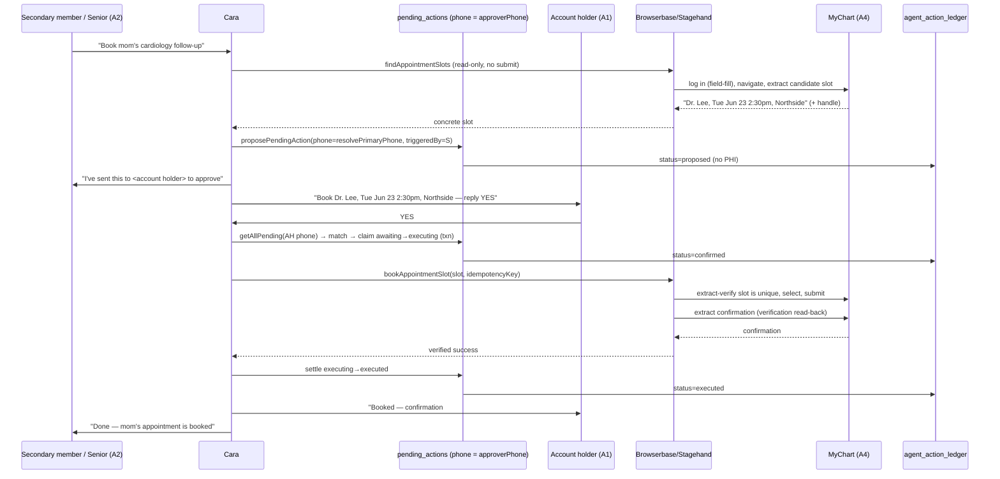
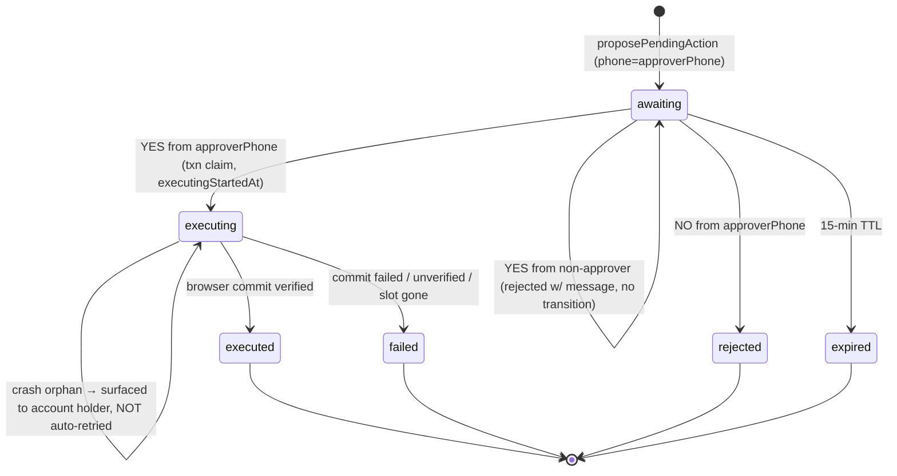

# feat: Cara Real-World Healthcare Handler — Trust Layer Over Existing Browser Actions

## Summary

Cara already has coded browser actions (Browserbase + Stagehand) that can act on real healthcare portals on a family's behalf — book a doctor appointment, refill a prescription, check insurance authorization (`functions/src/browser/careWebActions.ts`). Today those write actions commit **autonomously** and are not gated at all. This plan wraps them in a **propose→confirm→execute trust layer**: Cara states the exact real-world action over SMS, the **account holder** approves, and only then does Cara execute — exactly once, with a post-commit verification read-back and full audit trail. It reuses the rebuild's existing pending-action gate and the repo's claim/settle idempotency thinking rather than inventing a parallel approval path. The capability ships behind a rollout flag; compliance rests on the existing GCP BAA plus the revocable-consent credential flow, gated by a pre-launch checklist.

The work is a **trust layer over capability that already exists** — not new browser capability.

> **Deepening note (2026-06-16):** A feasibility + security + scope review pass found one critical correctness bug (cross-phone reply matching, now fixed in KTD-3/U4) and several high-severity gaps (slot re-identification, executing-orphan recovery, plaintext credential injection, audit PHI). All are integrated below. The findings most worth re-reading before coding: KTD-3, KTD-4, U4, U5, U6, and the new U10.

---

## Problem Frame

Adult children managing an aging parent's care drop tedious logistics: booking the follow-up, getting the refill in before it runs out, confirming a procedure is covered. The browser-automation infrastructure to do these already exists, but two things block it from being a trustworthy product:

1. **The write actions commit autonomously.** `scheduleDoctorAppointment` logs in, picks a slot "closest to preferred date or as soon as possible," and submits — with no family approval of the specific date/time. For senior healthcare a silently-committed appointment or refill is a liability and a trust breaker. Research confirms `perform_web_action` (the MCP tool fronting these) is in **neither** the `ALWAYS_CONFIRM` nor `CONDITIONAL_CONFIRM` set in `functions/src/agents/pendingActions.ts` — it is ungated today.
2. **The "exact thing" to confirm doesn't exist before commit (appointments).** The slot is chosen *inside* the same Stagehand session as the commit (`act("…select an available slot…")` immediately followed by `act("Confirm and submit the appointment")`). There is no seam to show the family a specific date/time before booking, and the slot has no stable cross-session handle.

The fix is a gate plus the seams needed to honor it.

---

## Requirements

Carried from the origin requirements doc (see origin: `docs/brainstorms/2026-06-16-cara-realworld-healthcare-handler-requirements.md`).

- **R1 — No autonomous commits.** No book/refill/submit without prior approval from the account holder. Read-only lookups (insurance auth status, slot listing) may run without approval, subject to the access policy in KTD-8.
- **R2 — Propose with exact specifics.** The confirmation SMS states the precise committed action: provider/date/time/location for appointments; medication/Rx and pharmacy for refills.
- **R3 — Reuse the existing confirmation gate** (`proposePendingAction` / `buildPendingActionStub` / approval handler), not a parallel path.
- **R4 — Single approver = account holder.** A confused or targeted senior cannot self-approve a committing action in v1.
- **R5 — Explicit, revocable credential consent.** Storing portal logins requires explicit family opt-in with clear scope; credentials stay in the existing encrypted vault and can be revoked.
- **R6 — Clear failure surfacing, never silent.** Portal failures or ambiguity (slot gone, multiple matches, login failed) are reported plainly; never silent, never an arbitrary pick on ambiguity.
- **R7 — No double-execution.** A confirmed action executes exactly once even under duplicate confirmation/retry delivery.
- **R8 — Auditability.** Every proposed/approved/executed/failed action is logged for family and admin visibility (PHI-minimized per KTD-9).
- **R9 — Three actions in v1.** Appointment booking, pharmacy refill, insurance-auth check, each behind the same gate (insurance check is the read-only R1 exception).

---

## Key Technical Decisions

- **KTD-1 — Gate `perform_web_action` write variants via the existing pending-action mechanism.** Add `perform_web_action` to `CONDITIONAL_CONFIRM` in `functions/src/agents/pendingActions.ts`, keyed on `input.loginAction`: gate `schedule_appointment` and `pharmacy_refill`; **do not** gate `insurance_check` (read-only, R1 exception). The high-risk gate in `handleToolCall` (`functions/src/mcp/server.ts`) already runs before the `perform_web_action` dispatch, so this is set membership, not a new gate path. *(see origin R1, R3)*
- **KTD-2 — Two-pass appointment booking with verified slot re-identification.** Split `scheduleDoctorAppointment` into a read-only **discovery** pass (`findAppointmentSlots` — log in, navigate, extract concrete candidate slot(s), **no submit**) and a **commit** pass (`bookAppointmentSlot` — re-locate and select the approved slot, then submit). Because a rendered slot description is **not** a stable cross-session selector (MyChart slots are ephemeral AJAX results), the commit pass must `extract`-verify that exactly one slot matches the approved {provider, location, ISO datetime}; if 0 or >1 match, fail to `slot_unavailable`/`slot_ambiguous` and surface to the family rather than picking. Refill and insurance need no split. Accepts ~2 Browserbase sessions per booking as the cost of true R2 fidelity. *(User-confirmed call-out; origin R2, R6; feasibility Finding 1)*
- **KTD-3 — Account-holder approval routing via approver-keyed pending docs.** Add an `approverPhone` and a `triggeredByPhone` field to `PendingAction`. For a healthcare write action, resolve the account holder's phone, set the doc's **primary `phone` field to `approverPhone`** (so the existing `getAllPending(senderPhone)` query matches when the account holder replies) and record the requester in `triggeredByPhone`. Send the proposal SMS to `approverPhone`; on a YES from a non-approver, do not transition and return the existing "only the primary account holder can…" message. If the account holder cannot be resolved (no `userId`/no primary), **fail closed** — refuse and tell the requester to have the account holder text Cara directly (never fall back to the triggering phone, which would re-open AE3). `familyGroupManager.resolvePrimaryPhone` must be **exported** (currently module-private, `userId`-keyed). *(User-confirmed call-out; origin R4, AE3; feasibility/scope Finding 3/5 — this was a SEV-100 correctness bug in the first draft)*
- **KTD-4 — Exactly-once via claim-before-dispatch, with a defined orphan contract.** Transition the pending action `awaiting → executing` inside a `runTransaction` (early-return if not `awaiting`) **before** dispatching the browser commit, recording `executingStartedAt`; settle to `executed`/`failed` after. The pending-action id is carried as an idempotency key, **but the portal has no idempotency primitive** — so a stuck `executing` doc (crash between claim and settle) must **never** be blindly auto-retried. Recovery re-reads the portal (KTD-5 verification) to detect whether the prior attempt committed before deciding anything; a stale `executing` action is surfaced to the account holder ("I started this but couldn't confirm it went through — reply REFRESH"), not silently reclaimed. Mirrors `claimWebhookEvent`/`settleWebhookEvent` and `shiftOffer.ts` `claimOffer`. *(see origin R7; feasibility Finding 2; scope Finding 1)*
- **KTD-5 — Commit verification read-back + bounded session (correct primitive).** After the commit `act`, re-read the portal via `extract` to verify the action committed (confirmation number / refill-accepted state) before reporting success. Bound the session with a `Promise.race([sessionWork, timer])` that calls `closeBrowserSession(session)` on timeout, plus Playwright `page.setDefaultTimeout` — **not** `fetchWithTimeout`, which wraps `fetch()` and cannot attach to Stagehand `act`/`extract` (CDP over playwright-core). Never report "booked"/"refilled" on an unverified or merely-pending state; report "submitted, awaiting confirmation" instead. *(see origin R6, OQ3; feasibility Finding 4)*
- **KTD-6 — Audit through `logAgentAction`.** Standardize the proposed/confirmed/executed/failed lifecycle on `functions/src/observability/actionLedger.ts` (its status enum already matches), keeping `browser_sessions` as the browser-layer post-execution sink. *(see origin R8)*
- **KTD-7 — Compliance + rollout posture.** Platform is HIPAA-covered via the GCP BAA; consent is the existing revocable credential opt-in (R5). No new compliance scaffolding is built; a documented pre-launch sign-off checklist closes OQ1. The whole capability ships behind a rollout flag, independent of compliance. *(user decision on OQ1)*
- **KTD-8 — Read-only insurance access is account-holder-scoped by default.** The ungated insurance check (R1 exception) still reads a senior's full coverage/claims data using stored credentials. To prevent a secondary member fishing a senior's health data without consent, restrict `insurance_check` to the account holder by default; a secondary member's request is refused with a "ask the account holder" message unless the account holder has explicitly authorized health-data access for that member. *(security Finding 4)*
- **KTD-9 — PHI minimization in the audit ledger.** `agent_action_ledger` is admin-readable (`firestore.rules`). Do **not** write medication or provider names into its `metadata`; store only non-identifying action codes (`loginAction`, `pharmacy: "cvs"`, the pending-action id). PHI-carrying detail lives only in `browser_sessions` (function/admin-only, `allow read: if false`). *(security Finding 3)*
- **KTD-10 — Credentials never transit the LLM prompt.** Replace the `act("Log in with username \"…\" password \"…\"")` pattern (which sends plaintext credentials to the model and risks capture in Browserbase session recordings) with Playwright field-targeted `page.fill()`, and configure Browserbase session-recording scrubbing for credential inputs before the flag goes on. *(security Finding 2 — High)*

---

## High-Level Technical Design

### F1 — Confirmed appointment booking, secondary-member request (the hardest flow)



If the senior (not the account holder) replies YES, Cara does **not** execute and re-routes to the account holder (AE3). If the slot is gone or ambiguous at commit, or login fails, Cara surfaces it and offers to re-find/refresh — never reports success (AE4, R6).

### Pending-action lifecycle (gated write action)



---

## Output Structure

New files this plan introduces (existing files are modified in place):

```
functions/src/
├── browser/
│   ├── careWebActions.ts          (modify: split appointment, field-fill login, verify read-back)
│   ├── browserbaseClient.ts       (modify: session timeout bound, recording scrub)
│   └── __tests__/
│       └── appointmentTwoPass.test.ts        (new)
├── agents/
│   ├── pendingActions.ts          (modify: gate + approverPhone + claim-first + preview)
│   ├── approvalHandler.ts         (modify: approver-only accept, claim/settle, real failure surfacing)
│   ├── familyGroupManager.ts      (modify: export resolvePrimaryPhone)
│   └── __tests__/
│       └── healthcareActionGate.test.ts      (new)
└── config/
    └── featureFlags.ts            (new or extend: realWorldHealthcareActions flag)
docs/runbooks/
└── healthcare-action.md           (new: stuck-state recovery / verification / refund)
firestore.indexes.json             (modify: index for approver-keyed pending query if needed)
```

---

## Implementation Units

### U1. Gate the write browser actions behind the confirmation gate

**Goal:** No appointment booking or pharmacy refill commits without a prior approval; insurance check stays read-only and (account-holder-scoped) ungated.

**Requirements:** R1, R3, R9, KTD-8.

**Dependencies:** none (entry point).

**Files:**
- `functions/src/agents/pendingActions.ts` (modify — add `perform_web_action` to `CONDITIONAL_CONFIRM`, keyed on `loginAction`)
- `functions/src/mcp/server.ts` (verify the `handleToolCall` gate intercepts the write variants and returns the stub; confirm `handleToolCallForCaregiver` short-circuits portal logins; confirm `_confirmedActionId` bypass)
- `functions/src/agents/__tests__/healthcareActionGate.test.ts` (new)

**Approach:** Add a `CONDITIONAL_CONFIRM["perform_web_action"]` predicate returning true when `loginAction` is `schedule_appointment` or `pharmacy_refill`, false for `insurance_check`. Add the KTD-8 account-holder scoping check for `insurance_check`.

**Patterns to follow:** existing `CONDITIONAL_CONFIRM` predicates and the `isHighRisk` switch in `pendingActions.ts`.

**Test scenarios:**
- Covers AE1. `schedule_appointment` with a phone → returns a pending-action stub, does **not** call the browser action.
- `pharmacy_refill` → gated (stub, no commit).
- Covers AE5. `insurance_check` by the account holder → not gated, runs read-only immediately.
- `insurance_check` by a secondary member without health-data authorization → refused with "ask the account holder" (KTD-8).
- `perform_web_action` with no `phone` → `PERMISSION_DENIED`.
- `schedule_appointment` in a caregiver context (`handleToolCallForCaregiver`) → `_toolError` "not available for caregivers", not a pending stub.
- `_confirmedActionId` present → bypasses the gate and dispatches exactly once.

**Verification:** A booking/refill request produces a confirmation prompt and zero browser commits until approval; insurance checks answer directly only for authorized requesters.

---

### U2. Action-specific confirmation previews (exact specifics)

**Goal:** The confirmation SMS states the precise action — provider/date/time/location, or medication/Rx/pharmacy.

**Requirements:** R2.

**Dependencies:** U1, **U3** (the appointment preview renders U3's discovered-slot shape).

**Files:**
- `functions/src/agents/pendingActions.ts` (modify — add `perform_web_action` cases to `buildActionPreview`)
- `functions/src/agents/__tests__/healthcareActionGate.test.ts` (extend)

**Approach:** Add `buildActionPreview` cases branching on `loginAction`. For `schedule_appointment`, render the discovered slot (provider, date/time, location) from U3's stored `chosenSlot`. For `pharmacy_refill`, render medication/Rx and pharmacy. Replaces the generic ``${toolName} (irreversible)`` fallback (R2 violation).

**Patterns to follow:** the existing `buildActionPreview` switch.

**Test scenarios:**
- Covers AE1. Appointment preview includes provider, date/time, location.
- Refill preview includes medication (or Rx) and pharmacy.
- Missing optional fields degrade gracefully (no "undefined" in the SMS).

**Verification:** The proposal SMS names the specific thing being approved.

---

### U3. Two-pass appointment booking with verified slot re-identification

**Goal:** Produce a concrete, re-locatable slot to confirm before any commit, and commit exactly that slot after approval.

**Requirements:** R2, R6.

**Dependencies:** U1.

**Files:**
- `functions/src/browser/careWebActions.ts` (modify — split into `findAppointmentSlots` (read-only) and `bookAppointmentSlot` (commit); login via field-fill per KTD-10)
- `functions/src/mcp/server.ts` (modify — `schedule_appointment` dispatch: discovery on first call, commit on confirmed call carrying `chosenSlot`)
- `functions/src/browser/__tests__/appointmentTwoPass.test.ts` (new)

**Approach:** `findAppointmentSlots` runs login + navigate + slot-search and `extract`s a concrete candidate slot (provider, location, ISO datetime, and any portal-native handle/URL available) **without** the submit `act`. The chosen slot is stored on the pending action's `toolInput.chosenSlot`. `bookAppointmentSlot` re-enters, **`extract`-verifies exactly one slot matches** the approved {provider, location, ISO datetime} (fail to `slot_unavailable` on 0, `slot_ambiguous` on >1 — no silent re-pick), selects it, submits, and verifies (U6). Refill remains single-pass; insurance unchanged. Note MyChart's reason-for-visit/insurance interstitials: discovery must stop cleanly before any step that soft-holds a slot.

**Technical design (directional, not implementation spec):** the MCP dispatch decides discovery-vs-commit by presence of `_confirmedActionId` + a `chosenSlot` field on the input.

**Patterns to follow:** the existing Stagehand `act`/`extract` sequence; the `needsCredentials` early-return convention.

**Test scenarios:**
- Discovery extracts a slot and does **not** invoke the submit `act`.
- Commit re-verifies a unique match, selects the stored slot, submits exactly once.
- Covers AE4. Slot gone at commit → `slot_unavailable`, no submit, surfaced.
- Commit-time ambiguity (>1 match for the approved slot) → `slot_ambiguous`, no submit (R6).
- Discovery-time ambiguity (multiple doctors) → returns ambiguity, does not pick.
- `needsCredentials` on discovery → routes to credential onboarding (U7) before proposing.

**Verification:** A booking confirmation names a real, available slot; the committed appointment matches the approved slot or the family is told it couldn't be booked.

---

### U4. Account-holder approval routing (approver-keyed pending docs)

**Goal:** Only the account holder can approve a committing action; the account holder's YES reliably matches the pending doc even when a secondary member triggered it.

**Requirements:** R4, AE3.

**Dependencies:** U1, U2, U7 (shares the `userId`-resolution fail-closed path).

**Files:**
- `functions/src/agents/pendingActions.ts` (modify — add `approverPhone` + `triggeredByPhone` to `PendingAction`; set `phone = approverPhone` for healthcare write actions in `proposePendingAction`)
- `functions/src/agents/approvalHandler.ts` (modify — reject a YES from a non-`approverPhone` sender)
- `functions/src/agents/familyGroupManager.ts` (modify — **export** `resolvePrimaryPhone`)
- `functions/src/linq/webhooks.ts` (modify — proposal SMS to `approverPhone`; requester-side completion notice via `triggeredByPhone`)
- `functions/src/agents/__tests__/healthcareActionGate.test.ts` (extend)

**Approach:** Resolve the account holder phone via the exported `resolvePrimaryPhone`. Set the pending doc's `phone` field to `approverPhone` so the existing `getAllPending(senderPhone)` query matches when the account holder replies — **this is the fix for the SEV-100 cross-phone bug**: the doc must be findable under the approver's phone, not the requester's. Record `triggeredByPhone` for the requester completion notice. If the triggering session differs from the account holder, send the proposal to `approverPhone` and tell the requester it was routed. If `resolvePrimaryPhone` returns undefined (no `userId`/no primary), fail closed — refuse, do not fall back to the triggering phone. On terminal success/failure, also notify `triggeredByPhone`.

**Patterns to follow:** secondary-member rejection in `routeClient.ts` (shift-hours) and `routeIntent.ts` (family add/remove); `resolvePrimaryPhone`.

**Test scenarios:**
- Covers AE3. Senior replies YES → not executed; proposal was routed to the account holder; account holder's YES executes.
- Account-holder-triggered request → in-conversation propose→confirm (no cross-phone hop).
- Secondary triggers → proposal to account holder; account holder's YES **matches the pending doc** and executes; requester gets a completion notice.
- Non-approver YES → "only the primary account holder" message; status stays `awaiting`.
- `resolvePrimaryPhone` undefined → action refused, nothing proposed (no triggering-phone fallback).

**Verification:** No committing action executes on a non-account-holder's approval, and the account holder's YES is never silently dropped.

---

### U5. Idempotent exactly-once execution (claim-before-dispatch + orphan contract)

**Goal:** A confirmed action commits exactly once even under duplicate YES/retry, and a crash mid-commit cannot cause a double booking.

**Requirements:** R7, AE2.

**Dependencies:** U1, U4.

**Files:**
- `functions/src/agents/approvalHandler.ts` (modify — claim `awaiting → executing` in a transaction before dispatch; settle after; strip `_confirmedActionId` from any LLM-generated tool input, accept it only from this direct call)
- `functions/src/agents/pendingActions.ts` (modify — add `executing` to the status enum; `claimPendingAction` helper recording `executingStartedAt`)
- `functions/src/browser/careWebActions.ts` (accept an idempotency key)
- `functions/src/agents/__tests__/healthcareActionGate.test.ts` (extend)

**Approach:** Replace dispatch-then-resolve with claim-then-dispatch-then-settle. `claimPendingAction(id)` runs a `runTransaction`, transitions only from `awaiting`, records `executingStartedAt`. On a duplicate YES the second claim finds `executing`/`executed` and no-ops. **Orphan contract (KTD-4):** a stale `executing` doc is never blindly retried; recovery uses U6's verification read-back to check whether the portal already committed, and otherwise surfaces to the account holder. **Prompt-injection guard:** `_confirmedActionId` arriving on an LLM-generated tool input (e.g., injected via extracted portal text) is stripped at the gate boundary; only `approvalHandler`'s direct dispatch may set it.

**Patterns to follow:** `claimWebhookEvent`/`settleWebhookEvent` (`functions/src/utils/webhookLedger.ts`); `shiftOffer.ts` `claimOffer`; the remediation plan's crash-between-claim-and-settle guidance.

**Test scenarios:**
- Covers AE2. Two YES racing → exactly one commit; second no-ops.
- Claim on an already-`executing` action → no second dispatch.
- `_confirmedActionId` on an LLM-synthesized tool input → stripped, action re-gated (no bypass).
- Settle to `failed` leaves the action terminal, not re-runnable on a stray retry.
- Stale `executing` (simulated crash) → not auto-retried; surfaced to account holder.

**Verification:** Duplicate confirmations and injected bypass attempts never produce a second booking/refill.

---

### U6. Bounded browser session + commit verification read-back

**Goal:** Never report success unless the portal confirms it; never let a session hang; serve as the reconciliation primitive for orphan recovery.

**Requirements:** R6, OQ3.

**Dependencies:** U3, U5.

**Files:**
- `functions/src/browser/careWebActions.ts` (modify — verification `extract` after commit; classify verified/unverified/failed)
- `functions/src/browser/browserbaseClient.ts` (modify — `Promise.race` session timeout that calls `closeBrowserSession`; `page.setDefaultTimeout`)
- `functions/src/browser/__tests__/appointmentTwoPass.test.ts` (extend)

**Approach:** After the commit `act`, run a verification `extract` (confirmation number for appointments; refill-accepted/ready state for refills). Map to `verified_success` (has evidence), `unverified` (committed, no evidence → "submitted, awaiting confirmation"), or `failed`. Bound the session with `Promise.race([sessionWork, timer])` aborting via `closeBrowserSession`, plus Playwright `page.setDefaultTimeout` — not `fetchWithTimeout`. The same verification read is reused on orphan recovery (U5) to detect a prior commit before any retry.

**Patterns to follow:** the existing post-commit `extract` calls; `closeBrowserSession` in the `finally` block.

**Test scenarios:**
- Commit with confirmation number → `verified_success`, "booked, #…".
- Commit succeeds, no evidence → `unverified`, "submitted, awaiting confirmation" (not "booked").
- Session exceeds timeout → aborts via `closeBrowserSession`, returns failure, surfaced (no hang).
- Login failure mid-session → `failed` with the real reason, offers credential refresh.

**Verification:** A "booked"/"refilled" message is only sent when portal evidence supports it.

---

### U7. Credential consent + userId fail-close + input validation

**Goal:** First portal use runs the consent flow; the action layer reliably has a `userId`; collected credentials are sanity-checked. (The username/password question-guards already exist — verify, don't re-implement.)

**Requirements:** R5, F4.

**Dependencies:** U1.

**Files:**
- `functions/src/browser/credentialCollector.ts` (modify — add a min-length/char-class sanity check before `storeCredential`; verify the consent-scope message precedes the first prompt)
- `functions/src/linq/routeClient.ts` (verify credential-reply hook ordering)
- `functions/src/browser/careWebActions.ts` / `functions/src/mcp/server.ts` (fail-closed with a clear message when no `userId` is resolvable for a portal action)
- `functions/src/browser/__tests__/credentialCollector.test.ts` (extend)

**Approach:** The `isCredentialReply`/`answerCredentialQuestion` guards already cover questions at both steps and fail closed (confirmed in research) — **verify** this coverage rather than adding redundant guards. Net-new work: (1) fail closed when a portal action has no resolvable `userId` (vault is `userId`-keyed; phone-only sessions are the CLAUDE.md known follow-up); (2) reject obviously-wrong collected passwords (min length / char class) before `storeCredential`; (3) assert the consent-scope message precedes the first credential prompt.

**Patterns to follow:** the existing `handleCredentialReply` flow; CLAUDE.md `isQuestionOrOther` + `parseWithClaude` checklist.

**Test scenarios:**
- Existing: a question at the username/password step → answered, re-asked, nothing stored (regression-guard the existing behavior).
- Consent-scope message precedes the first credential prompt.
- Action invoked with no resolvable `userId` → clear failure, no silent miss.
- Collected "password" failing the sanity check → rejected, re-prompted.
- Revocation ("delete my CVS login") removes the credential.

**Verification:** No credential is populated from a question or garbage; consent is explicit and revocable; portal actions never run without a `userId`.

---

### U8. Audit lifecycle via `logAgentAction` (PHI-minimized)

**Goal:** Every proposed/confirmed/executed/failed action is logged, without writing PHI to the admin-readable ledger.

**Requirements:** R8, KTD-9.

**Dependencies:** U1, U4, U5, U6.

**Files:**
- `functions/src/agents/pendingActions.ts` (log `proposed`)
- `functions/src/agents/approvalHandler.ts` (log `confirmed`, `executed`, `failed`)
- `functions/src/observability/actionLedger.ts` (reuse; confirm normalized fields/TTL per remediation U13)
- `functions/src/agents/__tests__/healthcareActionGate.test.ts` (extend)

**Approach:** Emit `logAgentAction({ actionType: "healthcare_action", status, toolName, targetDocId: pendingActionId, metadata: { loginAction, pharmacy?/portalService } })` at each transition — **no medication or provider names** in `metadata` (KTD-9). PHI-carrying detail stays in `browser_sessions` (function/admin-only). Coordinate field/TTL with remediation U13 so records render in `components/admin/AuditTrail.tsx`.

**Patterns to follow:** `logAgentAction` usage in `routeClient.ts` (shift-hours approve/dispute).

**Test scenarios:**
- Propose → one `proposed` entry; no provider/medication string in `metadata`.
- Approve+execute → `confirmed` then `executed` with the same `targetDocId`.
- Failed commit → `failed` with `errorReason`.
- Non-approver rejection emits no `executed`.

**Verification:** The admin audit trail shows the full lifecycle; no medication/provider PHI is in the ledger.

---

### U9. Feature flag + pre-launch compliance/portal/cost checklist

**Goal:** Ship dark behind a flag; document the launch gate that closes OQ1/OQ4/OQ5/OQ6.

**Requirements:** OQ1/OQ4/OQ5/OQ6 closure; rollout safety.

**Dependencies:** U1–U8, U10.

**Files:**
- `functions/src/config/featureFlags.ts` (new or extend — `realWorldHealthcareActions` flag)
- `functions/src/mcp/server.ts` / `functions/src/agents/pendingActions.ts` (gate the capability on the flag)
- `docs/runbooks/healthcare-action.md` (new — stuck-`executing` recovery, verification, refund/fallback, mirroring `docs/runbooks/caregiver-callout.md`)

**Approach:** Default the flag off; flag-off returns the existing "coming soon" message (the `requiresLogin` pattern in `performBrowserAction`). Document the pre-launch checklist: compliance sign-off (BAA + consent scope), supported launch portal list (OQ4), Browserbase cost guardrails (OQ5 — per-action budget, two-pass premium), and the approver-identity decision (OQ6 — whether a confirmation delay / out-of-band notice is required before launch). The runbook covers stuck-`executing` recovery and ambiguous/failed portal actions.

**Patterns to follow:** existing feature-flag usage; `docs/runbooks/caregiver-callout.md` structure.

**Test scenarios:** Test expectation: limited — flag-off returns the coming-soon message and does not propose/commit; flag-on enables the gated flow. (Checklist/runbook are docs, no behavioral test.)

**Verification:** With the flag off, nothing can be proposed or executed; the launch checklist exists and is reviewed before flip.

---

### U10. Credential handling hardening (no plaintext through the LLM)

**Goal:** Portal credentials never appear in an LLM prompt string or an unscrubbed session recording.

**Requirements:** R5 (security posture); security Finding 2 (High).

**Dependencies:** U3 (shares the login path refactor).

**Files:**
- `functions/src/browser/careWebActions.ts` (modify — replace the three `act("Log in with username … password …")` calls with Playwright field-targeted `page.fill()`)
- `functions/src/browser/browserbaseClient.ts` (modify — configure session-recording scrubbing for credential input fields)
- `functions/src/browser/__tests__/appointmentTwoPass.test.ts` (extend — assert no credential string is passed to `act`)

**Approach:** Locate the username/password inputs and `page.fill()` them directly; the password value never enters a Stagehand `act` instruction (which is sent to Claude Sonnet 4.6 and may surface in recordings). Enable Browserbase recording redaction for those fields. This is a prerequisite for flipping the U9 flag.

**Patterns to follow:** existing Playwright `page` usage in `browserbaseClient.ts`.

**Test scenarios:**
- Login step uses `page.fill`, and no `act` call argument contains the password (assert on the mock).
- Recording scrub config is set on session creation.

**Verification:** Grep/mocks confirm no credential value is ever passed through `stagehand.act`.

---

## Risks & Dependencies

- **Phone-as-identity is the v1 trust boundary (security, High).** A stolen/SIM-swapped account-holder phone can approve healthcare actions, and routing-to-account-holder routes to the attacker's device. v1 has no second factor. Tracked as OQ6; a lightweight mitigation (short CANCEL window + out-of-band notice on execution) is a candidate before flag-flip. The rollout flag and account-holder scoping limit blast radius but do not close this.
- **Two-pass cost & slot staleness (KTD-2).** ~2 Browserbase sessions per booking; the discovered slot can vanish or duplicate before commit. Mitigated by U3's unique-match verification and `slot_unavailable`/`slot_ambiguous` surfacing — expect a real rate of "that slot was taken."
- **Stuck-`executing` orphan (KTD-4/U5).** A crash between claim and settle leaves a doc invisible to routing and unreported. v1 has **no automated recovery** — it is surfaced via the runbook and an account-holder notice; this is an accepted v1 risk.
- **Session-abort cleanup (U6).** A timed-out session aborted via `closeBrowserSession` may leave a Browserbase session in an indeterminate billed state; acceptable behind the flag, noted as a known gap.
- **Stagehand reliability on auth-walled portals.** Layout drift breaks login/navigation (AE4). U6 verification + the runbook are the safety net; acceptable success rate (OQ3) set during rollout.
- **`userId` vs phone-keyed sessions.** The vault and approver-routing both depend on a resolvable `userId`; U4 and U7 fail closed. The identity-unification follow-up is out of scope.
- **Coordination with the in-flight remediation branch.** Audit-trail field/TTL/index/rules (remediation U13) and the claim/settle ledger (U12/U15) change on this same branch — coordinate field shapes and the new pending-query index.
- **Depends on** the encrypted credential vault, credential collector, and Browserbase secrets (`BROWSERBASE_API_KEY`, `BROWSERBASE_PROJECT_ID`, `CREDENTIAL_VAULT_KEY`) — all present and wired.

---

## Scope Boundaries

### In scope
Appointment booking, pharmacy refill, and insurance-auth check, all governed by propose→confirm→execute (insurance read-only, account-holder-scoped), single approver = account holder, revocable consent credentials, failure surfacing with verification read-back, exactly-once execution with an orphan contract, credential-handling hardening, PHI-minimized audit logging, and a rollout flag.

### Deferred to Follow-Up Work (plan-local sequencing)
- Per-portal expansion beyond the coded set (MyChart + CVS/Walgreens/RiteAid + the generic insurer URL) — scope after launch metrics.
- Stripe/Checkr agent-native reconciliation tooling (the CLI Printing Press candidate) — separate track, already noted in the remediation plan's deferred work.
- Automated orphan reconciliation for stuck-`executing` actions (v1 is manual via runbook).

### Deferred for later (from origin)
- **Scam-checker capability** ("forward it to Cara, is this a scam?") — the strong second face; parked as the next wedge.
- **Per-account approver configuration** (senior / adult-child / both-must-approve) — v1 fixes the default to account holder (R4).
- **Proactive healthcare logistics** — Cara initiating refills/appointments from due-date signals rather than only on request.

### Outside this product's identity (from origin)
- Live phone-call blocking/screening (carrier-level).
- Bank-account/transaction monitoring (Plaid-class; liability we won't take on).
- Off-platform *caregiver* sourcing/matching (decided against — dilutes the vetted-caregiver moat).

---

## Open Questions

- **OQ1 (regulatory/liability) — resolved for build.** HIPAA-covered via the GCP BAA; consent is the revocable credential opt-in. Final compliance sign-off is a U9 pre-launch checklist item.
- **OQ3 (portal reliability) — partially addressed.** U6 defines the verification read-back; acceptable success rate and per-portal proof-of-commit are tuned during rollout.
- **OQ4 (action coverage).** Launch portal list confirmed in U9.
- **OQ5 (cost).** Per-action Browserbase budget and the two-pass premium captured as U9 guardrails.
- **OQ6 (approver identity) — new, from security review.** Is phone-as-sole-identity acceptable for committing healthcare actions, or does v1 require a second factor / CANCEL window / out-of-band execution notice? Decide before flag-flip (U9).
- **OQ2 (per-account approver).** Deferred; v1 is account-holder-only.

---

## Acceptance Examples → Coverage

- **AE1** (propose specific slot, no reply → nothing booked) → U1, U2.
- **AE2** (duplicate inbound → refill submitted exactly once) → U5.
- **AE3** (senior replies YES → not executed, routed to account holder, holder's YES matches) → U4.
- **AE4** (portal login fails → reports failure, offers refresh, not success) → U3, U6.
- **AE5** (coverage question → answered without approval, account-holder-scoped) → U1, KTD-8.

---

## Sources & Research

- Origin requirements: `docs/brainstorms/2026-06-16-cara-realworld-healthcare-handler-requirements.md`.
- Code research (this session): `careWebActions.ts`, `browserbaseClient.ts`, `pendingActions.ts`, `approvalHandler.ts`, `familyGroupManager.ts`, `mcp/server.ts`, `credentialVault.ts`, `credentialCollector.ts`, `observability/actionLedger.ts`. Confirmed `perform_web_action` is ungated; appointment slot is chosen inside the commit session with no stable handle; the gate proposes/accepts on the *triggering* phone (cross-phone bug); credentials are injected into `act()` prompt strings; question-guards already exist in `credentialCollector.ts`.
- Deepening review (this session): feasibility, plan-level security, and scope reviewers. Critical fix integrated — approver-keyed pending docs (KTD-3/U4). High-severity integrations — slot re-identification (U3), executing-orphan contract (U5), credential field-fill (U10), audit PHI minimization (U8/KTD-9), `_confirmedActionId` injection guard (U5).
- Institutional learnings: `docs/archive/CARA_CLIENT_SMS_AUDIT.md`, `docs/plans/2026-06-16-001-fix-strict-migration-review-remediation-plan.md`, ADR `docs/adr/003-caregiver-callout.md`, `docs/runbooks/caregiver-callout.md`.
- Tech stack confirmed: Browserbase (`@browserbasehq/sdk` ^2.11.0) + Stagehand (`@browserbasehq/stagehand` ^3.4.0) on `playwright-core`, Stagehand reasoning model Claude Sonnet 4.6.
- External research: intentionally skipped (settled approach, strong local patterns); OQ3 verification designed in-house in U6.
