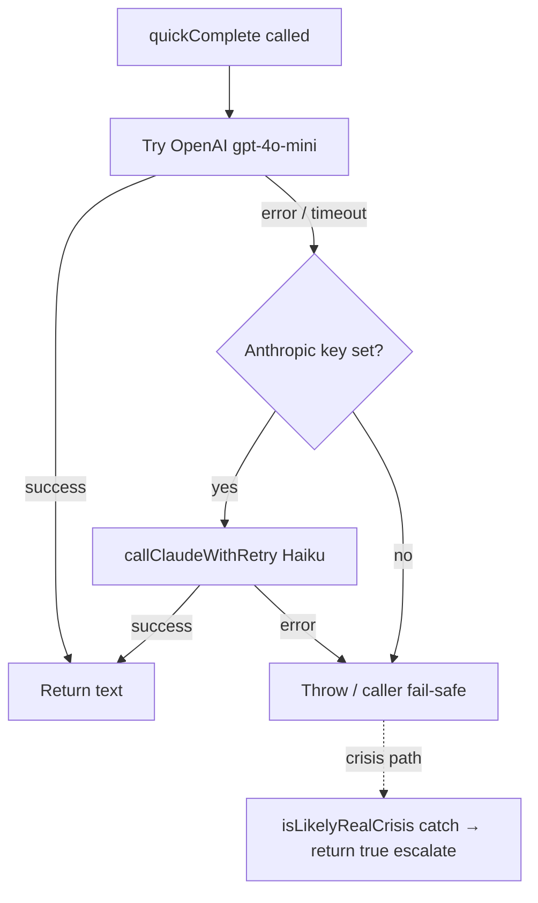
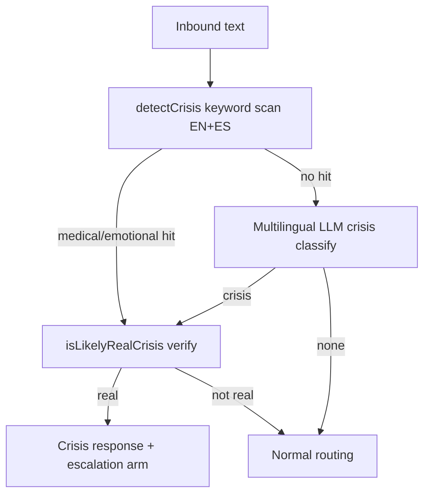
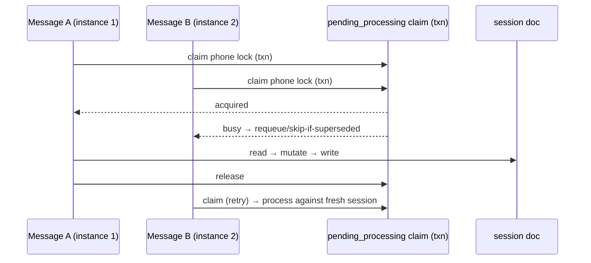

# feat: Cara Launch-Readiness Hardening

## Summary

A six-subagent review of Cara's code (the QA/MCP tool loop, inbound routing, conversational handlers, the action/approval layer, the personality/learning systems, and the safety infrastructure) found a sophisticated agent — context engineering, voice consistency, a wired memory loop, and a server-side approval gate that most products never build — with one structural problem: **safety and correctness rigor is inversely correlated with stakes.** The cheap, reversible action (cancel a reminder) is fully gated and idempotent; the highest-stakes paths (real-world healthcare execution, crisis detection in Spanish, single-provider LLM dependence) are the least protected.

This plan closes those gaps and lands the highest-leverage quality wins, taking Cara from "impressive demo" to "trustworthy, best-in-class healthcare handler ready for launch." It is organized into five dependency-ordered phases: **life-safety (P0)**, **reliability (P1)**, **rule compliance & correctness**, **best-in-class quality**, and **architecture/refactor**. The real-world healthcare-execution gate is owned by a separate, already-`ready-for-work` plan (`docs/plans/2026-06-16-002-feat-cara-realworld-healthcare-handler-plan.md`) and is folded in here as a tracked launch dependency (U0), not re-planned.

Scope was confirmed as the **full best-in-class roadmap** with healthcare folded in as a tracked dependency.

---

## Problem Frame

Cara is launching as a healthcare-adjacent SMS agent for families managing eldercare. Three classes of risk currently block a confident launch:

1. **Life-safety gaps in the highest-stakes paths.** Crisis detection is English-keyword-only, so Spanish self-harm or medical-emergency text matches nothing and the LLM verifier never runs ([functions/src/safety/crisisDetector.ts](functions/src/safety/crisisDetector.ts)). The crisis "backstop" and every `parseWithClaude` handler route only through OpenAI, so a single-provider outage degrades all of Cara at once. Emotional crises get a hotline number but no care-team escalation arm.
2. **Reliability gaps that corrupt conversation state.** There is no per-phone serialization of concurrent inbound messages, so two rapid messages from one user race on the same session doc — the root cause of wedged state, double-bookings, and lost confirmations. Inbound media is fetched and stored with no host allowlist (SSRF) or content validation. Memory only appends, accumulating contradictory health facts.
3. **Rule violations, dead high-value features, and avoidable cost.** Two conversational handlers violate the project's own mandatory Cara rules (`permissionsConversation`, `schedulingHandler`). The `wowMoments` proactive-delight feature is fully built but never invoked. The 83-tool array is re-tokenized uncached on every loop iteration.

The fix is to harden the stakes-weighted paths first, then collect the quality wins that make Cara feel best-in-class.

---

## Requirements

Derived from the review findings. Each maps to one or more implementation units.

- **R1 — No life-safety path depends on a single LLM provider.** Crisis verification and free-text parsing survive an OpenAI outage via Anthropic failover. *(U1)*
- **R2 — Crisis detection works in every supported language.** Spanish crisis text is detected and verified, not silently dropped. *(U2)*
- **R3 — Self-harm crises can escalate to a human**, consent-aware, not only to a hotline number. *(U3)*
- **R4 — One user's messages are processed in order, never concurrently on shared state.** *(U4)*
- **R5 — Inbound media is fetched and stored safely** (no SSRF, type/magic-byte validated, size-bounded). *(U5)*
- **R6 — Long-lived memory stays accurate**, superseding stale/contradictory facts and bounded in size. *(U6)*
- **R7 — Outbound sends are idempotent** against duplicate inbound delivery. *(U7)*
- **R8 — A mid-route failure never leaves a user wedged with no recovery.** *(U8)*
- **R9 — Every conversational handler obeys the mandatory Cara checklist** (`isQuestionOrOther`, `parseWithClaude`, acknowledgment) and never parses intent with `.includes()`. *(U9, U10, U11)*
- **R10 — The approval gate's safety lives in the gate, not in caller discipline.** *(U12)*
- **R11 — Cara proactively delights** (the built `wowMoments` capability is live). *(U13)*
- **R12 — The agent loop is cost- and latency-efficient** (tools cached) and **always replies** (no fragile exhausted-retry path). *(U14, U16)*
- **R13 — The agent can fully own a workflow** — no create-without-delete/update CRUD dead-ends; matching is parameterizable. *(U15, U17)*
- **R14 — Long-lived sub-agents are as resilient as the main loop** (retries, caps, bounded history). *(U18)*
- **R15 — The Cara-rule checklist is structurally enforced**, not remembered per-handler. *(U19)*
- **R16 — The improvement-over-time loop closes** (experiments produce an automated scorecard). *(U20)*
- **R17 — A path exists to converge the dual architecture** (guard cascade → MCP tool loop) without a risky big-bang. *(U21)*
- **R18 — Real-world healthcare execution is gated, exactly-once, and audited** before launch. *(U0 — tracked dependency)*

---

## Key Technical Decisions

- **KTD-1 — Cross-provider fallback at the `quickComplete` choke point, not per-caller.** `parseWithClaude` wraps `quickComplete`, and `crisisDetector.isLikelyRealCrisis` calls `quickComplete` directly, so adding an Anthropic (`callClaudeWithRetry`) fallback inside `quickComplete` ([functions/src/utils/openaiClient.ts:37](functions/src/utils/openaiClient.ts#L37)) restores the backstop for crisis verification *and* every fast-path handler in one change. Fallback triggers only on OpenAI error/timeout, preserving the ~500ms happy path. *(R1)*
- **KTD-2 — Multilingual crisis detection = Spanish keyword arrays + an always-on lightweight classifier on zero keyword hits.** Keyword arrays stay (sub-ms, life-critical speed per CLAUDE.md), extended with Spanish terms. When no keyword fires, run one multilingual `quickComplete` crisis classify before normal routing — accepting the added latency on the no-keyword path as the cost of catching paraphrased or code-switched crises the keyword list can't enumerate. The CLAUDE.md crisis-keyword exemption explicitly anticipates "the LLM can't be the only gate" — this adds the LLM as a second gate, not a replacement. *(R2)*
- **KTD-3 — Per-phone serialization via a transactional processing claim, not a global queue.** Claim a per-phone `_processing` marker in a Firestore transaction at the top of `handleInbound`; a concurrent message either waits-and-re-reads or is skipped if a newer message supersedes it. Reuses the repo's existing claim/settle idempotency pattern (`webhookLedger`, `shiftOffer.claimOffer`) rather than introducing new infrastructure. *(R4)*
- **KTD-4 — Memory reconciliation is a nightly Sonnet supersede pass, not in-turn.** Extend `consolidateMemoryForUser` with a per-file reconcile step (dedupe, supersede stale facts, cap size) so health/profile/family files stay accurate without adding latency to the live turn. *(R6)*
- **KTD-5 — `wowMoments` wires into the existing scheduled-job pattern** (alongside `nightlyMemory`/`morningBriefing`), loading a `WowContext` snapshot, sending via the interaction agent, and persisting `FireRecord`s for cooldown — DND/quiet-hours-aware. No new send path. *(R11)*
- **KTD-6 — Tools array gets `cache_control` on its last entry.** One-line change places the stable 83-tool block behind the Anthropic prompt cache, the single biggest per-iteration cost/latency win in the loop. *(R12)*
- **KTD-7 — Defense-in-depth on the approval gate, not a rewrite.** The MCP gate validates `_confirmedActionId` against the pending doc (exists, `awaiting`, unexpired, phone+tool match) so the guarantee holds even if a future caller misbehaves. Additive to the already-strong server-side gate. *(R10)*
- **KTD-8 — Architecture convergence is a guarded spike + incremental migration, never a big-bang.** U21 starts with a spike behind a flag routing one low-risk intent class through the MCP loop, measured against the guard cascade, before any broader migration. The dual architecture is explicitly tolerated through launch. *(R17)*
- **KTD-9 — The healthcare-execution gate is a launch dependency, owned elsewhere.** U0 tracks `2026-06-16-002` to completion as a hard launch gate; this plan does not duplicate its units. *(R18)*

---

## High-Level Technical Design

### Single-provider failover (U1)

### Crisis detection with multilingual gate (U2)

### Per-phone serialization (U4)

---

## Implementation Units

Units are grouped into phases. Phases are dependency-ordered; within a phase, units are largely independent unless a dependency is cited. **U0 is a tracked external dependency, not work authored in this plan.**

### Phase 0 — Tracked launch dependency

### U0. Land the real-world healthcare-execution gate
**Goal:** Ensure the propose→confirm→execute trust layer for healthcare browser actions ships before launch.
**Requirements:** R18
**Dependencies:** None (separate plan)
**Files:** Owned by `docs/plans/2026-06-16-002-feat-cara-realworld-healthcare-handler-plan.md` (touches `functions/src/agents/pendingActions.ts`, `functions/src/agents/healthcareHandler.ts`, `functions/src/browser/careWebActions.ts`, `functions/src/mcp/server.ts`).
**Approach:** Track that plan to `status: complete` as a hard launch gate. This plan's U12 (gate `_confirmedActionId` validation) is complementary defense-in-depth and should be sequenced *after* or alongside U0 to avoid churn on the same gate code.
**Test scenarios:** Owned by the referenced plan.
**Verification:** Plan `2026-06-16-002` is complete and its launch checklist signed off.

---

### Phase A — Life-safety (P0, launch-blocking)

### U1. Cross-provider LLM fallback in `quickComplete`
**Goal:** A single-provider (OpenAI) outage no longer removes the crisis backstop or breaks every `parseWithClaude` handler.
**Requirements:** R1
**Dependencies:** None
**Files:** `functions/src/utils/openaiClient.ts` (modify), `functions/src/utils/claudeClient.ts` / `functions/src/utils/claudeRetry.ts` (reuse `callClaudeWithRetry`), `functions/src/utils/__tests__/openaiClient.fallback.test.ts` (create)
**Approach:** Wrap the OpenAI call in `quickComplete`; on error/timeout and when `ANTHROPIC_API_KEY` is set, fall through to a Haiku call via `callClaudeWithRetry` mapping system+user into Anthropic message shape. Preserve the existing return contract (trimmed text). Do not retry OpenAI internally (callers own retry). Emit a metric/log on fallback activation.
**Patterns to follow:** `callClaudeWithRetry` usage in `functions/src/agents/qaAgent.ts`; existing AbortSignal handling in `quickComplete`.
**Test scenarios:**
- Happy path: OpenAI returns → Anthropic never called.
- OpenAI throws → Anthropic fallback returns text; result matches contract.
- OpenAI throws AND `ANTHROPIC_API_KEY` unset → original error propagates (caller fail-safe still works).
- Both providers throw → error propagates; `isLikelyRealCrisis` catch still returns `true` (fail-safe to crisis).
- Fallback path emits the activation metric exactly once.
**Verification:** With OpenAI mocked to fail, crisis verification and a sample `parseWithClaude` handler still return correct values.

### U2. Multilingual crisis detection
**Goal:** Spanish (and other supported-language) crisis text is detected and verified, not dropped.
**Requirements:** R2
**Dependencies:** U1 (verifier resilience)
**Files:** `functions/src/safety/crisisDetector.ts` (modify), `functions/src/safety/__tests__/crisisDetector.multilingual.test.ts` (create), caller in `functions/src/linq/webhooks.ts` (wire no-keyword classify)
**Approach:** Add Spanish `MEDICAL_KEYWORDS`/`EMOTIONAL_KEYWORDS` (e.g. "no puedo respirar", "ataque al corazón", "me quiero morir", "quitarme la vida"). On zero keyword hits, run one multilingual `quickComplete` classify (`medical` / `emotional` / `none`) before normal routing; preserve fail-safe-to-crisis on classifier error. Keep keyword scan first for sub-ms latency on the common case.
**Patterns to follow:** existing `detectCrisis` + `isLikelyRealCrisis` structure; `functions/src/utils/language.ts` for supported-language set.
**Test scenarios:**
- Covers R2. Spanish medical: "no puedo respirar" → medical, verified, terminal.
- Spanish emotional: "me quiero morir" → emotional, escalation path.
- English regression: existing keywords still fire (no behavior change).
- No keyword but paraphrased crisis ("siento que ya no puedo más") → classifier flags emotional.
- Benign Spanish ("¿cómo cancelo mi cita?") → classifier returns none → normal routing, no false crisis.
- Classifier errors on no-keyword path → fail open to caution per existing policy (does not crash routing).
**Verification:** Spanish crisis transcripts trigger the same terminal escalation as English; benign Spanish routes normally.

### U3. Emotional-crisis human-escalation arm
**Goal:** A self-harm crisis can page the care team (consent-aware), not only return a hotline number.
**Requirements:** R3
**Dependencies:** U2
**Files:** `functions/src/linq/webhooks.ts` (modify emotional branch), `functions/src/safety/crisisDetector.ts` (response copy), `functions/src/agents/__tests__/` (add escalation test)
**Approach:** Mirror the medical NOTIFY arm for emotional crises: after the 988 message, offer a consent-aware escalation ("Want me to let your care team know you're struggling?") and, on confirmation, write the guaranteed critical `admin_alerts` doc + fan out. Respect existing crisis-terminal semantics and DND critical bypass.
**Patterns to follow:** the medical NOTIFY escalation in `functions/src/linq/webhooks.ts` (clears armed flag first, writes critical alert, best-effort fan-out).
**Test scenarios:**
- Emotional crisis → 988 message + consent offer sent.
- User confirms escalation → critical `admin_alerts` doc written, care team notified.
- User declines → no alert, supportive close, conversation remains terminal for the turn.
- Escalation offer does not fire for medical crises (no double-arm).
**Verification:** A confirmed emotional escalation produces a critical alert and care-team notification; logs show `logCrisisDetected`.

---

### Phase B — Reliability (P1, launch-blocking)

### U4. Per-phone inbound serialization
**Goal:** Concurrent messages from one user never race on the same session doc.
**Requirements:** R4
**Dependencies:** None
**Files:** `functions/src/linq/webhooks.ts` (claim/release around `handleInbound`), `functions/src/utils/sessionState.ts` (claim helper), `functions/src/linq/__tests__/handleInbound.serialization.test.ts` (create), `firestore.indexes.json` if needed
**Approach:** Per KTD-3 — transactional `_processing` claim keyed by phone at the top of `handleInbound`; a concurrent message waits-and-re-reads or skips if superseded by a newer message. Release in `finally`. Bound the claim with a short TTL so a crashed instance self-heals.
**Patterns to follow:** `claimWebhookEvent`/`settleWebhookEvent` in `functions/src/utils/webhookLedger.ts`; `claimOffer` in `functions/src/agents/shiftOffer.ts`.
**Test scenarios:**
- Two concurrent messages same phone → processed serially against fresh session each time; no lost flag write.
- Concurrent messages different phones → run in parallel, no contention.
- Crash mid-claim (TTL expiry) → next message reclaims, does not deadlock.
- Superseded message (older arrives after newer processed) → skipped, not double-applied.
- Integration: rapid "cancel" then "actually keep it" no longer wedges into contradictory pending state.
**Verification:** A load test of N concurrent same-phone messages shows linear, non-conflicting state transitions.

### U5. Media-intake hardening
**Goal:** Inbound media cannot trigger SSRF or store malicious/unexpected content.
**Requirements:** R5
**Dependencies:** None
**Files:** `functions/src/utils/mediaIntake.ts` (modify `fetchBytes`/`downloadMedia`/`storeInboundMedia`), `functions/src/utils/__tests__/mediaIntake.security.test.ts` (extend)
**Approach:** Allowlist Linq/attachment hosts before fetching `url` (reject internal/loopback/metadata IPs — SSRF). Verify magic bytes match the claimed kind; reject content/extension outside the IMAGE/DOC allowlist. Keep the 25MB ceiling.
**Patterns to follow:** existing size guard in `mediaIntake.ts`; `functions/src/utils/httpTimeout.ts` for bounded fetch.
**Test scenarios:**
- Covers R5. Allowlisted host image → stored.
- Non-allowlisted/internal host (e.g. `169.254.169.254`, `localhost`) → rejected before fetch.
- `.jpg` filename carrying non-image magic bytes → rejected.
- Disallowed content-type (e.g. `application/x-msdownload`) → rejected.
- Oversized file (>25MB) → rejected (regression).
**Verification:** SSRF attempts and type-mismatched payloads are rejected; legitimate caregiver photo/doc uploads still succeed.

### U6. Memory reconciliation + size caps
**Goal:** Long-lived memory supersedes stale/contradictory facts instead of only appending.
**Requirements:** R6
**Dependencies:** None
**Files:** `functions/src/memory/memoryFiles.ts` (extend `consolidateMemoryForUser`), `functions/src/scheduled/nightlyMemory.ts` (invoke reconcile), `functions/src/memory/__tests__/memoryFiles.reconcile.test.ts` (create)
**Approach:** Per KTD-4 — add a nightly per-file Sonnet reconcile pass that dedupes, supersedes outdated facts (old med replaced by new), and enforces size caps on profile/health/family (recent_episodes already trims). Idempotent and safe to re-run.
**Patterns to follow:** existing `consolidateMemoryForUser` extraction + Zep sync; `recent_episodes` trim logic.
**Test scenarios:**
- Contradictory health facts (old + new med) → reconcile keeps current, marks/removes stale.
- Duplicate facts across nights → deduped to one.
- Profile file exceeding cap → trimmed without dropping current canonical facts.
- Reconcile is idempotent: second run on reconciled file is a no-op.
- No data loss: a unique fact present pre-reconcile is present post-reconcile.
**Verification:** After a simulated med change, the injected memory shows only the current medication; file sizes stay bounded.

### U7. Outbound send idempotency
**Goal:** A duplicate inbound delivery cannot double-send a crisis/booking message.
**Requirements:** R7
**Dependencies:** None
**Files:** `functions/src/agents/caraAgent.ts` (send path), `functions/src/utils/webhookLedger.ts` or a new `outboundLedger` (content-hash dedup), `functions/src/agents/__tests__/caraAgent.dedup.test.ts` (create)
**Approach:** Add a short-window content-hash dedup keyed by (phone, message-hash) to the send path, extending the existing low-urgency 5-minute suppression to all urgencies for exact-duplicate content. Critical messages still send, but not twice for the same inbound id.
**Patterns to follow:** existing low-urgency suppression in `caraAgent.ts`; ledger claim pattern in `webhookLedger.ts`.
**Test scenarios:**
- Same inbound delivered twice → outbound sent once.
- Distinct messages with same text minutes apart (legitimate) → still send (window-scoped, not global).
- Critical/crisis message → sends once, never suppressed to zero.
- Different content same phone → both send.
**Verification:** Replaying a duplicate Linq delivery produces exactly one outbound SMS.

### U8. Mid-route failure recovery
**Goal:** A throw mid-route never leaves a user wedged with no recovery path.
**Requirements:** R8
**Dependencies:** U4
**Files:** `functions/src/linq/webhooks.ts` (error boundary in `handleInbound`), `functions/src/linq/__tests__/handleInbound.recovery.test.ts` (create)
**Approach:** Make the `message.received` dedup-log write conditional on successful processing (or roll back turn-scoped session flags in the catch) so Linq's at-least-once retry can re-drive a failed turn instead of being suppressed. Clear any partial flags set this turn on error.
**Patterns to follow:** existing dedup write at the top of `handleInbound`; transactional patterns in `webhookLedger.ts`.
**Test scenarios:**
- Throw mid-route → session flags set this turn are cleared; dedup log not committed.
- Linq redelivers after failure → turn re-runs cleanly.
- Successful route → dedup log committed exactly once (regression).
- Throw after a legitimate side effect (e.g. booking committed) → does not roll back the committed side effect (only turn-scoped flags).
**Verification:** A forced mid-route error leaves the session in its pre-turn state and the message redeliverable.

---

### Phase C — Rule compliance & correctness (P0/P1)

### U9. `permissionsConversation` — add `isQuestionOrOther` + acknowledgments
**Goal:** Mid-flow questions on the autonomy-granting step are answered, not silently recorded as a permission denial.
**Requirements:** R9
**Dependencies:** None (benefits from U19 if sequenced after)
**Files:** `functions/src/agents/permissionsConversation.ts` (all 5 reply handlers), `functions/src/agents/__tests__/permissionsConversation.test.ts` (create)
**Approach:** Add `isQuestionOrOther` at the top of each step → answer → re-ask current question; add a one-line acknowledgment before advancing ("Got it — I'll text you before booking."). Keep the CLAUDE.md-allowed strict `norm === "YES"` binary after the explicit "Reply YES or NO" prompt.
**Patterns to follow:** `jobPostingFlow.ts` (reference implementation), `onboardingConversation.ts` `answerQuestionMidFlow`.
**Test scenarios:**
- User asks "what if I change my mind later?" mid-step → question answered, permission question re-asked, **no permission recorded**.
- "YES" after prompt → permission granted + acknowledged.
- "NO" → permission denied + acknowledged.
- Ambiguous reply → re-ask, not silently coerced to NO.
**Verification:** A mid-flow question on a permission step never mutates the permission value.

### U10. `schedulingHandler` — replace `.includes()` intent parsing
**Goal:** Reminder management intent is parsed by LLM, not keyword substring matching.
**Requirements:** R9
**Dependencies:** None
**Files:** `functions/src/agents/schedulingHandler.ts` (`handleTriggerManagement`, `handleScheduleRequest`), `functions/src/agents/__tests__/schedulingHandler.test.ts` (create)
**Approach:** Replace `norm.includes("show"|"cancel"|"delete"...)` with a `parseWithClaude`/`parseAndValidate` classify (`show | cancel | other`) and reminder-target extraction; add `isQuestionOrOther` guards.
**Patterns to follow:** `parseAndValidate` in `functions/src/utils/parseWithClaude.ts`; classify usage in `intentClassifier.ts`.
**Test scenarios:**
- "don't cancel anything" → not routed to cancel (current bug).
- "show me my reminders" → list branch.
- "cancel the 3pm med reminder" → cancel branch with correct target.
- Mid-flow question → answered, then re-ask.
**Verification:** Negation and paraphrase no longer misroute reminder management.

### U11. Fix `routeClient` emergency-contact regex parse + `webhooks` NOTIFY `.includes`
**Goal:** Remove the two remaining genuine intent-by-regex smells.
**Requirements:** R9
**Dependencies:** None
**Files:** `functions/src/linq/routeClient.ts` (emergency-contact capture), `functions/src/linq/webhooks.ts` (NOTIFY check), respective `__tests__`
**Approach:** Replace the name-vs-phone regex split in emergency-contact capture with a `quickComplete` extraction (mirroring `extractFamilyMember`). Gate the crisis NOTIFY check on `pendingCrisisNotify` + strict equality (or LLM yes/no) so "do not notify anyone" can't page the care team.
**Patterns to follow:** `extractFamilyMember` extraction; existing `pendingCrisisNotify` flag.
**Test scenarios:**
- "It's my sister Jane, 555-123-4567" → name "Jane", phone parsed correctly.
- "do not notify anyone" while NOTIFY armed → does **not** fire escalation.
- "NOTIFY" while armed → fires escalation (regression).
- Phone-format detection for validation still works (allowed use).
**Verification:** Care-team paging fires only on genuine NOTIFY intent; emergency contact names parse correctly.

### U12. Validate `_confirmedActionId` inside the MCP gate
**Goal:** The approval gate's safety lives in the gate, not in caller discipline.
**Requirements:** R10
**Dependencies:** U0 (same gate code — sequence after/with healthcare work)
**Files:** `functions/src/mcp/server.ts` (high-risk gate), `functions/src/agents/pendingActions.ts` (lookup helper), `functions/src/mcp/__tests__/` (extend)
**Approach:** Per KTD-7 — in the bypass branch, load the pending action by `_confirmedActionId` and verify it exists, is `awaiting`/claimable, unexpired, and matches the current phone + tool name before executing. Reject otherwise.
**Patterns to follow:** `resolvePendingAction` transactional lookup in `pendingActions.ts`.
**Test scenarios:**
- Valid confirmed id (right phone/tool, awaiting, unexpired) → executes.
- Forged/nonexistent id → rejected.
- Id for a different phone → rejected.
- Id for a different tool → rejected.
- Expired/already-resolved id → rejected.
**Verification:** The gate cannot be bypassed by any `_confirmedActionId` that doesn't match a live pending action for this phone+tool.

---

### Phase D — Best-in-class quality (P1/P2)

### U13. Wire `wowMoments` into a scheduled proactive job
**Goal:** Ship the built-but-dead proactive-delight capability.
**Requirements:** R11
**Dependencies:** None
**Files:** `functions/src/scheduled/wowMomentsJob.ts` (create), `functions/src/agents/wowMoments.ts` (export/adjust as needed), `functions/src/index.ts` (register schedule), `functions/src/scheduled/__tests__/wowMomentsJob.test.ts` (create)
**Approach:** Per KTD-5 — a scheduled job loads a `WowContext` snapshot per active user, calls `pickWowCandidate`, sends via the interaction agent (DND/quiet-hours-aware), and persists `FireRecord`s for cooldown dedupe. Start gated to a small cohort.
**Patterns to follow:** `functions/src/scheduled/nightlyMemory.ts` / `morningBriefing` job structure; `dndGuard` for quiet hours.
**Test scenarios:**
- Eligible user with a fresh candidate → one delight message sent, `FireRecord` written.
- Cooldown active → no send.
- Quiet hours → queued, not sent immediately.
- No candidate → no-op.
- Cohort gate off for a user → skipped.
**Verification:** A seeded eligible user receives exactly one delight message and is then on cooldown.

### U14. Prompt-cache the tools array (+ raise loop `max_tokens`)
**Goal:** Cut per-iteration cost/latency of the 83-tool loop and reduce mid-call truncation.
**Requirements:** R12
**Dependencies:** None
**Files:** `functions/src/agents/qaAgent.ts` (tools block `cache_control`; `max_tokens` 600→~1024), `functions/src/agents/__tests__/qaAgent.cache.test.ts` (assert cache_control present)
**Approach:** Per KTD-6 — add `cache_control: { type: "ephemeral" }` to the last tool definition so the stable tools block is cached alongside the system prompt. Raise loop `max_tokens` to ~1024 to reduce mid-tool-call truncation wasting an iteration.
**Patterns to follow:** existing `cache_control` on the system prompt block in `qaAgent.ts`.
**Test scenarios:**
- Test expectation: assert the request payload places `cache_control` on the tools block and system prompt; assert `max_tokens` ≥ 1024.
- Regression: a normal turn still produces a valid reply.
**Verification:** Request inspection shows tools cached; cache-read tokens appear on iteration 2+ in a live trace.

### U15. Close CRUD gaps
**Goal:** The agent can retract commitments it can create.
**Requirements:** R13
**Dependencies:** None
**Files:** `functions/src/mcp/server.ts` (add `cancel_followup`, `delete_comment`, `edit_review`), `services/api.ts` if a backing op is missing, `functions/src/mcp/__tests__/` (extend)
**Approach:** Add the missing update/delete tools so followups, journal comments, and reviews have full CRUD. Keep tool inputs primitive (`z.string()` ids), enforce ownership server-side.
**Patterns to follow:** existing reminder full-CRUD tools in `server.ts`; ownership checks on existing mutators.
**Test scenarios:**
- Create followup → `cancel_followup` removes it.
- Create comment → `delete_comment` removes only that comment.
- Submit review → `edit_review` updates it; non-owner cannot.
- Delete/edit on nonexistent id → clean error, no crash.
**Verification:** "Cancel that follow-up I just set" / "delete my last comment" succeed end-to-end via the agent.

### U16. Guaranteed final reply on the last iteration
**Goal:** Replace the fragile exhausted-retry heuristic with a deterministic reply.
**Requirements:** R12
**Dependencies:** None
**Files:** `functions/src/agents/qaAgent.ts` (loop tail), `functions/src/agents/__tests__/qaAgent.completion.test.ts` (create)
**Approach:** On the last allowed iteration (or budget exceeded), force a text-only completion (`tool_choice: { type: "none" }`) so the agent always emits a user-facing reply instead of falling into the "Give me a moment" exhausted fallback + 30s retry. Keep `stop_reason` handling for the normal case.
**Patterns to follow:** existing iteration cap + exhausted fallback in `qaAgent.ts`.
**Test scenarios:**
- Multi-tool turn hitting the iteration cap → forced final text reply, no stub + retry.
- Normal single-turn → unchanged.
- Budget exceeded mid-loop → forced reply.
- Forced reply path still checkpoints (no double-send under U7).
**Verification:** A deliberately tool-heavy prompt yields a real answer at the cap instead of "Give me a moment".

### U17. De-blackbox `find_replacement_caregivers`
**Goal:** The agent can parameterize matching instead of calling an opaque zero-arg tool.
**Requirements:** R13
**Dependencies:** None
**Files:** `functions/src/mcp/server.ts` (`find_replacement_caregivers` schema), backing matcher in `functions/src/matching.ts` / `functions/src/agents/matchingAgent.ts`, `functions/src/mcp/__tests__/` (extend)
**Approach:** Add optional primitive filter params (`needs`, `radiusMiles`, `availabilityWindow`, `nearZip`) as `z.string()`/`z.number()` with description hints; default to current behavior when omitted (API-as-validator, not enum-constrained).
**Patterns to follow:** existing parameterized search tools in `server.ts`.
**Test scenarios:**
- No params → current behavior (regression).
- `availabilityWindow: "mornings"` → results filtered accordingly.
- `nearZip` + `radiusMiles` → proximity-bounded results.
- Invalid filter value → graceful fallback, not a crash.
**Verification:** "Find only morning-available caregivers near 95020" returns an appropriately filtered set.

### U18. Harden `executionAgent` resilience
**Goal:** Long-lived sub-agents get the main loop's resilience and don't blow the Firestore doc limit.
**Requirements:** R14
**Dependencies:** None
**Files:** `functions/src/agents/executionAgent.ts` (modify), `functions/src/agents/__tests__/executionAgent.test.ts` (extend)
**Approach:** Route `runExecutionAgentTurn` through `callClaudeWithRetry`; add an iteration cap and wall-clock budget; roll up / cap `conversationHistory` so a long-lived agent doc stays under 1MB.
**Patterns to follow:** `qaAgent.ts` loop caps + `contextManagement` rollup; `claudeRetry.ts`.
**Test scenarios:**
- Transient API error → retried, not fatal.
- Iteration cap reached → terminates cleanly with a result.
- Long history → rolled up; doc stays bounded.
- Regression: a normal execution-agent turn still completes.
**Verification:** A simulated long-running matching agent stays under the doc-size limit and survives a transient API error.

---

### Phase E — Architecture / refactor (P2)

### U19. Extract a shared step-handler framework
**Goal:** The Cara-rule checklist is structurally enforced, not re-remembered per handler.
**Requirements:** R15
**Dependencies:** Sequence before/with U9, U10 to avoid double-work; safe after as a refactor
**Files:** `functions/src/agents/stepHandler.ts` (create `runStep({ guard, parse, ack, ask })` + canonical `isQuestionOrOther`), consolidate duplicate impls in `onboardingConversation.ts`, `availabilityHandler.ts`, `modifyScheduleFlow.ts`, `caregiverProfileHandler.ts`, `jobPostingFlow.ts`; `functions/src/agents/__tests__/stepHandler.test.ts` (create)
**Approach:** One canonical `isQuestionOrOther` and one `parseWithClaude` import; a `runStep` helper encoding guard→parse→ack→ask. Migrate handlers incrementally, one per commit, behind characterization tests.
**Execution note:** Characterization-first — add golden-transcript coverage for each handler before migrating it, since these are paid/regulated flows (Stripe/Checkr side effects).
**Patterns to follow:** the compliant `jobPostingFlow.ts` shape; existing `goldenTranscripts.test.ts`.
**Test scenarios:**
- `runStep` guard path: mid-flow question answered + re-ask.
- `runStep` parse+validate+ack+ask happy path.
- Each migrated handler: golden transcript identical pre/post migration.
- Parse error → fallback, no crash.
**Verification:** All migrated handlers pass their golden transcripts unchanged; duplicate `isQuestionOrOther` impls removed.

### U20. Automated experiment scorecard job
**Goal:** Close the improvement-over-time loop — experiments produce a readout instead of stalling.
**Requirements:** R16
**Dependencies:** None
**Files:** `functions/src/scheduled/experimentScorecard.ts` (create), `functions/src/index.ts` (schedule), `functions/src/agents/experimentRegistry.ts` (reference graduation gates), `functions/src/scheduled/__tests__/experimentScorecard.test.ts` (create)
**Approach:** A scheduled job aggregates `cara.turn` metrics by experiment variant and posts a weekly scorecard (per-variant outcome metrics vs. graduation gate). No new metric plumbing — it reads what `qaAgent` already logs.
**Patterns to follow:** existing scheduled-job structure; `cara.turn` metric logging in `qaAgent.ts`; gates in `experimentRegistry.ts`.
**Test scenarios:**
- Seeded turn metrics across 2 variants → scorecard reports per-variant aggregates.
- Variant meeting graduation gate → flagged as ready.
- No data for a variant → reported as insufficient sample, not a crash.
**Verification:** A week of seeded metrics yields a correct per-variant scorecard with graduation flags.

### U21. Spike: converge routing onto the MCP tool loop
**Goal:** Establish a guarded, measured path from the dual architecture (guard cascade + MCP loop) toward the tool loop as default — without a big-bang.
**Requirements:** R17
**Dependencies:** U4, U8, U12, U16 (loop must be reliable + always-reply before taking more traffic)
**Files:** `functions/src/linq/routeIntent.ts` (flagged route), `functions/src/agents/qaAgent.ts`, a comparison harness in `functions/src/agents/__tests__/`
**Approach:** Per KTD-8 — behind a rollout flag, route ONE low-risk intent class (e.g. general Q&A) through `runQaAgent` instead of the guard cascade; shadow-compare outcomes (resolution, latency, voice lint) against the cascade before widening. This unit delivers the spike + decision memo, not a full migration.
**Execution note:** Exploratory/spike — output is a measured go/no-go, not a committed migration of all flows.
**Test scenarios:**
- Flagged intent routes through MCP loop; flag off → cascade (regression).
- Shadow comparison harness records both paths' outcomes for the same input.
- No regression in voice lint / resolution on the flagged class.
**Verification:** A decision memo with shadow-comparison data recommending whether to widen the migration; flag defaults off until then.

---

## Phased Delivery & Launch Gate

| Phase | Units | Launch gate |
|-------|-------|-------------|
| **0 — Healthcare dependency** | U0 | **Hard blocker** — must be complete |
| **A — Life-safety** | U1, U2, U3 | **Hard blocker** |
| **B — Reliability** | U4, U5, U6, U7, U8 | **Hard blocker** (U4, U5, U8 critical; U6, U7 strongly recommended) |
| **C — Rule compliance** | U9, U10, U11, U12 | **Launch-recommended** (U9, U11, U12 before launch; U10 close behind) |
| **D — Best-in-class quality** | U13, U14, U15, U16, U17, U18 | **Post-blocker, pre-scale** (U14, U16, U18 strongly recommended pre-launch for cost/reliability) |
| **E — Architecture** | U19, U20, U21 | **Post-launch** (U19 reduces ongoing risk; U21 is a spike) |

**Minimum launch bar:** Phase 0 + Phase A + (U4, U5, U8) + (U9, U11, U12). Everything else strengthens quality and lowers ongoing risk but is not strictly launch-blocking.

---

## Risk Analysis & Mitigation

- **Multilingual classifier adds latency on the no-keyword path (U2).** Mitigation: keyword scan still runs first (sub-ms) for the common case; the classify is a single fast call only when no keyword fires; fail-safe-to-caution preserved.
- **Per-phone lock could introduce deadlock or drop messages (U4).** Mitigation: short TTL self-heal, `finally` release, supersede-not-block semantics, dedicated concurrency tests.
- **Anthropic fallback masks OpenAI outages silently (U1).** Mitigation: emit a fallback-activation metric/alert so degraded-provider state is visible, not hidden.
- **Refactor regressions in paid/regulated flows (U19).** Mitigation: characterization-first via golden transcripts; one-handler-per-commit migration.
- **Memory reconcile drops a still-relevant fact (U6).** Mitigation: idempotency + no-data-loss test; supersede is conservative (keep-on-uncertain).
- **Convergence spike scope-creeps into a migration (U21).** Mitigation: explicitly scoped to one intent class + a decision memo; flag defaults off.

---

## System-Wide Impact

- **Affected actors:** families (clients), caregivers, admins (crisis/escalation alerts), on-call/ops (provider-outage alerts).
- **Cross-cutting touch points:** `quickComplete` (U1) is on nearly every Cara turn — change is additive and contract-preserving but high-blast-radius; ship behind tests and a metric. `handleInbound` (U4, U8, U11) is the single inbound chokepoint — sequence these together to avoid repeated churn.
- **Cost:** U14 reduces per-turn token cost materially; U2's no-keyword classify slightly increases cost on benign no-keyword messages (bounded, one small call).

---

## Open Questions (deferred to implementation)

- Exact Spanish crisis keyword list — seed from clinical/crisis-line references during U2; treat as a living list.
- Whether the no-keyword multilingual classifier should run on *every* message or only when language detection indicates non-English (latency vs. coverage trade-off) — decide with a latency measurement in U2.
- `wowMoments` initial cohort size and cadence — decide during U13 rollout.
- Whether U21's shadow comparison warrants a dedicated eval harness or can reuse `goldenTranscripts` — decide at spike start.

---

## Sources & Research

- Six-subagent code review (2026-06-17): core agent loop + MCP, inbound routing, conversational handlers, action/approval layer, personality/learning systems, safety/reliability infra. Findings with file:line evidence are the basis for every unit above.
- Verified during planning: `functions/src/safety/crisisDetector.ts` (English-only keywords, single OpenAI backstop), `functions/src/utils/openaiClient.ts` + `functions/src/utils/parseWithClaude.ts` (shared `quickComplete` choke point — single fallback insertion point), `functions/src/scheduled/dndQueueProcessor.ts` (DND flusher exists — reviewer open question resolved, no unit needed), `wowMoments` import scan (confirmed no live callers).
- Related plan (tracked dependency): `docs/plans/2026-06-16-002-feat-cara-realworld-healthcare-handler-plan.md`.
