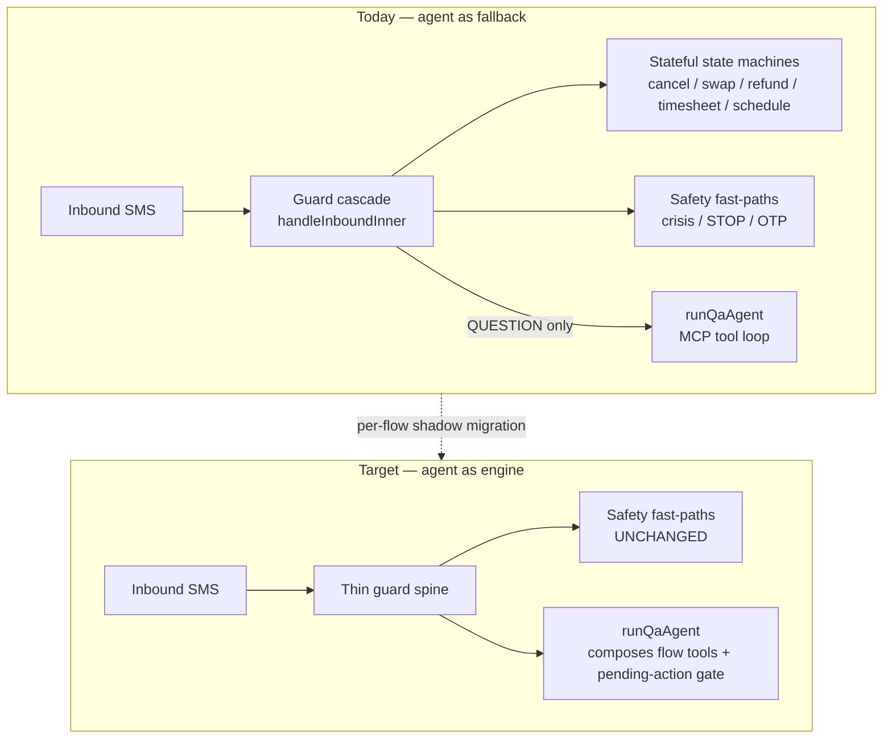
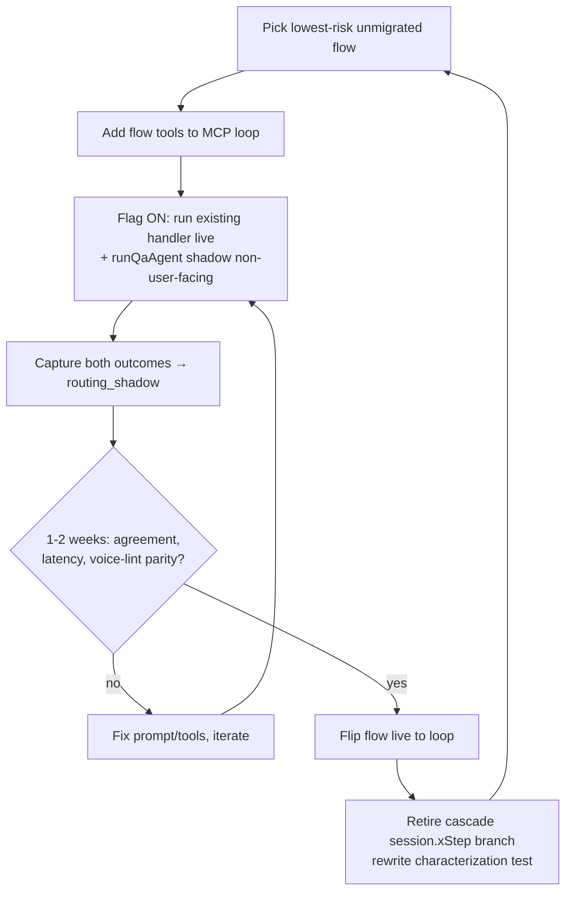
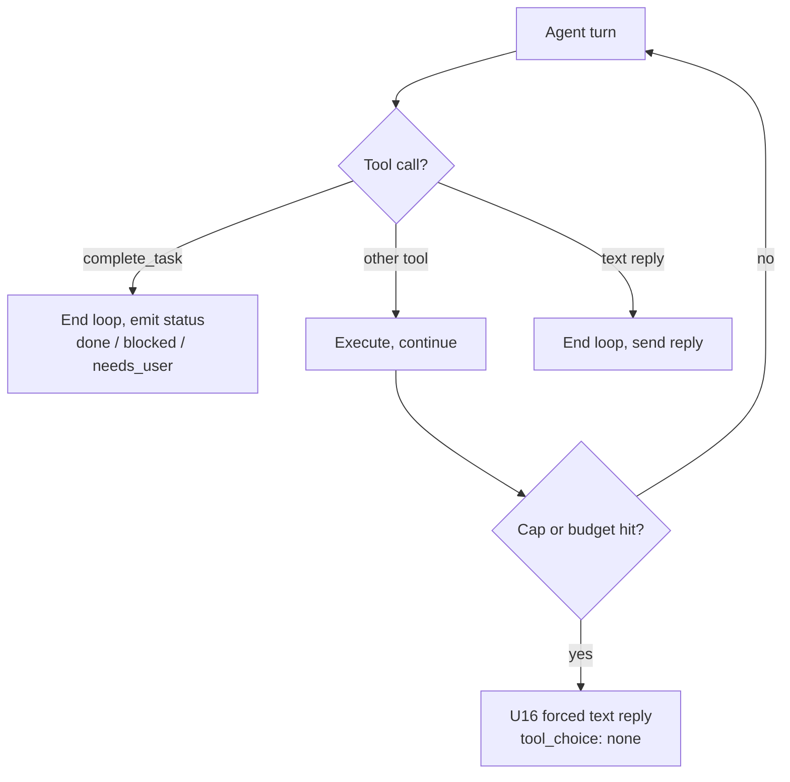

# feat: Cara Agent-Native Horizon

## Summary

Cara is already a strong conversational agent for in-platform actions: an 88+ tool MCP loop, a server-side propose→confirm→execute gate with exactly-once semantics, a wired memory loop, and conversational onboarding on both sides. Three separate, already-`ready-for-work` plans take it to a *trustworthy, launchable* state — life-safety, reliability, rule-compliance, and the real-world healthcare trust layer.

What those plans deliberately defer is the architecture that makes Cara *a real agent that does everything on both sides* rather than a router with a strong fallback. Today most stateful flows (cancel, swap, refund, timesheet, schedule changes) run as hand-built `session.*Step` state machines in a guard cascade; the agent loop is the leftover bucket (`QUESTION`). The loop also cannot signal genuine completion (it exits on a `stop_reason` heuristic, hard-capped at 5 iterations), and a handful of actions the platform supports have no agent tool.

This plan closes that gap in three dependency-ordered phases: **(A) Action-parity completion** — every action the platform can take is reachable as an agent tool, with a maintained capability map and a parity test to keep it that way; **(B) Genuine multi-step autonomy** — an explicit `complete_task` completion signal and flow-class-aware loop headroom so multi-step tasks (especially healthcare execution) run to completion instead of truncating; **(C) Agent-as-engine convergence execution** — turn the convergence spike's recommendation into a measured, flow-by-flow migration of stateful flows out of the cascade and into agent-composed tools, behind the shadow-comparison flag, reversible-first.

Scope was confirmed as the **agent-native horizon** (parity + autonomy + convergence execution), with **caregiver identity-model unification tracked as an external dependency**, not planned here.

This is **post-launch work, and it is front-loaded by value.** Phases A and B plus the convergence *pilot* (U11/U6/U7) are the committed, high-leverage bundle — they unlock multi-action composition and multi-step autonomy and *test* the convergence hypothesis cheaply. The broader migration (U8/U9/U10) is **contingent on the pilot's data**, not pre-committed: per the spike, "the data is the trigger." A flow only flips into the loop if its shadow shows parity *and* acceptable latency; financial/labor flows may rationally stay deterministic state machines. Phase C is additionally gated behind the launch-readiness plan's reliability units and must not start until launch is stable.

**One premise to keep honest (surfaced by review):** "does everything on both sides" is an *architectural* aspiration, and the concrete user-facing win of convergence (beyond what Phase A's parity tools already give) is multi-action composition and native mid-flow Q&A — not a fixed user complaint. Migrating *working* state machines into a Sonnet loop trades a sub-second gpt-4o-mini parse for multiple Sonnet calls. The plan therefore treats "keep the state machine" as a first-class outcome (KTD-7) and makes moving money/labor orchestration into the LLM loop an explicit, signed-off bet (see Open Questions), not a checklist endpoint.

---

## Problem Frame

"Does everything on both sides" fails on four concrete fronts today, in increasing order of depth:

1. **A few orphan actions.** The platform can pause/reactivate a caregiver and accept/decline a shift, but the agent loop cannot — those live only in cascade handlers or UI state, with no MCP tool, so a caregiver texting "put me on vacation till July" reaches a handler but the *agent* (the `runQaAgent` loop) has no tool to compose pause with anything else. There is no maintained map of which platform actions have agent parity, so new orphans appear silently. (Client card-update is intentionally link-only for PCI reasons — a documented `N/A`, not a gap to close.)

2. **The loop can't run until done.** Completion is a heuristic (`stop_reason !== "tool_use"`), the cap is a hardcoded `iteration < 5`, and there is no `complete_task` tool. The launch plan's U16 forces a *text reply* at the cap and U14 raised `max_tokens` to 1024 — but neither gives the agent a way to say "I have achieved the outcome" or "I am blocked," and 5 turns is tight for genuine multi-step real-world tasks (healthcare booking: discover → credential → fill → read-back verify).

3. **The agent is the router's fallback, not the engine.** Inbound routing classifies intent, then a ~2,000-line order-dependent guard cascade dispatches to bespoke `session.*Step` state machines; only general Q&A reaches `runQaAgent`. The agent's intelligence is used to *route*, so Cara's capability ceiling is the union of hand-written handlers — no emergent capability. The convergence spike already established the direction (move stateful flows into tools the agent composes), the method (per-flow shadow comparison behind a flag), and the verdict (go, but post-launch and measured).

4. *(Out of scope, tracked.)* Cara writes phone-keyed, random-ID `caregivers` docs with no Firebase Auth account; legacy caregivers are uid-keyed. The code path is done; a one-off data migration remains (see `context/progress-tracker.md` "Next Up" #2). Tracked as a dependency, not planned here.

The fix is to make parity a maintained invariant, give the loop a real completion contract and room to work, and then move the work itself into the loop — measured, reversible-first, never a big-bang.

---

## Requirements

- **R1 — Every platform action a user/handler can take is reachable as an agent tool**, or is an explicitly documented `N/A` (e.g., PCI-gated card entry). *(U1, U2, U3)*
- **R2 — Action parity is a maintained invariant**, not a point-in-time audit: a capability map plus an automated test that fails when a mapped action lacks a tool documented in the system prompt. *(U3)*
- **R3 — The agent can signal genuine completion** ("outcome achieved" / "blocked, here's why") via an explicit `complete_task` tool, reconciled with the existing forced-final-reply path. *(U4)*
- **R4 — Multi-step tasks get headroom proportional to their flow class** — cheap single-shot turns stay bounded; genuine multi-step flows (healthcare execution, migrated stateful flows) get more iterations/budget without unbounding cost. *(U5)*
- **R5 — A measured, reversible migration path moves stateful flows from the cascade into agent-composed tools**, behind a shadow-comparison flag, with no user-facing risk until parity is proven per flow. *(U6, U7)*
- **R6 — Reversible flows migrate before financial/irreversible ones**; financial/irreversible flows migrate only after the launch plan's in-gate confirmation validation and this plan's completion/headroom work are live. *(U8, U9)*
- **R7 — Migrated flows preserve the mandatory Cara behaviors** (mid-flow question handling, acknowledgment, no `.includes()` intent parsing) and route every committing action through the existing pending-action gate — never a parallel approval path. *(U7, U8, U9)*
- **R8 — Safety and protocol fast-paths never move into the loop** (crisis/NOTIFY, STOP/START, OTP) and onboarding (Stripe/Checkr side effects) is explicitly excluded from convergence. *(U6, U10)*
- **R9 — Once a flow's shadow data shows parity and it is flipped live, the dead state-machine branch is retired from the cascade** so the dual architecture shrinks rather than accumulating. *(U10)*

---

## Key Technical Decisions

- **KTD-1 — Parity is enforced by a test, not discipline.** A `context/capability-map.md` table (UI/handler action → MCP tool → system-prompt reference → status) is paired with a parity test that asserts every `✅` row's tool exists in `MCP_TOOLS` (or the caregiver subset) and is named in the relevant system-prompt builder. This is the framework's "continuous parity" pattern adapted to this repo. Mirrors the existing `handleInbound.routing.test.ts` characterization posture. *(R1, R2)*
- **KTD-2 — New parity tools are primitives behind the existing gate.** `pause_account`/`reactivate_account` and explicit `accept_shift`/`decline_shift` tools take primitive `z.string()` inputs, enforce ownership server-side, and reuse `handlePauseAccount`/booking logic already in the cascade as their backing ops — no new business logic, no parallel approval path. Pause is reversible (no gate); shift decline routes through the same booking-side effects the cascade uses. *(R1, R7)*
- **KTD-3 — `complete_task` is an explicit signal layered onto U16, not a replacement.** The loop still force-completes at the cap (U16 contract preserved). `complete_task` lets the agent terminate *early and intentionally* with a structured status (`done` | `blocked` | `needs_user`), and is the natural termination for multi-step flows migrated in Phase C. Reconcile the two: a `complete_task` call ends the loop and emits its status to `turnMetrics`; absence still falls back to the U16 forced reply. *(R3)*
- **KTD-4 — Loop headroom is flow-class-aware, not a flat raise.** Replace the hardcoded `iteration < 5` / `=== 4` constants with a per-turn budget keyed to a flow class resolved at loop entry (e.g., `quick` = 3, `standard` = 5, `multistep` = up to ~10), plus the existing 60s wall-clock cap as the hard ceiling. Cheap turns stay cheap; healthcare/migrated flows get room. Cost stays bounded by the wall-clock budget and tool caching (U14). *(R4)*
- **KTD-5 — Convergence reuses the spike's exact mechanism.** `ROUTING_CONVERGENCE_SHADOW` env flag (default OFF); when ON for a chosen flow, run the existing handler user-facing AND `runQaAgent` non-user-facing in parallel, capturing both outcomes to a `routing_shadow` Firestore collection. Comparison reuses `turnMetrics` voice-lint/grounding fields and the `experimentScorecard` aggregation pattern — no new metrics plumbing. *(R5)*
- **KTD-6 — Migration order is fixed by reversibility, and each flow flips only on its own shadow data.** Pilot: reminder management (reversible, no money/clinical data, already LLM-classified). Then the reversible cluster (modify-schedule, availability, caregiver profile-update, swap, referral). Financial/irreversible (timesheet, refund, cancel) only after the launch plan's U12 (in-gate `_confirmedActionId` validation) and this plan's U4/U5 are live. Onboarding never migrates. *(R6, R8)*
- **KTD-7 — Convergence is subtractive, but "keep the state machine" is a first-class outcome.** When a flow flips live, its cascade `session.*Step` branch is removed and its characterization test rewritten to assert the loop path — the dual architecture shrinks per *flipped* flow. But a flow **stays a state machine** (a valid, non-debt outcome) if its shadow shows a latency delta above a stated ceiling, or it is a single-action flow with no composition value, *even when end-state parity holds*. "Subtractive" applies only to flows that flip; the goal is "each flow lives where it performs best," not "the cascade shrinks to zero." *(R9)*
- **KTD-8 — This plan does not re-plan the hardening or healthcare units.** U15 (CRUD gaps: `cancel_followup`/`delete_comment`/`edit_review`), U17 (parameterize matching), and U19 (step-handler framework) belong to the launch-readiness plan; the healthcare gate belongs to `2026-06-16-002`. They are cited as related/dependency, not duplicated. *(all)*
- **KTD-9 — Shadow isolation is a runtime mechanism, not a test assertion.** `skipSend` in `qaAgent.ts` suppresses only the outbound SMS/typing/checkpoint — tool dispatch (`handleToolCall`) executes Firestore writes unconditionally. A shadow `runQaAgent` therefore cannot be made side-effect-free by assertion; it requires a `shadowMode`/`dryRun` flag threaded through the loop and **both** tool dispatchers, where every mutating tool short-circuits to a synthetic result and the pending-action gate is forced propose-only (no write). This is a hard prerequisite (U11) for any shadow run. *(R5, R8)*
- **KTD-10 — "Agreement" needs an operational definition before any flip.** Shadow comparison is meaningless without a per-flow canonical end-state projection (named fields), a match predicate (exact vs. semantic + the judge if semantic), a flip threshold (≥X% over ≥N samples), and a non-determinism policy (N shadow samples per input). Defining this is part of U6, not deferred to the flip decision. *(R5)*
- **KTD-11 — Phase C beyond the pilot is contingent, not committed.** Per the spike ("the data is the trigger"), only U11 + U6 + U7 (isolation + harness + reminder pilot) are committed `ready-for-work`. U8 (reversible cluster), U9 (financial cluster), and U10 (retirement) are **contingent on U7's written flip/hold decision** and may graduate into a separate follow-on plan rather than executing automatically. The stopping condition is affirmative: if the reminder pilot shows worse latency/parity, the migration stops and the state machines stay. *(R5, R6)*

---

## High-Level Technical Design

### Dual architecture today → converged target (Phase C)

### Per-flow shadow migration loop (U6–U10)

### Loop completion contract (U4 + existing U16)

---

## Implementation Units

Units are grouped into phases. Phases A and B are independent of launch and can begin now; Phase C is launch-gated (see Phased Delivery). Within a phase, units are largely independent unless a dependency is cited.

### Phase A — Action-parity completion (both sides)

### U1. Pause/reactivate as first-class agent tools
**Goal:** The agent loop — not just the cascade handler — can pause and reactivate a caregiver account.
**Requirements:** R1
**Dependencies:** None
**Files:** `functions/src/mcp/server.ts` (add `pause_account`, `reactivate_account` tools + handlers), `functions/src/agents/caregiverProfileHandler.ts` (export `handlePauseAccount`/`handleReactivate` core logic as a reusable op), `functions/src/agents/qaAgent.ts` (document tools in `buildCaregiverSystemPrompt`), `functions/src/mcp/__tests__/pauseAccount.test.ts` (create)
**Approach:** Extract the pause/reactivate write logic (`pausedUntil`/`pausedAt` fields) from the existing handler (`caregiverProfileHandler.ts:352-447`) into a shared op; wrap it in two MCP tools with primitive `z.string()` inputs (`until` ISO date or `"indefinite"`). **Ownership is an explicit server-side check, not an inherited pattern:** the handler must load the caregiver doc and compare its `phone` to the injected `input.phone`, returning `PERMISSION_DENIED` on mismatch — do **not** copy `update_caregiver_profile`, which performs no ownership check (`server.ts:2703-2716`) and would let the model pass any `caregiverId`. Pause is reversible → no pending-action gate. While extracting, audit whether `handleReactivate` should also clear `pausedAt` (today it clears `pausedUntil` and writes `reactivatedAt`, leaving `pausedAt` set) — fix if it's a latent gap. Add to the caregiver tool subset and document in the caregiver system prompt with user vocabulary ("pause", "vacation", "stop job matches").
**Patterns to follow:** `handlePauseAccount`/`handleReactivate` at `caregiverProfileHandler.ts:352-447` for the write shape; a real ownership check (load-doc-then-compare-phone), since the cited mutator lacks one.
**Test scenarios:**
- Covers R1. "Pause me until July 5" via the loop → `pausedUntil` set to that date, acknowledgment returned.
- "Pause indefinitely" → `pausedUntil` = far-future sentinel.
- "I'm back" / reactivate → `pausedUntil` (and `pausedAt`, per the audit) cleared.
- Non-owner phone supplies another caregiver's id → rejected `PERMISSION_DENIED`, target doc unchanged.
- Pause then immediate reactivate is idempotent (no stuck state).
**Verification:** A caregiver can pause and later reactivate entirely through `runQaAgent`, and the cascade `PAUSE_ACCOUNT` handler still works unchanged.

### U2. Explicit accept/decline shift tools
**Goal:** Shift accept/decline is an explicit agent capability, not implicit booking-state side effect.
**Requirements:** R1
**Dependencies:** None
**Files:** `functions/src/mcp/server.ts` (add `accept_shift`, `decline_shift` tools), backing booking op in `functions/src/agents/shiftOffer.ts` / booking logic, `functions/src/agents/qaAgent.ts` (document in caregiver system prompt), `functions/src/mcp/__tests__/shiftResponse.test.ts` (create)
**Approach:** Wrap the existing offer accept/decline booking side effects (the logic today triggered via UI state / `claimOffer`) in two primitive tools keyed by `offerId`/`appointmentId`. Decline routes through the same replacement-agent trigger the cascade uses. Keep inputs primitive; enforce ownership server-side. No new business logic.
**Patterns to follow:** `claimOffer` in `functions/src/agents/shiftOffer.ts`; existing booking-response side effects in the caregiver routing path.
**Test scenarios:**
- Covers R1. Caregiver "yes I'll take the Tuesday shift" via loop → offer claimed, appointment confirmed.
- "Can't do Tuesday" → offer declined, replacement flow triggered.
- Accept an already-claimed/expired offer → clean error, no double-book (reuses claim idempotency).
- Non-owner attempts to accept another caregiver's offer → rejected.
**Verification:** A caregiver accepts and declines shift offers through `runQaAgent` with the same downstream effects as the cascade path.

### U3. Capability map + automated parity test
**Goal:** Action parity becomes a maintained, test-enforced invariant.
**Requirements:** R1, R2
**Dependencies:** U1, U2 (so the map ships complete)
**Files:** `context/capability-map.md` (create), `functions/src/mcp/__tests__/parity.test.ts` (create), `functions/src/agents/qaAgent.ts` (system-prompt builders are the reference target)
**Approach:** Author the capability map as a table over both sides — UI/handler action → UI/handler location → MCP tool → system-prompt reference → status (`✅` done / `⚠️` missing / `🚫` N/A). Capture the intentional `🚫` rows (PCI card entry is link-only via `get_payment_update_link` at `functions/src/mcp/server.ts:1238`; Twilio Video interview is UI-only). The parity **test asserts directly against in-code data structures** — every tool in `MCP_TOOLS` (and the caregiver subset) is named in the relevant system-prompt builder string, and vice-versa — rather than parsing the Markdown map (which would be brittle to formatting and add a human-discipline drift loop). The capability map stays as human-readable documentation; the test treats it as informational only. Update CLAUDE.md's stale "83-tool" count to point at the map as the source of truth.
**Patterns to follow:** `handleInbound.routing.test.ts` characterization style; the action-parity discipline (capability-map table + parity test).
**Test scenarios:**
- Covers R2. Every tool in `MCP_TOOLS`/caregiver subset is named in the relevant system-prompt builder → test passes.
- A tool removed/renamed but still referenced in the system prompt (or vice-versa) → test fails naming the offender.
- A tool added without a system-prompt mention → test flags it as undocumented (drift guard).
- The Markdown map's formatting changing does not affect the test (map is informational only).
**Verification:** Deleting a mapped tool turns the parity test red; the map renders an accurate both-sides inventory.

---

### Phase B — Genuine multi-step autonomy

### U4. `complete_task` completion signal
**Goal:** The agent can intentionally terminate with a structured outcome instead of relying solely on the `stop_reason` heuristic and the cap.
**Requirements:** R3
**Dependencies:** None (but reconcile with launch plan U16's forced-final-reply, already shipped)
**Files:** `functions/src/mcp/server.ts` (add `complete_task` tool), `functions/src/agents/qaAgent.ts` (loop honors `complete_task`: end loop, surface its message, emit status), `functions/src/agents/turnMetrics.ts` (add completion-status field), `functions/src/agents/__tests__/qaAgent.completeTask.test.ts` (create)
**Approach:** Add a `complete_task` tool taking `status: z.string()` (`done` | `blocked` | `needs_user`) and a `message`. When the loop sees it, end immediately, send `message` as the reply, and record status on `TurnMetrics`. Preserve the U16 contract: if the cap/budget is hit without `complete_task` or a text reply, still force the final reply. **Guard against premature `done`:** if a pending action for this phone is in `awaiting` status, `complete_task(done)` is rejected back to the model (or demoted to `needs_user`) — the agent must not declare a committing action complete while its confirmation is still outstanding (otherwise the user gets a false "booked!" and the pending doc silently expires). Document the tool in both system prompts as the way to end a multi-step task. Disambiguate from the unrelated existing `markTaskComplete` callable (caregiver task completion) — different concern, keep the names distinct.
**Patterns to follow:** existing loop exit + `emitTurnMetrics` in `qaAgent.ts:1283-1541`; tool-definition shape in `server.ts`.
**Test scenarios:**
- Covers R3. Agent calls `complete_task(done, …)` mid-loop → loop ends before the cap, message sent, status `done` in metrics.
- `complete_task(blocked, …)` → loop ends, user gets the blocker explanation, status `blocked`.
- No `complete_task`, normal text reply → unchanged behavior (regression).
- Cap reached with neither → U16 forced reply still fires (contract preserved).
- `complete_task(done)` while a pending action is `awaiting` → rejected/demoted, loop does not falsely report success.
- Multi-step transcript whose real-world outcome is NOT yet achieved (e.g. healthcare booking before read-back verify) → agent must not terminate on `complete_task(done)`.
- `complete_task` does not double-send under the existing checkpoint/idempotency path.
**Verification:** A multi-step prompt that finishes early ends on `complete_task` with the right status; the cap path is unchanged.

### U5. Flow-class-aware loop headroom
**Goal:** Multi-step flows get iteration/budget room; cheap turns stay bounded; cost stays capped.
**Requirements:** R4
**Dependencies:** U4 (completion signal makes longer loops safe to terminate)
**Files:** `functions/src/agents/qaAgent.ts` (replace hardcoded `iteration < 5` / `=== 4` with a flow-class budget; keep `TURN_BUDGET_MS` as hard ceiling), `functions/src/agents/__tests__/qaAgent.headroom.test.ts` (create)
**Approach:** Resolve a flow class at loop entry (`quick` | `standard` | `multistep`) from the `intent` already passed to `runQaAgent` (`qaAgent.ts:775`); when `intent` is null (web/agent callers), **default to `standard`** to preserve today's `< 5` behavior. Map class to a max-iteration value (~3 / 5 / 10). Keep the 60s wall-clock budget as the absolute ceiling, with U16 forced-completion at whichever bound hits first. **Reconcile the two bounds honestly:** at ~15s/Sonnet-call the wall-clock, not the iteration count, is the real bound for slow turns (≈4 slow turns ≈ 60s) — so the `~10` headroom only helps on *fast* turns; state the expected (not just max) iteration count for healthcare/multistep and confirm it fits 60s at realistic latency, else the lever is the wall-clock (with its own SMS-dead-air UX cost) or interim "still working" sends. **Add a per-turn tool-write cap independent of iteration count** to bound mutation blast radius if a confused/injected model loops on writes. Healthcare execution and Phase-C migrated flows resolve to `multistep`. Emit the resolved class + final iteration count + tool-write count to `turnMetrics` for tuning.
**Note on reachability:** until Phase C flips flows into the loop, only `QUESTION`-class messages reach `runQaAgent`, so `multistep` headroom is exercised first by healthcare execution (`2026-06-16-002`) if it enters the loop with a `multistep`-resolving intent — confirm that at implementation so the verification below is testable at U5 time, not only post-Phase-C.
**Patterns to follow:** existing budget/cap handling at `qaAgent.ts:1283-1326`; intent classification feeding loop setup.
**Test scenarios:**
- Covers R4. `quick`-class turn caps at the low bound; `multistep` healthcare turn runs past 5 iterations until completion or budget.
- Null `intent` (web/agent caller) → resolves to `standard` (today's `< 5` behavior preserved).
- `multistep` happy path completes within the 60s wall-clock at realistic per-call latency (not merely before the iteration bound).
- Wall-clock budget still forces completion before the high iteration bound when slow.
- A normal Q&A turn is unchanged (regression).
- Tool-write cap reached → loop stops issuing writes regardless of remaining iterations (mutation blast-radius bound).
- Class + iteration count + tool-write count appear in emitted metrics.
**Verification:** A scripted multi-step healthcare turn completes instead of truncating at 5; cheap turns show no added iterations; cost stays bounded by wall-clock.

---

### Phase C — Agent-as-engine convergence execution (launch-gated, pilot-then-contingent)

> **Gate (tiered):** The convergence spike's verdict — post-launch, narrow, measured — governs. **Committed now:** U11 + U6 + U7 (isolation mechanism, shadow harness, reminder pilot) gate on launch-plan U4 (per-phone serialization), U8 (mid-route recovery), and U16 (guaranteed final reply, already implemented in `qaAgent.ts`) being live, on this plan's U4/U5 being merged, **and on the launch plan's cascade-touching units (U4/U8/U11) being merged with their `handleInbound.routing.test.ts` characterization tests frozen** — so shadow data is not confounded by concurrent routing edits. **Contingent (per KTD-11):** U8 (reversible cluster) executes only after U7's flip decision; U9 (financial cluster) additionally requires launch-plan U12 (`_confirmedActionId` validation) live. U10 trails each flip.

### U11. Shadow/dry-run tool-dispatch isolation *(prerequisite for U6 — committed)*
**Goal:** A shadow `runQaAgent` can run on real traffic with structurally guaranteed zero side effects.
**Requirements:** R5, R8
**Dependencies:** None (precedes U6)
**Files:** `functions/src/agents/qaAgent.ts` (thread a `shadowMode` flag into the loop and `enrichedInput`), `functions/src/mcp/server.ts` (`handleToolCall` / `handleToolCallForCaregiver` honor the flag), `functions/src/agents/pendingActions.ts` (propose-only, no write, under shadow), `functions/src/mcp/__tests__/shadowIsolation.test.ts` (create)
**Approach:** Per KTD-9 — add a `shadowMode` flag threaded through `runQaAgent` and both tool dispatchers. Every mutating tool (audit all ~88 against their write paths) short-circuits to a synthetic, recorded "would-have-written" result; read tools run normally; the pending-action gate captures the *proposed* action as the shadow end-state without writing a `pending_actions` doc or sending. This is the structural guarantee U6's comparison depends on — not a test assertion.
**Patterns to follow:** existing `skipSend` threading in `qaAgent.ts` (extend the same way, but for writes); tool-handler signatures in `server.ts`.
**Test scenarios:**
- Covers R8. Shadow turn calling `create_reminder`/`cancel_appointment` → no Firestore write, synthetic result returned, captured intent recorded.
- Shadow turn hitting a gated tool → proposed action captured, no `pending_actions` doc written, no send.
- Read-only tool under shadow → runs normally.
- A mutating tool added later without a shadow short-circuit → audit test flags it (drift guard).
- Non-shadow (normal) turn → unchanged behavior (regression).
**Verification:** With `shadowMode` on, a turn that would normally write/refund/cancel produces only a captured intent and zero production mutations.

### U6. Shadow-comparison harness
**Goal:** Stand up the spike's measurement infrastructure so any flow can be shadow-compared before flipping.
**Requirements:** R5, R8
**Dependencies:** U11 (isolation mechanism), U4, U5; launch-plan U4/U8/U16 + frozen routing tests (U12 only for U9)
**Files:** `functions/src/config/featureFlags.ts` (add `ROUTING_CONVERGENCE_SHADOW`, default OFF, per-flow scoped), `functions/src/linq/routeIntent.ts` (loop-dispatch site — the shadow tap lives where `runQaAgent` is invoked, not in the step cascades), `functions/src/agents/routingShadow.ts` (create — parallel `runQaAgent` in `shadowMode`, capture), `routing_shadow` Firestore collection, `functions/src/agents/__tests__/routingShadow.test.ts` (create)
**Approach:** Per KTD-5 + KTD-9 — when the flag is ON for a flow, run the existing handler user-facing and `runQaAgent` (with that flow's tools available, in `shadowMode` per U11) non-user-facing in parallel; capture both end-states, latency, tool/iteration counts, and voice-lint/grounding flags (reuse `turnMetrics`) to `routing_shadow`. Side-effect isolation is guaranteed structurally by U11, not by assertion. **Also define the agreement metric here (KTD-10):** per pilot flow, the canonical end-state projection (named fields), the match predicate (exact vs. semantic + judge), the flip threshold (≥X% over ≥N samples), and the N-samples-per-input non-determinism policy. Safety fast-paths (crisis/NOTIFY, STOP/START, OTP) are never tapped.
**Patterns to follow:** `turnMetrics` capture; `experimentScorecard` aggregation; feature-flag-dark convention in `functions/src/featureFlags.ts` (`realWorldHealthcareActionsEnabled`).
**Test scenarios:**
- Covers R5. Flag ON for a flow → both paths run; only the existing handler is user-facing; `routing_shadow` doc written with both outcomes.
- Flag OFF → no shadow run, no overhead (regression).
- Shadow `runQaAgent` attempts a side-effecting send/write → no-op via U11 `shadowMode` (captured intent only).
- Safety fast-path message → never shadow-tapped.
- Capture records latency + iteration + lint deltas, and the agreement-metric projection, for comparison.
**Verification:** With the flag ON for one flow, `routing_shadow` accumulates paired outcomes and the user sees only the existing handler's behavior.

### U7. Pilot migration — reminder management
**Goal:** Prove the migration end-to-end on the lowest-risk flow and produce a flip/hold decision from real data.
**Requirements:** R5, R7
**Dependencies:** U6
**Files:** `functions/src/mcp/server.ts` (ensure reminder CRUD tools are loop-composable: `list_user_reminders`, `create_reminder`, `delete_reminder`), `functions/src/agents/qaAgent.ts` (reminder vocabulary in system prompt), shadow capture from U6, `functions/src/agents/__tests__/reminderConvergence.test.ts` (create)
**Approach:** Reminder management is fully reversible, no money/clinical data, already LLM-classified. Make its tools first-class in the loop, run the U6 shadow (in U11 `shadowMode`) for 1–2 weeks of its traffic, and compare against the U6-defined agreement metric. **Note the one gated tool:** `delete_reminder` is in `ALWAYS_CONFIRM` (`pendingActions.ts:58`), so under shadow the comparison is against the *proposed* (captured) action vs. the live handler's confirmation step — not an executed delete; specify this in the projection so the gated path doesn't read as a spurious divergence. Preserve mandatory Cara behaviors — the loop must answer mid-flow questions and acknowledge, which is native to the agent (the win over the state machine). Deliver a short flip/hold decision note appended to the spike memo.
**Patterns to follow:** the spike's shadow-comparison design (`docs/plans/2026-06-17-002-spike-routing-convergence.md`); existing reminder tools in `server.ts:343-410`.
**Test scenarios:**
- Covers R5. "Remind me to give Mom her meds at 8" via loop → reminder created; shadow agrees with handler end-state.
- "Show my reminders" / "cancel the 3pm one" → list/delete via loop, end-state parity.
- Mid-flow question ("what reminders do you support?") → answered, then flow continues (mandatory-rule parity).
- Shadow disagreement on any case → captured for the decision note, not user-facing.
**Verification:** A 1–2 week shadow run yields an agreement/latency dataset and a documented flip/hold recommendation for reminders.

### U8. Migrate the reversible flow cluster
**Goal:** Move the low-risk reversible flows into the loop, one at a time, each gated on its own shadow data.
**Requirements:** R5, R6, R7
**Dependencies:** U7 (pilot validates the pattern)
**Files:** per flow — `functions/src/mcp/server.ts` (flow tools), the flow's handler in `functions/src/linq/routeClient.ts` / `routeCaregiver.ts` / respective handler file (shadow tap), `functions/src/agents/qaAgent.ts` (system-prompt vocabulary), per-flow convergence test
**Approach:** Apply the U6/U7 pattern to: modify-schedule (`modifyScheduleStep`), availability (`availabilityStep`), caregiver profile-update (`profileUpdateStep`), caregiver/client swap (`swapStep`/`clientSwapStep`), caregiver referral (`pendingCaregiverReferral`). Each flow: add/confirm loop tools → shadow → flip only on its own parity data → (retirement handled in U10). One flow per PR, characterization-first.
**Execution note:** Characterization-first — capture golden transcripts for each flow before migrating, since several touch scheduling and caregiver-facing commitments.
**Patterns to follow:** U7; `goldenTranscripts.test.ts`; mandatory Cara handler checklist in CLAUDE.md.
**Test scenarios:**
- Per flow: shadow agreement on the happy path before flip.
- Mid-flow question handled by the loop (mandatory-rule parity) for each flow.
- Multi-candidate disambiguation (swap/schedule) reaches the same selection as the state machine.
- Flag-off → existing handler unchanged (regression) until flip.
**Verification:** Each reversible flow shows shadow parity, flips behind its own flag, and behaves identically to its state machine from the user's view.

### U9. Migrate the financial/irreversible flow cluster
**Goal:** Move the high-stakes flows into the loop, last, with the confirmation gate doing the work the state machine hand-rolled.
**Requirements:** R5, R6, R7
**Dependencies:** U8; launch-plan U12 (in-gate confirmation validation) must be live
**Files:** per flow — `functions/src/mcp/server.ts` (flow tools + gate membership in `functions/src/agents/pendingActions.ts`), the flow handler (shadow tap), per-flow convergence test
**Approach:** Apply the pattern to timesheet approval (`timesheetStep`), refund (`refundStep`), and caregiver cancel-shift (`cancelStep`) — each committing action routed through the existing pending-action gate (`ALWAYS_CONFIRM`/`CONDITIONAL_CONFIRM`), exactly-once via the claim/settle pattern, never a parallel approval path. These flow tools resolve to the `multistep` headroom class (U5). Migrate only after each shows shadow parity AND the gate validation (U12) is confirmed live. Healthcare execution already runs through the loop+gate (`2026-06-16-002`) and is the reference shape. **Three hard requirements per financial flow (mirroring the healthcare plan's security work):** (1) **gate membership is explicit and same-PR** — the gate is a hardcoded `ALWAYS_CONFIRM`/`CONDITIONAL_CONFIRM` set (`pendingActions.ts:55-95`), so every new committing tool must be added by name or it silently bypasses the gate; (2) **strip `_confirmedActionId` from LLM-generated tool input** before persisting the pending doc (mirror `approvalHandler.ts:98-100`) so a prompt-injected id can't survive into re-dispatch; (3) **approval-quality `buildActionPreview`** — the family must approve "Refund $240 to Jane Smith for the Jun 20 shift", not "refund (irreversible)"; surface every user-consequential argument (amount, date, hours, period) in plain English before the flow may flip live.
**Patterns to follow:** pending-action gate in `pendingActions.ts:55-204`; exactly-once claim/settle in `webhookLedger.ts` / `shiftOffer.ts`; the healthcare handler's loop+gate composition.
**Test scenarios:**
- Per flow: a committing action proposes via the gate, executes exactly once on YES, no-ops on NO.
- New financial tool absent from `ALWAYS_CONFIRM`/`CONDITIONAL_CONFIRM` → gate-membership test fails (no silent bypass).
- Tool input carrying `_confirmedActionId` → field is absent from the stored `toolInput` doc (injection stripped).
- `buildActionPreview` for each financial tool is non-generic and names all consequential args (amount/date/hours).
- Duplicate confirmation delivery → single execution (idempotency).
- Shadow parity on end-state (e.g., refund amount, timesheet approval) before flip.
- Wrong approver / forged `_confirmedActionId` → rejected (relies on U12).
- Mid-flow question during a financial flow → answered, no premature commit.
**Verification:** Each financial flow executes through the loop+gate with exactly-once semantics and shadow-proven parity before flip.

### U10. Retire migrated cascade branches
**Goal:** The dual architecture shrinks per flip — convergence is subtractive, not additive.
**Requirements:** R8, R9
**Dependencies:** U7, U8, U9 (a branch is retired only after its flow is flipped live)
**Files:** `functions/src/linq/routeClient.ts`, `functions/src/linq/routeCaregiver.ts`, `functions/src/linq/webhooks.ts` (remove flipped `session.*Step` branches), `functions/src/linq/__tests__/handleInbound.routing.test.ts` (rewrite expectations per retired flow)
**Approach:** Per KTD-7 — for each flow proven at parity and flipped live, remove its `session.*Step` dispatch branch and state-machine handler, and rewrite the characterization test to assert the loop path. Explicitly retain the safety fast-paths and the onboarding flow (never migrated). Track remaining un-migrated flows so the cascade's shrink is visible.
**Execution note:** One retirement per PR, immediately after the corresponding flip, to avoid a long-lived half-migrated cascade.
**Patterns to follow:** the guard-spine structure documented in `context/progress-tracker.md`; `handleInbound.routing.test.ts` as the pinned contract.
**Test scenarios:**
- A retired flow's inbound now routes to the loop; its old `session.*Step` is gone.
- Characterization test rewritten and green for the retired flow.
- Safety fast-paths and onboarding remain in the cascade (regression).
- No orphaned session fields left writing dead state.
**Verification:** After each flip, the cascade has one fewer state machine and the routing test reflects the loop path; safety/onboarding paths untouched.

---

## Phased Delivery & Launch Gate

| Phase | Units | Timing |
|-------|-------|--------|
| **A — Parity completion** | U1, U2, U3 | Now — independent of launch, low risk |
| **B — Multi-step autonomy** | U4, U5 | Now — independent of launch, medium risk (loop change; behind tests) |
| **C (committed) — Isolation + harness + pilot** | U11, U6, U7 | **Post-launch** — gated behind launch-plan U4/U8/U16 live + frozen routing tests; produces the flip/hold decision |
| **C (contingent) — Migration** | U8, U9, U10 | **Only on a written flip decision from U7** (KTD-11); U9 additionally needs launch-plan U12 live. May graduate into a separate follow-on plan |

**Sequencing within C:** U11 (isolation) → U6 (harness + agreement metric) → U7 (reminder pilot + flip/hold decision) → **[decision gate]** → U8 (reversible cluster) → U9 (financial cluster, after U12 live) → U10 (retirement, trailing each flip). No flow flips without its own shadow-parity data, and a flow may rationally **stay a state machine** (KTD-7).

---

## Risk Analysis & Mitigation

- **Shadow run double-writes production data (C) — the dominant risk.** `skipSend` suppresses only the SMS, not the ~88 mutating tool paths, so a naive shadow `runQaAgent` would write/refund/cancel for real. Mitigation: U11 makes side-effect isolation a *structural* `shadowMode` guarantee threaded through both tool dispatchers, gating U6/U7 — not a test assertion. This is why U11 precedes the harness.
- **Loop change (U4/U5) regresses the happy path.** Mitigation: U16 forced-completion contract preserved and tested; flow-class defaults to `standard` (today's behavior) including the null-intent path; wall-clock ceiling unchanged.
- **Headroom raise unbounds cost/mutation (U5).** Mitigation: 60s wall-clock budget stays the hard ceiling and is the real bound for slow turns; tool caching (U14) already lands; only `multistep` flows get the high bound; a per-turn **tool-write cap** bounds mutation blast radius independent of iteration count; counts emitted for tuning.
- **Shadow "agreement" is undefined / unfalsifiable (C).** Mitigation: KTD-10 requires a per-flow end-state projection, match predicate, flip threshold, and N-sample non-determinism policy defined in U6 *before* any flip — so the flip/hold decision is data-driven, not rationalized.
- **Latency regression moving flows into the loop (C).** Mitigation: a state-machine step is one cheap parse; a loop turn is multiple Sonnet calls. The shadow measures latency before any flip; U14 caching narrows the gap; flip only on acceptable delta.
- **Confirmation drift on financial flows (U9).** Mitigation: financial flows reuse the pending-action gate (not a parallel path), depend on U12 validation, and flip only when shadow end-states agree.
- **Half-migrated cascade becomes debt (C).** Mitigation: KTD-7 makes retirement (U10) trail each flip one-PR-behind; un-migrated flows tracked.
- **Parity test becomes brittle/ignored (U3).** Mitigation: per KTD-1/U3 the test asserts against in-code structures — every `MCP_TOOLS`/caregiver-subset tool is named in the relevant system-prompt builder and vice-versa — rather than parsing the Markdown map, so formatting changes can't break it. The capability map stays as human-readable intent documentation (informational only); the automated check fails loud only on real tool↔prompt drift (the in-code equivalent of `✅`-row parity), leaving `⚠️`/`🚫` rows as documentation rather than blocking legitimate gaps.
- **Mandatory Cara behaviors lost in migration (C).** Mitigation: mid-flow-question and acknowledgment parity is an explicit per-flow shadow check; characterization-first golden transcripts.

---

## System-Wide Impact

- **Affected actors:** caregivers (pause/shift tools, migrated caregiver flows), families/clients (migrated client flows), ops/admins (shadow-data review, convergence decisions).
- **Cross-cutting touch points:** `qaAgent.ts` loop (U4, U5) is on every agent turn — additive and behind tests, but high blast radius; ship with metrics. `routeClient.ts`/`routeCaregiver.ts` and `webhooks.ts` (U6, U8, U9, U10) are the inbound chokepoints — sequence per-flow to avoid churn, and coordinate with the launch plan's U4/U8/U11 which touch the same files.
- **Cost:** U5 can increase per-turn cost on `multistep` flows (bounded by wall-clock + caching); C's shadow runs double LLM cost *for flagged flows only, while flagged* — scope the flag tightly and turn off after each decision.
- **Relationship to other plans:** depends on launch-readiness U4/U8/U12/U16; complements U15/U17/U19; the healthcare handler (`2026-06-16-002`) is the reference shape for U9's loop+gate composition.

---

## Open Questions (deferred to implementation)

- **Flow-class mapping (U5):** exact intent→class assignment and the `multistep` iteration ceiling — tune from emitted iteration metrics; start conservative (~10) and adjust.
- **`complete_task` status taxonomy (U4):** whether `needs_user` warrants distinct downstream handling vs. a normal reply — decide during U4 against real transcripts.
- **Shadow window per flow (U7/U8/U9):** 1–2 weeks is the spike default; high-volume flows may reach significance sooner — decide per flow from traffic.
- **Convergence stopping point:** whether *all* non-safety/non-onboarding flows should migrate or some state machines are genuinely better left in place — revisit after the reversible cluster (U8) with real latency/parity data. Default expectation (KTD-7): some flows stay state machines.
- **Decision record — LLM as orchestrator of money/labor (U9):** Phase C makes the Sonnet loop *decide when to propose* refunds/timesheet-approvals/cancellations (the gate still deterministically guards *execution*). This concentrates regulated-flow orchestration in the least-deterministic component and is a near one-way door once U10 retires the state machines. **This bet must be explicitly signed off before U9, not arrived at by completing a migration checklist.** Consider keeping U9's irreversible flows as a permanent "loop *composes*, state machine *executes*" hold, and keeping the U10 retirement of financial state machines feature-flagged for a long bake.
- **Opportunity cost vs. identity-model unification:** the caregiver identity-model migration (phone-keyed vs. uid-keyed docs, no Auth account — `context/progress-tracker.md` "Next Up" #2) is a concrete competing post-launch priority and a known data-integrity defect. Decide deliberately whether this architectural program should be sequenced ahead of it — and confirm identity unification does not need to precede caregiver-side flow migration in U8.

---

## Sources & Research

- **Convergence spike** — `docs/plans/2026-06-17-002-spike-routing-convergence.md` (dual architecture, do-not-migrate list, shadow method, reminder-first recommendation, post-launch verdict).
- **Launch-readiness hardening plan** — `docs/plans/2026-06-17-001-feat-cara-launch-readiness-hardening-plan.md` (U14 tool-caching and U16 forced-final-reply are already implemented in `qaAgent.ts:1299,1326`, so the Phase-C gate on U16 is effectively satisfied; U15/U17/U19 own CRUD/matching/step-framework; U4/U8/U12 are this plan's Phase-C prerequisites).
- **Healthcare handler plan + requirements** — `docs/plans/2026-06-16-002-feat-cara-realworld-healthcare-handler-plan.md`, `docs/brainstorms/2026-06-16-cara-realworld-healthcare-handler-requirements.md` (the loop+gate composition U9 mirrors; reuse-the-gate rule).
- **Verified during planning (file:line):** loop cap/budget/completion at `functions/src/agents/qaAgent.ts:1283-1541`; pending-action gate at `functions/src/agents/pendingActions.ts:55-204`; pause handler at `functions/src/agents/caregiverProfileHandler.ts:352-447`; payment link tool at `functions/src/mcp/server.ts:1238`; `PAUSE_ACCOUNT` intent at `functions/src/agents/intentClassifier.ts:45`; stateful-flow inventory in `functions/src/linq/routeClient.ts:200-437` and `routeCaregiver.ts`; telemetry in `functions/src/agents/turnMetrics.ts` and `functions/src/scheduled/experimentScorecard.ts`; characterization suite `functions/src/linq/__tests__/handleInbound.routing.test.ts`.
- **Mandatory constraints** — CLAUDE.md "Cara — AI-Agentic Rules (MANDATORY)": LLM-only intent parsing, new-handler checklist, primitive tool inputs, reuse the gate. No `docs/solutions/` knowledge base exists; record outcomes in `context/progress-tracker.md` per CLAUDE.md.
- **Note:** CLAUDE.md's "83-tool" figure is stale (live `server.ts` is larger); U3's capability map becomes the source of truth.
