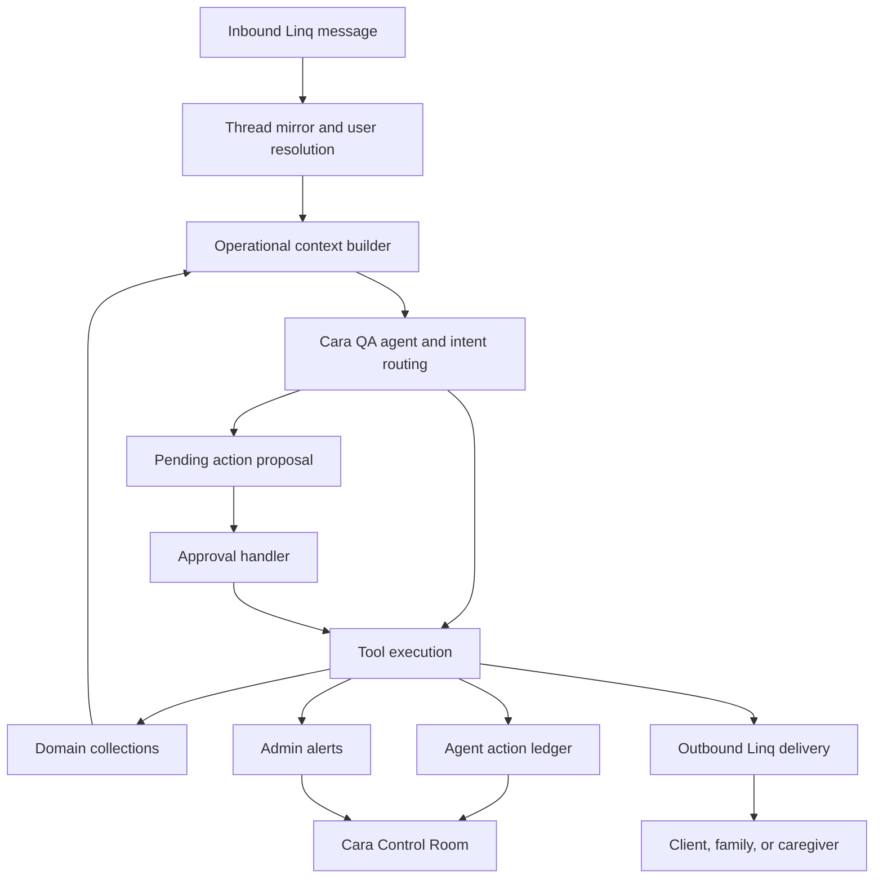

# Cara 10/10 Readiness Plan

## Summary

Cara is no longer just a generic chatbot. The current codebase has the main pieces of a real senior-care agent:

- Linq-backed SMS and group messaging.
- Tool execution through QA and MCP paths.
- Family group creation and family member invitations.
- Care updates, visit completion, support tickets, emergency/safety escalation, and caregiver referrals.
- High-risk pending action approval.
- `shiftHours` as the real visit approval, payment, and payout rail.
- Admin Cara Control Room for failed actions, stuck approvals, support tickets, alerts, and drafts.

The remaining work is not about adding another chat surface. It is about making Cara dependable as a real product for clients, family members, caregivers, and operators. A 10/10 Cara must:

1. Know the current state of each person and act from context.
2. Execute real actions through tools, not vague promises.
3. Recover from failures visibly.
4. Treat caregivers as first-class users, not just supply.
5. Route private approvals and family updates correctly.
6. Produce audit trails for every consequential action.
7. Pass repeatable local and real-vendor smoke tests before launch.

No deploy or GitHub push is part of this plan.

## Problem Frame

The strongest version of CareConnex is not "a marketplace with a chatbot." It is a care operating layer where Cara helps families coordinate care, keeps caregivers moving through real work, and gives admin operators control over failed or risky automation.

The current build is materially ahead of a normal chatbot, but launch risk remains in six places:

- Cara can still sound generic in edge cases when she lacks enough state context.
- Failed actions can be visible in admin, but the operator recovery loop is not complete enough.
- Caregiver-side experiences are thinner than client/family experiences.
- Real-world healthcare actions need strict confirmation, idempotency, and compliance boundaries.
- Vendor paths need proof with Linq, Stripe, Checkr, Firestore rules, indexes, and Functions behavior.
- Golden transcript coverage needs more messy human messages, not only clean happy paths.

The goal is to close those gaps with product behavior, not cosmetic polish.

## Non-Negotiables

- Do not deploy.
- Do not push to GitHub.
- Keep changes local until explicitly approved.
- Keep Linq as the canonical SMS/iMessage channel.
- Keep Checkr `clear` as the automatic caregiver approval signal.
- Keep `shiftHours` as the canonical visit billing, approval, payment, and payout rail.
- Keep payment approval private to the primary client.
- Keep care updates group-shareable when a family group exists.
- Do not give medical advice, diagnose, triage clinically, or imply emergency services are handled by Cara.
- Real-world healthcare actions must not commit without explicit approval from the account holder.

## Product Definition

### What "10/10 Cara" Means

Cara is launch-grade when a real family or caregiver can text messy, incomplete messages and still get useful, safe, state-aware help.

For clients and families, Cara should:

- Know who the senior is, who the primary client is, and who is in the family group.
- Add family members, text the new number, and update the Linq group.
- Share visit updates to the correct group while keeping payment approvals private.
- Explain caregiver arrival, visit status, care notes, invoices, disputes, and payments.
- Offer helpful next actions after important events, such as sharing an update with another sibling.
- Escalate safety and emergency concerns without medical advice.
- Never say "contact support" when she has a tool or workflow that can act.

For caregivers, Cara should:

- Know onboarding, Checkr, approval, schedule, booking, shift, payout, and referral state.
- Help with profile completion and missing verification items.
- Explain what happens after Checkr clear, consider, suspended, canceled, rejected, and missing documents.
- Let caregivers accept or decline work, start and complete shifts, submit notes, and understand pay timing.
- Handle disputes and support needs without vague promises.
- Support caregiver referrals without bypassing eligibility.

For admin operators, Cara should:

- Surface failures and risky actions in the Control Room.
- Make the next operator action obvious.
- Track who handled each failure, what was done, and why.
- Provide audit evidence for family membership, messaging, care updates, payments, support, safety, and healthcare actions.

## High-Level Architecture

Key principle: every consequential Cara response must map to one of three outcomes:

- A completed tool action with a durable record.
- A pending action waiting for the correct approver.
- A failed or blocked action visible to admin and explained to the user.

## Key Technical Decisions

### Decision 1: Control Room Is The Operational Source Of Truth

The Admin Cara Control Room should not stay as a passive dashboard. It becomes the operator workflow for failed, stuck, risky, or high-impact Cara actions. This keeps launch operations in one place instead of scattering recovery across Alerts, Audit, Support, Messages, and Firestore.

### Decision 2: Action Ledger Is Mandatory For Consequential Actions

The `agent_action_ledger` should become the durable proof of what Cara tried, what succeeded, what failed, and what a human handled. Admin alerts can summarize urgency, but the ledger is the history.

### Decision 3: Operational Context Comes Before Conversation Polish

Cara should sound human because she knows the real situation, not because she uses warmer phrasing. The context builder must provide current state for clients, family members, caregivers, bookings, shifts, invoices, payments, support, safety, and pending actions before prompt tuning is treated as complete.

### Decision 4: Caregiver Depth Is Equal Priority

Client and family experiences are stronger today than caregiver experiences. To be launch-ready, caregiver Cara must handle approval, onboarding gaps, shift lifecycle, disputes, referrals, and payout questions with the same reliability as client/family flows.

### Decision 5: Healthcare Actions Use The Existing Approval Rail

Real-world healthcare actions should reuse pending actions and approval handling. Creating a separate confirmation system would increase risk and make audit, idempotency, and admin recovery harder.

### Decision 6: Vendor Proof Is Required Before Launch Claims

Local tests are required but not sufficient. Linq, Stripe, Checkr, Firestore rules, indexes, and Functions must be verified in test or staging conditions before the platform is called launch-ready.

## Implementation Workstreams

### 1. Make The Cara Control Room Operational, Not Just Visible

Goal: turn the existing Control Room into the place where admins can resolve failed or risky Cara actions.

Files likely involved:

- `components/admin/AdminCaraControlRoom.tsx`
- `components/AdminView.tsx`
- `components/admin/AdminAlertsPanel.tsx`
- `services/api.ts`
- `firestore.rules`
- `functions/src/observability/caraOpsAlerts.ts`
- `functions/src/agents/approvalHandler.ts`
- `functions/src/agents/pendingActions.ts`
- `functions/src/data/contract.ts`

Required behavior:

- Operators can assign a failed action to themselves.
- Operators can mark an action handled with a required reason.
- Operators can add internal notes.
- Operators can retry eligible failed Linq sends.
- Operators can re-propose expired or failed pending actions when it is safe.
- Operators can cancel a stuck pending action.
- Operators can jump directly to the related user, thread, booking, shift, invoice, support ticket, alert, or audit record.
- Failed healthcare, payment, safety, and family-add actions are highlighted above lower-risk support events.

Data additions:

- `agent_action_ledger.assignedTo`
- `agent_action_ledger.assignedAt`
- `agent_action_ledger.handledBy`
- `agent_action_ledger.handledAt`
- `agent_action_ledger.handledReason`
- `agent_action_ledger.operatorNotes`
- `agent_action_ledger.retryCount`
- `agent_action_ledger.lastRetryAt`
- `agent_action_ledger.recoveryAction`

Tests:

- Admin can read and update only allowed Control Room fields.
- Failed actions appear in Control Room.
- Resolving a failed action updates the ledger and related alert.
- Retryable Linq failure can be retried once without duplicate family membership or duplicate payment.
- Non-retryable actions show a manual review path instead of a retry button.

Acceptance:

- A failed Cara action cannot disappear silently.
- Every handled failure has a person, time, reason, and status.
- The Control Room can support a real launch-day operator.

### 2. Build The Reliability Loop For Failed Tools

Goal: Cara must never promise an action and then lose it.

Files likely involved:

- `functions/src/agents/qaAgent.ts`
- `functions/src/agents/approvalHandler.ts`
- `functions/src/agents/pendingActions.ts`
- `functions/src/agents/operationalContext.ts`
- `functions/src/agents/turnMetrics.ts`
- `functions/src/observability/caraOpsAlerts.ts`
- `functions/src/linq/client.ts`
- `functions/src/linq/webhooks.ts`

Required behavior:

- Every tool call writes an action ledger entry before execution or at execution start.
- Successful actions mark the ledger `executed`.
- Failed actions mark the ledger `failed` with `errorReason`.
- Recoverable failures create admin alerts with retry guidance.
- User-facing copy distinguishes:
  - completed,
  - waiting for approval,
  - blocked and flagged for review,
  - not allowed,
  - needs more information.
- Cara does not claim that an action was completed until the durable write or vendor confirmation exists.

Required categories:

- Family add/remove.
- Booking request.
- Booking accept/decline.
- Shift start/complete.
- Care journal creation.
- Care update shared.
- Shift hours submitted.
- Shift hours approved/disputed.
- Payment, refund, payout.
- Support ticket.
- Safety alert.
- Healthcare action proposal and execution.
- Caregiver referral.

Tests:

- Failed tool call creates ledger and admin alert.
- Completed tool call creates executed ledger entry.
- Duplicate inbound message does not execute a consequential action twice.
- Failed Linq outbound does not produce a false success response.
- Failed payment approval prompt is admin-visible.

Acceptance:

- Cara's promises and actual system state match.
- Operators can inspect and recover any failed important action.

### 3. Upgrade Caregiver Cara To First-Class Product Quality

Goal: caregiver experience must be as strong as the client/family side.

Files likely involved:

- `functions/src/linq/routeCaregiver.ts`
- `functions/src/agents/qaAgent.ts`
- `functions/src/agents/operationalContext.ts`
- `components/caregiver/CaregiverOnboardingDashboard.tsx`
- `components/caregiver/JobBoard.tsx`
- `components/caregiver/ProfileApprovalBanner.tsx`
- `hooks/useNearbyCaregiversWithScores.ts`
- `functions/src/checkr.ts`
- `functions/src/matching/*`
- `functions/src/payments/*`

Required behavior:

- Cara knows caregiver onboarding status.
- Cara knows verification status and Checkr result.
- Cara explains why a caregiver is or is not bookable.
- Cara can help finish profile gaps.
- Cara can show upcoming visits and open shift offers.
- Cara can accept or decline eligible bookings.
- Cara can start and complete a shift.
- Cara can collect care notes one question at a time.
- Cara can explain payment timing after a completed and approved shift.
- Cara can capture caregiver support issues and disputes.
- Cara can run caregiver referral intake and send the referral link.

Eligibility contract:

- Bookable caregiver means:
  - `onboardingStatus === "profile_complete"`
  - `verificationStatus === "approved"`
- Checkr `clear` sets:
  - `backgroundCheckData.status = "clear"`
  - `verificationStatus = "approved"`
  - `verified = true`
  - `status = "active"`
  - `approvedAt`
- Checkr exception states remain unbookable:
  - `consider`
  - `suspended`
  - `canceled`
  - `pre_adverse_action`
  - `post_adverse_action`
  - `rejected`
  - missing documents

Tests:

- Caregiver asks "am I approved?" and gets state-specific answer.
- Caregiver with Checkr clear is treated as bookable.
- Caregiver with `consider` is not surfaced as bookable.
- Caregiver accepts and declines booking through Cara and web reflects it.
- Caregiver starts and completes shift through Cara and web reflects it.
- Caregiver asks "when do I get paid?" and Cara uses shift/payment state.
- Caregiver referral does not bypass Checkr or onboarding.

Acceptance:

- A caregiver can use Cara for the normal launch workflow without needing the web app for every step.
- Cara does not overpromise approval, work availability, or payout timing.

### 4. Close Client And Family State Mastery

Goal: Cara should respond from current care state, not generic intent.

Files likely involved:

- `functions/src/agents/qaAgent.ts`
- `functions/src/agents/operationalContext.ts`
- `functions/src/agents/familyGroupManager.ts`
- `functions/src/linq/threadMirror.ts`
- `functions/src/linq/webhooks.ts`
- `functions/src/linq/locationShare.ts`
- `functions/src/linq/mediaIntake.ts`
- `services/api.ts`
- Client dashboard, booking, messages, and invoice components.

Required behavior:

- Cara knows active senior profile, primary client, family members, and group chat state.
- Cara can answer "how is mom?" from latest care journal and visit state.
- Cara can add a family member with canonical path:
  - update senior profile family list,
  - update `agent_sessions.groupMembers`,
  - upsert `family_group_members` with deterministic key,
  - create or update `family_groups`,
  - add participant to Linq group when present,
  - send direct welcome SMS,
  - record delivery status,
  - create audit and ledger entries.
- Cara can share latest care update with a newly invited family member.
- Cara routes care updates to family group when appropriate.
- Cara routes payment approvals only to the primary client.
- Secondary family members cannot approve payment or real-world healthcare commits.
- Emergency concerns create admin alerts and recommend emergency services when appropriate, without medical advice.

Tests:

- Primary client adds sibling and sibling receives welcome message.
- Duplicate add retries do not create duplicate member docs.
- Secondary family member asks to add someone and Cara routes to primary approval.
- Family asks "how is mom?" and Cara uses latest care journal.
- Care update goes to group when `groupChatId` exists.
- Payment approval prompt goes only to primary client.
- Secondary family member cannot approve payment.
- Safety concern creates admin alert and avoids medical advice.

Acceptance:

- Family group growth works as a product loop.
- Private approvals stay private.
- Family members receive useful updates, not generic chatbot replies.

### 5. Harden Real-World Healthcare Actions

Goal: enable Cara to act as a trusted real-world healthcare logistics handler without unsafe autonomous commits.

Source requirement:

- `docs/brainstorms/2026-06-16-cara-realworld-healthcare-handler-requirements.md`

Files likely involved:

- `functions/src/browser/careWebActions.ts`
- `functions/src/browser/credentialVault.ts`
- `functions/src/browser/credentialCollector.ts`
- `functions/src/agents/pendingActions.ts`
- `functions/src/agents/approvalHandler.ts`
- `functions/src/agents/qaAgent.ts`
- `functions/src/observability/caraOpsAlerts.ts`
- `functions/src/data/contract.ts`

Required behavior:

- Read-only portal checks may run without approval.
- Committing actions require account-holder approval:
  - appointment booking,
  - pharmacy refill,
  - any portal submit action.
- Confirmation copy includes exact details:
  - provider,
  - date and time,
  - location,
  - medication or Rx number,
  - pharmacy,
  - action being taken.
- Approval executes exactly once.
- A senior or secondary family member cannot approve committing healthcare actions in v1.
- Portal failure, ambiguity, layout changes, or missing credentials are surfaced to family and admin.
- Credentials require explicit consent and can be revoked.
- Cara never provides diagnosis or medical advice.

Tests:

- Appointment booking proposes exact slot and does not execute before approval.
- Account holder approval executes once.
- Duplicate approval does not double-book.
- Secondary family approval does not execute.
- Portal login failure creates user-facing failure and admin alert.
- Read-only insurance check does not require approval.
- Medication/refill request with ambiguity asks a clarifying question.

Acceptance:

- No real-world healthcare action commits without logged account-holder approval.
- Every portal action has audit, ledger, and failure handling.

### 6. Expand Golden Transcripts For Messy Human Conversation

Goal: Cara should feel human and competent when people text the way they actually text.

Files likely involved:

- `functions/src/agents/goldenTranscripts.test.ts`
- `functions/src/agents/qaAgent.test.ts`
- `functions/src/agents/qaAgent.ts`
- `functions/src/agents/personaShiftDetector.ts`
- `functions/src/linq/__tests__/handleInbound.routing.test.ts`

Required transcript groups:

- Family member says "add my sister" with no phone.
- Family member sends only a phone number after Cara asks.
- Invited sibling says "who is this?"
- Secondary family member asks to add someone.
- Client says "mom fell what do I do".
- Client asks a medical question mixed with a care update request.
- Client says "send this to my brother".
- Client disputes hours with vague wording.
- Caregiver says "I am here" before scheduled start.
- Caregiver says "done" with no notes.
- Caregiver asks "why am I not approved".
- Caregiver asks "when do I get paid".
- Caregiver refers another caregiver with partial info.
- User sends anger or panic.
- User sends typo-heavy, short, fragmented messages.
- User asks for something Cara cannot do.

Conversation standards:

- One question at a time.
- No generic "how can I help" when context exists.
- No fake certainty.
- No "the team will" unless a human review workflow exists.
- No "contact support" when Cara can create a support ticket.
- Every response should either act, ask for one missing fact, or clearly explain a blocker.
- Tone should be warm, plain, and calm. Not salesy, not robotic, not overly long.

Tests:

- Golden transcript snapshots for all groups above.
- Regression tests that action-capable intents call tools.
- Regression tests that blocked intents create support or admin review where appropriate.
- Safety tests for emergency and medical advice boundaries.

Acceptance:

- Cara sounds like a competent care coordinator, not a generic assistant.
- Messy human messages still resolve to useful next steps.

### 7. Build Real-Vendor And Emulator Smoke Gates

Goal: prove launch behavior through repeatable tests before any deploy.

Files likely involved:

- `functions/src/linq/client.ts`
- `functions/src/linq/webhooks.ts`
- `functions/src/checkr.ts`
- `functions/src/payments/*`
- `functions/src/agents/*`
- `tests/*`
- `firebase.json`
- `firestore.rules`
- `firestore.indexes.json`

Local emulator gates:

- Linq inbound webhook routes to correct role and thread.
- Linq outbound failure creates ledger and admin alert.
- Checkr clear approves caregiver and makes them bookable.
- Checkr exception states remain unbookable.
- Stripe payment success updates invoice, shift hours, and payout state.
- Stripe payment failure creates admin-visible failure.
- Firestore rules allow intended admin reads and block unauthorized reads.
- Required composite indexes exist for admin queues and user views.

Vendor smoke checklist:

- Linq send to primary client.
- Linq send to new family member.
- Linq group add/update.
- Linq webhook inbound from primary, secondary family, and caregiver.
- Stripe test charge.
- Stripe default payment method missing path.
- Stripe Connect transfer test path.
- Checkr test webhook `clear`.
- Checkr test webhook `consider`.

Required command gates:

- `npm.cmd run typecheck`
- `npm.cmd run build`
- `npm.cmd --prefix functions run build`
- `npm.cmd --prefix functions exec tsc -- --noEmit --pretty false`
- `npm.cmd test -- --run`
- targeted Cara tests
- contract collection alignment tests
- callable-prefix guard tests
- Firestore rules tests if available

Acceptance:

- Launch readiness is backed by commands and smoke evidence, not opinion.
- Vendor failures have explicit recovery behavior.

### 8. Improve Metrics, Health, And Quality Scoring

Goal: make Cara measurable before launch.

Files likely involved:

- `functions/src/agents/turnMetrics.ts`
- `functions/src/agents/operationalContext.ts`
- `functions/src/observability/caraOpsAlerts.ts`
- `components/admin/AdminCaraControlRoom.tsx`
- `components/admin/AdminAlertsPanel.tsx`
- `services/api.ts`

Metrics to record:

- Inbound messages by role.
- Tool calls proposed, executed, failed, and cancelled.
- Pending action approval rate.
- Pending action expiration rate.
- Linq delivery failure rate.
- Family invite conversion rate.
- Care update share rate.
- Caregiver referral invite/start/approval rate.
- Caregiver onboarding completion rate.
- Payment approval success/failure rate.
- Shift completion to payout latency.
- Safety escalation count.
- Generic fallback rate.
- Human handoff rate.

Admin surfaces:

- Control Room queue counts.
- Failed action trend.
- Pending approval age.
- High-risk unresolved alerts.
- Conversation quality flags.
- Launch readiness checklist.

Tests:

- Metrics write on tool success and failure.
- Control Room counts match underlying collections.
- Alerts are created for threshold breaches.

Acceptance:

- Operators can tell whether Cara is working without manually reading every thread.

### 9. Lock Security, Privacy, And Access Rules

Goal: protect family, caregiver, payment, and healthcare data.

Files likely involved:

- `firestore.rules`
- `functions/src/data/contract.ts`
- `tests/contractCollections.test.ts`
- `services/api.ts`
- admin subscription services
- healthcare credential vault files

Required behavior:

- Clients can read only their own family/care/payment data.
- Caregivers can read only their own profile, jobs they are eligible to see, and bookings/shifts tied to them.
- Family members can read only care group data they are authorized for.
- Secondary family members cannot approve payments or committing healthcare actions.
- Admin-only collections stay admin-only:
  - `agent_action_ledger`,
  - `admin_alerts`,
  - sensitive audit records,
  - credential metadata,
  - failed payment details.
- Portal credentials are never exposed to the frontend.
- PHI-like notes are not included in logs beyond what is needed for support and audit.

Tests:

- Firestore rule tests for client, caregiver, secondary family, and admin.
- Contract registry includes all new collections.
- No frontend service exposes credential secrets.
- Unauthorized role cannot read Control Room data.

Acceptance:

- Cara can support sensitive care coordination without broad data leakage.

## Sequencing

### Phase 1: Operational Safety

1. Complete Control Room action handling.
2. Complete failed action lifecycle and retry/reproposal rules.
3. Add security/rules tests for the new admin operations.
4. Run targeted Control Room and agent ledger tests.

Why first: this lowers launch risk across every other feature.

### Phase 2: Client, Family, And Caregiver Product Parity

1. Close family add/remove and care update sharing gaps.
2. Deepen caregiver operational context.
3. Add caregiver conversation and workflow tests.
4. Add client/family parity tests.

Why second: this is the core user experience.

### Phase 3: Healthcare Action Trust Layer

1. Wrap committing healthcare browser actions in pending action approvals.
2. Add account-holder-only approval enforcement.
3. Add idempotency and portal failure handling.
4. Add tests for appointment, refill, and read-only insurance checks.

Why third: this is powerful, but must sit on the operational and approval foundation.

### Phase 4: Conversation Quality And Launch Proof

1. Add messy-human golden transcripts.
2. Add quality metrics and generic fallback tracking.
3. Run full local gates.
4. Run real-vendor smoke tests in test mode only.
5. Produce launch readiness report with pass/fail evidence.

Why last: the product should be measured against the completed behavior.

## Acceptance Criteria

Cara is 10/10 launch-ready only when all of this is true:

- Client and family workflows work through Cara and web consistently.
- Caregiver workflows work through Cara and web consistently.
- Every consequential Cara action has a ledger entry.
- Failed important actions create admin-visible recovery work.
- Control Room supports assignment, notes, resolution, retry, and cancellation.
- Payment approvals are private to the primary client.
- Care updates are group-routed when a group exists.
- Checkr clear automatically approves caregivers under the canonical eligibility contract.
- Checkr exceptions stay unbookable everywhere.
- Healthcare actions cannot commit without account-holder approval.
- Duplicate inbound messages cannot double-execute payment, booking, refill, appointment, family add, or shift completion.
- Cara handles messy human messages with useful next steps.
- Full local gates pass.
- No deploy occurs.
- No push occurs.

## Launch Readiness Report Template

Before any deploy or push, produce a local report with:

- Branch name and commit SHA.
- Dirty tree state.
- Test commands run and exact pass/fail result.
- Functions build result.
- Frontend build result.
- Firestore rules/index validation.
- Vendor smoke checklist result.
- Known residual risks.
- Explicit recommendation:
  - not launch-ready,
  - launch-ready after manual vendor verification,
  - launch-ready for limited pilot,
  - launch-ready for broader release.

## Risks

- Real-world healthcare actions create liability if approval, consent, and failure handling are incomplete.
- Linq group behavior may differ from local mocks and must be vendor-tested.
- Firestore rules can silently block admin dashboards if not tested against expected roles.
- Conversation quality can regress if tool failures fall back to generic copy.
- Caregiver trust will be damaged if approval or payout explanations are vague.
- Payment and payout paths must be idempotent before real users.

## System-Wide Impact

- Backend functions: more ledger writes, admin recovery callables, stricter pending action handling, healthcare action confirmation, and richer operational context.
- Frontend admin: Control Room becomes an active operations console with write actions, not only subscriptions.
- Frontend caregiver: caregiver pages need to match Cara state for onboarding, eligibility, shifts, disputes, referrals, and payouts.
- Frontend client/family: client views need to match Cara state for care updates, family groups, invoices, payments, and support.
- Firestore rules: new admin recovery writes and stricter role reads need rule coverage.
- Tests: golden transcripts, contract tests, rules tests, function unit tests, and smoke tests all expand.
- Operations: launch requires a written runbook for failed Linq, stuck pending actions, payment failure, Checkr exception, safety escalation, and healthcare portal failure.

## Out Of Scope

- Deploying.
- Pushing to GitHub.
- Public marketing virality loops.
- Replacing human emergency services.
- Clinical advice, diagnosis, or medical triage.
- Carrier-level call screening.
- Bank account monitoring.
- Off-platform unvetted caregiver sourcing.

## Recommended First Implementation Batch

Start with Phase 1:

1. Add Control Room assignment, notes, handled reason, retry, cancel, and deep-link actions.
2. Add callable/server actions for allowed admin recovery operations.
3. Add Firestore rules for those operations.
4. Add tests for Control Room service functions and failed action lifecycle.
5. Run targeted tests plus typecheck/build.

This batch creates the foundation needed for every later Cara feature to be operationally safe.

## Research Sources

This plan is grounded in the current local codebase and prior launch-readiness review, especially:

- `components/admin/AdminCaraControlRoom.tsx`
- `components/AdminView.tsx`
- `components/admin/AdminAlertsPanel.tsx`
- `services/api.ts`
- `firestore.rules`
- `firestore.indexes.json`
- `functions/src/agents/qaAgent.ts`
- `functions/src/agents/approvalHandler.ts`
- `functions/src/agents/pendingActions.ts`
- `functions/src/agents/operationalContext.ts`
- `functions/src/agents/familyGroupManager.ts`
- `functions/src/agents/goldenTranscripts.test.ts`
- `functions/src/agents/qaAgent.test.ts`
- `functions/src/observability/caraOpsAlerts.ts`
- `functions/src/linq/client.ts`
- `functions/src/linq/webhooks.ts`
- `functions/src/linq/routeCaregiver.ts`
- `functions/src/data/contract.ts`
- `tests/contractCollections.test.ts`
- `docs/brainstorms/2026-06-16-cara-realworld-healthcare-handler-requirements.md`
