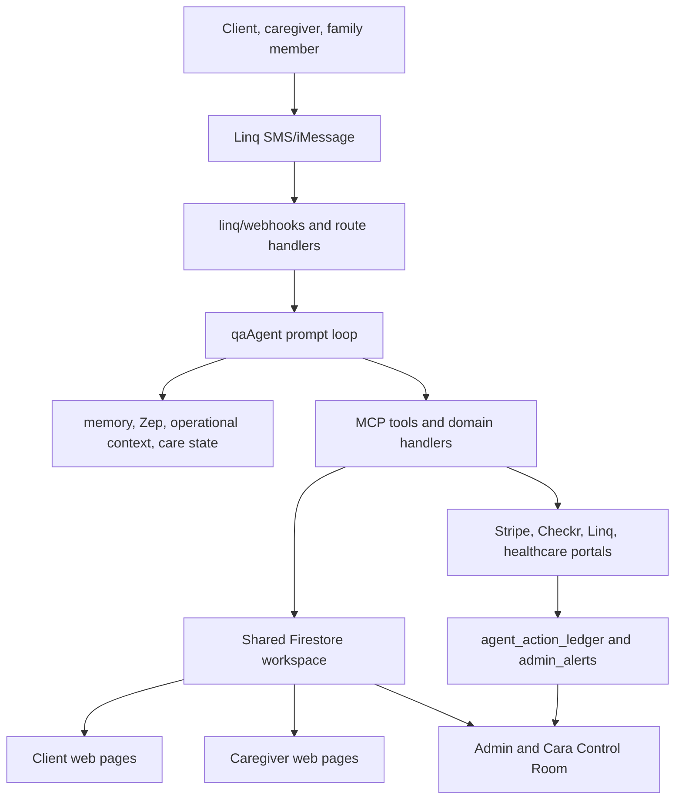

# Cara Agent-Native Launch Completion Plan

## Summary

This plan moves Cara from a strong vertical care assistant to a launch-ready agent-native product by closing the remaining gaps in action parity, admin execution, caregiver workflows, capability discovery, and prompt-composed behavior. The work keeps Cara over Linq as the primary product surface, keeps Firestore as the shared workspace, and treats healthcare/payment actions as high-risk flows requiring confirmation, auditability, and admin recovery.

---

## Problem Frame

The current build is materially beyond a generic chatbot: Cara has a large MCP tool surface, long-term memory, operational context injection, family-group handling, healthcare-action gating, shift-hour payment rails, and an Admin Cara Control Room. The latest agent-native audit scored the system around 66 percent overall: strong in context injection and shared workspace, partial in action parity and UI integration, weak in CRUD completeness and capability discovery.

The main launch risk is that Cara can act in many high-value workflows but not all web/admin workflows. Where parity is missing, users may trust Cara as the service but hit dead ends, especially caregivers and admins. Where coded state machines still dominate, behavior is harder to improve through prompts, evals, and tool composition.

---

## Requirements

### Agent Action Parity

- R1. Cara must support every launch-critical client action that the web app supports, including booking, rescheduling, cancellation, care-plan updates, family group membership, care journal interaction, messaging, support, payment-method links, invoices, timesheets, refunds, reminders, and reviews.
- R2. Cara must support every launch-critical caregiver action that the web app supports, including profile updates, availability, job browsing, applications, interview responses, booking responses, shift lifecycle, task completion, care journal/media updates, shift-hour submission, correction responses, payouts, earnings, tax summary, messaging, support, and referrals.
- R3. Cara must support admin exception handling for launch operations, not only alert visibility.
- R4. Parity must be enforced by tests or contract maps, not maintained only by documentation.

### Safety, Payments, And Healthcare

- R5. Healthcare actions must remain gated by account-holder confirmation for booking, refills, new prescriptions, portal actions, and other high-risk actions.
- R6. Payment, invoice, payout, refund, and shift-hour flows must write audit records and never report success when downstream payment, Linq delivery, or admin recovery failed.
- R7. Cara must avoid medical advice, route emergencies to 911 guidance, and create admin-visible safety alerts where appropriate.
- R8. Caregiver bookability must continue to require `onboardingStatus === "profile_complete"` and `verificationStatus === "approved"`, with Checkr `clear` as the automatic approval source.

### Shared Workspace And UI Reflection

- R9. Cara must write to the same Firestore collections and document shapes that client, caregiver, and admin pages read.
- R10. Agent-created or agent-updated state must be visible in the relevant web UI without manual database inspection.
- R11. `agent_tasks`, `agent_approvals`, `pending_actions`, and `agent_action_ledger` must have explicit rules, contracts, tests, and admin visibility.

### Conversation Quality And Discovery

- R12. Cara must answer as the service, not as a generic chatbot or support deflection layer.
- R13. Users must be able to discover what Cara can do through SMS and web surfaces.
- R14. Cara must handle messy human input with regression coverage, including vague messages, partial info, mid-flow questions, corrections, panic, frustration, and ambiguous yes/no replies.
- R15. Durable facts must respect fresh-tool and latest-user-message priority over older memory.

### Operational Readiness

- R16. Failed or risky agent actions must be recoverable by admins through explicit backend-backed controls, not only notes.
- R17. Launch verification must include local tests for client, caregiver, admin, healthcare, Linq, payment, memory, and Firestore-rules behavior.
- R18. No deploy or push is part of this plan unless a later explicit release plan authorizes it.

---

## Key Technical Decisions

- KTD1. Treat Cara as the primary service surface: The product promise is that users can text Cara to get real care work done, so missing parity is a product bug, not a nice-to-have.
- KTD2. Keep high-risk workflow tools business-aware for launch: Pure primitives are the agent-native ideal, but payments, healthcare, Checkr, and cancellations need invariant-preserving tools before launch.
- KTD3. Move toward prompt-composed orchestration incrementally: Existing state-machine handlers should be migrated behind characterization tests and shadow comparisons rather than replaced in one pass.
- KTD4. Use Firestore as the shared workspace contract: Cara and the web should share collections rather than maintain separate agent-only state, except for runtime-only records like `agent_sessions`.
- KTD5. Make Admin Cara Control Room executable: Recording operator intent is useful, but launch operations need backend-backed retry, replay, cancel, resolve, and manual-escalation actions.
- KTD6. Add discovery without making Cara feel like software: Capability discovery should be contextual and conversational, not a command manual dumped into every message.
- KTD7. Require regression tests for every new tool or parity bridge: Every new launch-critical action gets tests proving Firestore writes, UI-readable state, auth/rules behavior, and safe failure handling.

---

## High-Level Technical Design

The target architecture keeps the prompt loop responsible for understanding intent, using context, choosing tools, and speaking naturally. Domain tools enforce invariants and write shared state. Admin UI monitors the same ledgers and alerts the tools write, with executable recovery controls for launch operations.

---

## Implementation Units

### U1. Create And Enforce A Launch Action-Parity Map

- **Goal:** Turn the audit findings into a maintained parity contract covering client, caregiver, and admin actions.
- **Files:** `context/capability-map.md`, `functions/src/agents/toolCapabilities.ts`, `functions/src/mcp/server.ts`, `functions/src/agents/qaAgent.ts`, `tests/contractCollections.test.ts`, `functions/src/agents/toolCapabilities.test.ts`.
- **Patterns:** Follow the existing `MCP_TOOLS`, `CAREGIVER_TOOLS`, `TOOL_CAPABILITIES`, and prompt-tool list checks.
- **Work:** Add a table for each launch action with columns for actor, web surface, Firestore collection, Cara tool or handler, prompt mention, status, and test coverage. Mark missing actions as launch blockers or explicit non-goals.
- **Test Scenarios:** The parity test fails when a launch-critical map row lacks a tool or handler; fails when a mapped tool is not exposed to the appropriate actor prompt; fails when a launch-critical collection is not represented in the contract registry.
- **Verification:** `npm.cmd test -- --run tests/contractCollections.test.ts functions/src/agents/toolCapabilities.test.ts`.

### U2. Add Missing Caregiver Action Tools

- **Goal:** Close caregiver-side parity gaps that can break the worker experience.
- **Files:** `functions/src/mcp/server.ts`, `functions/src/agents/qaAgent.ts`, `functions/src/linq/routeCaregiver.ts`, `services/api.ts`, `components/caregiver/JobBoard.tsx`, `components/caregiver/CaregiverBookingsPage.tsx`, `components/caregiver/CaregiverHomeDashboard.tsx`, `components/caregiver/CaregiverPaymentsPage.tsx`.
- **Tools To Add:** `withdraw_job_application`, `respond_to_booking_request`, `start_shift`, `complete_shift`, `update_shift_task`, `submit_media_update`, `respond_to_shift_hour_correction`, `request_standard_payout`.
- **Patterns:** Reuse `submit_gps_checkin`, `submit_shift_hours`, `create_care_journal_entry`, `request_instant_payout`, and `send_client_message`.
- **Test Scenarios:** Caregiver withdraws an application through Cara and web status updates; caregiver accepts or declines a booking request through Cara and web reflects it; caregiver starts and completes a shift through Cara and `appointments`, `shifts`, and `shiftHours` stay consistent; caregiver toggles a visit task and the client/caregiver UI reads it; caregiver sends a media update through Cara and it appears in care journal/live updates; caregiver responds to a correction and client/admin state updates; standard payout request does not bypass Stripe/eligibility checks.
- **Verification:** Add or extend tests under `functions/src/mcp/__tests__/`, `functions/src/linq/__tests__/`, and caregiver page/service tests where existing harnesses support them.

### U3. Add Admin Execution Tools For Exceptions

- **Goal:** Make Cara/admin operations executable for launch, not only visible.
- **Files:** `functions/src/mcp/server.ts`, `functions/src/admin/*`, `services/api.ts`, `components/admin/AdminCaraControlRoom.tsx`, `components/admin/CaregiverVerificationDashboard.tsx`, `components/admin/TicketManager.tsx`, `components/admin/InvoicingTab.tsx`, `components/admin/AuditTrail.tsx`.
- **Tools Or Callables To Add:** `admin_review_caregiver_exception`, `admin_review_document`, `admin_suspend_user`, `admin_restore_user`, `admin_respond_support_ticket`, `admin_resolve_dispute`, `admin_review_invoice_exception`, `admin_retry_agent_action`.
- **Patterns:** Follow existing callable auth checks, admin-only Firestore rules, `agent_action_ledger`, `admin_alerts`, and audit log conventions.
- **Test Scenarios:** Non-admin calls are denied; admin can resolve a Checkr `consider` exception without marking bookable unless policy allows it; admin can respond to support tickets and the user sees the response; admin can resolve disputes and audit logs capture the outcome; admin retry records execute the intended backend action or fail visibly.
- **Verification:** Functions unit tests plus Firestore rules tests for admin-only collections and callables.

### U4. Make Control Room Recovery Backend-Executable

- **Goal:** Replace note-only recovery controls with safe backend-backed recovery actions.
- **Files:** `components/admin/AdminCaraControlRoom.tsx`, `services/api.ts`, `functions/src/mcp/server.ts`, `functions/src/agents/pendingActions.ts`, `functions/src/linq/threadMirror.ts`, `firestore.rules`.
- **Work:** Add callable-backed actions for retrying failed Linq sends, replaying a safe pending action, cancelling stale approvals, assigning ownership, resolving admin alerts, and marking manual recovery complete. Keep high-risk replays behind an explicit operator confirmation and audit log.
- **Test Scenarios:** Retry Linq delivery succeeds and ledger status changes; retry failure creates `admin_alerts`; high-risk replay without confirmation is rejected; marking handled requires reason; stale pending action can be cancelled without executing the tool.
- **Verification:** `functions/src/agents/pendingActions.confirm.test.ts`, `functions/src/linq/threadMirror.test.ts`, new Control Room service tests.

### U5. Fix Shared Workspace Contract Gaps

- **Goal:** Ensure all agent runtime collections that web/admin pages read have explicit contracts and Firestore rules.
- **Files:** `functions/src/data/contract.ts`, `firestore.rules`, `tests/contractCollections.test.ts`, `components/pages/QuickConfirmPage.tsx`, `services/api.ts`.
- **Collections:** `agent_tasks`, `agent_tasks_active`, `agent_approvals`, `pending_actions`, `agent_action_ledger`, `family_groups`, `family_group_members`, `shift_offers`.
- **Work:** Decide which collections are web-readable, admin-only, phone-token readable, or server-only. Update contract registry and Firestore rules accordingly. Move any unsafe direct web write behind callables.
- **Test Scenarios:** Quick-confirm page can read only the intended token-scoped action; clients cannot read other families' agent tasks; caregivers cannot read unrelated shift offers; admins can read control-room collections; contract tests fail on unregistered shared collections.
- **Verification:** `npm.cmd test -- --run tests/contractCollections.test.ts` plus rules tests.

### U6. Strengthen Healthcare Action Execution

- **Goal:** Keep real-world healthcare actions useful while preserving safety, consent, and auditability.
- **Files:** `functions/src/agents/healthcareHandler.ts`, `functions/src/browser/careWebActions.ts`, `functions/src/agents/pendingActions.ts`, `functions/src/agents/healthcareApproval.test.ts`, `functions/src/agents/healthcareActionGate.test.ts`, `docs/runbooks/healthcare-action.md`.
- **Work:** Standardize healthcare action states, required confirmations, account-holder checks, credential collection, audit events, and failure messages. Add explicit separation between read-only discovery and commit actions.
- **Test Scenarios:** Provider search is read-only; appointment booking requires exact approved slot; pharmacy refill requires account-holder confirmation; new prescription request avoids medical advice and requires condition/doctor context; emergency medical request tells user to call 911 and creates safety alert; failed portal action is admin-visible and does not claim success.
- **Verification:** Targeted healthcare tests and `npm.cmd --prefix functions exec tsc -- --noEmit`.

### U7. Improve Capability Discovery Without Making Cara Robotic

- **Goal:** Let users discover high-value Cara actions without generic chatbot UX.
- **Files:** `functions/src/linq/webhooks.ts`, `functions/src/agents/qaAgent.ts`, `functions/src/agents/operationalContext.ts`, `components/client/*`, `components/caregiver/*`, `components/admin/AdminCaraControlRoom.tsx`, `docs/data/cara-training-dataset.md`.
- **Work:** Add a concise SMS `HELP` or "what can you do?" response that adapts to client, caregiver, and family member roles. Add contextual suggested actions in web empty states and dashboard moments. Use recent state to suggest one relevant action rather than listing everything.
- **Test Scenarios:** Client asks "what can you do?" and receives role-relevant examples; caregiver asks the same and sees schedule/pay/job capabilities; secondary family member sees care-update capabilities but not payment approval authority; no response says "what can I help with?" when context exists.
- **Verification:** Extend `functions/src/agents/goldenTranscripts.test.ts` and web component tests where available.

### U8. Expand Messy-Human Golden Transcript Coverage

- **Goal:** Make Cara reliable under real SMS behavior, not only clean happy paths.
- **Files:** `functions/src/agents/goldenTranscripts.test.ts`, `functions/src/evals/caraTrainingDataset.ts`, `docs/data/cara-training-dataset.md`, `functions/src/agents/defaultPromptAugmenters.ts`, `functions/src/agents/voiceExemplars.ts`.
- **Scenarios:** Panic about a fall; vague "this charge is wrong"; partial family-add info; secondary family member asks to approve payment; caregiver asks if background check means they can work; caregiver sends half a referral; client says "yes" after several pending choices; user corrects a memory fact; user asks for medical advice; user sends a photo/sticker; user asks "how is Mom?" after a recent care note.
- **Test Scenarios:** Each transcript asserts no generic helper prompt, no medical advice, correct authority boundaries, one-question-at-a-time behavior, and correct tool/action selection where mocked.
- **Verification:** `npm.cmd test -- --run functions/src/agents/goldenTranscripts.test.ts`.

### U9. Convert Selected Coded Flows To Agent-Composed Tool Flows

- **Goal:** Reduce brittle hardcoded conversation paths without risking launch-critical behavior.
- **Files:** `functions/src/linq/routeIntent.ts`, `functions/src/linq/routeCaregiver.ts`, `functions/src/linq/webhooks.ts`, `functions/src/agents/qaAgent.ts`, `functions/src/agents/approvalHandler.ts`, `functions/src/agents/toolCapabilities.ts`.
- **Candidate Flows:** Family add/remove, caregiver referral, caregiver availability update, shift-hour correction, support ticket creation, and healthcare read-only discovery.
- **Work:** For each candidate, add characterization tests, run the existing coded path and agent-composed path in shadow where feasible, compare end-state projections, then switch only when results match.
- **Test Scenarios:** Mid-flow questions still get answered; incomplete inputs ask one missing question; confirmation gates still fire; duplicate inbound messages do not double-write or double-bill; STOP/START and emergency routing remain early exits.
- **Verification:** Existing route tests plus new shadow comparison tests.

### U10. Complete CRUD And Lifecycle Coverage For Core Entities

- **Goal:** Make launch entities manageable across client, caregiver, admin, and Cara surfaces.
- **Files:** `services/api.ts`, `functions/src/mcp/server.ts`, `functions/src/data/contract.ts`, `firestore.rules`, relevant `components/client/*`, `components/caregiver/*`, `components/admin/*`.
- **Entities:** `caregivers`, `clientIntakes`, `senior_profiles`, `carePlans`, `job_posts`, `appointments`, `booking_requests`, `shiftHours`, `threads`, `support_tickets`, `admin_alerts`, `care_journal`, `referrals`, `family_groups`, `agent_action_ledger`, `pending_actions`, `invoices`.
- **Work:** Define lifecycle operations for each entity. Use soft delete or terminal status for audit-sensitive entities instead of destructive delete. Add missing read/update/delete/cancel tools or admin operations where launch-critical.
- **Test Scenarios:** Each core entity has either full CRUD or a documented lifecycle alternative; destructive delete is blocked for audit/payment/health entities; soft-deleted or terminal entities stop appearing in user-active views but remain admin/audit-visible.
- **Verification:** Contract tests plus targeted service/function tests.

### U11. Strengthen Payment, Invoice, And Shift-Hour Auditing

- **Goal:** Ensure all money-moving or money-visible flows are safe and explainable.
- **Files:** `functions/src/billing/*`, `functions/src/stripe.ts`, `functions/src/mcp/server.ts`, `services/stripeService.ts`, `components/admin/InvoicingTab.tsx`, `components/caregiver/CaregiverPaymentsPage.tsx`, `components/payroll/*`, `services/api.ts`.
- **Work:** Confirm invoice auth, invoice visibility by actor, explicit tax/fee config, Resend-backed email status, shift-hour approval/dispute lifecycle, Stripe charge/transfer state, refund requests, instant/standard payouts, and audit events.
- **Test Scenarios:** Client can only approve/reject own invoices; caregiver can only see own payment records; missing payment method moves to `payment_failed`; duplicate approval does not double-charge; refund request creates admin-visible state; payout failure is ledgered and visible in Control Room.
- **Verification:** Billing/function tests plus typecheck and build.

### U12. Launch Verification Harness And Local Gates

- **Goal:** Provide one local proof path before anyone considers deploy or push.
- **Files:** `package.json`, `functions/package.json`, `tests/*`, `functions/src/**/*.test.ts`, `docs/reports/*`.
- **Gates:** `npm.cmd run typecheck`, `npm.cmd run build`, `npm.cmd --prefix functions run build`, `npm.cmd --prefix functions exec tsc -- --noEmit`, `npm.cmd test -- --run`, targeted functions tests, Firestore rules tests, callable-prefix guard, contract collection alignment, caregiver eligibility regression tests.
- **Launch Scenarios:** Client posts job and books caregiver; caregiver accepts/declines through Cara; caregiver starts/completes visit; shift hours approve/dispute/pay; care update reaches family group; payment approval remains primary-client-only; support ticket appears in admin; healthcare action requires confirmation; Checkr clear approves caregiver; Checkr exception stays unbookable.
- **Verification:** Save a local launch-readiness report under `docs/reports/` with exact commands run, pass/fail state, and unresolved blockers.

---

## Scope Boundaries

### In Scope

- Client, caregiver, family, and admin action parity for launch-critical workflows.
- Cara over Linq as the canonical conversational surface.
- Firestore contract/rules alignment for shared agent/web data.
- Healthcare-action safety, confirmation, and auditability.
- Admin Cara Control Room executable recovery controls.
- Local-only verification and documentation.

### Deferred

- Full replacement of all route handlers with an agent loop.
- Multi-provider healthcare automation beyond the current supported portal/pharmacy actions.
- Public virality mechanics outside care-update sharing, referrals, and family group loops.
- Production deployment, GitHub push, or PR creation.

### Out Of Scope

- Cara diagnosing, prescribing, or giving medical advice.
- Cara collecting raw card details, portal passwords in chat text, or sensitive credentials outside approved credential collection.
- Making caregivers bookable without completed onboarding and Checkr-clear approval.

---

## System-Wide Impact

- **Auth and rules:** New admin, caregiver, family, and token-scoped actions require Firestore rule and callable authorization coverage.
- **Payments:** Any shift-hour, invoice, payout, or refund change can affect Stripe charge/transfer correctness.
- **Healthcare:** Portal actions are high-risk because user trust depends on exact confirmation and truthful failure reporting.
- **Linq delivery:** Group chat, direct chat, retries, and delivery failures must remain traceable in ledger/admin alerts.
- **Memory:** Fresh user corrections and live Firestore/tool results must continue to outrank older memory and Zep context.
- **Admin operations:** Control Room must distinguish visibility, assignment, retry intent, actual replay, and final resolution.

---

## Risks And Mitigations

| Risk | Impact | Mitigation |
|---|---|---|
| New tools bypass existing business rules | Unsafe booking, payment, or verification state | Route tools through existing service/domain helpers where possible and add invariant tests |
| Admin replay causes duplicate side effects | Duplicate SMS, charges, bookings, or journal entries | Require idempotency keys, ledger state transitions, and explicit replay eligibility checks |
| Capability discovery makes Cara feel generic | Lower trust and lower conversion | Use role-aware, context-aware suggestions instead of broad menus |
| Firestore rules block new shared workspace reads | Web pages or quick-confirm flows fail at runtime | Add rules tests and contract registry coverage for each collection |
| Coded-flow migration regresses SMS behavior | Users get stuck mid-conversation | Characterization-first tests and shadow comparison before switching |
| Healthcare automation over-promises | Safety, trust, and compliance risk | Separate read-only discovery from commit actions and require account-holder confirmation |
| Payment retries double-charge | Financial harm | Idempotency tests around shiftHours, invoices, Stripe payment intents, and transfers |

---

## Acceptance Examples

- AE1. Given a caregiver with a pending booking request, when they text Cara "I can do it", then the booking state updates in shared Firestore and the caregiver web page reflects the accepted status.
- AE2. Given a caregiver wants to withdraw a job application, when they ask Cara to withdraw, then `job_posts` or related application state updates and the client/admin views no longer show the application as active.
- AE3. Given a family member asks to add a sibling, when Cara receives name and phone, then the sibling is added to the family group, receives a Linq welcome text, and the action is logged.
- AE4. Given a secondary family member replies `APPROVE` to a payment prompt, when Cara handles it, then payment is not approved and the response explains that the primary account holder must approve.
- AE5. Given a failed Linq delivery, when an admin requests retry in Control Room, then a backend callable retries or fails visibly and updates `agent_action_ledger`.
- AE6. Given a healthcare appointment slot has been found, when the family has not approved the exact slot, then Cara does not book it.
- AE7. Given a caregiver completes a visit twice by SMS retry, when shift hours are submitted, then only one billable `shiftHours` record or idempotent update exists.
- AE8. Given Checkr returns `consider`, when matching runs, then the caregiver remains unbookable and the admin exception queue shows the review item.
- AE9. Given a user says "what can you do?", when Cara replies, then the answer is role-specific, short, and contains real actions Cara can take.
- AE10. Given a user corrects an old memory fact, when Cara answers later, then the corrected fact outranks older memory and stale Zep context.

---

## Documentation And Operational Notes

- Update `docs/reports/` with a launch-readiness report after implementation and local verification.
- Update `docs/runbooks/healthcare-action.md` for any healthcare state or confirmation changes.
- Update `docs/data/cara-training-dataset.md` when new golden transcripts become stable reviewed examples.
- Keep `third_party/` untracked and out of launch commits.
- Do not deploy or push as part of this implementation batch.

---

## Sources And Existing Patterns

- `functions/src/mcp/server.ts` contains the current MCP tool registry and tool handlers.
- `functions/src/agents/qaAgent.ts` contains client/caregiver system prompts, memory priority, tool-loop behavior, and prompt-level voice constraints.
- `functions/src/agents/operationalContext.ts` injects pending actions, open alerts, failed actions, caregiver state, client state, and payment context.
- `functions/src/agents/toolCapabilities.ts` filters tools by intent and is the right place to keep capability buckets enforceable.
- `functions/src/data/contract.ts` is the current registry for Cara/web collection alignment.
- `components/admin/AdminCaraControlRoom.tsx` is the current admin surface for failed actions, alerts, pending approvals, support escalations, and proactive drafts.
- `services/api.ts` contains frontend Firestore subscriptions and admin operations.
- `firestore.rules` defines client, caregiver, family, admin, and server-only collection access.
- `functions/src/agents/goldenTranscripts.test.ts` is the current messy-conversation regression harness.
- `functions/src/linq/webhooks.ts`, `functions/src/linq/routeIntent.ts`, and `functions/src/linq/routeCaregiver.ts` contain current Linq inbound routing and coded state-machine flows.
