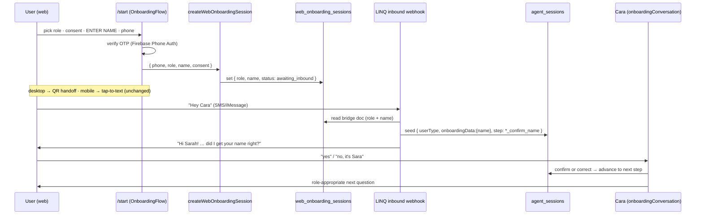

# feat: Capture name on `/start` and thread it to Cara

## Summary

Add a **"What's your name?"** step to the web onboarding flow (`/start`), placed
immediately before phone entry, for both the family (client) and caregiver sides.
Carry that name onto the existing `web_onboarding_sessions` bridge doc — alongside
the **role**, which is already captured from the signup button — so that when the
user texts "Hey Cara," Cara greets them by name, **confirms** it, and continues the
conversation without re-asking. Skipping the redundant name question (and already
knowing client-vs-caregiver) makes the SMS handoff feel like the person is "already
registered," matching the Poke-style getting-started experience the request points to.

**What already exists and is NOT being rebuilt:** the desktop QR-code handoff page,
the mobile tap-to-text handoff, the role capture from the signup CTA
(`/start?role=client` vs `/start?role=caregiver`), and the inbound-SMS bridge that
pre-registers the user and skips SMS-side OTP. This plan extends that machinery with
one new field (name) and one new conversational step (name confirmation).

---

## Problem Frame

The current `/start` flow collects role → consent → phone → verify, then hands off to
SMS. Cara only learns the user's name *after* they text in, by asking "What's your
name?" as her first onboarding question. The request wants the name collected on the
web form (like Poke's "What's your name?" screen) so that:

1. The name is known before the SMS conversation starts.
2. Cara greets the person by name on her very first message instead of asking for it.
3. Combined with the already-captured role, the user feels recognized and
   "pre-registered" the moment they text in.

The role half of this is already implemented. The gap is purely **name capture +
threading + a name-confirmation step** on Cara's side.

---

## Requirements

- **R1** — `/start` presents a name-entry step after the consent screen and before the
  phone-entry step, for both `client` and `caregiver` roles, in both visual tones
  (light/family, dark/caregiver).
- **R2** — The entered name is sent to the `createWebOnboardingSession` callable and
  persisted on the `web_onboarding_sessions` bridge doc (server-side, sanitized).
- **R3** — When the user texts "Hey Cara" and a name is present on their bridge doc,
  Cara's first message greets them by name and asks them to confirm it (per the
  product decision: greet **and** confirm, not silently skip).
- **R4** — On confirmation, Cara proceeds to her next onboarding question without
  re-asking the name. On a correction, Cara captures the corrected name and then
  proceeds.
- **R5** — Role continues to drive the conversation branch (client → family flow,
  caregiver → caregiver flow); this is preserved, not changed.
- **R6** — Backward compatibility: a bridge doc with **no** name (older sessions,
  cold inbound with no web session) falls back to the existing "ask name" behavior
  unchanged.
- **R7** — Name input is validated and sanitized before storage; no new
  client-writable Firestore surface is introduced (the callable writes via admin SDK).

### Success criteria

- A user completing `/start` on desktop, scanning the QR code, and sending the
  pre-filled "Hey Cara" receives a first reply that uses their name and asks them to
  confirm it — then, after "yes," is asked the role-appropriate second question.
- A user who never provides a name (legacy/cold path) experiences the existing flow
  with no regression.

---

## Key Technical Decisions

- **KTD1 — Name rides the existing bridge doc, not the SMS body.** The inbound webhook
  joins the web session to the SMS conversation by **phone number** (the
  `web_onboarding_sessions` doc id is the E.164 phone). The name is read server-side
  from that doc, so it does **not** need to be embedded in the QR/SMS "Hey Cara" body.
  The handoff payload (`smsBody: "Hey Cara"`, `linqPhone`) is unchanged.
- **KTD2 — Greet-and-confirm via a new conversational step**, not a silent skip.
  Per the product decision, Cara confirms the name before proceeding. This is modeled
  as new onboarding steps `client_confirm_name` / `caregiver_confirm_name` rather than
  overloading the existing `*_ask_name` steps, keeping the legacy ask-name path intact
  for nameless sessions (R6).
- **KTD3 — Pre-seed `onboardingData` tentatively.** The webhook writes the web name
  into `onboardingData` (`firstName` for clients, `name` for caregivers — matching the
  field names the existing ask-name handlers use) when creating the `agent_sessions`
  doc, so a confirmation needs no re-write and a correction is a simple merge.
- **KTD4 — Confirmation parsing uses `parseWithClaude`, not keyword matching.** The
  user may reply "yes," "yep that's me," "no, it's Sara," or just send a corrected
  name. Per the Cara AI-agentic rules, intent + extraction goes through an LLM
  (`parseWithClaude`) returning `{confirmed, correctedName?}`, validated before use.
  The strict `YES/NO` bypass is **not** used here because we must also accept a
  free-form corrected name.
- **KTD5 — Name placement: consent → name → phone.** The name step sits directly
  before phone entry ("the page before they put the number"), not as the first screen,
  so the existing role-pick and consent gating are untouched.

---

## High-Level Technical Design

---

## Implementation Units

### U1. Add the name-capture step to the web onboarding flow

**Goal:** Collect the user's name on `/start` between consent and phone entry, for both
tones, and pass it into session creation.

**Requirements:** R1, R5, R7

**Dependencies:** none

**Files:**
- `components/auth/onboarding/OnboardingFlow.tsx` (modify)
- `utils/sanitize.ts` (reference — reuse existing sanitizer for the name input)
- `components/auth/onboarding/OnboardingFlow.test.tsx` (create, if a test harness for
  this component does not already exist; otherwise extend)

**Approach:**
- Extend the `Step` union with `'name'`: `'role' | 'consent' | 'name' | 'phone' | …`.
- Add `name` / `setName` state. Trim and bound length on input; sanitize on submit.
- Add a `NameEntry` step component mirroring the existing `PhoneEntry` structure and
  both tone branches (light/family emerald, dark/caregiver blue). Single text input
  ("Your first name"), Continue button disabled until non-empty, `← Back` to consent.
- Re-wire transitions:
  - Consent `onContinue` → `setStep('name')`.
  - Name `onContinue` → `setStep('phone')`; Name `onBack` → `setStep('consent')`.
  - Phone `onBack` → `setStep('name')` (currently `'consent'`).
- In `confirmCode`, include `name` in the `createWebOnboardingSession` payload.

**Patterns to follow:** the existing `PhoneEntry` / `ConsentScreen` components in the
same file (tone-branched render, shared shell, autofocus, disabled-state styling).

**Test scenarios:**
- Renders the name step after consent and before phone, in both tones.
- Continue is disabled when the field is empty/whitespace; enabled with a value.
- Back from name returns to consent; back from phone returns to name.
- The trimmed, sanitized name is included in the `createWebOnboardingSession` call
  payload on successful code confirmation.
- A name containing markup/script is sanitized before being placed in the payload.

---

### U2. Persist the name on the bridge doc in `createWebOnboardingSession`

**Goal:** Accept, validate, and store the name on the `web_onboarding_sessions` doc.

**Requirements:** R2, R7

**Dependencies:** U1 (payload shape)

**Files:**
- `functions/src/index.ts` (modify `createWebOnboardingSession`)
- `functions/src/data/contract.ts` (document the new `name` field on
  `web_onboarding_sessions`)

**Approach:**
- Read `data.name`, trim, cap length (e.g. ≤ 80 chars), strip control characters.
  Treat empty/missing as "no name" (omit the field rather than storing `""`) so the
  webhook's name-present check (U3) stays clean and R6 fallback holds.
- Add `...(name ? { name } : {})` to the existing `.set({...}, { merge: true })` write.
- No Firestore rules change: the doc is written by the admin SDK inside the callable,
  which bypasses rules; the existing read rule (owner-uid match) already covers the
  doc and the added field.
- Keep the return payload unchanged (`linqPhone`, `smsBody: "Hey Cara"`, `expiresInMs`).

**Patterns to follow:** the existing param handling in the same callable (phone/role/
consent/referralId validation and the `merge: true` write).

**Test scenarios:**
- A valid name is persisted on the bridge doc (and trimmed).
- An over-long name is truncated to the cap; control characters are stripped.
- Missing/empty name results in no `name` field on the doc (not an empty string).
- Existing fields (role, status, consent, referral handling) are unaffected.
- Unauthenticated / token-phone-mismatch calls still reject before any write
  (regression guard on the existing auth gate).

---

### U3. Seed the name and route to the confirm step in the inbound bridge

**Goal:** When a bridge doc carries a name, pre-seed `agent_sessions.onboardingData`,
route to the new confirm step, and greet by name; otherwise preserve existing behavior.

**Requirements:** R3, R5, R6

**Dependencies:** U2, U4 (the confirm step names must exist)

**Files:**
- `functions/src/linq/webhooks.ts` (modify the web-onboarding bridge branch, ~lines
  631–723)

**Approach:**
- Read `webSessionData.name` alongside `role` and `referralId`.
- For the **new-user** branch (`!isReturning`):
  - When a name is present, set `onboardingStep` to `client_confirm_name` /
    `caregiver_confirm_name` and write `onboardingData: { firstName: name }` (client)
    or `onboardingData: { name }` (caregiver) into the `agent_sessions` doc `.set`.
  - When no name is present, keep the current `firstStep` (`*_ask_name`) and no
    pre-seeded `onboardingData` — unchanged legacy path (R6).
- Replace the role-aware welcome string so that, when a name is present, it greets by
  name and asks for confirmation instead of "What's your name?". Keep the existing
  no-name welcome text for the fallback path. Preserve the `es`/`en` language branch.
- The **returning-user** branch is unchanged (they already have an account; name
  capture is for new onboarding).

**Patterns to follow:** the existing bridge branch's `agent_sessions.doc(phone).set(…)`
shape and the `preferredLanguage`-branched welcome composition already in this file.

**Test scenarios:**
- Bridge doc with a name (client) → `agent_sessions` seeded with
  `onboardingData.firstName`, step `client_confirm_name`, welcome contains the name and
  a confirmation ask.
- Bridge doc with a name (caregiver) → seeded `onboardingData.name`, step
  `caregiver_confirm_name`, name-aware welcome.
- Bridge doc with **no** name → existing `*_ask_name` step and "What's your name?"
  welcome (no regression).
- Spanish-language inbound with a name → name-aware welcome in Spanish.
- Returning user (existing `users` doc) with a name on the bridge → welcomed back,
  not routed into the confirm step.
- Bridge `status` flips to `connected` and `chatId` is recorded (existing behavior
  preserved).

---

### U4. Add the name-confirmation step handlers

**Goal:** Implement `client_confirm_name` / `caregiver_confirm_name` handlers that
confirm or correct the name, then advance to the next onboarding question.

**Requirements:** R3, R4

**Dependencies:** none (can land before U3 references it)

**Files:**
- `functions/src/agents/onboardingConversation.ts` (modify)

**Approach:**
- Register both steps in the main step `switch`, in `CLIENT_STEP_ORDER` /
  `CLIENT_STEP_FIELD` (and the caregiver equivalents), and in the re-ask
  `stepMessages` map used by the `isQuestionOrOther` guard.
- `handleClientConfirmName` / `handleCaregiverConfirmName`:
  - Top-of-handler `isQuestionOrOther` guard → answer mid-flow → re-ask the
    confirmation question (per the Cara new-handler checklist).
  - `parseWithClaude` with a prompt returning JSON `{confirmed: boolean,
    correctedName: string|null}` — "yes/yep/correct" → confirmed=true; a different
    name (with or without "no") → confirmed=false + correctedName.
  - If `confirmed` → keep the seeded name, advance: client →
    `client_ask_senior`; caregiver → `caregiver_ask_location` (mirror the tail of the
    existing `handleClientAskName` / `handleCaregiverAskName`, including the
    `generateCaraMessage` next-question prompt and, for caregivers, `locationPrompt`).
  - If a `correctedName` is returned → `mergeOnboardingData` with the corrected
    `firstName`/`name`, acknowledge the correction, then advance as above.
  - If parsing is ambiguous/empty → re-ask the confirmation once.
- Reuse the exact next-step transitions and message-generation patterns from
  `handleClientAskName` (line ~579) and `handleCaregiverAskName` (line ~1222) so the
  downstream flow is identical to the legacy ask-name path.

**Execution note:** mirror the existing ask-name handlers closely — the only new
behavior is the confirm/correct branch at the top; the advance-to-next-step tail
should be functionally identical.

**Test scenarios:**
- Client says "yes" → step advances to `client_ask_senior`, name preserved, next
  question asks who they're caring for.
- Caregiver says "yep" → advances to `caregiver_ask_location` with a location prompt.
- User replies "no, it's Sara" → `onboardingData` name updated to "Sara", correction
  acknowledged, then advances.
- User replies with just a corrected name ("Sara") → treated as a correction.
- User asks a mid-flow question ("is this free?") → `isQuestionOrOther` answers it,
  then re-asks the confirmation.
- Ambiguous reply → confirmation is re-asked, step does not advance.
- `parseWithClaude` parse error → safe fallback (re-ask), no crash.

---

### U5. Update the data contract, types, and progress tracker

**Goal:** Keep the documented contract and session types in sync, and record the work.

**Requirements:** R2, R6

**Dependencies:** U2, U3, U4

**Files:**
- `functions/src/data/contract.ts` (note `name` on `web_onboarding_sessions`; confirm
  `onboardingData` shape covers `firstName`/`name`)
- The `AgentSession` type definition (add the two new `onboardingStep` literals if the
  step type is a closed union — locate via the `AgentSession` import in
  `onboardingConversation.ts`)
- `context/progress-tracker.md` (record this feature per CLAUDE.md)

**Approach:**
- Add the new step literals to the session/onboarding type if it enumerates steps.
- Document the `name` field and the two new confirm steps in the contract file
  alongside the existing `web_onboarding_sessions` / onboarding entries.
- Append a progress-tracker entry describing the name-capture + confirm-step feature.

**Test scenarios:** `Test expectation: none — type/doc/tracker changes only.` Type
safety is exercised by the build (`npm --prefix functions run build`) and by U1/U3/U4
tests compiling against the updated union.

---

## Scope Boundaries

**In scope:** name capture on `/start`; persistence on the bridge doc; name-aware
greeting + confirm step on Cara's side; backward-compatible fallback for nameless
sessions; preserving the already-built role routing and QR/mobile handoff.

**Not in scope (already built):** the QR-code handoff page, mobile tap-to-text handoff,
role capture from the signup CTA, the inbound bridge that skips SMS-side OTP.

### Deferred to Follow-Up Work
- Pre-filling the *senior's* name or other fields from the web form (only the
  signing-up user's name is captured here).
- Embedding the name in the QR/SMS body (unnecessary — phone is the join key, KTD1).
- Unifying the phone-keyed vs uid-keyed caregiver identity model (tracked separately
  in `context/progress-tracker.md`).

---

## Risks & Dependencies

- **Closed step union:** if `AgentSession.onboardingStep` is a strict string-literal
  union, the new steps must be added there or the functions build fails — covered by
  U5. Low risk, caught at compile time.
- **Name parsing edge cases:** confirm/correct classification relies on the LLM; the
  handler must degrade safely (re-ask) on ambiguous or error responses — covered by
  U4 test scenarios.
- **Sanitization:** untrusted name input flows to Firestore and into an LLM prompt;
  must be sanitized/bounded (U1 client-side, U2 server-side) per CLAUDE.md conventions.

---

## Sources & Research

All grounding is local (no external research needed — strong existing patterns):
- `components/auth/onboarding/OnboardingFlow.tsx` — step machine, tone components.
- `functions/src/index.ts` — `createWebOnboardingSession` callable.
- `functions/src/linq/webhooks.ts` — inbound web-onboarding bridge branch.
- `functions/src/agents/onboardingConversation.ts` — `handleClientAskName`,
  `handleCaregiverAskName`, step order/field maps, `mergeOnboardingData`.
- `firestore.rules` — `web_onboarding_sessions` access rules (no change required).
- `hooks/useOnboardingSession.ts` — web-side bridge status listener (no change required).
- `CLAUDE.md` — Cara AI-agentic rules (LLM-for-intent, `parseWithClaude`, handler
  checklist), sanitization conventions.
