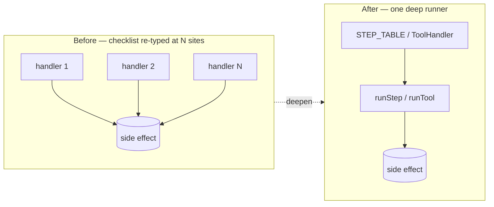
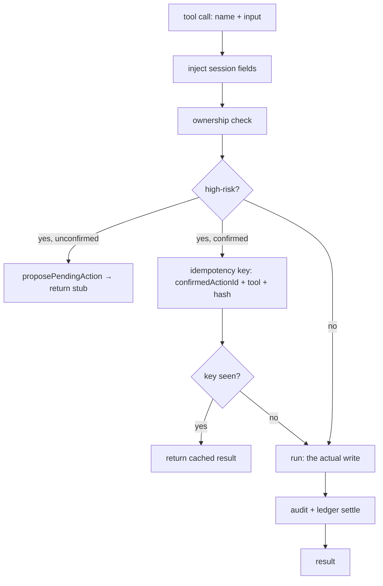
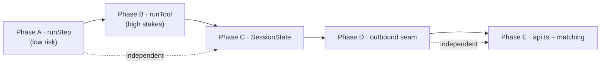

# refactor: Deepen the Cara core — five shallow modules into deep ones

## Summary

The 2026-06-21 architecture review found the same shape in five places: **shallow modules whose interface is a hand-followed checklist**. The convention lives in CLAUDE.md and reviewers' heads, not behind a seam. This plan deepens all five into modules where the checklist runs once, behind one interface that is also the test surface.

Delivered in five phases, sequenced low-risk → high-stakes → broad:

- **Phase A — `runStep`**: collapse 17+ near-identical onboarding/router handlers into a step table + one runner.
- **Phase B — `runTool`**: deepen the 113-tool MCP layer so injection, ownership, the confirm-gate, idempotency, and audit apply uniformly — and close the confirmed-action idempotency hazard on money-moving tools.
- **Phase C — `SessionState`**: give the 66 session flags one owner with TTL, validated reads, and transactional clear.
- **Phase D — outbound chokepoint**: make safety linting cross the same transport seam voice cleanup already does; retire dead `outboundGuard`.
- **Phase E — `services/api.ts`**: carve the 187-method facade into domain stores, enforce the no-direct-`db` seam, and settle the matching stack with the deletion test.

This is a refactor: **behavior is preserved**. Each phase is characterization-first — existing golden/characterization suites (`handleInbound.routing.test.ts`, `routeIntent.characterization.test.ts`, the 229-case Cara eval) are the regression net, extended before each cut.

---

## Problem Frame

Cara is the strategic core, and its agency loop (propose → confirm → execute) runs through code that re-implements the same cross-cutting checklist at every site:

- **Onboarding/routers**: ~27% of `onboardingConversation.ts` (3,263 lines) is the six-step checklist (`isQuestionOrOther` → `parseWithClaude` → validate → ack → merge → advance → send) re-typed across 17+ handlers, with error handling that drifts per handler.
- **MCP tools**: a ~3,000-line switch where ownership (~47% coverage), audit (~70%), and idempotency are applied inline and inconsistently. Confirmed-action re-runs rely on each handler being *incidentally* idempotent — a correctness hazard the day a tool moves money through Stripe.
- **Session state**: 66 flags read/written across three files with no TTL owner; flags are destructured via `(session as any)` with no shape guard.
- **Outbound**: voice cleanup is a real chokepoint every message crosses (`normalizeParts`); safety supervision is not — 50+ scripted sends and every `sendToPhone` bypass it, and `outboundGuard` is dead code posing as a safety layer.
- **Frontend service**: a 187-method flat `dbService` (shallow — interface ≈ implementation) whose seam is cosmetic; 15 components reach past it with direct Firestore calls.

The cost is poor testability (you test *past* the interface, not through it), poor AI-navigability (understanding one flow crosses many files), and — for tools — a live correctness risk.

---

## Requirements

This plan advances the release-gating success criteria in `context/project-overview.md` and the Cara rules in `CLAUDE.md`:

- **R1** — No behavior change. The Cara eval (229 cases) and the routing characterization suites stay green at every unit boundary. *(Success criterion #5: build + typecheck green.)*
- **R2** — Every Cara handler keeps the CLAUDE.md checklist (`isQuestionOrOther` → `parseWithClaude` → validate → ack → send); after Phase A it is enforced by the runner, not by convention. *(Success criterion #6: no regex/keyword intent parsing.)*
- **R3** — Confirmed high-risk tool actions execute **exactly once** even on SMS retry / re-run. *(Success criterion #4: idempotent state advance.)*
- **R4** — Audit and ownership checks become structural for tools, not per-handler opt-in. *(Entity-lifecycle policy: audit-sensitive entities.)*
- **R5** — Every outbound path strips banned content and redacts PII at one seam.
- **R6** — Components stop making direct `db.collection()` calls; the `services/api.ts` seam is enforced by a guard test. *(CLAUDE.md convention.)*
- **R7** — The matching stack is either wired or deleted — no dead `mlMatchScoring`.

---

## Key Technical Decisions

**KTD-1 — Adapter-first, migrate incrementally.** Each new deep module (`runStep`, `runTool`, `SessionState`, the domain stores) is introduced as an adapter over the existing implementation, then call sites migrate in batches. No big-bang rewrite of a 3,000-line switch or a 187-method object. This keeps every unit landable as an atomic commit with the suite green.

**KTD-2 — Tool-as-data, runner-owns-concerns.** A `ToolHandler` descriptor carries `{ name, schema, injects, ownership, idempotencyKey, audit, run }`; `runTool` applies the cross-cutting bands. The existing `handleToolCall`/`handleToolCallForCaregiver` switch becomes the `run` body during migration, peeled off per tool. The confirm-gate keeps using `pendingActions.isHighRisk`/`proposePendingAction`/`isConfirmedActionValid`/`claimPendingAction` unchanged — `runTool` orchestrates them instead of each handler.

**KTD-3 — Idempotency key derived, not stored ad-hoc.** For confirmed actions, `runTool` computes a key from `_confirmedActionId + toolName + stableHash(input)` and records execution in a server-only ledger collection; a repeat key returns the cached result instead of re-firing. This is the R3 correctness fix and the one place behavior *intentionally* changes (from "incidentally idempotent" to "idempotent by construction"). Reuses the `webhookLedger.ts` claim/settle pattern already in the repo.

**KTD-4 — Lint at transport, supervise on the agent path.** Full constitutional `supervise` is a Claude round-trip — too slow to put on every scripted send. So the **cheap synchronous** linting (`lintPreservingLayout`) + PII redaction moves *down* to the transport chokepoint (`normalizeParts`/`sendOneMessage`) where it already partly lives, guaranteeing R5 for all paths; full async `supervise` stays on the QA-agent path only. `outboundGuard`'s PII logic folds into the transport guard, then `outboundGuard.ts` is deleted.

**KTD-5 — Stores re-exported from `api.ts` for back-compat.** Phase E splits `dbService` into domain stores but keeps `dbService` as a thin re-export aggregating them, so the 27 importing components don't churn in the same PR as the carve. The seam-enforcement guard and the direct-`db` migration follow.

**KTD-6 — Characterization-first on every refactor unit.** Refactor units that touch routing or tool dispatch carry an `Execution note` to extend the existing characterization/golden suite *before* changing code, so the net exists before the cut.

---

## High-Level Technical Design

### The recurring deepening (shallow → deep)

### `runTool` band ordering (Phase B)

### Phase sequencing and dependencies

Phases A→B→C→D→E is the recommended order (low-risk warm-up, then the money-moving core while attention is highest, then breadth). A and C, and D and E, are independent and could be reordered or parallelized across contributors if desired (see Open Questions).

---

## Implementation Units

### Phase A — Collapse the conversational step into `runStep`

#### U1. Define `ConversationStep` and the `runStep` runner

**Goal:** A deep module that runs the CLAUDE.md checklist once: question-gate → parse → validate → conversational ack → atomic merge+advance → send.

**Requirements:** R1, R2.

**Dependencies:** none.

**Files:**
- `functions/src/agents/conversationStep.ts` (new — types + `runStep`)
- `functions/src/agents/__tests__/conversationStep.test.ts` (new)

**Approach:** `ConversationStep` is a descriptor: `{ id, parsePrompt, validate, field, ack?, nextStep, questionReask }`. `runStep(step, ctx)` where `ctx = { phone, chatId, text, session }`:
1. `isQuestionOrOther(text)` → if true, answer mid-flow, re-ask `step.questionReask`, return.
2. `parseWithClaude(step.parsePrompt, text)` → run `step.validate` → on `__parse_error__`/invalid, re-ask with the step's fallback.
3. Conversational ack of the parsed value (via `generateCaraMessage`).
4. **Atomic** merge of `{ [step.field]: value }` + `{ onboardingStep: step.nextStep }` in one Firestore write (fixes today's two-write half-update gap).
5. Send the next question.

Reuse existing helpers verbatim (`parseWithClaude`, `isQuestionOrOther`, `mergeOnboardingData`/`updateSession` collapsed into one batched write, `generateCaraMessage`, `sendMessage`). Pure-where-possible: the parse/validate/ack-text decisions return data; only the final step performs the write+send, so most of the contract is testable without Firestore.

**Patterns to follow:** existing handler bodies in `onboardingConversation.ts` (`handleClientAskName` lines 680–705); Firestore-mock harness in `functions/src/mcp/__tests__/booking.test.ts` (`vi.hoisted` + in-memory Map).

**Test scenarios:**
- Happy path: valid input parses → field merged, step advanced to `nextStep`, next question sent (one write, not two).
- Question mid-flow: `isQuestionOrOther` true → answer sent, current question re-asked, **no** field write, step unchanged.
- Parse error: `parseWithClaude` returns `__parse_error__` → fallback re-ask, no advance.
- Validation reject: parsed value fails `validate` → re-ask, no advance.
- Atomicity: merge+advance is a single batched write (assert one `.update`/batch call, both fields present).
- Ack: parsed value is acknowledged before the next question (assert ack text references the value).

**Verification:** `runStep` drives a representative step end-to-end against the in-memory Firestore harness with no reference to `onboardingConversation.ts`.

---

#### U2. Migrate client onboarding steps to a `CLIENT_STEPS` table

**Goal:** Replace the client `handle*` step handlers with table entries dispatched through `runStep`.

**Requirements:** R1, R2.

**Dependencies:** U1.

**Files:**
- `functions/src/agents/onboardingConversation.ts` (modify — `handleOnboardingStep` dispatch + remove migrated client handlers)
- `functions/src/agents/onboardingSteps.client.ts` (new — `CLIENT_STEPS` table)
- `functions/src/agents/__tests__/onboardingConversation.client.test.ts` (new — characterization)

**Approach:** Build `CLIENT_STEPS` covering `client_ask_name` → `client_ask_senior` → `client_ask_needs` → `client_ask_location` → `client_ask_schedule` → `client_ask_start` → `client_ask_preferences` → `client_ask_budget`. `handleOnboardingStep` looks up the step in the table and calls `runStep`; non-table steps (name-confirm, location with reverse-geocode) keep bespoke handlers but may pass a custom `validate`/`ack`. Delete migrated handler functions.

**Execution note:** Characterization-first — capture current per-step prompts and transitions in the new test (drive `handleOnboardingStep` with the in-memory harness) *before* deleting handlers, so the table is proven to reproduce them.

**Patterns to follow:** `routeIntent.characterization.test.ts` for characterization style; dispatch switch at `onboardingConversation.ts:474`.

**Test scenarios:**
- Covers R2. Each migrated client step: valid answer advances to the correct `nextStep` with the same field key as today.
- Location step retains reverse-geocode behavior (inbound location pin → stored location).
- A mid-flow question at any client step re-asks that step's question (matches pre-refactor text).
- Full client onboarding walk (name→budget) reaches the same terminal step as before.

**Verification:** new characterization suite green; existing onboarding-adjacent suites unchanged.

---

#### U3. Migrate caregiver onboarding steps to a `CAREGIVER_STEPS` table

**Goal:** Same collapse for the caregiver path (the larger set).

**Requirements:** R1, R2.

**Dependencies:** U1.

**Files:**
- `functions/src/agents/onboardingConversation.ts` (modify)
- `functions/src/agents/onboardingSteps.caregiver.ts` (new — `CAREGIVER_STEPS` table)
- `functions/src/agents/__tests__/onboardingConversation.caregiver.test.ts` (new — characterization)

**Approach:** Table covers `caregiver_ask_name` → location → experience → specialties → availability → job-type → rate → email → bio. Steps with side effects beyond merge (photo/document upload, membership, Checkr, Connect) stay bespoke and are **not** forced into `runStep` — `runStep` covers the linear-question steps only; finalization keeps its own handler. Document this boundary in the table file header.

**Execution note:** Characterization-first, as U2.

**Test scenarios:**
- Each migrated caregiver step advances correctly with the same field keys.
- Rate parsing retains its validation (numeric/`$`-stripping behavior preserved).
- Mid-flow question re-asks the current step.
- The non-linear steps (upload, membership, Checkr, Connect) are untouched — assert they still route to their bespoke handlers.

**Verification:** characterization suite green; Cara eval 229/229 unchanged.

---

### Phase B — Deepen the MCP tool into `runTool`

#### U4. Define `ToolHandler` descriptor and the `runTool` runner (adapter over the switch)

**Goal:** One runner that applies field injection, ownership, the confirm-gate, and audit; the existing switch becomes the `run` body initially.

**Requirements:** R1, R4.

**Dependencies:** none (independent of Phase A).

**Files:**
- `functions/src/mcp/runTool.ts` (new — `ToolHandler` type + `runTool`)
- `functions/src/mcp/__tests__/runTool.test.ts` (new)

**Approach:** `ToolHandler = { name, schema, injects, ownership?, idempotent?, audit?, run }`. `runTool(name, input, ctx)`:
1. Inject session fields (`phone`, `chatId`, `clientId`/`userId`, `caregiverId`) — replaces the manual enrichment in `qaAgent.ts:1513–1528`.
2. Run `ownership` if present → `toolError("PERMISSION_DENIED", …)` on deny.
3. Confirm-gate via existing `pendingActions` (`isHighRisk`/`proposePendingAction`/`isConfirmedActionValid`/`claimPendingAction`) — orchestrated here, not in handlers.
4. Call `run` (delegates to existing `handleToolCall` during migration).
5. Fire `audit` uniformly.

Keep `toolError` and the `_toolError` result shape. `runTool` wraps both `handleToolCall` and `handleToolCallForCaregiver` via an actor param.

**Patterns to follow:** confirm-gate sequence at `mcp/server.ts:2035–2099`; `pendingActions.ts` exports (signatures confirmed); `booking.test.ts` mock harness.

**Test scenarios:**
- Injection: caller passes bare tool input; `run` receives session fields merged in.
- Ownership deny → `PERMISSION_DENIED`, `run` not called.
- High-risk unconfirmed → `proposePendingAction` called, stub returned, `run` not called.
- High-risk confirmed-valid → `run` called once, audit fired.
- Audit fires for a read tool and a write tool consistently.
- Error path: `run` throws → returns `_toolError` shape, audit still records the attempt.

**Verification:** `runTool` reproduces current dispatch behavior for a sample of tools through the harness.

---

#### U5. Idempotency-by-construction for confirmed actions

**Goal:** Confirmed high-risk actions execute exactly once on re-run/SMS retry (the R3 correctness fix).

**Requirements:** R3.

**Dependencies:** U4.

**Files:**
- `functions/src/mcp/runTool.ts` (modify — idempotency band)
- `functions/src/mcp/toolExecutionLedger.ts` (new — claim/settle, server-only)
- `firestore.rules` (modify — server-only `tool_execution_ledger`)
- `functions/src/mcp/__tests__/runTool.idempotency.test.ts` (new)

**Approach:** In `runTool`, when a confirmed action runs, derive `key = confirmedActionId + ":" + name + ":" + stableHash(input)`. Claim the key in `tool_execution_ledger` before `run` (mirroring `utils/webhookLedger.ts` `claim`/`settle`); on a repeat key, return the recorded result instead of calling `run`. Fail-open on ledger infra error (at-least-once > dropped) — but log. Register the collection in `functions/src/data/contract.ts` and lock it down in rules.

**Execution note:** Add a failing test for the double-fire case first (re-run a confirmed `request_booking` / payout tool twice → one effect).

**Patterns to follow:** `functions/src/utils/webhookLedger.ts` (claim/settle semantics); `__tests__/webhookIdempotency.test.ts`.

**Test scenarios:**
- Covers R3. Same confirmed action run twice → `run` invoked once, second call returns cached result, no second side effect.
- Distinct inputs under the same `confirmedActionId` → distinct keys, both run.
- Ledger write failure → fails open (action runs), logged.
- Non-confirmed (read) tools skip the ledger entirely.
- Idempotency for a money-moving tool specifically (`request_instant_payout` / `submit_shift_hours`) — no double-charge.

**Verification:** new idempotency suite green; `tests/contractCollections.test.ts` and `tests/entityLifecycle.test.ts` accept the new server-only collection.

---

#### U6. Migrate money-moving and high-risk tools to descriptor form

**Goal:** Prove the runner by moving the highest-stakes tools off the inline switch into `ToolHandler` descriptors.

**Requirements:** R1, R3, R4.

**Dependencies:** U4, U5.

**Files:**
- `functions/src/mcp/server.ts` (modify — peel migrated cases)
- `functions/src/mcp/tools/` (new — one descriptor module per migrated tool or a grouped file)
- `functions/src/mcp/__tests__/booking.test.ts`, `communication.test.ts` (extend)

**Approach:** Migrate first: `request_booking`, `cancel_appointment`, `reschedule_appointment`, `submit_shift_hours`, `request_instant_payout`, `request_standard_payout`, `update_care_plan`. Each becomes a descriptor with explicit `ownership`, `idempotent: true` where applicable, and `audit`. `qaAgent.ts` tool-invocation loop calls `runTool` for migrated names, falls through to the legacy switch for the rest (a registry membership check). Non-migrated tools are explicitly left for follow-up (logged, see Scope Boundaries).

**Patterns to follow:** existing handler bodies for these tools in `server.ts`; ownership idioms (`assertSeniorAccess`, caregiver-id match).

**Test scenarios:**
- Each migrated tool: ownership enforced, audit fired, behavior matches pre-migration (extend existing tool tests).
- `qaAgent` routes a migrated tool through `runTool` and a non-migrated tool through the legacy path (both succeed).
- A migrated high-risk tool goes through the confirm-gate + idempotency exactly as U4/U5 specify.

**Verification:** existing MCP suites + Cara eval green; migrated tools show consistent audit/ownership.

---

#### U7. Single tool registry; derive capabilities and parity

**Goal:** Stop hand-syncing three registries (`MCP_TOOLS`, `TOOL_CAPABILITIES`, `LAUNCH_ACTION_PARITY`).

**Requirements:** R1, R4.

**Dependencies:** U6.

**Files:**
- `functions/src/agents/toolCapabilities.ts` (modify — derive from descriptors where migrated)
- `functions/src/agents/launchActionParity.ts` (modify)
- `functions/src/agents/__tests__/toolCapabilities.test.ts` (extend — divergence guard)

**Approach:** Add capability + parity metadata to the `ToolHandler` descriptor; derive the capability filter and parity rows from descriptors for migrated tools, keeping hand-maintained entries for not-yet-migrated tools. Add a guard test: every descriptor tool appears in capabilities and parity, and every `shipped` parity row points at a real registered tool (extends the existing `LAUNCH_ACTION_PARITY` test block). Keep `context/capability-map.md` as the human mirror.

**Test scenarios:**
- Guard: a descriptor tool missing from capabilities fails the test.
- Guard: a `shipped` parity row with no matching registered tool fails.
- Capability filter for an intent returns the same tool set as before for migrated tools (characterize).

**Verification:** `toolCapabilities.test.ts` + `contractCollections.test.ts` green.

---

### Phase C — Own session state behind `SessionState`

#### U8. Build the `SessionState` module (typed registry, TTL, validated reads)

**Goal:** One owner for the 66 flags: typed registry with TTL + owner metadata, validated typed reads, transactional set/clear.

**Requirements:** R1.

**Dependencies:** none (independent of A/B).

**Files:**
- `functions/src/utils/sessionState.ts` (modify — extend, keep `STATE_MACHINE_FLAGS`, `claimInboundProcessing`, `releaseInboundProcessing`)
- `functions/src/utils/__tests__/sessionState.test.ts` (new)

**Approach:** Add a `FLAG_REGISTRY` mapping each flag to `{ ttlMs?, shape (zod/predicate) }`. Expose `readFlag(session, name)` (validated, returns typed value or null — replaces `(session as any).x` destructures), `setFlag(phone, name, value)`, `clearFlags(phone, names[])` (one batched delete), and `isExpired(session, name, nowMs)`. Keep existing exports intact (additive). The expiry boilerplate duplicated in `routeClient.ts` collapses into `isExpired`.

**Patterns to follow:** existing `clearAllStateFlags`/`claimInboundProcessing` in the same file; transaction mocking in `booking.test.ts`.

**Test scenarios:**
- `readFlag` returns typed value for valid shape; returns null (not a throw) for malformed/missing.
- `isExpired` true past `ttlMs`, false within.
- `clearFlags` removes multiple flags in one write.
- `setFlag` round-trips through the in-memory harness.
- A flag not in the registry is rejected/flagged (guards against silent typos).

**Verification:** new suite green; existing `claimInboundProcessing` behavior unchanged.

---

#### U9. Route the three routers through `SessionState`

**Goal:** Replace raw flag reads/writes and `(session as any)` destructures in the routing spine with validated `SessionState` calls.

**Requirements:** R1.

**Dependencies:** U8.

**Files:**
- `functions/src/linq/webhooks.ts`, `functions/src/linq/routeClient.ts`, `functions/src/linq/routeIntent.ts` (modify)
- `functions/src/linq/__tests__/handleInbound.routing.test.ts`, `routeIntent.characterization.test.ts` (extend)

**Approach:** Migrate flag access incrementally — start with the unsafe destructures the review flagged (`pendingCancelConfirm`, `pendingInterviewConfirm`, `pendingShiftConfirmation`) so malformed flags fail safe instead of producing `undefined.doc(undefined)`. Replace the 3 duplicated expiry blocks in `routeClient.ts` with `isExpired`. Behavior preserved.

**Execution note:** Characterization-first — the two named suites are the net; extend with the malformed-flag cases before migrating.

**Test scenarios:**
- A malformed `pendingCancelConfirm` no longer crashes/404s — handled as "no pending confirm".
- Expiry transitions match prior TTLs (72h shift-approval, 7d timesheet, etc.).
- Full routing characterization (20/20) unchanged.

**Verification:** routing characterization + full functions suite green.

---

### Phase D — Make the outbound send a real chokepoint

#### U10. Lint + redact at the transport chokepoint; retire `outboundGuard`

**Goal:** Every send path strips banned content and redacts PII at one seam; `supervise` stays on the agent path.

**Requirements:** R5, R1.

**Dependencies:** none (independent of E).

**Files:**
- `functions/src/linq/client.ts` (modify — fold PII redaction + lint into `normalizeParts`/`sendOneMessage`)
- `functions/src/utils/outboundGuard.ts` (delete)
- `functions/src/agents/qaAgent.ts` (modify — drop dead `outboundGuard` import; keep `supervise`)
- `functions/src/safety/__tests__/` (extend)

**Approach:** `normalizeParts` already runs `lintPreservingLayout`. Add `outboundGuard`'s PII-redaction (SSN, Luhn-valid card, non-careconnex email) into the same chokepoint so it runs for `sendMessage`, `createChat`, and `sendToPhone` alike. Fail-open + log counts (matches current `guardOutbound` posture). Delete `outboundGuard.ts` and its now-dead import. Full constitutional `supervise` is unchanged on the QA path (KTD-4).

**Test scenarios:**
- Covers R5. A string with an em-dash + banned phrase reaches Linq cleaned — via `sendMessage`, `createChat`, and `sendToPhone` (all three paths).
- A string with an SSN / card number is redacted at transport.
- A scripted `sendMessage` (today bypasses supervision) now still gets lint + PII redaction.
- Booking refs / phone numbers are not falsely redacted (preserve current allow behavior).
- Fail-open: redaction error still sends, logged.

**Verification:** new seam test green; no remaining references to `outboundGuard`.

---

#### U11. Seam test proving the chokepoint is real

**Goal:** A standing guard that every outbound path crosses lint + redaction.

**Requirements:** R5.

**Dependencies:** U10.

**Files:**
- `functions/src/linq/__tests__/outboundSeam.test.ts` (new)

**Approach:** Static + behavioral guard: assert no module outside `linq/client.ts` makes a raw axios/HTTP call to Linq (mirrors the review's finding that axios lives only in `client.ts`), and behaviorally that each exported send entrypoint cleans content.

**Test scenarios:**
- Static: grep-style assertion that Linq HTTP calls exist only in `client.ts`.
- Behavioral: each of `sendMessage`/`createChat`/`sendToPhone` strips a banned phrase.

**Verification:** suite green; documents the seam for future contributors.

---

### Phase E — Decompose `services/api.ts` and settle the matching stack

#### U12. Carve `dbService` into domain stores (re-exported)

**Goal:** Split the 187-method facade into domain-cohesive stores without churning callers.

**Requirements:** R6, R1.

**Dependencies:** none (independent of A–D).

**Files:**
- `services/stores/authStore.ts`, `caregiverStore.ts`, `bookingStore.ts`, `billingStore.ts`, `notificationStore.ts` (new)
- `services/api.ts` (modify — re-export an aggregated `dbService` from the stores)

**Approach:** Move methods by domain into stores; `api.ts` re-assembles `dbService` from them (KTD-5) so the 27 importing components and `CareConnexContext` keep working unchanged. `stripeService`/`shiftHoursService`/`adminService` already-grouped exports stay as-is or become stores. No behavior change.

**Test scenarios:**
- `Test expectation: none -- pure module reorganization; behavior covered by the seam guard (U13) and existing build/typecheck.` Verified by `npm run typecheck` + `npm run build` green and `dbService` surface unchanged (same method names).

**Verification:** typecheck + build green; no import changes required in components.

---

#### U13. Enforce the no-direct-`db` seam and migrate offending components

**Goal:** Make the seam real — components go through stores, not `db.collection()`.

**Requirements:** R6.

**Dependencies:** U12.

**Files:**
- `tests/noDirectDbInComponents.test.ts` (new — static guard)
- The 15 components with direct calls (modify): incl. `components/Schedule.tsx`, `components/CarePlan.tsx`, `components/FindCaregivers.tsx`, `components/BookingModal.tsx`, `components/InboxView.tsx`, `components/InterviewOutcome.tsx`, `components/ReviewSystem.tsx`, `components/HireDecision.tsx` (full list from the review)
- New store methods as needed to absorb the 73 direct calls

**Approach:** Add a guard test (mirrors `tests/callablePrefix.test.ts` style) that scans `components/` for `db.collection(`/`db.doc(` and fails listing offenders. Migrate each direct call into a store method. Land the guard test last (or `.skip` until migration completes) so CI stays green mid-migration.

**Execution note:** Characterization-light — these are mechanical moves; rely on typecheck + existing component tests. Migrate highest-call-count files first (`CarePlan` 23, `Schedule` 16, `FindCaregivers` 13).

**Test scenarios:**
- Covers R6. Guard test fails when a component contains a direct `db.collection(` call; passes at zero offenders.
- Spot-check: a migrated component's data flow still reads/writes the same collection (via the store).

**Verification:** guard test green at zero offenders; typecheck + build green.

---

#### U14. Deletion test on the matching stack

**Goal:** Settle whether `mlMatchScoring` is dead — wire it or delete it; resolve `getMatches`' `matchingEngine` reference.

**Requirements:** R7.

**Dependencies:** none.

**Files:**
- `services/mlMatchScoring.ts` (delete or wire)
- `services/api.ts` (modify — `getMatches`)
- `services/aiMatchingService.ts`, `services/matchService.ts` (modify if wiring)

**Approach:** First confirm wiring with a grep/import audit (the review *suspects* `mlMatchScoring` is unused and that `getMatches` imports a non-existent `./server/matchingEngine` — **both must be verified before deleting**). If dead: delete `mlMatchScoring.ts` and fix or remove the broken `getMatches` path. If live: document the integration and add the missing test. This unit is investigation-gated — see Open Questions.

**Execution note:** Verify-before-delete. Do not delete on the review's suspicion alone.

**Test scenarios:**
- If wired: a matching request produces ML-scored results (integration).
- If deleted: build + typecheck green with no dangling imports; the canonical matching path (`aiMatchingService`) still returns ranked matches.

**Verification:** typecheck + build green; the matching path used by `FindCaregivers` returns ≥1 ranked match (success criterion #2 adjacent).

---

## Scope Boundaries

**In scope:** the five deepenings above, behavior-preserving, with extended test coverage.

**Deferred to Follow-Up Work:**
- Migrating the **remaining** (non-money-moving) MCP tools to `runTool` descriptors — U6 migrates the high-stakes batch and proves the runner; the long tail follows in subsequent PRs (logged at U6).
- Collapsing the duplicated YES/BOOKING_CONFIRM/BOOKING_DECLINE branches in `routeIntent.ts` into a shared confirmation helper (review finding, adjacent to Phase C — not required for the SessionState deepening).
- Builder/Zod input wrappers for wide `dbService` methods (review suggestion E.E) — separate quality pass.
- The caregiver identity-model data migration (tracker Next-Up #2) — unrelated, already tracked.

**Out of scope:** any product/behavior change. This is a refactor; the Cara eval and characterization suites must show zero behavior drift.

---

## Risks & Dependencies

- **R-1 (high): Behavior drift in the routing spine.** Mitigation: characterization-first on U2, U3, U9; the 229-case Cara eval + routing suites gate every unit.
- **R-2 (high): Idempotency ledger correctness (U5).** A wrong key (too broad → blocks legitimate re-runs; too narrow → double-fires) is a money bug. Mitigation: derive the key explicitly from `confirmedActionId + tool + stableHash(input)`; fail-open; dedicated double-fire test on a payout tool; reuse the proven `webhookLedger` pattern.
- **R-3 (med): `firestore.rules` change (U5).** New `tool_execution_ledger` must be server-only. Mitigation: `entityLifecycle.test.ts` + `contractCollections.test.ts` enforce it. **Deploy note:** rules change ships with this work.
- **R-4 (med): U14 deletion on a false-dead module.** Mitigation: verify-before-delete; investigation-gated.
- **R-5 (low): Large Phase E diff across 15 components (U13).** Mitigation: store re-export keeps the surface stable; migrate by call-count; guard test lands last.
- **Dependency:** Phases A and C and (D, E) are independent; B depends on A only for shared review attention, not code. Recommended serial order A→B→C→D→E.

---

## Open Questions

1. **Phase ordering / parallelism.** Recommended A→B→C→D→E. A+C and D+E are code-independent — run in parallel across contributors, or reorder? *(Resolve before starting; does not block writing Phase A.)*
2. **U14 — is `mlMatchScoring` actually dead?** The review *suspects* it's unwired and that `getMatches` references a non-existent `./server/matchingEngine`. **Must be verified** (import/grep audit) before any delete. If it's live, U14 flips from "delete" to "wire + test." *(Investigation-gated at execution time.)*
3. **runTool migration breadth (U6).** Migrate only the high-stakes batch now and defer the long tail (current plan), or migrate all 113 in this effort? Defer is recommended — proves the runner without a 3,000-line rewrite in one PR.

---

## Sources & Research

- Architecture review report: `tmp/architecture-review-20260621-080452.html` (this session) — the five candidates.
- Interface/signature audit (this session): exact signatures for `handleOnboardingStep`, `handleToolCall`, `pendingActions` exports, `sessionState` exports, `client.ts` send path, `supervisor`/`linter`, `services/api.ts` — file:line refs cited inline above.
- Repo patterns reused: `functions/src/utils/webhookLedger.ts` (claim/settle), `functions/src/mcp/__tests__/booking.test.ts` (Firestore mock harness), `tests/callablePrefix.test.ts` (static guard test style), `functions/src/data/contract.ts` + `tests/contractCollections.test.ts` + `tests/entityLifecycle.test.ts` (collection registration/rules guards).
- Governing docs: `CLAUDE.md` (Cara AI-Agentic Rules), `context/project-overview.md` (release-gating success criteria), `context/entity-lifecycle.md` (audit/payment protection), `context/capability-map.md` (action parity).
