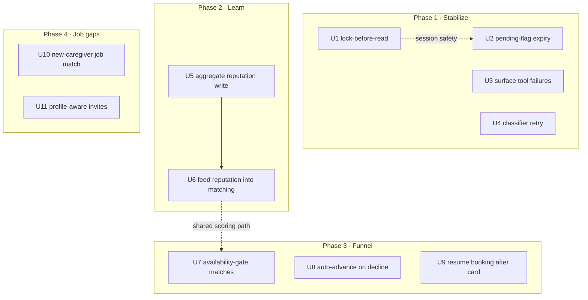
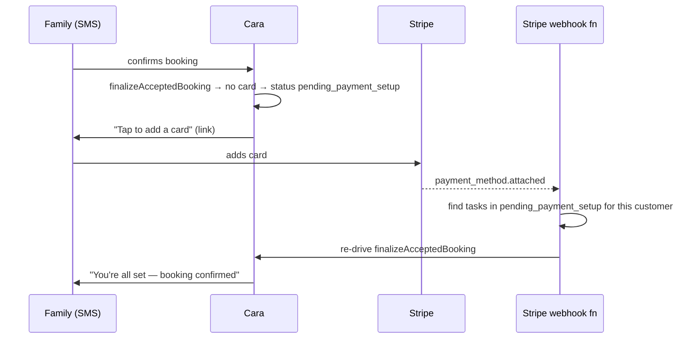

# feat: Cara reliability, learning, funnel & job-matching improvements

> **Target repo:** `cara-agent-native-horizon`. All paths below are repo-relative to it.
> Phased Deep plan. **Phase 1 is independently shippable and lands first.** Phases 2–4 follow in order; each phase is a coherent release.

---

## Summary

A four-phase hardening of Cara, the SMS care agent. **Phase 1 (Stabilize)** removes ways Cara can silently do the wrong thing under concurrent load or on tool failure. **Phase 2 (Learn)** turns hire/pass outcomes into per-caregiver reputation that improves matching for *new* families. **Phase 3 (Funnel)** stops wasted interviews and stalled bookings at the seams between steps. **Phase 4 (Job gaps)** makes a new caregiver hear about existing open jobs and makes the "want to apply?" invite respect profile fit, not just distance.

Each phase is releasable on its own. The phases are ordered by risk-reduction-per-effort: stabilize first (cheap, prevents money/trust loss), then the strategic learning loop, then funnel polish, then growth.

---

## Problem Frame

The deep audit found Cara's *capability breadth* is strong but three qualities are thin: she does not **fail safely** under concurrency or tool error, she does not **learn** from outcomes, and she **leaks** good matches at step boundaries. Two concrete job-flow gaps also block the caregiver-as-job-seeker experience. This plan addresses those, and only those — companion-mode, broad proactivity (medication reminders, post-visit follow-up), admin parity, and CRUD gaps are explicitly deferred.

This is not a rewrite. Every unit is a bounded change to existing files with existing patterns to follow.

---

## Scope Boundaries

### In scope
- **Phase 1:** inbound-lock ordering, per-pending-flag expiry, mutating-tool failure surfacing, intent-classifier retry.
- **Phase 2:** aggregate per-caregiver hire/pass reputation with recency decay, fed into matching.
- **Phase 3:** availability-gated match presentation, auto-advance on caregiver decline, interview time-conflict renegotiation, booking resume after card added, shift-offer expiry.
- **Phase 4:** new-caregiver→open-jobs matching trigger, profile-aware apply invites.

### Deferred to Follow-Up Work
- **Personality/fit learning** from interview feedback text (larger, depends on Phase 2 landing and on confirming matching internals).
- **Proactive behaviors:** post-visit family follow-up, medication-adherence reminders, dormant-pair re-engagement, caregiver no-show / reliability scoring, timezone-aware scheduled sends.
- **CRUD gaps:** `edit_reminder`, `edit_journal_entry`, `cancel_recurring_schedule`.
- **Caregiver memory files** (caregivers currently get Zep-only context).

### Out of scope (product decisions, route to `/ce-brainstorm`)
- **Companion mode for clients** — how warm/open-ended Cara should be is a product-identity decision, not a bug. Surface upstream, do not design here.
- **Admin parity tools** (approve caregiver, resolve disputes, bulk notify) — a separate initiative.

---

## Requirements Traceability

No formal `ce-brainstorm` requirements doc exists; the origin is the deep audit run this session. Findings map to units as:

| Audit finding | Phase / Units |
|---|---|
| Rapid replies race on session state; lock acquired after session read | P1 · U1 |
| Stale `pending*` flags collide on YES/NO; only some have expiry | P1 · U2 |
| Failed mutating tool can still report success | P1 · U3 |
| Intent classifier single-shot, no retry on timeout | P1 · U4 |
| A hired-40×-caregiver looks identical to an unvetted one to a new family | P2 · U5, U6 |
| Availability not checked before presenting top 3 | P3 · U7 |
| One caregiver's "no" stalls the search; time conflicts not renegotiated | P3 · U8 |
| Booking hangs after family adds a card; shift offer never times out | P3 · U9 |
| New caregivers hear nothing about existing open jobs | P4 · U10 |
| Apply-invite gated on distance only, not profile fit | P4 · U11 |

---

## Key Technical Decisions

**KTD-1 — Booking idempotency is already solved; do not re-add it.** `executeBookings` transactionally claims `awaiting_approval → processing` and no-ops on a concurrent second call ([bookingExecutor.ts:61-77](functions/src/agents/bookingExecutor.ts#L61-L77)), and `apply_to_job` has its own duplicate guard ([mcp/server.ts:3177](functions/src/mcp/server.ts#L3177)). The remaining concurrency gap is *session-flag* writes and lock ordering, not booking creation. Phase 1 targets the actual gap.

**KTD-2 — Reuse the existing inbound lock; fix its ordering, don't replace it.** `claimInboundProcessing` / `releaseInboundProcessing` already exist with a 90s self-healing TTL ([sessionState.ts:122-147](functions/src/utils/sessionState.ts#L122)). The bug is that the session snapshot is read before the lock is claimed. Fix is ordering, not new infrastructure.

**KTD-3 — Per-flag expiry over a global "one pending state" rewrite.** The pending-flag set is large ([sessionState.ts:3-90](functions/src/utils/sessionState.ts#L3)) and the YES/NO router already special-cases ordering. Adding a `*SetAt` stamp + expiry check per high-stakes confirmation flag (mirroring the existing `pendingTaskConfirm` pattern at [routeIntent.ts:611-621](functions/src/linq/routeIntent.ts#L611)) is lower-risk than re-architecting the state machine.

**KTD-4 — Reputation is verify-first.** Matching already feeds Claude a platform `getOutcomePatternSummary` ([matchingAgent.ts:191](functions/src/agents/matchingAgent.ts#L191)) and a per-client `boostForCaregiver` ([ai/feedback.ts:64](functions/src/ai/feedback.ts#L64)). Before adding per-caregiver aggregate stats, U5 confirms what those two already cover to avoid double-counting. Aggregate stats become a new signal, decayed by recency, written transactionally on each outcome.

**KTD-5 — Resume booking via Stripe webhook, not polling.** The card-added gap is closed by handling `payment_method.attached` (or the existing checkout-completion webhook) to re-drive `finalizeAcceptedBooking` for tasks in `pending_payment_setup` ([bookingExecutor.ts:399](functions/src/agents/bookingExecutor.ts#L399)), consistent with the repo's webhook-driven state advancement.

**KTD-6 — Profile-fit gate reuses the existing match score.** `notifyAreaCaregivers` already computes `computeSimpleMatchScore` for the push decision ([triggers/jobNotifications.ts:179](functions/src/triggers/jobNotifications.ts#L179)). U11 moves that computation above the SMS send and gates the invite on it — no new scoring code.

---

## High-Level Technical Design

### Phase & unit dependency graph

Phases are independently shippable. The only hard cross-phase coupling is U5→U6. U6 and U7 both touch the matching path, so sequencing U7 after U6 avoids two concurrent edits to the same scoring code (soft dependency, dotted).

### Booking-resume sequence (U9)

---

## Implementation Units

### U1. Acquire inbound lock before reading the session

**Goal:** Eliminate the read-modify-write race where two near-simultaneous inbound texts read the same session snapshot and write conflicting flags.
**Requirements:** Audit "rapid replies race on session state."
**Dependencies:** none.
**Files:**
- `functions/src/linq/webhooks.ts` (reorder: claim lock → read session → route → release in `finally`)
- `functions/src/utils/sessionState.ts` (no change expected; confirm helpers suffice)
- `functions/src/linq/__tests__/handleInbound.routing.test.ts` (extend)
- `functions/src/utils/__tests__/sessionState.test.ts` (add concurrency test)

**Approach:** Move the `agent_sessions` read to *after* `claimInboundProcessing` succeeds, and release in a `finally`. When the lock is not acquired (a live in-flight message holds it), drop/defer this duplicate per existing fail-open semantics. Do not change the 90s TTL. Per KTD-1, no booking-idempotency change is needed.
**Patterns to follow:** existing lock usage in `webhooks.ts`; the `finally`-release pattern already present.
**Test scenarios:**
- Happy path: single inbound claims lock, reads session, routes, releases. Lock doc deleted after.
- Concurrency: two inbounds for the same phone — second sees lock held and does not read/mutate session; first completes; no conflicting writes.
- Crash recovery: stale lock older than TTL is reclaimable (simulate `lockedAt` in the past).
- Fail-open: transaction error in `claimInboundProcessing` returns true and processing proceeds (no dropped message).
**Verification:** Concurrency test proves only one writer mutates session per phone at a time; existing routing tests still pass.

---

### U2. Add expiry to every high-stakes pending flag

**Goal:** Prevent a stale `pending*` confirmation (e.g., a 2-hour-old interview confirm) from intercepting a YES/NO meant for a fresh question.
**Requirements:** Audit "stale pending flags collide on YES/NO."
**Dependencies:** U1 (same file region; sequence after).
**Files:**
- `functions/src/linq/routeIntent.ts` (add `*SetAt` checks before acting on each pending confirm)
- writers that *set* the flags (e.g., `interviewAgent.ts`, cancel/recurring setters) to stamp `*SetAt`
- `functions/src/linq/__tests__/routeClient.test.ts` (extend)

**Approach:** For each high-stakes confirmation flag (`pendingInterviewConfirm`, `pendingCancelConfirm`, `awaitingRecurringConfirmation`), stamp a `*SetAt` ISO timestamp when set and check freshness before acting — clear-and-fall-through when stale. Mirror the existing `pendingTaskConfirm` / `pendingTaskConfirmSetAt` one-hour pattern at [routeIntent.ts:611-621](functions/src/linq/routeIntent.ts#L611). Choose a TTL per flag (interview/cancel: ~1h; recurring setup: ~1h). Do not attempt a global state-machine rewrite (KTD-3).
**Patterns to follow:** `pendingTaskConfirm` staleness check already in `routeIntent.ts`.
**Test scenarios:**
- Fresh flag: YES within TTL acts on the pending confirm as today.
- Stale flag: YES after TTL clears the flag and falls through to normal intent routing (does not fire the stale action).
- Collision: interview-confirm stale + recurring-confirm fresh → YES resolves the fresh one, not the stale interview.
- Each flag independently expires (table-driven test across the three flags).
**Verification:** Stale-flag tests show fall-through; no pending action fires past its TTL.

---

### U3. Surface mutating-tool failures to the user

**Goal:** Never let a failed `cancel_*` / booking / mutation be reported as success.
**Requirements:** Audit "failed mutating tool can still report success."
**Dependencies:** none.
**Files:**
- `functions/src/agents/qaAgent.ts` (tool-result construction around [:1482-1510](functions/src/agents/qaAgent.ts#L1482))
- `functions/src/agents/__tests__/qaAgent.test.ts` (extend)

**Approach:** Maintain a set of mutating tool names (cancel/book/charge/remove/update/apply/submit-class tools). When such a tool returns `_toolError`/`error`, push the tool_result with `is_error: true` and an explicit "this action did NOT go through — tell the user and offer to retry" instruction, and trigger recovery on the *first* mutating failure rather than waiting for a fully-errored iteration. Read-only tool failures keep current soft handling.
**Patterns to follow:** existing `toolErrorTrail` and recovery logic in `qaAgent.ts`.
**Test scenarios:**
- `cancel_appointment` returns `_toolError` → tool_result is `is_error: true`; model is instructed to report failure.
- Mixed turn: one mutating tool fails + one read succeeds → failure is still surfaced (not masked by the success).
- Read-only tool failure (`get_*`) → existing soft "I can't access that right now" path unchanged.
- First mutating failure triggers recovery without waiting for a second iteration.
**Verification:** Test asserts mutating failures produce `is_error` tool_results and a recovery signal; read-only behavior unchanged.

---

### U4. Retry the intent classifier on timeout

**Goal:** Reduce wrong routing when the classifier LLM call times out and silently degrades to `QUESTION`.
**Requirements:** Audit "intent classifier single-shot, no retry."
**Dependencies:** none.
**Files:**
- `functions/src/agents/intentClassifier.ts` (wrap the `quickComplete` call in one bounded retry)
- `functions/src/agents/__tests__/intentClassifier.test.ts` (extend)

**Approach:** On timeout/abort, retry once with a short backoff before falling back to the degraded `QUESTION`. Keep the existing 6s per-attempt timeout; cap total added latency. Preserve the `degraded` flag semantics so downstream still skips the quick-reply bypass when both attempts fail.
**Patterns to follow:** existing `classifyIntentDetailed` structure and `degraded` flag.
**Test scenarios:**
- First attempt times out, second succeeds → returns the real intent, `degraded: false`.
- Both attempts fail → returns `QUESTION`, `degraded: true` (unchanged contract).
- Successful first attempt → no retry (no added latency).
**Verification:** Retry test shows recovery on transient timeout; degraded contract preserved.

---

### U5. Write aggregate per-caregiver hire/pass reputation

**Goal:** Persist platform-level reputation per caregiver so a new family can benefit from prior outcomes.
**Requirements:** Audit "hired-40× caregiver looks unvetted to a new family."
**Dependencies:** none (but verify-first — see Approach).
**Files:**
- `functions/src/ai/feedback.ts` (add aggregate write alongside `writeFeedbackSignal`)
- `functions/src/agents/interviewAgent.ts` (call site already writes the per-client signal)
- `functions/src/ai/__tests__/feedback.test.ts` (extend)

**Approach:** **Verify first** (Open Question OQ-1): confirm what `getOutcomePatternSummary` ([matchingAgent.ts:191](functions/src/agents/matchingAgent.ts#L191)) already aggregates, to avoid double-counting. Then, on each hire/pass outcome, transactionally increment per-caregiver counters (`hireCount`, `passCount`, `lastOutcomeAt`) on the caregiver doc or a `caregivers/{id}/reputation` doc. Store enough to compute a recency-decayed hire rate at read time. No scoring change in this unit.
**Patterns to follow:** `writeFeedbackSignal` transaction shape in `ai/feedback.ts`.
**Test scenarios:**
- Hire outcome increments `hireCount` and stamps `lastOutcomeAt`.
- Pass outcome increments `passCount`.
- Concurrent outcomes for the same caregiver don't lose increments (transaction).
- Aggregate write does not disturb the existing per-client `match_history` write.
**Verification:** Outcome write produces correct aggregate counters; per-client signal unchanged.

---

### U6. Feed decayed reputation into matching

**Goal:** Use aggregate reputation as a ranking signal and as context for Claude scoring.
**Requirements:** Audit "reputation not used cross-family."
**Dependencies:** U5.
**Files:**
- `functions/src/agents/matchingAgent.ts` (include reputation in candidate signals / Claude context)
- `functions/src/ai/scoring.ts` (add a bounded, decayed reputation term)
- `functions/src/ai/__tests__/scoring.test.ts` (extend)

**Approach:** Compute a recency-decayed hire rate from U5 counters (e.g., weight halves at ~365 days) and feed it as (a) a bounded additive term in `computeRuleSignals`/`scoreCaregiver` and (b) a one-line fact in the Claude candidate summary ("hired N times, rarely passed"). Cap the influence so reputation tilts ties, not dominates skills/proximity. Keep cold-start neutral (no penalty for zero history).
**Patterns to follow:** existing bounded `boostForCaregiver` clamp in `ai/feedback.ts`; the candidate-signal assembly in `matchingAgent.ts`.
**Test scenarios:**
- Two otherwise-equal caregivers: higher recent hire rate ranks first.
- Old outcomes contribute less than recent ones (decay).
- Zero-history caregiver scores neutrally (no cold-start penalty).
- Reputation cannot override a large skills/proximity gap (cap test).
**Verification:** Ranking tests show reputation tilts ties without dominating; cold start neutral.

---

### U7. Gate match presentation on real availability

**Goal:** Stop presenting top caregivers who aren't actually free for the family's window.
**Requirements:** Audit "availability not checked before presenting top 3."
**Dependencies:** soft — sequence after U6 (shared matching path).
**Files:**
- `functions/src/agents/matchingAgent.ts` (filter/annotate candidates by availability before the final cut)
- availability helper (confirm existing `availabilityService` / `isAvailable`)
- `functions/src/agents/__tests__/matchingAgent.test.ts` (extend)

**Approach:** When the family's requested window is known from intake, check candidate availability before the top-N cut; drop or down-rank unavailable caregivers and refill from the next-best. When availability is unknown or all top candidates are tight, present anyway but say so honestly rather than implying open availability.
**Patterns to follow:** existing availability checks used in batch scoring elsewhere in the matching code.
**Test scenarios:**
- Candidate unavailable for the requested window is excluded; next-best fills the slot.
- Window unknown → no exclusion, presentation unchanged.
- All top candidates tight → family is told availability is limited (message assertion).
- Available candidate is retained and ranked normally.
**Verification:** Unavailable caregivers don't reach presentation when the window is known; honest messaging when availability is unknown/tight.

---

### U8. Auto-advance on caregiver decline; renegotiate time conflicts

**Goal:** A single caregiver's decline/PASS or a time conflict should not stall the family.
**Requirements:** Audit "one caregiver's no stalls the search; time conflicts not renegotiated."
**Dependencies:** none.
**Files:**
- `functions/src/agents/interviewAgent.ts` (decline path ~[:208](functions/src/agents/interviewAgent.ts#L208); time-selection ~[:56](functions/src/agents/interviewAgent.ts#L56))
- `functions/src/agents/__tests__/interviewAgent.test.ts` (extend)

**Approach:** On caregiver decline/PASS, automatically reach out to the next-best match and tell the family ("Maria isn't available — I'm checking James now"), instead of waiting for a YES. Stop auto-advancing only when the candidate pool is exhausted or the family says stop. When *all* proposed interview times conflict with the family's calendar, ask the caregiver for new times (retry up to twice) rather than booking the first conflicting slot.
**Patterns to follow:** existing rematch trigger (`checkAndTriggerRematching`) and the time-selection logic in `interviewAgent.ts`.
**Test scenarios:**
- Caregiver declines → next-best is contacted automatically; family notified; no YES required.
- Pool exhausted → family told, escalation/aliasing per existing cold-start path.
- All proposed times conflict → caregiver asked for new times (not booked into a conflict).
- Renegotiation retries cap at 2, then graceful fallback.
- Family "stop looking" halts auto-advance.
**Verification:** Decline auto-advances; conflicting-times path renegotiates instead of double-booking the calendar.

---

### U9. Resume booking after card added; expire stale shift offers

**Goal:** Close the limbo where a booking sits in `pending_payment_setup` after the family adds a card, and where a shift offer never times out.
**Requirements:** Audit "booking hangs after card added; shift offer never times out."
**Dependencies:** none.
**Files:**
- `functions/src/` Stripe webhook handler (add `payment_method.attached` / reuse checkout-completion handling)
- `functions/src/agents/bookingExecutor.ts` (`finalizeAcceptedBooking` re-drive; status `pending_payment_setup` at [:399](functions/src/agents/bookingExecutor.ts#L399))
- `functions/src/scheduled/` (shift-offer expiry sweep, if not already present)
- `functions/src/agents/__tests__/bookingExecutor.test.ts` (extend); webhook test

**Approach:** On the card-added webhook, find this customer's tasks in `pending_payment_setup` and re-drive `finalizeAcceptedBooking`, then confirm to the family. Make the re-drive idempotent (reuse the KTD-1 task-claim pattern so a webhook retry can't double-finalize). Add/confirm a shift-offer expiry so an unanswered offer doesn't sit `pending_caregiver_confirmation` forever — on expiry, notify and re-offer to the next caregiver.
**Patterns to follow:** existing Stripe webhook idempotency tests (`webhookIdempotency.test.ts`); `executeBookings` task-claim transaction.
**Test scenarios:**
- `payment_method.attached` for a customer with a `pending_payment_setup` task → booking finalized, family confirmed.
- Webhook redelivery → no double-finalize (idempotent).
- No matching pending task → webhook is a no-op.
- Shift offer past its deadline → expired, next caregiver offered (or family notified).
**Verification:** Card-added confirms the booking exactly once; stale offers expire instead of hanging.

---

### U10. Match new caregivers to existing open jobs

**Goal:** A caregiver who finishes onboarding should immediately hear about open jobs that fit, not just future ones.
**Requirements:** Audit "new caregivers hear nothing about existing open jobs."
**Dependencies:** soft — reuses U11's profile-fit gating helper; sequence U11 first or share the helper.
**Files:**
- `functions/src/triggers/` new Firestore trigger on `caregivers` when `onboardingStatus` becomes `profile_complete` / `status` becomes `active`
- `functions/src/triggers/jobNotifications.ts` (reuse `computeSimpleMatchScore`, distance, idempotency-via-`job_notifications`)
- `functions/src/triggers/__tests__/` new test

**Approach:** On caregiver activation, query open `job_posts` within radius, score by profile fit, and send the same "interested? reply YES/NO" invite for the top matches — reusing the dedupe (`job_notifications`) and session-state (`awaitingJobResponse`) machinery already in `jobNotifications.ts`. Cap the number of invites so a new caregiver isn't spammed. Respect opt-out / paused.
**Patterns to follow:** `notifyAreaCaregivers` structure and idempotency guard in `jobNotifications.ts`.
**Test scenarios:**
- Caregiver activates with open jobs in radius → top-fit jobs trigger invites; recorded in `job_notifications`.
- Re-running the trigger (or duplicate write) does not double-invite (idempotency).
- Out-of-radius / poor-fit jobs are not sent.
- Opted-out or paused caregiver gets nothing.
- Invite count is capped.
**Verification:** A freshly activated caregiver receives capped, in-radius, profile-fit invites exactly once.

---

### U11. Make apply-invites profile-aware

**Goal:** Gate the "a job opened near you — interested?" SMS on profile fit, not distance alone.
**Requirements:** Audit "apply-invite gated on distance only."
**Dependencies:** none (U10 reuses this).
**Files:**
- `functions/src/triggers/jobNotifications.ts` (move `computeSimpleMatchScore` above the SMS send; gate on score)
- `functions/src/triggers/__tests__/jobNotifications.test.ts` (extend)

**Approach:** Compute the match score before deciding whether to send the SMS invite (today it only gates the push, at [jobNotifications.ts:179-184](functions/src/triggers/jobNotifications.ts#L179)). Send the invite only when both within radius and score ≥ threshold; keep a configurable threshold. Preserve existing dedupe and `awaitingJobResponse` state writes. Decide handling of coordinate-less jobs consistently with `browse_job_board` (Open Question OQ-2).
**Patterns to follow:** existing score computation and push gate in `jobNotifications.ts`.
**Test scenarios:**
- In-radius, high-fit caregiver → SMS invite sent.
- In-radius, low-fit caregiver → no invite (previously would have been spammed).
- Threshold boundary value behaves per spec.
- Dedupe and `awaitingJobResponse` writes unchanged for sent invites.
- Coordinate-less job handled per the OQ-2 decision (documented behavior asserted).
**Verification:** Only profile-fit, in-radius caregivers receive the apply invite; no regression in the YES/NO response flow.

---

## Risks & Dependencies

- **R1 — Matching-internals assumption (Phase 2/3).** U5/U6/U7 assume specific behavior of `getOutcomePatternSummary`, `scoreCaregiver`, and the availability service. OQ-1 must be resolved before U5/U6 land to avoid double-counting reputation. *Mitigation:* verify-first gate; these units do not ship until confirmed.
- **R2 — Stripe webhook coverage (U9).** Requires the `payment_method.attached` (or equivalent) event to be configured and delivered. *Mitigation:* confirm the event is enabled; reuse existing webhook idempotency harness.
- **R3 — Notification volume (U10).** Activating the back-matching trigger could fan out many invites in dense markets. *Mitigation:* per-caregiver invite cap + reuse `job_notifications` dedupe; log dropped/over-cap sends.
- **R4 — Shared matching-path edits (U6, U7).** Two units touch the scoring path. *Mitigation:* sequence U7 after U6; land each behind its own tests.
- **Dependency:** U6 depends on U5; U10 reuses U11's fit gate. No external dependency blocks Phase 1.

---

## Open Questions

- **OQ-1 (resolve before U5/U6):** What does `getOutcomePatternSummary` already aggregate, and does `boostForCaregiver` already decay? Determines whether aggregate reputation is additive or replaces an existing signal. *Resolvable by reading the matching code at execution time.*
- **OQ-2 (resolve before U11):** Coordinate-less jobs are currently *kept* by `browse_job_board` but *skipped* by `notifyAreaCaregivers`. Pick one behavior and apply it in both. *Product/consistency call.*
- **OQ-3 (U9):** Is there already a shift-offer expiry sweep, or does one need adding? *Resolvable by scanning `functions/src/scheduled/` at execution time.*

---

## Sources & Research

- Deep audit run this session across reliability, agent-native parity, matching/funnel, and memory/learning — file:line evidence cited inline above.
- Verified internals this session: `bookingExecutor.executeBookings` idempotency ([:61](functions/src/agents/bookingExecutor.ts#L61)); inbound lock helpers ([sessionState.ts:122](functions/src/utils/sessionState.ts#L122)); `ai/feedback.ts` write/read/boost surface; `matchingAgent` city/zip pre-filter + Claude scoring ([:150-218](functions/src/agents/matchingAgent.ts#L150)); `jobNotifications.notifyAreaCaregivers` ([:91-198](functions/src/triggers/jobNotifications.ts#L91)).
- No external research required: every unit follows an existing in-repo pattern.
