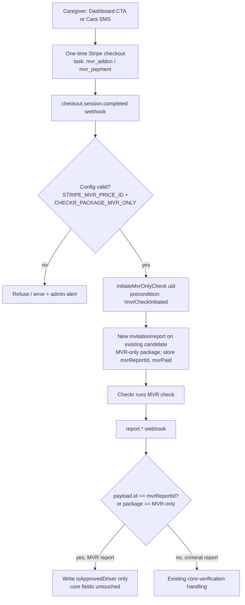

# feat: Caregiver MVR Opt-In & Add-Later (Approved Driver Upgrade)

## Summary

Turn MVR (Motor Vehicle Report / driver background check) into a genuine optional **Approved Driver** upgrade. Caregivers can opt in at signup — primarily through **Cara's SMS onboarding flow, which is the sole caregiver signup path** (CLAUDE.md), offered to everyone — or add it later, self-serve from the dashboard or via Cara over SMS. Each add-later purchase is a one-time Stripe charge that triggers a **standalone MVR-only** Checkr check. The MVR result governs **only** the Approved Driver badge and can never alter a caregiver's core approval. Configuration is documented and validated so MVR can never be charged-without-delivered or shown-without-charged.

This is **Standard** depth but touches two high-risk domains (payments, background checks). It reuses the existing webhook-ledger idempotency and Stripe-idempotency-key patterns rather than introducing new infrastructure.

---

## Problem Frame

Today MVR is auto-bundled with the "Transportation" service and the checkbox in `components/caregiver/CaregiverMembership.tsx` is display-only (`includeMVR = hasTransportation`, no toggle). There is no way to add MVR after signup, and `isApprovedDriver` is written by the backend but never displayed in any UI.

The load-bearing constraint: the Checkr webhook (`functions/src/checkr.ts`) resolves a caregiver by their single Checkr candidate id (`findCaregiverUidByCandidateId`) and, on `report.completed` with a `clear`/adverse result, writes the **shared** `verified` / `verificationStatus` / `status` fields. A second (MVR) report flowing through this same path would let a driving result clobber a caregiver's core approval. The feature must route MVR results separately so they only touch `isApprovedDriver`. (see origin: docs/brainstorms/2026-06-22-caregiver-mvr-opt-in-requirements.md)

---

## Requirements Traceability

- **R1** — MVR opt-in offered to **all** caregivers at signup as a real choice (default off), in Cara's SMS flow (primary signup path) and the web membership surface (secondary).
- **R2** — Existing caregiver can add MVR later, **anytime after signup**, from the dashboard (self-serve) and via Cara (SMS).
- **R3** — Each add-later purchase is a **one-time** Stripe charge that, on payment success, initiates a **standalone MVR-only** Checkr check.
- **R4** — An MVR result sets/withholds **only** `isApprovedDriver`; it never modifies `verified`, `verificationStatus`, `status`, `approvedAt`, `backgroundCheckStatus`, or `backgroundCheckComplete`.
- **R5** — MVR cannot be charged without a check running, nor a check run without a charge; misconfiguration fails loudly, not silently.
- **R6** — MVR/driver fields (`isApprovedDriver`, `mvrPaid`, `mvrIncluded`) are backend-writable only.
- **R7** — Caregivers see their own Approved Driver status in the UI.

---

## Key Technical Decisions

**KTD-1 — Distinguish the MVR report by report id on the shared candidate.** Keep the existing one-candidate-per-caregiver model. The standalone MVR check runs as a **new invitation/report against the caregiver's existing Checkr candidate** using an MVR-only package; persist the new report id as `backgroundCheckData.mvrReportId`. In the webhook, branch `report.*` handling on whether `payload.id === mvrReportId` (primary signal) — with the report's `package` name as a fallback signal — to route to badge-only vs. core handling. This avoids a second-candidate model that would break `findCaregiverUidByCandidateId` (which routes solely by candidate id). Exact Checkr endpoint (new invitation vs. reports API) is deferred to implementation. *Directional, not specification.*

**KTD-2 — Three distinct Checkr packages via env.** `CHECKR_PACKAGE` = criminal only (base); `CHECKR_PACKAGE_MVR` = bundled criminal+MVR (signup-with-MVR, existing); **new** `CHECKR_PACKAGE_MVR_ONLY` = MVR only (standalone later add). The default-to-base fallback that today makes `CHECKR_PACKAGE_MVR` silently equal the base package must be replaced with explicit validation (KTD-4).

**KTD-3 — Initiate the MVR check from the payment webhook, not inline/client-side.** Per the team's established Stripe pattern (`docs/plans/2026-06-16-001-fix-strict-migration-review-remediation-plan.md`, KTD-2/R14): the only authoritative settlement signal is the webhook. A new `checkout.session.completed` branch keyed on MVR task metadata calls a shared `initiateMvrOnlyCheck(caregiverUid)` helper. Guard it with an `mvrCheckInitiated` status precondition + Stripe/Checkr idempotency keys (own namespace, e.g. `${uid}-mvr-*`) so redelivery never double-charges or double-initiates. Reuse `claimWebhookEvent`/`settleWebhookEvent` — do not add new dedupe infrastructure.

**KTD-4 — Validate config at the charge/check boundary.** Before creating an MVR line item / one-time charge and before initiating an MVR check, assert `STRIPE_MVR_PRICE_ID` is set (not a `FILL_IN…` placeholder) and the relevant MVR package env is set and distinct from the base package. On failure, refuse the charge and surface an error rather than silently delivering the wrong thing (R5).

**KTD-5 — Signup MVR stays inside the membership checkout, billed once.** Rather than re-architecting signup into two payments, keep MVR as a line item in the existing subscription-mode checkout but ensure it is billed as a one-time amount, and reconcile the "$9.50 one-time" UI copy with actual behavior. The standalone later purchase is its own one-time-mode checkout (KTD-3).

---

## High-Level Technical Design

The add-MVR-later flow and the webhook routing wall:

The decision diamond at **J** is the load-bearing "wall" (R4). Everything left of it is plumbing reused from existing Stripe/Checkr patterns.

---

## Implementation Units

### U1. MVR configuration: env vars + boundary validation

**Goal:** Document the MVR-related env vars and add a single validation helper used at every MVR charge/check boundary so misconfiguration fails loudly.
**Requirements:** R5; supports KTD-2, KTD-4.
**Dependencies:** none.
**Files:**
- `CareConnecxx-main/.env.example` (document `STRIPE_MVR_PRICE_ID`, `CHECKR_PACKAGE`, `CHECKR_PACKAGE_MVR`, `CHECKR_PACKAGE_MVR_ONLY`)
- `CareConnecxx-main/functions/src/checkr.ts` (replace the `CHECKR_PACKAGE_MVR` default-to-base fallback; add `CHECKR_PACKAGE_MVR_ONLY`)
- `CareConnecxx-main/functions/src/mvrConfig.ts` (new — small helper: `assertMvrPaymentConfig()`, `assertMvrCheckConfig()`, returns resolved package/price or throws)
- `CareConnecxx-main/functions/src/__tests__/mvrConfig.test.ts` (new)

**Approach:** Centralize resolution of the MVR price id and the three Checkr packages. `assertMvrPaymentConfig` validates `STRIPE_MVR_PRICE_ID` is present and not a placeholder. `assertMvrCheckConfig` validates the relevant MVR package env is set and **distinct from `CHECKR_PACKAGE`** (so a forgotten env can't run a non-MVR check while charging for MVR). Callers (U3, U4, U5, U7) use this instead of reading `process.env` directly.
**Patterns to follow:** existing env handling in `functions/src/checkr.ts` (lines 12-13) and `functions/src/stripe.ts` (lines 49-50, 351-352).
**Test scenarios:**
- Happy path: all vars set and distinct → returns resolved values.
- Edge: `STRIPE_MVR_PRICE_ID` unset or starts with `FILL_IN` → `assertMvrPaymentConfig` throws.
- Error path: `CHECKR_PACKAGE_MVR_ONLY` unset → `assertMvrCheckConfig` throws.
- Error path: MVR-only package equals base `CHECKR_PACKAGE` → throws (the silent charged-but-no-MVR mode).

### U2. Lock MVR/driver fields to backend-only writes

**Goal:** Prevent caregivers from self-writing `isApprovedDriver`, `mvrPaid`, `mvrIncluded` from the client.
**Requirements:** R6.
**Dependencies:** none.
**Files:**
- `CareConnecxx-main/firestore.rules` (add the three fields to the caregiver-doc blocked `hasAny([...])` set, lines ~140-149)
- `CareConnecxx-main/tests/` (rules test if a Firestore-rules test harness exists; otherwise verify via emulator — see Verification)

**Approach:** Extend the existing admin-only field guard in the caregiver update rule (the same block that already protects `verified`, `backgroundCheckStatus`, Stripe Connect fields). Admin SDK (Cloud Functions) bypasses rules, so all backend writes are unaffected.
**Patterns to follow:** the existing blocked-field list in `firestore.rules` (caregiver block, lines 132-155).
**Test scenarios:**
- A client-side caregiver write that includes `isApprovedDriver: true` is **denied**.
- A client-side caregiver write that includes `mvrPaid: true` is **denied**.
- An allowed self-write (e.g. `verificationStatus: 'submitted'` exact-set, profile fields) still **succeeds**.
- A backend (Admin SDK) write to `isApprovedDriver` still succeeds (unaffected by rules).

### U3. The webhook wall + standalone MVR check initiation

**Goal:** Route MVR reports to badge-only handling, and add the shared helper that initiates an MVR-only Checkr check on the caregiver's existing candidate.
**Requirements:** R3, R4; implements KTD-1, KTD-3.
**Dependencies:** U1.
**Files:**
- `CareConnecxx-main/functions/src/checkr.ts` (branch `report.*` handling on MVR report id; add `initiateMvrOnlyCheck(caregiverUid)`)
- `CareConnecxx-main/functions/src/__tests__/mvrRouting.test.ts` (new)

**Approach:** Add `initiateMvrOnlyCheck(uid)`: reuse the existing `checkrCandidateId`, create a new invitation/report with `CHECKR_PACKAGE_MVR_ONLY` (validated via U1), persist `backgroundCheckData.mvrReportId`, `mvrPaid: true`, `mvrIncluded: true`, and an `mvrCheckInitiated` precondition flag (idempotency-key namespace `${uid}-mvr-*`). In `checkrWebhook`, before the shared-field writes, compute `isMvrReport = payload.id === bgData.mvrReportId || payload.package === <mvr-only package>`. When true: write **only** `isApprovedDriver` (true on clear; ensure false/withheld on adverse) and an MVR-specific status field (e.g. `mvrStatus`), and skip every core-field write and the core notifications/onboarding-advance side effects. When false: existing behavior unchanged.
**Execution note:** Add a characterization test for the **current** core `report.completed` behavior before branching, then add MVR-routing tests — this is the highest-risk edit in the change.
**Patterns to follow:** `initiateCheckrCandidate` candidate-reuse + date-scoped idempotency key (`functions/src/checkr.ts` lines 103-148); `claimWebhookEvent`/`settleWebhookEvent` already in `checkrWebhook`.
**Test scenarios:**
- Covers AE/R4. MVR report completes `clear` → `isApprovedDriver = true`; `verified`/`verificationStatus`/`status`/`approvedAt` **unchanged** from their prior values.
- Covers R4. MVR report completes `consider`/adverse → `isApprovedDriver` not set (or cleared); core verification fields **unchanged**; no `verificationStatus: 'rejected'` write.
- Criminal (non-MVR) report still flips core fields exactly as today (characterization — no regression).
- MVR report for an already-approved caregiver does not re-fire core "approved" family notifications or `advanceOnboardingStep('background_check')`.
- `initiateMvrOnlyCheck` is idempotent: a duplicate call (precondition `mvrCheckInitiated` set) does not create a second invitation.
- Integration: `initiateMvrOnlyCheck` reuses the existing candidate id (no new candidate created).

### U4. One-time MVR checkout (web) + payment webhook branch

**Goal:** A server callable that creates a one-time-mode Stripe checkout for MVR, and a webhook branch that initiates the MVR check on payment success.
**Requirements:** R2, R3, R5; implements KTD-3, KTD-4.
**Dependencies:** U1, U3.
**Files:**
- `CareConnecxx-main/functions/src/stripe.ts` (new callable `createMvrAddonCheckoutSession`; new `checkout.session.completed` branch for `task: 'mvr_addon'`)
- `CareConnecxx-main/services/stripeService.ts` (client wrapper `createMvrAddonCheckout`)
- `CareConnecxx-main/functions/src/__tests__/webhookIdempotency.test.ts` (extend)

**Approach:** New callable creates a `mode: 'payment'` (one-time) Checkout session for `STRIPE_MVR_PRICE_ID` (validated via U1), with `metadata: { firebaseUID, task: 'mvr_addon' }`. New webhook branch: on `task === 'mvr_addon'`, resolve the caregiver and call `initiateMvrOnlyCheck(uid)` (U3). Eligibility: allowed anytime after signup (no base-check-cleared gate). Reuse the existing claim/settle ledger already wrapping `stripeWebhook`.
**Patterns to follow:** `createCheckoutSession` / `createCaregiverCheckoutSession` (callable shape); `handleCheckoutSessionCompleted` task-branch pattern (`functions/src/stripe.ts` lines 234-280); `createCaregiverCheckoutSession` client wrapper (`services/stripeService.ts` lines 60-78).
**Test scenarios:**
- Happy path: completed `mvr_addon` session → `initiateMvrOnlyCheck` called once for the right caregiver.
- Edge: caregiver with a still-pending base check can purchase (no gate) → check initiates.
- Error path: `STRIPE_MVR_PRICE_ID` invalid → callable throws before creating a session (no charge).
- Idempotency: redelivered `checkout.session.completed` for the same session → exactly one MVR check initiated (ledger + precondition).
- Integration: callable returns a `mode: 'payment'` session url, not a subscription.

### U5. Signup MVR on the web membership surface (secondary)

**Goal:** Replace the auto-bundled, display-only MVR with a real toggle offered to all caregivers, billed once, with correct copy. This is the **secondary** signup surface — `CaregiverMembership.tsx` is still reachable for membership activation (e.g. via the dashboard `MembershipCard` → `/caregiver/membership`), but Cara's SMS flow (U8) is the primary signup path.
**Requirements:** R1; implements KTD-5.
**Dependencies:** U1.
**Files:**
- `CareConnecxx-main/components/caregiver/CaregiverMembership.tsx` (state-backed toggle; remove `includeMVR = hasTransportation` gating; reconcile copy)
- `CareConnecxx-main/components/caregiver/CaregiverMembership.test.tsx` (new or extend)

**Approach:** Introduce `const [includeMVR, setIncludeMVR] = useState(false)`; render the MVR add-on card for all caregivers with a working click handler; pass `includeMVR` into `createCaregiverCheckoutSession`. Ensure the MVR line item bills once (verify the `STRIPE_MVR_PRICE_ID` price is one-time and accepted in the subscription-mode checkout, or add it as a one-time invoice item). Reconcile the "one-time charge" copy with actual behavior.
**Patterns to follow:** existing checkout invocation at `CaregiverMembership.tsx` line 81; pricing/total display block (lines 216-234).
**Test scenarios:**
- A caregiver **without** Transportation sees the MVR option and can toggle it on.
- Toggling on/off updates the displayed total (`+$9.50`).
- Checkout is called with `includeMVR: true` only when toggled on; `false`/omitted otherwise.
- Default state is off.

### U6. Dashboard self-serve CTA + caregiver-facing Approved Driver badge

**Goal:** A "Become an Approved Driver" card on the caregiver payments page, and a visible Approved Driver badge reflecting `isApprovedDriver`.
**Requirements:** R2, R7.
**Dependencies:** U4.
**Files:**
- `CareConnecxx-main/components/caregiver/CaregiverPaymentsPage.tsx` (new card in the Membership tab + `handleBecomeApprovedDriver`; badge display from `profile.isApprovedDriver`)
- `CareConnecxx-main/components/caregiver/CaregiverPaymentsPage.test.tsx` (new or extend)

**Approach:** Add a card in the `{tab === 'membership'}` block mirroring `MembershipCard`. The CTA calls `createMvrAddonCheckout` (U4) then redirects/opens the Stripe url, like `handleManageMembership`. Gate the card's state on the live-subscribed `profile`: show "Become an Approved Driver" when `!isApprovedDriver && !mvrPaid`, "Pending" when `mvrPaid && !isApprovedDriver`, and the Approved Driver badge when `isApprovedDriver`.
**Patterns to follow:** `MembershipCard` (lines 2205-2317), `handleManageMembership` (lines 1678-1699), `subscribeCaregiverProfile` live profile (lines 1497-1499).
**Test scenarios:**
- Caregiver without MVR sees the "Become an Approved Driver" CTA.
- Clicking the CTA calls the MVR checkout service and redirects to the returned url.
- `mvrPaid && !isApprovedDriver` renders a pending state, not the CTA.
- `isApprovedDriver: true` renders the Approved Driver badge and hides the CTA.

### U7. Cara SMS add-MVR path

**Goal:** Let a caregiver add MVR conversationally via Cara — send a one-time payment link and initiate the MVR check on payment.
**Requirements:** R2, R3; implements KTD-3.
**Dependencies:** U3, U4.
**Files:**
- `CareConnecxx-main/functions/src/agents/onboardingConversation.ts` (bespoke handler e.g. `handleCaregiverSendMvr`; new `task: 'mvr_payment'` case in `advanceOnboardingStep`; step dispatch cases in `handleOnboardingStep`)
- `CareConnecxx-main/functions/src/stripe.ts` (handle `task === 'mvr_payment'` with `phone` in `checkout.session.completed`, calling `initiateMvrOnlyCheck`)
- `CareConnecxx-main/functions/src/agents/__tests__/` (handler test, mirroring existing onboarding handler tests)

**Approach:** Bespoke handler mirroring `handleCaregiverSendMembership`: `generateToken({ phone, task: 'mvr_payment' })`, create a one-time (`mode: 'payment'`) Stripe session with `metadata: { phone, task: 'mvr_payment' }`, store the url on the session, send it via `sendMessage` as a link part. On payment, the `stripe.ts` `mvr_payment` branch resolves the caregiver from `phone`/session and calls `initiateMvrOnlyCheck`. Add an `advanceOnboardingStep` `mvr_payment` case for any Cara acknowledgment. Per Cara rules in CLAUDE.md, any free-text intent ("can I add driving?") routes through `parseWithClaude`, not keyword matching.
**Patterns to follow:** `handleCaregiverSendMembership` (lines 1456-1518), `handleCaregiverAskMvr` (lines 1432-1454), `advanceOnboardingStep` membership case (lines 2221-2232), the `caregiver_membership` Stripe branch (`stripe.ts` lines 261-280).
**Test scenarios:**
- Caregiver asks Cara to add driver status → Cara sends a one-time payment link (link part present).
- On `mvr_payment` checkout completion → `initiateMvrOnlyCheck` called once for the right caregiver.
- Redelivered payment webhook → exactly one MVR check (ledger + `processedWebhookTasks` arrayUnion).
- Intent parsing uses `parseWithClaude` (no regex/keyword intent matching) per Cara rules.

### U8. Cara signup-flow MVR opt-in (primary signup path)

**Goal:** Align Cara's existing signup MVR opt-in with the new config validation and close the live "MVR-check-without-charge" bug, so the sole caregiver signup path honors R1 and R5.
**Requirements:** R1, R5; implements KTD-4, KTD-5.
**Dependencies:** U1.
**Files:**
- `CareConnecxx-main/functions/src/agents/onboardingConversation.ts` (`handleCaregiverSendMembership`, lines 1456-1518; `handleCaregiverAskMvr`, lines 1432-1454)
- `CareConnecxx-main/functions/src/stripe.ts` (`caregiver_membership` branch of `handleCheckoutSessionCompleted`, lines 261-280)
- `CareConnecxx-main/functions/src/agents/__tests__/` (handler test for the ask/send-membership MVR path)

**Approach:** Cara already asks every caregiver the MVR question (`handleCaregiverAskMvr`) and intends to bill MVR once — keep that behavior. The fixes:
1. **Bind `metadata.includeMVR` to the actual charge.** Today `handleCaregiverSendMembership` sets `metadata.includeMVR` from `wantsMvr` alone (line 1486) while the MVR line item is only conditionally added (line 1471). Compute a single `mvrCharged` boolean (line item actually appended, using U1's validated config) and derive `metadata.includeMVR` from `mvrCharged`, not from `wantsMvr`. This makes the downstream `mvrPaid`/`mvrIncluded` writes (stripe.ts line 269) impossible without a real charge.
2. **Loud config handling.** If the caregiver answered YES but MVR config is invalid (U1 assertion fails), do not silently drop to a no-MVR membership that still claims MVR — surface the misconfig (log + admin alert) and proceed with membership-only, with `includeMVR: "false"`. The caregiver is never charged for or told they have MVR they didn't get.

**Note on the wall (R4):** at signup the bundled criminal+MVR runs as a **single** Checkr report, which legitimately sets both core approval and (via the existing `mvrIncluded` gate at `checkr.ts` lines 373-375) the Approved Driver badge. The U3 wall keys off `mvrReportId` set only by `initiateMvrOnlyCheck`, so the signup bundled report correctly flows through core handling — do **not** wall off the signup report.
**Patterns to follow:** existing `handleCaregiverSendMembership` line-item assembly (lines 1467-1490); the `caregiver_membership` webhook branch (`stripe.ts` lines 261-280); U1 config helper.
**Test scenarios:**
- Caregiver replies YES with valid MVR config → MVR line item added AND `metadata.includeMVR === "true"`.
- Caregiver replies NO → no MVR line item, `metadata.includeMVR === "false"`, membership-only.
- Caregiver replies YES but `STRIPE_MVR_PRICE_ID` unset → **no** MVR line item AND `metadata.includeMVR === "false"` (bug fixed: no `mvrPaid` without charge); misconfig surfaced.
- Integration: a YES-with-valid-config checkout completing sets `mvrPaid`/`mvrIncluded` and the bundled check uses the MVR package; on clear, `isApprovedDriver` is set.
- Cara still bills MVR once (one-time line item on first invoice), membership recurs annually.

---

## Scope Boundaries

**In scope:** signup MVR opt-in for all caregivers via Cara's SMS flow (primary) and the web membership surface (secondary), including fixing the live MVR-check-without-charge bug; add-later via dashboard and Cara; one-time MVR charge; standalone MVR-only Checkr check; webhook wall (badge-only routing); backend-only MVR/driver fields; MVR config documentation + validation; caregiver-facing Approved Driver badge.

### Deferred to Follow-Up Work
- **Family-facing Approved Driver surface** — filtering/searching caregivers by Approved Driver status, and showing the badge to families. Separate surface not detailed in the brainstorm.
- **Refunds / payment reversal** when an MVR check fails after payment.
- **Admin manual driver-badge override UI.**

### Out of Scope (origin non-goals)
- Any change to the core criminal background-check flow itself.

---

## Risks & Dependencies

- **Highest-risk edit: `functions/src/checkr.ts` report routing (U3).** A routing bug could either let an MVR result clobber core approval (violates R4) or let a criminal-clear path be mis-skipped. Mitigation: characterization test of current behavior first; explicit MVR-vs-criminal branch tests; validate in Checkr/Stripe **test mode** before merge.
- **Stripe one-time vs subscription mode (U5).** Mixing a one-time MVR price into subscription-mode signup checkout needs verification; if Stripe rejects it, fall back to a one-time invoice item or reconcile copy to recurring. The standalone path (U4) is unambiguous one-time.
- **Checkr second-report-on-same-candidate (KTD-1).** Confirm at implementation that Checkr supports a new invitation/report with a different package on an existing candidate and that the report payload exposes a `package`/id usable for routing. If not, fall back to a dedicated MVR candidate plus a lookup extension.
- **Idempotency:** reuse `claimWebhookEvent`/`settleWebhookEvent` and Stripe/Checkr idempotency keys (own `*-mvr-*` namespace). Do not add parallel dedupe.
- **Pre-existing bug in Cara signup (U8):** `metadata.includeMVR` is set from `wantsMvr` rather than the actual charge, so a missing `STRIPE_MVR_PRICE_ID` causes an MVR check to run with no charge. This ships today; U8 fixes it. Verify the fix in Stripe test mode with the env var both set and unset.

---

## Verification

- Functions unit tests pass: `npm --prefix functions run build` then the functions test suite, including new `mvrConfig.test.ts`, `mvrRouting.test.ts`, and extended `webhookIdempotency.test.ts`.
- Frontend tests pass: `npm test -- --run` for `CaregiverMembership` and `CaregiverPaymentsPage`.
- Firestore rules: a client write touching `isApprovedDriver`/`mvrPaid` is denied (emulator or rules test).
- Manual test-mode pass: one-time MVR purchase (dashboard + Cara) initiates exactly one MVR-only check; an adverse MVR result leaves an approved caregiver bookable; a misconfigured `STRIPE_MVR_PRICE_ID`/MVR package errors instead of silently mis-delivering.

---

## Sources & Research

- Origin requirements: `docs/brainstorms/2026-06-22-caregiver-mvr-opt-in-requirements.md`
- Stripe webhook side-effect & idempotency precedent: `docs/plans/2026-06-16-001-fix-strict-migration-review-remediation-plan.md` (KTD-2, R14, U11/U12)
- Caregiver-verification guarded-contract invariant: `docs/reports/2026-06-20-cara-agent-native-launch-completion-report.md`
- Webhook idempotency primitive: `functions/src/utils/webhookLedger.ts`; tests in `functions/src/__tests__/webhookIdempotency.test.ts`
- Current MVR/Checkr/Stripe code: `functions/src/checkr.ts`, `functions/src/stripe.ts`, `components/caregiver/CaregiverMembership.tsx`, `components/caregiver/CaregiverPaymentsPage.tsx`, `functions/src/agents/onboardingConversation.ts`, `services/stripeService.ts`, `firestore.rules`
