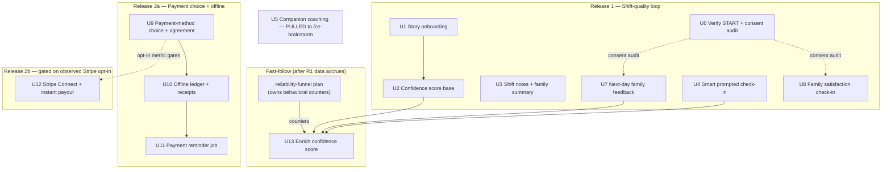
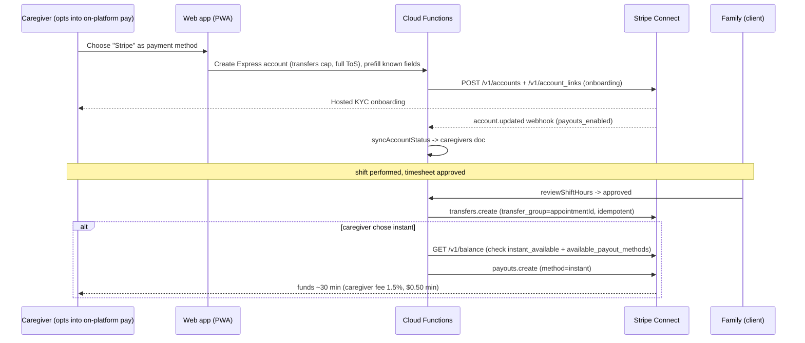

# feat: Shift-Quality Loop and Payment Flexibility

**Target repo:** cara-agent-native-horizon

## Summary

This plan completes the partially-built features and adds the missing ones from the 22-point agent-native vision. Per doc-review decisions it ships as **two sequenced releases**, not one bundle, because the shift-quality loop and payments are near-independent subgraphs and payments is the heaviest, highest-liability track:

**Release 1 — Shift-quality loop:** story-based caregiver onboarding (U1), a recomposed confidence score (U2), reconciled shift-notes with guaranteed family summaries (U3), smart prompted GPS check-in (U4), START verification + consent-audit trail (U6), proactive family check-ins (U8), and a next-morning family feedback touchpoint (U7). Confidence-score enrichment (U13) is a **fast-follow** once Release 1 has produced behavioral data.

**Release 2 — Payment flexibility:** ships in two stages. **2a** makes payment-method *choice* first-class (cash, Venmo, Zelle, other offline, and on-platform Stripe), with both parties agreeing (U9), plus an offline confirmation ledger with reminders and receipts (U10, U11). **2b** builds the Stripe Connect instant-payout path (U12) **as a fast-follow gated on observed Stripe opt-in** from 2a — offline is the majority behavior, so the heaviest/most-regulated track is deferred until demand is shown.

The confidence score is recomposed **without references** (idea #9 is explicitly out of scope). **Companion coaching (formerly U5) is pulled** — the sibling reliability-funnel plan flagged "companion mode" as an unresolved product-identity decision to settle via `/ce-brainstorm`, not inside an implementation plan (see Scope Boundaries).

---

## Problem Frame

The gap analysis against the codebase found the agent-native core (conversational onboarding, Checkr, NLP matching, role-aware agent, crisis response) shipped, but a cluster of features either half-built or missing. They share a theme: **the post-match shift experience and the trust/quality loop around it**, plus **payment flexibility** that respects how caregivers and families actually transact today (mostly offline).

Each gap individually is small relative to the infrastructure already present (Linq SMS, scheduled-job framework, MCP tool framework, Stripe Connect). The value is in completing them together so the loop closes: a caregiver onboards through story, performs shifts, texts notes that summarize to family, gets coached in the moment, is checked-in via location, the family is asked how it went the next morning, payment is settled in whatever way both chose, and all of that performance data feeds back into the caregiver's visible confidence score.

This plan does **not** redesign the matching engine, build reference checks (#9), or build true passive geofencing (deferred to a future native-app track).

---

## Requirements Traceability

Requirements are the 22-point email idea numbers, carried forward from the gap analysis (see origin).

| ID | Idea | Prior status | This plan | Release |
|----|------|--------------|-----------|---------|
| #5 | Caregiver onboarding through stories | Partial (short bio) | U1 — narrative step that extracts structured fields | R1 |
| #10 | Profile confidence score (no references) | Partial (BGC+certs+age+rating) | U2 base (R1) + U13 behavioral enrichment (fast-follow) | R1 + FF |
| #11 | Shift notes by text → family summary | Partial (two write paths, summary exists) | U3 — reconcile paths, guarantee summary | R1 |
| #12 | Proactive family check-ins | Partial (silence nudge only) | U8 — satisfaction check-in job | R1 |
| #19 | Companion coaching | Missing | **PULLED** — product-identity decision, routed to `/ce-brainstorm` | — |
| #20 | Geofenced clock-in | Partial (backend stub, no caller) | U4 — smart prompted check-in (passive geofencing deferred) | R1 |
| #22 | Next-day family feedback | Missing | U7 — morning-after feedback job | R1 |
| PAY | Payment-method choice + offline tracking + Stripe instant payout | Partial (`cash`/`credit`, Connect, instant payout exist) | U9–U11 (R2a) + U12 gated fast-follow (R2b) | R2a + R2b |

Out of scope: #9 reference checks; #19 companion coaching (pending brainstorm); true passive/background geofencing; matching-engine changes.

---

## Key Technical Decisions

**KTD-1 — Story onboarding uses the multi-field extraction pattern, not a new mechanism.** The caregiver onboarding flow currently asks one field per step. The narrative step mirrors `absorbClientFields` (the client flow's multi-field extractor in `functions/src/agents/onboardingConversation.ts`): one `parseWithClaude` call with a full JSON schema extracts years, specialties, certifications, and skills from a single story, then auto-advances past any step those fields already satisfy. Per repo `CLAUDE.md`, every extraction step carries an `isQuestionOrOther` guard first — the SMS audit found these systematically missing at capture steps (a user asking "why do you need this?" gets stored as data).

**KTD-2 — Confidence score is bounded-additive and cold-start neutral, aligned with the existing reliability-funnel plan.** The recomposed score follows the blueprint already established in `docs/plans/2026-06-22-001-feat-cara-reliability-learning-funnel-plan.md` (U5/U6): behavioral inputs are recency-decayed counters persisted via transaction, and contribute a *bounded* additive term that "tilts ties, not dominates." Cold-start (no history) stays neutral — no zero-history penalty.

Naming, made precise (doc review): the ML match model emits a `confidence` field (`mlMatchScoring`) — that is *match* confidence and is out of scope here. This plan's score is the **trust/eligibility** signal currently computed in-memory by `caregiversTrustScore` (`matchingAgent.ts`, output variable `trustScore`). U2 persists that value as a new `confidenceScore` field on the `caregivers` doc; the function keeps its name, the persisted field is the new artifact U13 enriches. *MVR is NOT a signal the current score consumes* — `caregiversTrustScore` today uses BGC-clear, tenure, rating, `verificationStatus`, and certifications only. MVR (and the behavioral signals) are **new** inputs requiring their own data source, not "available today" terms.

**KTD-2b — Extract the score into a standalone, triggerable recompute function.** `caregiversTrustScore` is currently a nested closure inside an async match-presentation handler, operating only on already-loaded `CaregiverCandidate` objects at match time. Persisting a score independent of a match event (U2) and folding in async-loaded behavioral counters (U13) requires extracting it into an exported `computeConfidenceScore(caregiverId)` with its own Firestore reads, plus a recompute trigger (onWrite of relevant fields and/or a scheduled job). U13 extends that standalone function, not the closure.

**KTD-3 — Phase the confidence score to avoid a hard dependency.** U2 ships the score on signals available today (background check, MVR, certifications, tenure, rating) and persists it. U13 folds in behavioral signals (check-in reliability, next-day feedback, retention) once the shift loop produces them. This lets the score ship early and improve as data accrues.

**KTD-4 — All new proactive sends route through `sendViaInteractionAgent`, never Linq directly.** That wrapper enforces DND/quiet-hours, the daily proactive cap, dedup, and audit. New scheduled jobs model on `functions/src/scheduled/familySilenceCheckin.ts` (DND + per-recipient cap + cooldown `FireRecord` dedup) and must be exported from `functions/src/index.ts`. Copy is generated with `generateCaraMessage`.

**KTD-5 — Verify and harden the inbound `START` re-opt-in handler; add a per-send consent audit trail.** *Correction (doc review): the SMS audit (I4) is stale — `webhooks.ts` (~lines 751-761) already implements a START/UNSTOP/RESUBSCRIBE/YES fast-path that calls `optInPhoneNumber(phone)` (which sets `optedInAt`) and sends a forced-SMS opt-in confirmation, before the opted-out early return.* So U6 is NOT greenfield: it audits/extends the existing fast-path (keyword coverage, copy) rather than building it. The remaining real gap is a **per-send consent audit trail** for TCPA defensibility: each proactive send should log recipient, campaign type, the `optedOut` value at send time, and `optedInAt`. Consequently U7/U8 do **not** carry a hard build-dependency on U6 — they depend only on the audit-logging addition.

**KTD-6 — Payments extend existing seams; do not create parallel collections.** The per-shift payment record already exists as `shiftHours/{appointmentId}` (carries `paymentMethod`, `payRate`, `grossPay`, `status`); the booking payment method already exists as `appointments.paymentMethod`, set via `paymentMethods.ts`. This plan widens the `paymentMethod` enum from `cash`/`credit` to `cash`/`venmo`/`zelle`/`other`/`stripe`, adds mutual agreement, and extends the existing docs rather than introducing new ones.

> **Correction (doc review): the offline skip branch does NOT exist for non-cash methods yet.** `onShiftHoursApproved` currently special-cases only `paymentMethod === 'cash'` (`shiftHours.ts:794`); every other value — including the new `venmo`/`zelle`/`other` — falls through to `processShiftPayment` and **charges the client's card** (`shiftHours.ts:1002`). Worse, the `PaymentMethod` type is declared `'cash' | 'credit'` (`shiftHours.ts:10`) and propagation coerces anything non-`cash` to `credit` (`shiftHours.ts:152`), so a widened appointment enum is destroyed before it reaches the payment branch. Therefore U9 MUST, as required (not assumed) work: (a) widen the `PaymentMethod` type, (b) replace the cash-or-credit ternary so the full method carries through verbatim, and (c) add an explicit offline-method set (`cash`/`venmo`/`zelle`/`other`) to the skip branch in both `onShiftHoursApproved` (`shiftHours.ts:794`) and `completeShiftPaymentAfterCharge` (`shiftHours.ts:905`). Only `stripe` reaches transfer/payout. This is a prerequisite of U10 and U12.

**KTD-7 — Stripe Connect uses Express-equivalent accounts under the full service agreement with only the `transfers` capability.** Instant Payouts require the full ToS (the lower-friction recipient agreement cannot do instant payouts and adds 24h). Only caregivers who opt into on-platform pay are onboarded to Stripe; the rest stay entirely offline. Prefill known fields before minting the Account Link to minimize KYC friction. Standardize on controller `fees.payer = application` (or keep existing `type=express` consistently) — this choice also determines that **the platform is the 1099 filer**, so capture W-9/TIN at onboarding. (See origin research; Stripe docs cited in Sources.)

**KTD-8 — Money-movement model: extend the existing charge-then-transfer flow; treat booking-time escrow as deferred.** The existing flow is already richer than "transfer on approval": on approval it charges the client's card a PaymentIntent for gross + platform fee, holds payout in `charge_pending` until the `payment_intent.succeeded` webhook, transfers to the caregiver (`transfer_group: appointmentId`, idempotent) only after the charge settles, and reverses via `reverseShiftTransfer` on later charge failure (`shiftHours.ts:982-1063`). It is already a separate-charges-and-transfers model with a real funding source. Therefore: for caregivers on instant pay, fire the Instant Payout **only once the funding charge has actually settled (status `paid`)** — not immediately after `transfers.create`. The genuine Open Question is narrower than "where do funds come from": it is **charge-at-booking (true escrow) vs. charge-at-approval (current)**. The existing flow is the starting point, not a rewrite target.

**KTD-9 — Smart prompted check-in is foreground geolocation in the PWA wired to the existing callable.** `submitGpsCheckin` already exists and validates with a 200m Haversine radius; it has no frontend caller. U4 adds the `navigator.geolocation.getCurrentPosition` one-shot (the pattern already exists in `components/EmergencySOS.tsx`) on a caregiver-facing check-in UI and calls the callable (not a direct Firestore write) so distance validation + family notification fire. Cara texts a one-tap link at shift time. Passive/background geofencing is explicitly deferred — browsers/PWAs cannot do it reliably and it forces a native-app track.

**KTD-10 — Reconcile the two divergent record shapes in the areas this plan touches.** `care_journal` has two write shapes (MCP `create_care_journal_entry` vs. `handleCareNotes` in `routeCaregiver.ts`) and `shift_checkins` has two (the GPS callable vs. `components/caregiver/ShiftCheckin.tsx`). U3 and U4 each reconcile the relevant pair as part of their work rather than adding a third shape.

**KTD-11 — Two sequenced releases, not one bundle (doc-review decision).** Release 1 is the shift-quality loop (U1, U2, U3, U4, U6, U7, U8); Release 2 is payments (U9–U12). The dependency graph shows the two are near-independent (only the consent-audit work bridges them), payments carries the most implementation and liability weight, and Release 1 must run in production before U13's behavioral signals exist. Shipping R1 first de-risks the release and starts producing the data U13 needs. U6's consent-audit work ships with R1 (it's a TCPA prerequisite regardless).

**KTD-12 — Payments ship offline-first; Stripe Connect is a gated fast-follow (doc-review decision).** Release 2a (method choice + offline ledger + reminders, U9–U11) ships first because the plan's own premise is that families and caregivers transact mostly offline. Release 2b (Stripe Connect onboarding + instant payout, U12) is gated on an observed Stripe-method opt-in signal from 2a — building the platform's heaviest, most-regulated track (Express full-ToS accounts, 1099-filer obligation, negative-balance liability) is deferred until demand is demonstrated. Shipping U12 is also a conscious positioning bet: it commits CareConnex to being a payments platform, not only a coordination layer.

**KTD-13 — Trust ownership split (doc-review decision).** This plan owns the **persisted confidence score and its family-facing display** (U2 base, U13 enrichment). The reliability-funnel plan owns the **behavioral counter mechanism** (recency-decayed hire/pass/reliability counters, its U5/U6). U13 *consumes* the funnel plan's counters via the shared `reliabilitySignals` module rather than building a parallel counter system; U13 therefore sequences after the funnel plan's counter module lands. This prevents two divergent caregiver-quality numbers feeding matching.

**KTD-14 — Cumulative per-family proactive-send budget (doc-review decision).** The codebase already runs ~19 family/caregiver proactive scheduled sends; this plan adds three (next-day feedback U7, satisfaction check-in U8, payment reminders U11). The shared daily cap in `sendViaInteractionAgent` is not sufficient — it silently suppresses without a priority order. Add a **weekly per-family send budget with explicit priority ordering** (operational reminders > next-day feedback > satisfaction survey > payment nudge) so the lowest-priority sends are the ones dropped when the budget binds, and so survey fatigue / opt-out risk is bounded and measurable. U7/U8/U11 enforce this shared budget, not just the daily cap.

---

## High-Level Technical Design

### Phase and dependency structure

### Payment money-movement (on-platform path)

*Diagrams render authoritative plan content; prose remains the tie-breaker on any disagreement.*

---

## Implementation Units

### U1. Story-based caregiver onboarding

**Goal:** Caregivers describe their experience as a narrative; the agent extracts years, specialties, certifications, and skills from that story in one step, instead of separate checkbox-style questions.

**Requirements:** #5

**Dependencies:** none

**Files:**
- `functions/src/agents/onboardingConversation.ts` (modify — add `caregiver_ask_story` step + `handleCaregiverAskStory`, rewire the caregiver step chain)
- `functions/src/agents/__tests__/onboardingConversation.story.test.ts` (create)

**Approach:** Add a `caregiver_ask_story` case to the `switch` in `handleOnboardingStep`, inserted after name/location. Model `handleCaregiverAskStory` on `handleCaregiverAskExperience` but use the multi-field `absorbClientFields` technique: one `parseWithClaude` call returning `{yearsExperience, specialties[], certifications[], skills[]}`. After extraction, auto-advance past `caregiver_ask_experience` / `caregiver_ask_specialties` when those fields are now filled (mirror the client flow's auto-skip at lines ~296–315). Keep the short `bio` step as an optional follow-up for voice/color. Per `CLAUDE.md`: `isQuestionOrOther` guard first, then extract, validate, store via `mergeOnboardingData`, conversational ack, `sendMessage` next question. Never regex the narrative.

**Patterns to follow:** `absorbClientFields` (multi-field extraction), `handleCaregiverAskExperience` (step handler shape), the new-handler checklist in `CLAUDE.md`.

**Test scenarios:**
- Happy path: a narrative ("I've cared for seniors about 6 years, mostly dementia clients, I'm a CNA and CPR-certified") extracts `yearsExperience: 6`, `specialties` including dementia, `certifications` including CNA/CPR. Then the flow auto-advances past the now-satisfied experience/specialties steps.
- Partial narrative: story mentions years but no certifications → years stored, certifications left empty, flow asks the remaining step rather than fabricating.
- `isQuestionOrOther` guard: caregiver replies "why do you need my experience?" → answered mid-flow and re-asked, NOT stored as experience.
- Malformed LLM output: `parseWithClaude` returns non-JSON → caught, defaults applied, caregiver re-prompted without crashing.
- Empty/refusal ("I'd rather not say") → no fields invented; flow proceeds gracefully.

**Verification:** A caregiver completing onboarding via a single story arrives at the next step with `yearsExperience`, `specialties`, and `certifications` populated on the session `onboardingData` and carried into the final `caregivers` doc.

---

### U2. Confidence score base recomposition (no references)

**Goal:** Recompose `caregiversTrustScore` without references, on signals available today, and persist it on the caregiver doc so it can be displayed and tracked over time.

**Requirements:** #10

**Dependencies:** U1 (story-derived skills/certs feed the cert signal; soft dependency)

**Files:**
- `functions/src/agents/matchingAgent.ts` (modify — `caregiversTrustScore`, lines ~394–408)
- `functions/src/agents/__tests__/trustScore.test.ts` (create)

**Approach:** First extract `caregiversTrustScore` into an exported, standalone `computeConfidenceScore(caregiverId)` with its own Firestore reads and a recompute trigger (per KTD-2b) — the current closure cannot persist outside a match event. Keep the additive 0–100 shape but define the signal set explicitly: signals **available today** are background-check clear, certifications (capped), tenure since approval (capped, recency-aware), and rating. **MVR is a new signal** requiring a driving-record data source (not currently consumed by the score) — wire it as an added term, gated on the driver flag. Drop any reference-related term. Persist the computed score onto the `caregivers` doc (new field `confidenceScore` + `confidenceSignals[]`) on recompute, so it is not only an ephemeral `matchData` value — this is the seam U13 enriches. The existing `caregiversTrustScore` output variable name (`trustScore`) is retained; the persisted field is `confidenceScore`. Keep cold-start neutral.

**Patterns to follow:** existing `caregiversTrustScore` additive structure; the bounded-additive / recency-decay / cold-start-neutral blueprint in the reliability-funnel plan (U5/U6).

**Test scenarios:**
- Cleared BGC + 2 certs + 8 months tenure + 4.5 rating → score in expected band; each term contributes its documented weight.
- No history (new caregiver, no rating) → neutral baseline, no penalty below baseline.
- Driver with MVR clear vs. non-driver → MVR term applies only when relevant; non-drivers not penalized for absent MVR.
- References field present in legacy data → ignored (no contribution), confirming references are fully decoupled.
- Score persists to the caregiver doc and `confidenceSignals` lists the human-readable contributors.

**Verification:** Recomputing trust for a caregiver writes `confidenceScore` to their doc, omits references entirely, and the value matches the documented additive breakdown.

---

### U3. Reconcile shift notes and guarantee family summary

**Goal:** A caregiver texting shift notes reliably logs to the care journal AND triggers the auto-generated family summary, regardless of which write path is used; the two divergent `care_journal` shapes are reconciled.

**Requirements:** #11

**Dependencies:** none

**Files:**
- `functions/src/linq/routeCaregiver.ts` (modify — `handleCareNotes`, ensure `sendFamilyShiftEndUpdate` fires)
- `functions/src/mcp/server.ts` (modify — `create_care_journal_entry` to write the reconciled shape and trigger the summary)
- `functions/src/linq/__tests__/careNotes.test.ts` (create or extend)

**Approach:** Define one canonical `care_journal` document shape and make both write paths (the SMS `handleCareNotes` transaction and the MCP `create_care_journal_entry` tool) produce it. Ensure both paths call `sendFamilyShiftEndUpdate` (the existing `quickComplete`-based warm summary sender — confirmed present and firing on the SMS path; the gap is the MCP path) so the family always receives a summary. Preserve the existing transaction + `appointmentId` dedup so a note is never double-logged. Family-facing send goes through `sendViaInteractionAgent` (DND/cap).

**PHI minimization (doc review — required):** shift notes may contain clinical detail, medication names/dosages, or bodily-function descriptions (PHI). SMS is not a HIPAA-compliant channel for raw PHI. `sendFamilyShiftEndUpdate` must summarize in lay terms (mood, activities, "nothing unusual" vs. "worth a look") without reproducing clinical specifics — per the `healthcare-action.md` PHI-minimized guidance.

**Patterns to follow:** `handleCareNotes` transaction + dedup; `sendFamilyShiftEndUpdate`; `sendViaInteractionAgent`.

**Test scenarios:**
- SMS path: caregiver texts a note → journal entry written in canonical shape, family receives one summary.
- MCP path: agent calls `create_care_journal_entry` → same canonical shape, family summary fires (previously may not have).
- Dedup: same appointment note submitted twice → single journal entry, single family summary.
- DND active for family → summary deferred/queued by `sendViaInteractionAgent`, not dropped silently.
- Summary generation failure (LLM error) → journal still persists; failure logged, not surfaced as success.
- Note containing medication dosage / clinical detail → family summary omits specifics, uses lay language (PHI minimization).
- Integration: writing a journal entry sets `journalEntryLogged: true` on the appointment and creates the `shiftHours` billing doc (existing side effect preserved).

**Verification:** Both write paths produce identical journal document shapes and both reliably deliver a family summary; no double-logging.

---

### U4. Smart prompted GPS check-in

**Goal:** Caregivers check in from the web app with a single tap that captures device location and validates arrival against the client address, using the existing backend callable. Cara prompts with a one-tap link at shift time.

**Requirements:** #20 (passive geofencing explicitly deferred)

**Dependencies:** none

**Files:**
- `components/caregiver/ShiftCheckin.tsx` (modify — add geolocation capture + call `submitGpsCheckin`)
- `components/caregiver/CaregiverCalendarPage.tsx` (modify — surface the check-in entry point)
- `functions/src/agents/gpsCheckin.ts` (modify only if the `shift_checkins` shape needs reconciling per KTD-10)
- `components/caregiver/__tests__/ShiftCheckin.test.tsx` (create or extend)

**Approach:** On the caregiver check-in UI, call `navigator.geolocation.getCurrentPosition` (mirror the existing usage in `components/EmergencySOS.tsx`) and pass coordinates to the `submitGpsCheckin` callable rather than writing `shift_checkins` directly — so the 200m Haversine validation and family arrival notification fire. Reconcile the two `shift_checkins` shapes (GPS callable vs. the existing direct-write in `ShiftCheckin.tsx`) into one. Cara's shift-time prompt is a one-tap deep link into this UI.

**Authorization (doc review — required):** `submitGpsCheckin` currently accepts a caller-supplied `caregiverId` with no auth check, so any authenticated user could spoof another caregiver's arrival (and skew the U13 score). Harden the callable to require `context.auth` and derive `caregiverId` from `context.auth.uid` (or assert they match) rather than trusting the argument.

**Geolocation error states (doc review — define all three):** branch on the `getCurrentPosition` error code — (1) `PERMISSION_DENIED` → inline "re-enable location in browser settings" guidance + a "Check in without GPS" secondary CTA; (2) `POSITION_UNAVAILABLE` → "location unavailable, checking in without GPS" and auto-proceed to manual fallback; (3) `TIMEOUT` → one automatic retry then a retry CTA. All three record the check-in as unvalidated and show clear confirmation it was accepted. Account for the deep link opening in a browser where location is already OS-denied.

**Patterns to follow:** `navigator.geolocation.getCurrentPosition` in `EmergencySOS.tsx`; `submitGpsCheckin` callable contract.

**Test scenarios:**
- Within 200m → `status: "arrived"`, `gpsValidated: true`, family notified.
- Outside 200m → `status: "arrived_offsite"`, `gpsValidated: false`, recorded honestly.
- Permission denied → manual check-in fallback recorded as unvalidated; inline re-enable guidance + "check in without GPS" CTA; no crash.
- Geolocation unavailable / timeout → graceful fallback (timeout auto-retries once); surfaced to caregiver.
- Caller supplies a `caregiverId` other than their own `context.auth.uid` → rejected (no spoofed arrival).
- Client address has no coordinates on file → check-in recorded unvalidated (existing backend branch).
- Integration: a successful check-in writes one `shift_checkins` record in the reconciled shape and triggers the family arrival message.

**Verification:** A caregiver can check in from the app; coordinates flow to `submitGpsCheckin`; validation and family notification occur; only the reconciled `shift_checkins` shape is written.

---

### U5. Companion coaching — PULLED (pending `/ce-brainstorm`)

**Status: removed from active scope (doc-review decision).** Companion coaching (idea #19) is a product-identity decision — how warm/advisory a care-coach Cara becomes — which the sibling reliability-funnel plan explicitly routed to `/ce-brainstorm` rather than designing in a plan. It is not built in this plan. See Scope Boundaries → "Pending product validation." The U5 identifier is retired (not reused).

---

### U6. Verify START re-opt-in + add per-send consent audit trail

**Goal:** Confirm the existing inbound START re-opt-in fast-path is correct/complete, and add a per-send consent audit trail so proactive sends (U7/U8/U11) are TCPA-defensible.

**Requirements:** shared infra (TCPA prerequisite for #12, supports #7)

**Dependencies:** none

> **Correction (doc review):** the START handler is NOT missing. `webhooks.ts` (~lines 751-761) already detects `START`/`UNSTOP`/`RESUBSCRIBE`/`YES`, calls `optInPhoneNumber(phone)` (sets `optedInAt`), and sends a forced-SMS confirmation before the opted-out early return. The net-new work is the audit trail, not the handler.

**Files:**
- `functions/src/linq/webhooks.ts` (verify/extend the existing START fast-path — keyword coverage, confirmation copy)
- `functions/src/agents/caraAgent.ts` (modify — `sendViaInteractionAgent` logs a consent-audit record per proactive send)
- `functions/src/linq/__tests__/optInOut.test.ts` (extend)

**Approach:** Audit the existing START fast-path for keyword/locale coverage and confirm it runs before the agent loop (it does — consistent with the routing-convergence spike). Then add a `consent_audit_log` write on each proactive send capturing recipient phone, campaign type (`next_day_feedback`/`satisfaction_checkin`/`payment_reminder`), the `optedOut` value at send time, and `optedInAt`. This is the evidence trail TCPA requires; `optInPhoneNumber` already records `optedInAt`, the gap is capturing state at send time.

**Patterns to follow:** existing STOP/START handling in `webhooks.ts`; `sendViaInteractionAgent` audit hook.

**Test scenarios:**
- Existing START path verified: user who sent STOP texts START → opt-out cleared, confirmation sent (regression guard, not new build).
- Each proactive send writes a `consent_audit_log` entry with campaign type + consent state at send time.
- Send attempted to an opted-out recipient → suppressed AND the suppression is logged.
- START variants/locale ("start", "SI") → handled by the existing path.

**Verification:** The existing START handler is confirmed working, and every proactive send produces an auditable consent record capturing opt-in state at send time.

---

### U7. Next-day family feedback

**Goal:** The morning after a shift, the family receives a brief conversational check-in asking how the visit went, and the response is captured as quality-of-care feedback.

**Requirements:** #22

**Dependencies:** U6 (consent-audit logging only — the START handler already exists, so this is not a hard build-blocker)

**Files:**
- `functions/src/scheduled/nextDayFamilyFeedback.ts` (create)
- `functions/src/index.ts` (modify — export the scheduled job)
- `functions/src/scheduled/__tests__/nextDayFamilyFeedback.test.ts` (create)

**Approach:** A scheduled job (model on `familySilenceCheckin.ts`) that, each morning, finds completed shifts from the prior day, and for each sends one warm "how did yesterday's visit with {senior} go?" via `sendViaInteractionAgent`. Capture the reply into the existing `post_visit_feedback` collection (which `feedbackAggregator.ts` already reads), tagging it as solicited/next-day to distinguish from reactive feedback. Enforce DND + `FireRecord` cooldown dedup so a family is never asked twice for the same shift, **and the shared weekly per-family proactive budget (KTD-14)** — next-day feedback sits above satisfaction surveys and payment nudges in priority. Cohort-gate the rollout initially.

**Reply-handling branches (doc review — define the conversational loop, not just the outbound prompt):** (1) positive/neutral → warm acknowledgment, close the thread; (2) negative/complaint → empathetic ack, confirm routing to the care team (flag for admin, reuse U8's flag path), no follow-up questions in the same message; (3) ambiguous/no rating → one clarifying follow-up ("on a 1–5 scale, how would you rate it?"). Decide whether the initial message includes a rating prompt or only on ambiguity. Apply the `isQuestionOrOther` guard on inbound replies.

**Patterns to follow:** `familySilenceCheckin.ts` (DND + cap + cooldown); `sendViaInteractionAgent`; `post_visit_feedback` shape consumed by `feedbackAggregator.ts`.

**Test scenarios:**
- Completed shift yesterday → family receives exactly one feedback prompt this morning.
- Family replies "she was wonderful, 5 stars" → captured to `post_visit_feedback`, tagged next-day/solicited.
- Dedup: job re-runs / multiple shifts → family not double-prompted for the same shift.
- DND / opted-out family → not sent (respects `sendViaInteractionAgent` guards and opt-out).
- No completed shifts yesterday → job no-ops cleanly.
- Integration: captured feedback is readable by `aggregateFeedbackForCaregiver` and (later) by U13.

**Verification:** Morning-after prompts fire once per completed shift, respect DND/opt-out/cap, and land feedback in `post_visit_feedback` for downstream use.

---

### U8. Proactive family satisfaction check-in

**Goal:** Beyond silence-nudges, families receive periodic proactive satisfaction touchpoints to catch dissatisfaction early.

**Requirements:** #12

**Dependencies:** U6 (consent-audit logging + shared budget); not a hard build-blocker

**Files:**
- `functions/src/scheduled/familySatisfactionCheckin.ts` (create)
- `functions/src/index.ts` (modify — export)
- `functions/src/scheduled/__tests__/familySatisfactionCheckin.test.ts` (create)

**Approach:** A scheduled job that, on a cadence (e.g., weekly for active families with ongoing care), sends a brief satisfaction check-in distinct from the next-day per-shift feedback (U7) and the 3-day silence nudge (existing). Consider the `proactiveReflection.ts` admin-review-first pattern (write a `proactive_drafts` entry) if these should be reviewed before sending; default to direct send via `sendViaInteractionAgent`. Capture sentiment from replies. **Enforce the shared weekly per-family budget (KTD-14)** — satisfaction surveys are below next-day feedback in priority, so they're dropped first when the budget binds.

**Patterns to follow:** `familySilenceCheckin.ts`; optionally `proactiveReflection.ts` (admin-review-first); shared proactive cap in `sendViaInteractionAgent`.

**Test scenarios:**
- Active family with ongoing care, no recent check-in → receives a satisfaction prompt on cadence.
- Family at the weekly per-family budget (KTD-14) — e.g., already got a next-day feedback prompt → satisfaction check-in dropped (lower priority), not stacked.
- Negative reply ("not happy with the last few visits") → captured and flagged for follow-up/admin.
- Inactive/paused family → not contacted.
- DND/opt-out respected.

**Verification:** Satisfaction check-ins fire on cadence without over-messaging (respecting the shared cap), and negative sentiment is captured and surfaced.

---

### U9. Payment-method choice and mutual agreement

**Goal:** At booking/match, caregiver and client choose and agree on a payment method from cash, Venmo, Zelle, other offline, or Stripe (on-platform). The chosen method is recorded and drives downstream payment handling.

**Requirements:** PAY

**Dependencies:** none

**Files:**
- `functions/src/paymentMethods.ts` (modify — widen the enum, add agreement state)
- `functions/src/shiftHours.ts` (modify — propagate the wider method; non-`stripe` skips transfer via existing branch)
- `components/` booking/match UI (modify — method selection + agreement display)
- `functions/src/__tests__/paymentMethods.test.ts` (create or extend)

**Approach:** Widen `appointments.paymentMethod` from `cash`/`credit` to `cash`/`venmo`/`zelle`/`other`/`stripe`. **Required plumbing fixes (doc review — these are not pre-existing, see KTD-6):** widen the `PaymentMethod` type at `shiftHours.ts:10`; replace the cash-or-credit coercion ternary at `shiftHours.ts:152` so the full method carries through verbatim; add an explicit offline-method set to the skip branches at `shiftHours.ts:794` and `:905` so `venmo`/`zelle`/`other` do NOT charge the client's card. Add a lightweight mutual-agreement field (proposed-by / agreed-by) so both parties confirm the method before shifts settle. For "other," capture a free-text label **passed through `utils/sanitize.ts` and capped (~64 chars)** per CLAUDE.md.

**Mutual-agreement interaction model (doc review — define, currently unspecified):** who proposes first (default: family proposes at booking, caregiver sees a pending indicator with Accept/Counter); the pending-state UI for both parties ("awaiting caregiver agreement on Venmo"); the notification channel when the other party must act; conflict resolution when both propose different methods (require explicit Accept of the other's proposal); and expiry behavior if agreement is never reached.

**Patterns to follow:** `paymentMethods.updateBookingPaymentMethod` (guards: confirmed + not started); existing `paymentMethod` propagation into `shiftHours`.

**Test scenarios:**
- Both parties select Venmo and agree → `appointments.paymentMethod = "venmo"`, agreement recorded, `shiftHours` inherits it, no Stripe transfer on approval.
- One party proposes, other not yet agreed → method not finalized; settlement blocked until agreement.
- Switch from cash to stripe before shift starts → allowed (existing guard: confirmed + not started); after start → rejected.
- "Other" with label "check" → stored with the label.
- Stripe selected → routes into the on-platform path (U12); offline selected → skips transfer.
- Edge: method change after shift in progress → rejected by existing guard.

**Verification:** Both parties can agree a method per booking; the method persists to appointment and shiftHours; offline methods skip Stripe while `stripe` enters the on-platform path.

---

### U10. Offline payment confirmation ledger and receipts

**Goal:** For offline methods, both parties can confirm payment ("paid" / "got paid") per shift, producing a simple ledger record and a receipt — without money moving through the platform.

**Requirements:** PAY

**Dependencies:** U9

**Files:**
- `functions/src/shiftHours.ts` (modify — extend the `shiftHours/{appointmentId}` doc with offline confirmation + receipt fields; build on existing `confirmCashReceived`)
- `functions/src/agents/` or `mcp/server.ts` (modify — SMS/agent confirmation handlers: caregiver "got paid", client "paid")
- `functions/src/receipts.ts` (create — receipt generation; doc review: inline as a private function in `shiftHours.ts` unless a second consumer materializes)
- `functions/src/__tests__/offlineLedger.test.ts` (create)

**Approach:** Extend the existing `shiftHours/{appointmentId}` doc (do not create a parallel collection per KTD-6) with offline-payment fields: `offlinePaymentStatus` (`unpaid`/`caregiver_confirmed`/`client_confirmed`/`both_confirmed`), timestamps, amount, and method.

> **Correction (doc review): `confirmCashReceived` is not a light "generalize" target.** It hard-rejects any shift where `paymentMethod !== 'cash'` (`shiftHours.ts:1116`) and hardcodes `paidMethod: 'cash'` (`shiftHours.ts:1130`). So the method guard must be opened to the full offline set, and the two-sided state machine (`caregiver_confirmed`/`client_confirmed`/`both_confirmed`) is **net-new** — the existing helper only models single-sided cash confirmation.

**Per-role authorization (doc review — required):** each confirmation entry point must be auth-gated so only the correct party can toggle its own bit — caregiver-side asserts `context.auth.uid === shift.caregiverId`, client-side asserts `context.auth.uid === shift.clientId`; `both_confirmed` is computed server-side from both bits. **Identity caveat:** Cara-onboarded caregivers are phone-keyed with no Firebase Auth uid (per `CLAUDE.md`), so the SMS confirmation path must resolve the caregiver by phone against `shiftHours.caregiverId` rather than going through the auth-gated callable. Provide confirmation entry points for both parties (SMS keyword/agent tool and/or web).

**Trust model (doc review — state explicitly):** confirmations are unverified self-reports; no bank/Venmo/Zelle verification occurs. The receipt must be labeled a *record of mutual confirmation, not proof of funds transfer*, carry a disclaimer, and state CareConnex is not a party to or guarantor of offline settlement. Generate the receipt on `both_confirmed` (record + text summary; PHI-minimized). Cara can nudge "did yesterday's payment go through?" (U11 builds on this). No disputes/AR in this release (deferred).

**Patterns to follow:** existing `confirmCashReceived`; `shiftHours` status transitions; receipt content kept PHI-minimized per the healthcare-action runbook.

**Test scenarios:**
- Caregiver confirms "got paid" → `offlinePaymentStatus = caregiver_confirmed`.
- Client also confirms "paid" → `both_confirmed`, receipt generated.
- Only one side confirms → remains partially-confirmed; eligible for reminder (U11).
- Stripe-method shift → offline confirmation path not applicable (handled by transfer/payout instead).
- Receipt contents exclude PHI (no medical detail), include amount/method/date/parties.
- Idempotency: double "got paid" → single state change, no duplicate receipt.

**Verification:** Both parties can confirm an offline payment per shift; the `shiftHours` doc reflects confirmation state; a receipt is produced on mutual confirmation; no PHI leaks into receipts.

---

### U11. Payment reminder job

**Goal:** Outstanding offline payments are gently nudged so settlement isn't forgotten.

**Requirements:** PAY

**Dependencies:** U10

**Files:**
- `functions/src/scheduled/paymentReminders.ts` (create)
- `functions/src/index.ts` (modify — export)
- `functions/src/scheduled/__tests__/paymentReminders.test.ts` (create)

**Approach:** A scheduled job that finds `shiftHours` docs with offline methods stuck in `unpaid` or single-side-confirmed past a threshold (e.g., 24–48h after shift) and sends a gentle reminder to the appropriate party via `sendViaInteractionAgent`. Cap reminders per shift (e.g., max 2), respect DND/opt-out, **and the shared weekly per-family budget (KTD-14)** — payment nudges are the lowest priority, dropped first when the budget binds. Skip Stripe-method shifts entirely.

**Patterns to follow:** `familySilenceCheckin.ts` scheduled-job structure; `sendViaInteractionAgent`; per-record reminder cap + cooldown dedup.

**Test scenarios:**
- Offline shift unpaid 48h later → one reminder to the payer; caregiver prompted to confirm receipt once client pays.
- Reminder cap: same shift past threshold repeatedly → no more than the max reminders.
- `both_confirmed` shift → no reminder.
- Stripe-method shift → ignored by this job.
- DND/opt-out party → not reminded.

**Verification:** Unsettled offline payments receive capped, DND-respecting reminders; settled and on-platform shifts are excluded.

---

### U12. Stripe Connect onboarding and instant payout

**Goal:** Caregivers who choose on-platform pay onboard to Stripe Connect (Express, full ToS, transfers capability) and can receive instant payouts after shift approval. Complete and harden the existing Connect/instant-payout code.

**Release stage:** Release 2b — **fast-follow gated on observed Stripe-method opt-in from Release 2a (per KTD-12)**. Do not build until the opt-in signal justifies the payments-platform commitment.

**Requirements:** PAY

**Dependencies:** U9; gated on an opt-in metric from 2a (U9/U10 in production)

**Files:**
- `functions/src/stripeConnect.ts` (modify — account creation with full ToS + transfers cap + prefill; harden `buildAccountLink`/`syncAccountStatus`)
- `functions/src/stripeConnectWebhook.ts` (modify — handle `account.updated`, `capability.updated`, `payout.*`, dedup on `event.id`)
- `functions/src/instantPayout.ts` (modify — pre-check `available_payout_methods` + instant balance; fall back to standard)
- `components/caregiver/InstantPayoutModal.tsx` (modify — eligibility-aware UI)
- `functions/src/__tests__/stripeConnect.test.ts`, `functions/src/__tests__/webhookIdempotency.test.ts` (create/extend)

**Approach:** Per KTD-7/KTD-8: create Express-equivalent accounts under full service agreement requesting only `transfers`, prefilling known caregiver fields before the Account Link to minimize KYC. **Doc review — remove the `card_payments: { requested: true }` capability** that the existing `createStripeConnectAccount` requests (contradicts KTD-7 and expands dispute liability); request only `transfers`. Confirm onboarding via `account.updated` webhook (not the return_url). On shift approval for `stripe` method, the existing charge-then-transfer flow fires; for caregivers electing instant, pre-check the external account's `available_payout_methods` contains `instant` and the instant balance, then create the instant payout **only after the funding charge has settled** (per KTD-8), falling back to standard payout when ineligible (account < ~60 days, no debit card, over caps). Make all webhook handlers idempotent (dedup on `event.id`) and all POSTs idempotency-keyed. Handle `payout.failed` by prompting the caregiver to fix their bank/card.

**Authorization & secrets (doc review — required):** `getStripeOnboardingLink` currently accepts a caller-supplied `accountId` without verifying ownership — drop the parameter and derive the account from `caregivers/{context.auth.uid}`, or assert the stored `stripeAccountId` matches. The instant-payout confirm step must re-derive the Stripe account ID from the caregiver doc, NOT read `pendingInstantPayoutStripeAccount` from the mutable session doc (race/overwrite risk). **W-9/TIN handling:** prefer delegating TIN storage entirely to Stripe's hosted KYC (write only a `tinCaptured` boolean to Firestore); never log TIN or include it in receipts/notifications; if any TIN value must live in Firestore, restrict reads to admin role via security rules and define a retention/deletion policy.

**Ineligible / onboarding UI states (doc review — define, currently absent):** `InstantPayoutModal` must show distinct content per ineligibility reason — new account (show eligibility date), no eligible debit card (CTA to add one), over the $9,999 cap (show cap + use standard), `payout.failed` (update-bank CTA) — plus loading state during the balance pre-check and a success state with arrival estimate + fee disclosure. The Account-Link `return_url` page must render a "confirming your account…" pending state (webhook may lag); `refresh_url` regenerates an expired link; an abandoned/incomplete KYC shows a "continue setup" CTA on next visit.

**Patterns to follow:** existing `stripeConnect.ts` / `instantPayout.ts` / `onShiftHoursApproved` transfer; the booking-executor transactional task-claim for exactly-once; `webhookIdempotency.test.ts` as the test template; ADR-003 refund recipe for reversals.

**Test scenarios:**
- Caregiver opts into Stripe → account created with transfers cap + full ToS; Account Link returned; `account.updated` flips `payouts_enabled`.
- Approved Stripe-method shift → transfer created idempotently (`transfer_group = appointmentId`); duplicate webhook delivery does not double-transfer.
- Instant payout, eligible (debit card with `instant`, >60 days, under cap) → payout created, ~30 min, caregiver fee 1.5% / $0.50 min (per `instantPayout.ts`; distinguish from Stripe's ~1% pass-through cost).
- Instant payout, ineligible (no eligible debit card / new account / over $9,999) → graceful fallback to standard payout, clear messaging.
- `payout.failed` webhook → caregiver prompted to update bank/card; scheduled payouts paused per Stripe behavior.
- Webhook signature invalid → rejected; valid duplicate `event.id` → skipped (idempotent).
- TIN/W-9 captured at onboarding; absent → flagged before payout where required.

**Verification:** A caregiver can onboard to Connect and receive an instant payout after approval; ineligible cases fall back cleanly; webhooks are signature-verified and idempotent; tax identity is captured.

---

### U13. Enrich confidence score with behavioral signals

**Goal:** Fold the shift-loop's performance data — check-in reliability, next-day feedback, retention — into the confidence score as bounded, recency-decayed signals, so good performance visibly raises a caregiver's score.

**Release stage:** Fast-follow after Release 1 (needs production shift-loop data) — **sequenced after the reliability-funnel plan's counter module lands** (per KTD-13).

**Requirements:** #10 (enrichment phase)

**Dependencies:** U2, U4, U7 (U3 is part of the shift loop but its `care_journal` output is not a direct score input); the reliability-funnel plan's shared counter module (KTD-13 — U13 consumes its counters, does not build its own)

**Files:**
- `functions/src/agents/matchingAgent.ts` (modify — extend `caregiversTrustScore` with behavioral terms)
- `functions/src/agents/reliabilitySignals.ts` (create — recency-decayed counters from `shift_checkins`, `post_visit_feedback`, retention; doc review: reconcile with the reliability-funnel plan's U5/U6 counter module — share one file, don't build a parallel counter system)
- `functions/src/agents/__tests__/trustScore.behavioral.test.ts` (create)

**Approach:** Add bounded additive terms derived from: on-time/validated check-in rate (`shift_checkins`), next-day/solicited feedback scores (`post_visit_feedback`), and repeat-family retention. **Consume the recency-decayed counters from the reliability-funnel plan's shared module (KTD-13) rather than persisting a parallel counter system here.** Keep the combined behavioral contribution bounded so it "tilts ties, not dominates," and keep cold-start neutral (a new caregiver with no shift history is not penalized). Update `confidenceSignals[]` to surface the new contributors to families.

**Patterns to follow:** KTD-2 bounded-additive/recency-decay/cold-start-neutral; the reliability-funnel plan's counter-persistence approach; reconcile with the ML `confidence` field.

**Test scenarios:**
- Caregiver with high validated check-in rate + strong next-day feedback → score rises within the bounded ceiling, does not overwhelm BGC/skills.
- New caregiver, no shift history → neutral, no penalty.
- Caregiver with declining recent feedback → recency decay lowers the behavioral term relative to old good data.
- High retention (repeat families) → contributes a bounded positive term.
- Behavioral terms capped: even maxed, they cannot dominate the base eligibility signals.
- Integration: counters are computed from real `shift_checkins` records (produced by U4) and `post_visit_feedback` records (produced by U7), plus retention from repeat bookings. (U3 reconciles `care_journal`, which is not a direct input to the score.)

**Verification:** Behavioral signals from the shift loop measurably and boundedly raise the confidence score; cold-start stays neutral; recency decay works; the base signals still dominate.

---

## Scope Boundaries

**In scope:** Ideas #5, #10 (no references), #11, #12, #20 (smart prompted check-in only), #22, and payment flexibility (method choice, offline ledger + reminders + receipts, Stripe Connect onboarding + instant payout).

**Release sequencing (doc-review decisions — KTD-11/12):**
- **Release 1 (shift-quality loop):** U1, U2, U3, U4, U6, U7, U8.
- **Fast-follow:** U13 (confidence enrichment) once R1 produces data and the funnel plan's counter module lands.
- **Release 2a (payments — offline-first):** U9, U10, U11.
- **Release 2b (gated):** U12 (Stripe Connect + instant payout), gated on observed Stripe opt-in from 2a.

**Pending product validation (not built here):**
- **#19 companion coaching** — a product-identity decision (how advisory a care-coach Cara becomes). The sibling reliability-funnel plan routed "companion mode" to `/ce-brainstorm`; build only after that validates. U5 is retired in this plan.

**Out of scope (product identity):**
- **#9 reference checks** — explicitly excluded by user decision.
- **True passive/background geofencing** — requires native app / Capacitor with always-on location; deferred to a separate native-app track. Smart prompted check-in (U4) delivers the EVV value without it.

### Deferred to Follow-Up Work
- **Full payment reconciliation / disputes / AR** — Release 2a does record + confirm + remind + receipts only; dispute handling and amounts-owed accounting are deferred.
- **Escrow / charge-timing redesign** — whether the client is charged at booking (separate charges & transfers true escrow) vs. the current transfer-on-approval model is an Open Question; this plan extends the existing flow, not a rewrite.
- **`care_journal` / `shift_checkins` global shape unification** — U3 and U4 reconcile the pairs they touch; a repo-wide unification of all record shapes is separate.
- **Stripe Accounts v2 migration** — stay on v1; v2 migration is not undertaken here.
- **Caregiver identity-model unification** (phone-keyed vs uid-keyed) — known follow-up noted in `CLAUDE.md`; new records account for both but the unification itself is deferred.

---

## Risks & Dependencies

| Risk | Impact | Mitigation |
|------|--------|------------|
| Stripe Connect KYC friction deters caregivers | Adoption of on-platform pay stays low | Only onboard opt-in caregivers; prefill fields; offline remains first-class |
| Platform liable for negative balances (Express, `losses.payments=application`) | Financial exposure on refunds/disputes after payout | Transfer-after-approval (funds held until shift verified); reverse transfers on refund; reserve awareness |
| Proactive messaging (U7/U8/U11) over-messages families atop ~19 existing jobs | Annoyance, opt-outs that also kill operational sends | Shared **weekly per-family budget with priority ordering (KTD-14)**, not just the daily cap; per-job cooldown dedup; cohort-gated rollout; consent-audit trail (U6) |
| LLM extraction (U1) mis-parses narratives | Wrong onboarding data | `isQuestionOrOther` guard, validate + defaults, never regex; extract-verify before commit |
| Two record-shape divergences cause inconsistent reads | Bugs in journal/check-in display | U3/U4 reconcile their pairs; canonical shape enforced in tests |
| Webhook redelivery double-pays | Financial | Dedup on `event.id`; idempotency keys on all POSTs; reuse `webhookIdempotency.test.ts` |

**Cross-plan dependency (resolved by KTD-13):** ownership is split — this plan owns the persisted `confidenceScore` + family-facing display (U2/U13); `docs/plans/2026-06-22-001-feat-cara-reliability-learning-funnel-plan.md` (U5/U6) owns the behavioral-counter module. U13 consumes those counters and sequences after that module lands; it does not build a parallel counter system. Reconcile with the ML `confidence` field (match confidence, distinct from the trust score).

---

## System-Wide Impact

- **Affected actors:** caregivers (onboarding, check-in, payouts), families (summaries, check-ins, feedback, payment confirmation), admins (proactive-draft review, escalations), and the matching engine (consumes confidence score).
- **Conventions enforced:** `CLAUDE.md` rules (no regex on free text; new-handler checklist; `isQuestionOrOther` guards), function re-export from `functions/src/index.ts`, colocated `*.test.ts` + `__tests__/`, proactive sends via `sendViaInteractionAgent`, PHI-minimized logging/receipts.
- **Data:** extends `caregivers` (confidenceScore), `appointments` (paymentMethod enum + agreement), `shiftHours` (offline confirmation + receipt fields); reconciles `care_journal` and `shift_checkins` shapes; new scheduled jobs read `appointments`/`post_visit_feedback`/`shift_checkins`.

---

## Sources & Research

- **Origin:** "Senior Care Agent-Native Marketplace Ideas (22 Points)" email (2026-06-23) + the gap analysis in this session.
- **Repo patterns:** `onboardingConversation.ts` (`absorbClientFields`, handler checklist), `matchingAgent.ts` (`caregiversTrustScore`), `routeCaregiver.ts` (`handleCareNotes`, `sendFamilyShiftEndUpdate`), `scheduled/familySilenceCheckin.ts` + `morningBriefing.ts`, `gpsCheckin.ts`, `EmergencySOS.tsx` (geolocation), `mcp/server.ts` + `toolCapabilities.ts`, `stripeConnect.ts`/`instantPayout.ts`/`shiftHours.ts`/`paymentMethods.ts`, `safety/crisisDetector.ts` + `issueEscalator.ts`.
- **Institutional learnings:** `docs/archive/CARA_CLIENT_SMS_AUDIT.md` (START re-opt-in gap, `isQuestionOrOther` gaps, DND/pacing), `docs/plans/2026-06-22-001-feat-cara-reliability-learning-funnel-plan.md` (trust-scoring blueprint, webhook idempotency), `docs/plans/2026-06-17-001-feat-cara-launch-readiness-hardening-plan.md` (scheduled proactive jobs), `docs/runbooks/healthcare-action.md` (extract-verify, exactly-once, PHI-minimized logging), `docs/adr/003-caregiver-callout.md` (refund recipe, notification rate-limiting).
- **Stripe Connect (2026):** Express accounts under full ToS for instant payouts; controller properties (Custom deprecated); transfers-only capability; Account Links + prefill; instant-payout eligibility (≈60-day history, eligible debit card in `available_payout_methods`, ~1% Stripe cost vs. the platform's current 1.5%/$0.50 caregiver fee, $9,999 cap); separate charges & transfers vs destination charges; 1099-K reverted to >$20k & >200 txns / 1099-NEC $2,000 (OBBBA 2025), platform is filer under `fees.payer=application`; webhook scopes + `event.id` dedup + idempotency keys; negative-balance/payout-failure/instant-rejection pitfalls. (Stripe docs: connect/accounts, instant-payouts, charges, tax-reporting, webhooks; IRS 1099-K FAQ.)

---

## Open Questions (Execution-Time)

- **Charge timing:** charge-at-booking (true escrow) vs. the existing charge-at-approval flow (which already charges + holds via `charge_pending` until settlement). Resolve when touching `shiftHours` payment flow with real data.
- **Release 2b gate threshold:** what observed Stripe-method opt-in rate from Release 2a justifies building U12 (per KTD-12)? Set the metric and threshold before 2a ships so the gate is measurable.
- **Per-family proactive budget (KTD-14):** the exact weekly ceiling and the full priority ordering across all ~19 existing + 3 new sends — calibrate against opt-out/engagement data.
- **Family satisfaction cadence (U8):** weekly vs. biweekly vs. event-triggered — tune against opt-out/engagement data; possibly admin-review-first via `proactive_drafts`.
- **Receipt format (U10):** record-only vs. text vs. PDF — start with record + text summary; PDF if requested.
- **Confidence-score weights (U2/U13):** exact term weights and decay half-life — calibrate against real caregiver data and coordinate with the reliability-funnel plan.
