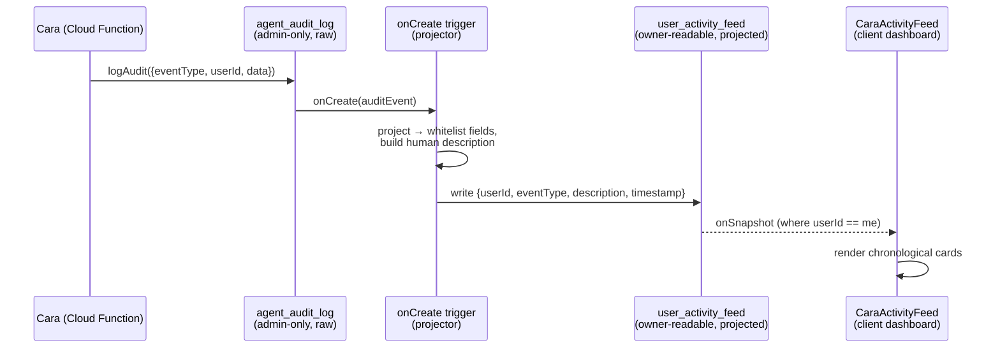
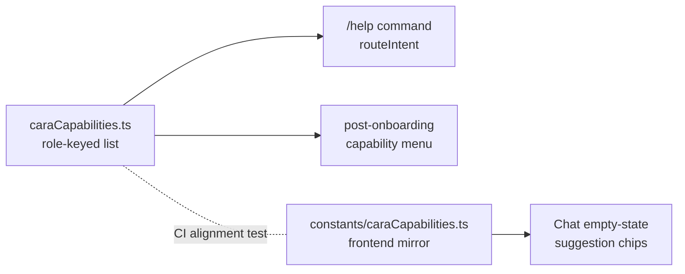

# feat: Agent-Native Legibility — Discovery, Live UI, and Transparency

## Summary

The agent-native audit found CareConnex strong on *capability* (Action Parity 88%, Context Injection 89%, UI Integration 85%) but weak on *legibility*: users can't **discover** what Cara can do (Capability Discovery 28%), don't **see** several agent actions reflected live in the UI (silent actions), and can't **see what Cara did** on their behalf (the audit log is admin-only). This plan closes those three gaps with the cheap, high-leverage fixes — without touching the large refactors (prompt-native onboarding, tools-as-primitives) which remain separate, deferred efforts.

Three tracks, sequenced: **A — Discovery** (a shared capability source-of-truth, a `/help` command, a post-onboarding capability menu, and in-chat suggestion chips), **B — Live UI** (convert three silent agent-written surfaces to real-time listeners), **C — Transparency** (a derived, projected user-facing "Cara Activity" feed backed by the existing audit log).

---

## Problem Frame

Cara is feature-complete but her surface is opaque to the people she serves:

- **Discovery (28%).** A user texting "Hey Cara" for the first time gets a name prompt, not a sense of what she can do. There are no in-chat hints, no suggested actions, no `/help`, and the system prompt forbids self-description. Intent classification recognizes ~49 intents that users must guess at blind.
- **Silent actions.** Three agent-written data surfaces have no live UI subscription: client-side **interviews** are fetched once via `.get()` (`components/client/ClientDashboard.tsx:268-279`), **job posts** are fetched once (`services/api.ts:680`), and **shift-swap requests** (`shift_swap_requests`) have no UI listener at all. Agent changes to these don't appear without a manual refresh.
- **Transparency.** Everything Cara does is recorded in `agent_audit_log` (well-structured, keyed by `userId`), but `firestore.rules:940-945` restricts reads to admins. Families cannot see the messages Cara sent, shifts she proposed, or concerns she flagged — a trust gap for an agent acting autonomously on a family's behalf.

These are the three lowest audit scores and they share a root cause (legibility, not capability) and a cheap fix cluster.

---

## Scope & Requirements Traceability

Requirements are derived from the agent-native audit's prioritized recommendations. IDs are plan-local.

| ID | Requirement | Audit rec | Track |
|----|-------------|-----------|-------|
| R1 | A single role-keyed source-of-truth for Cara's capabilities in user-facing language, consumed by welcome, `/help`, and chat chips | #1 | A |
| R2 | A `/help` (and `/capabilities`) command returning the role-aware capability menu | #1 / A3 | A |
| R3 | A capability-forward message after onboarding completes, and an enriched returning-user welcome | #1 / A1 | A |
| R4 | In-chat discovery: suggestion chips in the empty state, richer empty state, and a hint placeholder | #1 / A2 | A |
| R5 | Client interviews reflect agent writes live (`onSnapshot`) | #4 / B1 | B |
| R6 | Client job posts reflect agent writes live (`onSnapshot`) | #4 / B2 | B |
| R7 | Shift-swap requests are visible live to the affected caregiver and client | #5 / B3 | B |
| R8 | A user-facing, projected "Cara Activity" feed backed by the audit log, readable only by the owner | #2 / C1 | C |

---

## Key Technical Decisions

**KTD-1 — Capability source-of-truth: one backend module + one thin frontend mirror, not an API.**
The capability list is consumed in two runtimes that don't share code: Cloud Functions (welcome, `/help`) and the React frontend (chips). An API endpoint to serve it would be over-engineering for a near-static list. Decision: author the canonical role-keyed list in `functions/src/agents/caraCapabilities.ts` and keep a small parallel mirror in `constants/caraCapabilities.ts` for the frontend. A unit test asserts the two stay structurally aligned (same role keys, same capability ids) so drift is caught in CI. (Audit R1.)

**KTD-2 — `/help` as an exact-string command, not an LLM intent.**
`CLAUDE.md`'s Cara rules forbid keyword intent parsing but explicitly allow exact-string commands (STOP/UNSUBSCRIBE/YES/NO). `/help` is an exact command, so it short-circuits before LLM classification at `intentClassifier.ts:99-101`, mirroring the existing STOP/CANCEL bypass. This keeps it off the LLM cost path and compliant with the Cara rules.

**KTD-3 — Transparency via a derived, projected feed — not raw audit-log reads.**
`agent_audit_log` documents carry `data: Record<string, unknown>` — an unbounded payload that may include internal or sensitive fields. Firestore rules cannot filter fields on read, so granting owner-scoped reads on the raw collection would over-expose. Decision: a Firestore `onCreate` trigger projects each audit event into a new `user_activity_feed` collection containing only whitelisted, user-safe fields. Owner-scoped read rules apply to the *derived* collection; `agent_audit_log` stays admin-only. Four constraints make this boundary actually hold (each added in response to doc-review findings — see U8 for mechanics):

1. **Owner-uid resolution, not passthrough.** `agent_audit_log.userId` is **not** a uniform Firebase Auth uid — across call sites it holds a phone number (`logCrisisDetected`, proactive sends in `caraAgent.ts`), a `caregiverId` (`caregiver_sent_message`, `health_data_accessed` keyed to the viewed caregiver), a `clientId`, the literal `'system'` (invoicing), or an empty string. A blanket `resource.data.userId == request.auth.uid` rule would therefore (a) silently drop the flagship events the feed exists to show, and (b) write orphaned docs keyed by a phone number into a user-facing collection. The projector MUST resolve each event to the **owning family's Firebase Auth uid** before writing, and skip/quarantine events with no resolvable family owner.
2. **Opt-in event allow-list, not opt-out.** `AuditEventType` is a ~60-member union spanning billing, payouts, safety, and clinical events. Projecting every unmapped type with a "safe generic description" is an opt-out default that auto-exposes any future internal event type. Instead, only an explicit allow-list of family-facing event types is projected; unmapped/sensitive types (`crisis_detected`, `health_data_accessed`, `safety_violation`, `'system'` events, caregiver-only payout events) are omitted and logged for triage.
3. **Closed `summary` schema, not `Record<string, unknown>`.** The projected fields are `ownerUid`, `eventType`, `description`, `timestamp`, and a `summary` typed as a **closed interface** (only approved fields like an appointment date or caregiver first name — never `phone`, `textPreview`, `seniorId`, or raw `data`). `summary` is part of the whitelist, not an escape hatch from it.
4. **Correct agency attribution.** Some allow-listed events are user-initiated relays (`journal_comment_added`, `review_submitted` are the *user's* note/review relayed through Cara), not autonomous agent actions. Descriptions must reflect agency ("You added a note…" vs "Cara sent a message…") so the feed doesn't misattribute a family member's own action to Cara — a trust inversion in a trust feature.

This is the security boundary the audit flagged, resolved without exposing raw payloads or misrepresenting who did what. (Audit R8.)

**KTD-4 — Frontend role comes from `useCareConnex()`, not new prop drilling.**
`Chat.tsx` doesn't receive role today. Rather than thread a prop through `ChatInbox`, the chip logic reads `currentUser.userType` from the existing `useCareConnex()` context (the established global-state access pattern per CLAUDE.md). (Audit R4.)

**KTD-5 — Mirror existing patterns for all live surfaces.**
New subscriptions follow `subscribeCareJournal` (`services/api.ts:2184`); the activity feed mirrors `CareJournalFeed.tsx`; swap listeners mirror the `booking_amendments` `onSnapshot` already in `CaregiverBookingsPage` / `ClientDashboard`. No new subscription infrastructure.

---

## High-Level Technical Design

**Transparency data pipeline (Track C)** — the only non-obvious flow; everything downstream of the agent write is new:

**Discovery surfaces (Track A)** — one source feeding three consumers:

Track B is a pattern application (swap `.get()` → `onSnapshot`, add one mirrored subscription each) and needs no diagram.

---

## Implementation Units

Grouped by track. Tracks A and B are independent and can land in parallel; Track C depends on nothing in A/B but carries the security review, so it is sequenced last.

### Track A — Capability Discovery

### U1. Capability source-of-truth (backend + frontend mirror)

- **Goal:** One role-keyed list of Cara's capabilities in user-facing language, with a CI guard against backend/frontend drift.
- **Requirements:** R1.
- **Dependencies:** none.
- **Files:**
  - `functions/src/agents/caraCapabilities.ts` (create — canonical list; export `CARA_CAPABILITIES` keyed by `client` | `caregiver`, each entry `{ id, label, example }`; helper `buildCapabilityMenu(role, lang)`)
  - `functions/src/agents/caraCapabilities.test.ts` (create)
  - `constants/caraCapabilities.ts` (create — frontend mirror: same ids/labels/examples, no menu builder)
  - `constants/caraCapabilities.test.ts` (create — alignment assertion)
- **Approach:** Derive the user-facing entries from the real tool surface (the `Capability` groups in `toolCapabilities.ts` and the tool lists in `qaAgent.ts` system prompts), but written as plain-language outcomes ("find a caregiver", "check care updates", "view billing"). Spanish strings provided for `buildCapabilityMenu(role, 'es')` to match the existing bilingual welcome flow. The frontend mirror omits the menu builder (chips render their own layout).
- **Patterns to follow:** bilingual string pairs as in `webhooks.ts:667-680`; capability grouping in `functions/src/agents/toolCapabilities.ts`.
- **Test scenarios:**
  - Happy path: `buildCapabilityMenu('client', 'en')` returns a string containing each client capability label; `('caregiver', 'en')` returns caregiver labels and none of the client-only ones.
  - Edge: unknown/undefined role falls back to a sensible default (client) rather than throwing; `lang` other than `es` falls back to English.
  - Integration (drift guard): backend `CARA_CAPABILITIES` and frontend mirror expose identical role keys and identical capability `id` sets — test fails if one adds/removes an entry without the other.
- **Verification:** Both test files pass; importing the constant from a function and from a component both type-check.

### U2. `/help` command

- **Goal:** Typing `help` / `/help` / `/capabilities` returns the role-aware capability menu without hitting the LLM.
- **Requirements:** R2.
- **Dependencies:** U1.
- **Files:**
  - `functions/src/agents/intentClassifier.ts` (modify — add `HELP` to the `Intent` union and `VALID_INTENTS`; add exact-string bypass after the `TASK_REPLY` numeric check ~L101)
  - `functions/src/linq/routeIntent.ts` (modify — add a `HELP` branch early in `routeIntentAndRespond` that sends `buildCapabilityMenu(session.userType, session.preferredLanguage)`)
  - `functions/src/agents/intentClassifier.test.ts` (create or extend)
- **Approach:** Mirror the STOP/CANCEL exact-string short-circuit (KTD-2). The HELP branch in `routeIntent` is a static send — no tool calls, no session mutation. Normalize input (`trim().toUpperCase()`, strip a leading `/`) before matching.
- **Patterns to follow:** `STOP_WORDS` bypass at `intentClassifier.ts:73-101`; static-reply handler shape (the `CANCEL_REQUEST` block) in `routeIntent.ts`.
- **Test scenarios:**
  - Happy path: inputs `help`, `/help`, `HELP`, `/capabilities` all classify as `HELP` and bypass `quickComplete` (assert the LLM client is not called).
  - Edge: `help me find a caregiver` (help as a substring of a real request) does NOT classify as `HELP` — only exact/normalized matches trigger the command.
  - Edge: a pending-task session where the user types `help` still routes to `HELP`, not `TASK_REPLY`.
  - Error: missing/unknown `session.userType` → menu falls back to client capabilities (per U1), reply still sends.
- **Verification:** Sending `help` over the chat returns the capability menu; existing intent tests still pass.

### U3. Capability-forward welcome

- **Goal:** After onboarding completes, Cara tells the user what she can do; returning users get an enriched greeting.
- **Requirements:** R3.
- **Dependencies:** U1.
- **Files:**
  - `functions/src/agents/permissionsConversation.ts` (modify — after the `client_permissions_autobook` completion `sendMessage` ~L227, append the client capability menu)
  - `functions/src/agents/onboardingConversation.ts` (modify — at the caregiver onboarding completion point following Stripe Connect, append the caregiver capability menu)
  - `functions/src/linq/webhooks.ts` (modify — replace the generic returning-user "how can I help today?" ~L670 with a one-line capability reminder)
- **Approach:** Reuse `buildCapabilityMenu` from U1; do not inline new strings. Keep the *first-touch* greeting (name prompt) unchanged — the menu lands at completion so it doesn't bloat onboarding. Preserve bilingual behavior via the existing `preferredLanguage`.
- **Patterns to follow:** post-completion `sendMessage` in `permissionsConversation.ts:218-227`; bilingual welcome construction in `webhooks.ts:660-682`.
- **Execution note:** This is the unit most likely to affect onboarding golden transcripts — run `onboardingConversation.story.test.ts` and update expected transcripts intentionally, not blindly.
- **Test scenarios:**
  - Happy path: completing client permissions sends the autobook confirmation followed by a message containing client capability labels.
  - Happy path: caregiver completion sends the caregiver capability menu.
  - Edge: returning-user welcome contains a capability reminder and still routes the user's next message normally (menu is informational, not a blocking step).
  - Integration: `onboardingConversation.story.test.ts` reflects the new completion message rather than failing on an unexpected extra send.
- **Verification:** Story/transcript tests pass with the intended new sends; manual run of a client onboarding shows the menu after autobook setup.

### U4. In-chat discovery (suggestion chips, empty state, placeholder)

- **Goal:** The chat UI shows new users what to ask: tappable suggestion chips, a guiding empty state, and a hint placeholder.
- **Requirements:** R4.
- **Dependencies:** U1 (frontend mirror).
- **Files:**
  - `components/Chat.tsx` (modify — read `useCareConnex().currentUser.userType`; render role-aware chips in the empty state at L218-225; chips prefill+send via `handleSend`; update placeholder L320)
  - `components/ui/Chip.tsx` (create — lightweight chip, or reuse `Button` `variant="outline" size="sm"` if a new primitive isn't warranted)
- **Approach:** Chips map over the frontend `CARA_CAPABILITIES[role]`; tapping one sets `inputText` to the capability's `example` and calls the existing `handleSend`. Empty state shows 3-4 chips above the existing "Start a conversation" text. Placeholder becomes a hint ("Ask me to find caregivers, manage visits, check billing…"). Role read via context per KTD-4 — no prop drilling through `ChatInbox`.
- **Patterns to follow:** `handleSend` flow `Chat.tsx:93-110`; `useCareConnex()` access; `components/ui/Button.tsx` variants; day-chip selection UI in `BookingFlow.tsx` for chip styling reference.
- **Test scenarios:** (presentational; cover the extractable logic)
  - Happy path: given role `client`, the chip set derived from the frontend mirror matches the client capability examples (pure-function test on the chip-selection helper).
  - Edge: role `caregiver` yields caregiver examples; missing role yields the default set without crashing.
  - `Test expectation: none -- chip rendering/onClick wiring is presentational; logic coverage lives in the chip-selection helper test above. No component test harness exists in-repo.` 
- **Verification:** Empty chat shows role-appropriate chips; tapping one sends that message; placeholder shows the hint.

---

### Track B — Live UI (Silent Actions)

### U5. Client interviews → live listener

- **Goal:** Agent-written interview requests appear in the client dashboard without a refresh.
- **Requirements:** R5.
- **Dependencies:** none.
- **Files:** `components/client/ClientDashboard.tsx` (modify L268-279)
- **Approach:** Near-mechanical: the surrounding `useEffect` already builds `onSnapshot` listeners and pushes unsubscribes to `unsubs`. Replace the `video_interviews` `.get().then(...)` with `.onSnapshot(snap => {...}, () => {})` using the identical callback body, and `unsubs.push(...)` the returned unsubscribe.
- **Patterns to follow:** the `booking_amendments` `onSnapshot` block immediately above (`ClientDashboard.tsx:258-265`).
- **Test scenarios:**
  - `Test expectation: none -- pure conversion of a one-time fetch to the established onSnapshot listener pattern within an existing effect; no behavioral logic added. Verified manually.`
- **Verification:** With the dashboard open, an interview request written server-side appears live; the listener is torn down on unmount (no console listener-leak warnings).

### U6. Client job posts → live listener

- **Goal:** Agent-created/edited job posts reflect live in the client dashboard.
- **Requirements:** R6.
- **Dependencies:** none.
- **Files:**
  - `services/api.ts` (modify — add `subscribeJobPostsByClient(clientId, cb)` mirroring `subscribeCareJournal` at L2184; keep existing `getJobPostsByClient` for any one-shot callers)
  - `components/client/ClientDashboard.tsx` (modify — replace the one-time fetch with the subscription, push unsub to cleanup)
- **Approach:** New service method queries `job_posts where clientId == clientId`, sorts by `createdAt` desc (preserve current sort), returns the `onSnapshot` unsubscribe. Handle `permission-denied` by emitting `[]` as the existing getter does.
- **Patterns to follow:** `subscribeCareJournal` (`services/api.ts:2184`); cleanup pattern in `ClientDashboard.tsx` `unsubs`.
- **Test scenarios:**
  - Happy path: subscription emits the client's job posts sorted newest-first on initial snapshot.
  - Edge: empty result emits `[]`, not an error; `permission-denied` emits `[]`.
  - Integration: a job post written after subscribe triggers a fresh emission with the new post included.
- **Verification:** Creating/editing a job post via Cara updates the dashboard list without refresh.

### U7. Shift-swap requests → live visibility

- **Goal:** A caregiver sees swaps they initiated and their acceptance state; a client sees swaps affecting their appointments.
- **Requirements:** R7.
- **Dependencies:** none.
- **Files:**
  - `services/api.ts` (modify — add `subscribeShiftSwapsForCaregiver(caregiverId, cb)` over `shift_swap_requests`, and `subscribeShiftSwapsForClient(clientId, cb)` over **both** `shift_swap_requests` and `shift_offers where kind == 'swap'`, merged)
  - `firestore.rules` (modify — add a `match /shift_swap_requests/{id}` block with owner-scoped read `resource.data.fromCaregiverId == request.auth.uid || resource.data.clientId == request.auth.uid || isAdmin()`, `allow write: if false`; confirm `shift_offers` already grants the needed owner read, add it if not)
  - `components/caregiver/CaregiverBookingsPage.tsx` (modify — subscribe where `fromCaregiverId == uid`; render a "Pending Swaps" subsection)
  - `components/client/ClientDashboard.tsx` (modify — subscribe the merged client swaps; render a "Pending Care Changes" panel adjacent to the existing Pending Amendments panel)
  - `services/shiftSwap.test.ts` (create) for the query builders
- **Approach:** There are **two** swap mechanisms: caregiver-initiated swaps write `shift_swap_requests` (`caregiverSwapHandler.ts:173`, fields: status `open` | `accepted`, `fromCaregiverId`, `clientId`, `appointmentId`, `date`, `time`, `expiresAt`), while client-initiated swaps go through `createShiftOffer` → `shift_offers` (`clientSwapRequestHandler.ts` → `shiftOffer.ts`, `kind: 'swap'`). The client panel must read both or it silently misses client-originated swaps. Both collections need owner-read rules (the catch-all `match /{document=**}` denies reads otherwise — this is why `firestore.rules` is now in scope). Display surfaces are small read-only cards (who/what/when + status). No new write paths. Card status treatment: `open` → pending badge; `accepted` → accepted badge; expired (`expiresAt` past) → filtered out. Loading: render `null` until first snapshot (mirror `booking_amendments`); empty: render `null` (no clutter), matching `CareJournalFeed`.
- **Patterns to follow:** `booking_amendments` subscriptions already in both pages; card styling from `CareJournalFeed.tsx`.
- **Test scenarios:**
  - Happy path: caregiver subscription returns only `shift_swap_requests` where `fromCaregiverId` matches; client subscription returns the union of `shift_swap_requests` and `shift_offers (kind=swap)` where `clientId` matches.
  - Edge: client-initiated swap (written to `shift_offers`) appears in the client panel — guards against the single-collection assumption.
  - Edge: expired (`expiresAt` past) swaps are filtered out (status neither `open` nor `accepted`).
  - Edge: no swaps and loading → panels render `null` (no empty-box clutter).
  - Integration: an `accepted` status update emits a fresh snapshot reflecting the accepting caregiver.
- **Verification:** Both a caregiver-initiated and a client-initiated swap appear live in the affected client's view; the initiating caregiver sees their own; acceptance updates status live; rules-emulator confirms owner-scoped read on both collections.

---

### Track C — Transparency

### U8. Projected `user_activity_feed` + trigger + rules

- **Goal:** Project the allow-listed, family-facing audit events into an owner-readable feed of whitelisted, user-safe fields, keyed by the resolved family Firebase Auth uid — without exposing raw audit payloads.
- **Requirements:** R8.
- **Dependencies:** none (consumes existing `agent_audit_log` writes).
- **Files:**
  - `functions/src/agents/activityFeedMap.ts` (create — the **single source of truth** for Track C policy: per `AuditEventType`, an `{ included: boolean, agency: 'agent' | 'user', describe(summary) }` entry; the closed `ActivityFeedSummary` interface; and `resolveOwnerUid(event)` mapping each event's identity field to the family uid)
  - `functions/src/agents/activityFeedMap.test.ts` (create — exhaustiveness + whitelist + agency + resolution tests)
  - `functions/src/triggers/projectActivityFeed.ts` (create — `onCreate` trigger on `agent_audit_log/{id}`; calls the map; writes via `.doc(<auditDocId>).set(...)` for idempotency)
  - `functions/src/index.ts` (modify — export the trigger)
  - `firestore.rules` (modify — add `match /user_activity_feed/{id}` with owner-scoped read `isAuthenticated() && resource.data.ownerUid == request.auth.uid` ` || isAdmin()`, `allow write: if false`)
  - `firestore.indexes.json` (modify — add the `ownerUid` + `timestamp` desc composite index the ordered query needs)
- **Approach:** All policy lives in `activityFeedMap.ts` (KTD-3). For each event: (1) `resolveOwnerUid` maps the event's identity field to the family's Firebase Auth uid — resolving phone→uid where needed and returning `null` for events with no family owner; (2) if the eventType is not `included` in the allow-list **or** the owner can't be resolved, the trigger skips the event (logs for triage, writes nothing); (3) otherwise it writes `{ ownerUid, eventType, description, timestamp, summary }` where `description` honors `agency` (user-relayed events read "You …", agent events read "Cara …") and `summary` conforms to the closed `ActivityFeedSummary` interface (never the raw `data` blob). The feed doc id IS the source audit doc id (`.doc(id).set(..., { merge: true })`) so at-least-once trigger retries overwrite rather than duplicate.
- **Patterns to follow:** existing triggers in `functions/src/triggers/`; owner-scoped read rules at `firestore.rules` (support_tickets ~L372, appointments ~L202); `AuditEventType` union and per-call-site `userId` semantics in `functions/src/observability/auditLog.ts` and its callers (`caraAgent.ts`, `functions/src/mcp/server.ts`, `invoicing.ts`); KTD-1's CI-drift-guard pattern for the exhaustiveness test.
- **Execution note:** Security-sensitive — this adds a user-facing read boundary. Write the whitelist/agency/resolution tests FIRST. Before coding, audit every `logAudit` call site to record, per eventType, what its `userId` holds and which events have a family owner.
- **Test scenarios:**
  - Happy path: an allow-listed agent event (e.g. `message_sent`) projects to a feed doc with the correct `ownerUid` (resolved), a "Cara …" description, and a schema-valid `summary`.
  - Agency (critical): `journal_comment_added` / `review_submitted` project with a "You …" description, never attributing the user's relayed action to Cara.
  - Identity resolution (critical): events with `userId` = phone, `userId` = caregiverId, `userId` = `'system'`, and `userId` = `""` are each either resolved to the correct family uid or skipped — **never** written under an unresolved key.
  - Allow-list (critical): a sensitive/unmapped eventType (`crisis_detected`, `health_data_accessed`, `safety_violation`) is NOT projected; an exhaustiveness test fails CI when a new `AuditEventType` is added without an explicit include/exclude decision.
  - Whitelist (critical): the projected doc contains ONLY `{ ownerUid, eventType, description, timestamp, summary }`; assert no `phone`, `textPreview`, `seniorId`, `data`, or other field leaks even when the source event carries them, and that `summary` matches the closed interface.
  - Idempotency: re-firing the trigger for the same audit id overwrites the single feed doc rather than creating a duplicate.
  - Integration: a write to `agent_audit_log` for an allow-listed event yields exactly one `user_activity_feed` doc readable by that family uid and denied to other users (rules emulator test).
- **Verification:** Rules-emulator test confirms owner-read / cross-user-deny; projecting a sensitive event yields no feed doc; projecting a phone-keyed event yields a doc keyed by the resolved family uid (or none).
- **Note (completeness):** `logAudit` is best-effort (`auditLog.ts:94-97` swallows write failures), so a dropped audit write produces a silent feed gap. The U9 UI must frame the feed as "recent activity," not a guaranteed-complete ledger. Backfill of pre-existing audit history is out of scope — the feed launches empty for existing users.

### U9. "Cara Activity" feed UI

- **Goal:** Families see a chronological feed of what Cara did on their behalf.
- **Requirements:** R8.
- **Dependencies:** U8.
- **Files:**
  - `services/api.ts` (modify — add `subscribeAgentActivity(ownerUid, cb)` over `user_activity_feed`, `where ownerUid == uid`, ordered by `timestamp` desc, limited)
  - `components/client/CaraActivityFeed.tsx` (create — mirror `CareJournalFeed.tsx`)
  - `components/client/ClientDashboard.tsx` (modify — render the panel near the top of the dashboard, above the journal feed, to reinforce transparency as a primary surface)
- **Approach:** Clone the `CareJournalFeed` subscribe→render pattern: `useEffect` → `subscribeAgentActivity` → cards with `description` + relative timestamp + a status icon. Title the panel "Recent activity from Cara" (per U8's completeness note — not a guaranteed-complete ledger). Icon mapping: use a single generic Cara icon for all events in this unit (a per-eventType icon set is deferred — avoids a blocking decision). Explicit states: **loading** (before first snapshot) → skeleton/spinner consistent with `CareJournalFeed`; **empty** (snapshot fired, length 0) → a short explanatory line ("Actions Cara takes — messages, scheduling, updates — will show up here.") rather than `null`, so the feature is visible to new users; **error** (non-`permission-denied`) → a non-blocking inline notice.
- **Patterns to follow:** `components/client/CareJournalFeed.tsx` (subscription + card layout); `LiveCareFeed.tsx` (timeline aesthetic + relative time).
- **Test scenarios:**
  - Happy path: subscription returns the family's activity newest-first, scoped by `ownerUid`.
  - Edge: confirmed-empty feed renders the explanatory empty state (not blank); loading renders the skeleton; `permission-denied` emits `[]`.
  - Integration: a new projected event (from U8) appears live in the feed.
- **Verification:** With the dashboard open, an allow-listed agent action (e.g. Cara sends a caregiver message) appears in the activity feed within moments, scoped to the current family only; the empty state is visible before any activity exists.

---

## Risks & Mitigations

| Risk | Likelihood | Mitigation |
|------|-----------|------------|
| **Audit-log read boundary leaks sensitive fields** | Med | KTD-3 derived/projected collection; closed `summary` schema + whitelist-only projection with a security test asserting `data`/`phone`/`textPreview` never propagate; raw `agent_audit_log` rules untouched. |
| **Feed keyed by wrong identity → silent drops or cross-user exposure** | High | KTD-3 #1 — `resolveOwnerUid` resolves each event's heterogeneous `userId` (phone/caregiverId/`'system'`/empty) to the family Firebase Auth uid before write; unresolvable events are skipped; rules-emulator cross-user-deny test. |
| **Feed misattributes a user's own action to Cara** | Med | KTD-3 #4 — per-event `agency` flag drives "You …" vs "Cara …" descriptions; agency test in U8. |
| **Future audit event types auto-expose to families** | Med | KTD-3 #2 — opt-in allow-list; CI exhaustiveness test fails when a new `AuditEventType` lacks an include/exclude decision. |
| **`shift_swap_requests` reads silently denied (no rule)** | High | U7 now adds the `match /shift_swap_requests/{id}` owner-read block to `firestore.rules` (catch-all otherwise denies). |
| **Client-initiated swaps invisible (wrong collection)** | Med | U7 client subscription reads both `shift_swap_requests` and `shift_offers (kind=swap)`. |
| **Feed presented as complete but audit writes are best-effort** | Med | U8/U9 note — feed framed as "recent activity," not a guaranteed ledger; dropped audit writes produce known, accepted gaps. |
| **Onboarding transcript regressions from U3** | Med | Run and intentionally update `onboardingConversation.story.test.ts`; menu appended at completion, not mid-flow. |
| **Capability list drift between backend and frontend** | Med | KTD-1 CI alignment test on role keys + capability ids. (Open: extend to `label`/`example` equality — see Open Decisions.) |
| **`/help` shadows a legitimate request containing "help"** | Low | Exact/normalized match only (KTD-2); explicit test for the substring case. |
| **New ordered queries need composite indexes** | Low | Add to `firestore.indexes.json` in U6/U8/U9 (U8's `ownerUid`+`timestamp` index is explicit). |

---

## Open Decisions (surfaced in review — resolve during implementation)

These are genuine judgment calls with more than one valid answer; an implementer should pick deliberately rather than default.

- **Chip empty-state lifecycle (U4).** Chips render only while `messages.length === 0`; the empty-state wrapper (and chips) unmount on first send. Confirm this is the intended behavior vs. keeping a persistent suggestion row.
- **Chip curation (U4).** `CARA_CAPABILITIES[role]` may exceed 4 entries; the empty state shows 3-4. Decide the selection rule — recommend a `featured`/`displayOrder` field on the constant so product curates the first impression deterministically (rather than "first N in declaration order").
- **`Chip.tsx` vs reuse `Button` (U4 / scope finding).** `components/ui/Button.tsx` already has `variant="outline" size="sm"`. Default to reusing it; only create a new primitive if pill shape / icon slot / dismissibility is genuinely required. Avoids a single-consumer abstraction.
- **Capability mirror location (KTD-1 / scope finding).** The frontend mirror has one current consumer (chips). Either keep `constants/caraCapabilities.ts` + the CI drift guard, or inline the list locally in `Chat.tsx`. If kept, extend the drift test to assert `label`/`example` equality (not just `id`/role-key sets) since copy is the field that drifts.
- **U3 returning-user welcome (R3 / scope finding).** Enriching the returning-user greeting fires on *every* reconnect and may read as repetitive — it's the one U3 change not tied to the new-user Discovery gap. Decide: keep it, make it occasional, or drop it and limit U3 to the post-onboarding menu.
- **`job_posts` public read (U6 / security finding).** `firestore.rules` grants `allow read: if true` on `job_posts`; U6 builds a new live subscription on top of it. Care-request posts carry sensitive details. Consider tightening the read rule to `isAuthenticated()` as a companion change rather than extending reliance on public read.
- **Write-time projection vs. `onCreate` trigger (KTD-3 / adversarial finding).** The plan uses an `onCreate` trigger. Emitting the feed doc directly from `logAudit` (typed payload + resolved owner already in hand) is a cheaper, more accurate alternative the plan didn't weigh. Re-confirm the trigger choice or switch; if keeping the trigger, the U8 identity-resolution work is non-negotiable since type info is lost by then.

---

## Scope Boundaries

### Deferred to Follow-Up Work
- **Context-injection improvements** (audit rec #10 — inject care-plan summary / user preferences into the system prompt). Overlaps the fully-agent-native brainstorm's **R1**; routed to that roadmap track to avoid collision. (see related: `docs/brainstorms/2026-06-22-cara-fully-agent-native-requirements.md`)
- **Tools-as-primitives decoupling** (audit rec #8 — split state-mutation tools from notifications; add a `send_sms` primitive). Incremental, ride-along cleanup; not blocking legibility.
- **Intent/message-template registries** (audit rec #9) — part of the prompt-native track below.

### Outside this plan's identity
- **Prompt-native onboarding / job-posting refactor** (audit rec #3, ~3,800 lines of step machines → LLM-guided flows). A multi-week project with its own regression risk and golden-transcript scaffolding; belongs to the brainstorm's Phase 2 strangler migration, not here.
- **Surfacing every isolated agent collection** (health_signals, issue_log, proactive_drafts). This plan delivers the audit-log feed as the highest-trust-value transparency surface; the others are separate product decisions.

---

## Sources & Research

- Agent-native architecture audit (this session) — the eight principle scores and prioritized recommendations this plan executes.
- `docs/brainstorms/2026-06-22-cara-fully-agent-native-requirements.md` — adjacent control-flow roadmap; owns the deferred context-injection (R1) work.
- `CLAUDE.md` — Cara handler rules (exact-string commands allowed; no keyword intent parsing), `useCareConnex()` global-state convention, hybrid LLM cost discipline.
- Code grounding: `components/Chat.tsx`, `components/client/ClientDashboard.tsx:268-279`, `services/api.ts:680,2184`, `functions/src/agents/intentClassifier.ts:73-101`, `functions/src/linq/routeIntent.ts`, `functions/src/linq/webhooks.ts:660-720`, `functions/src/agents/permissionsConversation.ts:218-227`, `functions/src/observability/auditLog.ts`, `firestore.rules:940-945`, `functions/src/agents/caregiverSwapHandler.ts:173`, `components/client/CareJournalFeed.tsx`.
