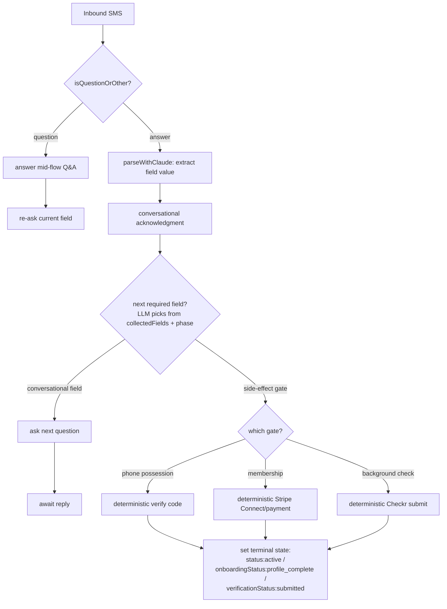
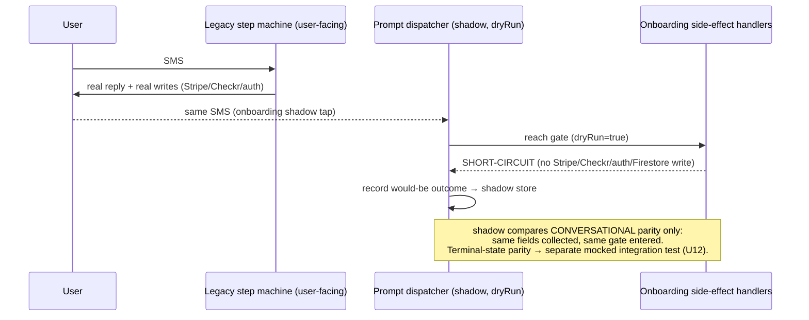

# feat: Cara → Legitimate 100% Agent-Native Score

## Summary

Take the AI agent **Cara** to a *legitimate* 100% agent-native score across all 8 audit principles. Two tracks: **re-baseline** deliberate exclusions as documented N/A (so the audit stops penalizing intentional design), and **close** every genuine gap. Approach is all-in but sequenced so additive low-risk work lands before the high-risk onboarding and tool-surface refactors.

Research re-set the starting line: against the raw audit (61%), the *legitimate* baseline is ~68–70% once exclusions leave the denominator and already-shipped work (the 06-23 legibility plan, the 06-17 horizon plan) is credited. Genuine remaining engineering is concentrated in four principles — **CRUD Completeness, Prompt-Native Features, Tools as Primitives, Context Injection** — where re-baselining barely helps. The other four are mop-up or already done.

---

## Problem Frame

The 2026-06-24 `/ce-agent-native-audit` scored Cara at 61% overall. The brainstorm (see origin) established that chasing a literal 100% would regress security and compliance, so the target is a defensible 100%: exclusions documented and dropped from denominators, real gaps closed.

Research (Phase 1) materially narrowed scope and surfaced one conflict that has been resolved with the user:

- **Already shipped (do not re-plan):** capability discovery + `/help` + post-onboarding menu (bilingual backend); live listeners for interviews, job posts, shift-swaps; the `agent_audit_log → user_activity_feed` transparency pipeline; action-parity orphan tools (`pause_account`/`reactivate_account`, `accept_shift`/`decline_shift`, `complete_task`); `context/capability-map.md` + parity test; a golden-transcript replay harness (`functions/src/agents/goldenTranscripts.test.ts`); a shadow-mode mechanism (`functions/src/agents/routingShadow.ts`).
- **Resolved conflict:** the 06-17 convergence spike put onboarding on the *do-not-migrate* list (irreversible Stripe/Checkr side effects; `skipSend` suppresses SMS but tools still write). Decision: **B7 rewrites only the conversational layer** (next-question selection, field extraction, mid-flow Q&A, acknowledgment) into a prompt-driven dispatcher; the irreversible transitions stay deterministic code and are documented as intentional N/A.
- **Corrected assumption:** the brainstorm referenced a "48h dispute SLA"; the actual auto-approve SLA in code is **24h** (`functions/src/linq/routeCaregiver.ts:1217`, `functions/src/mcp/server.ts:3300`). No Firebase Remote Config exists — config extraction targets a typed constants module.

---

## Requirements

Traceability to origin brainstorm tracks (B1–B7, Track A). Each maps to one or more Implementation Units below.

| ID | Requirement | Units |
|---|---|---|
| Track A | Re-baseline: author `AGENT_NATIVE_EXCLUSIONS.md`; audit re-run honors it (drops listed items from denominators) | U1, U15 |
| B1 | UI Integration: live listeners for caregiver-profile, senior-profile, user doc | U2, U3 |
| B2 | Context Injection: inject account-state, user identity, location, care-team, full care-plan into standing system prompt | U4 |
| B3 | Capability Discovery: frontend bilingual hints + in-app `/help` on the real Cara surface (`AiSearchAgent`) | U5; onboarding teaser + landing-page call-out → Deferred to Follow-Up |
| B4 | CRUD: add `create_senior_profile`, `create_recurring_schedule` | U6 |
| B5 | CRUD/Action Parity: `delete_care_journal_entry` (soft-delete), `delete_review`, support-ticket view/update lifecycle, `log_match_feedback`, proactive-draft management, direct `create_job_post` tool | U7 |
| B6 | Tools as Primitives: extract `send_notification` primitive; decompose `perform_web_action`; decompose orchestration tools (`find_replacement_caregivers`, `request_booking`) | U8, U9, U9b |
| B7 | Prompt-Native: shadow write-isolation; transcript corpus; prompt-driven onboarding dispatcher (conversational layer only); convert job-posting/schedule-mod/availability/refund flows; config extraction | U10, U11, U12, U13, U14 |

### Success Criteria

1. **Binding (KTD-11):** every Close unit is implemented and verified, and `AGENT_NATIVE_EXCLUSIONS.md` is published with peer-reviewable rationale. **Reporting:** a re-run of `/ce-agent-native-audit` referencing `AGENT_NATIVE_EXCLUSIONS.md` shows a per-principle pass (exclusions out-of-denominator). The audit number is the reporting artifact, not the pass/fail gate — see Open Q1.
2. No regression: no auth/admin action becomes agent-reachable; no compliance record (invoices, shift-hours, audit logs) becomes agent-mutable/deletable; no internal-infra collection becomes user-visible.
3. Onboarding cutover passes the replay parity bar (below) before any production flip; instant rollback to the legacy machine retained.
4. `context/capability-map.md` + the parity test stay in sync with every tool addition/decomposition.

---

## Key Technical Decisions

- **KTD-1 — Re-baseline is a doc + audit contract, not code.** `AGENT_NATIVE_EXCLUSIONS.md` is the single source of truth for intentional N/A items. The audit's denominators must reference it. *(Assumption: the audit skill can be made exclusion-aware or invoked with the doc as input — see Open Questions.)*
- **KTD-2 — Onboarding stays a deterministic state machine for side effects; prompt-drives only the conversation.** The dispatcher decides *which field to collect next* and handles extraction/ack/mid-flow Q&A via `parseWithClaude`; phone-possession, Stripe Connect/payment, and Checkr bg-check transitions remain explicit code. Resolves the spike conflict. (see origin: B7)
- **KTD-3 — Shadow write-isolation already exists for MCP tools, but does NOT cover onboarding's direct side effects.** `shadowMode` already threads through `runQaAgent` (`qaAgent.ts:794`) and `handleToolCall` (`server.ts:1896`, fail-closed `READ_ONLY_TOOLS` allowlist), proven by `shadowIsolation.test.ts`. **Critical gap:** `onboardingConversation.ts` performs its Stripe/Checkr/Auth/Firestore work through ~60 **direct calls, not MCP tools**, so the existing isolation never touches them. A shadow run of the onboarding dispatcher would therefore either fire real irreversible side effects or skip the side-effect handlers entirely. Consequence (KTD-3a): **shadow can validate only the conversational sequencing layer** (which field is collected, which gate is routed into); terminal-state and side-effect correctness must be proven by a separate non-shadow integration test (see U10/U12). Do not let any parity claim read as if shadow proves terminal-state parity.
- **KTD-4 — Listeners mirror the established `subscribeX` convention.** Add `subscribeX` methods to `services/api.ts` (never direct `db` in components), push unsubscribe to the existing `unsubs` cleanup array, mirror `subscribeCareJournal`. Rules note: the `users/{uid}` read rule already exists (`firestore.rules:79`) — `subscribeToUser` needs no new block. The `senior_profiles` rule (`firestore.rules:174`) is `isOwner(profileId)` (doc-id must equal uid) and **breaks for multi-senior households** — see KTD-10. Ordered queries need a composite index in `firestore.indexes.json`. On `permission-denied`, `console.error` for diagnosis then emit empty — no user-facing toast (best-effort surface; a toast on transient rule issues would be noisy). Listeners update context state unconditionally; consuming form components keep edit-in-progress state in **local** component state (not derived from context) so a mid-edit snapshot does not clobber unsaved input — no listener-pause mechanism needed (mirrors the appointments optimistic pattern).
- **KTD-5 — `send_notification` becomes a composable primitive.** Extract the inline `trySend` side-effect (bundled in ~6 tools) into one tool the model composes. Any decomposed *committing* primitive is added to the `ALWAYS_CONFIRM`/`CONDITIONAL_CONFIRM` gate **by name in the same PR** and strips `_confirmedActionId` from LLM input.
- **KTD-6 — Tool count changes are deliberate and bounded.** B6 decomposition adds tools; the "works best on Sonnet" loop is sensitive to surface size. Update `context/capability-map.md` + parity test in the same PR as any tool change, regression-test the Sonnet MCP loop, and prefer consolidation over proliferation.
- **KTD-7 — Honor the hybrid-LLM invariant.** Sonnet for the multi-turn MCP loop only; gpt-4o-mini (`quickComplete`/`parseWithClaude`) for all single-shot parsing. The onboarding dispatcher's next-field selection is a single-shot gpt-4o-mini call, not a Sonnet loop turn (latency).
- **KTD-8 — Context injection stays scoped to high-hit data.** Inject care-plan, account-state, location, care-team; keep privacy-sensitive/expensive data (earnings) lazy via tools. Prompt must hedge when memory (Zep) is unavailable rather than asserting facts it doesn't have.
- **KTD-9 — Config home is a typed constants module, not Remote Config** (none exists in repo). Correct the SLA to the real 24h value while extracting.
- **KTD-10 — Agent mutation tools enforce session-owner authorization (Admin SDK bypasses Firestore rules).** Cloud Functions run via Admin SDK, which ignores `firestore.rules`, so every new mutating tool must enforce ownership in application code: `create_senior_profile` binds `clientId` to the session user (never a free-form LLM parameter) and stamps `userId: clientId` on the doc so downstream checks are non-vacuous; `update_support_ticket`/`delete_review`/`delete_care_journal_entry` fetch the doc and assert session-owner before writing. Because additional household seniors are not uid-keyed, amend the `senior_profiles` rule to `allow read: if isOwner(profileId) || resource.data.userId == request.auth.uid || isAdmin();` and make `subscribeToSeniorProfile` query by `userId` rather than doc-by-uid — otherwise U3's listener silently returns empty for every multi-senior household.
- **KTD-11 — Definition of done is decoupled from the audit number.** The binding success criterion is (a) every Close unit implemented and verified, and (b) `AGENT_NATIVE_EXCLUSIONS.md` published with peer-reviewable rationale. The audit re-run is a *reporting artifact*, not the gate — because the audit skill is external to this repo and may only support manual re-baseline (Open Q1), treating the per-principle number as pass/fail would make "done" self-graded. Resolve Open Q1 before Phase 0 starts.

---

## High-Level Technical Design

### Prompt-driven onboarding dispatcher (U12) — conversational layer only

The dispatcher replaces the `switch(step)` *question-sequencing* logic. Deterministic side-effect steps remain hard-coded gates the dispatcher routes *into* but never improvises.

Directional guidance, not implementation spec. The key invariant: the LLM owns the **white** path (extraction, ack, next-field choice, Q&A); the **gates** are deterministic and irreversible-safe.

### Shadow write-isolation (U10) — prerequisite for cutover

Onboarding does NOT run through `runQaAgent`/MCP tools — it makes direct Stripe/Checkr/auth/Firestore calls — so the existing MCP-tool `shadowMode` does not isolate it. U10 adds a `dryRun` guard at those direct call sites, and shadow proves **conversational parity only**. Terminal-state parity is proven separately (U12 mocked integration test).

---

## Scope Boundaries

### In scope
All units U1–U15 below: re-baseline doc, three live listeners, context-injection expansion, frontend discovery polish, the CRUD/action-parity tools, `send_notification` + `perform_web_action` decomposition, the prompt-driven onboarding dispatcher (conversational layer) and the other flow conversions, config extraction, and the verification re-run.

### Deferred to Follow-Up Work
- Full migration of onboarding *side-effect* steps into the agent loop (explicitly excluded by KTD-2 / the spike).
- Migrating decision lists beyond config constants (bereavement/approval-word stores) — keep as code unless a later need arises.
- In-app capability chips in peer `Chat.tsx` — obsoleted by the 06-23 plan (peer messaging is not a Cara surface).
- B3 onboarding-teaser (`OnboardingFlow.tsx`) and landing-page capability call-out — UX-discoverability nice-to-haves that do not affect the audit's Capability Discovery pass (scored on the in-app `/help` + SMS menu). Defer unless engagement data justifies them.
- `find_replacement_caregivers`/`request_booking` decomposition (U9b) may resolve to "leave composed, mark intentional N/A" if decomposition regresses latency or the Sonnet loop — that exclusion lands here with rationale.

### Outside this product's identity (intentional N/A — Track A)
- Auth/admin actions to the SMS agent (password change, account deletion, ban, suspend).
- Mutable/deletable compliance records (invoices, shift-hours, audit logs).
- User-visible internal infra (`credential_vault`, `browser_sessions`, webhook idempotency ledgers, `dnd_queue`, trigger/agent-lifecycle collections).
- CLAUDE.md-sanctioned deterministic paths (crisis keywords, STOP/UNSUBSCRIBE, strict YES/NO, email-format regex, OTP rate limits, `isTrivialQuickReply`).

---

## Implementation Units

Grouped into phases. Land Phase 1 first (additive, de-risks early score movement); Phase 4 is gated behind its own prerequisites.

### Phase 0 — Re-baseline foundation

#### U1. Author `AGENT_NATIVE_EXCLUSIONS.md`
- **Goal:** Single source of truth declaring intentional N/A items with one-line rationale, enumerated specifically enough that the U15 re-baseline can mechanically match each item against the audit's gap lists.
- **Requirements:** Track A
- **Dependencies:** none
- **Files:** `AGENT_NATIVE_EXCLUSIONS.md` (new, repo root); update `context/progress-tracker.md`
- **Approach:** Mirror the exclusions table from the origin doc. Group by principle; each row: **item (named precisely enough to match an audit gap-list entry — e.g. exact tool/collection/action name), principle(s), rationale**. The audit is NOT exclusion-aware (Open Q1 resolved), so this doc is the input to a manual re-baseline — vague entries ("internal stuff") break the match; use the same vocabulary the audit sub-agents emit. Cross-reference `context/capability-map.md`.
- **Patterns to follow:** existing context docs under `context/`.
- **Test scenarios:** `Test expectation: none -- documentation artifact. Coverage is the U15 audit re-run honoring this file.`
- **Verification:** File exists, lists every exclusion from the origin doc's Track A table, and is referenced by U15.

### Phase 1 — Additive, low-risk (B1, B2, B3)

#### U2. Caregiver-profile live listener
- **Goal:** Caregiver dashboard reflects agent writes to `caregivers/{uid}` without logout/login (replaces one-shot `refreshCaregiverProfile`).
- **Requirements:** B1
- **Dependencies:** none
- **Files:** `context/CareConnexContext.tsx`, `services/api.ts` (new `subscribeToCaregiverProfile`), `services/api.test.ts` (or colocated), `firestore.rules` (confirm owner read)
- **Approach:** Add `subscribeToCaregiverProfile(uid)` mirroring `subscribeCareJournal`. Wire into the caregiver branch of the auth effect; push unsubscribe to `unsubs`. Keep `refreshCaregiverProfile` as a manual fallback or remove call sites.
- **Patterns to follow:** `subscribeToAppointments` wiring at `context/CareConnexContext.tsx:184-204`; `subscribeCareJournal` at `services/api.ts`.
- **Test scenarios:**
  - Happy path: agent updates `caregivers/{uid}.hourlyRate` → context `caregiverProfile` updates without refetch.
  - Edge: listener attaches only for `userType === 'caregiver'`; detaches on logout (unsub called).
  - Error: `permission-denied` → emits last-known/empty, no crash.
- **Verification:** Live edit in Firestore reflects in caregiver UI within snapshot latency; no manual refresh needed.

#### U3. Senior-profile and user-doc live listeners
- **Goal:** Family profile/intake views and verification/role/account-state badges update live on agent writes.
- **Requirements:** B1
- **Dependencies:** U2 (shared convention)
- **Prerequisite (resolve before coding):** identify the specific component that renders `senior_profiles` data for clients/family and is mounted during normal sessions, and name it here. The Cara conversational surface is `AiSearchAgent` (NOT peer `Chat.tsx`), but the senior-profile/intake view is a separate client component — confirm its path and replace this note with it.
- **Files:** `services/api.ts` (new `subscribeToSeniorProfile` querying by `userId`, `subscribeToUser`), the resolved senior-profile/intake component, `firestore.rules` (amend `senior_profiles` per KTD-10; `users/{uid}` read rule already exists at `:79` — no change), `firestore.indexes.json` if ordered
- **Approach:** Two `subscribeX` methods mirroring KTD-4. `subscribeToSeniorProfile` queries by `userId` (not doc-by-uid) so multi-senior households work; amend the `senior_profiles` rule per KTD-10. `subscribeToUser` needs no new rule. Wire into the resolved component that currently `.get()`s once; keep edit-in-progress form state local (KTD-4).
- **Patterns to follow:** `subscribeToCarePlan` (`services/api.ts:1813`); rule-block additions from the 06-23 legibility plan.
- **Test scenarios:**
  - Happy path: agent writes `senior_profiles/{id}.careNeeds` → family view updates live.
  - Happy path: agent flips a `users/{uid}` verification field → badge updates without reload.
  - Edge: multi-senior household (non-uid-keyed doc) → listener still receives updates (rule + query by `userId`).
  - Edge: composite index present for any ordered query (no runtime index error).
  - Error: `permission-denied` → `console.error` logged, emits `[]`, no toast, no crash.
- **Verification:** Both surfaces update live (including a second household senior); rules deploy clean; no index errors in console.

#### U4. Expand system-prompt context injection
- **Goal:** Inject account-state, user identity, structured location, care-team roster, and full care-plan into the standing prompt (high-hit context).
- **Requirements:** B2
- **Dependencies:** none
- **Files:** `functions/src/agents/qaAgent.ts` (`buildClientSystemPrompt` ~`:218-448`, `buildCaregiverSystemPrompt` ~`:450`, and the caller's parallel context loads ~`:930-1056`), colocated test (`functions/src/agents/qaAgent.test.ts` or `__tests__/`)
- **Approach:** Add structured prompt sections: explicit `LOCATION:` line; `ACCOUNT STATUS:` block (subscription, onboarding, verification, bg-check); `YOU ARE TALKING TO:` identity line; pre-injected care-team roster and care-plan. Load via the existing parallel-read block. Honor KTD-8: keep earnings lazy. **PHI scoping (resolve Open Q4 first):** define an explicit field inclusion list — care-team injects **name + relationship only** (phone numbers lazy-fetched per tool call); care-plan injects care needs/schedule, with physician contacts, diagnoses, and medication detail kept lazy unless Open Q4 decides otherwise. Document the PHI-in-prompt policy in `AGENT_NATIVE_EXCLUSIONS.md` or a companion privacy note. Hedge when Zep memory is unavailable (don't assert dropped facts).
- **Patterns to follow:** existing journal/booking-pattern sections in `buildClientSystemPrompt`; the unconfirmed-identity suppression gate (`qaAgent.ts:938-946`).
- **Test scenarios:**
  - Happy path: client prompt contains location, account-state, care-team, care-plan when data present.
  - Edge: unconfirmed identity → cross-entity context still suppressed.
  - Edge: Zep timeout/unavailable → prompt hedges (no false "health facts present" claim).
  - Edge: caregiver prompt unaffected by client-only fields.
- **Verification:** Snapshot/string assertions on assembled prompt for representative client and caregiver fixtures; latency within existing budget.

#### U5. Frontend capability discovery polish
- **Goal:** Bilingual frontend hints + an in-app `/help` affordance on the real Cara surface.
- **Requirements:** B3
- **Dependencies:** none
- **Files:** `constants/caraCapabilities.ts` (extend `FrontendCapabilityEntry` with `labelEs`/`exampleEs` to mirror backend), `constants/caraCapabilities.test.ts` (extend alignment test to assert ES content, not just ids), `components/AiSearchAgent.tsx` (consume `featuredCapabilities`; locale-aware placeholder/chips; `/help` affordance)
- **Approach:** Bring the frontend mirror to parity with `functions/src/agents/caraCapabilities.ts` Spanish fields. **Locale source (priority order):** `currentUser.preferredLanguage` (Firestore user doc) if present, else `navigator.language.startsWith("es")`. **`/help` affordance (specified, no new UI pattern):** a persistent `?` icon in the input bar that sends the literal string `/help` as a user message, triggering Cara's existing backend `/help` handler; the capability menu returns as a normal Cara message bubble reusing the existing message + suggestion-chip rendering path. Note `CARA_CAPABILITIES` is currently consumed by zero components and its comment misnames `Chat.tsx` as the consumer — wire it into `AiSearchAgent` and correct the comment.
- **Patterns to follow:** backend `buildCapabilityMenu(role, lang)`; existing chip rendering in `AiSearchAgent.tsx:650-659`.
- **Test scenarios:**
  - Happy path: Spanish locale (via `preferredLanguage`) → chips/placeholder render ES strings.
  - Happy path: `?` affordance sends `/help` → role-appropriate capability menu renders as a Cara bubble.
  - Edge: alignment test fails if frontend/backend capability ids OR ES content drift.
- **Verification:** EN/ES rendering verified; alignment test green (ids + ES content); `/help` menu visible in `AiSearchAgent`.
- **Scope note:** B3's onboarding-teaser (`OnboardingFlow.tsx`) and landing-page call-out are **Deferred to Follow-Up** (see Scope Boundaries) — they do not affect the audit's Capability Discovery pass, which scores the discoverable in-app/SMS surface.

### Phase 2 — CRUD & Action Parity tools (B4, B5)

#### U6. Create-side CRUD tools
- **Status (2026-06-24):** `create_senior_profile` SHIPPED (commit on `feat/cara-100-agent-native`). `create_recurring_schedule` DEFERRED to a focused, test-backed PR — see decision below.
- **`create_recurring_schedule` decision (execution-time, resolved):** route through caregiver acceptance — nothing confirmed until the caregiver says YES. Integration spec for the follow-up: (1) write `recurring_schedules` doc as `status: 'pending_acceptance'`; (2) generate the first batch of appointments in an unconfirmed status; (3) add a `recurring` `ShiftOfferKind` and call `createShiftOffer` (`functions/src/agents/shiftOffer.ts`) with those appointmentIds + `payload: { scheduleId }`; (4) add a branch in the accept path (`handleShiftOfferReply`, ~`shiftOffer.ts:178`) that flips the schedule to `active` on YES so `extendRecurringSchedules` (`scheduled/recurringScheduler.ts`) takes over. Deferred because it modifies the production shift-offer state machine, whose test suite cannot be run in the current local env (firebase-functions stub lacks `https.onCall`) — it needs the offer-flow tests green in CI before merge.
- **Goal:** `create_senior_profile` (multi-senior households) and `create_recurring_schedule` (currently only modify/pause/resume).
- **Requirements:** B4
- **Dependencies:** none
- **Files:** `functions/src/mcp/server.ts` (tool defs + handlers), `context/capability-map.md`, parity test (`functions/src/agents/toolCapabilities.test.ts`), colocated tool tests
- **Approach:** Add two tools mirroring existing create-tool shape (`create_care_journal_entry`, `create_reminder`). No `getOrCreateSeniorProfile` helper exists — author the create as an inline `senior_profiles` write that **stamps `userId: clientId`** and household linkage (mirror the inline pattern near `server.ts:2880-2914`). Enforce ownership per KTD-10: `clientId` comes from session context, not LLM input. `create_recurring_schedule` complements `manage_recurring_schedule`/`modify_recurring_schedule`. Per KTD-6, update capability-map + parity test same PR. Both are committing → add to confirm-gate by name (KTD-5).
- **Patterns to follow:** `create_care_journal_entry` (`server.ts:823`), inline senior-profile writes (`server.ts:2880-2914`), recurring-schedule tools (`server.ts:322,766,1295`).
- **Test scenarios:**
  - Happy path: `create_senior_profile` writes a new senior with `userId` stamped, linked to the household.
  - Happy path: `create_recurring_schedule` generates the schedule + future appointments.
  - Edge: duplicate senior name in household handled.
  - Security: `clientId` mismatch vs session user → rejected (no cross-tenant create); `userId` always stamped so downstream ownership checks are non-vacuous.
  - Error: missing required field → structured tool error, no partial write.
  - Integration: created senior appears via U3 senior listener (queries by `userId`).
- **Verification:** Tools callable in the loop; capability-map + parity test updated and green.

#### U7. Delete/lifecycle CRUD, match feedback, proactive-draft & job-post tools
- **Goal:** `delete_care_journal_entry` (**soft-delete**), `delete_review`, support-ticket view/update lifecycle, `log_match_feedback`, proactive-draft management (list/cancel), and a direct `create_job_post` tool (promoting it from sub-agent delegation).
- **Requirements:** B5
- **Dependencies:** none
- **Files:** `functions/src/mcp/server.ts`, `functions/src/scheduled/proactiveDraftSender.ts` (read for the `proactive_drafts` shape), `context/capability-map.md`, `functions/src/agents/pendingActions.ts` (confirm-gate registration), parity test, colocated tool tests
- **Approach:** **`delete_care_journal_entry` is a soft-delete** (`status: hidden`), NOT a hard delete — `firestore.rules` marks the care journal "append-only audit; never client-deletable," so a hard delete would regress Success Criterion #2. `delete_review` hard-deletes the user's own review. Support-ticket `get_support_ticket`/`list_support_tickets`/`update_support_ticket` (close/respond, user-facing transitions only — admin triage states stay admin-only). `log_match_feedback` writes match-quality feedback (distinct from `submit_interview_feedback`/review aggregation). Proactive-draft management lists/cancels entries in the live `proactive_drafts` collection. **All mutating tools enforce session-owner authorization per KTD-10** (fetch-and-assert ownership before the Admin SDK write) and **all committing tools are named in `ALWAYS_CONFIRM`/`CONDITIONAL_CONFIRM` in the same PR** (KTD-5). Compliance records (invoices, shift-hours, audit logs) stay excluded (Track A).
- **Patterns to follow:** `edit_review` (`server.ts:1595`), `delete_comment`, `create_support_ticket` (`server.ts:936`), confirm-gate set in `pendingActions.ts:55-64`.
- **Test scenarios:**
  - Happy path: owner soft-hides own journal entry; deletes own review; support ticket status updates (user-facing); match feedback + proactive-draft cancel persist; `create_job_post` writes a job post.
  - Security: non-owner mutate denied for every tool (journal/review/ticket/job-post); `update_support_ticket` cannot set admin-triage states.
  - Edge: deleting/cancelling nonexistent id → graceful error; soft-deleted journal entry is hidden but retained in the audit collection.
  - Edge: ticket lifecycle transitions valid (open→in-progress→resolved).
  - Integration: soft-hidden journal entry disappears from the U3/journal listener view but remains in Firestore.
- **Verification:** Tools callable; capability-map + parity test + confirm-gate updated; no compliance record made hard-deletable; care-journal audit row retained on soft-delete.

### Phase 3 — Tools as Primitives (B6)

#### U8. Extract `send_notification` primitive
- **Goal:** One composable notification tool; refactor the ~6 tools that bundle `trySend` inline to compose it.
- **Requirements:** B6
- **Dependencies:** none
- **Files:** `functions/src/mcp/server.ts` (new tool + refactor `cancel_appointment` `:2379`, `schedule_interview` `:3354`, `send_caregiver_message`, `respond_to_job_application` `:3215`, `submit_gps_checkin` `:4274`), `functions/src/utils/toolNotify.ts`, `context/capability-map.md`, parity test, colocated tests
- **Approach:** Define `send_notification(recipient, message, context)` over `trySend`. Refactor incrementally — keep each tool's user-facing behavior identical (still returns delivery status); the difference is the model *can* now notify as a discrete step. Per KTD-6 freeze net count; per KTD-5 gate if committing.
- **Patterns to follow:** existing `trySend` usage; `toolNotify.ts`.
- **Test scenarios:**
  - Happy path: `send_notification` delivers; returns `{sent, reason}`.
  - Happy path: refactored `cancel_appointment` still notifies (composes primitive) with unchanged outcome.
  - Edge: delivery failure surfaces `sent:false` + reason, no throw.
  - Integration: Sonnet MCP-loop regression — refactored tools still pass the golden-transcript suite.
  - Model-selection: a non-mocked (real Claude) smoke test exercises a notification-composing flow over the changed surface (see verification note).
- **Verification:** Golden-transcript suite green; capability-map + parity test updated. **Note (KTD-6):** the golden-transcript harness *scripts* Claude's responses, so it proves handler/composition correctness but NOT that the real model selects/composes the changed tool surface correctly. Add at least one real-model smoke test/eval for the composing flow; do not treat the scripted suite alone as the regression gate.

#### U9. Decompose `perform_web_action`
- **Goal:** Replace the ~147-line branching monolith with atomic primitives the model composes.
- **Requirements:** B6
- **Dependencies:** none (U8's `send_notification` is reusable if a decomposed primitive needs it, but `perform_web_action` contains no notification logic, so U8 is not a blocker — U8/U9 can run in parallel)
- **Files:** `functions/src/mcp/server.ts` (handler `:2558-2705`, def `:472`), `functions/src/config/featureFlags.ts` (`realWorldHealthcareActionsEnabled`), `context/capability-map.md`, parity test, colocated tests
- **Approach:** Split into named primitives — `search_provider`, `fetch_page`/`browse`, `find_appointment_slots`, `book_appointment_slot`, `request_pharmacy_refill`, `check_insurance_coverage`, `manage_credentials` — preserving the `realWorldHealthcareActionsEnabled()` gate and credential-collection sub-path. **Enumerate the committing primitives by exact name** (`book_appointment_slot`, `request_pharmacy_refill`) and add each to `ALWAYS_CONFIRM`/`CONDITIONAL_CONFIRM` in `pendingActions.ts` in the same PR (KTD-5) — the current gate keys on `perform_web_action`+`loginAction`, which decomposition breaks. `manage_credentials` enforces session-owner scoping on credential reads (no cross-user enumeration). Honor the tool-count ceiling (KTD-6) — consolidate where action types overlap.
- **Patterns to follow:** existing credential-collection sub-path (`server.ts:2580-2678`); confirm-gate set in `pendingActions.ts:92-94`.
- **Test scenarios:**
  - Happy path: each `actionType` (search/fetch/browse) works as a discrete tool.
  - Happy path: login-required actions still gated; return `coming_soon` when flag off.
  - Edge: credential collection still triggers; `_confirmedActionId` stripped from LLM input; credential list scoped to session user.
  - Security: a committing primitive (`book_appointment_slot`/`request_pharmacy_refill`) NOT registered in the gate is caught by a parity assertion (see below); unconfirmed committing call is blocked.
  - Integration: Sonnet loop composes a multi-step healthcare flow from the new primitives (golden transcript) + one real-model smoke test.
- **Verification:** Feature-flag behavior preserved; confirm-gate covers new committing tools (add a `toolCapabilities.test.ts` assertion: every capability-map tool described as committing has a confirm-gate entry); golden-transcript suite green + real-model smoke test passes (KTD-6 — scripted suite alone is insufficient, same caveat as U8).

#### U9b. Decompose orchestration tools (`find_replacement_caregivers`, `request_booking`)
- **Goal:** Replace these two workflow tools with composable read/filter/write primitives; move approval-gating to the outer loop.
- **Requirements:** B6
- **Dependencies:** none (parallel to U8/U9)
- **Files:** `functions/src/mcp/server.ts` (`find_replacement_caregivers` `:127`, `request_booking` `:141` defs + handlers), `functions/src/agents/pendingActions.ts`, `context/capability-map.md`, parity test, colocated tests
- **Approach:** Expose the underlying read/filter/match and write steps as primitives the model composes, rather than a single tool that orchestrates matching/booking internally. Committing steps register in the confirm-gate by name (KTD-5); honor the tool-count ceiling (KTD-6). If decomposition meaningfully regresses latency or the Sonnet loop (per the convergence spike's "keep the state machine is valid" finding), document the decision to leave a tool composed and mark it intentional in `AGENT_NATIVE_EXCLUSIONS.md` instead.
- **Patterns to follow:** U8/U9 decomposition; `runMatchingForClient` internals.
- **Test scenarios:**
  - Happy path: model composes replacement-search from read/filter primitives; booking write via a committing primitive.
  - Security: committing booking step requires confirmation; ownership enforced.
  - Integration: golden-transcript + one real-model smoke test for the composed booking flow.
- **Verification:** Both tools decomposed (or explicitly excluded with rationale); confirm-gate + capability-map updated; loop regression checked.

### Phase 4 — Prompt-Native (B7) — gated

#### U10. Onboarding-path write-isolation (extend existing shadow isolation)
- **Goal:** Make a shadow run of the onboarding dispatcher write-safe. MCP-tool isolation already exists; onboarding's direct (non-MCP) side-effect calls do NOT.
- **Requirements:** B7
- **Dependencies:** none (but blocks U12 cutover)
- **Scope correction:** `shadowMode` already threads through `runQaAgent` (`qaAgent.ts:794`) and `handleToolCall` (`server.ts:1896`, fail-closed `READ_ONLY_TOOLS`), proven by `shadowIsolation.test.ts`. `handleToolCallForCaregiver` (`server.ts:1671`) merely delegates to `handleToolCall`, so there is **one** isolation point, not two. This unit does NOT rebuild that. The real gap (KTD-3): onboarding runs through `onboardingConversation.ts`'s ~60 **direct** `db`/Stripe/Checkr/auth calls, which `runQaAgent`-layer isolation never touches.
- **Files:** `functions/src/agents/onboardingConversation.ts` (wrap each direct Stripe/Checkr/auth/Firestore write behind a `dryRun` guard), a new onboarding-shadow tap (the existing `routingShadowTap.ts` shadows `runQaAgent`, not the onboarding machine — onboarding needs its own tap), colocated tests
- **Approach:** Add a `dryRun` parameter to the onboarding handler and short-circuit every irreversible call (Stripe Connect/payment, Checkr submit, Firebase Auth account creation, terminal-state writes) when set, recording the would-be outcome instead. Build the onboarding-specific shadow tap that runs the new dispatcher with `dryRun=true` alongside the live legacy machine.
- **Execution note:** Start with a failing test asserting the onboarding handler performs zero Stripe/Checkr/auth/Firestore writes under `dryRun`.
- **Patterns to follow:** the MCP-layer short-circuit shape in `server.ts:1896`; `shadowIsolation.test.ts` for the zero-write assertion style.
- **Test scenarios:**
  - Happy path: `dryRun=true` → onboarding reaches a gate, fires no Stripe/Checkr/auth/Firestore write, records the would-be outcome.
  - Edge: `dryRun=false` → real side effects fire (no regression).
  - Integration: onboarding-shadow tap records a full dry-run onboarding turn with zero side effects.
- **Verification:** Test proves zero irreversible writes under `dryRun` across every onboarding side-effect call site; existing MCP `shadowIsolation.test.ts` still green (untouched).

#### U11. Synthetic onboarding transcript corpus
- **Goal:** A replay corpus extending the existing golden-transcript harness, covering happy path, mid-flow questions, corrections, multi-field absorption, and edge orderings.
- **Requirements:** B7
- **Dependencies:** none
- **Files:** `functions/src/agents/onboardingReplay.test.ts` (new, mirroring `goldenTranscripts.test.ts`), fixtures under `functions/src/agents/__tests__/`
- **Approach:** Author synthetic transcripts (no clean real corpus assumed). Each declares inbound messages, expected collected fields, and expected terminal state. Reuse the `goldenTranscripts` mocking shape (firebase-admin mocked, scripted responses) — but note this is **new scaffolding**, not a thin extension: onboarding runs through `onboardingConversation.ts`, a different entry point than `runQaAgent`, so the harness drives the onboarding handler directly. **Avoid a circular oracle:** (a) derive adversarial orderings directly from `docs/archive/CARA_CLIENT_SMS_AUDIT.md`'s documented failures (mid-flow questions at credential steps, phone-keyed session clobber, correction clobbering the wrong field) and author them *before* the U12 dispatcher; (b) have the corpus reviewed by someone other than the dispatcher implementer; (c) seed a subset from anonymized production session histories where available.
- **Patterns to follow:** `goldenTranscripts.test.ts:1-60`; `onboardingConversation.story.test.ts`.
- **Test scenarios:**
  - Coverage: client happy path collects all conversational fields (full inventory, not just `CLIENT_STEP_ORDER`'s absorption subset) → terminal state.
  - Coverage: caregiver story absorption (`CAREGIVER_STORY_STEP_ORDER`) + the full caregiver chain (availability/job_type/rate/email/bio) + job steps.
  - Edge: mid-flow question / correction / role-switch attempt AT a payment/credential/bgcheck step → answered, suppression preserved, field NOT clobbered (SMS-audit P0s).
- **Verification:** Corpus runs against the *legacy* machine and passes — establishing the parity oracle for U12.

#### U12. Prompt-driven onboarding dispatcher (conversational layer)
- **Goal:** Replace `switch(step)` question-sequencing with an LLM dispatcher; keep side-effect gates deterministic. Behind a per-flow flag, shadow-validated before cutover.
- **Requirements:** B7
- **Dependencies:** U10, U11
- **Files:** `functions/src/agents/onboardingConversation.ts` (~3255 lines; dispatcher replaces `:414-494` sequencing), new dispatcher module, `functions/src/config/featureFlags.ts`, colocated + replay tests
- **Approach:** Per KTD-2/KTD-7: a single-shot gpt-4o-mini call selects the next required field from `session.onboardingData` + phase; deterministic handlers retained for phone-possession, Stripe, Checkr, and terminal-state writes. **First enumerate the full conversational step inventory the dispatcher must own** — the `switch` (`onboardingConversation.ts:414-498`) has ~45 steps with `_send_*`/`_awaiting_*` gate steps *interleaved* between conversational ones; `CLIENT_STEP_ORDER` (5) and `CAREGIVER_STORY_STEP_ORDER` (3) are only the absorption subsets. The dispatcher must reproduce: (a) when to stop collecting and route into a specific gate, (b) the step-name-keyed suppressions of correction/role-switch/absorption at credential/payment steps (`:355-384`), and (c) inbound-media routing (`:282`). Every step honors the CLAUDE.md new-handler checklist (guard → parse → ack → send). Gate behind a flag; run in shadow (U10) against the legacy machine; cut over only after the parity bar; keep instant rollback.
- **Execution note:** Characterization-first — U11 corpus is the behavioral contract; do not change collected fields or terminal state.
- **Cutover parity bar (two parts — shadow proves only the first):**
  - **Conversational parity (shadow, U10 dry-run):** for every corpus transcript, the dispatcher collects the same fields and routes into the same gate at the same point as the legacy machine. This is what shadow can observe.
  - **Side-effect / terminal-state parity (separate non-shadow integration test):** because the terminal-state fields (`status:active` / `onboardingStatus:profile_complete` / `verificationStatus:submitted`) are written by the deterministic handlers that shadow suppresses, a dedicated integration test exercises those handlers with **mocked** Stripe/Checkr/auth and asserts the actual terminal writes and correct branch among the caregiverId paths. Shadow does NOT prove this.
- **Patterns to follow:** `parseWithClaude` usage; `absorbClientFields`; `isQuestionOrOther` guards.
- **Test scenarios:**
  - Happy path: dispatcher collects identical fields to legacy for each corpus transcript (conversational parity).
  - Integration (non-shadow, mocked Stripe/Checkr/auth): each gate fires the correct terminal writes; correct caregiverId branch taken.
  - Edge: mid-flow question/correction/role-switch at credential/payment step → answered, suppression preserved, password never stored as a field (SMS-audit P0s).
  - Edge: side-effect gates fire deterministically (no LLM improvisation of Stripe/Checkr); LLM never decides gate *entry* differently than the legacy machine.
  - Edge: flag OFF → legacy machine unchanged.
  - Integration: dry-run shadow shows conversational parity with zero side effects.
- **Verification:** Conversational parity met in shadow AND terminal-state parity met in the mocked integration test; flag flip is reversible; no live cutover until both are green.

#### U13. Convert remaining prompt-able flows
- **Goal:** Job-posting, schedule-modification, availability, and refund flows become prompt-driven sequencing (same dispatcher pattern; no irreversible side effects to gate beyond existing confirms).
- **Requirements:** B7
- **Dependencies:** U12 (dispatcher pattern)
- **Files:** `functions/src/agents/jobPostingFlow.ts`, `functions/src/agents/modifyScheduleFlow.ts`, `functions/src/agents/availabilityHandler.ts`, `functions/src/agents/refundHandler.ts`, colocated tests
- **Approach:** Apply the U12 dispatcher pattern to each `*Step` machine. Job-posting/schedule-mod/availability are lower-risk (no Stripe/Checkr) and can cut over on conversational parity alone. **`refundHandler` touches payments** — verify whether its refund write is MCP-mediated (covered by existing isolation) or a direct call (needs a U10-style `dryRun` guard before any shadow run), keep its confirm path, and gate its cutover on a side-effect integration test like U12.
- **Patterns to follow:** U12 dispatcher; existing per-flow tests.
- **Test scenarios:**
  - Happy path per flow: fields collected, outcome unchanged vs legacy.
  - Edge: mid-flow Q&A guarded at each step.
  - Edge: refund confirm path preserved.
  - Integration: each flow passes its existing test suite post-conversion.
- **Verification:** Each flow's tests green; behavior parity vs legacy.

#### U14. Config extraction
- **Goal:** Move scattered SLA/TTL literals to a typed constants module; correct the SLA to its real 24h value.
- **Requirements:** B7
- **Dependencies:** none
- **Files:** `functions/src/config/` (new constants module), `functions/src/agents/shiftOffer.ts:26` (`SHIFT_OFFER_TTL_MS`), `functions/src/linq/routeCaregiver.ts:1217,1329-1330`, `functions/src/mcp/server.ts:3300`
- **Approach:** Centralize `SHIFT_OFFER_TTL_MS` and the 24h **auto-approve** SLA (and its user-facing copy) into one typed module. No Remote Config (KTD-9). Single source so copy and logic can't drift. Note: `timesheetHandler.ts:177` is a *different* 24h value — a dispute-coordinator follow-up SLA — so it is NOT folded into the auto-approve constant (extract it separately as `DISPUTE_FOLLOWUP_SLA_HOURS` only if it needs centralizing).
- **Patterns to follow:** existing `functions/src/config/featureFlags.ts`.
- **Test scenarios:**
  - Happy path: constants imported from the module; values unchanged (24h SLA, 2h TTL).
  - Edge: user-facing "auto-approves in 24h" copy derives from the same constant.
- **Verification:** No remaining inline `24 * 60 * 60 * 1000` / `2 * 60 * 60 * 1000` literals for these values; tests green.

### Phase 5 — Verify & re-baseline

#### U15. Re-run audit against exclusions doc; record outcome
- **Goal:** Confirm a legitimate per-principle 100% with exclusions honored; record in the progress tracker.
- **Requirements:** Track A, all
- **Dependencies:** U1–U14
- **Files:** `context/progress-tracker.md`, `AGENT_NATIVE_EXCLUSIONS.md` (final reconcile)
- **Approach (reviewable manual re-baseline — Open Q1 resolved):** the audit is NOT exclusion-aware, so do NOT fork it. (1) Run `/ce-agent-native-audit` normally to get raw per-principle `X/Y` + gap lists. (2) For each principle, drop every `AGENT_NATIVE_EXCLUSIONS.md`-listed item from the denominator `Y` and from the gap list, citing the exclusion row that authorizes each removal. (3) Record BOTH the raw table and the re-baselined table side by side so the adjustment is auditable; an item may only leave the denominator if a matching exclusion row exists. The binding pass is KTD-11's Close-units-done + exclusions-published; this re-baselined audit is the reporting artifact.
- **Test scenarios:** `Test expectation: none -- verification/reporting step.`
- **Verification:** Raw + re-baselined tables both recorded; every denominator removal traces to an exclusion row; re-baselined table shows per-principle pass; no Success Criteria #2 regression; progress tracker updated.

---

## Risks & Dependencies

| Risk | Severity | Mitigation |
|---|---|---|
| Shadow run of onboarding fires REAL Stripe/Checkr (direct calls aren't MCP-isolated) | High | U10 adds `dryRun` guards at the direct call sites; shadow proves conversational parity only; terminal state via mocked integration test (KTD-3, U12) |
| Onboarding rewrite regresses the sole signup path | High | U10 dry-run isolation + U11 corpus (adversarial orderings from SMS audit) + U12 two-part parity bar + flag rollback |
| Prompt-driven flow drifts / picks wrong next field or enters a gate wrongly | Med | Full step inventory + step-name suppressions enumerated in U12; field schema is the contract; replay parity (U11) is the oracle |
| Golden-transcript suite can't prove real-model tool-selection (scripted Claude) | Med | Add a real-model smoke test/eval for U8/U9/U9b composing flows; scripted suite alone is not the gate (KTD-6) |
| Tool decomposition destabilizes the Sonnet MCP loop | Med | Freeze net count, update capability-map + parity test per PR (KTD-6) |
| New committing primitive bypasses confirm-gate | Med | Enumerate committing primitives by name in `pendingActions.ts` same PR + a parity-test assertion that every committing tool is gated (KTD-5) |
| Agent CRUD tool acts cross-tenant (Admin SDK bypasses rules) | Med | Session-owner authorization in app code for every mutating tool; `userId` stamp on create (KTD-10) |
| `senior_profiles` listener silently empty for multi-senior households | Med | Field-based rule + query-by-`userId` (KTD-10); explicit multi-senior test in U3 |
| Context-injection bloat / PHI in every prompt payload | Low-Med | High-hit fields only; earnings lazy; care-team injects name+relationship (phones lazy); hedge on Zep unavailability (KTD-8) |
| Audit cannot be made exclusion-aware | Med | Done is decoupled from the number (KTD-11); fallback is a reviewable manual re-baseline |

**Key dependency:** Resolve Open Q1 (audit exclusion-awareness) before Phase 0 — it determines whether Success Criterion #1's reporting step is automated or a reviewable manual re-baseline (KTD-11).

---

## Open Questions

1. **Audit exclusion-awareness — RESOLVED (2026-06-24).** Inspected the `ce-agent-native-audit` SKILL: its only argument is an optional single-principle selector (no exclusions-doc parameter, no denominator-adjustment mechanism — each sub-agent computes a fresh `X/Y` from the codebase), and it is a plugin-cache file marked `disable-model-invocation: true`, so forking it is non-portable. **Decision:** do NOT fork the skill. The reporting step is a **reviewable manual re-baseline** (KTD-11), made mechanical by U1's match-specificity requirement and executed by U15's procedure. Not a blocker for Phase 0.
2. **Replay parity threshold** — adopting 100% required-field + same-gate conversational parity AND a separate mocked terminal-state integration test (U12). Confirm if a softer conversational bar (allow non-required-field phrasing drift) is acceptable.
3. **Tool-count ceiling** — U8/U9/U9b add primitives net of consolidation; capability-map is the source of truth. Confirm there's no hard cap beyond "deliberate + Sonnet-regression-tested (incl. real-model smoke)."
4. **PHI in prompt scope (U4)** — does "full care-plan" injection include physician contacts/diagnoses on every LLM payload, or a filtered subset with sensitive fields kept lazy? Decide the field inclusion list and record the PHI-in-prompt policy.

---

## Assumptions

- No clean real onboarding transcript corpus exists; U11 authors synthetic coverage seeded with SMS-audit adversarial orderings (independence guard against a circular oracle).
- `onSnapshot` listener cost is acceptable at current scale (origin assumption; no documented limit).
- The Cara conversational surface is `AiSearchAgent` (not peer `Chat.tsx`); the senior-profile/intake consuming component for U3 is a separate client view to be identified as a U3 prerequisite before coding.
- The dispute auto-approve SLA is 24h (verified in code), superseding the brainstorm's 48h reference; `timesheetHandler.ts:177`'s 24h is a distinct dispute-followup SLA.
- Shadow infrastructure (`shadowMode`, `shadowIsolation.test.ts`) already exists for MCP tools; the onboarding path is NOT MCP-mediated and needs its own `dryRun` isolation (U10).

---

## Sources & Research

- Origin: `docs/brainstorms/2026-06-24-cara-100-agent-native-requirements.md`
- Prior art (do not re-plan): `docs/plans/2026-06-23-002-feat-agent-native-legibility-plan.md` (shipped), `docs/plans/2026-06-17-003-feat-cara-agent-native-horizon-plan.md` (Phases A/B shipped), `docs/plans/2026-06-17-002-spike-routing-convergence.md` (onboarding do-not-migrate decision)
- Roadmap context: `docs/brainstorms/2026-06-22-cara-fully-agent-native-requirements.md` (owns context-injection R1)
- Conventions: `CLAUDE.md` (hybrid-LLM invariant, new-handler checklist, prompt-vs-code allow-list)
- Onboarding pitfalls to preserve: `docs/archive/CARA_CLIENT_SMS_AUDIT.md` (confirmation/credential-step `isQuestionOrOther` gaps; phone-keyed session clobber)
- Harnesses to extend: `functions/src/agents/goldenTranscripts.test.ts`, `functions/src/agents/routingShadow.ts`
