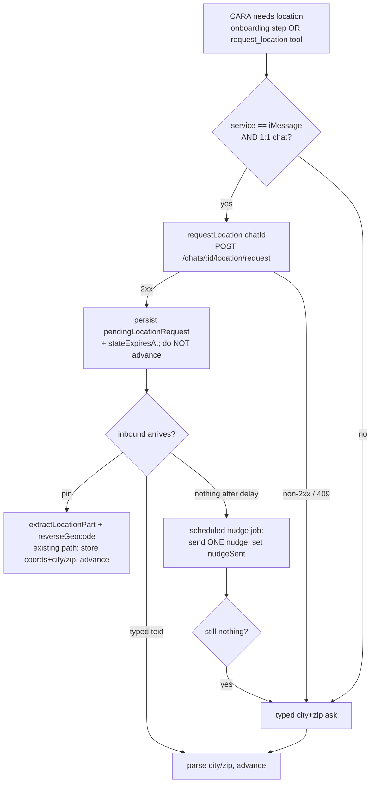

# feat: Native location request + SMS/RCS typed-zip fallback

## Summary

Make CARA *actively* request a user's location via Linq's native one-tap prompt
(`POST /chats/{chatId}/location/request`) when the chat is 1:1 iMessage, and fall
back to the existing typed city+zip ask on SMS, RCS, or group chats (where the
endpoint returns `409`). Expose the request both inside the onboarding location
step and as a new anytime MCP tool. If a user is prompted but no pin arrives, a
scheduled job sends exactly one nudge, then the typed-zip fallback takes over.

The inbound pin pipeline (`extractLocationPart` → `reverseGeocode`) is reused
unchanged — this plan only adds the *request* side plus its fallback orchestration.

---

## Problem Frame

Today CARA only *receives* location: a user taps ➕ → Share Location, Linq delivers
a pin, and `functions/src/utils/locationShare.ts` turns it into raw lat/lng + city/zip.
CARA never triggers the native share sheet — it only types "what city and zip code
are you in?" and parses the reply. The native prompt is far lower friction
(especially for older users) but works on 1:1 iMessage only; SMS/RCS/group return
`409`. We want CARA to use the native prompt where supported and degrade cleanly
everywhere else, without the user ever seeing a `409`.

See origin: `docs/brainstorms/2026-06-26-location-request-sms-rcs-fallback-requirements.md`.

---

## Requirements

- **R1.** On 1:1 iMessage, CARA's location ask triggers the native share sheet via
  `POST /chats/{chatId}/location/request`; the returned pin flows through the
  existing inbound handler with no new ingest code.
- **R2.** On SMS, RCS, or iMessage group chats, CARA never calls the request endpoint
  and falls back to the typed city+zip ask. No `409` is surfaced to the user.
- **R3.** A user prompted natively but silent receives exactly one nudge after a
  configurable delay, then the typed-zip fallback.
- **R4.** Both the onboarding location step and a new anytime MCP tool share one
  gate → request → fallback path.
- **R5.** Matching quality is unchanged for typed-zip users (city/zip proxy buckets
  stay valid); precise coords still unlock haversine matching when present.

---

## Key Technical Decisions

- **KTD1 — Gate on stored session `service`, not a fresh capability check.**
  `getOrCreateSession` already resolves and stores `service: LinqService`
  (`functions/src/linq/client.ts:30,82`) at chat creation. Read that plus a 1:1
  check before requesting; only `iMessage` + 1:1 calls the endpoint. Avoids an
  extra `capability/check_imessage` round-trip per request. Trade-off: `service`
  can go stale if a recipient switches devices — accepted, because a stale-iMessage
  request that `409`s is caught by KTD2 and falls back anyway, so the cost of a
  wrong guess is one harmless failed call, not a user-visible error. (see origin: Dependencies/Assumptions)
- **KTD2 — Treat any non-2xx from the request endpoint as "native unavailable" → fallback.**
  Detect via `(err as AxiosError)?.response?.status` (mirrors the `409`/code
  handling at `functions/src/linq/client.ts:606-614`). `409` is the documented
  SMS/RCS/group case but the handler must not depend on the exact code — any failure
  routes to the typed ask. The endpoint is treated as best-effort/fire-and-forget;
  the actual location returns asynchronously as an inbound pin.
- **KTD3 — Native request is async; the typed ask is the synchronous floor.**
  `requestLocation` only *sends* the prompt — the pin arrives later via the normal
  inbound webhook. So the onboarding step that fires a native request does NOT
  advance; it persists a pending-request marker and waits. The next inbound (pin OR
  typed text) resolves it through the existing handler branches.
- **KTD4 — One nudge via a scheduled job keyed on pending-request state + TTL.**
  Mirror `functions/src/scheduled/clientDayBeforeReminder.ts` and `shiftTaskNudges.ts`:
  a pubsub scheduled function scans `agent_sessions` for a pending location request
  older than the delay whose nudge flag is unset, sends one nudge, sets the flag.
  `stateExpiresAt` bounds the wait.

---

## High-Level Technical Design

Authoritative: the prose and unit specs below govern where they disagree with the diagram.

---

## Implementation Units

### U1. Add `requestLocation` to the Linq client

**Goal:** A single client method that POSTs the native location request and reports
success vs. native-unavailable.
**Requirements:** R1, R2 (KTD2)
**Dependencies:** none
**Files:**
- `functions/src/linq/client.ts` (add method)
- `functions/src/linq/client.protocol.test.ts` (extend) or new `functions/src/linq/__tests__/requestLocation.test.ts`
**Approach:** Mirror `sendMessage` (`functions/src/linq/client.ts:309-314`): `axios.post`
to `${cfg().baseUrl}/chats/${chatId}/location/request` with `headers()` and a timeout.
Return a discriminated result (e.g. `{ requested: true }` on 2xx, `{ requested: false, reason }`
on non-2xx) rather than throwing, so callers branch to fallback without try/catch noise.
Decide inside whether to wrap in `withRetry` — do NOT retry `409`/4xx (not transient);
5xx may retry per existing `withRetry` rules.
**Patterns to follow:** `sendMessage` POST shape; `createOrUpdateContactCard` error-code
inspection at `functions/src/linq/client.ts:606-614`.
**Test scenarios:**
- Happy path: 2xx response → returns `{ requested: true }`; asserts POST hit
  `/chats/{id}/location/request` with auth header.
- Covers R2. `409` response → returns `{ requested: false }`, does NOT throw, no retry.
- Error path: 5xx → follows existing retry policy; exhausted retry returns
  `{ requested: false }` (no throw to caller).
- Edge: missing/empty `chatId` → returns `{ requested: false }` without a network call.
**Verification:** Unit tests green; method never throws to its caller.

### U2. Shared protocol gate helper

**Goal:** One predicate deciding whether a session can use the native prompt.
**Requirements:** R1, R2, R4 (KTD1)
**Dependencies:** none
**Files:**
- `functions/src/utils/locationShare.ts` (add `canRequestNativeLocation(session)`), or a
  small new helper module if `locationShare.ts` should stay inbound-only — implementer's call
- matching `*.test.ts`
**Approach:** Pure function: `session.service === "iMessage"` AND chat is 1:1. Determine the
1:1 signal from the session/chat shape (e.g. handle count / `is_group`) discovered during
implementation; if no group signal exists on the session today, document that CareConnect
chats are effectively 1:1 and gate on `service` alone (see origin: Assumptions).
**Patterns to follow:** `LinqService` usage at `functions/src/linq/client.ts:30`.
**Test scenarios:**
- iMessage + 1:1 → true.
- RCS / SMS → false.
- iMessage + group (if group signal available) → false.
- Missing `service` → false (safe default to typed ask).
**Verification:** Unit tests green.

### U3. `request_location` MCP tool

**Goal:** Let CARA request location mid-conversation (anytime path, R4).
**Requirements:** R1, R2, R4
**Dependencies:** U1, U2
**Files:**
- `functions/src/mcp/server.ts` (add to `MCP_TOOLS` array + `executeToolCall` switch)
- `functions/src/mcp/__tests__/` (new test, mirror an existing tool test)
**Approach:** Define tool `request_location` in `MCP_TOOLS` with `input_schema` requiring
`phone`, `chatId`. Handler: validate inputs (`toolError("INVALID_INPUT", …)`), load session
from `agent_sessions/{phone}`, apply `canRequestNativeLocation` (U2). If allowed → call
`requestLocation` (U1); on `{ requested: true }` persist pending-request marker (U4 shape) and
return success indicating "native prompt sent, awaiting pin". If not allowed or
`{ requested: false }` → return a result that tells CARA to ask for typed city+zip (do not send
the text itself from the tool; let CARA phrase it).
**Patterns to follow:** `send_caregiver_message` and `find_replacement_caregivers` handlers in
`functions/src/mcp/server.ts`; `toolError` helper (~line 2029); merge-set on `agent_sessions`
as in `write_todos`.
**Test scenarios:**
- iMessage session → calls `requestLocation`, persists pending marker, returns native-sent result.
- Covers R2. SMS/RCS session → does NOT call `requestLocation`, returns typed-ask-needed result.
- `requestLocation` returns `{ requested: false }` (stale iMessage) → returns typed-ask-needed result.
- Error path: missing `phone`/`chatId` → `toolError("INVALID_INPUT", …)`.
- Integration: tool result shape is consumable by CARA's tool-result handling (matches sibling tools).
**Verification:** Tool registered, appears in tool list, tests green.

### U4. Onboarding location step: fire native request, persist pending state

**Goal:** The onboarding location step uses the gate; on iMessage it sends the native
prompt and waits instead of immediately asking for typed text.
**Requirements:** R1, R2, R3, R4 (KTD3)
**Dependencies:** U1, U2
**Files:**
- `functions/src/agents/onboardingConversation.ts` (`handleClientAskLocation` ~741-800,
  `handleCaregiverAskLocation` ~1287-1344)
- `functions/src/agents/__tests__/onboardingConversation.client.test.ts`,
  `functions/src/agents/__tests__/onboardingConversation.caregiver.test.ts`
**Approach:** On *entry* to the location step (first time, no `inboundLocation`, not a typed
answer): if `canRequestNativeLocation` → call `requestLocation` (U1). On success, send a short
"check your messages — tap to share" line, persist `pendingLocationRequest` on the session
(`{ step, sentAt, nudgeSent: false }`) plus `stateExpiresAt`, and DO NOT advance the step.
On failure or gate-false → existing typed ask unchanged. The existing `inboundLocation` branch
(reverse-geocode → advance) and the typed-text parse branch already handle resolution; ensure
both clear `pendingLocationRequest` when they advance.
**Execution note:** Add a failing test for the "iMessage entry sends native request and does
not advance" contract first — it pins the async-wait behavior that differs from today's
advance-immediately flow.
**Patterns to follow:** existing `inboundLocation` handling and `mergeOnboardingData` /
`updateSession` in the same handlers; `pendingClientShiftConfirm` pending-state shape in
`functions/src/scheduled/clientDayBeforeReminder.ts`.
**Test scenarios:**
- Covers R1. iMessage client at `client_ask_location`, first entry → calls `requestLocation`,
  persists `pendingLocationRequest`, step unchanged, no typed-ask text sent.
- Covers R2. SMS client → no `requestLocation` call, typed ask sent (today's behavior).
- Pin arrives while pending → reverse-geocode, store coords+city/zip, clear pending, advance
  (existing path still works).
- Typed "Austin, TX 78701" arrives while pending → parse, store, clear pending, advance.
- Stale iMessage: `requestLocation` returns `{ requested: false }` → typed ask sent, no pending marker.
- Caregiver variant mirrors all of the above at `caregiver_ask_location`.
**Verification:** Both onboarding test suites green; manual trace confirms no double-ask.

### U5. Scheduled one-nudge job

**Goal:** Send exactly one nudge to users with an unanswered pending location request, then
let typed fallback take over.
**Requirements:** R3 (KTD4)
**Dependencies:** U4
**Files:**
- `functions/src/scheduled/locationRequestNudge.ts` (new)
- `functions/src/index.ts` (export the function)
- `functions/src/scheduled/__tests__/locationRequestNudge.test.ts` (new)
**Approach:** Pubsub scheduled function (cron cadence TBD per Open Question — e.g. every 15 min).
Query `agent_sessions` for docs with `pendingLocationRequest` set, `nudgeSent !== true`, and
`sentAt` older than the configured delay. For each: send one nudge via the existing outbound
path (`sendViaInteractionAgent` as in `clientDayBeforeReminder.ts`) that gently re-prompts and
offers the typed-zip option, then set `pendingLocationRequest.nudgeSent = true`. Sessions whose
`stateExpiresAt` has passed are skipped/cleared (no second nudge).
**Patterns to follow:** `functions/src/scheduled/clientDayBeforeReminder.ts` (schedule + query +
mark-sent), `functions/src/scheduled/shiftTaskNudges.ts` (idempotent once-only flag, `stateExpiresAt`).
**Test scenarios:**
- Pending request older than delay, `nudgeSent` false → sends one nudge, sets `nudgeSent` true.
- Covers R3. Already-nudged session → no second nudge.
- Pending request newer than delay → no nudge yet.
- Expired `stateExpiresAt` → skipped, no nudge.
- Session that received a pin/typed answer (pending cleared) → not matched by query.
**Verification:** Test suite green; export present in `index.ts`; only one nudge per request proven.

---

## Scope Boundaries

**In scope**
- `requestLocation` client method + protocol gate.
- `request_location` MCP tool.
- Onboarding location step native-request + pending-state wiring.
- One scheduled nudge before typed fallback.

**Out of scope (origin)**
- Hosted GPS web link or any new SMS precision mechanism (rejected — smishing risk, carrying cost).
- Changing matching to require precise coords — city/zip proxy stays valid.

### Deferred to Follow-Up Work
- Inbound pin parsing / reverse-geocode changes — already built, untouched here.
- Tuning the nudge copy and cadence after observing onboarding drop-off.

---

## Open Questions

- **Nudge delay duration** (minutes vs. hours) and scheduled-job cadence — tune to onboarding
  drop-off data; pick a starting value at implementation (suggest ~10–15 min delay, 15-min cron).
- **1:1 signal source** — confirm during implementation whether the session/chat carries a
  group flag; if not, gate on `service` alone and document the 1:1 assumption.
- **Anytime-tool fallback phrasing** — whether `request_location` returns "ask for typed zip"
  as a flag for CARA to phrase, vs. CARA deciding from the result. Lean: return a flag, CARA phrases.

---

## Risks & Dependencies

- **Stale `service` (KTD1):** a device switch could make a stored-iMessage session `409`.
  Mitigated by KTD2 fallback — worst case is one harmless failed call.
- **Async resolution (KTD3):** the onboarding step no longer advances on entry for iMessage;
  a bug that fails to clear `pendingLocationRequest` could strand a user. U4 + U5 tests cover
  both clear-paths and the expiry skip.
- **Linq request payload shape unconfirmed:** exact request body / non-2xx code for the endpoint
  to be verified against `/api/resources/chats/subresources/location/` during U1.

---

## Sources & Research

- Origin requirements: `docs/brainstorms/2026-06-26-location-request-sms-rcs-fallback-requirements.md`
- Linq client pattern: `functions/src/linq/client.ts` (`sendMessage` 309-314, error handling 606-614, `LinqService` 30)
- MCP tool pattern: `functions/src/mcp/server.ts` (`MCP_TOOLS`, `executeToolCall`, `toolError`)
- Scheduled-nudge precedent: `functions/src/scheduled/clientDayBeforeReminder.ts`, `functions/src/scheduled/shiftTaskNudges.ts`
- Onboarding step: `functions/src/agents/onboardingConversation.ts` (`handleClientAskLocation`, `handleCaregiverAskLocation`)
- Inbound pipeline (reused): `functions/src/utils/locationShare.ts`, `functions/src/linq/webhooks.ts:483-500,1383-1387`
- Linq docs: `/api/resources/chats/subresources/location/`, `/guides/location-sharing/`, `/guides/messaging/protocol-selection/`
