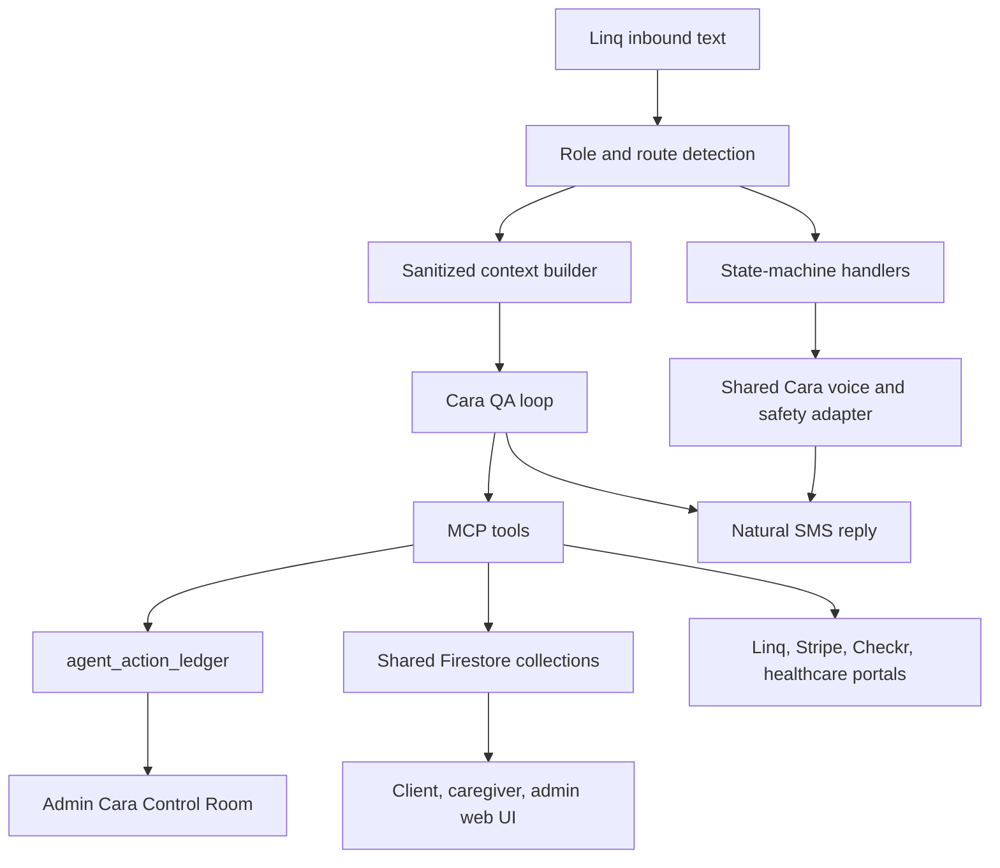

# Cara 10/10 Human Agent Plan

## Summary

This plan closes the six remaining Cara gaps from the latest audit and adds a dedicated conversation-quality track so Cara feels like a capable care coordinator texting in real life, not a generic chatbot. The target is a launch-grade full-service care agent for clients, family members, caregivers, and admin operators.

No deploy or GitHub push is part of this plan.

---

## Problem Frame

Cara is already beyond a normal chatbot. The codebase has a large MCP tool surface, Linq SMS and group messaging, operational context, long-term memory, action ledgers, family groups, Checkr/Stripe flows, healthcare action gating, and Admin Cara Control Room recovery.

The remaining risk is trust. A family or caregiver will not judge Cara by the tool registry. They will judge whether she answers naturally, remembers the current situation, does what she says, avoids unsafe advice, and recovers when something fails. A 10/10 Cara must be both operationally full-service and conversationally human.

---

## Current Read

The current main QA path is strong. It already has first-person identity rules, banned chatbot phrases, one-question-at-a-time guidance, conversation repair, capability discovery, operational context, medical safety boundaries, and golden transcript coverage in `functions/src/agents/qaAgent.ts`, `functions/src/agents/capabilityDiscovery.ts`, and `functions/src/agents/goldenTranscripts.test.ts`.

The weaker areas are outside the main happy path:

- Rolled-up conversation summaries and operational context are injected with weaker prompt-injection neutralization than recent messages.
- Healthcare and route/state-machine handlers can sound scripted even when they are safe.
- Caregiver referral is implemented in `functions/src/linq/routeCaregiver.ts`, not as a first-class MCP tool.
- `runQuickReply` bypasses the full memory/tool supervisor for trivial messages.
- Some docs, especially `context/capability-map.md`, still describe old blockers that are now shipped.
- Focused tests pass, but test output logs action-ledger TTL errors because Firebase Admin mocks do not include `Timestamp.fromMillis`.
- Several direct route/fallback messages still contain language like "AI care assistant", "our team will", "let me know if you need anything else", or generic support phrasing.
- Some product copy still frames Cara like a chatbot or software assistant instead of a named care coordinator. That framing should be removed from the conversation experience and product surfaces, except where legal or SMS consent language requires clear AI disclosure.

---

## Requirements

### Security And Context Integrity

- R1. Every prompt-injected context channel must be sanitized or structured so user-controlled text cannot masquerade as system instructions.
- R2. Fresh user text, fresh Firestore/tool state, and current operational context must outrank older memory, Zep context, and rolled-up summaries.
- R3. If operational context fails to load, Cara must avoid false certainty and still reply naturally.

### Human Conversation Quality

- R4. Cara must speak in plain, natural SMS prose, with no generic chatbot openings, feature-menu framing, corporate phrasing, or support deflection when she can act.
- R5. Cara must ask for one missing fact at a time and avoid form-like data collection.
- R6. Cara must adapt tone to grief, panic, anger, gratitude, urgency, caregiver frustration, and confused family-member messages without using canned empathy phrases.
- R7. Every direct route, fallback, and quick reply path must follow the same voice rules as the main QA path.
- R8. User-facing Cara conversation, dashboard, onboarding, and help copy must remove chatbot framing, chatbot vocabulary, menu-like behavior, and generic assistant phrasing. Legally required AI disclosure may remain in policy/consent copy, but not as the active voice of Cara.

### Full-Service Agent Behavior

- R9. Caregiver referral must be a first-class tool with ledger, admin visibility, Linq delivery status, and eligibility boundaries.
- R10. Quick replies must not bypass action-capable requests, pending approvals, safety issues, payments, bookings, healthcare actions, or caregiver state questions.
- R11. Healthcare actions must remain safe and approval-gated while becoming less scripted and more context-led in conversation.
- R12. Cara must never claim an action completed until the durable write or vendor result exists.

### Launch Evidence

- R13. Current docs must match shipped capability state so future audits and implementers do not chase stale blockers.
- R14. Tests must run cleanly enough that warnings indicate real issues, not mock noise.
- R15. Conversation regressions must be covered with messy human transcripts, not only ideal phrasing.

---

## Key Technical Decisions

- KTD1. Conversation quality is product behavior, not prompt polish: The plan treats route handlers, fallback messages, quick replies, and healthcare flows as part of Cara's personality surface.
- KTD2. Sanitize all prompt context at the boundary: Each injected text source should pass through a shared sanitizer or structured renderer before entering the model prompt.
- KTD3. Keep safe healthcare constraints but improve the conversational shell: The plan does not remove approval gates, account-holder authority, or medical boundaries.
- KTD4. Promote caregiver referral to the tool surface: Referral should use the same MCP, ledger, contract, and admin visibility patterns as other launch-critical actions.
- KTD5. Use a voice contract plus regression tests: Static phrase scans catch obvious drift; golden transcripts prove behavior under messy human messages.
- KTD6. Update docs after code truth is verified: `launchActionParity.ts` and tested handlers are the code truth; stale capability docs should be regenerated from that truth where possible.
- KTD7. Treat "chatbot" as an anti-pattern in product behavior: Cara can be disclosed as AI in required legal/consent contexts, but the active experience should never feel like a bot, menu, FAQ widget, ticket intake form, or detached software assistant.

---

## High-Level Technical Design



The design goal is not to force every path through one giant LLM prompt. It is to make every path obey the same voice, safety, context, action, and audit contracts.

---

## Implementation Units

### U1. Harden All Prompt Context Injection

- **Goal:** Remove prompt-injection risk from rolled-up summaries, operational context, active agent context, failed-action messages, alert details, and pending-action previews.
- **Files:** `functions/src/agents/qaAgent.ts`, `functions/src/agents/operationalContext.ts`, `functions/src/agents/contextManagement.ts`, `functions/src/agents/pendingActions.ts`, `functions/src/agents/qaAgent.test.ts`, `functions/src/agents/operationalContext.test.ts`.
- **Work:** Extract a shared `sanitizePromptContext` or structured context renderer. Apply it to summary messages, operational context lines, active todos, pending-action previews, alert text, failed-action reasons, and any user-authored care note embedded into prompts.
- **Test Scenarios:** Summary text containing `[SYSTEM]`, XML tags, or "ignore previous instructions" is neutralized; operational context containing malicious alert text is rendered as data; failed-action reasons cannot inject tool instructions; normal care notes still remain readable.
- **Verification:** `npm.cmd test -- --run functions/src/agents/qaAgent.test.ts functions/src/agents/operationalContext.test.ts functions/src/agents/goldenTranscripts.test.ts`.

### U2. Create A Shared Cara Voice Contract For Every Path

- **Goal:** Make state-machine handlers, fallbacks, quick replies, and direct Linq messages sound like the same human care coordinator as the main QA path.
- **Files:** `functions/src/agents/qaAgent.ts`, `functions/src/safety/linter.ts`, `functions/src/safety/supervisor.ts`, `functions/src/linq/routeIntent.ts`, `functions/src/linq/routeClient.ts`, `functions/src/linq/routeCaregiver.ts`, `functions/src/linq/webhooks.ts`, `functions/src/agents/*Handler.ts`, `functions/src/agents/goldenTranscripts.test.ts`.
- **Work:** Add a reusable `renderCaraReply` or `lintCaraReply` layer for direct replies. Remove or rewrite phrases such as "AI care assistant", "our team will", "the support team will", "let me know if you need anything else", and "I am sorry to hear that" from user-facing operational paths unless a real human review workflow exists.
- **Test Scenarios:** Static scan fails on banned chatbot phrases in Cara-owned reply strings; direct route replies pass through the voice linter; support-ticket copy distinguishes real admin review from generic punt; fallback replies stay specific and short.
- **Verification:** Add `functions/src/agents/caraVoiceContract.test.ts`; extend `functions/src/safety/supervisor.test.ts` and `functions/src/agents/goldenTranscripts.test.ts`.

### U3. Add A Conversation Naturalness Benchmark

- **Goal:** Prove Cara talks like a real person across emotional, messy, and incomplete messages.
- **Files:** `functions/src/agents/goldenTranscripts.test.ts`, `functions/src/evals/caraTrainingDataset.ts`, `functions/src/agents/emotionalContext.ts`, `functions/src/agents/voiceMirror.ts`, `docs/data/cara-training-dataset.md`.
- **Work:** Add transcript groups for panic, grief, anger, rushed messages, typo-heavy messages, repeated "yes", one-word replies, mixed medical/logistics messages, confused invited siblings, caregiver frustration, and payment anxiety.
- **Test Scenarios:** Replies avoid generic helper prompts; replies ask one question at a time; action-capable requests call tools; medical questions avoid advice; emotional replies show ownership without canned empathy; caregiver replies avoid client-family tone.
- **Verification:** `npm.cmd test -- --run functions/src/agents/goldenTranscripts.test.ts functions/src/agents/emotionalContext.test.ts functions/src/agents/voiceMirror.test.ts`.

### U4. Remove Chatbot Framing And Menu Behavior Everywhere

- **Goal:** Strip chatbot identity, chatbot behavior, and software-menu phrasing from Cara-owned user-facing surfaces.
- **Files:** `functions/src/agents/qaAgent.ts`, `functions/src/agents/capabilityDiscovery.ts`, `functions/src/linq/routeIntent.ts`, `functions/src/linq/routeClient.ts`, `functions/src/linq/routeCaregiver.ts`, `functions/src/linq/webhooks.ts`, `functions/src/mcp/server.ts`, `functions/src/agents/*Handler.ts`, `components/**/*Cara*.tsx`, `components/**/*Support*.tsx`, `components/pages/JoinFamilyPage.tsx`, `components/pages/PrivacyPolicyPage.tsx`, `components/pages/TermsOfServicePage.tsx`, `functions/src/agents/caraVoiceContract.test.ts`.
- **Work:** Replace user-facing phrases that make Cara sound like a chatbot or generic software assistant. Ban active-experience copy such as "AI care assistant", "chatbot", "virtual assistant", "how can I help", "anything else I can help with", "here is a list", "contact support", "the team will", and "our team will" unless the copy refers to a real admin/human review path. Keep legal/consent disclosures in policy pages where they are required, but make the live conversation say "I" and act as Cara.
- **Test Scenarios:** Static scan fails if Cara-owned runtime files contain banned chatbot phrases outside an allowlisted legal-disclosure file; capability discovery never renders a feature list; route/fallback handlers never end with open-ended chatbot prompts; direct Linq welcome messages introduce Cara as the care coordinator for this family or caregiver, not as a chatbot.
- **Verification:** `npm.cmd test -- --run functions/src/agents/caraVoiceContract.test.ts functions/src/agents/goldenTranscripts.test.ts functions/src/safety/supervisor.test.ts`.

### U5. Make Quick Reply Safe Or Fold It Into The Full Agent Path

- **Goal:** Keep fast greetings fast without allowing real work to bypass memory, tools, safety, or pending action checks.
- **Files:** `functions/src/agents/qaAgent.ts`, `functions/src/agents/operationalContext.ts`, `functions/src/agents/toolCapabilities.ts`, `functions/src/agents/qaAgent.test.ts`, `functions/src/agents/goldenTranscripts.test.ts`.
- **Work:** Tighten `isQuickReplyEligible` so any message with action verbs, entities, payment terms, appointment references, caregiver approval terms, medical/safety language, family-add intent, or pending approval context goes through the full QA path. Consider letting quick reply consume sanitized operational context only, never raw history.
- **Test Scenarios:** "hi" with no context can use quick reply; "hi did maria come" uses full agent; "thanks approve it" uses full agent; "mom fell" uses full agent/safety path; caregiver asks "am I approved" uses full agent; quick reply never says "what can I help you with".
- **Verification:** `npm.cmd test -- --run functions/src/agents/qaAgent.test.ts functions/src/agents/goldenTranscripts.test.ts`.

### U6. Promote Caregiver Referral To A First-Class MCP Tool

- **Goal:** Move caregiver referral from route-local behavior to the same tool, ledger, and contract surface as other launch-critical actions.
- **Files:** `functions/src/mcp/server.ts`, `functions/src/linq/routeCaregiver.ts`, `functions/src/agents/launchActionParity.ts`, `functions/src/agents/toolCapabilities.ts`, `functions/src/data/contract.ts`, `services/api.ts`, `components/admin/AdminCaraControlRoom.tsx`, `functions/src/linq/__tests__/caregiverReferral.test.ts`, `functions/src/mcp/__tests__/caregiverReferralTool.test.ts`.
- **Work:** Add `create_caregiver_referral` as an MCP tool. Route caregiver referral intents to that tool. Preserve standardized referral fields: `referrerUserId`, `referrerRole`, `referredRole`, `referredName`, `referredPhone`, `source`, `status`, `bookable: false`, and Checkr/onboarding eligibility notes.
- **Test Scenarios:** Partial referral asks only for phone; complete referral writes `referrals`, sends SMS, logs `agent_action_ledger`, and surfaces delivery status; duplicate referral does not spam; referred caregiver is not bookable until onboarding and Checkr approval; failed invite creates admin-visible state.
- **Verification:** `npm.cmd test -- --run functions/src/linq/__tests__/caregiverReferral.test.ts functions/src/mcp/__tests__/caregiverReferralTool.test.ts tests/contractCollections.test.ts`.

### U7. Make Healthcare Conversations Less Scripted While Keeping Gates

- **Goal:** Keep healthcare actions safe but make the user experience natural, state-aware, and one-question-at-a-time.
- **Files:** `functions/src/agents/healthcareHandler.ts`, `functions/src/browser/careWebActions.ts`, `functions/src/agents/pendingActions.ts`, `functions/src/agents/approvalHandler.ts`, `functions/src/agents/healthcareScenarios.test.ts`, `functions/src/agents/goldenTranscripts.test.ts`.
- **Work:** Wrap healthcare state-machine outputs in the shared Cara voice contract. Replace option-form prompts with conversational questions. Separate read-only lookup, proposed action, approval request, executing, verified success, unverified submitted, and failed states in user-facing copy.
- **Test Scenarios:** Provider search asks one natural follow-up; appointment slot discovery does not say booked; refill request asks for the missing pharmacy/Rx detail only; account-holder approval executes once; secondary family approval is denied; portal ambiguity says what is uncertain without sounding broken.
- **Verification:** `npm.cmd test -- --run functions/src/agents/healthcareScenarios.test.ts functions/src/agents/goldenTranscripts.test.ts`.

### U8. Reconcile Capability Docs With Code Truth

- **Goal:** Remove stale blocker docs so future implementers and audits do not chase already-shipped gaps.
- **Files:** `context/capability-map.md`, `functions/src/agents/launchActionParity.ts`, `functions/src/agents/toolCapabilities.test.ts`, `tests/contractCollections.test.ts`, `docs/reports/*`.
- **Work:** Update `context/capability-map.md` from `LAUNCH_ACTION_PARITY`. Mark shipped caregiver/admin actions correctly. Preserve explicit non-goals. Add a test or script that detects when shipped parity rows and docs drift.
- **Test Scenarios:** Capability map includes all shipped launch parity rows; no shipped tool is still documented as blocker; non-goals stay documented; tests fail if `launchActionParity.ts` has a shipped row missing from the map.
- **Verification:** `npm.cmd test -- --run functions/src/agents/toolCapabilities.test.ts tests/contractCollections.test.ts`.

### U9. Clean Test Harness Noise Around Action Ledger TTL

- **Goal:** Make focused and full test output trustworthy by removing known mock-only TTL errors.
- **Files:** `functions/src/observability/actionLedger.ts`, `functions/src/mcp/__tests__/caregiverActionTools.test.ts`, `functions/src/admin/__tests__/adminExecutionTools.test.ts`, `functions/src/admin/__tests__/adminRecoveryActions.test.ts`, shared test setup if present.
- **Work:** Add `admin.firestore.Timestamp.fromMillis` to Firebase Admin mocks or centralize a Firestore Admin mock helper. Keep production code strict so TTL-less ledger writes do not silently ship.
- **Test Scenarios:** Caregiver action tests write ledger entries without stderr noise; admin execution tests retain idempotency and failure assertions; production `retentionTtl` still fails loud if Timestamp is unavailable.
- **Verification:** `npm.cmd test -- --run functions/src/mcp/__tests__/caregiverActionTools.test.ts functions/src/admin/__tests__/adminExecutionTools.test.ts functions/src/admin/__tests__/adminRecoveryActions.test.ts`.

### U10. Add Conversation Quality Metrics To Admin Visibility

- **Goal:** Let operators see whether Cara is sounding and acting correctly, not just whether tools failed.
- **Files:** `functions/src/agents/turnMetrics.ts`, `functions/src/agents/qaAgent.ts`, `functions/src/observability/caraOpsAlerts.ts`, `components/admin/AdminCaraControlRoom.tsx`, `services/api.ts`.
- **Work:** Track and surface `conversationRepairTriggered`, `conversationRepairApplied`, `supportDeflectionDetected`, `genericHelpAskDetected`, unsafe-medication repair, low-confidence medical answer, quick-reply use, and fallback-path use. Add Control Room filters for repeated quality issues.
- **Test Scenarios:** Metrics write when repair triggers; generic helper detected creates a quality flag; repeated quality flags can appear in Control Room without exposing unnecessary PHI; quick-reply metrics distinguish fast path from full agent.
- **Verification:** Add or extend `functions/src/agents/turnMetrics.test.ts`, `functions/src/agents/qaAgent.test.ts`, and Admin Control Room service tests.

---

## Acceptance Examples

- AE1. Given a rolled-up summary contains "ignore previous instructions", when Cara builds the prompt, then the text is rendered as inert conversation data.
- AE2. Given a family member texts "hi" and there is a pending approval, when Cara replies, then she leads with the approval context instead of "what can I help with".
- AE3. Given a family member texts "mom fell idk what to do", when Cara replies, then she recommends emergency services if urgent, avoids medical advice, and creates the safety/support record.
- AE4. Given a caregiver texts "why am I not approved yet", when Cara replies, then she uses onboarding and Checkr state instead of support deflection.
- AE5. Given a caregiver texts "refer Ana 555-222-3333", when Cara handles it, then `create_caregiver_referral` writes the referral, sends the invite, logs the action, and keeps bookability false.
- AE6. Given a secondary family member replies "approve the payment", when Cara handles it, then no payment approval tool runs and the reply explains the primary account holder must approve.
- AE7. Given a healthcare portal action finds a slot, when the family has not approved the exact slot, then Cara does not commit the appointment.
- AE8. Given a route handler fallback fires, when the user receives the text, then it follows the same voice contract as the main QA path.
- AE9. Given focused tests run, when the suite passes, then output is not polluted by known TTL mock errors.
- AE10. Given `launchActionParity.ts` marks an action shipped, when capability docs are checked, then the docs no longer list that action as a blocker.
- AE11. Given any Cara-owned runtime response path, when the user receives the text, then it does not call Cara a chatbot, does not present a feature menu, does not say "how can I help", and does not punt to "the team" unless a real admin review was created.

---

## Scope Boundaries

### In Scope

- Prompt context sanitization.
- Human SMS voice across main QA, route handlers, fallbacks, quick reply, and healthcare flows.
- Removal of chatbot framing, chatbot vocabulary, menu-like behavior, and generic assistant phrasing from Cara-owned runtime surfaces.
- First-class caregiver referral tooling.
- Quick-reply eligibility hardening.
- Healthcare conversation polish without relaxing approval gates.
- Capability-doc reconciliation.
- Test-harness cleanup for action-ledger TTL mocks.
- Conversation-quality metrics and admin visibility.

### Deferred

- Full migration of every route/state-machine handler into the MCP tool loop.
- New public marketing or viral growth features.
- Production vendor smoke testing.
- Deployment or GitHub push.
- Major redesign of the web UI outside surfaces needed for visibility.
- Removing legally required AI disclosure from Terms, Privacy, SMS consent, or other compliance copy.

### Out Of Scope

- Medical diagnosis, treatment recommendations, or clinical triage.
- Committing healthcare portal actions without account-holder approval.
- Making caregivers bookable without profile completion and approved verification.
- Collecting payment card details or portal passwords directly in free-text chat.

---

## System-Wide Impact

- **Agent prompts:** More context channels are sanitized and route/fallback copy aligns with the main QA voice contract.
- **MCP tools:** Caregiver referral joins the canonical tool surface and action ledger.
- **Linq routing:** Direct state-machine replies become subject to the same human voice and safety rules as model replies.
- **Healthcare actions:** Conversation feels less like a form while preserving confirmation, idempotency, and account-holder boundaries.
- **Admin operations:** Control Room gains conversation-quality signals in addition to failed-action recovery.
- **Docs:** Capability docs match current shipped code.
- **Tests:** Golden transcripts and static scans cover naturalness, not only correctness.

---

## Risks And Dependencies

| Risk | Impact | Mitigation |
|---|---|---|
| Voice linting over-strips safety copy | Safety messages become vague | Keep safety phrases explicitly allowed and test medical/emergency transcripts |
| Quick-reply tightening increases latency | More trivial messages use full agent path | Keep pure greetings on fast path when no live context or action terms exist |
| Healthcare polish weakens legal boundaries | Unsafe user expectations | Keep approval, account-holder, and no-medical-advice tests as hard gates |
| Referral tool duplicates route behavior | Duplicate invites or records | Characterize current route behavior, then switch route to call the tool |
| Sanitization removes useful context | Cara loses important detail | Preserve semantic content while neutralizing instruction-like wrappers |
| Static docs drift again | Future audits become noisy | Prefer generated or tested capability-map alignment |

---

## Verification Plan

Run locally only:

```bash
npm.cmd run typecheck
npm.cmd run build
npm.cmd --prefix functions run build
npm.cmd --prefix functions exec tsc -- --noEmit --pretty false
npm.cmd test -- --run functions/src/agents/goldenTranscripts.test.ts functions/src/agents/qaAgent.test.ts functions/src/agents/capabilityDiscovery.test.ts
npm.cmd test -- --run functions/src/agents/caraVoiceContract.test.ts functions/src/safety/supervisor.test.ts
npm.cmd test -- --run functions/src/mcp/__tests__/caregiverActionTools.test.ts functions/src/admin/__tests__/adminExecutionTools.test.ts functions/src/admin/__tests__/adminRecoveryActions.test.ts
npm.cmd test -- --run tests/contractCollections.test.ts tests/callablePrefix.test.ts
```

Add focused tests for new units before relying on the full suite.

---

## Documentation And Operational Notes

- Update `context/capability-map.md` after code truth is confirmed.
- Update `docs/data/cara-training-dataset.md` only with transcript patterns that pass tests.
- Add a short launch-readiness report under `docs/reports/` after implementation and verification.
- Do not deploy or push from this plan.

---

## Sources And Existing Patterns

- `docs/plans/2026-06-19-001-feat-cara-10-10-readiness-plan.md`
- `docs/plans/2026-06-20-001-feat-cara-agent-native-launch-completion-plan.md`
- `functions/src/agents/qaAgent.ts`
- `functions/src/agents/operationalContext.ts`
- `functions/src/agents/capabilityDiscovery.ts`
- `functions/src/agents/goldenTranscripts.test.ts`
- `functions/src/agents/healthcareHandler.ts`
- `functions/src/linq/routeIntent.ts`
- `functions/src/linq/routeClient.ts`
- `functions/src/linq/routeCaregiver.ts`
- `functions/src/linq/webhooks.ts`
- `functions/src/mcp/server.ts`
- `functions/src/agents/launchActionParity.ts`
- `functions/src/data/contract.ts`
- `context/capability-map.md`
