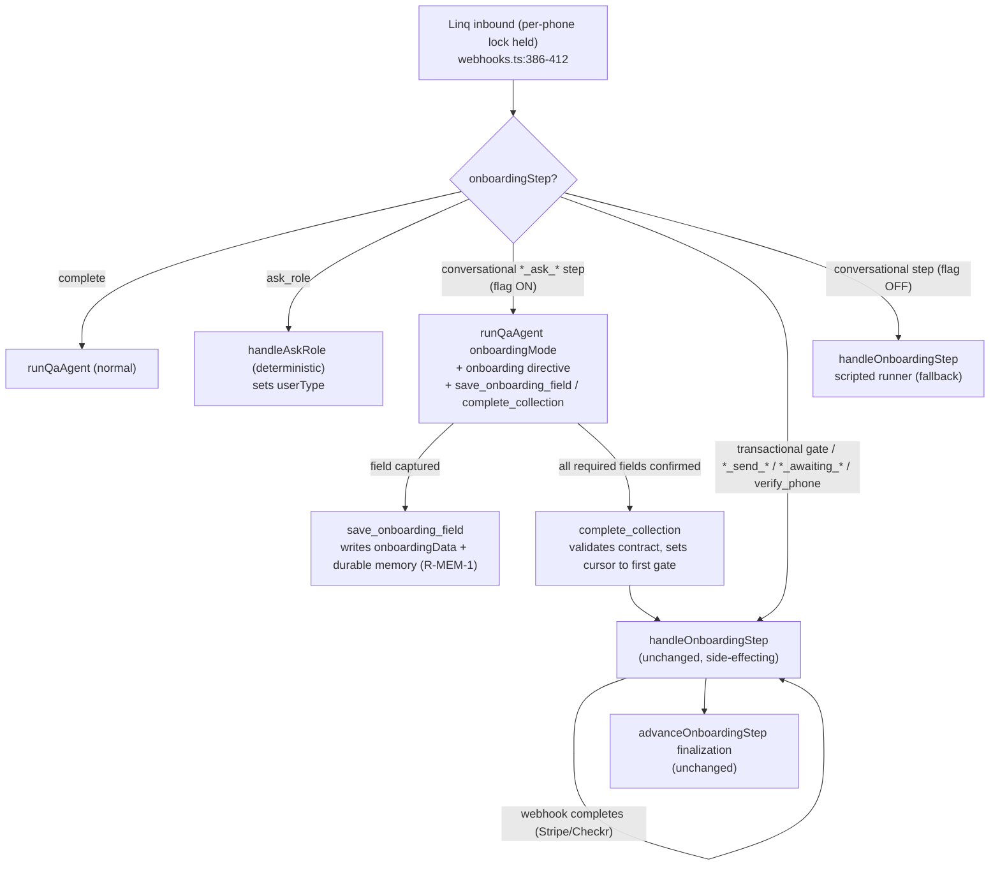

# feat: Agent-native onboarding — conversational collapse

## Summary

Move Cara's onboarding **field-collection** out of the scripted state-machine runner and
into the `qaAgent` Sonnet loop, for both client and caregiver flows, so onboarding is
driven by one agent that sees the whole conversation — picks what to ask next, saves each
field as a tool call, never re-greets, never double-sends, and tells a little story while it
collects. The **transactional gates** (OTP, payment, Checkr, Stripe Connect, photo/doc
upload, account creation, finalization) stay exactly as they are — deterministic, gated,
side-effecting code — and Cara hands off to them and narrates them in her own voice.

This is the "conversational collapse" scope confirmed with the user, not full collapse.
It deliberately stays inside the boundary set by KTD-2 / KTD-6 / the routing-convergence
spike: **onboarding side-effects never run in the agent loop** (see origin and
`docs/plans/2026-06-24-001-feat-cara-100-agent-native-plan.md`).

Everything ships behind a new flag (`ONBOARDING_AGENT_LOOP`, default OFF) and a real-model
eval gate, because the existing prompt-dispatcher flip went LIVE without the eval its plan
required (`context/progress-tracker.md:69`) — we do not repeat that.

---

## Problem Frame

Cara is two systems (see origin): the agentic QA loop (human, memory-aware, voice-linted)
and the legacy scripted onboarding runner. The user's reported symptoms — robotic feel,
re-greeting, re-asking — all live in the scripted runner. Confirmed in production
(screenshot, this session) and root-caused to specific code:

- **Double greeting / double-send.** `conversationStep.ts:115-119` (`runStep`) always sends
  `answerMidFlow(...)` **plus** `reask(...)` as two messages when a reply is tagged a
  question.
- **Context-blind generic bot.** `stepHandler.ts:34-42` (`answerMidFlow`) gets only the raw
  text, with a system prompt literally framing Cara as "AI care assistant" → re-greets
  ("Hi Imran!"), deflects ("I'm here to help!"), and **bypasses the voice linter**.
- **Misfire on terse answers.** `stepHandler.ts:18-30` (`isQuestionOrOther`) tags real
  answers like "My mom" as questions → routes them to the bot above instead of parsing.
- **Form-march.** One field per cursor step in a fixed order; even the warm generated lines
  read as an interrogation, and parse wobble drops to bare fallbacks
  (`onboardingSteps.client.ts:58,86,120`).
- **Memory starts too late.** Durable memory bootstraps at `onboardingStep === "complete"`
  (`onboardingConversation.ts` ~line 2648), so an interrupted onboarding resumes cold.

Routing onboarding's *output* through a voice veneer (the unshipped
`docs/plans/2026-06-27-001-feat-cara-10-10-human-agent-plan.md`) makes it *sound* better but
keeps the runner that produces double-sends and re-asks. Collapsing field-collection into
the agent loop removes the runner entirely for that phase, which is the only structural fix.

---

## Requirements

Traceability back to origin (`docs/brainstorms/2026-06-28-cara-care-coordinator-requirements.md`):

- **R1 (origin R-VOICE-3).** Field-collection must feel like a person leading a
  conversation: one missing fact at a time, acknowledge before asking, absorb volunteered
  fields without re-asking, no form-march. Achieved by the loop, not by step scripts.
- **R2 (origin R-VOICE-1/2).** Every onboarding message goes through the same voice layer
  (`safety/linter.ts` + `supervise()`) the QA loop already uses; no "AI care assistant"
  framing, no raw chatbot phrases. The scripted `answerMidFlow` path is removed from the
  collection phase.
- **R3.** No double-send and no re-greeting within a turn. One coherent reply per inbound.
- **R4 (origin R-CTX-1/2).** Collection runs with memory recall and supervision on-path;
  fresh user text outranks older memory.
- **R5 (origin R-MEM-1/2).** Durable per-person memory begins at name + number (the first
  saved field), and resume is driven by what's known, not by the step cursor.
- **R6.** Transactional gates and all side-effects remain deterministic and unchanged; the
  agent hands off to them and narrates them but never executes them in-loop. (Honors
  KTD-2 / KTD-6 / spike.)
- **R7.** Required fields are guaranteed collected before handoff — the loop cannot advance
  to a gate with missing required data.
- **R8.** Ships behind `ONBOARDING_AGENT_LOOP` (default OFF) with a real-model eval gate,
  shadow, then canary — no big-bang on the sole signup path. (Closes the
  `progress-tracker.md:69` eval gap.)
- **R9.** Both client and caregiver collection phases are covered.

Success criteria: the screenshot scenario ("Hey Cara" → "My mom") produces one warm,
non-repeating reply that advances collection; messy-human golden transcripts pass; signup
completion rate and latency stay within agreed bounds under canary.

---

## Scope Boundaries

**In scope:** client and caregiver conversational field-collection moved into the
`qaAgent` loop; two new MCP tools; an onboarding system-prompt directive; a routing split;
early durable-memory bootstrap; flag + eval + metrics.

**Out of scope — deferred for later (from origin):**
- Full collapse of side-effect steps into the loop (payment, OTP, Checkr, Stripe Connect,
  uploads). Explicitly excluded by KTD-2 / KTD-6 / the spike; would require converting ~60
  direct calls to gated MCP tools + onboarding dry-run isolation first.
- Loud secret health check (origin R-OPS-1) — separate, tracked independently.
- The 06-27 voice-veneer work for the *other* scripted paths (route handlers, quick
  replies) — complementary, not part of this plan.

**Deferred to follow-up work (plan-local):**
- Deleting the now-bypassed scripted collection handlers (`handleClientAsk*`,
  `handleCaregiverAsk*`, `conversationStep.runStep`, `stepHandler.answerMidFlow`). Kept as
  flag-off fallback until canary proves the loop; removed in a later cleanup PR.

---

## Key Technical Decisions

- **KTD1. Reuse the QA loop, don't fork it.** Add an onboarding mode to `runQaAgent`
  (`functions/src/agents/qaAgent.ts:946`) rather than building a parallel loop. Same
  Sonnet loop, same supervisor, same linter, same memory spine — that reuse *is* the fix.
- **KTD2. Field-collection in-loop; gates stay deterministic.** The boundary is the
  side-effect. Collection (names, needs, schedule, prefs, budget / caregiver profile
  fields) is pure conversation → loop. The first transactional step is the handoff line.
- **KTD3. Two new MCP tools as the only onboarding mutations.** `save_onboarding_field`
  and `complete_collection`. They are the loop's sole write surface during onboarding,
  which keeps the existing `shadowMode`/`READ_ONLY_TOOLS` isolation meaningful and the
  irreversible side-effects out of the loop's reach.
- **KTD4. Reuse the existing field contract.** `CLIENT_STEP_FIELD` / `CLIENT_STEP_ORDER`
  and the caregiver equivalent (`functions/src/agents/onboardingDispatcher.ts`,
  `onboardingConversation.ts`) define required fields and "what's still missing." The
  directive and `complete_collection`'s gate read the same contract — one source of truth.
- **KTD5. Restrict the tool surface during onboarding.** In onboarding mode the loop is
  offered only `save_onboarding_field`, `complete_collection`, and `complete_task` — not
  the 88-tool surface — so it stays focused and fast.
- **KTD6. New flag, eval-gated, never big-bang.** `ONBOARDING_AGENT_LOOP` is independent of
  the existing `CONVERGENCE_FLIPPED`. Real-model eval + shadow + canary precede flip,
  per the launch-safety doctrine and to close the unvalidated-flip gap.
- **KTD7. Latency is a measured risk, not an assumption.** Collection on Sonnet is slower
  than the gpt-4o-mini dispatcher (KTD-7 invariant). Collection is few-turn; we measure
  per-turn latency and signup-completion under canary and roll back via flag if it regresses.

---

## High-Level Technical Design

Routing split and the collection-loop ↔ gate handoff:

State of a turn in onboarding mode (parallels the PROFILE REVIEW MODE pattern at
`qaAgent.ts:1372-1386`): build base system prompt → append onboarding directive (missing-
field checklist + voice rules) → offer onboarding tool subset → Sonnet collects/saves →
when contract satisfied, `complete_collection` hands the cursor to the first gate.

---

## Implementation Units

### U1. Onboarding MCP tools: `save_onboarding_field` + `complete_collection`

**Goal:** Give the loop its only two onboarding write actions.
**Requirements:** R1, R5, R7.
**Dependencies:** none.
**Files:**
- `functions/src/mcp/server.ts` (tool defs in `MCP_TOOLS`; cases in `executeToolCall`)
- `functions/src/mcp/__tests__/onboardingTools.test.ts` (create)
**Approach:**
- `save_onboarding_field(fieldName, fieldValue, role)` — validate `fieldName` against the
  role's field contract (KTD4), normalize/merge into `agent_sessions/{phone}.onboardingData`
  (reuse the `mergeOnboardingData` write shape), and trigger the early durable-memory write
  (U7). Auto-injected `phone`/`userId` per `qaAgent.ts:1726-1740`. Returns the updated
  missing-field list so the model knows what's left.
- `complete_collection(role)` — **gate**: recompute missing required fields from the
  contract; if any remain, return `{ ok:false, missing:[...] }` (the loop must keep
  collecting — enforces R7). If complete, set `onboardingStep` to the first post-collection
  step for that role (client → `client_confirm_intake`; caregiver → `caregiver_send_photo`),
  and return a handoff signal. No side-effects beyond the cursor + session write.
- Neither tool is high-risk; both mutate session only. Do **not** add to `READ_ONLY_TOOLS`.
**Patterns to follow:** `complete_task` def (`server.ts:989-1004`); session-write shape in
`onboardingConversation.ts` (`mergeOnboardingData`, `updateSession`).
**Test scenarios:**
- save: valid client field → merged into onboardingData, returns reduced missing list.
- save: unknown/incorrect fieldName for role → rejected, no write.
- save: first field (name) → triggers early memory bootstrap exactly once (spy U7).
- complete_collection with missing required field → `{ok:false, missing}`, cursor unchanged.
- complete_collection with all client fields → cursor = `client_confirm_intake`.
- complete_collection with all caregiver fields → cursor = `caregiver_send_photo`.
- Covers R7. complete_collection never advances past a gap.

### U2. Onboarding system-prompt directive

**Goal:** Tell the loop the goal, the missing fields, and the voice rules.
**Requirements:** R1, R2, R3.
**Dependencies:** U1 (tool names referenced in the directive).
**Files:**
- `functions/src/agents/onboardingDirective.ts` (create — `buildOnboardingDirective(role, onboardingData)`)
- `functions/src/agents/__tests__/onboardingDirective.test.ts` (create)
**Approach:** Compute missing fields from the shared contract (KTD4) and emit a directive
block: the still-missing checklist; "lead, don't interrogate — one fact at a time,
acknowledge what they said before asking, reflect the story back, never re-introduce
yourself, never greet twice, you already know them"; instruct `save_onboarding_field` per
captured field and `complete_collection` when done. Mirror the banned-phrase rules already
in `buildClientSystemPrompt` so the linter rarely has to fire.
**Patterns to follow:** PROFILE REVIEW MODE directive (`qaAgent.ts:1372-1386`); existing
voice rules (`qaAgent.ts:517-543`).
**Test scenarios:**
- Client mid-collection → directive lists exactly the unfilled fields, in contract order.
- All fields present → directive instructs `complete_collection`, lists none missing.
- Directive contains no "AI care assistant"/chatbot phrasing (static assert).
- Caregiver role → caregiver field checklist, not client.

### U3. `runQaAgent` onboarding mode

**Goal:** Run the loop in a focused onboarding configuration.
**Requirements:** R1, R2, R4, R5.
**Dependencies:** U1, U2.
**Files:**
- `functions/src/agents/qaAgent.ts`
- `functions/src/agents/__tests__/qaAgent.onboarding.test.ts` (create)
**Approach:** Add `onboardingMode?: boolean` + `onboardingRole?: "client"|"caregiver"` to
the `runQaAgent` params (`qaAgent.ts:946`). When set: restrict `activeTools` to
`[save_onboarding_field, complete_collection, complete_task]` (KTD5, branch at the
`baseTools`/`activeTools` selection ~`qaAgent.ts:1524`); append `buildOnboardingDirective`
after the profile-review block (~`qaAgent.ts:1386`); keep the existing supervisor + linter
post-processing; ensure unconfirmed-identity suppression still applies; memory recall reads
the in-progress record (U7). Preserve the single-reply contract (no extra sends).
**Patterns to follow:** tool selection (`qaAgent.ts:1524-1527`); directive append point
(`qaAgent.ts:1360-1386`); supervise/lint post-process (`qaAgent.ts` send path).
**Test scenarios:**
- Onboarding mode offers only the 3 tools; full surface not exposed.
- "My mom" (terse) → parsed/saved via tool, single warm reply, no re-greet, no second bubble (R3).
- Front-loaded "my mom Dorothy, 82, needs mornings" → multiple saves one turn, no re-ask.
- Mid-flow question ("what does this cost?") → answered + continues, one message, linted.
- Reply still passes through `supervise()` + linter (spy).
- Covers R3. One inbound → one outbound.

### U4. Routing split (flagged)

**Goal:** Send conversational steps to the loop, gates to the state machine.
**Requirements:** R6, R8.
**Dependencies:** U3.
**Files:**
- `functions/src/linq/webhooks.ts` (the `step && step !== "complete"` branch ~line 1405)
- `functions/src/config/featureFlags.ts` (`ONBOARDING_AGENT_LOOP`)
- `functions/src/linq/__tests__/onboardingRouting.test.ts` (create)
**Approach:** Add `ONBOARDING_AGENT_LOOP` (default OFF). Inside the onboarding branch,
classify the step: `ask_role` → `handleAskRole` (deterministic, unchanged); a conversational
`*_ask_*` collection step **and flag ON** → `runQaAgent({ onboardingMode:true, ... })`;
any transactional/`*_send_*`/`*_awaiting_*`/`verify_phone`/confirm/finalization step →
`handleOnboardingStep` (unchanged); flag OFF → `handleOnboardingStep` (scripted fallback).
Lock acquisition (`webhooks.ts:386-412`) is unchanged and still wraps everything.
**Patterns to follow:** existing branch (`webhooks.ts:1405-1449`); flag pattern
(`featureFlags.ts:31-73`, `isConvergenceFlipped`).
**Test scenarios:**
- flag ON + `client_ask_needs` → routes to `runQaAgent` onboarding mode.
- flag ON + `caregiver_send_photo` → routes to `handleOnboardingStep` (gate preserved, R6).
- flag ON + `verify_phone` → `handleOnboardingStep` (never the loop, R6).
- flag OFF + any step → `handleOnboardingStep` (full fallback).
- `ask_role` → `handleAskRole` regardless of flag.
- Per-phone lock still acquired before routing.

### U5. Collection → gate handoff

**Goal:** Make the transition from loop to gate feel like one continuous Cara.
**Requirements:** R3, R6, R7.
**Dependencies:** U1, U4.
**Files:**
- `functions/src/agents/qaAgent.ts` / `functions/src/linq/webhooks.ts`
- existing first-gate handlers (`handleClientConfirmIntake` / `handleCaregiverSendPhoto`)
- `functions/src/linq/__tests__/onboardingHandoff.test.ts` (create)
**Approach:** When `complete_collection` sets the cursor to the first gate, ensure exactly
one of {loop's closing line, gate's opening line} is sent — not both — so the handoff
doesn't double-message. Simplest: `complete_collection`'s loop reply IS the closing/transition
line, and the gate's first prompt fires on the *next* inbound (existing behavior). Verify the
intake-summary/first-gate copy is voice-consistent with the loop. No side-effect changes.
**Patterns to follow:** cursor advance via `updateSession`; first-gate handlers in
`onboardingConversation.ts`.
**Test scenarios:**
- All client fields confirmed → single transition message, cursor at `client_confirm_intake`, no duplicate bubble (R3).
- Next inbound after handoff → gate handler runs, side-effect path intact (R6).
- Caregiver path → handoff to `caregiver_send_photo`, photo gate unchanged.

### U6. Bypass the scripted collection runner (flag-gated)

**Goal:** Ensure the buggy runner is not invoked for collection when the loop is on.
**Requirements:** R2, R3.
**Dependencies:** U4.
**Files:**
- `functions/src/agents/onboardingConversation.ts` (collection step dispatch)
- `functions/src/agents/conversationStep.ts`, `functions/src/agents/stepHandler.ts` (untouched; just not reached)
- `functions/src/agents/__tests__/onboardingConversation.fallback.test.ts` (extend)
**Approach:** With the flag ON, conversational collection never enters `runStep` /
`answerMidFlow` / `isQuestionOrOther` — U4's routing diverts it. Confirm no residual call
path reaches them for collection steps. Keep them intact for flag-OFF fallback and for the
other flows that still use `runStep`. No deletion now (see deferred follow-up).
**Test scenarios:**
- flag ON: a collection turn never calls `answerMidFlow`/`isQuestionOrOther` (spy asserts zero).
- flag OFF: scripted path still works unchanged (characterization).
- Other `runStep` consumers (availability, job posting) unaffected.
**Execution note:** Add characterization coverage of the current scripted collection
behavior before diverting, so flag-OFF parity is provable.

### U7. Durable memory begins at name + number (R-MEM-1/2)

**Goal:** Start the persistent record at the first saved field, not at completion.
**Requirements:** R5.
**Dependencies:** U1.
**Files:**
- `functions/src/memory/memoryFiles.ts` (early/partial bootstrap)
- `functions/src/mcp/server.ts` (`save_onboarding_field` calls it)
- `functions/src/memory/__tests__/earlyBootstrap.test.ts` (create)
**Approach:** On the first `save_onboarding_field` that yields a name with a known phone,
bootstrap the memory record (a partial `initializeMemoryFiles` keyed by phone/userId),
then append subsequent fields. Idempotent — must not double-bootstrap or clobber a record
created later at completion (`onboardingConversation.ts` ~2648). Resume already reads the
contract (U2), satisfying R-MEM-2; verify an interrupted-then-resumed onboarding does not
re-ask saved fields.
**Patterns to follow:** `initializeMemoryFiles` and the idempotent lazy-bootstrap guard
(`qaAgent.ts:1190-1209`).
**Test scenarios:**
- First name saved → memory record created once.
- Second field saved → appended, no re-bootstrap.
- Interrupted onboarding (name saved, user goes silent) → on return, directive shows name as
  known and does not re-ask (R-MEM-2).
- Completion bootstrap still runs without clobbering the early record (idempotent).

### U8. Eval gate, golden transcripts, metrics, rollout

**Goal:** Prove human quality and signup safety before flipping; close the eval gap.
**Requirements:** R8, plus verification for R1–R5.
**Dependencies:** U1–U7.
**Files:**
- `functions/src/agents/goldenTranscripts.test.ts` (extend with onboarding cases)
- `functions/src/agents/__tests__/onboardingEval.test.ts` (create — real-model eval harness)
- metrics emit in `qaAgent.ts` onboarding mode (reuse `emitTurnMetrics`)
**Approach:** Messy-human golden transcripts: terse answers ("My mom"), front-loaded
multi-field, mid-flow questions, bare greetings, corrections, role-switch — asserting no
double-send, no re-greet, fields saved, handoff fires, linted voice. A real-model eval
(KTD-6 gap) scoring naturalness + collection completeness on the sole signup path. Emit
metrics: collection turns, completion rate, per-turn latency, linter hits. Rollout:
OFF → shadow (run loop, compare, don't send) → canary (small %) → on; flag rollback ready.
**Test scenarios:**
- Golden: the screenshot scenario ("Hey Cara" → "My mom") → one warm non-repeating reply.
- Golden: front-loaded everything-at-once → all fields saved, jumps to handoff.
- Golden: correction mid-flow ("actually her name is Dot") → updated, not re-asked.
- Eval: completion rate ≥ scripted baseline; latency within agreed bound (else block flip).
- Metrics emitted for every onboarding turn.
**Execution note:** Eval and golden transcripts gate the flag flip — do not enable canary
until they pass.

---

## Risks & Dependencies

- **Signup latency regression (Sonnet vs gpt-4o-mini).** Mitigation: few-turn collection,
  restricted tool set (KTD5), measured under canary, flag rollback. (KTD7.)
- **Loop fails to collect a required field → stuck.** Mitigation: `complete_collection`
  gate (U1/R7) + directive checklist + golden coverage.
- **Handoff double-message.** Mitigation: U5 single-message rule + tests.
- **Interaction with the already-LIVE prompt-dispatcher flip.** The new flag is independent;
  when `ONBOARDING_AGENT_LOOP` is ON for a step, the dispatcher path is bypassed for it.
  Verify no double-resolution of the cursor.
- **Accidentally pulling a side-effect into the loop.** Mitigation: only two session-only
  MCP tools (KTD3); U4 routes every `*_send_*`/`*_awaiting_*`/`verify_phone` to the gate;
  tests R6.
- **Unvalidated-flip precedent.** Mitigation: eval gate (U8/R8) before any flip.

---

## Sources & Research

- Origin: `docs/brainstorms/2026-06-28-cara-care-coordinator-requirements.md`
- Constraints: `docs/plans/2026-06-24-001-feat-cara-100-agent-native-plan.md` (KTD-2/KTD-3),
  `docs/plans/2026-06-17-002-spike-routing-convergence.md`,
  `docs/plans/2026-06-17-003-*` (KTD-6 "onboarding never migrates"),
  `context/progress-tracker.md:69` (unvalidated dispatcher flip).
- Complementary: `docs/plans/2026-06-27-001-feat-cara-10-10-human-agent-plan.md` (voice
  veneer for the *other* scripted paths).
- Reuse seams (verified this session): `functions/src/agents/qaAgent.ts:946,1372-1386,1524-1527,1723-1742`;
  `functions/src/mcp/server.ts` (`MCP_TOOLS`, `executeToolCall`, `complete_task`);
  `functions/src/agents/onboardingDispatcher.ts`; `functions/src/linq/webhooks.ts:386-412,1405-1449`;
  `functions/src/agents/conversationStep.ts:115-119`; `functions/src/agents/stepHandler.ts:18-42`.
