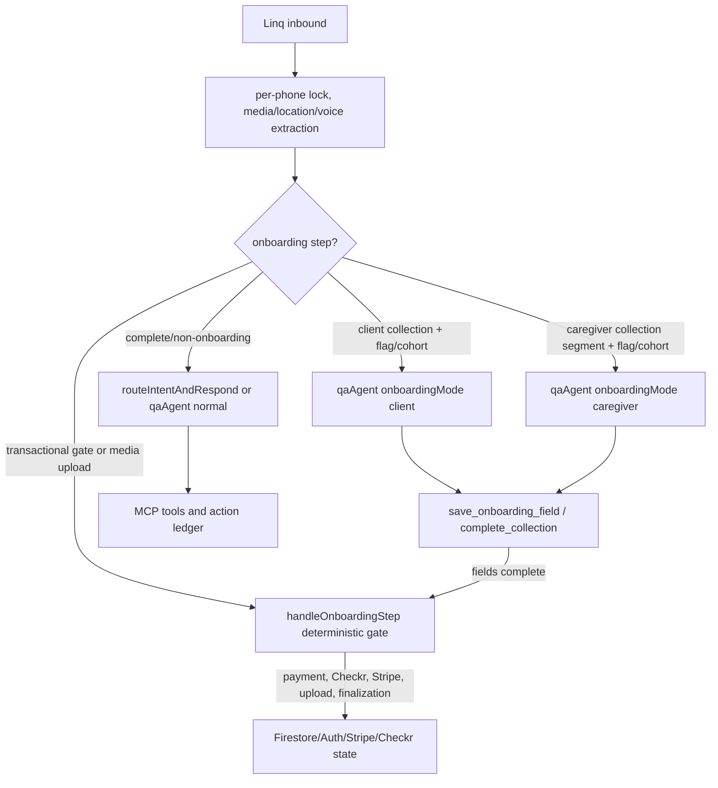

# Cara Launch Conversation Completion - Plan

## Goal Capsule

| Field | Value |
|---|---|
| Objective | Finish Cara's remaining launch-grade conversation and onboarding gaps without breaking the agent-native work already built. |
| Authority | Current code in `functions/src`, `components`, `context`, and `docs/plans`; user requirement that Cara must feel like a real human care coordinator, not a chatbot. |
| Execution profile | Local-only implementation plan for a later `/ce-work` run; no deploy or push implied by this plan. |
| Stop conditions | Stop if implementation would require changing medical scope, HIPAA/legal policy, Linq capabilities, or payment approval rules without product approval. |
| Tail ownership | Implementation must update tests, run local gates, and leave a clear rollout path for the onboarding loop flag. |

---

## Product Contract

### Summary

Cara is already a real product agent, not a simple FAQ bot: she has Linq inbound/outbound handling, the `qaAgent` tool loop, onboarding-specific tools, family-group tools, emergency alert tooling, care/payment rails, referrals, memory layers, operational context, a Control Room surface, and golden transcript coverage.
The remaining launch problem is narrower: Cara must behave consistently human across every high-volume path, including the parts still routed through scripted state handlers or only partially migrated to the agent loop.

### Problem Frame

The current code has strong agent-native infrastructure, but it is uneven by surface.
Client onboarding can route conversational collection through `runQaAgent({ onboardingMode: true })` behind `ONBOARDING_AGENT_LOOP`, while caregiver onboarding remains explicitly provisional in `functions/src/agents/onboardingContract.ts` because it interleaves photo, docs, membership, Checkr, and Stripe Connect gates.
The old fallback path still contains chatbot/self-identifying language in `functions/src/agents/stepHandler.ts` and several direct `isQuestionOrOther` checks in `functions/src/agents/onboardingConversation.ts`.
That means a real user can still encounter two Cara personalities depending on route, flag, media type, role, or transactional gate.

### Requirements

**Conversation Quality**

- R1. Cara must never call herself an AI assistant, use generic chatbot openings, or ask broad "how can I help" questions when context exists.
- R2. Every onboarding and mid-flow reply must send one coherent message per inbound turn unless a deliberate link or transactional artifact must be sent separately.
- R3. Cara must absorb terse answers, corrections, front-loaded answers, and questions-in-the-middle without restarting, re-greeting, or re-asking known fields.
- R4. Cara must preserve a single warm care-coordinator voice across agent-loop, scripted fallback, media/location, payment, Checkr, and support paths.

**Onboarding Coverage**

- R5. Client onboarding loop routing must be launch-proved with real-model eval, canary controls, and rollback metrics before the flag is widened.
- R6. Caregiver onboarding must gain segmented agent-loop collection around deterministic gates instead of staying on the old form-march for all non-client steps.
- R7. Transactional gates remain deterministic: OTP, photo/document upload, MVR, membership payment, Checkr, Stripe Connect, and finalization do not move into free-form model writes.
- R8. The loop must never advance to a transactional gate with required collection fields missing.

**Operational Behavior**

- R9. Cara must lead with live operational context when available: next visit, pending approval, payment issue, failed action, open alert, incomplete onboarding, or care update.
- R10. Failed or risky Cara actions must be visible in `agent_action_ledger`, `admin_alerts`, or the existing admin Control Room surfaces.
- R11. Memory must prefer fresh user text and live Firestore/tool results over older learned facts or memory files.

**Launch Proof**

- R12. The golden transcript/eval suite must cover messy human messages for both client and caregiver launch flows.
- R13. The release runbook must define exactly how to shadow, canary, monitor, and roll back `ONBOARDING_AGENT_LOOP`.

### Existing Capabilities To Preserve

- Cara's main tool loop lives in `functions/src/agents/qaAgent.ts` and already injects memory priority, voice exemplars, capability discovery, operational context, prompt augmenters, loop budgets, and onboarding directives.
- Client onboarding loop pieces already exist in `functions/src/agents/onboardingContract.ts`, `functions/src/agents/onboardingDirective.ts`, `functions/src/mcp/server.ts`, and `functions/src/linq/webhooks.ts`.
- Family add/remove already routes through canonical MCP tools from `functions/src/linq/routeIntent.ts` into `add_family_member` and `remove_family_member`.
- Referrals, emergency alerts, callout backup/refund, booking quote/request, shift/payment rails, and action ledger coverage are registered in `functions/src/mcp/server.ts`, `functions/src/agents/launchActionParity.ts`, `functions/src/evals/caraTrainingDataset.ts`, and `context/capability-map.md`.
- Existing tests already cover onboarding contract/directive behavior, routing, onboarding eval graders, golden transcripts, MCP tools, feature flags, contract collections, and admin execution tools.

### Scope Boundaries

- In scope: conversation behavior, onboarding collection routing, fallback voice cleanup, tests/evals, runbook updates, metrics, and Control Room visibility for failed conversation actions.
- Deferred: deleting legacy scripted onboarding handlers entirely; that should wait until canary proof shows the loop is stable.
- Out of scope: changing Linq provider, changing Checkr approval policy, moving payment approvals to group chat, adding medical advice, or deploying/pushing.

---

## Planning Contract

### Key Technical Decisions

- KTD1. Keep `qaAgent` as the single conversational brain. Extend the existing onboarding mode and prompt augmenters instead of creating a second agent stack.
- KTD2. Use segmented caregiver collection. Caregiver onboarding cannot be copied from client onboarding because gates are interleaved; the loop should own only safe field-collection spans and hand back to `handleOnboardingStep` for every transactional step.
- KTD3. Remove chatbot behavior at source, not only by linter. Static prompt text in `stepHandler.ts`, fallback copy, and scripted handlers must be rewritten so the linter is defense-in-depth, not the primary fix.
- KTD4. Preserve deterministic launch rails. The MCP tools `save_onboarding_field` and `complete_collection` stay session-only; irreversible actions remain behind existing tool confirmation, payment, Checkr, Stripe, and upload code.
- KTD5. Treat real-model eval and canary monitoring as a launch gate. Unit tests prove contracts; they do not prove naturalness, sequencing, or no-regreet behavior under real model outputs.
- KTD6. Keep memory priority explicit. The existing `MEMORY_SOURCE_PRIORITY_POLICY` in `qaAgent.ts` is the right rule; the plan should add tests where old memory conflicts with the latest user correction or live tool data.

### High-Level Technical Design

### Sequencing

1. Lock the current behavior with characterization tests before touching routing.
2. Clean static chatbot/fallback language so all paths share Cara's voice.
3. Add segmented caregiver loop support behind flags.
4. Expand golden transcripts and real-model eval gates.
5. Update runbook and admin/metrics visibility.
6. Run local gates.

### System-Wide Impact

- `functions/src/agents/onboardingContract.ts` becomes more important as the shared field/gate contract for both roles.
- `functions/src/linq/webhooks.ts` remains the routing spine and must preserve media/location/voice handling before any onboarding loop branch.
- `functions/src/agents/onboardingConversation.ts` keeps deterministic gates and finalization.
- `functions/src/mcp/server.ts` remains the only onboarding loop write surface.
- Admin visibility continues through `agent_action_ledger`, `admin_alerts`, `AuditTrail`, and Control Room components.

---

## Implementation Units

### U1. Characterize Current Client Loop And Scripted Fallback

- **Goal:** Prove what currently works before changing voice or caregiver routing.
- **Requirements:** R2, R3, R5.
- **Files:** `functions/src/linq/__tests__/handleInbound.routing.test.ts`, `functions/src/agents/qaAgent.onboarding.test.ts`, `functions/src/agents/qaAgent.onboarding.eval.test.ts`, `functions/src/agents/stepHandler.test.ts`.
- **Approach:** Add focused tests for client loop routing, fallback routing, media/location exclusion, and one-reply behavior. Include a regression for the stale scripted `answerMidFlow` path so later cleanup does not silently double-send.
- **Test Scenarios:** `ONBOARDING_AGENT_LOOP=client` routes a client collection text turn to `runQaAgent`; media/location turns stay deterministic; flag-off still uses scripted runner; a mid-flow question produces one reply.

### U2. Remove Chatbot Language From Scripted And Fallback Paths

- **Goal:** Eliminate static copy that makes Cara sound like a generic chatbot.
- **Requirements:** R1, R2, R4.
- **Files:** `functions/src/agents/stepHandler.ts`, `functions/src/agents/onboardingConversation.ts`, `functions/src/utils/caraMessage.ts`, `functions/src/agents/__tests__/onboardingDirective.test.ts`, `functions/src/agents/stepHandler.test.ts`, `functions/src/agents/goldenTranscripts.test.ts`.
- **Approach:** Rewrite fallback prompts that say "AI care assistant", "I'm here to help", "how can I help", or equivalent. Route fallback answers through the same voice/lint principles used by `qaAgent` where practical. Add static assertions that onboarding/fallback prompts do not contain banned chatbot phrases.
- **Test Scenarios:** Static search test fails on banned phrases in prompt-bearing files; scripted mid-flow answer sounds like a care coordinator; no handler reintroduces Cara mid-conversation.

### U3. Add Segmented Caregiver Onboarding Loop Contract

- **Goal:** Make caregiver field collection loop-ready without moving deterministic gates into the model.
- **Requirements:** R6, R7, R8.
- **Files:** `functions/src/agents/onboardingContract.ts`, `functions/src/agents/onboardingDirective.ts`, `functions/src/agents/__tests__/onboardingContract.test.ts`, `functions/src/agents/__tests__/onboardingDirective.test.ts`.
- **Approach:** Replace the provisional caregiver "collect all then first gate" model with explicit caregiver collection segments. Each segment names allowed fields, required fields, entry steps, and next deterministic gate. The directive should show only the current segment's missing fields.
- **Test Scenarios:** Caregiver name/location segment completes to the next upload or verification gate; later availability/rate/email/bio segments do not run before their prerequisite gates; `complete_collection` rejects completion when a segment field is missing.

### U4. Route Caregiver Collection Segments Through `qaAgent` Behind Flags

- **Goal:** Give caregivers the same human conversation quality as clients while preserving upload/payment/Checkr gates.
- **Requirements:** R2, R3, R6, R7.
- **Files:** `functions/src/linq/webhooks.ts`, `functions/src/config/featureFlags.ts`, `functions/src/linq/__tests__/handleInbound.routing.test.ts`, `functions/src/agents/qaAgent.onboarding.test.ts`.
- **Approach:** Extend `shouldRouteOnboardingToLoop` to support `role === "caregiver"` only for safe text collection steps in the active segment. Keep media, location, payment, upload, Checkr, Stripe Connect, and finalization steps on `handleOnboardingStep`. Use the same cohort controls already implemented for client.
- **Test Scenarios:** `ONBOARDING_AGENT_LOOP=caregiver` routes a caregiver field step to `runQaAgent`; caregiver photo/doc/payment/checkr/stripe steps stay deterministic; flag-off behavior is unchanged; failed loop falls back to the scripted runner.

### U5. Harden Collection Completion And Handoff

- **Goal:** Prevent silence, duplicate bubbles, and premature gate advancement.
- **Requirements:** R2, R7, R8.
- **Files:** `functions/src/mcp/server.ts`, `functions/src/linq/webhooks.ts`, `functions/src/agents/onboardingConversation.ts`, `functions/src/agents/qaAgent.onboarding.eval.test.ts`, `functions/src/mcp/__tests__/booking.test.ts`.
- **Approach:** Keep `complete_collection` as the gatekeeper. For each role/segment, recompute missing fields from Firestore and return model guidance instead of an error when incomplete. For completed client collection, preserve `continueAfterClientCollection`; for caregiver segments, route to the correct deterministic next step without sending duplicate prompts.
- **Test Scenarios:** Front-loaded answers save multiple fields then complete; missing field blocks handoff; completed client collection triggers the passive handoff; completed caregiver segment advances exactly one gate; duplicate inbound does not duplicate side effects.

### U6. Expand Messy-Human Golden Transcripts

- **Goal:** Prove Cara handles real human texting, not clean demo prompts.
- **Requirements:** R1, R3, R4, R12.
- **Files:** `functions/src/agents/goldenTranscripts.test.ts`, `functions/src/evals/caraTrainingDataset.ts`, `docs/data/cara-training-dataset.md`.
- **Approach:** Add transcripts for client onboarding, caregiver onboarding, family updates, support, payment approval/dispute, caregiver payout questions, emergency escalation, family member add/remove, referral, and memory correction. Each transcript should assert tools called, collections touched, banned phrases absent, and one-question-at-a-time behavior.
- **Test Scenarios:** "My mom" after a greeting advances senior context; "actually her name is Dot" updates memory/current data; caregiver says "I can do mornings 25/hr" saves multiple fields; family says "send this to my sister" uses family/referral flow; secondary member cannot approve payment; emergency text raises alert and avoids medical advice.

### U7. Real-Model Eval And Canary Watch

- **Goal:** Make the onboarding loop launchable with evidence, not hope.
- **Requirements:** R5, R12, R13.
- **Files:** `functions/src/agents/qaAgent.onboarding.eval.test.ts`, `functions/src/agents/onboardingCanaryWatch.ts`, `functions/src/agents/turnMetrics.ts`, `docs/runbooks/onboarding-release-checklist.md`.
- **Approach:** Extend the existing eval grader to score caregiver segmented flows, no-regreet, completion, fields-before-handoff, and naturalness. Ensure metrics include flow class, role, segment, linter hits, regreet hits, completion, and latency. Update the runbook with shadow, allowlist, cohort percentage, rollback, and alert thresholds.
- **Test Scenarios:** Real-model eval passes client and caregiver fixtures; canary watcher reports no traffic, high regreet rate, high fallback rate, slow p95, and low completion rate; runbook documents exact env flags.

### U8. Memory Conflict And Freshness Tests

- **Goal:** Ensure Cara's memory helps without overriding the current conversation.
- **Requirements:** R3, R9, R11.
- **Files:** `functions/src/agents/qaAgent.test.ts`, `functions/src/agents/goldenTranscripts.test.ts`, `functions/src/memory/__tests__/earlyBootstrap.test.ts`, `functions/src/agents/operationalContext.test.ts`.
- **Approach:** Add tests where older learned facts conflict with the user's latest correction, a care-plan/tool result conflicts with memory, and an onboarding resume uses saved `onboardingData` without re-asking. Preserve the policy that fresh text and live tool results win.
- **Test Scenarios:** Fresh correction wins over memory; live appointment/payment status wins over stale memory; onboarding resume does not ask for already saved fields; memory update tool is used when appropriate.

### U9. Admin And Ledger Visibility For Conversation Failures

- **Goal:** Make failed human-agent behavior visible to operators.
- **Requirements:** R9, R10, R13.
- **Files:** `functions/src/observability/actionLedger.ts`, `functions/src/observability/caraOpsAlerts.ts`, `functions/src/agents/turnMetrics.ts`, `components/admin/AdminCaraControlRoom.tsx`, `components/admin/AuditTrail.tsx`, `functions/src/admin/__tests__/adminExecutionTools.test.ts`.
- **Approach:** Log and surface loop fallback, repeated regreet, banned-phrase linter violations above threshold, failed post-collection handoff, failed Linq send, and failed caregiver segment handoff. Use existing `agent_action_ledger` and `admin_alerts` patterns instead of creating another admin collection.
- **Test Scenarios:** Failed post-collection handoff creates an admin-visible alert; repeated loop fallback appears in Control Room; manual recovery actions remain admin-gated and idempotent.

### U10. Launch Verification Sweep

- **Goal:** Prove the plan without deploying.
- **Requirements:** R1-R13.
- **Files:** `package.json`, `functions/package.json`, `tests/callablePrefix.test.ts`, `tests/contractCollections.test.ts`, `functions/src/agents/__tests__`, `functions/src/linq/__tests__`, `functions/src/mcp/__tests__`.
- **Approach:** Run the established local gates and targeted Cara suites. Update docs only with verified results and any non-blocking residual risk.
- **Test Scenarios:** Typecheck/build pass; callable prefix guard passes; contract collection alignment passes; onboarding loop suites pass; golden transcripts/evals pass; no deploy or push occurs unless explicitly requested later.

---

## Verification Contract

| Gate | Command | Done Signal |
|---|---|---|
| Frontend typecheck | `npm.cmd run typecheck` | Exit 0. |
| Frontend build | `npm.cmd run build` | Exit 0 and no new build warnings tied to touched files. |
| Functions build | `npm.cmd --prefix functions run build` | Exit 0. |
| Functions typecheck | `npm.cmd --prefix functions exec tsc -- --noEmit` | Exit 0. |
| Full unit suite | `npm.cmd test -- --run` | Exit 0 or documented unrelated environment failure with targeted suites green. |
| Onboarding contract suites | `npm.cmd --prefix functions test -- --run functions/src/agents/__tests__/onboardingContract.test.ts functions/src/agents/__tests__/onboardingDirective.test.ts functions/src/agents/qaAgent.onboarding.test.ts functions/src/agents/qaAgent.onboarding.eval.test.ts` | Exit 0. |
| Routing suites | `npm.cmd --prefix functions test -- --run functions/src/linq/__tests__/handleInbound.routing.test.ts functions/src/linq/__tests__/routeIntent.characterization.test.ts` | Exit 0. |
| Golden transcripts | `npm.cmd --prefix functions test -- --run functions/src/agents/goldenTranscripts.test.ts` | Exit 0 and banned chatbot phrase assertions pass. |
| Contract guards | `npm.cmd test -- --run tests/callablePrefix.test.ts tests/contractCollections.test.ts tests/entityLifecycle.test.ts` | Exit 0. |

---

## Definition of Done

- Cara has one consistent care-coordinator voice across `qaAgent`, onboarding loop, scripted fallback, and transactional handoff paths.
- No prompt-bearing source file used by Cara contains "AI care assistant", "how can I help you today", "I'm here to help", or equivalent generic chatbot language unless a test explicitly allows it for a non-user-facing fixture.
- Client onboarding loop remains behind `ONBOARDING_AGENT_LOOP=client` and has eval/canary proof before widening.
- Caregiver field collection has segmented loop support behind `ONBOARDING_AGENT_LOOP=caregiver`; photo/docs/payment/Checkr/Stripe gates remain deterministic.
- `complete_collection` cannot advance with missing required fields.
- Golden transcripts cover messy human client and caregiver flows, not only clean happy paths.
- Memory freshness tests prove latest user text and live tool results beat stale memory.
- Admin/Control Room can see repeated loop failures, failed handoffs, and risky failed actions.
- Runbook explains shadow, allowlist, cohort percentage, rollback, and metrics thresholds.
- All required local gates pass, or any failure is documented with exact command, affected files, and whether it blocks launch.
