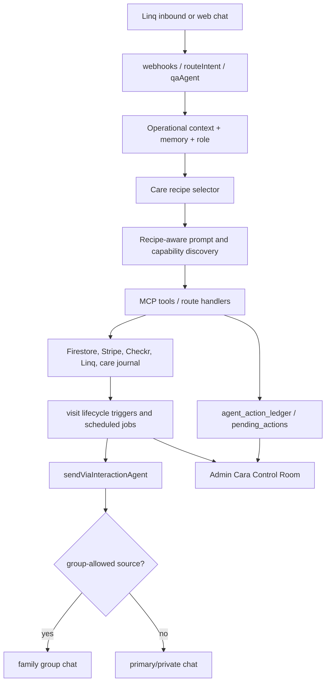

# Cara Care Recipes And Agent Polish - Plan

## Goal Capsule

| Field | Value |
|---|---|
| Objective | Make Cara feel and operate like a 10/10 senior-care agent by packaging her existing action surface into care recipes, strengthening proactive care moments, improving family memory trust, and closing the remaining reliability gaps found from Poke/Tomo comparison. |
| Authority | Current repo behavior in `functions/src`, `components/admin`, `services/api.ts`, `firestore.rules`, and existing Cara plans; user requirement that Cara must be a real human-like care coordinator, not a chatbot. |
| Execution profile | Local-only implementation plan for a later `/ce-work` run. Do not deploy or push unless explicitly requested after local verification. |
| Stop conditions | Stop before changing medical-advice boundaries, payment approval authority, Linq provider assumptions, Checkr bookability rules, or caregiver/client legal posture without product approval. |
| Tail ownership | Implementation must update tests, run local gates, document remaining launch risks, and keep unrelated local edits out of the plan's commit unless the user explicitly asks. |

---

## Product Contract

### Summary

Cara already has a strong product-agent foundation: Linq text transport, role-aware tool use, family groups, memory files and Zep, operational context, action ledger, Control Room recovery, proactive triggers, and golden transcript tests.
The next gap is product expression and reliability.
Poke's strongest lesson is action-first text automation; Tomo's strongest lesson is relationship-aware group texting and continuity.
Cara should combine those ideas inside a senior-care-specific frame: a family care coordinator who remembers, acts, follows up, and keeps clients, family members, caregivers, and admins aligned.

### Problem Frame

The codebase has many individual tools, but users should not experience Cara as a bag of commands.
They should experience repeatable care moments: "confirm tomorrow's visit", "tell my sister how Mom is doing", "find backup coverage", "approve hours", "ask the caregiver for ETA", "refer a caregiver", and "show me what you remember".
The current implementation has enough infrastructure to support this, but key pieces remain spread across prompts, MCP tools, route handlers, proactive jobs, memory modules, and admin surfaces.
This plan packages the existing infrastructure into recipes, hardens proactive visit lifecycle behavior, makes memory auditable to families, and ensures failures surface in the Control Room.

### Requirements

**Agent Product Shape**

- R1. Cara must expose common senior-care workflows as care recipes backed by real tools, not as generic capability lists.
- R2. Cara must answer "what can you do?" with context-led actions when context exists, and with role-appropriate recipes when it does not.
- R3. Recipes must stay in sync with `LAUNCH_ACTION_PARITY`; Cara must never advertise a recipe whose underlying action is blocked or missing.
- R4. Recipes must support client, primary family, secondary family, caregiver, and admin/operator roles without leaking authority across roles.

**Proactive Care Lifecycle**

- R5. Cara must coordinate the visit lifecycle around scheduled visits: pre-visit confirmation, arrival, late/no-show, in-progress questions, completion note, family update, hours approval, payment state, and caregiver payout visibility.
- R6. Care updates may route to family groups when appropriate, but payment approvals must remain private to the primary account holder.
- R7. Proactive messages must respect opt-out, DND, deduplication, daily caps, and emergency delivery rules already present in `sendViaInteractionAgent`.
- R8. Any proactive action that fails to notify, update state, or complete a critical handoff must become admin-visible.

**Family Memory And Trust**

- R9. Cara must provide a family-visible "what I remember" and "change what you remember" experience without exposing hidden prompt context or unrelated users' data.
- R10. Fresh user corrections and live tool data must outrank old memory, learned facts, Zep context, or cached context.
- R11. Memory edits must be confirmed or clearly acknowledged when they affect care plans, emergency contacts, medication/allergy context, doctor names, family roles, or routing preferences.
- R12. Secondary family members may ask about care updates and add-family workflows within their allowed scope, but they cannot approve payments, alter sensitive records, or remove members without primary authority.

**Human Conversation Quality**

- R13. Cara must not use chatbot framing, support punts, broad "how can I help" prompts, corporate language, or third-person Cara references in user-facing replies.
- R14. Cara must handle messy human SMS: shorthand, corrections, partial info, panic, anger, ambiguous yes/no, mixed medical/logistics questions, and family-group replies.
- R15. Cara must lead with the most relevant current context when it exists: next visit, active visit, pending hours approval, failed action, open alert, recent care note, incomplete onboarding, or caregiver payout status.
- R16. Conversation quality failures must be measurable through `cara_turn_metrics` and visible to admins when they become risky or repeated.

**Admin And Recovery**

- R17. The Cara Control Room must show failed recipes, failed Linq delivery, failed proactive handoffs, pending approvals, quality flags, and recovery actions in one operational queue.
- R18. Admin retry/replay/cancel actions must remain admin-gated, idempotency-keyed, and audit/ledger visible.
- R19. No recipe or proactive lifecycle action may silently fail in a way that leaves family/caregiver state inconsistent.

**Launch Proof**

- R20. Golden transcripts and dataset examples must cover the new recipe, proactive, memory, and family-group behavior.
- R21. Local verification must include focused Cara suites plus typecheck/build gates.
- R22. This work must not deploy, push, or change production flags unless the user explicitly approves later.

### Key Flows

- F1. Recipe discovery
  - **Trigger:** Client, caregiver, or family member asks "what can you do?", "help", or sends a vague hello.
  - **Actors:** Client, caregiver, primary family, secondary family.
  - **Steps:** Load role and operational context; choose one context-led next action when available; otherwise name 2-3 role-allowed care recipes; avoid feature-list framing.
  - **Outcome:** User sees Cara as a care coordinator with concrete actions, not a chatbot menu.
  - **Covered by:** R1, R2, R3, R4, R13, R15.

- F2. Visit lifecycle orchestration
  - **Trigger:** Scheduled visit approaches, starts, runs late, completes, or enters pending hour approval.
  - **Actors:** Primary client, caregiver, family group, admin.
  - **Steps:** Cara confirms coverage, routes arrival/completion updates, detects no-show or late states, asks caregiver for notes, submits `shiftHours`, asks primary client for approval, and surfaces payment/payout state.
  - **Outcome:** Family gets reassurance, caregiver has clear next steps, and payment remains on the safe private rail.
  - **Covered by:** R5, R6, R7, R8, R17, R19.

- F3. Family update growth loop
  - **Trigger:** Visit update is sent, client asks to keep someone updated, or family asks to share latest update.
  - **Actors:** Primary client, secondary family, newly invited family member.
  - **Steps:** Cara identifies allowed authority, collects one missing field at a time, calls `add_family_member`, sends welcome text, updates family group, and shares the latest care summary where allowed.
  - **Outcome:** Care updates become the natural growth loop without exposing payment authority.
  - **Covered by:** R4, R6, R8, R12, R14.

- F4. Memory trust loop
  - **Trigger:** User asks what Cara remembers, corrects a fact, asks Cara to forget something, or shares durable care context.
  - **Actors:** Client, caregiver, family member.
  - **Steps:** Cara reads allowed memory context, summarizes it plainly, saves or corrects durable facts through memory tools, and acknowledges important changes.
  - **Outcome:** Users trust Cara's memory because it is visible, correctable, and scoped.
  - **Covered by:** R9, R10, R11, R12.

- F5. Operator recovery loop
  - **Trigger:** Recipe, Linq send, proactive lifecycle handoff, or model turn fails.
  - **Actors:** Admin/operator, Cara.
  - **Steps:** Failure writes `agent_action_ledger`, `admin_alerts`, or `cara_turn_metrics`; Control Room categorizes it; admin retries, replays, cancels, assigns owner, or marks recovery complete.
  - **Outcome:** Failed agent actions become recoverable work, not invisible product breakage.
  - **Covered by:** R16, R17, R18, R19.

### Acceptance Examples

- AE1. Given a primary client texts "what can you do", when they have pending hours approval, then Cara leads with reviewing the hours instead of listing generic features.
- AE2. Given a caregiver texts "what can you do", when they have an upcoming visit and pending payout, then Cara mentions shift management and pay status, not client-only booking actions.
- AE3. Given a secondary family member texts "approve the hours", when the family group exists, then Cara refuses payment authority and does not call any payment approval tool.
- AE4. Given a visit is completed by SMS, when a family group exists, then the care update can go to the group but the payment approval prompt goes to the primary client only.
- AE5. Given `add_family_member` succeeds on profile update but Linq group update fails, then the failure appears in the Control Room with enough target context to retry or recover.
- AE6. Given the user says "actually her doctor is Dr. Nguyen now", when old memory says Dr. Patel, then Cara updates memory and uses Dr. Nguyen in future routing.
- AE7. Given Cara produces "how can I help today", when the conversation repair pass runs, then the final sent message is specific and non-generic.
- AE8. Given family silence check-in is eligible but the user is in DND or over daily cap, then Cara suppresses the proactive message and audits the suppression.

### Existing Capabilities To Preserve

- Linq transport and routing live in `functions/src/linq/webhooks.ts`, `functions/src/linq/routeIntent.ts`, `functions/src/linq/routeClient.ts`, `functions/src/linq/routeCaregiver.ts`, and `functions/src/sms.ts`.
- The main conversational loop lives in `functions/src/agents/qaAgent.ts`.
- Role-aware capability discovery already derives from `functions/src/agents/launchActionParity.ts` through `functions/src/agents/capabilityDiscovery.ts`.
- Family group creation and membership management live in `functions/src/agents/familyGroupManager.ts` and `functions/src/mcp/server.ts`.
- Proactive send safety lives in `functions/src/agents/caraAgent.ts`, `functions/src/agents/proactiveCap.ts`, `functions/src/triggers/triggerEngine.ts`, and scheduled jobs under `functions/src/scheduled`.
- Memory lives in `functions/src/memory/memoryFiles.ts`, `functions/src/memory/zepClient.ts`, `functions/src/memory/learnedFacts.ts`, and related tests.
- Admin recovery lives in `components/admin/AdminCaraControlRoom.tsx`, `services/api.ts`, `functions/src/admin/adminLedgerActions.ts`, and `functions/src/admin/adminRecoveryActions.ts`.
- Golden transcript and dataset coverage live in `functions/src/agents/goldenTranscripts.test.ts` and `functions/src/evals/caraTrainingDataset.ts`.

### Scope Boundaries

- In scope: care recipe registry, recipe-aware prompts and discovery, proactive visit lifecycle hardening, family update growth loop, memory trust UX, Control Room visibility, test/dataset expansion, and local verification.
- Deferred: broad consumer productivity integrations like email/calendar/Notion unless they directly support senior-care workflows.
- Deferred: a public social sharing feature; launch growth should happen through private family care updates and caregiver referrals.
- Out of scope: medical diagnosis, medication dosing advice, raw card/password capture in SMS, payment approval by secondary family members, Checkr bypass, Twilio replacement work, deploys, and GitHub pushes.

### Prior-Art Sources

- Poke: text-native action agent, proactive automations, recipes/integrations, and MCP/custom integration framing from `https://poke.com/`, `https://poke.com/docs`, and `https://poke.com/faq`.
- Tomo: relationship-aware texting, group chat participation, continuity, reminders, privacy and health-data boundaries from `https://www.tomo.ai/about`, `https://tomo.ai/privacy`, and `https://www.tomo.ai/terms`.

---

## Planning Contract

### Key Technical Decisions

- KTD1. Build a `careRecipes` layer over existing tools instead of adding disconnected prompt text. Recipes must derive from or validate against `LAUNCH_ACTION_PARITY` so discovery never drifts from real capabilities.
- KTD2. Keep `qaAgent` as the conversational brain. Recipe hints, operational context, and memory trust UX should augment the existing loop instead of creating another agent stack.
- KTD3. Use `sendViaInteractionAgent` for proactive lifecycle messages. It already enforces opt-out, DND, wait judgment, daily cap, dedup, supervisor, clickable URLs, and consent audit.
- KTD4. Keep care updates group-shareable and payment approvals private. This rule already exists in source-agent routing and route-client payment guards; new recipe and lifecycle work must reinforce it.
- KTD5. Treat `agent_action_ledger`, `admin_alerts`, `pending_actions`, and `cara_turn_metrics` as the operational truth. Do not create another admin queue unless existing collections cannot represent a recovery case.
- KTD6. Make memory visible and correctable, not hidden. Families should be able to ask what Cara remembers and correct it through existing memory file tools, with clear authority checks.
- KTD7. Prefer tests that prove real product behavior. A prompt-only change is not complete unless a golden transcript, unit test, or dataset eval proves the expected tool calls and forbidden phrases.

### High-Level Technical Design

### Recipe Model

Each care recipe should be a small contract, not only copy:

| Field | Purpose |
|---|---|
| `id` | Stable recipe ID used in tests, metrics, and prompt hints. |
| `roleScope` | Client, caregiver, primary family, secondary family, admin/operator. |
| `triggerPhrases` | Natural examples for discovery and dataset tests, not hard keyword routing. |
| `requiredContext` | Data needed before action, such as appointment, senior, phone, pending hours, or caregiver ID. |
| `toolPlan` | One or more existing tools/handlers to call. |
| `authorityRule` | Who may execute the recipe and what must be confirmed. |
| `deliveryRule` | Private chat, family group, caregiver chat, admin-only, or suppressed. |
| `failureVisibility` | Ledger/alert/metric behavior when the recipe cannot finish. |
| `parityIds` | `LAUNCH_ACTION_PARITY` IDs proving the recipe is backed by shipped actions. |

### Initial Recipe Set

| Recipe | Role scope | Existing backing |
|---|---|---|
| `next_visit_briefing` | Client, family-secondary | `get_upcoming_appointments`, operational context, care team reads. |
| `confirm_tomorrow_visit` | Client, caregiver | `send_caregiver_message`, shift offer/appointment confirmation handlers. |
| `late_or_no_show_recovery` | Client, admin | `get_upcoming_appointments`, `find_replacement_caregivers`, admin alerts. |
| `care_update_summary` | Client, family-secondary | `get_care_journal_client`, care journal reads, group routing. |
| `share_latest_update` | Client, family-secondary with primary approval where needed | `add_family_member`, `get_care_journal_client`, family group manager. |
| `approve_or_dispute_hours` | Primary client only | `get_pending_timesheets`, `review_shift_hours`, `routeClient` approval guard. |
| `caregiver_shift_closeout` | Caregiver | `start_shift`, `complete_shift`, `submit_shift_hours`, `routeCaregiver` care notes. |
| `caregiver_pay_status` | Caregiver | `get_caregiver_earnings`, `get_payout_history`, payout tools. |
| `caregiver_referral` | Caregiver | `create_caregiver_referral`, referrals collection, Checkr/onboarding eligibility gates. |
| `memory_review_or_correction` | Client, caregiver, allowed family | `cara_knows`, `update_memory_file`, learned facts correction. |

### Sequencing

1. Define the recipe registry and tests that keep it aligned to launch parity.
2. Inject recipe discovery into existing capability and prompt context.
3. Harden visit lifecycle recipes and proactive source-agent routing.
4. Strengthen family update growth loop and group delivery failure visibility.
5. Add memory trust UX and correction tests.
6. Expand Control Room visibility for recipe/proactive failures.
7. Expand golden transcripts and dataset examples.
8. Run local verification gates.

### System-Wide Impact

- `functions/src/agents/launchActionParity.ts` becomes the source of truth for whether a recipe may be advertised.
- `functions/src/agents/capabilityDiscovery.ts` should evolve from action examples to recipe-aware examples while preserving secondary-family authority filtering.
- `functions/src/agents/qaAgent.ts` gains recipe hints and stricter context-led discovery behavior, but the main tool loop remains unchanged.
- `functions/src/agents/caraAgent.ts` remains the proactive delivery safety rail.
- `functions/src/agents/familyGroupManager.ts` and `functions/src/mcp/server.ts` need better group-sync failure visibility.
- `components/admin/AdminCaraControlRoom.tsx` should remain the admin recovery hub rather than spawning separate admin pages.

### Risks And Mitigations

| Risk | Severity | Mitigation |
|---|---|---|
| Recipe registry duplicates `LAUNCH_ACTION_PARITY` and drifts. | High | Store only product packaging in recipes and assert every recipe maps to shipped parity IDs. |
| Proactive lifecycle messages become spammy. | High | Route through `sendViaInteractionAgent`, keep `canDrop` true for non-critical nudges, preserve DND and daily caps. |
| Family group receives private payment approval. | Critical | Add tests around `GROUP_SOURCE_AGENTS`, payment approval prompts, and secondary-family route guards. |
| Memory UX exposes cross-user or unconfirmed identity data. | Critical | Reuse existing unconfirmed-identity suppression and role/authority checks before memory summaries. |
| Group add partially succeeds but Linq group update fails. | High | Add ledger/admin-alert visibility for group-sync failure and return delivery status to user. |
| More prompt text makes Cara less reliable. | Medium | Keep recipe hints compact, derived, and tested through golden transcripts. |
| Admin queue becomes noisy. | Medium | Only elevate failed/risky/repeated items; keep successful recipes audit-only. |

---

## Implementation Units

### U1. Add Care Recipe Registry

- **Goal:** Create a structured recipe layer that packages existing Cara actions into product workflows.
- **Requirements:** R1, R2, R3, R4.
- **Files:** `functions/src/agents/careRecipes.ts`, `functions/src/agents/careRecipes.test.ts`, `functions/src/agents/launchActionParity.ts`, `functions/src/agents/capabilityDiscovery.ts`.
- **Patterns:** Follow `functions/src/agents/launchActionParity.ts` for typed, testable registries and `functions/src/agents/capabilityDiscovery.ts` for role-aware filtering.
- **Approach:** Add recipe definitions with stable IDs, role scope, required context, authority rules, delivery rules, failure visibility, and `parityIds`. Add tests that every `parityId` exists and is `status: "shipped"`, every recipe has an authority rule, and secondary-family recipes cannot include payment/refund/timesheet authority.
- **Test Scenarios:** Recipe with missing parity ID fails; recipe mapped to blocker/non-goal fails; secondary-family recipe containing payment marker fails; all initial recipes have delivery and failure visibility rules.
- **Verification:** `npm.cmd test -- functions/src/agents/careRecipes.test.ts --run`.

### U2. Make Capability Discovery Recipe-Aware

- **Goal:** Make "what can you do?" feel like real care coordination, not a feature list.
- **Requirements:** R1, R2, R3, R4, R13, R15.
- **Files:** `functions/src/agents/capabilityDiscovery.ts`, `functions/src/agents/capabilityDiscovery.test.ts`, `functions/src/agents/qaAgent.ts`, `functions/src/agents/operationalContext.ts`, `functions/src/agents/operationalContext.test.ts`.
- **Patterns:** Preserve the existing context-led behavior in `buildCapabilityHint` and the authority boundary tests in `capabilityDiscovery.test.ts`.
- **Approach:** Use the recipe registry to generate role-aware examples. When operational context exists, instruct Cara to lead with one relevant recipe tied to next visit, pending hours, latest care update, failed action, or payout status. Keep carrier `HELP` concise and role-specific.
- **Test Scenarios:** Client with pending payment gets "review hours" as lead action; caregiver with payout context gets pay/shift recipe; secondary family gets care update/share options only; no response contains "what can I help" or "feature list".
- **Verification:** `npm.cmd test -- functions/src/agents/capabilityDiscovery.test.ts functions/src/agents/operationalContext.test.ts --run`.

### U3. Harden Visit Lifecycle Recipe Events

- **Goal:** Turn visit lifecycle states into dependable proactive care coordination.
- **Requirements:** R5, R6, R7, R8, R19.
- **Files:** `functions/src/agents/caraAgent.ts`, `functions/src/linq/routeCaregiver.ts`, `functions/src/linq/routeClient.ts`, `functions/src/triggers/appointmentUpdated.ts`, `functions/src/triggers/triggerEngine.ts`, `functions/src/agents/__tests__/proactiveCap.test.ts`, `functions/src/linq/__tests__/handleCareNotes.billing.test.ts`, `functions/src/linq/__tests__/routeClient.test.ts`.
- **Patterns:** Use `GROUP_SOURCE_AGENTS` and existing `routeClient` secondary-member payment guard. Use `sendViaInteractionAgent` for outbound lifecycle messages.
- **Approach:** Define source agents for visit lifecycle events and classify each as group-safe or private. Keep `visit_completion` and payment approval private. Add tests around completion, duplicate completion, payment approval prompt routing, and group-safe care update routing.
- **Test Scenarios:** Arrival update routes to group when `groupChatId` exists; payment approval routes to primary chat only; secondary family `APPROVE` does not approve; duplicate completion does not double-bill; DND suppresses low-urgency non-critical nudges.
- **Verification:** `npm.cmd test -- functions/src/linq/__tests__/handleCareNotes.billing.test.ts functions/src/linq/__tests__/routeClient.test.ts functions/src/agents/__tests__/proactiveCap.test.ts --run`.

### U4. Make Family Update Growth Loop Reliable

- **Goal:** Make adding and updating family members a reliable growth loop without authority leaks.
- **Requirements:** R4, R6, R8, R12, R14, R17, R19.
- **Files:** `functions/src/mcp/server.ts`, `functions/src/agents/familyGroupManager.ts`, `functions/src/linq/routeIntent.ts`, `functions/src/mcp/__tests__/family.test.ts`, `functions/src/agents/familyGroupManager.test.ts`, `functions/src/linq/__tests__/routeIntent.characterization.test.ts`.
- **Patterns:** Preserve deterministic `familyMemberDocId`, secondary-member authority boundaries, and MCP canonical write path.
- **Approach:** Make group-sync failure explicit. If `buildOrUpdateFamilyGroup` or participant add fails after profile/member writes, log a failed `agent_action_ledger` entry and create an admin alert with retry context. Return enough delivery/sync status for Cara to tell the primary client honestly. Remove dead/unreachable comments in `routeIntent.ts` while keeping behavior.
- **Test Scenarios:** Add member sends welcome text; direct route uses MCP path; duplicate add does not duplicate records; participant add failure logs failed ledger/admin alert; secondary member add request does not execute add; remove requires confirmation and logs removal.
- **Verification:** `npm.cmd test -- functions/src/mcp/__tests__/family.test.ts functions/src/agents/familyGroupManager.test.ts functions/src/linq/__tests__/routeIntent.characterization.test.ts --run`.

### U5. Add Share Latest Update Recipe

- **Goal:** Let families naturally share care updates with another person.
- **Requirements:** R1, R5, R6, R12, R14.
- **Files:** `functions/src/mcp/server.ts`, `functions/src/agents/careRecipes.ts`, `functions/src/agents/qaAgent.ts`, `functions/src/agents/goldenTranscripts.test.ts`, `functions/src/evals/caraTrainingDataset.ts`.
- **Patterns:** Reuse `add_family_member`, `get_care_journal_client`, and family-group delivery logic rather than creating a separate sharing collection unless tests prove it is needed.
- **Approach:** Add recipe guidance for messages like "send this to my sister" or "keep my brother updated". If the person is not in the group, collect one missing field at a time, invite them, then share or summarize the latest care update. Keep payment/private billing out of share flow.
- **Test Scenarios:** Existing family member receives latest update; new family member is invited then update is shared; missing phone asks only for phone; secondary family request routes to primary approval when needed; no payment details are shared.
- **Verification:** `npm.cmd test -- functions/src/agents/goldenTranscripts.test.ts --run`.

### U6. Add Memory Trust UX

- **Goal:** Make Cara's memory visible, correctable, and safe.
- **Requirements:** R9, R10, R11, R12, R14.
- **Files:** `functions/src/memory/memoryFiles.ts`, `functions/src/memory/learnedFacts.ts`, `functions/src/agents/qaAgent.ts`, `functions/src/agents/careMemory.ts`, `functions/src/memory/memoryFiles.test.ts`, `functions/src/memory/memoryFiles.reconcile.test.ts`, `functions/src/agents/goldenTranscripts.test.ts`.
- **Patterns:** Follow existing `cara_knows`, `update_memory_file`, correction handling, and `MEMORY_SOURCE_PRIORITY_POLICY`.
- **Approach:** Add or harden flows for "what do you remember", "forget that", "change that", and "do not tell my sister". Summaries must be role-scoped and must not expose hidden prompt context. Durable corrections should update memory files and learned facts where appropriate.
- **Test Scenarios:** User can ask what Cara remembers; user correction updates memory and outranks stale fact; forget request removes or retracts fact; secondary family cannot view sensitive memory outside care-update scope; unconfirmed identity does not receive cross-entity memory.
- **Verification:** `npm.cmd test -- functions/src/memory/memoryFiles.test.ts functions/src/memory/memoryFiles.reconcile.test.ts functions/src/agents/goldenTranscripts.test.ts --run`.

### U7. Strengthen Conversation Repair And Voice Metrics

- **Goal:** Keep final user-facing replies human, specific, and non-chatbot under messy inputs.
- **Requirements:** R13, R14, R15, R16, R20.
- **Files:** `functions/src/agents/qaAgent.ts`, `functions/src/agents/onboardingEvalGraders.ts`, `functions/src/agents/turnMetrics.ts`, `functions/src/agents/caraVoiceContract.test.ts`, `functions/src/agents/goldenTranscripts.test.ts`, `functions/src/agents/qaAgent.onboarding.eval.test.ts`.
- **Patterns:** Preserve existing detectors for generic help asks, support deflection, multi-question data collection, medication instruction, and conversation repair.
- **Approach:** Add recipe-specific quality flags: recipe advertised without backing tool, context ignored when context exists, payment authority leaked, and promise without tool call. Extend tests to verify metrics and repair outcomes.
- **Test Scenarios:** Generic chatbot close repairs; support punt repairs; recipe discovery with context does not list features; promise without tool call is flagged; medication advice repairs; no final reply has list-shaped intake when one question is enough.
- **Verification:** `npm.cmd test -- functions/src/agents/caraVoiceContract.test.ts functions/src/agents/goldenTranscripts.test.ts functions/src/agents/qaAgent.onboarding.eval.test.ts --run`.

### U8. Expand Cara Training Dataset

- **Goal:** Turn the current synthetic seed into a broader regression/eval corpus for real senior-care behavior.
- **Requirements:** R14, R20, R21.
- **Files:** `functions/src/evals/caraTrainingDataset.ts`, `functions/src/evals/caraTrainingDataset.test.ts`, `docs/data/cara-training-dataset.md`, `functions/src/agents/goldenTranscripts.test.ts`.
- **Patterns:** Keep examples labeled with role, channel, risk, missing info, expected tools, expected collections, expected page visibility, and forbidden phrasing.
- **Approach:** Add examples for all initial recipes, visit lifecycle moments, family-group replies, memory correction, support/safety, caregiver referrals, payout status, and ambiguous yes/no. Mark production-review placeholders separately from synthetic seed; do not pretend synthetic examples are real data.
- **Test Scenarios:** Dataset exports valid JSONL; every golden example has forbidden phrase coverage; expected collections are contract-known or intentionally external; high-risk examples require human review where appropriate.
- **Verification:** `npm.cmd test -- functions/src/evals/caraTrainingDataset.test.ts functions/src/agents/goldenTranscripts.test.ts --run`.

### U9. Improve Control Room Recipe Recovery

- **Goal:** Make agent failures operationally recoverable from the admin surface.
- **Requirements:** R16, R17, R18, R19.
- **Files:** `components/admin/AdminCaraControlRoom.tsx`, `services/api.ts`, `functions/src/admin/adminLedgerActions.ts`, `functions/src/admin/adminRecoveryActions.ts`, `functions/src/admin/__tests__/adminExecutionTools.test.ts`, `functions/src/admin/__tests__/adminRecoveryActions.test.ts`, `functions/src/observability/caraOpsAlerts.ts`.
- **Patterns:** Reuse existing retry, replay, cancel, assign owner, and mark complete actions. Keep all execution callables admin-gated and idempotency-keyed.
- **Approach:** Add recipe/action category display where ledger or alert metadata includes recipe ID/source agent. Surface failed group sync, failed proactive send, payment-private routing failures, repeated conversation repair, and repeated loop exhaustion. Keep successful routine events out of the high-priority queue.
- **Test Scenarios:** Failed recipe appears with recipe ID and recovery guidance; retry action remains idempotent; high-risk replay requires confirmation; failed Linq retry creates admin alert; quality issue appears in queue when mirrored to `cara_turn_metrics`.
- **Verification:** `npm.cmd test -- functions/src/admin/__tests__/adminExecutionTools.test.ts functions/src/admin/__tests__/adminRecoveryActions.test.ts --run`.

### U10. Documentation And Runbook Updates

- **Goal:** Document how Cara should behave, how recipes work, and how operators recover failures.
- **Requirements:** R1, R17, R18, R21, R22.
- **Files:** `context/capability-map.md`, `docs/runbooks/onboarding-release-checklist.md`, `docs/data/cara-training-dataset.md`, `docs/reports/2026-06-20-cara-agent-native-launch-completion-report.md`.
- **Patterns:** Keep docs factual and tied to current code. Do not claim live deployment or production readiness unless verified.
- **Approach:** Update capability map with recipe terminology and role authority. Add operator notes for Control Room recipe failures. Update dataset documentation with synthetic-vs-production-review distinction.
- **Test Scenarios:** Docs reference repo-relative paths; docs do not mention unsupported payment authority; docs do not claim deploy/push.
- **Verification:** Manual doc review plus `npm.cmd test -- tests/contractCollections.test.ts --run` if contract docs change.

### U11. Local Verification And Cleanup

- **Goal:** Prove the plan locally and leave the tree reviewable.
- **Requirements:** R20, R21, R22.
- **Files:** `package.json`, `functions/package.json`, `tests/callablePrefix.test.ts`, `tests/contractCollections.test.ts`, touched test files.
- **Patterns:** Use existing Windows commands with `npm.cmd`.
- **Approach:** Run focused suites after each cluster, then full gates. Remove abandoned experimental code. Do not deploy or push. Commit locally only if the user asks after implementation.
- **Test Scenarios:** Focused tests pass; full tests pass; typecheck/build pass; no unrelated generated/vendor files are committed.
- **Verification:** All Verification Contract gates below.

---

## Verification Contract

| Gate | Command | Applies To | Done Signal |
|---|---|---|---|
| Frontend typecheck | `npm.cmd run typecheck` | U9, U10, U11 | Exit 0. |
| Frontend build | `npm.cmd run build` | U9, U10, U11 | Exit 0. |
| Functions build | `npm.cmd --prefix functions run build` | U1-U11 | Exit 0. |
| Functions typecheck | `npm.cmd --prefix functions exec tsc -- --noEmit` | U1-U11 | Exit 0. |
| Recipe registry | `npm.cmd test -- functions/src/agents/careRecipes.test.ts --run` | U1 | Exit 0. |
| Capability and context | `npm.cmd test -- functions/src/agents/capabilityDiscovery.test.ts functions/src/agents/operationalContext.test.ts --run` | U2 | Exit 0. |
| Visit lifecycle and payment routing | `npm.cmd test -- functions/src/linq/__tests__/handleCareNotes.billing.test.ts functions/src/linq/__tests__/routeClient.test.ts functions/src/agents/__tests__/proactiveCap.test.ts --run` | U3 | Exit 0. |
| Family group tools | `npm.cmd test -- functions/src/mcp/__tests__/family.test.ts functions/src/agents/familyGroupManager.test.ts functions/src/linq/__tests__/routeIntent.characterization.test.ts --run` | U4, U5 | Exit 0 and no new hidden delivery failure path. |
| Memory tests | `npm.cmd test -- functions/src/memory/memoryFiles.test.ts functions/src/memory/memoryFiles.reconcile.test.ts --run` | U6 | Exit 0. |
| Golden transcripts | `npm.cmd test -- functions/src/agents/goldenTranscripts.test.ts functions/src/agents/caraVoiceContract.test.ts --run` | U5, U6, U7, U8 | Exit 0; banned chatbot phrasing absent. |
| Dataset tests | `npm.cmd test -- functions/src/evals/caraTrainingDataset.test.ts --run` | U8 | Exit 0. |
| Admin recovery tests | `npm.cmd test -- functions/src/admin/__tests__/adminExecutionTools.test.ts functions/src/admin/__tests__/adminRecoveryActions.test.ts --run` | U9 | Exit 0. |
| Contract guards | `npm.cmd test -- tests/callablePrefix.test.ts tests/contractCollections.test.ts tests/entityLifecycle.test.ts --run` | U1-U11 | Exit 0. |
| Full suite | `npm.cmd test -- --run` | U11 | Exit 0 or documented unrelated environment failure with all touched suites green. |

---

## Definition of Done

- Cara has a typed care recipe registry aligned to shipped launch parity actions.
- "What can you do?" and "help" responses are role-aware, recipe-aware, and context-led when context exists.
- Visit lifecycle messages route through safe proactive delivery and preserve group-vs-private payment boundaries.
- Family update sharing can invite/add family members and share the latest update without leaking payment details.
- Family group add failures, Linq participant failures, and welcome text failures become admin-visible recovery work.
- Memory review, correction, and forget flows are visible, scoped, and covered by tests.
- Conversation repair catches generic chatbot prompts, support punts, unsafe medical instructions, and multi-question form behavior.
- The training dataset covers recipes, visit lifecycle, family groups, memory corrections, caregiver referrals, payout questions, safety, and messy SMS.
- Cara Control Room surfaces failed recipes, failed proactive handoffs, failed Linq delivery, pending approvals, and quality issues without flooding routine successes.
- Docs explain recipes, role authority, synthetic-vs-production dataset status, and operator recovery.
- All Verification Contract gates pass locally or any failure is documented with exact command, cause, and launch impact.
- No deploy and no push occur as part of this plan.
- Abandoned experimental code is removed before final local commit.

---

## Appendix

### Current Code Evidence

- `functions/src/agents/launchActionParity.ts` already maps many client, caregiver, family, and admin actions to shipped tools or callables.
- `functions/src/agents/capabilityDiscovery.ts` already derives role-aware examples from launch parity and blocks secondary-family payment authority.
- `functions/src/agents/qaAgent.ts` already contains action-first prompting, memory priority, conversation repair, grounding, format cleanup, checkpoint resume, and quality metrics.
- `functions/src/agents/caraAgent.ts` already provides safe proactive delivery with group routing, DND, active-hour checks, daily cap, dedup, supervisor, clickable URLs, and consent audit.
- `functions/src/agents/familyGroupManager.ts` already creates/updates family groups, sends welcome texts, uses deterministic member IDs, and writes audit/ledger events.
- `components/admin/AdminCaraControlRoom.tsx` already combines alerts, failed ledger entries, pending actions, support tickets, proactive drafts, and quality metrics into one admin queue.

### Current Gaps This Plan Closes

- Existing tools are strong but not packaged as reusable care recipes.
- Proactive visit lifecycle is present in pieces but not productized as one dependable coordination loop.
- Memory is technically layered but needs a family-visible trust and correction UX.
- Family-group failure visibility needs tightening around partial success and Linq group sync failures.
- Dataset coverage is still mostly synthetic seed and should be expanded before production learning.
- Admin quality metrics exist, but recipe-specific failures need clearer categorization.
