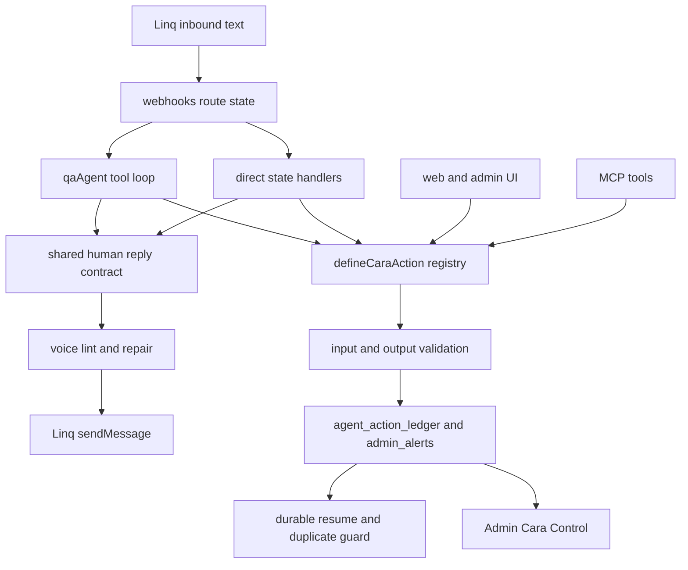

# Cara Human Agent Completion - Plan

## Goal Capsule

| Field | Value |
|---|---|
| Objective | Make Cara feel like one capable human care coordinator across SMS/iMessage, web chat, onboarding, caregiver flows, help menus, recovery paths, and admin-visible operations. |
| Primary failure to remove | Cara must stop sounding like a chatbot, support bot, form, directory listing, or stalled assistant. |
| Authority order | User screenshots and live SMS behavior first, current CareConnex product model second, local code contracts third, external agent-native prior art fourth. |
| Execution profile | Cross-cutting backend conversation hardening plus a small Agent-Native-derived action framework slice. No stack migration. |
| Stop conditions | Stop only for payment/provider secrets, irreversible data migrations, or a product decision that changes the launch funnel. |
| Tail ownership | Implementation must end with local verification. Deploy and push require explicit user approval. |

---

## Product Contract

### Summary

Cara currently has a strong main QA agent, but she still leaks robotic behavior through direct SMS handlers, onboarding paywall copy, capability menus, and error fallbacks.
The plan makes the whole system speak through one humanized reply contract and ensures product-critical actions, especially setup links, are delivered when Cara says she is moving the user forward.
BuilderIO/agent-native should be used more concretely than prior art: adopt the portable action-contract and durable tool-journal ideas into CareConnex, but do not install or migrate to the full framework.

### Problem Frame

The latest iMessage screenshot shows a family completing onboarding and receiving three robotic patterns at once: a form-completion summary, a bullet-list caregiver directory, and a "reply YES" membership prompt with no setup link.
This creates fake progress because Cara says she found caregivers but does not produce a concrete next action.
The root cause is not only prompt tone.
It is that several product flows bypass the main `qaAgent` voice repair path and send fixed strings directly through `sendMessage`.

### Requirements

**Human Voice and Flow**

- R1. Cara must never send "Give me a few minutes", "Give me a moment", "Let me get back", or similar stalled-work messages unless a durable retry or admin action was actually created and the wording reflects that state.
- R2. Cara must not use generic helper prompts such as "How can I help", "What can I help you with", "Here's what I can help you with", or "anything else I can help with" in runtime user-facing replies.
- R3. Cara must not identify herself to users as an "AI care assistant" in SMS/iMessage or onboarding copy; user-facing copy should say care coordinator, Cara, or concrete role language.
- R4. Cara must avoid bullet lists and numbered menus in live SMS unless the message is a transactional code, legal/compliance disclosure, or a compact set of choices that cannot be expressed naturally.
- R5. Cara must answer short greetings with context or a human one-liner, not a feature menu.

**Action-Native Behavior**

- R6. When client onboarding has enough information to proceed, Cara must send the correct next link or clearly ask one natural permission question whose positive reply sends the link in the same flow.
- R7. The caregiver preview after onboarding must read like curated matches, not a database result.
- R8. If Cara says she sent, found, asked, notified, booked, checked, or flagged something, a tool/action/Firestore write must prove that outcome in the same turn.
- R9. Self-delivering actions such as onboarding links must return delivery state that downstream replies cannot contradict.
- R10. Caregiver-side state machines must use the same human fallback and repair behavior as client-side QA.

**System Consistency**

- R11. All user-facing SMS/iMessage sends should pass through a single voice-safe send wrapper unless they are low-level protocol parts such as a link payload.
- R12. The in-app Cara help menu and capability chips must use care-work language, not chatbot menu framing.
- R13. Admin Cara Control must surface remaining robotic fallback, generic prompt, support deflection, link-delivery failure, and promise-without-action events as quality issues.
- R14. Existing safety, medical, payment, approval, and Checkr boundaries must remain stricter than conversational warmth.
- R15. Consequential Cara work must move toward a small CareConnex-native action registry with one definition per operation and one shared contract for SMS, web UI, admin, MCP, and scheduled/proactive agents.
- R16. Each registered action must declare input validation, output validation, caller role/surface, read-only vs mutating behavior, audit behavior, model exposure, and approval requirements.
- R17. The model-visible action surface must stay small and role-scoped; UI-only or admin-only operations must not consume Cara's tool context.
- R18. Cara must have durable turn resume protection so retried turns do not resend links, recreate support tickets, duplicate family invites, double-submit shift hours, or double-charge.
- R19. High-risk actions must support rare human approval gates with stable approval keys before execution, not after the side effect.
- R20. Web and admin Cara surfaces must show action results as structured cards where useful, while SMS/iMessage remains plain and natural.
- R21. Cara quality must be measured from real traffic: tool success, step efficiency, latency, cost, fallback rate, rephrase loops, abandonment, and explicit thumbs-up/down feedback.
- R22. Long-running Linq turns must acknowledge quickly and continue through a durable job/checkpoint path instead of blocking the webhook or sending fake waiting copy.
- R23. Every action must know who invoked it, from which surface, and what data scope applies: primary client, secondary family, caregiver, admin, system job, or public unauthenticated surface.
- R24. Any Agent-Native code copied or closely adapted must keep MIT attribution and be isolated under a CareConnex-owned module boundary.
- R25. CareConnex must not add `@agent-native/core` as a production dependency for this launch batch.
- R26. The first framework slice must be small enough to review and test independently: action definitions, output validation, action exposure flags, approval metadata, and durable tool-call journal classification.

### Actors

- A1. Primary family client completing onboarding, booking, payment, care updates, and support flows through iMessage.
- A2. Secondary family member receiving updates and asking questions without payment authority.
- A3. Caregiver using Cara for onboarding, profile updates, shift confirmations, referrals, arrivals, care notes, timesheets, and payouts.
- A4. Admin operator monitoring failed/risky Cara actions in Cara Control.
- A5. Cara runtime, including `qaAgent`, Linq webhook routing, direct state-machine handlers, MCP tools, and proactive agents.

### Key Flows

- F1. Client onboarding completion and setup link
  - **Trigger:** Family finishes required intake fields.
  - **Steps:** Save final field, complete collection, show curated caregiver preview, explain membership, send identity or payment setup link according to the existing gate, update session state, record delivery.
  - **Outcome:** The family sees a concrete next link instead of only "reply YES" after the caregiver preview.
  - **Covers:** R6, R7, R8, R9.

- F2. Runtime error and loop exhaustion
  - **Trigger:** Main QA loop errors, exhausts tool budget, or hits an external provider failure.
  - **Steps:** Write `admin_alerts` or `agent_action_ledger`, decide whether any user artifact was delivered, send a state-aware human recovery message, and expose the event in Cara Control.
  - **Outcome:** Cara no longer sends a repeated stalled assistant message.
  - **Covers:** R1, R8, R13.

- F3. Direct state-machine mid-flow question
  - **Trigger:** User asks a question while a handler is collecting a confirmation, profile field, care note, refund detail, healthcare action, or shift decision.
  - **Steps:** Answer briefly with the shared human reply helper, re-ask one concrete current question, preserve the pending state.
  - **Outcome:** Mid-flow replies feel like the same Cara as the main agent.
  - **Covers:** R10, R11.

- F4. Help and capability discovery
  - **Trigger:** User asks what Cara can do, sends `/help`, or opens in-app Cara suggestions.
  - **Steps:** Render 3 to 5 care-work examples in prose or short chips, not a feature list or chatbot menu.
  - **Outcome:** Cara presents herself as a coordinator with real care actions.
  - **Covers:** R2, R5, R12.

- F5. Shared action execution across SMS, web, admin, and MCP
  - **Trigger:** Cara or the UI needs to perform a consequential operation: send setup link, add family member, create support ticket, book caregiver, submit shift hours, approve payment, invite referral, or share care update.
  - **Steps:** Call the registered action, validate inputs, assert caller access, run the operation once, validate output, write ledger/audit state, return a structured result to the caller.
  - **Outcome:** Cara, web buttons, admin tools, and MCP do not duplicate business logic.
  - **Covers:** R15, R16, R17, R23.

- F6. Durable resume and duplicate side-effect protection
  - **Trigger:** Linq retries a webhook, a Cloud Function times out, model execution is interrupted, or a user sends the same confirmation twice.
  - **Steps:** Read the action journal, identify completed calls by stable action key, block duplicate mutating calls, safely rerun read-only actions, and resume the turn with facts about completed and unknown calls.
  - **Outcome:** Cara can recover without double-sending, double-booking, double-billing, or lying about an action.
  - **Covers:** R8, R18, R22.

- F7. Human approval for high-risk actions
  - **Trigger:** Cara proposes a risky action such as refund, payment exception, safety escalation closure, deleting/removing a participant, or any future action above configured thresholds.
  - **Steps:** Generate a stable approval key, write pending action, pause execution, show admin or authorized-user approval UI, resume only if approved.
  - **Outcome:** Cara remains useful but does not autonomously execute sensitive operations outside policy.
  - **Covers:** R14, R16, R19.

- F8. Context-aware web and admin surfaces
  - **Trigger:** User is on client dashboard, caregiver dashboard, inbox, booking page, invoice page, or Admin Cara Control and asks Cara for help.
  - **Steps:** Capture visible page/context, let Cara call read-only `view` actions, optionally return navigation/action card hints, and keep copy natural for the current screen.
  - **Outcome:** Cara behaves like she understands the app, not like a detached chatbot.
  - **Covers:** R12, R20, R23.

- F9. Production quality loop
  - **Trigger:** Live conversation completes, fails, gets abandoned, receives user feedback, or hits a fallback.
  - **Steps:** Record turn metrics, classify frustration/rephrase loops, attach quality flags, sample for eval, and surface cohorts in Cara Control.
  - **Outcome:** Cara improves from real use and regressions are visible before they become launch damage.
  - **Covers:** R13, R21.

### Acceptance Examples

- AE1. Given a client finishes intake with "mornings", when caregiver matches exist, then Cara sends a curated match summary and the next setup link or one natural setup-link permission prompt.
- AE2. Given the setup-link tool succeeds, when the final text generation fails, then Cara confirms the already-sent link instead of saying she will come back later.
- AE3. Given the main agent throws before any action is completed, when Cara replies, then she uses a state-aware recovery message and logs an admin-visible failure.
- AE4. Given a caregiver asks a mid-flow question during shift confirmation, when the quick answer model fails, then Cara does not say "Let me get back"; she gives a safe fallback and re-asks the current confirmation.
- AE5. Given `/help`, when Cara replies over SMS or in-app chat, then the reply does not include "Here's what I can help you with" or a bullet menu.
- AE6. Given a developer adds a new direct `sendMessage` string in Linq or agent handlers, when tests run, then a voice contract test fails if it contains banned chatbot/fallback phrasing.
- AE7. Given SMS and web both send a client setup link, when the action runs, then both paths use the same registered action and produce the same audited delivery contract.
- AE8. Given a webhook retries after a setup link was already sent, when Cara resumes, then the link is not duplicated and Cara references the completed delivery naturally.
- AE9. Given a payment/refund or safety-sensitive action requires approval, when Cara proposes it, then no side effect occurs until the stable approval key is approved by an authorized human.
- AE10. Given the user asks Cara from a web page, when page context is available, then Cara can reference the current care task or page state without a generic menu.
- AE11. Given a live user repeatedly rephrases or abandons a turn, when metrics are processed, then Cara Control flags the conversation as a quality issue.
- AE12. Given a new action is added, when contract tests run, then missing schema, output validation, audit metadata, caller scoping, or exposure flags fail the test.

### Scope Boundaries

- In scope: Cara voice unification, onboarding link handoff, caregiver preview copy, direct-handler fallbacks, help menu framing, quality telemetry, and regression tests.
- In scope: selective adoption of BuilderIO/agent-native code patterns: a local `defineCaraAction` action contract, a copied/adapted durable tool-call journal, output validation, action exposure flags, approval gates, and async job visibility.
- Out of scope: migrating CareConnex to BuilderIO/agent-native, replacing Firebase, replacing Linq, replacing MCP tools, or redesigning the whole frontend.
- Out of scope: installing the full `@agent-native/core` framework, adopting its SQL/Drizzle state layer, adopting its Vite/plugin server, replacing existing Firebase callable/MCP routes with Agent-Native routes, or moving Cara UI to its chat runtime.
- Out of scope: weakening medical, payment, approval, Checkr, or consent boundaries to sound warmer.

### Sources

- Current CareConnex screenshot behavior: client onboarding completion produced a bullet caregiver preview, membership prompt, and no visible link.
- `functions/src/agents/onboardingConversation.ts` currently builds the caregiver preview and membership prompt in `handleClientShowCaregivers` and `handleClientPresentPlan`.
- `functions/src/agents/qaAgent.ts` already contains the main voice directive, conversation repair, generic prompt detection, and remaining stalled fallback strings.
- `functions/src/safety/linter.ts` already bans many chatbot phrases but does not cover every direct send path and cannot fix missing actions.
- `functions/src/agents/caraCapabilities.ts` and `constants/caraCapabilities.ts` currently render help menus with chatbot framing.
- BuilderIO/agent-native README and docs emphasize one shared action surface for UI, agent, HTTP, MCP, A2A, CLI, jobs, observability, and handoffs; this should inform CareConnex architecture without a stack migration.
- BuilderIO/agent-native `actions.mdx` contributes the strongest implementation pattern: one validated action definition with input schema, output schema, read-only flag, caller context, exposure flags, access checks, audit metadata, and optional approval gate.
- BuilderIO/agent-native `durable-resume.mdx` contributes the resume pattern: journal tool start/tool done, separate completed calls from interrupted unknown calls, and hard-block duplicate completed write calls with the same tool and input.
- BuilderIO/agent-native `human-approval.mdx` contributes the approval pattern: fail closed, emit approval-required state, use a stable approval key, and execute only after approval.
- BuilderIO/agent-native `observability.mdx` contributes the quality loop: traces, tokens, cost, latency, tool success, step efficiency, automated evals, explicit feedback, frustration signals, and experiment cohorts.
- BuilderIO/agent-native `agent-surfaces.mdx`, `context-awareness.mdx`, and `native-chat-ui.mdx` contribute the surface pattern: headless SMS agent, rich web chat, app-aware context, generated cards, embedded sidecar, and full admin app can share the same actions.
- `packages/core/src/action.ts` is useful but not a clean direct copy because it imports Agent-Native UI/audit/server types and Standard Schema abstractions; copy its shape and selected helpers, not the whole file.
- `packages/core/src/agent/tool-call-journal.ts` is the cleanest direct adoption candidate because it is mostly pure ledger classification over `tool_start` and `tool_done` events.
- `packages/core/src/observability/traces.ts` contributes portable redaction and tool-span pairing patterns, but its storage and OpenTelemetry wiring should be replaced with CareConnex `turnMetrics`, `agent_action_ledger`, and Admin Cara Control.

---

## Planning Contract

### Key Technical Decisions

- KTD1. Keep CareConnex on its current Firebase/Linq/MCP architecture.
  BuilderIO/agent-native is useful prior art, but migrating the stack would not directly fix iMessage replies and would create launch risk.

- KTD2. Take a small Agent-Native-derived framework slice, not the full framework.
  CareConnex already has Firebase Functions, Firestore, Linq, MCP tools, `agent_action_ledger`, `admin_alerts`, `sendViaInteractionAgent`, and `sendMessage`.
  The missing piece is a stricter shared interface around actions, replies, durable resume, and admin-visible proof.

- KTD3. Make setup-link handoff action-native.
  Onboarding completion must call a real link action or create a clear pending action, then render copy from the action result.
  Copy must not imply progress that did not happen.

- KTD4. Treat hardcoded direct sends as technical debt unless they are protocol payloads.
  Direct SMS strings are where robotic behavior leaks because they bypass `qaAgent` repair, `supervise`, and quality metrics.

- KTD5. Use deterministic tests before prompt tuning.
  The problem is visible string paths and missing side effects.
  Tests should pin exact absence of banned phrases and exact presence of link sends before model prompt changes.

- KTD6. Add a CareConnex-native `defineCaraAction` registry by adapting Agent-Native's action contract.
  Do not add `@agent-native/core` as a dependency.
  Port the useful action concepts into `functions/src/agents/actionNative/`: Zod input schema, Zod output schema, `readOnly`, `modelVisible`, `webVisible`, `adminOnly`, `approvalRequired`, `audit`, `idempotencyKey`, and caller context.

- KTD7. Keep Cara's action surface intentionally small.
  Large overlapping tool catalogs make model selection worse.
  Prefer broad actions such as `update_client_intake`, `manage_family_member`, `send_setup_link`, `manage_booking`, and `submit_shift_hours` over one tool per field.
  Hide UI-only and admin-only actions from the model.

- KTD8. Reuse `agent_action_ledger` as the durable action journal.
  Extend it to record `action_started`, `action_completed`, `action_failed`, `interrupted_unknown`, `duplicate_blocked`, and `resume_reconciled`.
  Mutating actions must have stable idempotency keys.

- KTD9. Copy/adapt Agent-Native's tool-call journal as a pure local utility.
  `packages/core/src/agent/tool-call-journal.ts` is portable because it classifies durable `tool_start` and `tool_done` events without requiring SQL, React, Vite, or the Agent-Native server.
  The CareConnex version should use local event types and store/read events from Firestore.

- KTD10. Approval gates must be rare and fail closed.
  Use existing pending-action/quick-confirm patterns for user confirmation, but add a stronger admin/authorized-user approval layer for truly sensitive operations.
  Approval keys should be content-addressed from action name, actor, target, and normalized input.

- KTD11. Add native action cards to web/admin without changing SMS.
  SMS should stay human and concise.
  Web inbox, client dashboard, caregiver dashboard, and Admin Cara Control should render structured action results, failed actions, pending approvals, and next-step cards from the same action output.

- KTD12. Treat observability as product infrastructure, not logs.
  Store turn metrics and quality labels in Firestore collections that Admin Cara Control can query.
  Track both technical failure and human-conversation failure.

- KTD13. Move long Linq work behind durable jobs.
  Webhooks should acknowledge quickly, write an inbound-turn record, execute the agent loop through a resumable worker path, and only send waiting copy when a real pending job exists.

- KTD14. Do not take Agent-Native's SQL, route, plugin, or chat runtime layers for launch.
  Those layers are valuable in that project, but they would duplicate CareConnex Firebase callables, Linq webhook routing, MCP server, React 18 app, and Admin Cara Control.
  They are too broad for a launch-stabilization batch.

- KTD15. Add license attribution for any copied framework code.
  `@agent-native/core` is MIT licensed, so copied or closely adapted snippets are allowed with attribution.
  Add a concise attribution file or source comment for the copied `tool-call-journal` derivative and any copied action helper logic.

### High-Level Technical Design

The implementation should converge runtime sends on a shared helper that has three responsibilities: select state-aware fallback copy, apply the existing voice lint safely, and record quality flags when a fallback or banned phrase would otherwise reach the user.
The helper should not replace structured link payload sends.
Link sends should remain explicit `sendMessage(chatId, { parts: [{ type: "link", value }] })` calls, but the surrounding text must come from action results.

### BuilderIO Agent-Native Applicability

BuilderIO/agent-native should be mined for a narrow framework slice, not adopted as a runtime dependency.
The repository is valuable because it treats an agent as part of the application, with the same actions, state, approval rules, and observability as the UI.
That maps directly to Cara's problem: she is currently split across `qaAgent`, Linq direct handlers, MCP tools, frontend chat, and admin views.

| Agent-Native Pattern | CareConnex Translation | Adoption Decision |
|---|---|---|
| `defineAction` metadata shape | `defineCaraAction` registry wrapping Firebase/MCP operations | Adapt, not direct-copy the whole file. |
| Input and output schema validation | Zod validators for all Cara actions and returned delivery/result objects | Implement locally using existing `zod`. |
| `readOnly`, `agentTool`, `toolCallable`, `publicAgent`, `needsApproval` flags | `readOnly`, `modelVisible`, `webVisible`, `adminOnly`, `approvalRequired`, `publicAllowed` metadata | Adapt with CareConnex names and defaults. |
| Caller context | `caller: sms_agent | web_chat | admin | mcp | scheduler | webhook` plus role and auth scope | Implement locally. |
| Mutating action audit | Extend `agent_action_ledger` and `auditTrail` writes at the registry seam | Implement locally against Firestore. |
| Durable resume tool journal | Classify completed vs interrupted `tool_start`/`tool_done` events | Copy/adapt this pure module with MIT attribution. |
| Duplicate completed write hard-block | Return journaled result instead of rerunning completed mutating action | Implement at `runCaraAction` and MCP dispatch seam. |
| Human approval gates | Stable `approvalKey` and pending approval records before risky side effects | Adapt into existing `pendingActions`, `quickConfirm`, and Admin Cara Control. |
| Agent surfaces | SMS headless agent, web rich chat, Admin Cara Control, dashboard cards using the same action outputs | Take the surface model, not their React runtime. |
| Context awareness | `view_screen` and `navigate`-style actions for web/admin contexts | Add small CareConnex actions. |
| Observability and evals | Redaction, tool-span pairing, frustration metrics, deterministic evals | Adapt redaction/span concepts to current metrics. |
| Async jobs/tasks | Durable inbound-turn/job collection and worker resume path | Implement with Firestore and Firebase Functions, not Agent-Native jobs. |
| SQL/Drizzle state | Agent-Native SQL-backed state | Reject for launch; CareConnex uses Firestore. |
| Vite/plugin routes and framework server | Agent-Native app server and action routes | Reject for launch; CareConnex uses Firebase callables and hosting. |
| Native chat runtime | Agent-Native client chat event mapping | Reference only; build CareConnex cards in existing React components. |

The practical move is to port a narrow framework slice: action definitions, tool-call journal, approval events, and observability patterns.
The full framework remains out of scope for launch.

### Sequencing

1. Lock the voice contract and banned runtime phrases.
2. Build the shared human reply/fallback seam.
3. Fix client onboarding completion and setup-link handoff.
4. Route direct state-machine fallbacks through the shared seam.
5. Rewrite help/capability surfaces.
6. Expand telemetry and Admin Cara Control quality visibility.
7. Adopt the safe Agent-Native framework slice locally with attribution and dependency guards.
8. Add the CareConnex-native action registry and migrate the highest-value actions.
9. Add durable resume, duplicate side-effect protection, and rare approval gates.
10. Add web/admin action cards and context-aware screen actions.
11. Add production quality metrics, feedback, and eval cohorts.
12. Add regression coverage and run local gates.

### Risks and Mitigations

| Risk | Mitigation |
|---|---|
| Over-sanitizing safety language | Exempt emergency, legal, payment, consent, and approval copy from casual rewriting while still banning chatbot phrasing. |
| Duplicate Stripe checkout sessions | Reuse existing `sendOnboardingLink` and stored session URLs where possible; test duplicate "yes" and retry behavior. |
| Hiding real failures with warm copy | Every fallback path must write an admin-visible alert or ledger event with error class and source handler. |
| Breaking link delivery | Keep link payload sends explicit and test `{ parts: [{ type: "link" }] }` calls. |
| Prompt-only fix misses direct handlers | Add static voice contract tests over `functions/src/linq`, `functions/src/agents`, `functions/src/triggers`, and capability mirrors. |
| Action registry becomes a large refactor | Start with highest-impact actions only: setup link, caregiver preview, family member, support ticket, shift hours, payment approval, referral, care update. |
| Tool catalog gets too large | Add model exposure flags and tests that enforce a role-specific action budget. |
| Approval gates make Cara feel slow | Gate only high-risk actions; normal onboarding, care updates, scheduling, and referrals should remain autonomous inside existing policy. |
| Durable resume blocks legitimate retries | Use idempotency keys built from normalized action inputs and target IDs, not raw user text. |
| Observability captures sensitive data | Store redacted previews, action IDs, categories, and metrics; do not store full PHI in quality dashboards. |

---

## Implementation Units

### U1. Expand the Runtime Voice Contract

- **Goal:** Make robotic phrases fail tests before they reach production.
- **Requirements:** R1, R2, R3, R4, R11, AE6.
- **Files:** `functions/src/agents/caraVoiceContract.test.ts`, `functions/src/safety/linter.ts`, `functions/src/safety/linter.test.ts`, `functions/src/agents/qaAgent.test.ts`.
- **Approach:** Expand banned runtime phrase coverage to include stalled-work copy, generic help menus, "AI care assistant", support deflections, numbered support menus, and "reply YES" phrasing when used as a lazy menu.
- **Test Scenarios:** Test that direct runtime files fail on "Give me a few minutes", "Give me a moment", "Let me get back", "Here's what I can help", "AI care assistant", and "support team"; test that safety/compliance files are either excluded or intentionally allowed with comments.
- **Verification:** `npm.cmd test -- functions/src/agents/caraVoiceContract.test.ts functions/src/safety/linter.test.ts --run`.

### U2. Add Shared Human Reply and Fallback Helpers

- **Goal:** Give direct handlers the same voice safety as the main agent without forcing every state machine through `qaAgent`.
- **Requirements:** R1, R2, R8, R10, R11, R13.
- **Files:** `functions/src/utils/caraReply.ts`, `functions/src/utils/caraReply.test.ts`, `functions/src/linq/client.ts`, `functions/src/observability/caraOpsAlerts.ts`, `functions/src/agents/turnMetrics.ts`.
- **Approach:** Add helpers such as `sendCaraText`, `buildCaraFallback`, and `recordCaraQualityIssue`.
  The helper should accept audience, source, handler name, current action state, fallback reason, and optional re-ask text.
  It should apply `lintPreservingLayout`, avoid banned phrases, and write `admin_alerts` or metrics when a fallback was used.
- **Test Scenarios:** Error fallback with no completed action; fallback after a link was already sent; mid-flow question fallback with re-ask; caregiver and client audience variants; banned phrase sanitization.
- **Verification:** `npm.cmd test -- functions/src/utils/caraReply.test.ts functions/src/agents/turnMetrics.test.ts --run`.

### U3. Fix Client Onboarding Completion and Setup Link Handoff

- **Goal:** Replace the robotic caregiver preview and missing-link handoff with a concrete action-native close.
- **Requirements:** R6, R7, R8, R9, AE1, AE2.
- **Files:** `functions/src/agents/onboardingConversation.ts`, `functions/src/agents/__tests__/onboardingConversation.client.test.ts`, `functions/src/agents/qaAgent.onboarding.test.ts`, `functions/src/mcp/server.ts`.
- **Approach:** Rewrite `handleClientShowCaregivers` to produce a curated prose summary of top matches instead of bullet output.
  Rewrite `handleClientPresentPlan` so the message asks "Want me to send the setup link?" or directly sends the next link when the flow has already collected consent.
  Ensure the positive reply path sends identity or payment link and persists session state.
  Consider reusing `sendOnboardingLink("client_payment")` only where it matches subscription semantics; if the existing onboarding gate requires identity first, send identity first and make that clear.
- **Test Scenarios:** Local caregivers found; widened caregivers found; no caregivers available; client replies yes and receives link payload; Stripe identity failure falls back to payment link without silent dead-end; repeated yes does not duplicate unintended resources.
- **Verification:** `npm.cmd test -- functions/src/agents/__tests__/onboardingConversation.client.test.ts functions/src/agents/qaAgent.onboarding.test.ts --run`.

### U4. Route Direct Client and Caregiver State Machines Through the Shared Reply Seam

- **Goal:** Remove robotic mid-flow fallback copy from handlers that bypass `qaAgent`.
- **Requirements:** R1, R10, R11, AE4.
- **Files:** `functions/src/linq/routeClient.ts`, `functions/src/linq/routeCaregiver.ts`, `functions/src/agents/caregiverProfileHandler.ts`, `functions/src/agents/caregiverSwapHandler.ts`, `functions/src/agents/caregiverCancelShiftHandler.ts`, `functions/src/agents/instantPayoutHandler.ts`, `functions/src/agents/refundHandler.ts`, `functions/src/agents/jobPostingFlow.ts`, `functions/src/agents/healthcareHandler.ts`, related tests under `functions/src/linq/__tests__` and `functions/src/agents/__tests__`.
- **Approach:** Replace catch fallbacks like "Let me get back to you on that" with `sendCaraText` or `buildCaraFallback`.
  Keep each state machine's core behavior unchanged.
  Ensure each mid-flow answer re-asks exactly one current question in natural language.
- **Test Scenarios:** Shift confirmation question, care notes question, pre-shift task question, caregiver profile question, refund question, instant payout question, healthcare flow question, caregiver swap question.
- **Verification:** `npm.cmd test -- functions/src/linq/__tests__/routeCaregiver.characterization.test.ts functions/src/linq/__tests__/routeClient.test.ts functions/src/agents/caregiverProfileHandler.test.ts functions/src/agents/instantPayoutHandler.test.ts --run`.

### U5. Rewrite Help and Capability Discovery as Care Recipes

- **Goal:** Make `/help` and in-app hints feel like real care coordination options rather than chatbot menus.
- **Requirements:** R2, R4, R5, R12.
- **Files:** `functions/src/agents/caraCapabilities.ts`, `constants/caraCapabilities.ts`, `functions/src/agents/caraCapabilities.test.ts`, `constants/caraCapabilities.test.ts`, `functions/src/agents/capabilityDiscovery.ts`, `functions/src/agents/capabilityDiscovery.test.ts`, `components/AiSearchAgent.tsx`.
- **Approach:** Replace "Here's what I can help you with" with role-specific prose such as "Here are a few things I can handle for you."
  Prefer 3 to 5 example prompts or chips over bullet menus.
  Keep backend and frontend capability mirrors aligned.
- **Test Scenarios:** Client help, caregiver help, Spanish help, in-app `/help`, suggestion chips, no generic helper prompt.
- **Verification:** `npm.cmd test -- functions/src/agents/caraCapabilities.test.ts constants/caraCapabilities.test.ts functions/src/agents/capabilityDiscovery.test.ts --run`.

### U6. Strengthen Action-Native Proof and Admin Visibility

- **Goal:** Make promise-without-action and failed delivery visible before users experience silent failure.
- **Requirements:** R8, R9, R13.
- **Files:** `functions/src/observability/actionLedger.ts`, `functions/src/observability/caraOpsAlerts.ts`, `components/admin/AdminCaraControlRoom.tsx`, `services/api.ts`, `functions/src/agents/turnMetrics.ts`, `functions/src/agents/turnMetrics.test.ts`.
- **Approach:** Add quality categories for `robotic_fallback`, `promise_without_action`, `link_delivery_failed`, `generic_help_prompt`, and `support_deflection`.
  Surface these in Cara Control queue filters and item details.
  Do not expose PHI in quality issue previews.
- **Test Scenarios:** QA turn with fallback path, direct handler fallback, self-delivering link success, link delivery failure, promise detected without tool call, admin filter includes quality issue.
- **Verification:** `npm.cmd test -- functions/src/agents/turnMetrics.test.ts` plus component tests if existing harness supports Admin Cara Control.

### U7. Add Golden Transcript and Onboarding Screenshot Regressions

- **Goal:** Pin the exact human behavior expected from the screenshot failure and nearby messy messages.
- **Requirements:** R1 through R14.
- **Files:** `functions/src/agents/goldenTranscripts.test.ts`, `functions/src/evals/caraTrainingDataset.ts`, `functions/src/evals/caraTrainingDataset.test.ts`, `functions/src/agents/qaAgent.onboarding.eval.test.ts`.
- **Approach:** Add transcripts for client intake completion, caregiver preview, setup-link handoff, "yes send link", family says "hey", caregiver mid-flow question, caregiver stress menu, and `/help`.
  Assert no banned phrases, no bullet directory for caregiver preview, and link action delivery.
- **Test Scenarios:** The screenshot flow must produce curated prose and setup-link action; generic fallback must fail; caregiver support menu must be conversational; secondary family help must not leak payment authority.
- **Verification:** `npm.cmd test -- functions/src/agents/goldenTranscripts.test.ts functions/src/evals/caraTrainingDataset.test.ts functions/src/agents/qaAgent.onboarding.eval.test.ts --run`.

### U8. Documentation and Launch Guardrails

- **Goal:** Capture the new contract so future work does not reintroduce chatbot behavior.
- **Requirements:** R11, R13, R14, R24, R25.
- **Files:** `CLAUDE.md`, `AGENTS.md` if tracked, `docs/reports/2026-06-30-cara-human-agent-contract.md`, `docs/reports/2026-06-30-agent-native-framework-slice.md`, `docs/third-party/agent-native-attribution.md`, `TEST_PLAN.md`.
- **Approach:** Document the human-agent contract, direct-send ban, setup-link handoff expectation, and safe exceptions.
  Document which Agent-Native code/patterns were copied or adapted, the MIT license basis, and the launch rule that the full `@agent-native/core` dependency is not installed.
  Keep it short and implementation-facing.
- **Test Scenarios:** Documentation references exact test gates and files; no stale Twilio or chatbot language is added.
- **Verification:** Manual doc review plus the full test gates in the Verification Contract.

### U9. Adopt the Safe Agent-Native Framework Slice

- **Goal:** Bring the useful framework mechanics into CareConnex without importing the full Agent-Native runtime.
- **Requirements:** R8, R15, R16, R17, R23, R24, R25, R26, AE7, AE12.
- **Files:** `functions/src/agents/actionNative/defineCaraAction.ts`, `functions/src/agents/actionNative/runCaraAction.ts`, `functions/src/agents/actionNative/caraActionTypes.ts`, `functions/src/agents/actionNative/caraActionRegistry.ts`, `functions/src/agents/actionNative/caraActionRegistry.test.ts`, `functions/src/agents/caraActionSchemas.ts`, `functions/src/agents/toolCapabilities.ts`, `functions/src/mcp/server.ts`, `functions/src/observability/actionLedger.ts`, `docs/third-party/agent-native-attribution.md`.
- **Approach:** Adapt the contract shape from Agent-Native's `packages/core/src/action.ts`, but implement the code locally using existing `zod` and CareConnex Firestore services.
  Add `defineCaraAction` with fields for `name`, `description`, `inputSchema`, `outputSchema`, `readOnly`, `modelVisible`, `webVisible`, `adminOnly`, `approvalRequired`, `audit`, `idempotencyKey`, and `run`.
  The `run` context should include `caller`, `role`, `uid`, `phone`, `chatId`, `sessionId`, `requestId`, and permission scope.
  Registry execution should validate input before `run`, validate output after `run`, enforce caller access, write ledger entries for mutating actions, and hide actions from model-visible catalogs when metadata says so.
  Do not add `@agent-native/core`, SQL/Drizzle packages, Agent-Native Vite plugins, or Agent-Native route handlers.
- **Test Scenarios:** Missing schema fails; missing output schema for mutating action fails; unauthorized caller fails; read-only action can run without audit unless configured; mutating action writes ledger; model-visible catalog excludes UI/admin-only actions; `package.json` and `functions/package.json` do not include `@agent-native/core`.
- **Verification:** `npm.cmd test -- functions/src/agents/actionNative/caraActionRegistry.test.ts functions/src/agents/toolCapabilities.test.ts --run`.

### U10. Migrate the Highest-Impact Cara Actions Into the Registry

- **Goal:** Make Cara's most visible product promises use the shared action seam first.
- **Requirements:** R6, R8, R9, R15, R16, AE1, AE2, AE7.
- **Files:** `functions/src/agents/actions/sendSetupLinkAction.ts`, `functions/src/agents/actions/getCaregiverPreviewAction.ts`, `functions/src/agents/actions/manageFamilyMemberAction.ts`, `functions/src/agents/actions/createSupportTicketAction.ts`, `functions/src/agents/actions/submitShiftHoursAction.ts`, `functions/src/agents/actions/approveShiftHoursAction.ts`, `functions/src/agents/actions/createReferralAction.ts`, `functions/src/agents/actions/shareCareUpdateAction.ts`, existing MCP/server wrappers.
- **Approach:** Start with actions that users notice immediately: setup links, caregiver previews, family adds/removes, support tickets, shift-hour submission, shift-hour approval, caregiver referral, and care update sharing.
  Existing MCP tools should call these actions instead of duplicating behavior.
  Existing web/admin code should gradually call the same callable/API path.
- **Test Scenarios:** SMS setup link and web setup link share action output; caregiver preview returns prose-ready structured matches; support ticket appears in admin; shift hours cannot submit twice; referral remains non-bookable until onboarding and Checkr clear.
- **Verification:** Targeted action tests plus existing onboarding, family, payment, and referral tests.

### U11. Add Durable Turn Resume and Duplicate Side-Effect Guard

- **Goal:** Stop repeated webhook/model retries from causing duplicate real-world actions or repeated useless replies.
- **Requirements:** R1, R8, R18, R22, R24, R26, AE2, AE8.
- **Files:** `functions/src/agents/actionNative/toolCallJournal.ts`, `functions/src/agents/actionNative/toolCallJournal.test.ts`, `functions/src/agents/turnCheckpoint.ts`, `functions/src/agents/turnCheckpoint.test.ts`, `functions/src/observability/actionLedger.ts`, `functions/src/mcp/toolExecutionLedger.ts`, `functions/src/linq/webhooks.ts`, `functions/src/agents/contextManagement.ts`.
- **Approach:** Copy/adapt Agent-Native's pure `tool-call-journal.ts` into a CareConnex local utility with attribution and local event types.
  Before every mutating action, compute a stable idempotency key from action name, actor, target IDs, and normalized input.
  Write `action_started` before the side effect and `action_completed` after validated output.
  On resume, classify completed calls, failed calls, and interrupted unknown calls.
  Hard-block duplicate completed mutating actions with the same key while allowing read-only actions to rerun.
- **Test Scenarios:** Journal pairs `tool_start`/`tool_done` FIFO by tool name; interrupted calls are reported as unknown; completed write calls are not rerun; retried setup-link turn does not resend; duplicate family add does not duplicate member or welcome; duplicate support-ticket turn returns existing ticket; duplicate shift-hours completion does not double-bill; read-only caregiver preview can rerun.
- **Verification:** `npm.cmd test -- functions/src/agents/actionNative/toolCallJournal.test.ts functions/src/agents/turnCheckpoint.test.ts functions/src/mcp/toolExecutionLedger.test.ts --run`.

### U12. Add Rare Human Approval Gates for Sensitive Actions

- **Goal:** Let Cara propose sensitive work while keeping execution under explicit authorization.
- **Requirements:** R14, R16, R19, AE9.
- **Files:** `functions/src/agents/approvalGate.ts`, `functions/src/agents/approvalGate.test.ts`, `functions/src/agents/pendingActions.ts`, `functions/src/agents/quickConfirm.ts`, `components/admin/AdminCaraControlRoom.tsx`, `services/api.ts`.
- **Approach:** Add `approvalRequired` support to `defineCaraAction`.
  If approval is required and missing, write a pending approval record with stable `approvalKey`, action name, redacted input summary, actor, target, risk reason, and expiration.
  Admin/authorized user approval re-enters the action runner with `approvedActionKeys`.
  Denial cancels the action and records a natural Cara follow-up.
- **Test Scenarios:** Payment exception requires approval; approval predicate failure requires approval; denial produces no side effect; approval executes once; reused approval key cannot execute changed input.
- **Verification:** `npm.cmd test -- functions/src/agents/approvalGate.test.ts --run`.

### U13. Add Web/Admin Native Action Cards and Context Awareness

- **Goal:** Make Cara feel embedded in the product instead of detached from the page the user is using.
- **Requirements:** R12, R20, R23, AE10.
- **Files:** `components/AiSearchAgent.tsx`, `components/InboxView.tsx`, `components/client/CaraActivityFeed.tsx`, `components/caregiver/CaregiverDashboard.tsx`, `components/admin/AdminCaraControlRoom.tsx`, `services/api.ts`, `functions/src/agents/actions/viewScreenAction.ts`, `functions/src/agents/actions/navigateAction.ts`.
- **Approach:** Add structured action result cards for setup links, caregiver previews, booking requests, family invitations, support tickets, shift hours, payment approvals, and care updates.
  Add read-only `view_screen` context and constrained `navigate` actions for web/admin contexts.
  SMS should continue to receive natural text and link payloads, not cards.
- **Test Scenarios:** Client dashboard context changes Cara suggestions; caregiver dashboard shows pending shift action; admin Cara Control opens failed action detail; web card buttons call the same registered action; SMS path does not include card-only copy.
- **Verification:** Existing component tests where available, plus root typecheck and a manual browser QA pass before launch.

### U14. Add Production Conversation Observability and Feedback Loop

- **Goal:** Measure whether Cara is becoming less robotic and more useful in real traffic.
- **Requirements:** R13, R21, AE11.
- **Files:** `functions/src/agents/turnMetrics.ts`, `functions/src/agents/turnMetrics.test.ts`, `functions/src/agents/frustrationSignals.ts`, `functions/src/agents/promptExperiments.ts`, `functions/src/agents/actionNative/redaction.ts`, `functions/src/agents/actionNative/redaction.test.ts`, `functions/src/evals/runner.ts`, `components/admin/AdminCaraControlRoom.tsx`, `services/api.ts`.
- **Approach:** Store turn-level metrics: model, token estimate, latency, tool count, tool success rate, fallback category, handoff category, action completion count, rephrase count, abandonment, explicit feedback, and experiment cohort.
  Adapt Agent-Native's sensitive-field redaction pattern before persisting tool inputs, action outputs, or quality previews.
  Add Admin Cara Control filters for high-friction conversations and failed action categories.
  Add deterministic evals for the golden transcripts and optional sampled review queues.
- **Test Scenarios:** Repeated "hey cara" loop creates frustration flag; repeated rephrases create quality flag; tool failure creates action quality issue; feedback stores without PHI; admin filters return correct rows.
- **Verification:** `npm.cmd test -- functions/src/agents/turnMetrics.test.ts functions/src/agents/frustrationSignals.test.ts functions/src/agents/actionNative/redaction.test.ts functions/src/evals/runner.test.ts --run`.

### U15. Add Durable Async Linq Turn Processing

- **Goal:** Replace fake waiting messages with real background work state and resilient webhook handling.
- **Requirements:** R1, R18, R22, AE3, AE8.
- **Files:** `functions/src/linq/webhooks.ts`, `functions/src/linq/inboundQueue.ts`, `functions/src/linq/inboundQueue.test.ts`, `functions/src/triggers/triggerEngine.ts`, `functions/src/agents/turnCheckpoint.ts`, `functions/src/observability/caraOpsAlerts.ts`.
- **Approach:** On inbound Linq webhook, write an inbound turn record and return quickly.
  A worker path executes the agent turn with checkpoint/resume support.
  If work will take longer than the SMS expectation, send a specific state message only after a real job exists, such as "I am checking the caregiver schedule now. I will text you here when it is ready."
  Avoid generic stalled-work copy.
- **Test Scenarios:** Webhook writes inbound turn and does not block; worker sends final reply; retry resumes existing turn; timeout creates admin alert and user-safe state; duplicate inbound message does not duplicate action side effects.
- **Verification:** `npm.cmd test -- functions/src/linq/inboundQueue.test.ts functions/src/linq/__tests__/webhooks.test.ts --run`.

### U16. Add Action Surface Budget and Security Audit

- **Goal:** Prevent the registry from becoming another bloated tool list or unsafe public surface.
- **Requirements:** R14, R16, R17, R23, R25, AE12.
- **Files:** `functions/src/agents/actionSurfaceAudit.test.ts`, `functions/src/agents/toolCapabilities.test.ts`, `scripts/audit-cara-actions.mjs`, `scripts/guard-no-agent-native-runtime.mjs`, `docs/reports/2026-06-30-cara-action-surface.md`.
- **Approach:** Add tests or scripts that list all registered actions by caller surface and role.
  Enforce maximum model-visible actions per role, require access scoping for every read/write action, require `approvalRequired` or documented exemption for high-risk categories, and fail on public exposure without explicit allowlist.
- **Test Scenarios:** Unknown public action fails; admin-only action hidden from model; caregiver cannot see client payment action; secondary family cannot approve payment; model-visible catalog stays under configured budget; guard fails if full Agent-Native runtime dependencies are added.
- **Verification:** `npm.cmd test -- functions/src/agents/actionSurfaceAudit.test.ts functions/src/agents/toolCapabilities.test.ts --run`.

---

## Verification Contract

| Gate | Command | Proves |
|---|---|---|
| Voice contract | `npm.cmd test -- functions/src/agents/caraVoiceContract.test.ts functions/src/safety/linter.test.ts --run` | Runtime strings do not reintroduce chatbot phrases. |
| Onboarding handoff | `npm.cmd test -- functions/src/agents/__tests__/onboardingConversation.client.test.ts functions/src/agents/qaAgent.onboarding.test.ts --run` | Screenshot flow now sends human copy and correct link handoff. |
| Direct handlers | `npm.cmd test -- functions/src/linq/__tests__/routeCaregiver.characterization.test.ts functions/src/linq/__tests__/routeClient.test.ts --run` | State-machine fallbacks no longer use robotic copy. |
| Golden transcripts | `npm.cmd test -- functions/src/agents/goldenTranscripts.test.ts functions/src/evals/caraTrainingDataset.test.ts --run` | Messy human messages stay natural and action-grounded. |
| Framework slice guard | `node scripts/guard-no-agent-native-runtime.mjs` | The full Agent-Native runtime is not installed as a dependency. |
| Action registry | `npm.cmd test -- functions/src/agents/actionNative/caraActionRegistry.test.ts functions/src/agents/actionSurfaceAudit.test.ts --run` | Consequential operations have schema, output, audit, exposure, and caller contracts. |
| Durable resume | `npm.cmd test -- functions/src/agents/actionNative/toolCallJournal.test.ts functions/src/agents/turnCheckpoint.test.ts functions/src/mcp/toolExecutionLedger.test.ts --run` | Retries do not duplicate mutating side effects. |
| Approval gates | `npm.cmd test -- functions/src/agents/approvalGate.test.ts --run` | Sensitive side effects pause until authorized approval. |
| Observability | `npm.cmd test -- functions/src/agents/turnMetrics.test.ts functions/src/agents/frustrationSignals.test.ts functions/src/agents/actionNative/redaction.test.ts --run` | Quality issues and frustration signals are measurable without leaking sensitive inputs. |
| Async Linq | `npm.cmd test -- functions/src/linq/inboundQueue.test.ts functions/src/linq/__tests__/webhooks.test.ts --run` | Webhooks acknowledge quickly and resume durable work. |
| Functions typecheck | `npm.cmd --prefix functions exec tsc -- --noEmit` | Backend TypeScript compiles. |
| Functions build | `npm.cmd --prefix functions run build` | Firebase functions transpile. |
| Root typecheck | `npm.cmd run typecheck` | Frontend and shared TypeScript compile. |
| Full tests | `npm.cmd test -- --run` | Repo-wide regressions are visible before deploy. |

---

## Definition of Done

- D1. The screenshot flow no longer produces bullet-directory caregiver copy, robotic setup prompt copy, or a missing-link dead end.
- D2. No production runtime path intentionally sends "Give me a few minutes", "Give me a moment", "Let me get back", or "Let me come back" without a durable action state and admin-visible issue.
- D3. `/help` and capability discovery no longer present Cara as a generic chatbot menu.
- D4. Client and caregiver direct state machines use the shared reply/fallback seam or have documented protocol-only exceptions.
- D5. Setup, identity, payment, membership, photo, document, background-check, and payout links are sent as actual Linq link payloads when Cara says she is sending them.
- D6. Cara Control surfaces quality issues for robotic fallback, generic prompt, support deflection, promise without action, and link delivery failure.
- D7. All targeted tests, functions typecheck, functions build, root typecheck, and full tests pass locally.
- D8. No deploy or push occurs unless the user explicitly approves it after the local verification result.
- D9. The highest-impact Cara operations are available through `defineCaraAction` or an equivalent local registry, with SMS/web/admin/MCP paths sharing the same business logic.
- D10. Every mutating Cara action has audit metadata and a stable idempotency key.
- D11. Retried Linq turns and duplicate user confirmations cannot duplicate setup links, family invitations, support tickets, shift-hour submissions, charges, or payouts.
- D12. Sensitive actions have rare approval gates that fail closed and execute only after authorized approval.
- D13. Web and admin Cara surfaces show structured action cards and context-aware state without changing SMS into a UI-card format.
- D14. Cara Control measures real conversation quality, including fallback rate, tool success, rephrase/frustration loops, explicit feedback, and failed action categories.
- D15. The plan's Agent-Native adoption is limited to local copied/adapted framework slices with attribution; `@agent-native/core` is not a production dependency.
- D16. The copied/adapted tool-call journal has tests proving completed, interrupted, duplicate, and read-only rerun behavior.
- D17. Redaction runs before action/tool input previews are persisted in Cara metrics or admin-visible quality events.
