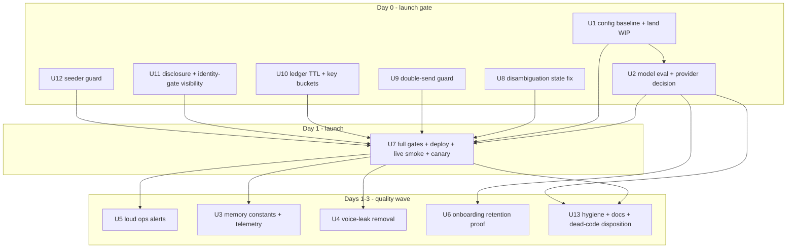

# fix: Cara launch stabilization — memory, voice leaks, and config truth

## Summary

Launch does not need more architecture — it needs the architecture that already shipped to be configured, connected, and verified. This plan supersedes the execution tail of `docs/plans/2026-06-30-001-fix-cara-human-agent-completion-plan.md` and folds in the 2026-07-01 nine-reviewer code review of `fix/cara-bug-hunt-2026-06-29` (11 of 11 P1-tier findings independently validated, 0 false positives; run artifact `20260701-164042-384c094a`). The work is split into a **Day-0 launch gate** — the validated defects and decisions that must land before real users arrive — and a **quality wave** that makes Cara feel great in the days after: memory capacity, voice-leak removal, and loud ops alerting.

---

## Problem Frame

Three findings from this session's audit reframe the founder's complaints ("sounds like a robot", "forgets things"):

1. **The agent-native architecture is not the problem.** The 06-30 plan audit shows 5 of 16 units done, 9 partial, 1 not started; the code review confirmed the foundation is sound (contracts additive, handlers follow the mandatory conversational checklist, capability parity mechanically enforced). What remains is wiring, configuration, and a short validated defect list — not a rebuild.

2. **Nobody can currently say which Cara users are talking to.** The code default for `ONBOARDING_AGENT_LOOP` is OFF; the deploy-source `functions/.env` says ON for clients at 100%; runbook and session records disagree. The main agent's provider was switched to OpenAI against CLAUDE.md's Sonnet mandate — and the review validated that the **code default is `gpt-4o`**, with GPT-5.4 reachable only via `CARA_AGENT_MODEL`; tests default to Anthropic, so the production code path has zero test coverage. `CARA_CHECKPOINT_RESUME` is built but dark.

3. **Both complaints, plus the launch risk, have concrete validated mechanisms.**
   - *Forgets:* 10-message history window (`contextManagement.ts:24`), 1200-char summary clamp (`qaAgent.ts:181`), Zep silently returning `""` on failure, and a persistence net that only rescues turns where the model saved *zero* fields (`webhooks.ts:1542`) — partial saves still drop.
   - *Robot:* four `routeIntent.ts` stall fallbacks; provider failure surfacing as "Give me a few minutes…" (`qaAgent.ts:2307`); a validated double-reply path where a post-send write failure triggers a second contradictory scripted message.
   - *Launch blockers found by review:* a new-user infinite disambiguation loop; an idempotency ledger that caches "done" forever (payment-link resends replay dead URLs as `sent:true`; removed family members silently can't be re-added); a prod seeder whose fake "verified" caregivers are reachable by real clients; removed AI disclosure in a paid signup flow; full PHI prompts flowing to OpenAI with no BAA decision recorded; and an untracked module imported by `qaAgent.ts` that breaks any deploy of the branch.

---

## Assumptions

- The launch-gating funnel is the client side: onboarding → caregiver preview → identity/payment link → membership. Caregiver-side agent-loop onboarding stays deferred, per the 2026-06-29 decision.
- Access to the live Firebase project (deployed function env inspection) is available for U1.
- Anthropic credit funding and the OpenAI BAA question are founder decisions that can be made same-day.
- Launch tomorrow means: Day-0 units complete and verified today, deploy + live smoke tomorrow morning, canary watched through launch day. If Day-0 slips, launch slips with it — the gate is the list, not the date.
- Deploys require explicit founder approval after local gates pass.

---

## Requirements

**Configuration truth**

- R1. A written baseline records, for every Cara feature flag and model env var, the value deployed in prod and the decided launch value; the agent-loop cohort, provider/model, and checkpoint-resume contradictions are resolved.
- R2. The agent-loop provider/model choice is decided by eval evidence against the Sonnet 4.6 reference, with the losing configuration documented as the one-line rollback — and the decision must account for the validated fact that the code default is `gpt-4o` unless `CARA_AGENT_MODEL` is set in the deployed env.

**Memory**

- R3. Cara retains at least 24 verbatim turns of conversation, and older turns survive into a summary of at least 3000 characters.
- R4. Long-term memory degradation is measurable: each turn records whether Zep context came back empty and how many learned facts loaded.
- R5. An onboarding answer persists even when the model skips the save tool — including when the model saves a strict subset of the fields present in the message — and a previously answered field is never re-asked in the same session.

**Voice**

- R6. No runtime reply promises future work without a durable artifact (ledger entry or admin alert) created in the same turn; the four `routeIntent.ts` stall fallbacks are removed and their phrasing joins the banned-phrase tests.
- R7. Direct handler fallback sends pass the voice linter or are protocol payloads (links, codes, compliance text).

**Operations**

- R8. Provider failures (credit exhaustion, auth, rate limit) raise a typed `admin_alerts` event in the failing turn, and the user-facing recovery copy is state-aware rather than a generic stall.
- R9. Required runtime secrets are health-checked; a missing secret is an alert, not a silent behavior change.

**Launch verification**

- R10. All existing test gates pass, and a live smoke checklist (fresh-number onboarding through link delivery, mid-flow question, 15+ turn memory probe, `/help`, resend-link request) passes on the deployed build before launch is declared.
- R11. No new architecture ships pre-launch; the remaining 2026-06-30 plan units stay explicitly deferred, not silently dropped.

**Review-validated launch gate (new, 2026-07-01 code review)**

- R12. A phone matching multiple care groups is never dead-looped: the disambiguation question persists pending state, the answer is consumed, and the user reaches a working session.
- R13. One inbound message produces at most one reply turn: a post-reply persistence failure never triggers a second contradictory reply from the scripted runner.
- R14. Duplicate protection blocks duplicates within a turn but never blocks legitimate repeats: settled "done" results expire (or keys carry a time bucket), so resend-link and remove-then-re-add flows actually execute and never report fake success.
- R15. First-contact copy honestly discloses automation, and Cara answers truthfully if asked whether she is an AI — while keeping the "care coordinator" warmth (no reversion to chatbot voice).
- R16. Real clients can never match or be shown seeded/test caregivers.
- R17. Identity-gate degradation (Stripe Identity failure → payment-link fallback) is recorded durably and admin-visibly, never silent.
- R18. PHI provider routing is an explicit recorded decision: either an OpenAI BAA/zero-retention posture is verified, or the deployed env pins the agent tier to Anthropic; the decision is recorded beside the existing PHI-in-prompt record.
- R19. The branch builds from a clean commit: no tracked file imports an untracked module.

---

## Key Technical Decisions

- **Stabilize, don't build.** The launch window buys config truth, validated defect fixes, memory constants, copy-leak fixes, and alerting. Every remaining framework unit from the 06-30 plan is deferred. The review's 11/11 validation rate confirms the finish-list is real and bounded.
- **Two-phase delivery: launch gate, then quality wave.** Day-0 units (U1, U8–U12, U2's decision half) remove validated user-facing failure modes; the quality wave (U3–U6, U13) makes Cara feel great. A quality item never blocks launch; a validated defect always does.
- **Config drift is treated as the first bug.** Three sources of truth disagree about prod. U1 pins deployed state before anything else changes. Standing rules from the 2026-06-28 env-wipe incident: diff live env before any full deploy; `FUNCTIONS_DISCOVERY_TIMEOUT=120`; never `--force`.
- **Model choice is an eval decision, with Sonnet 4.6 as the reference.** CLAUDE.md pins Sonnet for the 83-tool loop; the OpenAI swap is eval-unvalidated, its production branch is untested, and its code default is `gpt-4o`. Whichever configuration wins on re-greet rate, banned-phrase count, tool success, and P95 latency ships; the loser is the documented rollback. If no OpenAI BAA exists, the PHI question (R18) decides for Anthropic regardless of eval outcome.
- **One ledger design pass resolves the idempotency family.** The review's #4/#5/#11/#14 share one root: "done" claims never expire and keys carry no time component. Fix at the ledger seam (TTL + time-bucketed keys for user-repeatable actions + settle-on-output-validation-failure), mirroring the proven `webhookLedger.ts` claim/settle shape. Fail-open logging is already applied; fail-closed for money-adjacent actions is decided in this pass.
- **Disclosure is one honest line, not a voice revert.** R15 keeps every bit of the warmth work; it adds a first-contact disclosure and replaces "never say you're an AI" with "never volunteer it robotically, answer honestly if asked."
- **Repair voice at the existing seam.** `humanReply.ts` and `safety/linter.ts` exist; U4 wires them into the known bypass sites instead of new abstractions.
- **Every fallback is an alert.** Warm copy may not mask failure — carries forward the 2026-06-30 plan's promise-without-action and admin-visibility requirements. This includes the fire-and-forget retry-scheduling write (`qaAgent.ts:2054`): a failed write must not leave a promised follow-up unscheduled and unlogged.
- **Dark features stay dark through launch.** `CARA_CHECKPOINT_RESUME` stays off; no flag widens unless the launch funnel requires it.
- **Dead code is dispositioned after launch, not deleted before.** `toolCallJournal.ts` (zero production imports), the unwired `caraActionRegistry`, and the unused escalation tier are recorded in U13; the only pre-launch action is annotation so nobody mistakes inert metadata for enforcement.

---

## High-Level Technical Design

Complaint-to-mechanism map (validated): "robot" ← routeIntent stalls (U4), provider failure deflection (U5), unvalidated model swap (U2), double-reply (U9), disambiguation loop (U8). "Forgets" ← 10-msg window + 1200-char summary (U3), Zep silent-empty (U3), partial-save gap (U6), fake-success no-ops from the ledger (U10).

---

## Implementation Units

### Phase A — Day-0 launch gate

### U1. Pin the live-state baseline and land the in-flight work

- **Goal:** One document that says what prod actually runs and what launch will run; a branch that builds.
- **Requirements:** R1, R11, R19.
- **Dependencies:** none (first).
- **Files:** `docs/runbooks/launch-config-baseline.md` (new), `functions/.env`, commit of `functions/src/agents/frustrationSignals.ts` + `functions/src/agents/frustrationSignals.test.ts` together with the modified `functions/src/agents/turnMetrics.ts`, `functions/src/agents/turnMetrics.test.ts`, `components/admin/AdminCaraControlRoom.tsx`, `functions/src/agents/qaAgent.ts`, and the review's applied logging in `functions/src/agents/actionNative/actionExecutionLedger.ts`.
- **Approach:** Land the WIP first — `qaAgent.ts:36` imports the untracked `frustrationSignals.ts`, so any deploy of the branch as committed fails to build (review #1, confidence 100). Then read the deployed env of `v1-linqWebhook` and diff against `functions/.env`; record variable → deployed value → decided launch value. Decisions needed: `ONBOARDING_AGENT_LOOP`/`_COHORT_PCT`, `CARA_AGENT_PROVIDER`/`CARA_AGENT_MODEL` (decided by U2; verify `CARA_AGENT_MODEL` is actually set — the code default is `gpt-4o`), `CARA_CHECKPOINT_RESUME` (stays empty), `ZEP_API_KEY` (present and valid).
- **Test scenarios:** The landed WIP carries its own tests (`turnMetrics.test.ts`, `frustrationSignals.test.ts`); functions typecheck proves the import resolves.
- **Verification:** Baseline doc has no "unknown" cells; `git status` clean; `npm.cmd --prefix functions exec tsc -- --noEmit` passes.

### U8. Fix the multi-care-group disambiguation dead-loop

- **Goal:** A phone in two care groups reaches a working session instead of being asked the same question forever.
- **Requirements:** R12.
- **Dependencies:** none.
- **Files:** `functions/src/linq/webhooks.ts` (both branches near lines 568 and 584), `functions/src/linq/__tests__/handleInbound.routing.test.ts`.
- **Approach:** Validated defect: both multi-group branches send the question and return with no Firestore write; the next inbound re-hits `!sessionSnap.exists` and re-asks — no code path consumes the answer. Fix: persist a pending-disambiguation marker (candidate primary phones + senior names) before returning, and ask the question with the actual senior names so it is answerable; on the next inbound, match the reply against candidate names (via `parseWithClaude`, per CLAUDE.md — no keyword matching) and create the secondary-member session. On no match, re-ask once with the names, then fall back to the first group with an `admin_alerts` event rather than looping.
- **Patterns to follow:** the existing mid-conversation senior disambiguation in `functions/src/agents/seniorSelector.ts` / `routeIntent.ts`.
- **Test scenarios:** Two-turn test: multi-group inbound → question sent + marker persisted; reply naming senior B → session created for B's group, no re-ask. Reply that matches nothing → one re-ask, then fallback + alert (no infinite loop). Single-group phone → unchanged behavior. Marker expires/absent → question re-asked once, not treated as an error.
- **Verification:** New routing tests pass; the two-turn loop scenario that previously recursed now terminates.

### U9. Guard against the double-reply fall-through

- **Goal:** One inbound message never produces two contradictory replies.
- **Requirements:** R13.
- **Dependencies:** none.
- **Files:** `functions/src/linq/webhooks.ts` (agent-loop try/catch, ~lines 1513–1601), `functions/src/linq/__tests__/handleInbound.routing.test.ts`.
- **Approach:** Validated defect: `runQaAgent` sends its reply internally, then unguarded post-send writes (persistence-net `.set()`, cursor `.update()`, Zep push) share the catch that falls through to `handleOnboardingStep`, which sends a second reply from stale pre-turn state. Fix: set a `loopReplied` flag immediately after `runQaAgent` resolves; in the catch, when `loopReplied` is true, log + alert and return instead of falling through. Move the post-send writes into their own guarded block so their failure is recorded (`admin_alerts`) without re-driving the turn.
- **Test scenarios:** Persistence-net write throws after loop reply → no second message, alert written. Cursor update throws → same. Agent loop itself throws before replying → scripted fallback still fires (existing recovery preserved). Happy path unchanged.
- **Verification:** Routing tests pass, including a regression test that counts outbound sends per inbound message.

### U10. Ledger idempotency semantics: block duplicates, allow legitimate repeats

- **Goal:** Resend-link and re-add-member work again; nothing reports success without doing the work; money-adjacent actions don't fail open silently.
- **Requirements:** R14, R8 (alerting aspect).
- **Dependencies:** none.
- **Files:** `functions/src/agents/actionNative/actionExecutionLedger.ts`, `functions/src/agents/actionNative/actionExecutionLedger.test.ts`, `functions/src/agents/actionNative/runCaraAction.ts`, `functions/src/agents/actions/sendOnboardingLinkAction.ts`, `functions/src/agents/actions/mcpWriteActionAdapter.ts` (idempotency key expressions).
- **Approach:** One design pass over the validated family: (a) expire "done" claims — treat settled docs older than a duplicate-protection window (~15 min) as re-runnable, or equivalently add a coarse time bucket to keys for user-repeatable actions (`send_onboarding_link`, `add_family_member`, `remove_family_member`, `request_booking`); (b) on output-validation failure after a successful mutating run, settle the claim (side effect DID happen) and write a `failed` audit entry instead of stranding it "running" (dormant today but fix while here); (c) decide fail-open vs fail-closed per action class — money-adjacent keys fail closed on claim infra errors; the already-applied fail-open logging stays for the rest; (d) drop `STALE_ACTION_CLAIM_MS` toward ~2× the real per-action budget (nothing runs 10 minutes inside a 180s function). Mirror `functions/src/utils/webhookLedger.ts` claim/settle semantics.
- **Test scenarios:** Second `send_onboarding_link` after the window → fresh Stripe session actually sent (message send observed, not cached). Second call within the window → deduped with cached result. add → remove → re-add → member is really re-added. Output-validation failure after run → claim settled + failed audit entry; retry does not re-execute the side effect. Claim transaction throws for a money-adjacent action → fail closed (no execution) + logged. Read-only action reruns freely.
- **Verification:** Ledger + adapter + sendOnboardingLink test suites pass; the review's four validated scenarios each have a named regression test.

### U11. Disclosure honesty and identity-gate visibility

- **Goal:** Keep the human warmth while closing the two compliance-shaped review findings.
- **Requirements:** R15, R17.
- **Dependencies:** none (founder wording approval inline).
- **Files:** `functions/src/agents/onboardingConversation.ts` (first-contact copy; prompt rule near line 3551; identity fallback near lines 1363–1367), `components/auth/onboarding/OnboardingFlow.tsx` (tagline review), `functions/src/agents/caraVoiceContract.test.ts`, `functions/src/observability/caraOpsAlerts.ts`.
- **Approach:** (a) Add one natural disclosure line to the first-contact/opt-in message (e.g., "I'm Cara — I'm an automated care coordinator, and a real team backs me up") and replace the "never call yourself an AI" prompt rule with "don't volunteer it robotically; if asked whether you're an AI or a human, answer honestly." Update the voice-contract test so the banned phrase remains "AI care assistant" as a *persona label* while honest answers to direct questions are permitted. (b) When Stripe Identity session creation fails and the flow falls back to the payment link, write a durable `needsIdentityVerification` flag on the session/user plus an `admin_alerts` event so the skipped gate is re-drivable — the fallback itself stays (it was deliberate; the silence was the bug). Confirm final disclosure wording with counsel before launch (founder-owned).
- **Test scenarios:** First-contact message contains the disclosure; "are you a robot?" mid-flow yields an honest answer that passes the linter; voice-contract test still fails on chatbot persona phrasing. Identity-creation failure → payment link sent + flag persisted + alert written; identity success path unchanged.
- **Verification:** `npm.cmd test -- functions/src/agents/caraVoiceContract.test.ts functions/src/agents/__tests__/onboardingConversation.client.test.ts --run` green.

### U12. Keep seeded test caregivers away from real clients

- **Goal:** A real family can never be shown a fake "background-checked, verified" caregiver.
- **Requirements:** R16.
- **Dependencies:** none.
- **Files:** `scripts/seed-test-caregivers.cjs`, `functions/src/agents/actions/getCaregiverPreviewAction.ts` (widened fallback near line 67), `functions/src/agents/actions/getCaregiverPreviewAction.test.ts`.
- **Approach:** Two layers: exclude `__seedTag` docs from the caregiver preview/matching queries (the city-widening fallback defeats the "uncommon city" mitigation), and make the seeder refuse to run against the prod project without an explicit `--allow-prod` flag. Sweep prod for existing seeded docs and tag or remove them as part of the Day-0 checklist.
- **Test scenarios:** Preview query with seeded docs present → excluded from results, including via the widened-city fallback; seeder invoked against prod project id without the flag → hard refusal.
- **Verification:** Preview action tests pass; manual prod query confirms zero seed-tagged caregivers visible.

### U2. Model-ladder eval gate and provider decision

- **Goal:** Decide the agent-loop model on evidence, resolve the PHI routing question, and cover the production branch with tests.
- **Requirements:** R2, R18, R8 (fallback behavior under forced failure).
- **Dependencies:** U1.
- **Files:** `functions/.env`, `docs/runbooks/launch-config-baseline.md` (decision + BAA record), `functions/src/agents/qaAgent.test.ts` (new fallback coverage), `functions/src/evals/runner.ts` only if thresholds need encoding.
- **Approach:** Decision tree: if no OpenAI BAA/zero-retention agreement is verified today, set `CARA_AGENT_PROVIDER=anthropic` in the deployed env (R18 decides; fund Anthropic credits first) and record it beside the existing PHI-in-prompt decision record in `AGENT_NATIVE_EXCLUSIONS.md`. If OpenAI stays, verify `CARA_AGENT_MODEL` is set in prod (code default is `gpt-4o`) and record the BAA basis. Either way, run the spend-gated onboarding eval + golden transcripts under the chosen config and the alternative; compare re-greet (must be 0), banned phrases (0), tool/field-save success, P95 ≤ 15s. Add the missing fallback test: mock the agent-tier provider as openai, force `callOpenAiAgentTurn` to throw, assert `callClaudeWithRetry` fires with `metrics.modelFallbackUsed`, and a non-fallback case where the error propagates.
- **Execution note:** Verify Anthropic credit balance before the Sonnet eval run; a credit-starved run would falsely score Sonnet as broken.
- **Test scenarios:** Eval thresholds met under chosen config; forced OpenAI failure → Anthropic fallback completes the turn with `modelFallbackUsed`; `shouldFallbackAgentToAnthropic()` false → error propagates; provider-selection unit tests cover env combinations.
- **Verification:** Both eval runs recorded with metrics in the baseline doc; fallback tests green; env values confirmed in the deployed function post-deploy.

### Phase B — Day-1 launch, then quality wave

### U7. Launch gate: full verification, deploy, live smoke, canary

- **Goal:** A deployed build verified against real Linq traffic — the actual "can we launch" answer.
- **Requirements:** R10, R11.
- **Dependencies:** U1, U2, U8–U12.
- **Files:** `docs/runbooks/launch-smoke.md` (new), `TEST_PLAN.md` (pointer entry).
- **Approach:** Run the full gates (table below). Deploy per runbook: diff live env first, `FUNCTIONS_DISCOVERY_TIMEOUT=120`, target `--only functions:v1-linqWebhook` first, never `--force`. Live smoke from a fresh phone: full client onboarding through caregiver preview and identity/payment link; a mid-flow question; `/help`; a 15+ turn conversation with a memory probe; **a resend-link request** (exercises U10); and a second phone added to the same care group (exercises U8). Real Linq behavior has only ever been mocked — the smoke is the first vendor-live gate and is mandatory. Watch `npm run canary:onboarding` for re-greet = 0 and P95 ≤ 15s through launch day.
- **Test scenarios:** Test expectation: none beyond the gates table — this unit executes verification.
- **Verification:** Gates green; smoke checklist signed off in `docs/runbooks/launch-smoke.md`; deploy only after explicit founder approval.

### U5. Loud provider and secrets failure alerting

- **Goal:** Convert "Cara seems broken/robotic" into a page the founder sees in minutes.
- **Requirements:** R8, R9.
- **Dependencies:** U7 (ships in the first post-launch deploy, or Day 0 if time allows).
- **Files:** `functions/src/agents/qaAgent.ts` (catch near line 2307; retry-scheduling write near line 2054), `functions/src/observability/caraOpsAlerts.ts`, `functions/src/observability/__tests__/caraOpsAlerts.test.ts` (new), `scripts/check-live-env.mjs` (new).
- **Approach:** Classify provider errors (credit/billing exhaustion, auth, 429, timeout, other) → typed `admin_alerts`; credit/auth classes additionally SMS `ADMIN_PHONE` via the Linq client. Recovery copy reflects state and never uses banned stall phrases. Fix the fire-and-forget retry-scheduling write: log its failure and fall back to the honest "I hit a snag" path instead of promising a follow-up that was never scheduled. Add a secrets-presence check script for the pre-deploy checklist.
- **Test scenarios:** Simulated billing error → typed alert + admin SMS attempted + compliant user copy; 429 → alert, no SMS; unknown error → `other`; retry-schedule write failure → logged + snag copy, no false promise; secrets check flags a missing `ZEP_API_KEY`.
- **Verification:** `npm.cmd test -- functions/src/observability/__tests__/caraOpsAlerts.test.ts --run` green; script run against live env shows all-present.

### U3. Expand conversation memory and instrument truncation

- **Goal:** Stop the mechanical forgetting: more verbatim turns, a bigger summary, gentler truncation, and metrics showing when memory degrades.
- **Requirements:** R3, R4.
- **Dependencies:** U7 (post-launch quality wave; safe to pull into Day 0 if it's going smoothly).
- **Files:** `functions/src/agents/contextManagement.ts`, `functions/src/agents/qaAgent.ts`, `functions/src/agents/turnMetrics.ts`, `functions/src/agents/contextManagement.test.ts`, `functions/src/agents/turnMetrics.test.ts`.
- **Approach:** `HISTORY_WINDOW` 10→24 (adjust `ROLLUP_TRIGGER` above it); summary clamp 1200→3000 at `qaAgent.ts:181`; tool-arg truncation `keepLast` 5→8, `maxArgLen` 200→500; Zep timeout 4s→6s. Emit `historyRolledUp`, `zepContextEmpty`, `learnedFactsCount` per turn. Keep the 2026-06-29 sanitization intact. Measure latency/token impact against the P95 ≤ 15s ceiling before shipping; note U2's provider outcome may already change latency headroom (the OpenAI path stacks 10s + 15s worst-case per iteration).
- **Test scenarios:** Loader returns 24 of 30 messages; rollup preserves >1200 chars; empty-content message still sanitized; `zepContextEmpty: true` recorded when Zep returns `""`; long-conversation replay references a turn-2 fact at turn 20; latency spot-check documented.
- **Verification:** Targeted tests pass; canary P95 stays ≤ 15s after rollout.

### U4. Remove stalled-promise fallbacks and close the linter bypass

- **Goal:** Kill the last known "robot" strings reachable from code.
- **Requirements:** R6, R7.
- **Dependencies:** U7 (quality wave).
- **Files:** `functions/src/linq/routeIntent.ts` (lines ~449, 620, 1147, 1295), `functions/src/agents/humanReply.ts`, `functions/src/safety/linter.ts`, `functions/src/agents/caraVoiceContract.test.ts`, `functions/src/observability/caraOpsAlerts.ts`, `functions/src/linq/__tests__/routeIntent.characterization.test.ts`.
- **Approach:** Replace the four "I'll get back to you shortly" fallbacks with state-aware recovery via `humanReply.ts`, each writing an `admin_alerts` event with source handler and error class. Add "get back to you" to the banned phrases and the voice-contract source scan. Route remaining direct handler fallback sends through `lintPreservingLayout`; leave link payloads untouched.
- **Test scenarios:** Each routeIntent site: linted non-promising copy + alert; voice-contract fails on the phrase; link payloads bypass linting; characterization tests preserve behavior.
- **Verification:** Voice contract + linter + routeIntent characterization suites green.

### U6. Onboarding retention proof

- **Goal:** Prove onboarding answers persist — including partial saves — and are never re-asked.
- **Requirements:** R5.
- **Dependencies:** U2 (runs under the winning model config).
- **Files:** `functions/src/linq/webhooks.ts` (persistence net near line 1542), `functions/src/agents/onboardingReplay.test.ts`, `functions/src/memory/memoryFiles.ts`, `functions/src/agents/qaAgent.onboarding.test.ts`.
- **Approach:** Widen the persistence net: run `absorbClientFields` whenever required fields are still missing after the turn, not only when zero keys were saved (review-validated partial-save gap — `absorbClientFields` already returns only unsaved fields, so no double-writes). Handle the `need_zip` service-area outcome symmetrically inside the net (ask for ZIP before advancing). Add loud logging on memory-file init failure. Close the origin brainstorm's R-MEM-1 gap: memory bootstrap begins at name+phone capture, not only at `onboardingStep === "complete"` — verify first; fix if still open.
- **Test scenarios:** Model saves one of three fields in a front-loaded answer → net persists the rest → no re-ask; skipped tool call entirely → net persists; unrecognized city via the net → ZIP asked, paywall not reached ungated; duplicate inbound (webhook-retry shape) → no duplicate field or reply; memory-file init failure → error log with phone context; name at turn 2 in the memory record before completion.
- **Verification:** `npm.cmd test -- functions/src/agents/onboardingReplay.test.ts functions/src/agents/qaAgent.onboarding.test.ts --run` green.

### U13. Post-launch hygiene: docs, annotations, and dead-code disposition

- **Goal:** Make the record match reality so the next contributor (human or agent) isn't misled.
- **Requirements:** R11 (record-keeping tail), plus review findings #12, #15, #16, #20, #21, #23.
- **Dependencies:** U2, U7.
- **Files:** `CLAUDE.md` (model architecture sections), `context/progress-tracker.md`, `functions/src/agents/actions/mcpWriteActionAdapter.ts` (role-check annotation), `functions/src/agents/actionNative/caraActionRegistry.ts`, `functions/src/agents/actionNative/toolCallJournal.ts`, `functions/src/scheduled/locationRequestNudge.ts`.
- **Approach:** Update CLAUDE.md's model sections to the eval-decided architecture; add a dated progress-tracker entry for the whole batch. Annotate the adapter's `allowedRoles` as NOT an auth boundary (role derives from model-supplied input) until session identity is threaded. Disposition the inert registry and dead `toolCallJournal.ts`: wire minimally (register the three actions + boot-time `assertHealthy`) or mark documentation-only and remove from the launch surface. Flip `locationRequestNudge` to claim-before-send. None of this blocks launch.
- **Test scenarios:** If the registry is wired: real actions pass `assertHealthy`; if annotated: a comment test is unnecessary — `Test expectation: none` for annotation-only edits. Nudge: crash between claim and send → no duplicate nudge on next run.
- **Verification:** Doc diffs reviewed; typecheck + affected suites green.

---

## Scope Boundaries

### Deferred to Follow-Up Work

Carried from `docs/plans/2026-06-30-001-fix-cara-human-agent-completion-plan.md`, still valid, explicitly not in the launch window:

- Async inbound queue / durable Linq turn processing (06-30 plan's U15) and enabling `CARA_CHECKPOINT_RESUME` (06-30 plan's U11 tail).
- Dedicated approval gates beyond the existing `approvalRequired` flag support (06-30 plan's U12) — note the review's residual risk that `approvedActionKeys` is never populated; the first approval-gated action would loop, so no action may set `approvalRequired: true` until this lands.
- Web/admin action cards and `view_screen`/`navigate` context actions (06-30 plan's U13).
- Remaining action-registry migrations (06-30 plan's U10 tail); registering `get_caregiver_preview` as a real MCP tool so the freeform agent can re-show caregivers post-onboarding.
- Full action-surface budget audit (06-30 plan's U16 tail).

From this session's review, deferred with reasons:

- Threading authenticated session identity into the action context (full fix for the tautological role check) — U13 annotates now; the threading is a structural change.
- Consolidating `actionExecutionLedger` with `mcp/toolExecutionLedger` (near-duplicate claim/settle modules).
- Extracting the duplicated Anthropic call in qaAgent's two branches; moving sanitization helpers into `contextManagement.ts`.
- Ledger result redaction + TTL schema change (`settledAt` string → Timestamp so a Firestore TTL policy can attach).
- OpenAI message-conversion hardening (text + tool_result ordering; image-block drops) — no current producer, latent trap only.
- Per-phone lock queueing for double-texts during long turns (pre-existing).
- Consolidating the two onboarding implementations; session identity unification; structural memory work (multi-tier summarization).

### Outside this launch's identity

- Adopting `@agent-native/core` or any BuilderIO runtime layer (guard script enforces).
- Weakening medical, payment, Checkr, consent, or crisis-detection boundaries for warmth.
- Caregiver-side agent-loop onboarding (deferred 2026-06-29).
- Reverting the human-voice work to restore disclosure — R15 adds honesty on top of warmth, never instead of it.

---

## Risks & Dependencies

| Risk | Mitigation |
|---|---|
| Day-0 list doesn't finish today | The gate is the list, not the date: launch slips a day rather than shipping the validated defects; U8–U12 are independent and parallelizable |
| Prod env inspection reveals more drift than expected | U1 diffs every variable; baseline doc records all of them; deploy blocked until no "unknown" cells |
| Sonnet chosen but Anthropic credits lapse mid-launch | U5 billing-class alert + admin SMS; fallback provider stays configured |
| Ledger TTL change breaks in-turn duplicate protection | U10 keeps a duplicate-protection window; tests pin both directions (dedupe within window, execute after) |
| Disclosure line depresses signup conversion | One warm sentence, counsel-reviewed; monitor funnel metrics day 1; wording is copy, trivially revisable |
| Bigger history window pushes P95 past 15s | U3 measures before shipping; constants are one-line rollbacks; runs post-launch |
| Eval passes but live model drifts (stochastic evals) | U7 canary (re-greet = 0, P95) is the standing consistency check |
| Live Linq smoke surfaces vendor behavior never seen under mocks | Smoke runs before launch declaration; rollback = flag clear (no data migration on either onboarding path) |
| Full functions deploy repeats the env-wipe incident | Live-env diff + complete `.env` verified byte-identical before any full deploy; single-function targeting preferred |

---

## Verification Contract

| Gate | Command | Proves |
|---|---|---|
| Build integrity | `npm.cmd --prefix functions exec tsc -- --noEmit` after U1 commit | Untracked-import break is gone (R19) |
| Disambiguation + double-send | `npm.cmd test -- functions/src/linq/__tests__/handleInbound.routing.test.ts --run` | R12, R13 regression-pinned |
| Ledger semantics | `npm.cmd test -- functions/src/agents/actionNative/actionExecutionLedger.test.ts functions/src/agents/actions/sendOnboardingLinkAction.test.ts functions/src/agents/actions/mcpWriteActionAdapter.test.ts --run` | R14: duplicates blocked, repeats allowed |
| Disclosure + identity gate | `npm.cmd test -- functions/src/agents/caraVoiceContract.test.ts functions/src/agents/__tests__/onboardingConversation.client.test.ts --run` | R15, R17 |
| Seeder guard | `npm.cmd test -- functions/src/agents/actions/getCaregiverPreviewAction.test.ts --run` | R16 |
| Model eval | `npm run eval:onboarding` (spend-gated, per U2 protocol, both configs) | R2, R18 thresholds |
| Fallback coverage | `npm.cmd test -- functions/src/agents/qaAgent.test.ts --run` (new fallback cases) | Production provider branch tested |
| Voice contract | `npm.cmd test -- functions/src/agents/caraVoiceContract.test.ts functions/src/safety/linter.test.ts --run` | R6, R7 |
| Route handlers | `npm.cmd test -- functions/src/linq/__tests__/routeIntent.characterization.test.ts --run` | U4 preserved behavior |
| Memory | `npm.cmd test -- functions/src/agents/contextManagement.test.ts functions/src/agents/turnMetrics.test.ts --run` | R3, R4 |
| Onboarding retention | `npm.cmd test -- functions/src/agents/onboardingReplay.test.ts functions/src/agents/qaAgent.onboarding.test.ts --run` | R5 incl. partial saves |
| Ops alerts | `npm.cmd test -- functions/src/observability/__tests__/caraOpsAlerts.test.ts --run` | R8, R9 |
| Framework guard | `node scripts/guard-no-agent-native-runtime.mjs` | No BuilderIO runtime dependency |
| Functions build | `npm.cmd --prefix functions run build` | Functions transpile |
| Root typecheck | `npm.cmd run typecheck` | Frontend/shared compile |
| Full tests | `npm.cmd test -- --run` | No repo-wide regressions |
| Live smoke | Manual checklist in `docs/runbooks/launch-smoke.md` | R10 on the deployed build |

---

## Sources

- Nine-reviewer code review of `fix/cara-bug-hunt-2026-06-29` (2026-07-01, run `20260701-164042-384c094a`): 11/11 P1-tier findings independently validated; key evidence at `functions/src/linq/webhooks.ts:568,1544`, `functions/src/agents/actionNative/actionExecutionLedger.ts:51,73`, `functions/src/agents/actions/sendOnboardingLinkAction.ts:40`, `functions/src/agents/actions/mcpWriteActionAdapter.ts:50,192`, `functions/src/config/caraModels.ts:20`, `functions/src/agents/onboardingConversation.ts:1363,3552`, `scripts/seed-test-caregivers.cjs:97`.
- Implementation audit of `docs/plans/2026-06-30-001-fix-cara-human-agent-completion-plan.md` (5 done / 9 partial / 1 not started).
- Memory mechanics: `functions/src/agents/contextManagement.ts:24-128`, `functions/src/agents/qaAgent.ts:181,1162,2054,2307`, `functions/src/memory/zepClient.ts` (empty-string degradation).
- Voice leaks: `functions/src/linq/routeIntent.ts:449,620,1147,1295`; persona rules `functions/src/agents/qaAgent.ts:330-685`.
- Flag and rollout state: `functions/src/config/featureFlags.ts:84-150`, `functions/src/agents/onboardingContract.ts:121-140`, `functions/.env`, `docs/runbooks/onboarding-agent-loop-rollout.md`, `docs/runbooks/onboarding-release-checklist.md`.
- Deploy discipline: 2026-06-28 env-wipe incident; `FUNCTIONS_DISCOVERY_TIMEOUT` requirement (`deploy.ps1`); single-function targeting convention.
- Proven idempotency shape: `functions/src/utils/webhookLedger.ts` (claim-before-side-effect, delete-claim-on-failure, logged fail-open).
- External: BuilderIO/agent-native (github.com/BuilderIO/agent-native, MIT, v0.84.23) — patterns already adapted locally; contains no memory or voice-naturalness guidance.
- Origin brainstorm: `docs/brainstorms/2026-06-28-cara-care-coordinator-requirements.md` (R-MEM-1/2 → U3/U6, R-VOICE-1/2/3 → U4, R-CTX-2 → U6, R-OPS-1 → U5; R-CTX-1 deferred).
