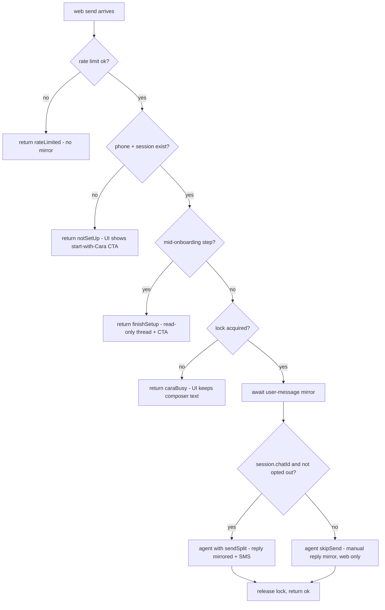
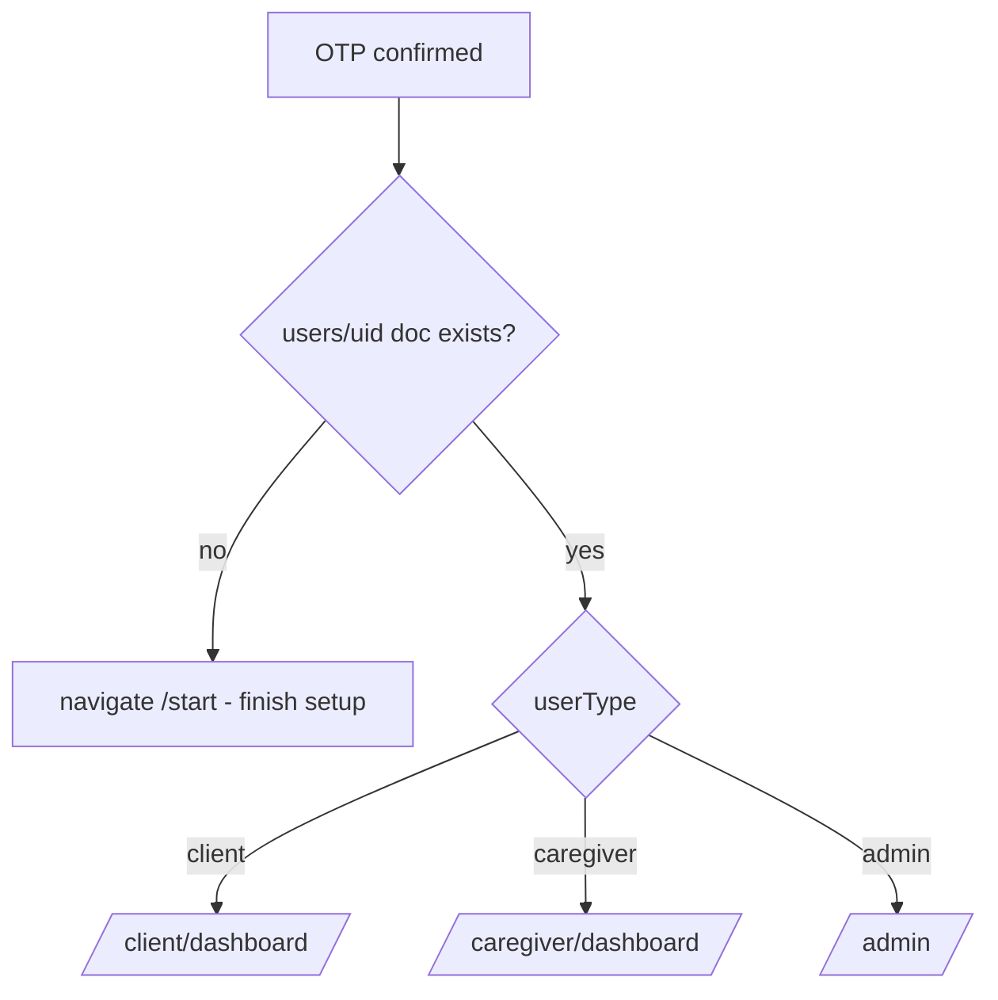

# feat: Tomo-style web shell, unified Cara web chat, phone-only login

## Summary

Give the web app a tomo.ai-style top-tab shell on both dashboards with a Chat tab as the centerpiece: a live two-way conversation with Cara that is the *same thread* the user has over SMS/iMessage. Consolidate login onto the existing phone-OTP page so signup and login are both phone-number-only (poke.com-style), removing all email/password/Google surfaces after a phone-link migration protects existing accounts.

---

## Problem Frame

Cara is the product's primary interface, but she only lives in the user's SMS app. The web app already *mirrors* Cara's SMS/iMessage conversations into Firestore (`threads/cara_{uid}` via `functions/src/linq/threadMirror.ts`), yet no web surface renders them, and there is no way to reply from the web. Navigation is a conventional dropdown top bar per role rather than the flat, chat-centered tab bar competitors like tomo.ai use.

Meanwhile auth is split-brained: signup is phone-only (`/start`), and a poke-style phone-OTP login already exists at `/login`, but legacy email/password + Google logins remain live at `/client/login` and `/caregiver/login`, route guards still redirect there, and the OTP page's post-login `navigate('/dashboard')` hits a route that doesn't exist (404).

Founder decisions (2026-07-02): one thread everywhere (web replies also delivered over SMS/iMessage); hard cutover to phone-only login; top tabs on both client and caregiver dashboards.

---

## Requirements

**Navigation shell**

- R1. Desktop shows a persistent tomo-style top-tab bar (flat centered tabs, no dropdown groups for primary destinations) on both the client and caregiver apps; a "Cara" chat tab is first-class in both.
- R2. Mobile keeps a bottom tab bar; the Cara tab is reachable there too. All ~28 pages that embed nav today keep it without per-page edits.

**Unified Cara web chat**

- R3. A signed-in user with a Cara session sees their full Cara history (SMS, iMessage, and web turns) in the Chat tab, live-updating while open.
- R4. A message sent from the web runs the same Cara agent brain, and Cara's reply lands in the web thread AND is delivered over SMS/iMessage whenever the user has a LINQ chat.
- R5. A message the user texts from their phone while the tab is open appears in the web thread within seconds (existing inbound mirror; verified, not rebuilt).
- R6. Web sends are serialized with SMS turns via the same per-phone processing lock, rate-limited per user, and every failure state (rate-limited, Cara busy, agent error) renders as designed UI, never a raw error or a silently unanswered bubble.
- R7. Users who can't chat yet — no phone/session, mid-onboarding, or opted out (STOP) — see designed states with a clear next step instead of raw callable error strings.
- R8. Cara thread messages cannot be created, edited, or deleted from the browser; the only client-side thread write allowed is clearing the unread counter.

**Phone-only login**

- R9. `/login` (phone OTP) is the only login. Email/password and Google sign-in surfaces are removed; every legacy auth route redirects to `/login`; every in-app entry point (guards, modals, footer links, `handleNavigation` cases) points at `/login`.
- R10. Post-OTP redirect is role-aware (client → `/client/dashboard`, caregiver → `/caregiver/dashboard`, admin → `/admin`); a user with no `users` doc is routed to `/start`, never to a dashboard via the context's default-`'client'` fallback.
- R11. Before the cutover deploys, every existing email-provider account with a phone on file (admins included) has the phone provider linked to its uid so OTP login lands on the same account; phoneless accounts are enumerated for manual support follow-up.

---

## Key Technical Decisions

- **Extend the existing `chatWithCara` callable rather than client Firestore writes + trigger.** `v1-chatWithCara` (`functions/src/index.ts:386`) already auth-gates, rate-limits, resolves phone → `agent_sessions`, and runs `runQaAgent({skipSend: true})`. Server-mediated send lets us hold the per-phone lock, enforce mirror ordering, and keep thread writes server-only. A client-write + trigger design would leave the forgeable-rules hole open and lose the synchronous error surface.
- **Reply delivery: run the agent *without* `skipSend` when `session.chatId` exists.** `sendSplit → sendMessage` then delivers over LINQ and auto-mirrors the reply into the web thread in one shot (`functions/src/linq/client.ts:469-483`). Fall back to `skipSend: true` + one manual mirror when there is no LINQ chat or the user opted out. Manual reply-mirroring on the non-skipSend path is forbidden (double-write).
- **Ordered send invariant** (the callable's contract): rate-check → opt-out check → onboarding-step guard → claim `claimInboundProcessing(phone)` → *await* the user-message mirror → run agent → mirror reply only on the `skipSend` branch → release lock. Rate-limit and guard rejections happen *before* any mirror so the thread never shows an unanswered user bubble for a rejected send.
- **Web chat reads `threads/cara_{uid}`, separate from the `chatRooms` inbox.** The person-to-person inbox (`components/InboxView.tsx`) stays on `chatRooms`; the Cara tab is its own surface on the `threads` model the mirror already writes. The dormant `threads` client API in `services/api.ts:1664-1789` is resurrected for it. Merging the two chat systems is explicitly deferred.
- **Cara chat is exempt from the inbox identity/membership gates.** SMS conversations with Cara have no such gate; the web view of the same conversation must not add one. (`hooks/useAccessGates.ts` / `useCaregiverGate.ts` stay untouched and inbox-only.)
- **Navigation is edited in place, no layout route.** `components/client/ClientNavigation.tsx` and `components/caregiver/CaregiverTopNav.tsx` are embedded per-page across ~28 pages; restyling those two components swaps the shell everywhere with the lowest blast radius. The shell follows the light dashboard token system from `context/ui-context.md` (`primary-*`, `neutral-*`), not the dark `#0a0a0a` Cara auth island.
- **Hard cutover with a pre-cutover phone-link migration.** Firebase phone-OTP signs into the auth user that owns that `phoneNumber` — or mints a new uid if none does. Since all data is uid-keyed, the migration links the phone provider onto existing email-provider accounts via Admin SDK (`updateUser`), normalizing phones to E.164, so the same uid survives the cutover. Legacy auth routes become redirects to `/login`, not deletions (bookmarks, in-flight emails).
- **Firestore rules make `isCaraThread` threads server-only.** Participants can currently create messages with `senderId: 'cara'` and edit/delete any message (`firestore.rules:255-260`). For Cara threads: message create/update/delete denied to clients; thread-doc update allowed only when the change is limited to `unreadCount`.
- **Caregivers get the Cara tab in v1** by fixing the two known gaps rather than hiding it: `chatWithCara` passes `userType`/`caregiverId` from the session, and caregiver `agent_sessions` get `userId` backfilled (finalization already resolves `authUid` — `functions/src/agents/onboardingConversation.ts:3046` — it just never writes `userId`).

---

## High-Level Technical Design

Directional guidance for review — not implementation specification.

### Unified-thread send path (web → Cara → everywhere)

```mermaid
sequenceDiagram
  participant UI as Cara chat tab (web)
  participant CF as v1-chatWithCara
  participant SS as agent_sessions/{phone}
  participant TH as threads/cara_{uid}
  participant QA as runQaAgent
  participant LQ as LINQ (SMS/iMessage)

  UI->>CF: send(text)
  CF->>CF: rate check (per-uid sliding window)
  CF->>SS: load session; opt-out + onboarding guards
  CF->>SS: claimInboundProcessing(phone)
  CF->>TH: mirror user message (awaited)
  CF->>QA: run agent (skipSend=false when chatId exists)
  QA->>LQ: sendSplit → sendMessage
  LQ-->>TH: reply auto-mirrored inside sendMessage
  LQ-->>LQ: deliver to phone (SMS/iMessage)
  CF->>SS: release lock
  CF-->>UI: status (reply arrives via thread listener)
```

An inbound SMS takes the mirror path that already exists (`webhooks.ts` → `mirrorToWebThread`), so both transports converge on the same `threads/cara_{uid}/messages` stream the tab subscribes to, and both agent paths share `agent_conversations/{phone}` history — one brain, one thread.

### `chatWithCara` decision gates



### Post-OTP redirect resolution



The redirect reads `users/{uid}` directly rather than trusting `CareConnexContext`, whose missing-doc fallback defaults to `'client'` (`context/CareConnexContext.tsx:77-79`).

---

## Implementation Units

### U1. Server-only Cara threads in Firestore rules

- **Goal:** Nobody can forge, edit, or delete Cara-thread messages from a browser; the only client write left is clearing unread.
- **Requirements:** R8
- **Dependencies:** none (ships first; the web tab is built against the hardened rules)
- **Files:** `firestore.rules`; rules test if a harness exists (check `tests/` — otherwise verification is via emulator/manual matrix)
- **Approach:** In the `threads/{threadId}` match block, branch on `resource.data.isCaraThread == true`: deny client create of such threads, deny message create/update/delete in the subcollection, and allow thread-doc `update` only when `request.resource.data.diff(resource.data).affectedKeys().hasOnly(['unreadCount'])`. Non-Cara threads keep current behavior.
- **Patterns to follow:** existing participant checks at `firestore.rules:233-262`; default-deny at the bottom of the file.
- **Test scenarios:**
  - Participant reads `threads/cara_{uid}` and its messages → allowed.
  - Participant creates a message with `senderId: 'cara'` in a Cara thread → denied.
  - Participant creates a message with their own uid as sender in a Cara thread → denied (server-only now).
  - Participant updates a Cara thread doc changing only `unreadCount` → allowed; changing `unreadCount` + `contactName` → denied.
  - Participant creates/edits messages in a normal (non-Cara) thread → unchanged from today.
  - Non-participant reads a Cara thread → denied.
- **Verification:** rule matrix passes against the emulator (or documented manual check); Admin SDK writes from `threadMirror` are unaffected (Admin SDK bypasses rules).

### U2. `chatWithCara` v2 — unified send pipeline

- **Goal:** A web send is a first-class Cara turn: serialized with SMS, mirrored in order, replied to on both web and SMS/iMessage, correct persona per role, with typed failure statuses.
- **Requirements:** R4, R6, R7 (server half), R3 (write side)
- **Dependencies:** U1
- **Files:** `functions/src/index.ts` (the callable), `functions/src/linq/threadMirror.ts` (export an awaited single-message mirror if the current fire-and-forget shape doesn't fit), `functions/src/utils/sessionState.ts` (reuse lock helpers), new test `functions/src/__tests__/chatWithCara.test.ts`
- **Approach:** Implement the ordered send invariant from Key Technical Decisions. Return a typed status union (`ok | rateLimited | notSetUp | finishSetup | caraBusy | error`) instead of prose-only replies so the UI renders designed states (R7). Pass `userType: "caregiver"` + `caregiverId` into `runQaAgent` when `session.userType === "caregiver"`. Opted-out users get the `skipSend` branch (web keeps working; SMS leg paused) plus an `optedOut` flag in the response for the banner. On agent error after the user message mirrored, release the lock and return `error` with the client-generated message id so the UI can offer retry without re-mirroring.
- **Execution note:** extend the existing rate-limit-then-reply structure at `functions/src/index.ts:386-461`; don't rewrite it.
- **Patterns to follow:** lock claim/retry loop in `functions/src/linq/webhooks.ts:579-606`; `web_{uid}` rate-limit pattern already in the callable; phone-ownership check pattern from `createWebOnboardingSession` (`context.auth.token.phone_number`) where phone is taken from auth rather than the `users` doc when available.
- **Test scenarios:**
  - Happy path with `chatId`: user message mirrored before agent runs; reply produced; `sendMessage` path invoked (mock LINQ); exactly one mirror write per message (no manual reply mirror on this branch).
  - No `chatId` / opted out: agent runs with `skipSend: true`; reply mirrored manually exactly once; response carries `optedOut` when applicable.
  - Rate limit exceeded: returns `rateLimited`; zero thread writes.
  - Mid-onboarding session (`onboardingStep` set, e.g. `caregiver_credentials`): returns `finishSetup`; agent not invoked; zero thread writes.
  - No phone / no session: returns `notSetUp`; zero thread writes.
  - Lock held by a concurrent SMS turn: retries then returns `caraBusy`; zero agent invocations.
  - Caregiver session: `runQaAgent` receives `userType: "caregiver"` and `caregiverId`.
  - Agent throws: lock released; `error` status; user message remains mirrored (documented, UI handles via U4 retry affordance).
- **Verification:** unit tests pass; manual smoke on deployed function — web send appears on the tester's phone as an SMS/iMessage from Cara and both bubbles show in Firestore.

### U3. Caregiver session `userId` backfill

- **Goal:** Caregiver Cara threads mirror like client threads — every `agent_sessions` doc for a finalized caregiver carries the auth uid.
- **Requirements:** R3, R4 (for caregivers)
- **Dependencies:** none (parallel with U2; U2's caregiver path needs it live to be useful)
- **Files:** `functions/src/agents/onboardingConversation.ts` (finalization writes `userId` alongside `caregiverId`), new one-time migration in `functions/src/migrations/` (backfill existing caregiver sessions by resolving `admin.auth().getUserByPhoneNumber`), `functions/src/data/contract.ts` (register any new web-read path per the Cara↔web collection contract)
- **Approach:** Two writes: (a) forward-fix at finalization where `authUid` is already resolved (`onboardingConversation.ts:3046` writes the `users` parity doc but `updateSession` at `:3058` omits `userId`); (b) one-time migration over `agent_sessions` where `userType == "caregiver" && !userId`, resolving uid by phone, skipping unresolvable ones with a logged report. Follow the existing migration conventions in `functions/src/migrations/`.
- **Test scenarios:**
  - Finalization writes both `caregiverId` and `userId` on the session.
  - Migration sets `userId` for a caregiver session whose phone has an auth user.
  - Migration skips (and reports) sessions with no matching auth user; never overwrites an existing `userId`.
  - After backfill, an outbound Cara SMS to that caregiver mirrors into `threads/cara_{uid}` (existing `threadMirror` resolution now finds the uid).
- **Verification:** dry-run mode output reviewed before live run (mirror the `migrate:*:dry` convention); spot-check one real caregiver thread appears.

### U4. Cara chat tab UI

- **Goal:** The web Chat tab renders the unified thread: history, live updates, optimistic send, typing state, and designed states for every non-`ok` status.
- **Requirements:** R3, R5, R6, R7 (UI half)
- **Dependencies:** U1, U2 (statuses), U3 (caregiver threads exist)
- **Files:** new `components/chat/CaraChat.tsx` (+ subcomponents as needed), `services/api.ts` (resurrect/adapt the dormant `threads` subscription API at lines 1664-1789), `App.tsx` (routes `/client/chat` and `/caregiver/chat` behind the existing role guards), new test `components/chat/CaraChat.test.tsx`
- **Approach:** Subscribe to `threads/cara_{uid}/messages` ordered by `createdAt`; render Cara vs user bubbles (thread doc already carries `contactName`/avatar). Send calls `v1-chatWithCara`; message appears optimistically from local state keyed by a client-generated id and reconciles when the mirrored doc arrives (never written to Firestore by the browser — U1 forbids it). Composer disabled with a typing indicator while the callable is in flight. Status → UI: `rateLimited` inline notice (client-side only, not persisted); `caraBusy` keeps composer text; `notSetUp`/`finishSetup` empty-state with "text Cara to get set up" CTA (reuse the `/start` handoff, `LINQ_PHONE_NUMBER` prefill from `createWebOnboardingSession`); `optedOut` banner ("SMS paused — you texted STOP"); `error` retry affordance reusing the same client message id. On tab focus, clear `unreadCount` via the U1-permitted update. Render timestamps from message `createdAt`, not the thread's locale-string `lastMessageTime`.
- **Patterns to follow:** subscription/cleanup and message-list rendering in `components/InboxView.tsx`; ui-context.md tokens (light theme, `primary-*`); 44px touch targets and 16px input font per mobile rules. Do not copy the inbox's identity/membership gates.
- **Test scenarios:**
  - Thread with mixed `source: 'cara_sms'` and web messages renders in `createdAt` order with correct bubble sides.
  - Send → optimistic bubble appears; when the mirrored doc arrives with the same client id, no duplicate bubble.
  - Callable returns `rateLimited` → notice renders, optimistic bubble removed, nothing persisted.
  - Callable returns `notSetUp` → empty state with CTA; composer hidden.
  - Callable returns `error` → bubble marked failed with retry; retry does not create a second user bubble.
  - New message doc arriving via listener while tab open (simulating an SMS turn) renders without reload.
  - Tab focus zeroes `unreadCount`.
- **Verification:** vitest suite passes; manual end-to-end — text Cara from a phone, watch it land on the open tab; reply on web, watch it arrive as SMS.

### U5. Tomo-style top-tab shell (both roles)

- **Goal:** Desktop nav on both apps becomes a flat centered tab bar with Cara chat as a first-class tab; mobile bottom bars gain/replace tabs accordingly; all embedding pages inherit it.
- **Requirements:** R1, R2
- **Dependencies:** U4 (the tab needs a destination; can land behind a hidden route before this)
- **Files:** `components/client/ClientNavigation.tsx`, `components/caregiver/CaregiverTopNav.tsx`, `hooks/useUnreadMessageCount.ts` (add the Cara thread's `unreadCount` to the badge source)
- **Approach:** Rework the desktop bars from dropdown-groups into tomo-style flat tabs — client: Chat | Find Care | My Care | Calendar (+ right cluster: notifications, avatar menu holding Payments/Membership/Settings); caregiver: Chat | Jobs | Bookings | Calendar (+ right cluster). "Messages" (person-to-person inbox) moves into the right cluster or a secondary position — Cara chat and the human inbox are distinct destinations and both stay reachable. Mobile: replace the current "Messages"/"Chat" bottom slot with Cara chat and move the human inbox into "More", keeping ≤5 slots. Keep the sticky `h-16` header (InboxView's `h-[calc(100vh-64px)]` depends on it), active-state conventions (`startsWith` route matching), and the `AUTH_PATHS` suppression list updated to `/login`. Exact tab labels/ordering are directional — finalize during implementation against the tomo reference.
- **Patterns to follow:** existing active-state and route-constant patterns inside the two components; ui-context.md tokens; do not introduce a layout route (per-page embedding stays).
- **Test scenarios:**
  - Each tab navigates to its route and shows active state on that route and its subroutes.
  - Cara tab shows the unread badge when the thread's `unreadCount` > 0 and clears after tab focus.
  - Mobile bottom bar renders ≤5 items on both roles; "More" drawer still exposes everything displaced.
  - Nav renders correctly on a page that fetches its own user (client) and one using context (caregiver) — the two components' differing data sources still work.
- **Verification:** visual pass across a sample of embedding pages (dashboard, inbox, calendar, a caregiver page) at mobile and desktop widths; no page lost its nav (grep embeds against the routed page list).

### U6. Phone-link migration for existing accounts

- **Goal:** Every existing email-provider account with a phone on file (admins included) can OTP-login into the *same uid*; phoneless accounts are enumerated for support.
- **Requirements:** R11
- **Dependencies:** none — but MUST complete in production before U7/U8 deploy
- **Files:** new `functions/src/migrations/linkPhoneProviders.ts` (or a script under `scripts/` following the `migrate:*` convention)
- **Approach:** Iterate `users` docs: normalize `phone` to E.164; for accounts whose auth user has an email provider but no phone provider, `admin.auth().updateUser(uid, { phoneNumber })`. Handle `auth/phone-number-already-exists` by reporting the collision (two accounts claiming one phone — manual resolution, do not auto-merge). Output a report: linked / already-linked / collision / no-phone. Dry-run mode first. Also normalize `users.phone` values that were stored formatted (legacy web signup) so `chatWithCara`'s phone → `agent_sessions` lookup works for them.
- **Test scenarios:**
  - Email-provider user with valid 10-digit formatted phone → linked, phone normalized to E.164 in the `users` doc.
  - User already having a phone provider → skipped, reported as already-linked.
  - Two users docs sharing one phone → collision reported, neither modified.
  - User with no phone → reported in the no-phone list, untouched.
  - Dry-run mode writes nothing.
- **Verification:** dry-run report reviewed by founder before live run; after live run, a known email-era test account completes phone-OTP login and lands on its existing data.

### U7. Post-OTP role-aware redirect and login-page fixes

- **Goal:** OTP login lands every role on the right surface, and the login page's known rough edges are fixed.
- **Requirements:** R10
- **Dependencies:** U6 in production
- **Files:** `components/auth/LoginPage.tsx`, `App.tsx` (guards), test `components/auth/LoginPage.test.tsx`
- **Approach:** After `confirmation.confirm`, read `users/{uid}` directly (not context, whose missing-doc fallback is `'client'`) and route per the redirect flowchart; missing doc → `/start`. Fix while in the file: recreate the reCAPTCHA verifier after a failed send (a consumed verifier can't be reused), make resend re-send without bouncing back to the phone step, and map raw Firebase error codes to friendly copy. Switch to the shared `getOrCreateRecaptchaVerifier` helper the onboarding flow uses if compatible.
- **Test scenarios:**
  - OTP confirm with `userType: 'client'` → `/client/dashboard`; `'caregiver'` → `/caregiver/dashboard`; `'admin'` → `/admin`.
  - OTP confirm with no `users` doc → `/start`.
  - Failed code send → retry send succeeds (verifier recreated).
  - Resend stays on the OTP step.
  - `auth/too-many-requests` renders friendly copy, not the raw code.
- **Verification:** vitest passes; manual OTP login as one account per role.

### U8. Remove legacy auth surfaces and repoint every entry point

- **Goal:** Phone OTP is the only visible login; all legacy routes redirect; email/password/Google code paths are gone.
- **Requirements:** R9
- **Dependencies:** U6 in production, U7
- **Files:** `App.tsx` (guards `ClientRoute`/`CaregiverRoute`/`AdminRoute` → `/login`; legacy routes → `<Navigate to="/login" replace />`; `handleNavigation` cases; drop dead imports), delete or gut `components/ClientLogin.tsx`, `components/CaregiverLogin.tsx`, `components/ForgotPassword.tsx`, `components/ClientSignup.tsx`, `components/CaregiverApply.tsx`, `components/LoginPage.tsx` (dead, unrouted), `components/landing/LoginModal.tsx` (+ its six mount sites: LandingView, HowItWorks, TrustAndSafetyPage, FamilyFAQ, HelpCenter, HelpPage → `navigate('/login')`), `components/landing/Footer.tsx`, `lib/firebase.ts` (remove `googleProvider`), `services/api.ts` (remove `login`/`signup`/`signInWithGoogle`/`sendPasswordResetEmail` client methods), `components/caregiver/CaregiverTopNav.tsx` (`AUTH_PATHS`)
- **Approach:** Routes become redirects, not 404s — `/client/login`, `/caregiver/login`, `/client/forgot-password`, `/caregiver/forgot-password`, `/client/apply`, `/caregiver/apply-web` all `Navigate` to `/login` (in-flight password-reset emails and bookmarks land somewhere sane). Remove the `v1-sendPasswordResetEmail` caller client-side; the function itself can be retired in a later cleanup. `npm run build` runs `tsc --noEmit`, so every dangling import must go in the same change.
- **Test scenarios:**
  - Each legacy route renders the OTP login (redirect works).
  - Unauthenticated visit to a `ClientRoute`/`CaregiverRoute`/`AdminRoute` page redirects to `/login`.
  - Landing page / help pages "Log In" affordances navigate to `/login` (no modal).
  - Repo-wide grep: zero remaining references to `signInWithEmailAndPassword`, `createUserWithEmailAndPassword`, `signInWithGoogle`, `client-login`, `caregiver-login` navigation cases.
  - Build passes (`tsc --noEmit` catches dangling imports).
- **Verification:** e2e smoke of the auth funnel: landing → Log In → OTP → dashboard, per role.

---

## Scope Boundaries

**Deferred to Follow-Up Work**

- Family-group web sends mirroring to *all* group members' threads (v1: a member's web send is a 1:1 turn mirrored to their own thread; group SMS mirroring to all members continues as today).
- Web "STOP"/opt-out toggling — the SMS keyword fast-path stays SMS-only; web shows the opted-out banner.
- Merging the `chatRooms` and `threads` chat systems into one model.
- Retiring the server-side `v1-sendPasswordResetEmail` function and other dead auth backend code.
- Deleting the broader legacy top-level components (`components/Chat.tsx`, top-level `ClientDashboard.tsx`, etc.) beyond the auth surfaces U8 touches.
- Full caregiver identity-model unification (phone-keyed legacy `caregivers` docs) beyond the U3 session backfill — remains the tracked follow-up in `context/progress-tracker.md`.
- Streaming/token-by-token Cara replies on web (v1 is request/response with a typing indicator).

**Outside this product's identity**

- A native iMessage app/extension or Apple Messages for Business integration — the blue bubble comes from the existing LINQ line; the web app never talks to Apple directly.
- Keeping any email/password login path (founder decision: hard cutover).

---

## System-Wide Impact

- **Auth boundary:** U6-U8 change how every user enters the product. The migration order is a hard sequencing constraint: U6 must complete in production before U8 deploys, or email-era users phone-login into fresh empty uids.
- **Firestore rules:** U1 tightens an existing allowance; any other feature writing to `threads` from the client (none found today — the client `threads` API is dormant) would break.
- **Cara turn concurrency:** web sends now contend for the same per-phone lock as SMS turns; SMS latency is unaffected (lock hold time unchanged), but a long web agent turn can make a simultaneous SMS turn wait — same as two rapid SMS messages today.
- **Functions deploy:** this adds no new env vars but touches the functions bundle — respect `FUNCTIONS_DISCOVERY_TIMEOUT` and never deploy with a partial `functions/.env` (live secrets are out-of-band and a partial-env deploy wipes them; see `docs/runbooks/launch-config-baseline.md`).
- **Data contract:** new web-read paths on `threads` should be registered in `functions/src/data/contract.ts` ("Cara must write where the web reads"), enforced by `tests/contractCollections.test.ts`.

---

## Risks & Dependencies

- **Phone collisions in the link migration (U6).** Two accounts sharing a phone can't both own it in Firebase Auth. Mitigation: report-don't-merge; founder resolves manually before cutover.
- **Phoneless legacy accounts are locked out at cutover** (founder-accepted). Mitigation: U6's no-phone report becomes the support outreach list before U8 ships.
- **SMS cost increase:** every web reply also sends SMS/iMessage segments. Existing outbound rate limits and the circuit breaker still apply; monitor LINQ spend after launch.
- **Web sends of opted-out users silently skip SMS** — handled by design (S1 state), but the opted-out banner copy must be clear or users will think Cara is broken.
- **`sendMessage` mirrors before the LINQ send resolves**, so a reply can show on web while the SMS leg queued/failed. Accepted for v1 (the queue drains within a minute); revisit if delivery-status surfacing is ever needed.
- **Nav restyle blast radius:** ~28 pages embed the two nav components; a layout regression shows everywhere at once. Mitigation: U5's visual pass checklist across representative pages.

---

## Acceptance Examples

- AE1. **One thread everywhere.** Given a client with an active Cara SMS thread, when they send "book maria for friday" from the web Chat tab, then the message and Cara's reply both appear in the web thread, and the same reply arrives on their phone as an SMS/iMessage from Cara's number.
- AE2. **Phone-first login continuity.** Given a family account created in the email era whose phone was linked by the U6 migration, when they enter that phone at `/login` and confirm the OTP, then they land on `/client/dashboard` with all their existing appointments and care team intact (same uid).
- AE3. **Mid-onboarding caregiver.** Given a caregiver whose session is at a `caregiver_*` onboarding step, when they open the web Chat tab, then they see their history read-only with a "finish setup over text" CTA, and sending is disabled.
- AE4. **Simultaneous turns.** Given the user texts Cara from their phone while a web send is mid-flight, then the second turn waits on the per-phone lock (or returns "Cara is still replying" on web) and no session state is clobbered — both turns eventually appear in order.

---

## Sources & Research

- `functions/src/index.ts:386-461` — existing `chatWithCara` callable (auth, rate limit, `skipSend` agent run) that U2 extends.
- `functions/src/linq/threadMirror.ts` + `functions/src/linq/client.ts:469-483` — mirror mechanics; outbound mirroring lives *inside* `sendMessage`, which is what makes the no-`skipSend` design deliver web + SMS in one shot.
- `functions/src/linq/webhooks.ts:579-734` — inbound pipeline, per-phone lock, inbound mirror site.
- `functions/src/agents/onboardingConversation.ts:3035-3058` — caregiver finalization resolves `authUid` but omits `userId` on the session (U3's forward fix site).
- `services/api.ts:1664-1789` — dormant client `threads` API to resurrect for U4.
- `components/client/ClientNavigation.tsx`, `components/caregiver/CaregiverTopNav.tsx` — the two in-place nav components; no layout route exists.
- `firestore.rules:233-262` — current `threads` rules U1 tightens.
- `context/CareConnexContext.tsx:77-79` — missing-doc default-`'client'` fallback U7 must bypass.
- `docs/runbooks/launch-config-baseline.md` — deploy/env constraints (partial-.env wipe hazard, discovery timeout).
- Founder decisions 2026-07-02: one thread everywhere; hard cutover; both dashboards.
