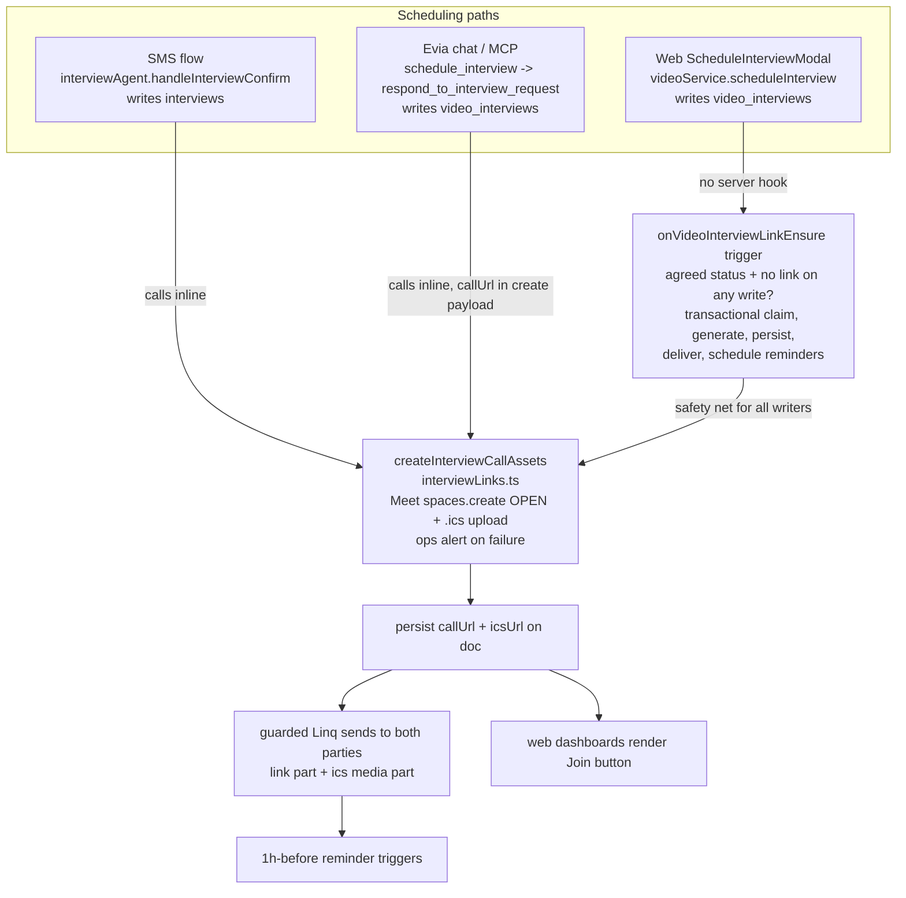

# feat: Working phone-first interview links on every scheduling path

## Summary

Make every client-caregiver interview end with a video link both people can tap from their phone — no account, no app, no waiting room. The link engine moves to the Google Meet REST API (`spaces.create` with `accessType: OPEN`); the dead FaceTime path is deleted; link generation and delivery are centralized so all three scheduling paths (Evia SMS flow, Evia chat/MCP tool, web modal) produce and deliver the same link; the web app shows a Join button; copy that promises a removed "built-in video interview" is corrected.

---

## Problem Frame

The product decision was made in V5: interviews are conducted via call links sent by Evia, not an in-app video room (the Twilio Video room was removed 2026-07-02). But the implementation is broken and fragmented:

1. **The FaceTime generator has never worked.** `functions/src/agents/interviewLinks.ts` POSTs to `facetime.apple.com/api/v1/links` — a fictional endpoint (live-probed during research: HTTP 404). Apple offers no server-side FaceTime link API, and even a real FaceTime link fails our use case: web-joining guests must be admitted by the link creator's Apple device, which a server can never do. Every "FaceTime" attempt silently falls through to Google Meet.
2. **The Google Meet path has an admission trap.** Links are created via the Calendar API under a single OAuth refresh-token user who is the meeting host and never joins. Guests without Google accounts "knock" — and nobody is present to admit them. Both parties can end up stuck at "Waiting to be let in" in an empty room.
3. **Two of three scheduling paths never produce a link at all.** The MCP `schedule_interview` tool (used by Evia's chat agent) creates `video_interviews` docs with no `callUrl` and texts the caregiver "Reply to confirm" with no link; even after `respond_to_interview_request` accepts, no link is generated. The web `ScheduleInterviewModal` → `services/videoService.ts` path likewise writes no link, and its `joinInterview` throws via a stubbed Twilio token generator.
4. **SMS-scheduled interviews are invisible to the tools.** The SMS flow writes to an `interviews` collection while `list_interviews` / `cancel_interview` / `submit_interview_feedback` read `video_interviews` — a family that scheduled by text and asks Evia "when is my interview?" gets nothing.
5. **The product lies about all of this.** `components/HelpPage.tsx`, `components/FamilyFAQ.tsx`, `CLAUDE.md`, and `context/project-overview.md` still promise a "secure, built-in video interview" / "Twilio Video."

---

## Requirements

**Link generation and join experience**

- R1. Interview links are Google Meet links created via the Meet REST API (`spaces.create`) with `accessType: OPEN`, joinable from any phone browser with no Google account, no app install, and no waiting-room admission.
- R2. The FaceTime generation path is deleted, including the `isIMessage` link branching and FaceTime wording in agent copy.
- R3. Each interview gets its own single-use link, sent only to the two participants and persisted on the interview doc.

**Path coverage and delivery**

- R4. Every scheduling path — SMS agent (`interviewAgent.ts`), MCP `schedule_interview` / `respond_to_interview_request`, and the web `ScheduleInterviewModal` — results in `callUrl` and `icsUrl` persisted on the interview record and delivered to both participants over their existing message channel.
- R5. All outbound link/reminder messages go through the guarded Linq seam (`sendMessage` / `sendToPhone` / `trySend`), inheriting dead-letter queueing, circuit breaker, opt-out, and rate limits. (Enforced by the existing `outboundSeam.test.ts` static guard.)
- R6. Interviews scheduled via `video_interviews` get a 1h-before SMS reminder containing the link to both parties, matching the SMS flow's existing reminder behavior.
- R7. A failed link generation raises an ops alert (`admin_alerts` / `createCaraOpsAlert`) — never a silent link-less interview.

**Visibility**

- R8. Web client and caregiver dashboards render a tappable "Join video call" action on interviews that have a `callUrl`.
- R9. `list_interviews` returns the caller's interviews from both `interviews` and `video_interviews`, so "when is my interview?" works regardless of which path scheduled it.

**Truthfulness**

- R10. No user-facing copy, FAQ, agent prompt, or context doc promises an in-app/built-in video room, FaceTime, or Twilio Video; all describe the real behavior (Evia sends a Google Meet link by text).

**Integrity**

- R11. Server-owned link fields (`callUrl`, `icsUrl`, link-generation/delivery markers) and participant identity fields on `video_interviews` cannot be written by client-side participants; web surfaces render a Join action only for `meet.google.com` URLs.

---

## Key Technical Decisions

- **Meet REST API `spaces.create` with `accessType: OPEN`, not the Calendar API.** The Calendar API gives no control over access type, so accountless guests knock into a hostless meeting. `OPEN` removes admission entirely — the confirmed fix for the two-strangers-on-phones case. Requires the `meetings.space.created` OAuth scope (a new consent/refresh token) and verification that the Google account is a Workspace account.
- **Delete FaceTime rather than fix it.** The endpoint is fictional; real server-side FaceTime requires Mac hardware or ToS-gray vendors, and web guests can't be admitted server-side. (Founder decision 2026-07-05; vendor-backed FaceTime recorded as a deferred follow-up.)
- **One shared link builder; a dedicated sibling Firestore trigger as the enforcement point for `video_interviews`.** A helper in `interviewLinks.ts` (`createInterviewCallAssets`) produces `{callUrl, icsUrl}` and owns the failure alert. The MCP tool calls it inline, before the doc write, so the very first caregiver SMS contains the link; a new trigger function (`onVideoInterviewLinkEnsure` in `functions/src/triggers/interviewLinkTrigger.ts`) generates and delivers for any agreed-status doc still missing a link — which is what covers the web modal path (web writes Firestore directly; there is no server hook to call) and any future writer. It is a sibling of `onVideoInterviewWrite`, not an extension of it: the existing trigger is a fast in-app-notification writer that swallows errors (`catch → console.error`), which is the opposite of R7's alert-on-failure semantics; link generation also needs a longer timeout budget (OAuth exchange + Meet API + Storage + two sends), and its early-return control flow (`statusBefore === statusAfter` short-circuit) conflicts with re-fire completion. Leaving `onVideoInterviewWrite` untouched removes the regression surface entirely.
- **Trigger predicate is state-based; idempotency is transactional.** The trigger acts on "after-state is agreed AND link absent" on any write — not on status *transitions* — so a missed invocation self-heals on the next touch (v1 functions do not retry by default). Duplicate protection cannot be a snapshot check (v1 events are at-least-once and invocations can run concurrently): generation is claimed in a transaction (`linkGeneration.claimedAt` sentinel with stale-claim recovery), and delivery state (`linkDeliveredAt`) is tracked separately from generation so a redelivered event *completes* delivery instead of regenerating — at-least-once becomes the retry mechanism rather than a hazard.
- **Keep the two interview collections for now.** Full unification of `interviews` / `video_interviews` / `interview_requests` (conflicting status vocabularies, phone-keyed vs uid-keyed) is a larger migration deferred to follow-up work. This plan makes the split invisible to users: additive fields on `interviews` docs plus a union read in `list_interviews`.
- **Modify existing MCP tools; add none.** The tool count previously exceeded OpenAI's 128-tool cap and broke every turn — link behavior lands inside `schedule_interview` / `respond_to_interview_request`, consistent with `AGENT_NATIVE_EXCLUSIONS.md`'s blessing of bundled auto-notify.
- **Reuse `generateICSFile` / `uploadICSToStorage` unchanged.** The .ics with a 30-minute alarm already works and is transport-agnostic.

---

## High-Level Technical Design

All three scheduling paths converge on one link builder; the trigger guarantees no `video_interviews` doc reaches an agreed state without a link.

Status vocabulary across writers (current state — the trigger must recognize all agreed states):

| Writer | Create status | Agreed status | Notes |
|---|---|---|---|
| Web `videoService.ts` | `requested` | `accepted` (caregiver action) | Only path `onVideoInterviewWrite` currently notifies |
| MCP `schedule_interview` | `scheduled` | `scheduled` (immediate) / `confirmed` (after respond) | Omits `clientName`/`caregiverName`; naive local `scheduledTime` |
| SMS `interviewAgent.ts` | — (writes `interviews`) | `scheduled` | Already generates links; different collection |

Trigger idempotency: a transaction claims generation (`linkGeneration.claimedAt`); `callUrl` and `linkDeliveredAt` are written as separate states so a re-fired event with `callUrl` present but delivery incomplete finishes the sends instead of minting a second Meet space.

---

## Implementation Units

### U1. Rebuild the link engine: Meet REST API, delete FaceTime

- **Goal:** `interviewLinks.ts` produces working, admission-free Meet links; the fictional FaceTime path is gone; failures alert ops.
- **Requirements:** R1, R2, R3, R7
- **Dependencies:** none (do first — everything else builds on a verified link engine)
- **Files:** `functions/src/agents/interviewLinks.ts`, `functions/src/agents/interviewAgent.ts` (call sites and FaceTime/Meet copy), `functions/src/agents/__tests__/interviewLinks.test.ts` (new)
- **Approach:** Remove `generateFaceTimeLink`. Replace `generateGoogleMeetLink`'s Calendar-API body with Meet REST API `spaces.create` (`accessType: OPEN`) via the existing `googleapis` dependency and OAuth2 refresh-token auth. Collapse `generateCallLink` into a `createInterviewCallAssets({title, startTime, durationMinutes, interviewId})` helper returning `{callUrl, icsUrl}` that also owns `.ics` generation/upload and raises an ops alert (`createCaraOpsAlert` or `admin_alerts`) on failure before rethrowing. Update `interviewAgent.ts` call sites: drop `isIMessage` branching, say "Google Meet" in all copy, persist `icsUrl` on the `interviews` doc (currently sent but not stored).
- **Execution note:** Spike first against the live Google account before writing production code — mint a refresh token with the `meetings.space.created` scope, confirm the account is (or can be) a Workspace account, create a space with `accessType: OPEN`, and join it from two phones with no Google accounts. The Meet REST API's consumer-account support is unverified; if it requires Workspace and the account isn't one, stop and surface it (see Risks).
- **Test scenarios:**
  - Happy path: `createInterviewCallAssets` returns a `meet.google.com` URL and a storage `icsUrl`; the space request carries `accessType: OPEN` (assert on the mocked googleapis call).
  - Error path: Meet API failure → helper writes an ops alert and rethrows; no partial doc state.
  - Error path: `.ics` upload failure after successful link creation → `callUrl` still returned, `icsUrl` empty, no throw (link delivery must not die on calendar-attachment failure).
  - Edge: `generateICSFile` output unchanged for the same inputs (guard the alarm/URL lines against regression).
  - Covers R2: no code path references `facetime.apple.com` after the change (assert module has no FaceTime export).
- **Verification:** A real space created by the spike is joinable from an account-less phone browser without knocking; functions transpile clean; new tests green.

### U2. Link generation + delivery for `video_interviews` (MCP inline + Firestore trigger)

- **Goal:** Any `video_interviews` doc that reaches an agreed state gets exactly one link generated, persisted, delivered to both parties, and reminded — regardless of which writer created it.
- **Requirements:** R3, R4, R5, R6, R7
- **Dependencies:** U1
- **Files:** `functions/src/mcp/server.ts` (`schedule_interview`, `respond_to_interview_request`), `functions/src/triggers/interviewLinkTrigger.ts` (new), `functions/src/index.ts` (re-export), `functions/src/utils/toolNotify.ts` (extend for structured link/media parts, or call `sendToPhone` with a `LinqMessage` and map the outcome), `functions/src/mcp/__tests__/interviewTools.test.ts` (new)
- **Approach:** Two layers sharing U1's helper.
  - *Inline in MCP:* `schedule_interview` pre-mints the doc ref (`db.collection("video_interviews").doc()`), passes its id to `createInterviewCallAssets`, and writes `callUrl`/`icsUrl` **in the initial `set()` payload** — the create event the trigger sees is never a link-less agreed doc, so inline and trigger cannot race into two Meet spaces. The caregiver message carries the link (link part + ics media part, following `interviewAgent.ts:419-448`'s send shape) and the tool result carries `callUrl` so the qaAgent hands it to the client in the same turn. While at this write site, normalize `scheduledTime` to a timezone-aware ISO string (client's timezone per the session/preferences pattern, `America/Los_Angeles` fallback) — the trigger's reminder math depends on it. `respond_to_interview_request` accept-branch includes `callUrl` in the client notification.
  - *Trigger safety net:* new `onVideoInterviewLinkEnsure` on `video_interviews/{id}` — predicate is state-based: after-state status in {`accepted`, `confirmed`, `scheduled`} AND link absent, on any write. Generation is claimed via transaction (`linkGeneration.claimedAt` sentinel, stale claims older than ~5 min reclaimable); delivery is tracked separately (`linkDeliveredAt`) so a redelivered or re-fired event completes sends without regenerating. Deliver to both participants' phones (`caregivers` doc / `users` doc / `agent_sessions` lookups per existing patterns) and schedule 1h-before `appointment_reminder` triggers for both parties mirroring `interviewAgent.ts:465-494`. Tolerate docs missing `clientName`/`caregiverName` (MCP docs predate U3) and tz-less `scheduledTime` strings on legacy docs (interpret in client tz, `America/Los_Angeles` fallback — never raw `new Date()`, which parses naive strings as UTC on GCF and would fire reminders ~8h early). `onVideoInterviewWrite` is not modified.
  - *Backfill:* one-time audit at deploy: query `video_interviews` for future-dated agreed-status docs missing `callUrl`; if any exist, touch them (the trigger does the work) or invoke the helper directly, and rewrite naive `scheduledTime` strings to tz-aware ISO in the same sweep. Run via the established non-auto curl-migration pattern; record the count in the deploy checklist. Zero upcoming docs → no backfill needed, but the audit itself is mandatory.
- **Patterns to follow:** `trySend` outcome-in-tool-result (`functions/src/utils/toolNotify.ts:18-49`, already used at `mcp/server.ts:5147`); structured sends `{parts:[{type:"link"...},{type:"media"...}]}` from `interviewAgent.ts`; `scheduleTrigger` from `functions/src/triggers/triggerEngine.ts`; test harness from `functions/src/mcp/__tests__/crudTools.test.ts` (in-memory Firestore + mocked `toolNotify`).
- **Test scenarios:**
  - Happy path: `schedule_interview` → created doc already contains `callUrl`/`icsUrl`; caregiver notification contains the Meet URL; tool result includes `callUrl` and the notification outcome.
  - Happy path: web-shaped doc transitioning `requested`→`accepted` → trigger generates link, both parties receive sends, two reminder triggers scheduled.
  - Concurrency: two near-simultaneous agreed-status writes to the same doc → exactly one Meet space, one send set (transactional claim holds).
  - Redelivery: event replayed after `callUrl` persisted but before delivery completed → sends complete, no regeneration.
  - Idempotency: trigger re-fires after its own updates on a fully-delivered doc → no-op.
  - Error path: link generation fails inside the trigger → ops alert written, claim released or expires, no crash-loop.
  - Error path: caregiver has no phone → tool still succeeds with `notification.sent: false` and reason, matching current `schedule_interview` semantics.
  - Edge: `respond_to_interview_request` decline → no link generated, no reminders.
  - Edge: legacy doc with naive `scheduledTime` (`2026-07-10T14:00:00`) → reminder scheduled at the correct Pacific-relative instant, not 14:00 UTC.
  - Integration: interview scheduled less than 90 minutes out → no stale pre-start reminder scheduled (mirror `interviewAgent`'s `ninetyMinAway` guard).
- **Verification:** All creation shapes (MCP, web-simulated, decline, concurrent, replayed) behave per scenarios in tests; `onVideoInterviewWrite`'s existing characterization is untouched; no direct Linq posts outside `linq/client.ts` (`outboundSeam.test.ts` still green); deploy-time audit query result recorded.

### U3. MCP writer parity and status/type fixes

- **Goal:** `video_interviews` docs written by MCP are complete and consistent enough for the trigger, the web UI, and the type system.
- **Requirements:** R4, R10
- **Dependencies:** U2
- **Files:** `functions/src/mcp/server.ts`, `types.ts` (`VideoInterviewStatus`), `functions/src/agents/qaAgent.ts` (prompt copy for `schedule_interview` / interview guidance), `functions/src/agents/launchActionParity.ts`, `context/capability-map.md`
- **Approach:** `schedule_interview` writes `clientName` and `caregiverName` (fixes `onVideoInterviewWrite`'s dependence on them; `scheduledTime` normalization already landed with U2). Add `confirmed` and `declined` to `VideoInterviewStatus`. Update the `schedule_interview` tool description and qaAgent prompt lines to say the video link is sent automatically (keeps prompt truthful; if Evia's copy ever promises a later send, it must go through `recordCommitment` — prefer synchronous delivery so no promise is needed). Fix the parity registry concretely: the `respond_to_interview_request` row at `launchActionParity.ts:421-428` claims `collection: "appointments"` (should be `video_interviews`), and there is no `schedule_interview` row at all — add it. Mirror both in `context/capability-map.md`.
- **Test scenarios:**
  - Happy path: `schedule_interview` doc includes both names.
  - Edge: `preferredDate`/`preferredTime` interpreted in the client's timezone — assert a known input maps to the expected UTC instant (covers the U2 write-site change).
  - Regression: `parity.test.ts` green after registry edits.
- **Verification:** `tsc --noEmit` clean in both workspaces; parity and capability guards green.

### U4. Web join surface and dead video-room code removal

- **Goal:** Web users see and can tap the interview link; the throwing Twilio remnants are gone.
- **Requirements:** R8, R2
- **Dependencies:** U2 (docs must carry `callUrl`)
- **Files:** `components/client/ClientDashboard.tsx`, `components/client/PostsPage.tsx`, `components/caregiver/CaregiverCalendarPage.tsx`, `components/caregiver/JobBoard.tsx`, `services/videoService.ts`, `types.ts` (`VideoInterview` gains `callUrl?`/`icsUrl?`, drops `roomName` at the type level if unused)
- **Approach:** Each surface already has a live `video_interviews` listener, but their status filters predate the MCP vocabulary and would never show MCP-path interviews: `ClientDashboard.tsx:684-685` (duplicated at ~1565) buckets only `requested`/`pending`/`accepted`/`completed`; `CaregiverCalendarPage.tsx:201` filters to `['requested','accepted','in-progress','completed']`; `videoService.getUpcomingInterviews` (:259) matches only `scheduled`. Define one shared agreed/upcoming status set (`accepted | scheduled | confirmed`) and update every listed filter to it. Render a "Join video call" link/button (opens `callUrl` in a new tab) on interview cards when `callUrl` is present and status is in the set — and only when the URL is a `meet.google.com` link (defense-in-depth against a forged `callUrl`, see U7). Delete `videoService.joinInterview`, the stubbed `generateAccessToken`, and the `roomName` write in `scheduleInterview`. No new scheduling UX — `ScheduleInterviewModal` keeps writing `requested`; the U2 trigger takes it from there.
- **Test scenarios:**
  - Happy path: interview card with `callUrl` renders the Join action pointing at the URL.
  - Happy path per surface: a `confirmed` doc with `callUrl` actually appears on ClientDashboard, CaregiverCalendarPage, and in `getUpcomingInterviews` (guards the bucket fix — a Join-button-renders test alone would pass while the card never appears).
  - Edge: interview without `callUrl` (pre-acceptance `requested` state) renders no Join action and no broken affordance.
  - Edge: cancelled/completed interviews render no Join action.
  - Edge: `callUrl` pointing at a non-`meet.google.com` host renders no Join action.
- **Verification:** Frontend `tsc --noEmit` and existing component tests green; manual click-through of a seeded interview doc shows the button on client and caregiver views.

### U5. SMS-flow visibility: union reads and dead-query fix

- **Goal:** Interviews scheduled by text are visible to `list_interviews` (and thus "when is my interview?"), and the dead `interviews` query in `get_pending_tasks` stops lying.
- **Requirements:** R9
- **Dependencies:** U1 (touches the same `handleInterviewConfirm` write)
- **Files:** `functions/src/agents/interviewAgent.ts`, `functions/src/mcp/server.ts` (`list_interviews`, `get_pending_tasks`), `functions/src/mcp/__tests__/interviewTools.test.ts`
- **Approach:** `handleInterviewConfirm` additionally persists `clientId` (from `agent_sessions.userId`) and `caregiverId` on the `interviews` doc — additive, no reader breaks. `list_interviews` queries `video_interviews` and `interviews` (by `clientId`/`caregiverId`) and merges, labeling each result with its source collection. `cancel_interview` accepts that label and routes the status update to the right collection (today it would return NOT_FOUND for an SMS-flow interview the user just listed). `submit_interview_feedback` stays `video_interviews`-only — the SMS flow has its own post-interview feedback loop (`sendPostInterviewFollowUp` + `pendingInterviewOutcome`). Remove or repair the `get_pending_tasks` query at `mcp/server.ts:3662-3673` (`clientId` + `awaiting_hire_decision` can never match: `interviews` docs are phone-keyed and that status is written nowhere).
- **Test scenarios:**
  - Happy path: client with one SMS-flow interview and one MCP interview → `list_interviews` returns both.
  - Happy path: `cancel_interview` on a listed SMS-flow interview updates the `interviews` doc and notifies the other party.
  - Edge: caregiver-side query returns SMS-flow interviews via the new `caregiverId` field.
  - Edge: legacy `interviews` docs without `clientId` don't crash the union (skipped, not thrown).
  - Regression: `get_pending_tasks` output shape unchanged apart from the removed always-empty `interviews` branch.
- **Verification:** New tests green; `list_interviews` result for a mixed-history user contains both records with correct times.

### U6. Truthful copy and docs sweep

- **Goal:** Every user-facing and contributor-facing surface describes the real interview mechanism.
- **Requirements:** R10
- **Dependencies:** U1-U4 (describe what actually ships)
- **Files:** `components/HelpPage.tsx` (lines ~22, 26, 72, 167), `components/FamilyFAQ.tsx` (~33, 77, 131), `CLAUDE.md` (~17, 56), `context/project-overview.md` (~23, 38), `functions/src/data/contract.ts` (`interviews` note referencing deleted `InterviewConfirmation.tsx`; `video_interviews` "Twilio video" note), `firestore.rules` (stale `InterviewConfirmation.tsx` comment), `context/entity-lifecycle.md` (rows 53-56)
- **Approach:** Replace "built-in video interview — no Zoom link" / "Twilio Video" language with the real story: Evia texts both parties a Google Meet link that opens in the phone browser, plus a calendar invite; on web, a Join button appears on the interview card. Keep the true privacy claim (no personal phone numbers exchanged).
- **Test expectation:** none — copy and documentation changes with no behavioral surface.
- **Verification:** Grep for `Twilio Video`, `built-in video`, `FaceTime`, and `InterviewConfirmation` returns only historical docs (`docs/plans/`, `docs/brainstorms/`, dated reports).

### U7. Protect server-owned link fields in firestore.rules

- **Goal:** Participants cannot forge, strip, or replay the link machinery from the client side.
- **Requirements:** R11, R3
- **Dependencies:** U2 (field names must be settled)
- **Files:** `firestore.rules` (`video_interviews` update rule, currently ~:512-517), rules tests if a harness exists (else covered by U7 verification)
- **Approach:** The current update rule lets either participant modify **any** field. Once `callUrl` drives SMS delivery and renders as a tappable button, that allows: link substitution (a malicious participant writes their own URL that the other side's dashboard renders as "Join"), a duplicate-SMS pump (delete `callUrl` → trigger regenerates and re-sends), and identity corruption (rewrite `clientId`/`caregiverId`, which the read gate and reminder targeting depend on). Constrain participant updates to an allowlist of legitimately client-mutable fields (e.g., `status`, `cancelledBy`, `declinedBy`, `notes`, `updatedAt`) via `request.resource.data.diff(resource.data).affectedKeys().hasOnly([...])`. Server writes use the Admin SDK and bypass rules — the trigger and MCP paths are unaffected.
- **Test scenarios:**
  - Participant update touching only `status`/`cancelledBy` → allowed.
  - Participant update writing or deleting `callUrl`, `icsUrl`, `linkGeneration`, `linkDeliveredAt` → denied.
  - Participant update rewriting `clientId` or `caregiverId` → denied.
  - Admin and server (Admin SDK) writes unaffected.
- **Verification:** Rules deploy passes the emulator suite (or documented manual emulator checks); existing web accept/decline/cancel flows still work end-to-end.

---

## Scope Boundaries

**Non-goals**

- No new video vendor or embedded room (Whereby/Daily/LiveKit) — links are the decided mechanism; embedded rooms are the recorded escape hatch if link reliability disappoints.
- No special handling for `interviewType: "phone"` or `in_person` beyond the existing enum (founder decision 2026-07-05: video link only, keep it simple).
- No changes to interview matching, feedback, hire, or payment flows.

**Deferred to Follow-Up Work**

- Unify `interviews` / `video_interviews` / `interview_requests` into one collection with one status vocabulary (includes reconciling web `api.ts`'s incompatible `interview_requests` statuses and `InterviewOutcome.tsx`'s three-collection probing).
- Vendor-backed native FaceTime links (Blooio/Sendblue) for iPhone users — ToS-gray, paid; revisit only on user demand.
- Post-interview follow-up parity for `video_interviews`-path interviews (the SMS flow's `interview_followup` trigger + fit-feedback loop currently serves only the `interviews` collection).
- Reminder cleanup on cancellation: a cancelled interview's already-scheduled 1h-before reminder still fires. Accepted for now — the SMS flow has the same behavior; fixing it means trigger cleanup in both cancel paths.
- `match_outcomes` backend writer (pre-existing gap noted in the progress tracker; adjacent, not touched here).

---

## Risks & Dependencies

- **Meet REST API may require a Workspace account** (third-party sources say yes; official docs silent). Mitigation: U1's spike is the first action of the whole plan; if the current OAuth account is consumer-grade and can't be upgraded, the fallback is Calendar-API creation plus Workspace admin default of open access — or escalate to the embedded-room follow-up. Nothing else lands until the spike passes.
- **New OAuth scope = new refresh token.** The live `GOOGLE_REFRESH_TOKEN` was consented for Calendar; `spaces.create` needs `meetings.space.created`. Re-consent and rotate the env var out-of-band per the launch-config runbook — never via a partial-`.env` full deploy (live secrets are out-of-band; a partial deploy wipes them).
- **Single refresh token is a single point of failure.** Tokens die on password change, security events, 7-day expiry while the consent screen is in "Testing," or 6 months idle. Mitigation: U1's ops alert fires on `invalid_grant`; consider a dedicated machine-user.
- **`accessType: OPEN` means anyone with the URL can join.** Accepted: one link per interview, sent only to two phones, meetings are short-lived. Do not post links anywhere else (logs redact via the existing `normalizeParts` PII path).
- **Trigger re-entrancy / duplicate sends.** The trigger updates the doc it watches, v1 events are at-least-once, and invocations can run concurrently. The transactional claim + separate delivery state (see KTDs) is the mitigation; the concurrency and redelivery test scenarios in U2 are the proof. A duplicate Meet link SMS is annoying, a send loop is an incident.
- **Mixed `scheduledTime` formats in prod.** Naive local strings (MCP), ISO-with-Z (web), and tz-aware ISO (post-U2) will coexist on legacy docs; parsing naive strings with raw `new Date()` on GCF shifts reminders ~8h. Mitigated by U2's tolerant parsing and the backfill's rewrite sweep; lexicographic ordering in dashboards self-resolves as legacy docs age out.
- **Functions deploys**: raise `FUNCTIONS_DISCOVERY_TIMEOUT` (deploys silently fail at the 10s default; this wave adds a brand-new function, `onVideoInterviewLinkEnsure`, so discovery must succeed) and deploy from `CareConnecxx-main` only.

---

## Operational Notes

- Env: `GOOGLE_CLIENT_ID` / `GOOGLE_CLIENT_SECRET` stay; `GOOGLE_REFRESH_TOKEN` re-minted with the Meet scope (out-of-band in the live env).
- Deploy checklist: run the U2 backfill audit query (future-dated agreed-status `video_interviews` docs missing `callUrl`) and record the count; backfill if nonzero. `firestore.rules` (U7) deploys with its frontend per repo convention.
- After U2 ships, watch `admin_alerts` for link-generation failures and `linq_outbound_queue` for dead-lettered link sends during the first scheduled interviews.
- Update `context/progress-tracker.md` after landing (repo convention).

---

## Sources & Research

- FaceTime: no official link-creation API ([Apple Developer Forums thread 686475](https://developer.apple.com/forums/thread/686475)); `facetime.apple.com/api/v1/links` 404s on live probe; web guests must be admitted by the creator's Apple device ([Apple Support 109364](https://support.apple.com/en-us/109364)).
- Google Meet: guest knocking and mobile-browser join ([Workspace Updates, Jan 2024](https://workspaceupdates.googleblog.com/2024/01/join-a-meeting-without-a-google-account-on-mobile.html)); Meet REST API `spaces.create` + `SpaceConfig.accessType: OPEN` ([spaces reference](https://developers.google.com/workspace/meet/api/reference/rest/v2/spaces)); quotas 100 creates/min/project ([limits](https://developers.google.com/workspace/meet/api/guides/limits)).
- Pattern sanity check: telehealth (Doxy.me) validates SMS-link + browser-join; teams that outgrow consumer links move to Whereby Embedded / Daily — recorded as the escape hatch.
- Key code: `functions/src/agents/interviewLinks.ts` (link engine), `functions/src/agents/interviewAgent.ts:354-505` (the working SMS flow to mirror), `functions/src/mcp/server.ts:5123-5181` (link-less MCP handlers), `functions/src/triggers/notificationTriggers.ts:21-102` (`onVideoInterviewWrite`), `functions/src/utils/toolNotify.ts` (guarded notify pattern), `functions/src/mcp/__tests__/crudTools.test.ts` (test harness), `functions/src/linq/__tests__/outboundSeam.test.ts` (send-seam guard).
