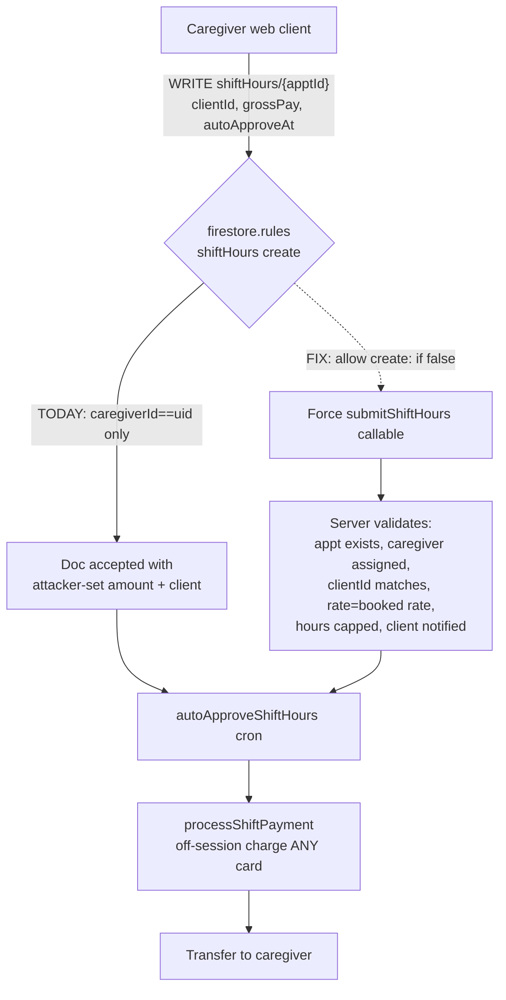
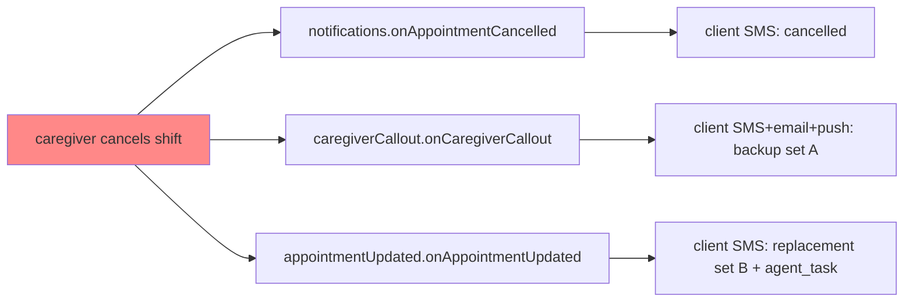

# fix: Launch-Blocker Bug Sweep

## Summary

A parallel 8-agent audit of the Evia platform (agent loop, money paths, security rules,
web frontend, background triggers, config/known-items, plus branding and ONE-VOICE
scanners) surfaced **3 CRITICAL**, **9 HIGH**, and **14 MEDIUM** launch-affecting defects,
concentrated in the money rail and the appointment-trigger fan-out. The classic
agent-loop failure modes (dead-ends, double-replies, webhook double-delivery, stranded
awaiting-steps) were verified already hardened — the new risk is almost entirely in
**billing correctness**, **notification/replacement fan-out**, and **config hygiene**.

This plan fixes everything from CRITICAL down through MEDIUM, plus a batched LOW cleanup
pass, and includes the medical-scope gating the founder approved. It also closes the
operational gaps (cors origin, build OOM, uncommitted deployed waves, dead pager contacts)
that would otherwise block or endanger the launch deploy itself.

**The single most dangerous finding** (U1): a caregiver can fabricate a billable shift
directly from the web client — with an arbitrary `clientId` and `grossPay` — and the
auto-approve cron will silently charge *any* client's card off-session and transfer the
money out. This must be fixed before any real payment method is attached in production.

---

## Problem Frame

Evia is launching a non-medical, SMS-first caregiving marketplace with live payments
(Stripe subscriptions + Stripe Connect payouts), HIPAA-adjacent PII, and an agent-native
onboarding loop. Prior waves hardened onboarding, consent, timezone handling, and the
security-rules baseline. This sweep targets what remains: the billing state machine, the
appointment-event fan-out where multiple Firestore triggers overlap, a handful of
authorization gaps, and launch-config drift.

The findings cluster into six themes, each an implementation phase below:

1. **Billing integrity** — client-controllable charges, transfer-reversal races, wrong
   billing modes/rates, unbounded amounts.
2. **Trigger/notification fan-out** — overlapping cancellation handlers, a dead
   auto-completion filter, notification storms, dead reminder sweeps.
3. **Authorization** — notification-feed injection, an authenticated open mailer.
4. **Medical-scope** — a prescription/doctor-search flow that contradicts the
   non-medical positioning (founder-approved to gate for launch).
5. **Frontend trust** — a fictional support number on 100% of the funnel, role-defaulting
   on transient read failure.
6. **Config & deploy hygiene** — cors origin, build OOM, git drift, dead pager contacts,
   avatar env.

---

## Scope Boundaries

**In scope:** All CRITICAL/HIGH/MEDIUM findings from the audit, a batched LOW cleanup,
medical-scope gating, and launch-deploy config hygiene.

### Deferred to Follow-Up Work
- `video_interviews` grace fallbacks (safe to remove ~07-18) and `api.ts` care-plan legacy
  fallbacks (~07-19) — verified present and harmless; leave until their windows.
- The 1.5%-platform-fee-below-processing-cost pricing observation (U-none) — a business
  decision, not a bug.
- Scale hardening beyond the immediate N+1 fix in U11 (geo-sharding the caregiver roster,
  embedding cache) — flagged, but only the launch-scale slice is planned here.
- Removing repo-root build clutter (`dist2`–`dist5`, deploy logs) — housekeeping, not
  blocking.

### Outside this plan
- Product/positioning decisions beyond the approved medical-scope gate.
- Any new feature work.

---

## High-Level Technical Design

### The billing trust boundary (U1 core)

The fix is to make the timesheet doc **un-writable from the client** and force every
billable shift through the `submitShiftHours` callable, which is the only place that can
validate the appointment relationship, clamp the amount, bill at the *booked* rate, and
guarantee the client is notified before the auto-approve clock starts.

### Cancellation fan-out (U6 core)

Three independently-deployed `onUpdate` handlers all match one cancellation. Fix: elect
`appointmentUpdated` as the sole owner for `cancelledBy === 'caregiver'`; early-return the
other two for that case.

---

## Key Technical Decisions

- **KTD-1: Timesheets become callable-only.** `shiftHours` create rule → `allow create: if
  false`; all billable shifts flow through `submitShiftHours`, which gains full validation.
  Rationale: Firestore rules cannot `get()`-validate the appointment relationship cheaply
  and safely enough; the callable already exists and is the right trust boundary.
- **KTD-2: One owner per appointment-event.** For each appointment status transition, exactly
  one trigger sends user-facing notifications and drives replacement. Others early-return.
  Rationale: overlapping triggers are the root cause of both the cancellation storm (U6) and
  the create storm (U8).
- **KTD-3: Filter crons on fields every writer sets.** Replace `isoDate`/`reminderSent !=`
  /`== null` query predicates (which silently exclude field-absent docs) with `date`+
  in-code filtering, matching the pattern already used by the working sweeps. Rationale: three
  separate dead-sweep bugs share this one Firestore-semantics root cause.
- **KTD-4: Charge idempotency keys carry a reversal generation.** `shift-transfer-${apptId}`
  → `shift-transfer-${apptId}-r${reversalCount}`. Rationale: stable-within-generation keeps
  retries safe while allowing a legitimate re-pay after a reversal.
- **KTD-5: Gate, don't delete, the medical-scope flow.** Disable the prescription/new-Rx/
  doctor-search intents behind a kill switch and re-frame matching copy; preserve the code
  for a later product decision. Rationale: founder approved gating for launch, not a rewrite.
- **KTD-6: Never guess a role on read failure.** Frontend holds in a reconnecting state
  instead of defaulting to `client`. Rationale: role-defaulting paints the wrong dashboard.

---

## Implementation Units

Phases are ordered by launch-risk. **U1–U5 (billing) and U6–U7 (critical triggers) are the
true launch gate**; the rest should ship in the same sweep but are lower blast radius.

### Phase 1 — CRITICAL: billing & data integrity

#### U1. Lock down client-side timesheet fabrication
**Goal:** Make it impossible for a caregiver to create a billable shift with an
attacker-controlled client or amount.
**Requirements:** Audit C1 (CRITICAL).
**Dependencies:** none.
**Files:** `firestore.rules` (shiftHours create block ~673-677), `functions/src/shiftHours.ts`
(`submitShiftHours`, `autoApproveShiftHours` ~681-714, `onShiftHoursApproved` ~794-828),
`functions/src/__tests__/shiftHours*.test.ts`.
**Approach:** Set the `shiftHours` create rule to `allow create: if false` (server-only via
Admin SDK). Move all validation into `submitShiftHours`: `get()` the appointment; verify
`appt.caregiverId === auth.uid`, `appt.clientId === payload.clientId`, appointment exists and
is in a billable status; reject client-supplied `autoApproveAt`/`grossPay`/`payRate` (derive
them server-side); bill at the appointment's booked `rate`. Ensure a "shift submitted"
notification fires to the client from inside the callable so no timesheet exists without the
client being told before the auto-approve clock starts.
**Test scenarios:**
- Direct client `create` of `shiftHours/{x}` is denied by rules (security-rules test).
- `submitShiftHours` with `clientId` ≠ appointment's clientId → rejected.
- `submitShiftHours` for an appointment the caller wasn't assigned to → rejected.
- Client-supplied `grossPay`/`autoApproveAt` are ignored; server derives from booked rate.
- Happy path: assigned caregiver submits → client notified → doc created `pending_client_review`.
**Verification:** No path exists where a `shiftHours` doc reaches `auto_approved` without a
prior client notification and server-validated amount.

#### U2. Fix transfer-reversal race on stale `payment_failed` (H1 + H2)
**Goal:** A stale/redelivered `payment_intent.payment_failed` must not reverse a payout funded
by a later successful charge, and a legitimate reversal must not block re-payment.
**Requirements:** Audit H1, H2 (HIGH).
**Dependencies:** none.
**Files:** `functions/src/stripe.ts` (`handleShiftPaymentIntentFailed` ~1295-1341,
`handleShiftPaymentIntentSucceeded` ~1268-1293), `functions/src/shiftHours.ts`
(`settleShiftTransfer` ~889, add reversal counter).
**Approach:** In both handlers, early-return when `intent.id !== shift.stripeChargeId` (only
act on the intent that actually funded the current shift state). Add a `reversalCount` field
to the shift doc; include it in the transfer idempotency key
(`shift-transfer-${appointmentId}-r${reversalCount}`) so a re-pay after reversal mints a new
transfer instead of returning the already-reversed one within Stripe's 24h window.
**Test scenarios:**
- PI_1 fails after PI_2 succeeds and funds the transfer → failed handler no-ops (id mismatch).
- Legitimate reversal increments `reversalCount`; subsequent re-pay uses new key → new transfer.
- Idempotent within a generation: duplicate succeeded webhook for same intent → single transfer.
**Verification:** Simulated stale `payment_failed` on a paid shift leaves the payout intact.

#### U3. Cap billable hours and amount across all rails (H5)
**Goal:** No shift can bill an implausible number of hours or dollars.
**Requirements:** Audit H5 (HIGH).
**Dependencies:** U1.
**Files:** `functions/src/shiftHours.ts` (`computeTotalHours` ~38-45, `payRate` ~160),
`functions/src/mcp/server.ts` (submit_shift_hours ~5116-5121), `functions/src/linq/routeCaregiver.ts`.
**Approach:** Hard-cap `totalHours` per shift (e.g. ≤ 16–24h) and `grossPay` per shift at a
sane ceiling in the shared computation path; require explicit (non-auto) client approval above
a dollar threshold. Reject `endTime < startTime` (overnight) explicitly rather than producing
negative minutes.
**Test scenarios:**
- 720h span → clamped/rejected, not charged.
- grossPay above ceiling → requires explicit approval, not silent auto-approve.
- Overnight `out < in` → rejected with a clear error, not negative minutes.
**Verification:** Every billable path routes through the capped computation.

#### U4. Bill care-notes at booked rate with validated caregiver rate (H4)
**Goal:** Care-notes billing charges the agreed booked rate, and the caregiver rate field is
bounded and ownership-checked.
**Requirements:** Audit H4 (HIGH).
**Dependencies:** U3.
**Files:** `functions/src/linq/routeCaregiver.ts` (~1386-1392), `functions/src/mcp/server.ts`
(`update_caregiver_profile` ~4418-4431).
**Approach:** Bill from the appointment's `rate`, not the caregiver's self-set `hourlyRate`.
Add the same fail-closed acting-phone ownership check `pause_account` has to
`update_caregiver_profile`; clamp `hourlyRate` to a numeric range (e.g. 15–150).
**Test scenarios:**
- Care-note completion bills appointment.rate, ignoring inflated profile hourlyRate.
- `update_caregiver_profile` from a non-owner phone → rejected.
- hourlyRate outside range → clamped/rejected.
**Verification:** Inflating profile rate does not change what the client is charged.

#### U5. Fix client_payment link mode (subscription vs setup) (H3)
**Goal:** Every path that sends a client payment link creates a real subscription, so the
member is actually billed and marked active only with a subscription id.
**Requirements:** Audit H3 (HIGH).
**Dependencies:** none.
**Files:** `functions/src/agents/onboardingConversation.ts` (~3309-3319, ~3566-3581),
`functions/src/agents/linkPromiseNet.ts` (~47-48), `functions/src/stripe.ts` (~306-328),
`functions/src/agents/commitmentTracker.ts` (~340).
**Approach:** Make the resent `client_payment` branch mirror the main-flow subscription mode
(`resolveClientPriceId()`), not `mode: "setup"`. Harden `advanceOnboardingStep('payment')` to
refuse to stamp `subscriptionActive: true`/`membershipStatus: "active"` without a subscription id.
**Test scenarios:**
- Resent client payment link → subscription-mode checkout, not setup.
- Completing a setup-mode session does NOT mark membership active (no sub id).
- Main-flow and resent paths produce identical membership state.
**Verification:** No client ends up "active" without a billable subscription.

### Phase 2 — CRITICAL/HIGH: trigger & notification fan-out

#### U6. Single-owner caregiver-cancellation handling (C2)
**Goal:** A caregiver cancellation produces exactly one coherent replacement flow and one
notification, not three.
**Requirements:** Audit triggers C2 (CRITICAL).
**Dependencies:** none.
**Files:** `functions/src/triggers/appointmentUpdated.ts` (~86-90),
`functions/src/caregiverCallout.ts` (~273-323), `functions/src/notifications.ts` (~250-292).
**Approach:** Elect `appointmentUpdated` (agent-native replacement engine) as the sole owner for
`cancelledBy === 'caregiver'`. Make `onCaregiverCallout` and `onAppointmentCancelled`
early-return for that case so only one replacement offer + one notification reaches the family.
**Test scenarios:**
- Caregiver cancellation → exactly one client message and one replacement data model.
- Client-initiated cancellation still routes to its correct (unchanged) handler.
- Selecting a replacement resolves cleanly with no dangling `agent_task`/`backupCaregiverOptions`.
**Verification:** A simulated caregiver cancel sends one coordinated replacement offer.

#### U7. Fix auto-completion cron field filter (`isoDate`) (C3)
**Goal:** Every completed visit — agent-booked, recurring-extended, or webapp — gets
auto-completed so caregiver hours and payout unblock.
**Requirements:** Audit triggers C3 (CRITICAL).
**Dependencies:** none.
**Files:** `functions/src/appointmentCompletion.ts` (~58-62),
`functions/src/agents/bookingExecutor.ts` (~185-210), `functions/src/scheduled/recurringScheduler.ts`
(~133-148).
**Approach:** Preferred: change the cron to filter/derive from `date` + `startTime` (fields every
writer sets), matching the no-show sweep in `triggerEngine.ts:494-508`. Also have
`bookingExecutor` and `recurringScheduler` write `isoDate` via `canonicalApptFields()` for
forward consistency.
**Test scenarios:**
- Agent-booked past visit → auto-completed by cron → `submitShiftHours` gate passes.
- Recurring-extended visit → auto-completed.
- Webapp-booked visit (already had isoDate) → still auto-completed (no regression).
**Verification:** An SMS-booked past appointment reaches `completed` without manual intervention.

#### U8. Stop create-time notification storm + premature "confirmed" (H6)
**Goal:** Batch/recurring bookings send one summary notification, and clients aren't told
"Booking Confirmed" before the caregiver accepts.
**Requirements:** Audit triggers H6 (HIGH).
**Dependencies:** U6 (shared trigger-ownership approach).
**Files:** `functions/src/notifications.ts` (`onAppointmentCreated` ~68-130).
**Approach:** Skip `createdByAgent`/`pending_caregiver_confirmation` docs in `onAppointmentCreated`
(the real confirmation already fires from `appointmentUpdated` on accept). De-dupe recurring
notifications by `recurringGroupId`/`agentTaskId` — one summary text, not one per date.
**Test scenarios:**
- 12-doc recurring booking → one caregiver request text + one client summary, not 12.
- Agent booking in `pending_caregiver_confirmation` → no premature "confirmed" to client.
- Single webapp booking → unchanged single confirmation.
**Verification:** A 4-week M/W/F booking produces one coordinated message per party.

#### U9. Revive the 1-hour caregiver reminder sweep (H7)
**Goal:** The caregiver 1-hour-before reminder actually sends.
**Requirements:** Audit triggers H7 (HIGH).
**Dependencies:** none.
**Files:** `functions/src/notifications.ts` (`sendShiftReminders` ~308-310).
**Approach:** Drop the `.where('reminderSent','!=',true)` clause (excludes field-absent docs);
fetch by status/date window and skip `reminderSent === true` in code, exactly like
`thirtyMinShiftReminder.ts` and siblings.
**Test scenarios:**
- Appointment created without `reminderSent` → included in the sweep and reminded once.
- Already-reminded appointment → skipped (no double reminder).
**Verification:** A never-reminded upcoming shift receives the 1h reminder.

### Phase 3 — Security (MEDIUM)

#### U10. Close notification-feed injection + open-mailer (M7 + M8)
**Goal:** Users can't write into other users' notification feeds; `sendEmail` isn't an
authenticated open relay from Evia's domain.
**Requirements:** Audit security M7, M8 (MEDIUM).
**Dependencies:** none.
**Files:** `firestore.rules` (~118-123, users notifications subcollection),
`functions/src/email.ts` (`sendEmail` ~278-322).
**Approach:** Change the notifications create rule to `allow create: if isOwner(userId) ||
isAdmin();` (drop the unbound `isAuthenticated()` create; server writes bypass rules). Gate
`sendEmail` behind `requireAdmin(context)` (or restrict `to`/`from` to the caller's own verified
address); never let clients set `from`.
**Test scenarios:**
- User A writing `users/B/notifications/*` → denied.
- Owner writing own notification → allowed; server (Admin SDK) unaffected.
- Non-admin calling `sendEmail` → rejected; admin path still works.
**Verification:** Cross-user notification write and non-admin `sendEmail` both fail.

### Phase 4 — Medical-scope gate (founder-approved)

#### U12. Gate the prescription/doctor-search flow and re-frame matching copy
**Goal:** Evia stops offering prescription-refill / new-prescription / specialist-referral
behavior and stops framing clinical procedures as in-scope, consistent with non-medical
positioning.
**Requirements:** Branding/medical-scope scan (founder chose "gate for launch").
**Dependencies:** none.
**Files:** `functions/src/agents/healthcareHandler.ts` (~405-692),
`functions/src/agents/intentClassifier.ts` (`PRESCRIPTION_REFILL`/`NEW_PRESCRIPTION` ~164-165),
`functions/src/ai/claudeMatching.ts` (~12-19, 178), `functions/src/agents/caregiverProfileHandler.ts`
(~57), optionally `functions/src/ai/scoring.ts` / `embeddings.ts` medication wording.
**Approach:** Put the prescription/new-Rx/provider-search intents and handler behind a
`MEDICAL_FLOWS_ENABLED` kill switch defaulting **off**; when off, route those intents to a
safe non-medical deflection (e.g. "Evia coordinates non-medical care — for prescriptions please
contact your pharmacy/provider" + 911 for emergencies). Re-frame `claudeMatching` so wound/
catheter/feeding-tube/RN language is not presented as a standard in-scope requirement; align
caregiver specialties to reminder/non-clinical framing.
**Test scenarios:**
- "refill my Lisinopril" with switch off → non-medical deflection, no provider search.
- Matching prompt no longer asserts clinical procedures as default in-scope requirements.
- Switch on (future) → original flow restored (behavior preserved, not deleted).
**Verification:** No user-facing prescription/doctor-search behavior with the default config.

### Phase 5 — Frontend trust (HIGH + MEDIUM)

#### U13. Replace fictional support number on the signup funnel (H9)
**Goal:** No 555-01XX fictional phone number is shown to prospects.
**Requirements:** Audit frontend H9 (HIGH).
**Dependencies:** U18 (populate `VITE_SUPPORT_PHONE`).
**Files:** `components/auth/onboarding/OnboardingFlow.tsx` (~21-22, 265, 285),
`components/pages/JoinFamilyPage.tsx` (~76).
**Approach:** Reference `import.meta.env.VITE_SUPPORT_PHONE` (populated in U18) instead of the
hardcoded `(800) 555-0199`; if unset, hide the call affordance rather than showing a dead line.
Fix the `JoinFamilyPage` LINQ fallback to the real production number or hide the CTA when unset.
**Test scenarios:**
- Support phone renders the real env value; unset → affordance hidden, no 555 number.
- Join-family CTA never deep-links to a fictional number.
**Verification:** Grep confirms no `555-0199` reachable in rendered UI.

#### U14. Don't default to CLIENT role on transient read failure (M11)
**Goal:** A flaky profile read doesn't paint a caregiver the client dashboard.
**Requirements:** Audit frontend M11 (MEDIUM).
**Dependencies:** none.
**Files:** `context/CareConnexContext.tsx` (~80-82, 113-119),
`components/auth/LoginPage.tsx` (~104-113).
**Approach:** On fetch failure/missing `userType`, hold in a loading/reconnecting state and
retry rather than assigning `client`. Seed first render from last-known `userType`
(localStorage) if available.
**Test scenarios:**
- Simulated 3x getUser failure → reconnecting state, not client dashboard.
- Caregiver with momentary read hiccup → lands on caregiver surface after snapshot.
**Verification:** Forced read failure never routes a caregiver to `/client/chat`.

### Phase 6 — Config & deploy hygiene (launch-gating)

#### U15. Add eviacares.com to Storage CORS
**Goal:** Browser Storage operations from the production domain aren't blocked.
**Requirements:** Known-items #1 (OPEN since 07-07).
**Dependencies:** none.
**Files:** `cors.json`.
**Approach:** Add `https://eviacares.com` (and `https://www.eviacares.com` if served); drop the
stale `careconnex-d4c8b.web.app` if no longer the served origin. Deploy with
`gsutil cors set cors.json gs://<bucket>`.
**Test scenarios:** Test expectation: none — config change; verify via a real resumable upload
from the prod origin.
**Verification:** A browser upload from eviacares.com succeeds (no CORS preflight failure).

#### U16. Bake NODE_OPTIONS into the build to prevent OOM
**Goal:** `npm run build` doesn't OOM on a clean machine.
**Requirements:** Known-items #6.
**Dependencies:** none.
**Files:** `package.json` (build script) or `scripts/deploy.mjs`.
**Approach:** Set `NODE_OPTIONS=--max-old-space-size=8192` in the build script (cross-platform,
e.g. via `cross-env`) or the deploy wrapper.
**Test scenarios:** Test expectation: none — build config; verify a clean `npm run build`
completes without OOM.
**Verification:** Fresh build succeeds without a manual env export.

#### U17. Fix CARA_AVATAR_URL empty-string fallback (M13)
**Goal:** The contact-card avatar falls back correctly instead of resolving to `""`.
**Requirements:** Known-items #4/#5.
**Dependencies:** none.
**Files:** `functions/.env` (remove empty `CARA_AVATAR_URL=` line) OR `functions/src/sms.ts`
(~300, change `??` to `||` so empty string falls through).
**Approach:** Prefer deleting the empty `.env` line (keeps `??` semantics clean); if the env
loader may still inject `""`, also switch the code to `||`.
**Test scenarios:** Test expectation: none — verify a sent contact card shows the icon-512
fallback, not a broken/empty avatar.
**Verification:** Live send shows a real avatar image.

#### U18. Populate dead launch env contacts
**Goal:** Pager alerts reach a human; support number exists for U13.
**Requirements:** Known-items #5 (empty `ADMIN_PHONE`/`ADMIN_EMAIL`/`VITE_SUPPORT_PHONE`).
**Dependencies:** none.
**Files:** `functions/.env`, frontend `.env`.
**Approach:** Set `ADMIN_PHONE`, `ADMIN_EMAIL` (so `notifyAdmins`/pager wave actually pages) and
`VITE_SUPPORT_PHONE` (consumed by U13). Confirm each is read where expected.
**Test scenarios:** Test expectation: none — trigger a test admin alert and confirm delivery.
**Verification:** A forced `notifyAdmins` reaches the configured contact.

#### U19. Commit the uncommitted deployed waves (data-loss guard)
**Goal:** Production code exists in git history; a stray `git checkout`/`clean` can't wipe live
behavior.
**Requirements:** Known-items #7 (20 dirty paths incl. 3 untracked source files).
**Dependencies:** none.
**Files:** `git add` the 3 untracked sources (`functions/src/linkRedirect.ts`,
`functions/src/publicCaregiverProfile.ts`, `functions/src/utils/linkRedirects.ts`) + the modified
set; commit together (untracked sources MUST be added with the modified `index.ts` that imports
them, or the tree is broken).
**Approach:** Stage and commit the match-preview/consent + double-greeting waves as one or two
coherent commits; do not commit `.env`. Verify `tsc --noEmit` on the committed tree.
**Test scenarios:** Test expectation: none — post-commit `git status` clean; build passes.
**Verification:** `git stash` + fresh checkout still compiles and exports all referenced functions.

### Phase 7 — MEDIUM reliability + LOW cleanup

#### U11. Bound the callout roster load + N+1 (H8, scale)
**Goal:** The emergency-replacement path doesn't fan out hundreds of serial queries as supply
grows.
**Requirements:** Audit triggers H8 (HIGH, scale-gated).
**Dependencies:** U6.
**Files:** `functions/src/aiMatching.ts` (~59, 89-159), `functions/src/caregiverCallout.ts`
(~178-210, 253-260).
**Approach:** Add a geographic/`limit()` pre-filter to the caregiver query; replace the
per-caregiver `checkIfBooked` with a single query over that day's appointments filtered in
memory.
**Test scenarios:**
- Callout with N candidates issues O(1) booked-check queries, not O(N).
- Roster query respects a bounded candidate cap.
**Verification:** Callout query count is constant regardless of roster size.

#### U20. Initialize trigger cancellation fields (M9)
**Goal:** Bereavement/reply cancellation actually cancels `scheduleTrigger`-created triggers so a
grieving family doesn't get upbeat check-ins.
**Requirements:** Audit triggers M9 (MEDIUM).
**Dependencies:** none.
**Files:** `functions/src/triggers/triggerEngine.ts` (`scheduleTrigger` ~59-63),
consumers `functions/src/agents/bereavement.ts` (~64-65), `cancelTriggerIfUserReplied` (~182).
**Approach:** Initialize `firedAt: null, cancelledAt: null` in `scheduleTrigger`'s `add()`
(matching qaAgent/issueEscalator), so `== null` consumer queries match. (Or convert consumers to
fetch-and-filter-in-code.)
**Test scenarios:**
- Bereavement report cancels a pending `scheduleTrigger` check-in.
- Reply-cancellation query matches scheduleTrigger docs.
**Verification:** After a bereavement flag, no scheduled upbeat trigger fires.

#### U21. Reconciliation + honest failure comms for stuck charges (M2 + M3 + M5)
**Goal:** Charges that hang or fail don't silently strand the client (charged, no service) or
caregiver (unpaid), and paid onboarding users don't get stuck pre-payment.
**Requirements:** Audit money M2, M3, M5 (MEDIUM).
**Dependencies:** U2.
**Files:** `functions/src/shiftHours.ts` (`charge_pending` handling ~1080-1088, final-failure
~1113-1120, `retryFailedShiftPayments` ~772-787), `functions/src/stripe.ts`
(onboarding webhook branches ~322-356).
**Approach:** Add an hourly sweep that `paymentIntents.retrieve`s stale `charge_pending` shifts
and settles/fails them. On final charge failure, notify the client (fix-your-card CTA, like the
membership dunning ladder) and the caregiver (pay delayed). In the onboarding-payment webhook,
rethrow `advanceOnboardingStep` failures so Stripe redelivers instead of settling `processed`.
**Test scenarios:**
- A `charge_pending` shift with a missed webhook is reconciled by the sweep.
- Final charge failure notifies client + caregiver, not just admins.
- Transient Firestore failure in onboarding webhook → event retried, user advances on redelivery.
**Verification:** A dropped `payment_intent.succeeded` still resolves the shift within an hour.

#### U22. Converge dispute status vocabulary (M4)
**Goal:** An SMS-disputed shift isn't stranded unpaid because the MCP tool and the state machine
use different status strings.
**Requirements:** Audit money M4 (MEDIUM).
**Dependencies:** none.
**Files:** `functions/src/mcp/server.ts` (~5162), `functions/src/shiftHours.ts` (~336-343).
**Approach:** Converge both rails on one status set (e.g. `correction_proposed`), so
`respondToCorrection`/`autoAcceptCorrection` sweep MCP-originated disputes.
**Test scenarios:**
- MCP-disputed shift is picked up by `autoAcceptCorrection`/`respondToCorrection`.
- Web-disputed and SMS-disputed shifts follow the same resolution path.
**Verification:** An SMS dispute resolves without a manual nudge.

#### U23. Harden the refund path (M6 money + M1)
**Goal:** The Stripe-failure fallback doesn't text a success-page URL, and the refund processor
(if ever wired) can't over-refund or orphan a transfer.
**Requirements:** Audit money M6, M1 (MEDIUM).
**Dependencies:** none.
**Files:** `functions/src/agents/onboardingConversation.ts` (~2121, 2149-2164),
`functions/src/triggers/refundProcessor.ts` (~49-89).
**Approach:** On checkout-creation failure, send an apology/retry message, not the
`/payment/success` fallback URL. In `refundProcessor`, resolve the PI from
`shiftHours/{appointmentId}.stripeChargeId`; reject non-positive amounts; reverse the Connect
transfer proportionally; stamp the shiftHours doc.
**Test scenarios:**
- Checkout creation throws → user gets retry message, not a success link.
- Refund with amount 0/negative → rejected, not a full refund.
- Refund reverses the caregiver transfer proportionally and updates shift status.
**Verification:** A forced checkout failure never sends a success URL.

#### U24. Wire solicited next-day feedback capture (M12)
**Goal:** The morning-after "how did the visit go?" reply is recorded as a caregiver reputation
signal instead of vanishing into generic chat.
**Requirements:** Audit agent-loop M12 (MEDIUM).
**Dependencies:** none.
**Files:** `functions/src/scheduled/nextDayFamilyFeedback.ts` (~90),
`functions/src/linq/webhooks.ts` (~2461-2485, 678-737).
**Approach:** Have `nextDayFamilyFeedback` create a `proactive_triggers` doc
`{type:"post_visit_feedback", feedbackReceived:null, phone, metadata:{caregiverId,clientId,
appointmentId}}` (the intercept + index already support it), OR add an `awaitingNextDayFeedback`
reader branch that calls `handleVisitFeedback` and clears the flag before generic routing.
**Test scenarios:**
- Next-day reply "she was wonderful" → recorded via `writeFeedbackSignal`, flag cleared.
- No feedback trigger orphaned/never-cleared.
**Verification:** A solicited reply updates caregiver reputation aggregates.

#### U25. Batched LOW cleanup
**Goal:** Clear the small, verified LOW-severity defects in one commit.
**Requirements:** ONE-VOICE scan, frontend LOW, agent-loop LOW, awaiting-step scan.
**Dependencies:** none.
**Files:** `functions/src/mcp/server.ts` (~3728 `send_caregiver_message` — nest `sent` under
`notification` or gate the detector behind a self-delivering-tool allowlist),
`services/stripeService.ts` (~188-257 — delete dead `cancelSubscription`/`reactivateSubscription`
phantom-collection writers), `components/PaymentSuccess.tsx` + `App.tsx:395` (wire real
`completePayment` or remove the vestigial prop), `functions/src/agents/onboardingConversation.ts`
(~2392 — replace `�` with `—`), `functions/src/agents/permissionsConversation.ts`
(~519/526/533 — confirm caller sends a fallback on the silent returns), remove/redirect the
orphan `caregiver_awaiting_identity` step.
**Approach:** One focused cleanup commit; each item is independently verifiable.
**Test scenarios:**
- `send_caregiver_message` no longer trips `deliveredToUser` when only the caregiver was reached.
- Dead stripeService cancel writers removed (no phantom-collection path).
- Mojibake fixed; permission silent-returns have a fallback reply.
**Verification:** Grep confirms each LOW item resolved; no behavior regressions.

---

## Risk Analysis & Sequencing

- **Deploy order:** U1–U9 (billing + critical triggers) are the hard launch gate. Ship and
  verify these before attaching any live client payment method at scale. U15–U19 (config) must
  land in the same deploy or the release itself is at risk (CORS, OOM, git-drift data loss).
- **Rules changes (U1, U10):** deploy `firestore.rules` with functions, and run the
  security-rules test suite; a too-tight rule that breaks a legitimate server write is the main
  regression risk — but server writes use Admin SDK and bypass rules, so risk is low.
- **Trigger ownership (U6, U8):** the main regression risk is *under*-notifying (electing one
  owner but the owner has a gap). Verify each cancellation/creation path still sends exactly one
  message via an end-to-end SMS test on a fresh number.
- **Idempotency-key change (U2):** ensure `reversalCount` defaults to 0 for existing docs so the
  key format stays stable for in-flight shifts.
- **Testing constraint:** the full vitest suite OOMs — run it in **two halves** (per prior
  memory). Build needs `NODE_OPTIONS=--max-old-space-size=8192` (fixed by U16).
- **Verification posture:** money and trigger units should be exercised end-to-end on a fresh
  test number (`scripts/delete-phone.mjs <phone> --confirm` to reset), not just unit-tested —
  several of these bugs (dead sweeps, mode mismatches) are invisible to unit tests and only show
  in the live flow.

## Suggested commit grouping

1. `fix(billing): lock timesheet creation + validate submitShiftHours` (U1, U3, U4, U5)
2. `fix(billing): transfer-reversal race + charge idempotency generation` (U2)
3. `fix(triggers): single-owner cancellation + auto-completion + notify storm` (U6, U7, U8, U9)
4. `fix(security): notification-feed injection + sendEmail admin-gate` (U10)
5. `feat(config): gate medical-scope flows behind kill switch` (U12)
6. `fix(web): real support number + no role-default on read failure` (U13, U14)
7. `chore(launch): cors origin, build OOM, env contacts, avatar, commit deployed waves` (U15–U19)
8. `fix(reliability): callout bounds, trigger cancel fields, reconciliation, dispute status, refund, feedback capture` (U11, U20, U21, U22, U23, U24)
9. `chore(cleanup): batched LOW fixes` (U25)

## Verification Summary

The launch gate is met when, on a fresh test number: (1) a caregiver cannot create a
billable shift from the client and cannot inflate the charged amount; (2) a caregiver
cancellation produces one coherent replacement offer; (3) an SMS-booked past visit
auto-completes and pays out; (4) no fictional phone number appears in the funnel; (5) the
medical-scope flow is inert by default; (6) the production build succeeds and deploys from a
committed tree with the correct CORS origin and a live pager contact.
