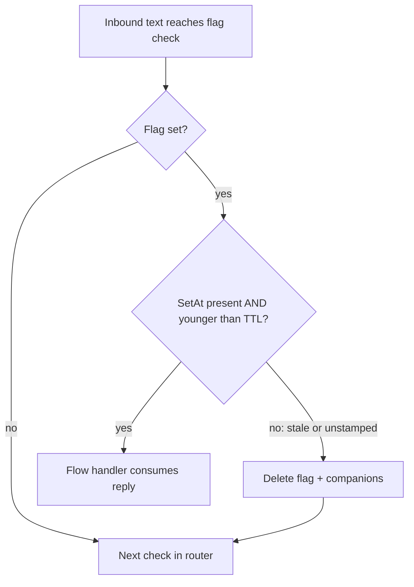

# fix: Session-state TTLs, client context parity, and memory self-heal

## Summary

Close the remaining "Evia forgets" gaps found by the 2026-07-15 scan: four session flows that never expire and can hijack unrelated replies (job invites, credential collection, shift swaps, refunds), one dead flag consumer, missing client-side absorption of volunteered info, silent loss of long-term memory threads, and two small hardening items. All fixes follow TTL and absorption patterns that already exist in the codebase.

## Problem Frame

Two live incidents (07-14) showed the failure class: a stale or wrongly-ordered session flag consumes a user's reply meant for something else, and single-shot reply handlers answer without the user's text or drop volunteered information. The caregiver side was fixed on 07-15 (`0d5d2db`, `4f5c54e`); this plan finishes the class. Verified defects, with the highest-risk first: `awaitingJobResponse`/`awaitingAvailabilityConfirmation` stamp `pendingJobSentAt` but nothing reads it, and since `4f5c54e` moved job checks to the front of `routeCaregiverMessage`, a week-old unanswered invite now intercepts even `ARRIVED`; `collectingCredential` (portal username/password collection) never expires; `swapStep`, `clientSwapStep`, and `refundStep` never expire; `pendingInterviewAvailabilityRequest` is consumed but never set anywhere in production code; client awaiting-step briefings omit the family's text and drop volunteered info; sessions can lack a `zepThreadId` forever, so nothing they say reaches long-term memory.

---

## Requirements

**State freshness**

- R1. A job invite older than its TTL no longer owns the caregiver's replies: the flags clear at consume time and the message routes normally.
- R2. An abandoned credential-collection flow stops treating texts as username/password candidates after its TTL.
- R3. Abandoned swap (caregiver and client) and refund flows expire; the refund flow also stops consuming texts once a request is submitted.
- R4. No consumer remains for a flag with no production setter.

**Context parity (client side)**

- R5. A family member who volunteers care details at `client_awaiting_identity` or `client_awaiting_payment` has them saved and specifically acknowledged, mirroring the caregiver gate fix.
- R6. Those two steps' reply briefings include the family's actual text.

**Memory**

- R7. A session missing `zepThreadId` gets one created on the next message instead of silently never logging to Zep.

**Hardening**

- R8. `answerHumanQuestionOnly` carries the same "briefing, not transcript" guard as the caraMessage voices.
- R9. The `answerQuestionMidFlow` handler-map signature mismatch (currently a shipped TS2322 masked by the transpile-only build) is fixed.

---

## Key Technical Decisions

- **Consume-time TTL enforcement with per-flag `SetAt` stamps** — mirror `HIGH_STAKES_CONFIRM_FLAGS`/`staleConfirmFlags` (`functions/src/utils/sessionState.ts`) and the `timesheetStep`/`pendingTimesheetSetAt` check (`functions/src/linq/routeClient.ts`). No new cron. Do NOT reuse the shared `stateExpiresAt` field for these: it is shared across every flow and deleting it while another flag is active is a known collision hazard (`otherStateFlagsActive` comment in `routeCaregiver.ts`).
- **TTL values** — job invite 48h (jobs stay fillable for days, but a week-old invite must not eat `ARRIVED`); `collectingCredential` 30m (most sensitive state; matches the flow-collection TTLs); swap/clientSwap/refund 24h (multi-step flows a user may resume same-day). Constants live in `sessionState.ts` beside `CONFIRM_FLAG_TTL_MS`.
- **Stale job invite clears silently** — flags are deleted and the message falls through to normal routing; no LLM "was this about the job?" classification. The QA agent still sees the text and can answer job questions from context. Simpler and cannot misroute.
- **Job-invite staleness uses the existing `pendingJobSentAt`** — already stamped by both senders; no new field on the send path.
- **Dead consumer removed, not TTL'd** — `pendingInterviewAvailabilityRequest` has no production setter (only a characterization test seeds it); delete the consumer, the `STATE_MACHINE_FLAGS` entry, and the test.
- **Client absorption mirrors to the live intake doc** — parity with `tryAbsorbGateProfileUpdate`'s caregiver-doc mirror: volunteered family details merge into `session.onboardingData` and the latest `clientIntakes` doc when one exists. Additive for list-shaped fields; scalars fill only when empty. Caution: on client docs, `profile.name` is the SENIOR's name (2026-07-10 parity-wave learning) — never write the texter's name into it.
- **Zep self-heal at message-log time** — when the webhook's Zep block finds no `zepThreadId`, call `initializeZepOnFirstContact` (idempotent; guards against double threads) instead of skipping the log. Fixes the class, not the one entry point that forgot to call it.

---

## High-Level Technical Design

The uniform consume-time gate every expiring flow adopts (already live for confirms and timesheets):

Missing `SetAt` counts as stale (the dangerous never-expires case), matching `staleConfirmFlags` semantics.

---

## Implementation Units

### U1. Job-invite TTL at consume time

- **Goal:** A job invite older than 48h stops owning the caregiver's replies.
- **Requirements:** R1
- **Dependencies:** none
- **Files:** `functions/src/utils/sessionState.ts`, `functions/src/utils/sessionState.test.ts` (create if absent), `functions/src/linq/routeCaregiver.ts`, `functions/src/linq/webhooks.ts`, `functions/src/linq/__tests__/routeCaregiver.characterization.test.ts`
- **Approach:** Add `JOB_INVITE_TTL_MS` and a pure `isJobInviteStale(session, nowMs)` reading `pendingJobSentAt` to `sessionState.ts`. Gate all four consume sites — the two blocks at the top of `routeCaregiverMessage` and the two `atPermissionsStep` bypasses in `webhooks.ts` — clearing `awaitingJobResponse`, `awaitingAvailabilityConfirmation`, `pendingJobId`, `pendingJobSentAt` and falling through when stale.
- **Patterns to follow:** `staleConfirmFlags` in `sessionState.ts`; the expiry-then-fall-through blocks in `routeCaregiverMessage` (e.g. `pendingShiftConfirmation`).
- **Test scenarios:**
  - Fresh invite (sent 1h ago) + "yes" → `handleJobResponse` called.
  - Stale invite (sent 3 days ago) + "ARRIVED" → flags cleared, ARRIVED keyword handler runs, no job reply sent.
  - Invite with flags set but `pendingJobSentAt` missing → treated as stale (never-expires guard).
  - Stale invite at a permissions step (webhooks bypass path) → permissions handler gets the reply, job flags cleared.
  - Pure helper: boundary at exactly TTL, missing stamp, fresh stamp.
- **Verification:** Characterization tests green including the existing "pending job-response routes to handleJobResponse" case (must still pass with a fresh stamp seeded).

### U2. Remove dead interview-availability consumer

- **Goal:** No router block consumes a flag nothing sets.
- **Requirements:** R4
- **Dependencies:** none
- **Files:** `functions/src/linq/routeCaregiver.ts`, `functions/src/utils/sessionState.ts`, `functions/src/linq/__tests__/routeCaregiver.characterization.test.ts`
- **Approach:** Delete the `pendingInterviewAvailabilityRequest` block in `routeCaregiverMessage`, its `STATE_MACHINE_FLAGS` entry, and the characterization test that seeds it. Confirm via grep that no setter appeared since the scan (the concurrent 07-15 session is also editing this repo — re-verify at implementation time).
- **Test scenarios:** Test expectation: none — pure dead-code removal; the deleted test is the change.
- **Verification:** Grep shows zero remaining references; full routeCaregiver test files green.

### U3. Credential-collection TTL

- **Goal:** An abandoned portal-connect flow expires after 30 minutes.
- **Requirements:** R2
- **Dependencies:** none
- **Files:** `functions/src/browser/credentialCollector.ts`, `functions/src/browser/credentialCollector.test.ts`, `functions/src/utils/sessionState.ts`
- **Approach:** Stamp `collectingCredentialSetAt` where the flow starts (`collectingCredential: true`). At the top of `handleCredentialReply`, if stale or unstamped: clear all `collectingCredential*` fields, return `false` so `routeClient` continues normal routing. Add the `SetAt` companion to `STATE_MACHINE_FLAGS` so `clearAllStateFlags`/START-OVER wipes it.
- **Patterns to follow:** the existing clear-block at `credentialCollector.ts` (~line 203) for the full field list.
- **Test scenarios:**
  - Flow started 5 min ago + username-shaped reply → consumed as credential.
  - Flow started 2h ago + any text → fields cleared, returns false, no credential stored.
  - Flag true but no `SetAt` → treated as stale.
  - Stale expiry does not send the user any message (silent hand-back to normal routing).
- **Verification:** credentialCollector tests green; a stale session's next text reaches the QA agent (routing test).

### U4. Swap and refund flow TTLs

- **Goal:** Abandoned swap/refund flows expire after 24h; submitted refunds stop consuming texts.
- **Requirements:** R3
- **Dependencies:** none
- **Files:** `functions/src/agents/caregiverSwapHandler.ts`, `functions/src/agents/clientSwapRequestHandler.ts`, `functions/src/agents/refundHandler.ts`, `functions/src/linq/routeCaregiver.ts`, `functions/src/linq/routeClient.ts`, `functions/src/utils/sessionState.ts`, plus a test file per touched handler (create `functions/src/agents/__tests__/flowTtl.test.ts` if per-handler files don't exist)
- **Approach:** Stamp `swapStepSetAt` / `clientSwapStepSetAt` / `refundStepSetAt` at each step-setting write. Add consume-time staleness checks at `routeCaregiver.ts` (`swapStep` block — mirror the `cancelStep` expiry check directly below it) and `routeClient.ts` (`clientSwapStep`, `refundStep` blocks — mirror the `timesheetStep` 7-day check). In `refundHandler`, clear `refundStep` and companions once the request is submitted instead of leaving the terminal `"submitted"` value.
- **Patterns to follow:** `cancelStep` expiry block in `routeCaregiver.ts`; `timesheetStep` staleness block in `routeClient.ts:366-379`.
- **Test scenarios:**
  - Swap started yesterday+ + unrelated text → flags cleared, text routes normally.
  - Fresh clientSwap + "2" → swap handler consumes it.
  - Refund reaches submitted → step fields deleted; next text does not invoke `handleRefundRequest`.
  - Unstamped legacy flag (set before this change deploys) → treated as stale, cleared.
- **Verification:** New tests green; existing swap/refund behavior unchanged for fresh flows.

### U5. Client-side gate absorption and grounded briefings

- **Goal:** Families get the caregiver fix: volunteered details saved + acknowledged, reply briefings see their text.
- **Requirements:** R5, R6
- **Dependencies:** none (parallel to U1-U4)
- **Files:** `functions/src/agents/onboardingConversation.ts`, `functions/src/agents/__tests__/clientGateAbsorb.test.ts` (create)
- **Approach:** Add an update-mode client absorber beside `absorbClientFields` (additive for list-shaped care fields — care needs, conditions, languages; scalars fill-only-when-empty) and a `tryAbsorbClientGateUpdate` twin of `tryAbsorbGateProfileUpdate`: persist to `session.onboardingData`, mirror into the latest `clientIntakes` doc for the user when one exists, acknowledge the specific detail, restate the pending gate. Wire into the "other"-reply branches of `client_awaiting_identity` and `client_awaiting_payment`; prepend `The family member just texted: "<text>".` to both steps' nudge briefings. Never write a texter's name into `profile.name` (senior's name).
- **Patterns to follow:** `tryAbsorbGateProfileUpdate` and `absorbCaregiverProfileUpdate` (2026-07-15, `4f5c54e`).
- **Test scenarios:**
  - "mom also needs help with bathing" at awaiting_payment → care needs gain bathing (session + intake doc), ack names bathing, payment reminder follows.
  - Duplicate detail ("she needs companionship" when already listed) → no write, falls through to normal nudge.
  - "how long does verification take?" → question path unchanged (absorb must not intercept questions).
  - Volunteered detail when no intake doc exists yet → session-only write, no crash.
  - Ack message briefing contains the user's text verbatim.
- **Verification:** New test file green; existing onboarding routing tests green.

### U6. Zep thread self-heal

- **Goal:** No session silently accumulates zero long-term memory.
- **Requirements:** R7
- **Dependencies:** none
- **Files:** `functions/src/linq/webhooks.ts`, `functions/src/memory/zepClient.ts`, `functions/src/memory/zepClient.test.ts` (create if absent)
- **Approach:** Where the onboarding Zep block reads `zepThreadId` and skips when absent, instead fire-and-forget `initializeZepOnFirstContact(phone)` (already idempotent — it re-checks the stored id before creating) so the NEXT message logs; do the same at the qaAgent-loop entry's Zep read if it has the same skip shape. Do not block the reply on thread creation.
- **Patterns to follow:** existing `initializeZepOnFirstContact` call sites in `webhooks.ts`.
- **Test scenarios:**
  - Session without `zepThreadId` receives a message → `initializeZepOnFirstContact` invoked once; reply path unaffected.
  - Session with a thread → no extra initialization call.
  - Zep API failure → logged, message handling continues (fail-open).
- **Verification:** A fresh test-number conversation shows a `zepThreadId` on the session doc by its second message.

### U7. Reply-guard and signature hardening

- **Goal:** Close the two P3s.
- **Requirements:** R8, R9
- **Dependencies:** none
- **Files:** `functions/src/agents/humanReply.ts`, `functions/src/agents/onboardingConversation.ts`
- **Approach:** Append the "you receive a situation briefing, not a transcript — never ask for missing context or say you don't see a message" rule to `answerHumanQuestionOnly`'s system prompt. Fix the handler-map type mismatch around `answerQuestionMidFlow` (~line 1638): align the map's declared signature with the 3-arg implementation, verifying the `phone` argument actually reaches the function at runtime today (if it silently didn't, this is a behavior fix — note it in the commit).
- **Patterns to follow:** the 07-15 voice-guard wording in `functions/src/utils/caraMessage.ts`.
- **Test scenarios:**
  - `answerHumanQuestionOnly` prompt includes the guard (string assertion, mirroring how voice rules are covered elsewhere).
  - `npx tsc --noEmit` no longer reports the TS2322 at this site.
- **Verification:** Typecheck diff shows the error gone; no new errors in touched files.

---

## Scope Boundaries

- The web-chat-vs-SMS split-brain question is unaudited and out of scope — separate scan first.
- No product-behavior changes: TTL expiry is silent; no new user-facing messages beyond the absorption acks that mirror the shipped caregiver behavior.

### Deferred to Follow-Up Work

- Migrating existing per-flow expiry blocks onto one shared helper (nice consolidation; not needed for correctness).
- A stale-flow resume nudge for expired swap/refund flows (`describeInterruptedFlow` exists; wiring it to these TTLs is optional polish).

---

## Risks & Dependencies

- **Concurrent editing:** another session shipped work to this repo on 07-15 (care-plan interview wave). `git pull`/diff before starting; re-verify U2's no-setter claim at implementation time.
- **Legacy unstamped flags in prod:** sessions holding these flags today have no `SetAt`; the "missing stamp = stale" rule intentionally clears them on next contact. That is the desired recovery, but it means any genuinely-active old flow is dropped once — acceptable given these flows are minutes-long by design.
- **Routing-order sensitivity:** `routeCaregiverMessage` ordering was the source of two live bugs; U1/U2 touch it again. The characterization suite is the guardrail — run it on every change.

---

## Sources & Research

- Gap scan 2026-07-15 (this session): defect evidence at `functions/src/triggers/jobNotifications.ts:241-244`, `functions/src/triggers/caregiverJobMatch.ts:103-106`, `functions/src/browser/credentialCollector.ts:105`, `functions/src/agents/caregiverSwapHandler.ts:84`, `functions/src/agents/clientSwapRequestHandler.ts:78`, `functions/src/agents/refundHandler.ts:83-165`, `functions/src/linq/routeClient.ts:295-420`, `functions/src/linq/routeCaregiver.ts` (job blocks + swap block).
- Healthy patterns to copy: `functions/src/utils/sessionState.ts:96-132` (confirm-flag TTL), `functions/src/linq/routeClient.ts:366-379` (timesheet staleness), `functions/src/agents/healthcareHandler.ts:118-137` (flow TTL done right).
- Prior fixes this class: commits `0d5d2db`, `4f5c54e` (2026-07-15).
