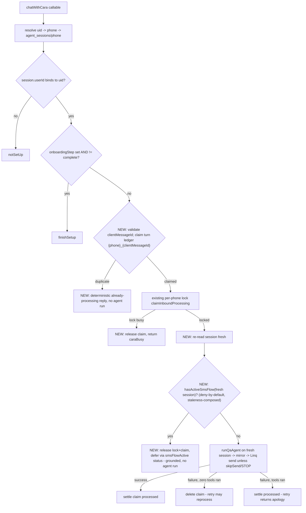

# fix: Launch-readiness review fixes — web chat unblock trio, payment/bgcheck hardening, ops gate

## Summary

Fix the highest-priority code findings from the 2026-07-15 launch-readiness review: unblock the web-chat surface for onboarded users while guarding it against active SMS flows and making web turns retry-safe (one deploy, shipped together); fix the checkout-failure message, Checkr invite expiry, and hire-approval TODO; lock down dead Firestore rules surface and Stripe brand metadata; enable Sentry; and run the owed ops verification gate. Lower-priority review items (web-chat identity-mismatch recovery, history backfill, full SMS-router parity) are deferred — see Scope Boundaries.

## Problem Frame

The 2026-07-15 review found the web-chat surface dead for all onboarded users: `functions/src/linq/webChat.ts` blocks any truthy `onboardingStep`, but completed sessions carry `onboardingStep: "complete"` permanently. That bug has been masking two latent defects — web turns bypass every SMS state-machine flag, and a retried web turn re-runs the whole agent turn (duplicate side effects, duplicate SMS). Fixing the block alone opens a real split-brain window, so the three fixes ship as one unit. The review also surfaced independent defects (checkout-failure sends a success URL, Checkr invites go stale after 7 days, a stale hire-notification TODO, an owner-writable dead `memberships` rules block, legacy brand metadata on new Stripe Connect accounts, Sentry unwired in prod) and a set of owed operational verifications that are the real remaining launch risk.

---

## Requirements

### Web chat surface
- R1. A fully onboarded user (session `onboardingStep: "complete"`) can chat with Evia on the web and receive an agent reply.
- R2. A web turn arriving while a fresh SMS flow is mid-flight (any active state-machine flag) defers politely without running the agent, mutating session flags, or sending SMS.
- R3. A stale flag (per the same TTL semantics the SMS routers use) does not block web turns.
- R4. A retry with the same `clientMessageId` never duplicates a turn that ran side effects; a turn that failed before any tool executed may reprocess. Malformed or missing `clientMessageId` degrades to non-idempotent (never blocks the turn).
- R5. Opted-out (STOP) users keep the existing web-only `skipSend` behavior.
- R6. Mid-onboarding sessions (`onboardingStep` set and not `"complete"`) remain blocked with the existing `finishSetup` response.

### Payments and messaging
- R7. When Stripe checkout creation fails, the client receives apology/retry copy with no URL — never the `/payment/success` fallback link — on both the main and resend paths.
- R8. The retry promise in that copy is backed by `recordCommitment` so the retry sweep and human escalation own it.

### Background check
- R9. A bg-check resend with a stale (>6.5 days old) or webhook-expired invitation mints a fresh invitation post-consent, re-points `checkrCandidateId` on the caregiver doc, and caches the new URL; fresh cached invites are still reused.

### Hire flow
- R10. Coordinator approval of a hire request results in the caregiver being notified (verified via the existing server trigger; the stale frontend TODO is removed).

### Security and brand
- R11. Client-SDK writes to `memberships/{userId}` are denied.
- R12. New Stripe Connect accounts carry `platform: "evia"` metadata.

### Observability and ops
- R13. Production builds initialize Sentry (DSN present at build time).
- R14. The ops verification gate is executed with recorded evidence: fresh-number E2E (both roles), live money-flow smoke test, bucket CORS verification.

---

## Key Technical Decisions

- **Guard-and-defer, not router parity** (user-confirmed): the web path gets a read-only "active SMS flow" check and defers when one is fresh. It does not replicate the SMS routing spine. Rationale: parity is a large build for marginal benefit; deferral closes the split-brain window safely.
- **New pure predicate `hasActiveSmsFlow(session)` in `functions/src/utils/sessionState.ts`, deny-by-default**: derive from `STATE_MACHINE_FLAGS`' primary flags minus an explicit passive-exclusion list (`pendingPayoutNotificationAck`, `pendingBgCheckAck`, and other ack/data-companion fields), NOT an allow-list of known flows. Rationale (review finding): an allow-list built from `RESUMABLE_FLOW_DESCRIPTIONS` silently omits money flags like `pendingInstantPayoutConfirm`/`pendingSwapRequestId` and every future flag — drift fails open on exactly the split-brain surface. A drift test asserts every `STATE_MACHINE_FLAGS` entry is classified as either guarded or explicitly excluded, so a new flag fails the build until categorized. Composed with staleness helpers (`staleConfirmFlags` for confirms, `isJobInviteStale` for invites, `isFlowStale` for stamped step flows, `isStateExpired`/`stateExpiresAt` as the generic fallback for flags with no `SetAt` stamp) so a stale flag never defers web turns. The web path never clears flags — flag clearing stays SMS-router-owned.
- **Guard evaluated AFTER the lock, on a fresh session re-read** (review finding — TOCTOU): the initial session snapshot is read ~3s before the lock resolves; an SMS turn can set a flag in that window. Evaluate `hasActiveSmsFlow` and run the agent against a session re-read after `claimInboundProcessing` succeeds, and pass that fresh session to `runQaAgent`. Release the lock before returning a deferral.
- **Turn idempotency via a `claimWebhookEvent`-style ledger** keyed on `{phone}_{clientMessageId}`: `create()` claim, transaction fallback with stale-claim takeover, settle on success. Validate `clientMessageId` against `/^[A-Za-z0-9_.-]{1,200}$/` before building the key (review finding — a crafted id with `/` breaks `ref.create()` and the fail-open catch silently disables idempotency); a present-but-malformed id is treated like a missing one (bypass the ledger). Key stable across retries (no attempt suffixes — a suffixed key caused a real double-transfer in the money-path wave). Claim released on EVERY pre-agent early return (lock-unavailable `caraBusy`, deferral) so a same-id retry is not blocked for the 10-min stale window. Delete claim on failure ONLY when zero tools executed; if any tool ran before the failure, settle `processed` and the retry returns an apology (review finding — agent turns are not internally idempotent, so re-running a partially-committed turn re-fires booking/SMS tools). Duplicate claim returns a deterministic response without an agent run (ONE VOICE: a retried turn must not produce a second SMS).
- **Reactive Checkr re-mint** (user-confirmed): stamp `bgcheckInviteSentAt` at EVERY `bgcheckInviteUrl` cache site — `confirmBgcheckConsent` (~:3145), `sendBgCheckRenewalLink` (~:3275), and the Stripe membership webhook (`functions/src/stripe.ts:619`) — not just `confirmBgcheckConsent` (review finding: unstamped sites otherwise get force-re-minted). The reuse guard in `handleCaregiverSendBgcheck` treats an invite as stale when `bgcheckInviteSentAt` is >6.5 days old (buffer under Checkr's 7-day expiry) or `backgroundCheckData.invitationStatus === "expired"` (the webhook already records this and deletes `invitationUrl`). When the stamp is MISSING (pre-fix sessions), fall back to `backgroundCheckData.submittedAt` as the age signal; treat as stale only when both are absent (review finding — missing-stamp-equals-stale mints a second live invitation, splitting webhook state / risking double-bill). Stale → cancel the old Checkr invitation via API, then mint fresh through the existing re-point branch in `confirmBgcheckConsent`, which must update `checkrCandidateId` so report webhooks follow the new candidate. Post-consent only — never re-add a pre-consent Checkr call (CLAUDE.md invariant). No proactive re-invite sweep.
- **No new hire-notification code**: research confirmed `onHireRequestApproved` (`functions/src/matching.ts:188`) already fires on the exact status `approveHireRequest` writes and sends notification doc + email + SMS via admin SDK. The fix is verification plus removing the misleading TODO. No new callable means no invoker-IAM risk.
- **Checkout-failure copy reuses `sendOnboardingLinkFailureMessage`** (`functions/src/agents/onboardingConversation.ts:143`): `recordCommitment` before the promise copy, `generateCaraMessage` voice, no URL in the message, fail-open fallback string. Rationale: this is the repo's one sanctioned apology/retry shape. Correction (review finding): `OnboardingLinkType` ALREADY includes `client_payment` — do not re-add it. The real gap is that `sendOnboardingLinkFailureMessage`'s `kind` param is a caregiver-only union and it hardcodes `audience: "caregiver"` / `userType: "caregiver"` in both the commitment record and the copy. Extend the `kind` union with a client-payment variant, map it to linkType `client_payment`, and parameterize audience/userType so the family is addressed correctly.
- **Sentry needs env only, no code**: `lib/sentry.ts` init is already gated on `VITE_SENTRY_DSN` non-empty + production mode. The work is minting the DSN and setting it at build time.

## High-Level Technical Design

Web turn pipeline after the trio lands (new steps marked):

---

## Implementation Units

### Phase A — web chat trio (U1–U3 land as a SINGLE commit and deploy; never U1 alone)

Atomicity is enforced by committing U1–U3 together, not by convention — U1 alone reopens the split-brain window U2/U3 close. All three edit the `chatWithCara` callable path.

### U1. Unblock web chat for completed sessions

**Goal:** Web chat works for onboarded users; mid-onboarding stays blocked.
**Requirements:** R1, R5, R6
**Dependencies:** none
**Files:** `functions/src/linq/webChat.ts`, `functions/src/linq/webChat.test.ts`
**Approach:** Change the guard at the `finishSetup` branch from truthy `session.onboardingStep` to the canonical mid-onboarding test used at `functions/src/linq/webhooks.ts:1435` (`onboardingStep && onboardingStep !== "complete"`). Fix the test fixture gap: the happy-path `seedSession` currently omits `onboardingStep`, which is a fixture that doesn't exist in production.
**Patterns to follow:** `!== "complete"` guards in `functions/src/linq/webhooks.ts:1435, :1888, :1969`; `qaAgent.ts:315`.
**Test scenarios:**
- Session with `onboardingStep: "complete"` → status `ok`, agent runs, reply returned (this is the regression the old fixture masked).
- Session with `onboardingStep: "caregiver_credentials"` → `finishSetup`, zero agent/mirror calls (existing test stays green).
- Session with no `onboardingStep` field → `ok` (legacy sessions).
- `optedOut: true` + complete → reply generated, Linq send skipped (`skipSend` path intact).

### U2. Guard web turns against active SMS flows

**Goal:** A web turn during a fresh SMS flow defers without side effects; stale flags don't defer; the deferral is visible in the web UI.
**Requirements:** R2, R3
**Dependencies:** U1 (ships with U3 per Phase A single-commit constraint)
**Files:** `functions/src/utils/sessionState.ts`, `functions/src/linq/webChat.ts`, `components/chat/CaraChat.tsx`, `services/api.ts`, `functions/src/utils/__tests__/sessionState.test.ts` (or co-located per existing layout), `functions/src/linq/webChat.test.ts`
**Approach:** Add pure `hasActiveSmsFlow(session)` to `sessionState.ts`, **deny-by-default**: iterate `STATE_MACHINE_FLAGS`' primary flags minus an explicit passive-exclusion set (`pendingPayoutNotificationAck`, `pendingBgCheckAck`, `awaitingTaskAck`, `pendingShiftConfirmation`, data-companion fields), NOT an allow-list — so money flags (`pendingInstantPayoutConfirm`, `pendingSwapRequestId`, `pendingShiftApproval`) and future flags are covered by default. Compose each guarded flag with its staleness helper — `staleConfirmFlags` for confirm flags, `isJobInviteStale` for invite flags, `isFlowStale(session, flag, `${flag}SetAt`, MULTI_STEP_FLOW_TTL_MS)` for stamped step flows, and `isStateExpired`/`stateExpiresAt` as the generic fallback for flags with no `SetAt` stamp (see U2 decision below on the stamp-less mapping). In `webChat.ts`, evaluate the guard AFTER `claimInboundProcessing` acquires the lock, on a fresh session re-read; on active flow, release the lock and return a new `smsFlowActive` status whose `reply` names the in-flight flow via `describeInterruptedFlow` (briefing not transcript — no filler ack, no invented state, no URL). Read-only: never clear or stamp flags from the web path. In `CaraChat.tsx` + the `services/api.ts` status union, add an `smsFlowActive` branch: remove the pending bubble, restore the draft, display `res.reply` as a notice.
**Decision — stamp-less flag mapping (resolve at implementation):** Only 4 resumable flags (`collectingCredential`, `swapStep`, `clientSwapStep`, `refundStep`) carry `SetAt` stamps today; the other ~13 (incl. `hireMode`, `jobPostingStep`, `pendingTimeSelection`) do not. For stamp-less flags, use `isStateExpired`/`stateExpiresAt` as the staleness signal (NOT `isFlowStale`, whose missing-stamp-equals-stale would make the guard never defer on the highest-traffic flows). Where `stateExpiresAt` is also absent, treat the flag as active (deny-by-default — defer the web turn) rather than stale, accepting the documented shared-`stateExpiresAt` deletion hazard as the lesser risk vs. reopening split-brain.
**Patterns to follow:** `describeInterruptedFlow` (`sessionState.ts:230`); `CaraChat.tsx` existing status switch; flow-collision wave rule — briefing not transcript, no filler acks.
**Test scenarios:**
- `pendingCancelConfirm: true` with fresh `pendingCancelConfirmSetAt` → defer, no agent run, flag untouched (double-cancel scenario from the review).
- Same flag with stamp older than the 1h confirm TTL → no defer, agent runs.
- `pendingInstantPayoutConfirm: true` fresh → defer (deny-by-default covers money flags not in the resumable list).
- `swapStep` fresh vs. past 24h TTL → defer vs. proceed.
- `awaitingJobResponse` fresh vs. past 48h `pendingJobSentAt` → defer vs. proceed.
- Stamp-less flag (`hireMode`) with `stateExpiresAt` in the future → defer; with `stateExpiresAt` absent → defer (deny-by-default).
- Passive ack flag only (`pendingBgCheckAck`) → no defer.
- No flags → no defer.
- Flag written between the initial snapshot and lock acquisition → still defers (guard reads fresh post-lock session).
- Drift test: every `STATE_MACHINE_FLAGS` entry is classified guarded or explicitly excluded (new uncategorized flag fails the test).
- Frontend: `smsFlowActive` status removes the pending bubble, restores the draft, and shows `res.reply`.

### U3. Idempotent web turns keyed on clientMessageId

**Goal:** A retried web turn cannot re-run a turn that already ran side effects or double-send SMS.
**Requirements:** R4
**Dependencies:** U1 (ships with U2 per Phase A single-commit constraint)
**Files:** `functions/src/linq/webChat.ts`, `functions/src/utils/webhookLedger.ts` (reuse; extend only if the claim shape needs a variant), `functions/src/linq/webChat.test.ts`
**Approach:** Validate `clientMessageId` against `/^[A-Za-z0-9_.-]{1,200}$/` at the callable boundary (mirrors the existing `MAX_MESSAGE_CHARS` guard on `message`); a present-but-malformed id is treated as missing → bypass the ledger (degrade to non-idempotent, never block). With a valid id, claim `web_turn_claims/{phone}_{clientMessageId}` via `claimWebhookEvent` (create → transaction fallback → stale-claim takeover at the existing 10-min threshold) BEFORE acquiring the per-phone lock. Duplicate claim → deterministic response, no agent run, no send. Release the claim on EVERY pre-agent early return (lock-unavailable `caraBusy`, `smsFlowActive` deferral from U2) so a same-id retry is not wedged for 10 min. On agent-run outcome: success → settle `processed`; failure with zero tools executed → delete claim (retry reprocesses); failure after any tool executed → settle `processed` and have the retry return an apology (agent turns are not internally idempotent — re-running re-fires committed booking/SMS tools). Turns without a `clientMessageId` bypass the ledger. No cleanup job — ledger collections persist by repo convention.
**Patterns to follow:** `claimWebhookEvent`/`settleWebhookEvent` (`functions/src/utils/webhookLedger.ts`) and its tests; stable-key rule from the money-path wave; `MAX_MESSAGE_CHARS` input-bound guard in `webChat.ts`.
**Test scenarios:**
- Two calls, same `clientMessageId`: first runs agent + sends; second returns without agent run or send.
- First call's agent run throws with zero tools executed → claim deleted → retry runs the agent again.
- First call's agent run throws AFTER a tool committed → claim settled `processed` → retry returns apology, does NOT re-run tools (no duplicate booking/SMS).
- Claim older than the stale threshold with `processing` status → takeover allowed.
- Lock-unavailable `caraBusy` after claim → claim released → immediate same-id retry reprocesses (not blocked 10 min).
- `smsFlowActive` deferral after claim → claim released.
- Malformed `clientMessageId` (contains `/`) → ledger bypassed, turn still processes (no `ref.create()` throw).
- Missing `clientMessageId` → turn processes without ledger interaction.
- ONE VOICE assertion: in the duplicate case, Linq send call count stays at the first turn's count.

### Phase B — independent fixes (any order, independently landable)

### U4. Checkout-failure apology/retry copy

**Goal:** Stripe checkout-create failure never texts a success URL; the client gets grounded apology/retry copy backed by a commitment.
**Requirements:** R7, R8
**Dependencies:** none
**Files:** `functions/src/agents/onboardingConversation.ts`, its existing test file(s) covering `handleClientSendPayment` / `sendOnboardingLink`
**Approach:** In the `createClientMembershipCheckout` catch branches (`handleClientSendPayment` ~:2363 and `sendOnboardingLink` `client_payment` case ~:3535), stop falling through to the `/payment/success` fallback URL. `OnboardingLinkType` already includes `client_payment` (do NOT re-add it). Extend `sendOnboardingLinkFailureMessage`'s `kind` union with a client-payment variant, map it to linkType `client_payment`, and parameterize the hardcoded `audience: "caregiver"` / `userType: "caregiver"` so the commitment record and generated copy address the family: `recordCommitment` first, then `generateCaraMessage`-voiced apology with no URL, fail-open static fallback. Keep the existing `admin_alerts` write. Keep the empty-`seniorName` prompt constraint (no invented names) that lives near this code.
**Patterns to follow:** `sendOnboardingLinkFailureMessage` (`onboardingConversation.ts:143`); commitment-tracker rule; gate-voice rule (generated copy never emits URLs).
**Test scenarios:**
- Checkout helper throws on main path → outbound message contains no URL, a commitment is recorded, `admin_alerts` still written.
- Same on the resend path.
- Checkout helper succeeds → behavior unchanged (real checkout URL sent).
- `generateCaraMessage` itself fails → static fallback string sent (fail-open), commitment still recorded.

### U5. Checkr invitation expiry re-mint

**Goal:** Stale or expired bg-check invites re-mint instead of resending dead links.
**Requirements:** R9
**Dependencies:** none
**Files:** `functions/src/agents/onboardingConversation.ts`, `functions/src/stripe.ts`, their bg-check test file(s)
**Approach:** Stamp `bgcheckInviteSentAt` at EVERY live `bgcheckInviteUrl` cache site — `confirmBgcheckConsent` (~:3145, cached once before the branch), `sendBgCheckRenewalLink` (~:3275), and the Stripe membership webhook (`functions/src/stripe.ts:619`) — not just `confirmBgcheckConsent` (an unstamped site otherwise gets force-re-minted on first resend). In the `handleCaregiverSendBgcheck` reuse guard (the `// TODO expiry` site ~:3015), treat the cached invite as stale when the stamp is >6.5 days old or `caregivers/{uid}.backgroundCheckData.invitationStatus === "expired"`. When `bgcheckInviteSentAt` is MISSING (pre-fix sessions), fall back to `backgroundCheckData.submittedAt` (stamped at mint) as the age signal; treat as stale only when BOTH are absent — a missing stamp must not force-re-mint a still-live one-day-old invite. Stale → cancel the old Checkr invitation via API (so two live invitations never coexist), clear the cached URL, and route through the existing fresh-invitation branch, which must re-point `checkrCandidateId` (the `:3184-3209` branch already does). Consent-first ordering untouched: re-mint only where consent was already recorded. Preserve START OVER's nulling of `bgcheckInviteUrl`.
**Patterns to follow:** `isFlowStale` SetAt+TTL idiom; `mintStripeConnectAccountLink` re-mint shape; CLAUDE.md consent-first invariant.
**Test scenarios:**
- Cached URL with `bgcheckInviteSentAt` 2 days old → reused, no Checkr call.
- Stamp 7 days old → old invitation cancelled, fresh invitation created, `checkrCandidateId` updated, new URL + stamp cached.
- Cached URL but webhook set `invitationStatus: "expired"` → re-mint even with a recent-looking stamp.
- Cached URL, no `bgcheckInviteSentAt`, `submittedAt` 1 day old → reused (fallback age signal), NO re-mint.
- Cached URL, both stamps absent → treated stale, re-minted.
- Invite cached via the Stripe membership webhook path (`stripe.ts:619`) → carries a stamp, reused when fresh.
- No consent recorded yet → no Checkr call from any path (consent-first invariant).

### U6. Hire-approval notification: verify and clean the TODO

**Goal:** Confirm coordinator approval notifies the caregiver; remove the stale frontend TODO.
**Requirements:** R10
**Dependencies:** none
**Files:** `services/api.ts`, `functions/src/matching.ts` (read/verify only)
**Approach:** Verify `onHireRequestApproved` (`matching.ts:188`) matches the exact status `approveHireRequest` writes (`coordinator_approved`, `api.ts:3603`) and is exported live (`index.ts` re-export). Replace the `// TODO: Notify caregiver` at `api.ts:3609` with a comment pointing at the trigger. `approveHireRequest` has zero frontend callers — note that in the comment rather than deleting the function in this wave.
**Test expectation:** none — verification plus comment change; the trigger's own coverage stands. If verification finds a status mismatch, this unit converts into a real fix and gains scenarios (mismatch case: trigger never fires for coordinator approvals).
**Verification:** Trigger status constant matches the written status string; trigger deployed (function exists in prod list).

### U7. Rules and brand-metadata cleanup

**Goal:** Close the dead owner-writable `memberships` surface; stamp new Connect accounts with the live brand.
**Requirements:** R11, R12
**Dependencies:** none
**Files:** `firestore.rules`, `functions/src/stripeConnect.ts`, rules test file if one covers memberships
**Approach:** `memberships/{userId}` → `allow read: if isOwner(userId) || isAdmin(); allow write: if false;` (server mirrors use Admin SDK, rules-exempt; research confirmed zero client readers/writers). Change `stripeConnect.ts:141` metadata to `platform: "evia"` — do not cascade into the intentional-keep legacy identifiers (CLAUDE.md rebrand rules). Deploy rules with the functions deploy or standalone `firebase deploy --only firestore:rules`.
**Test scenarios:**
- Rules: authenticated owner write to `memberships/{own-uid}` denied (emulator rules test if the repo has that harness; otherwise manual verification note in the PR).
- `createConnectAccount` unit test (if present) asserts metadata `platform: "evia"`.

### Phase C — enablement and ops gate

### U8. Enable Sentry in production

**Goal:** Frontend error monitoring live at launch.
**Requirements:** R13
**Dependencies:** none
**Files:** `.env` (build-time value; no source change)
**Approach:** Founder mints the Sentry project/DSN (code in `lib/sentry.ts` is fully wired and gated on DSN + production mode). Set `VITE_SENTRY_DSN` (and optionally `VITE_RELEASE_VERSION`) before the next production build. Follow the env-diff rule: compare env VALUES, not key names, before any deploy.
**Test expectation:** none — config only.
**Verification:** Browser network tab shows requests to the Sentry ingest endpoint on load; a thrown test error appears in the Sentry project. (`initSentry()` logs nothing on success — do not rely on a console line.)

### U9. Ops verification gate

**Goal:** Convert the owed operational evidence into recorded pass/fail results.
**Requirements:** R14
**Dependencies:** U1–U5 deployed (E2E should exercise the fixed flows)
**Files:** none (operational; evidence recorded in `context/progress-tracker.md`)
**Approach:** Three checks, each with recorded evidence:
1. Fresh-number E2E, both roles: reset via `scripts/delete-phone.mjs <phone> --confirm`; any prod-data write beyond the sanctioned reset needs founder-named consent with exact record+fields stated first.
2. Live money-flow smoke test: one real client subscription charge, one caregiver membership checkout, one shift → payout path (instant payout optional), verifying webhook settlement and no duplicate charges.
3. Bucket CORS: `gsutil cors get` on the storage bucket; confirm it matches `cors.json` (eviacares.com present).
Deploy discipline for the whole plan: deploy from `CareConnecxx-main/`, repo-root `node_modules/.bin/firebase`, `FUNCTIONS_DISCOVERY_TIMEOUT=120`, targeted `functions:v1.NAME` deploys where possible, commit before deploying, verify `v1-linqWebhook` updateTime after. No new callables in this plan, so no invoker-IAM verification needed.
**Test expectation:** none — operational evidence, not unit tests.
**Verification:** All three checks recorded with dates and outcomes in `context/progress-tracker.md`; failures spawn follow-up fixes.

---

## Scope Boundaries

**In scope:** everything above.

**Out of scope (confirmed):** SCC caregiver supply seeding; James Okafor duplicate-doc cleanup; LinkedIn OAuth verification; web-chat history backfill for late-bound accounts; full SMS-router parity on the web path; named-consent backfill (tracked separately in the care-plan interview wave).

### Deferred to Follow-Up Work
- Web-chat identity-mismatch dead-end (session bound to a different uid returns `notSetUp` with no recovery path) — real gap, needs its own design.
- `caregivers/{id}` world-readable rule exposing `stripeAccountId` (money-path wave leftover).
- Trim localhost + legacy `careconnecxx.com` origins from `cors.json` after launch stabilizes.
- Date-due cleanup windows from the 07-12 sweep: `video_interviews` grace fallbacks (~07-18), `services/api.ts` care-plan legacy fallbacks (~07-19).

---

## Risks & Dependencies

- **U2 false deferrals**: a wedged flag with no TTL stamp could block web chat for that user. Mitigation: staleness composition treats missing stamps as stale for confirm flags (existing `staleConfirmFlags` semantics); test the missing-stamp path explicitly.
- **U3 fail-open ledger**: under Firestore transaction errors the claim fails open (repo convention) — a rare duplicate beats a dropped turn; accept.
- **U5 webhook coupling**: if re-mint doesn't re-point `checkrCandidateId`, report webhooks orphan. The existing re-point branch handles it; the test asserts it.
- **Rules deploy (U7)**: `write: if false` is safe only because zero client writers exist (grep-verified); re-verify at implementation time in case of drift.
- **Test runner**: full vitest OOMs — run in two halves; frontend build needs `NODE_OPTIONS=--max-old-space-size=8192` (already baked into `scripts/build.mjs`).
- **Concurrent sessions**: line numbers cited are from the 07-15/16 tree at `0243dc9`; re-verify before editing if other sessions have pushed.

## Sources & Research

- Review findings: memory `launch-readiness-review-2026-07-15` (F1–F6 split-brain audit with file:line evidence; config scan; U1–U25 status audit).
- Pattern research: `functions/src/utils/sessionState.ts` (flags, staleness helpers, `describeInterruptedFlow`), `functions/src/utils/webhookLedger.ts` (claim/settle), `functions/src/agents/onboardingConversation.ts` (`sendOnboardingLinkFailureMessage`, bg-check flow, re-point branch), `functions/src/matching.ts:188` (`onHireRequestApproved`), `lib/sentry.ts`, `firestore.rules:949-953`.
- Institutional rules honored: consent-first Checkr (CLAUDE.md), ONE VOICE, commitment tracker, gate-voice no-URLs, stable idempotency keys, prod-write founder-named consent, deploy env-value diff.
