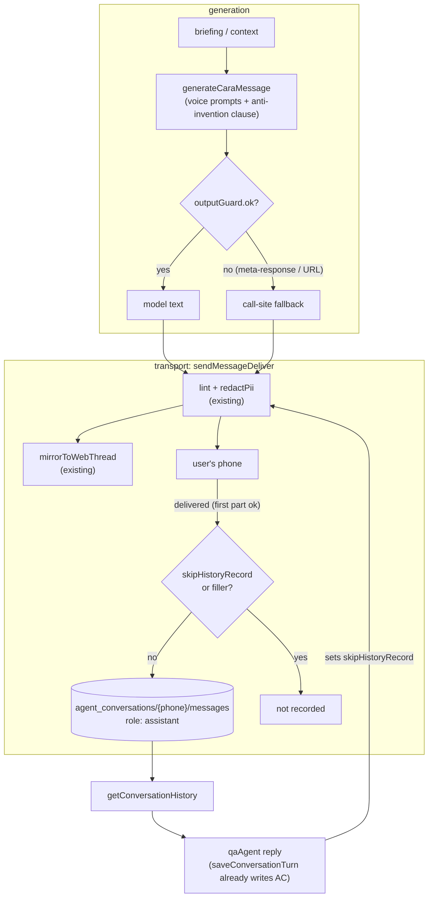

# fix: Evia hallucination hardening — grounding, output guards, outbound history

## Summary

Close every finding from the 2026-07-17 platform-wide hallucination audit. Three systemic fixes (anti-invention voice clause, model-output guard, outbound history recording) neutralize whole classes of failure; targeted fixes remove fabricated facts (prices, timing, money defaults, invented names); hardening fixes close policy gaps (who-is-who grounding, resend cooldown, web-app guards, memory-summary grounding). The triggering incident: Evia invented a client name ("Marcus") to a live caregiver, leaked a raw meta-response, then denied saying it.

---

## Problem Frame

Evia's message generation follows one systemic shape: free-form LLM generation from a thin briefing, delivered verbatim to a user's phone. The only transport filters are a fixed banned-phrase linter and SSN/card redaction — nothing inspects for invented names, meta-responses, composed URLs, or false action claims, and every fallback fires only on API error, never on hallucinated-but-non-empty output. Separately, only the QA agent's own turns are written to `agent_conversations/{phone}/messages` (its sole history source), so the 163+ scripted, scheduled, and trigger sends are invisible to it afterward — it truthfully-from-its-view denies its own messages. Full evidence: `docs/reports/hallucination-audit-2026-07-17.md`.

---

## Assumptions

- Scope is the complete audit — all tiers, plus the incident's MVR-classifier fix. Nothing is dropped for a later wave; sequencing lives in the phased units below.
- Commit and deploy are handled by the founder's existing workflow and are not implementation units; deploy cautions live in Operational Notes.
- No new MCP tools are added, so the tool-parity build guard (`functions/src/mcp/__tests__/parity.test.ts`) is not in play.
- The uncommitted who's-who wave (describeWhoIsWho in `staleSessionNudge`, qaAgent core context, system prompt, `runQuickReply`, FAMILY_VOICE) is still on disk; U8 verifies file state before extending it rather than assuming a clean slate.

---

## Requirements

**Generation guardrails**

- R1. No Evia-composed message may state a name, dollar amount, date/time, or timeframe that is absent from its briefing/context; when the briefing lacks a name, the message refers generically ("your visit", "the caregiver").
- R2. A model output that replies to the briefing author (meta-response) is never delivered; the call site's deterministic fallback is sent instead.
- R3. A model output containing a composed URL is never delivered from `generateCaraMessage` (links are delivered separately by the system).

**Conversation integrity**

- R4. Every user-visible outbound message is recorded to `agent_conversations/{phone}/messages` as an assistant turn — including scripted onboarding, scheduled nudges, triggers, webhook confirmations, and the QA loop's post-reply link bubbles — without double-writing the QA reply itself and without recording filler/typing signals.
- R5. The QA agent is instructed to never assert it did or did not send a message it has no record of; it offers to (re)send instead.
- R6. History rollup and nightly memory summaries preserve named entities (people, amounts, commitments) and are instructed to record only facts present in the source transcript.

**Fact grounding**

- R7. Display prices ($29.95/mo, $54.99/yr, $11.50) come from one source-of-truth module; no dollar literals remain in prompt strings.
- R8. No prompt promises background-check timing ("1–3 days" removed everywhere).
- R9. No money value is fabricated by a code default: the "$22/hr" earnings line is omitted when `hourlyRate` is unset; `request_booking` requires an explicit rate instead of defaulting to $20.
- R10. The QA agent treats an empty/null tool result as "none exist — say so plainly," never inventing entries.

**Attribution**

- R11. Every family-facing `generateCaraMessage` briefing that interpolates a senior/client name includes `describeWhoIsWho` output (respecting the `relationship === "self"` sentinel).
- R12. The three ungrounded-name sites and the empty-`priceLabel` site are grounded or instructed to stay generic.

**Flow behavior**

- R13. Gate-link resends are throttled: within the cooldown window an inbound gets an answer/ack without re-sending the link card.
- R14. "Not at the moment" and equivalents classify as a clear MVR decline, not `unclear`.
- R15. Web-app AI text surfaces (shift note, caregiver-search response, conversational booking) pass an output sanitizer before render.
- R16. The caregiver system prompt carries the same anti-hallucination boundary as the client prompt (knowledge boundary, `_toolError`, never-invent, empty-result).
- R17. The dead `caregiver_awaiting_identity` step is removed.
- R18. The two highest-blast-radius changes (outbound recording, output guard) ship behind default-ON kill switches.

---

## Key Technical Decisions

- **Output guard is a new pure module `functions/src/safety/outputGuard.ts`, mirroring `redactPii.ts`:** pure function over model output returning `{ ok, reason? }`, fail-open (never throws), `console.warn` with counts only. Guarding model OUTPUT is outside CLAUDE.md's no-regex-for-user-input rule (the audit notes this explicitly). Matching must be word-boundary-aware — do NOT copy `linter.ts`'s boundary-less `new RegExp(phrase, "gi")` construction (documented 2026-07-06 regression: substrings stripped from legitimate words).
- **Anti-invention clause is a shared exported constant in `caraMessage.ts`, and it replaces the "Be concrete — real names…" sentence** rather than appending a contradicting rule after it. Direct `messages.create` generators (morning briefing, weekly digest, trigger regeneration, job-posting mid-flow, human-reply helper) import the same constant so the wording never drifts.
- **Outbound recording hooks the single transport choke point `sendMessageDeliver` (`functions/src/linq/client.ts`), not per-sender helpers:** 163 send sites in `onboardingConversation.ts` alone make per-sender patching the exact miss that caused the incident, and the choke point auto-covers future senders. It reuses the already-computed lint+redact mirror text, but NOT `threadMirror.resolveUserIds`' cache — that function returns and caches the session's `userId` (a Firebase uid), while `agent_conversations` is keyed by PHONE (the `agent_sessions` doc id). U3 adds a sibling `resolvePhones(chatId)` in `threadMirror.ts` with its own TTL cache returning matched session DOC IDs, including a group fan-out: a chatId that resolves via the `groupChatId` branch records one row per member phone (parity with the mirror's group handling). Recording fires AFTER the first successful `sendOneMessage` return (still fire-and-forget), so a transport failure leaves no phantom row and a dead-letter redelivery records exactly once. Record once per logical message (per `sendMessage` call, not per split bubble); skip empty/attachment-only parts and filler (`signalThinking`'s path and qaAgent's mid-loop "On it — give me a moment.").
- **QA-loop double-write is prevented by a new `skipHistoryRecord?: boolean` on `SendOptions`,** following the `_noQueue` internal-flag precedent. Set it ONLY at the three call sites whose text `saveConversationTurn` already persists — the main reply send, `runQuickReply`'s send, and the checkpoint-resume send — never inside the shared `sendSplit` helper: `sendSplit` is also used by senders that are NOT otherwise persisted (`commitmentTracker`'s proactive follow-ups, the DND quiet-hours ack) and those must keep recording. The post-reply link bubble from `fulfillNarratedLinkPromise` does NOT set it, so it finally gets recorded.
- **Resend cooldown reuses the `isFlowStale` SetAt+TTL idiom** (`sessionState.ts`, established 2026-07-16) — a per-step `lastResentAt` written via the existing session helpers, 10-minute window. Inbound processing already runs behind the per-phone claim lock, which bounds the check-then-act race. The in-cooldown reply is deterministic, truthful copy that never claims a fresh send ("I sent that link about N minutes ago — if it hasn't come through, reply LINK and I'll resend it"), and a bare `LINK` reply bypasses the cooldown once per window (strict-keyword protocol, permitted by CLAUDE.md's binary-reply carve-out) — `classifyAwaitingReply` classifies "send it again" as `other` and DEFAULTS to `other` on classifier failure, so without the escape hatch the cooldown would mute exactly the carrier-filtered-link case the 2026-07-16 resend wave fixed.
- **`functions/src/config/pricing.ts` holds display strings only** (`"$29.95/month"`, `"$54.99/year"`, `"$11.50"`), shaped like `mvrConfig.ts`/`marketRateRange.ts` (named exported constants + accessors, no side effects). Stripe price IDs stay where they live today (`stripe.ts`, `mvrConfig.ts`). `caregiverOnboardingDirective.ts` imports `FALLBACK_RANGE` from `marketRateRange.ts` instead of re-typing "$18–28".
- **Kill switches use the default-ON pattern** (`process.env.X !== "false"`) in `functions/src/config/featureFlags.ts`: `OUTBOUND_HISTORY_RECORD_ENABLED`, `CARA_OUTPUT_GUARD_ENABLED`. Everything else in this wave is prompt text or small logic with test coverage — no flag.
- **Rollup keeps `HISTORY_WINDOW = 24`;** entity loss is fixed in the rollup and nightly-memory prompts (preserve names/amounts/commitments verbatim), not by growing the window — window growth raises every turn's token cost and is deferred.
- **Web-app guard is a small frontend sanitizer util applied at the three `services/ai.ts` surfaces.** `aiProxy` is a generic transport for varied response shapes; the three text surfaces are the user-visible risk and the minimal seam.
- **MVR decline fix is better classifier exemplars, not keyword matching:** add "not at the moment" / "not right now" / "maybe later" as explicit decline exemplars in the existing `parseWithClaude` prompt (stays LLM-parsed per CLAUDE.md).

---

## High-Level Technical Design

Outbound path after this wave — every generated message passes a guard at generation and a recorder at transport:

The QA agent reads `agent_conversations` — after this wave that collection finally contains what the scripted flow, nudges, and triggers actually said, so "who is Marcus" gets answered from the real record.

---

## Implementation Units

### Phase A — systemic core

### U1. Anti-invention voice clause + output guard in generateCaraMessage

- **Goal:** No invented names/facts under "be concrete" pressure (R1); meta-responses and composed URLs never delivered (R2, R3); guard behind `CARA_OUTPUT_GUARD_ENABLED` (R18).
- **Requirements:** R1, R2, R3, R18
- **Dependencies:** none
- **Files:** `functions/src/utils/caraMessage.ts`, `functions/src/safety/outputGuard.ts` (new), `functions/src/config/featureFlags.ts`, `functions/src/utils/__tests__/caraMessage.test.ts` (new), `functions/src/safety/__tests__/outputGuard.test.ts` (new)
- **Approach:** Export `ANTI_INVENTION_CLAUSE` from `caraMessage.ts` and splice it into both voices, replacing the "Be concrete — real names, dates, times, amounts — never vague" sentence with "Be concrete with the names, dates, times, and amounts given in the briefing — never vague. Use ONLY names, dates, times, and amounts that appear in the briefing; if a name or number is not given, refer generically ('your visit', 'the caregiver') and NEVER invent one." Wording template exists at `functions/src/agents/onboardingConversation.ts` (the `seniorName` ONLY-name rule near the pre-checkout briefing). Also rewrite FAMILY_VOICE's second invention-pressure line ("Use the senior's name — never 'your loved one'") to be briefing-conditional: when the briefing gives the senior's name, use it — never "your loved one"; when it doesn't, refer to "their visit" and never invent a name (a name-free briefing like gpsCheckin's otherwise leaves this line contradicting the new clause). `outputGuard.ts` exports `guardModelOutput(text): { ok: boolean; reason?: "meta_response" | "url" }` — word-boundary-aware meta-response detection requiring a CONJUNCTION: a context-request/inability shape (asking for more info, asking who someone is, addressing the briefing author) AND a briefing/transcript reference or role question. A bare mention of "briefing" or "transcript" is NOT a match (morning-briefing copy and credential "transcript" replies are legitimate). URL check: any `http(s)://`/`www.`/bare-domain occurrence. In `generateCaraMessage`, when the flag is on and the guard fails, `console.warn` a count-only marker and return `opts.fallback`. `caraMessage.ts` has no existing tests — first test file follows the `openaiClient.fallback.test.ts` pattern (`vi.mock("./claudeClient")` + `vi.resetModules()` + dynamic import).
- **Patterns to follow:** `functions/src/safety/redactPii.ts` (pure, fail-open, counts-only logging, design-rules comment block); `functions/src/utils/openaiClient.fallback.test.ts` (singleton reset testing); default-ON flag per `multiRecipientScopingEnabled` in `featureFlags.ts`.
- **Test scenarios:**
  - outputGuard: the exact leaked incident text ("Got it, but I need the briefing context to write this message, who's the caregiver…") → `ok: false, reason: "meta_response"`.
  - outputGuard: "Your check cleared — you're all set to apply for jobs!" → `ok: true` (no false positive on normal copy).
  - outputGuard: text containing "debriefing session with the team" → `ok: true` (word-boundary check; the 2026-07-06 substring regression must not recur).
  - outputGuard: "I'll include that in tomorrow's morning briefing" → `ok: true`; "you can send a photo of your certificate or transcript" → `ok: true` (bare-word mentions never match — the conjunction rule).
  - outputGuard: "Tap here: https://eviacares.com/pay" and "visit www.eviacares.com" → `ok: false, reason: "url"`.
  - generateCaraMessage: model returns a meta-response → resolves to `opts.fallback`, warn logged without message content.
  - generateCaraMessage: model returns valid text → returned unchanged; API throw → fallback (existing behavior preserved).
  - generateCaraMessage: `CARA_OUTPUT_GUARD_ENABLED=false` → guard bypassed, raw output returned.
  - Voice prompts: both `CAREGIVER_VOICE` and `FAMILY_VOICE` contain `ANTI_INVENTION_CLAUSE` and no longer contain the bare "real names" imperative; FAMILY_VOICE's senior-name line is the briefing-conditional form (unconditional "Use the senior's name" imperative gone).
- **Verification:** new tests green; `npm --prefix functions run build` clean; grep confirms no other module re-declares the clause text.

### U2. Anti-invention clause in direct message.create generators

- **Goal:** The generators that bypass `generateCaraMessage` carry the same grounding rule AND the same output guard — R2 is unscoped, and the meta-response leak is reproducible today on these seven raw-output paths (morningBriefing :107/:297, weeklyDigest :106, triggerEngine :122/:161, jobPostingFlow :60/:82).
- **Requirements:** R1, R2
- **Dependencies:** U1 (imports `ANTI_INVENTION_CLAUSE` and `guardModelOutput`)
- **Files:** `functions/src/scheduled/morningBriefing.ts`, `functions/src/scheduled/weeklyDigest.ts`, `functions/src/triggers/triggerEngine.ts`, `functions/src/agents/jobPostingFlow.ts`, `functions/src/agents/humanReply.ts`, plus one prompt-content test per file (colocated or existing test file where present)
- **Approach:** Append the imported constant to each generator's system prompt (morning briefing, weekly digest narrative, trigger fire-time regeneration, job-posting mid-flow answers, `answerHumanQuestionOnly`), and route each generator's model output through `guardModelOutput`, using the site's existing fallback/skip path on rejection (morning briefing's `fallbackLines`, triggerEngine's stored `trigger.message`, jobPostingFlow/humanReply's mid-flow fallback strings).
- **Patterns to follow:** prompt-text assertion style of `functions/src/mcp/__tests__/parity.test.ts` (assert source prompt contains required text); U1's guard-wiring shape in `generateCaraMessage`.
- **Test scenarios:**
  - each modified prompt builder's system string contains `ANTI_INVENTION_CLAUSE` (one assertion per file; import the constant, don't duplicate the string).
  - each generator: guard-rejected model output → the site's fallback path is used, raw output never sent (one test per file).
- **Verification:** tests green; build clean.

### U3. Outbound history recording at the transport choke point

- **Goal:** Everything Evia sends is visible to the QA agent afterward (R4), behind `OUTBOUND_HISTORY_RECORD_ENABLED` (R18); the amnesia/denial class dies.
- **Requirements:** R4, R18
- **Dependencies:** none (parallel with U1)
- **Files:** `functions/src/linq/threadMirror.ts`, `functions/src/linq/client.ts`, `functions/src/agents/qaAgent.ts`, `functions/src/config/featureFlags.ts`, `functions/src/linq/__tests__/outboundHistory.test.ts` (new)
- **Approach:** New `recordOutboundHistory({ chatId, text })` in `threadMirror.ts`, sibling of `mirrorToWebThread` — but with its OWN resolver: `resolveUserIds` returns/caches the session's `userId` (a uid), which is the WRONG key. Add `resolvePhones(chatId)` (own TTL cache) returning the matched `agent_sessions` DOC IDs — the doc id is the phone — including the `groupChatId` fan-out branch: a group send records one row per member phone, matching the mirror's group handling. Writes `{ role: "assistant", content, timestamp }` plus a `source` tag to `agent_conversations/{phone}/messages`, matching `saveConversationTurn`'s schema (`getConversationHistory` reads only role/content, so the extra field is inert). Invoke fire-and-forget from `sendMessageDeliver` AFTER the first successful `sendOneMessage` return (not beside the top-of-function mirror call), using the same computed mirror text (lint+redact applied) — a hard transport failure must leave no phantom row, and a dead-letter redelivery must record exactly once. Skips: `opts.skipHistoryRecord` (new `SendOptions` field, `_noQueue`-style internal flag), empty/attachment-only text, filler (`signalThinking`'s "On it — one sec…" path AND qaAgent's mid-loop `sendSplit(chatId, "On it — give me a moment.")`). `sendSplit` gains an optional opts param; `skipHistoryRecord` is set ONLY at the three `saveConversationTurn`-backed call sites (main reply, `runQuickReply`'s send, the checkpoint-resume send) — never inside `sendSplit` itself, so `commitmentTracker`'s follow-ups and the DND quiet-hours ack keep recording. Do NOT set it in `fulfillNarratedLinkPromise`, whose link bubble is currently delivered-but-unrecorded. No write for unresolvable chatIds (pre-session sends) — same early-return as the mirror. Window guardrail (uses the `source` tag): `getConversationHistory` over-fetches (limit ~60) and composes the 24-message window guaranteeing at least the last 6 user-role rows survive, dropping excess scheduled-source assistant rows first — a week of nudges must not displace everything the user ever said.
- **Execution note:** Start with a failing test that a scripted `sendMessage` lands an assistant row in `agent_conversations` — this is the incident's core regression test.
- **Patterns to follow:** `mirrorToWebThread` block in `sendMessageDeliver` (fire-and-forget `void`, try/catch, never delays SMS) including its `groupChatId` fan-out branch; `saveConversationTurn` batch-write schema in `qaAgent.ts`; Zep-style "fire-and-forget, never throw" error handling.
- **Test scenarios:**
  - Scripted send (plain `sendMessage`) → one assistant row with the lint+redacted text, keyed by PHONE (the session doc id), never by the session's `userId`.
  - Group-chat send (session matched via `groupChatId`) → one row per member phone.
  - Multi-bubble send (text with URL split into text + link parts) → exactly ONE history row per `sendMessage` call, not per bubble.
  - Send with `skipHistoryRecord: true` → no row (QA double-write prevention); checkpoint-resume turn → exactly one row total (from `saveConversationTurn`).
  - `commitmentTracker` follow-up via `sendSplit` → row IS recorded (flag must not live inside the helper).
  - `signalThinking` filler, qaAgent's "On it — give me a moment." filler, and attachment-only messages → no row.
  - chatId with no `agent_sessions` match → no write, no throw, SMS still delivered.
  - Transport throws (dead-letter path) → zero rows; drained redelivery that succeeds → exactly one row.
  - Recording write throws → send still succeeds (fire-and-forget isolation).
  - `OUTBOUND_HISTORY_RECORD_ENABLED=false` → no rows written.
  - Window guardrail: 30 scheduled-source assistant rows + 6 older user rows → composed window still contains all 6 user rows.
  - Integration: after a scripted send, `getConversationHistory(phone)` includes the message (the "who is Marcus" scenario — agent can now see it).
- **Verification:** tests green; build clean; manual trace in emulator or unit-level assertion that qaAgent's reply path produces exactly one row per turn (from `saveConversationTurn`), not two.

### U4. QA-agent prompt rules: parity, never-deny, empty-result, quick-reply fail-closed

- **Goal:** The agent's own rules stop the deny/invent behaviors the recorder can't reach (R5, R10, R16); the quick-reply grounding gate stops failing open (part of R2's spirit).
- **Requirements:** R5, R10, R16
- **Dependencies:** none
- **Files:** `functions/src/agents/qaAgent.ts`, `functions/src/agents/__tests__/qaAgentPromptRules.test.ts` (new)
- **Approach:** (1) Extend the client `KNOWLEDGE BOUNDARY` never-invent rule from locations to person names/relationships. (2) Add to both prompts: "Never assert you did or did not send a message you have no record of — offer to (re)send instead." (3) Add a global empty-tool-result rule: "An empty or null tool result means none exist; say so plainly, never invent entries." (4) Bring `buildCaregiverSystemPrompt` to parity: knowledge boundary, `_toolError` instruction, never-invent (locations + people), memory-source priority. (5) In `runQuickReply`, when `gateQuickReplyGrounding`'s checker errors or returns garbage, use the deterministic context fallback instead of shipping the ungated reply (today it fails open).
- **Patterns to follow:** existing `KNOWLEDGE BOUNDARY` block structure in `buildSystemPrompt`; prompt-text assertions per `parity.test.ts`.
- **Test scenarios:**
  - Client and caregiver system prompt source both contain: never-invent-people text, never-deny-unseen-message text, empty-tool-result text.
  - Caregiver prompt contains `_toolError` handling and memory-source priority text (parity assertions).
  - quickReply: grounding checker throws → deterministic fallback is sent, not the model reply.
  - quickReply: checker returns unparseable verdict → deterministic fallback.
  - quickReply: checker says supported → model reply sent (no over-blocking).
- **Verification:** tests green; two-half vitest run of touched suites (`qaAgent*` tests) green; build clean.

### Phase B — fact grounding

### U5. Pricing source of truth + timing-promise removal

- **Goal:** One module owns display prices (R7); no bg-check timing promises anywhere (R8).
- **Requirements:** R7, R8
- **Dependencies:** none
- **Files:** `functions/src/config/pricing.ts` (new), `functions/src/config/pricing.test.ts` (new), `functions/src/agents/onboardingConversation.ts` (STEP_FACTS blocks PLUS the literal sites outside them: ~:1295, :1325-1326, :2607, :2610, :2767, :2776, :3267-3271, :3445-3448, :3526), `functions/src/agents/caregiverOnboardingDirective.ts`, `functions/src/mcp/server.ts`, `functions/src/scheduled/staleSessionNudge.ts` (:171-196), `skills/explain-bill/SKILL.md`, `functions/src/utils/marketRateRange.ts` (import side only)
- **Approach:** `pricing.ts` exports named display constants and accessors (`clientMonthlyDisplay()` → "$29.95/month", `caregiverAnnualDisplay()` → "$54.99/year", `mvrDisplay()` → "$11.50"), shaped like `mvrConfig.ts` — no side effects, optional env override later. Replace ALL price literals — the STEP_FACTS blocks, `caregiverOnboardingDirective`'s MONEY/TRUST line, `mcp/server.ts`'s `get_signup_completeness` detail strings, and every grep hit in the Files list (the MVR ask briefings, membership-send copy, match-pitch, staleSessionNudge step copy, and the explain-bill skill doc) — with interpolations. Delete "usually 1–3 days" everywhere it appears: the three STEP_FACTS blocks AND the plain deterministic copy sites (onboardingConversation ~:1295, :1325-1326, :3271, :3448, :3526); replace with "Evia texts you the moment it clears." (R8 covers deterministic user copy, not just LLM-facing strings). Replace `caregiverOnboardingDirective.ts`'s `DEFAULT_RATE_RANGE_TEXT` literal with a value derived from `FALLBACK_RANGE`.
- **Patterns to follow:** `mvrConfig.ts` accessor shape; `mvrConfig.test.ts` env save/restore test pattern; `serviceArea.ts` "single source of truth" comment framing.
- **Test scenarios:**
  - pricing accessors return the three canonical strings.
  - Grep-style source assertions: no `$29.95`, `$54.99`, `$11.50` literal remains in `onboardingConversation.ts`, `caregiverOnboardingDirective.ts`, `mcp/server.ts`, or `staleSessionNudge.ts` prompt strings (test reads source text, mirroring `parity.test.ts` technique).
  - No "1–3 days"/"1-3 days" remains in `functions/src` prompt strings.
  - Directive rate-range text equals the `FALLBACK_RANGE`-derived string.
- **Verification:** tests green; build clean.

### U6. Remove fabricated money defaults

- **Goal:** Unknown money is stated as unknown, never defaulted (R9).
- **Requirements:** R9
- **Dependencies:** none
- **Files:** `functions/src/agents/qaAgent.ts` (earnings line — both construction sites live in the caregiver prompt builder, ~:720 and ~:765; there is no client-side analogue), `functions/src/mcp/server.ts` (`request_booking`), colocated test updates
- **Approach:** In prompt construction, omit the "The caregiver earns $X/hr" line when `hourlyRate` is unset (no `?? 22`). In `request_booking`, when rate is absent return a structured tool error telling the agent to ask for/confirm the rate rather than booking at a silent $20.
- **Test scenarios:**
  - Caregiver with `hourlyRate: 27` → prompt contains "$27"; caregiver without a rate → prompt contains no earnings line and no "$22".
  - `request_booking` without a rate → returns the ask-for-rate error, does not create a booking with rate 20.
  - `request_booking` with an explicit rate → books normally.
- **Verification:** touched suites green; build clean.

### U7. Ground the ungrounded sites + MVR decline exemplars

- **Goal:** The three Marcus-analogue briefings and the empty-price briefing stop inviting invention (R12); "Not at the moment" declines MVR (R14).
- **Requirements:** R12, R14
- **Dependencies:** U1 (clause exists as backstop; this unit grounds the specific briefings)
- **Files:** `functions/src/agents/gpsCheckin.ts`, `functions/src/linq/routeIntent.ts` (both cancellation-notice sites), `functions/src/agents/onboardingConversation.ts` (match-pitch briefing + MVR classifier prompt), colocated/existing test files for each
- **Approach:** `gpsCheckin` family arrival alert: interpolate the senior's name from the appointment (falling back to an explicit "do not name the senior; say 'their visit'" instruction when absent). Both `routeIntent` cancellation notices: add "refer to it only as 'the visit on {date}' — do not name the client unless given." Match-pitch briefing: when `priceLabel` is falsy, replace "state the price" with "do NOT state a specific dollar amount — say 'a simple monthly membership'" (U5's `pricing.ts` can supply the label where appropriate). MVR classifier: add decline exemplars ("not at the moment", "not right now", "maybe later") to the existing `parseWithClaude` instruction so soft declines stop landing in `unclear` and triggering the re-ask that hallucinated Marcus.
- **Test scenarios:**
  - gpsCheckin briefing with a named senior contains the name; without one contains the do-not-name instruction (source/briefing assertion via mocked `generateCaraMessage` capturing `context`).
  - Both cancellation briefings contain the only-the-visit-on-date instruction.
  - Match-pitch briefing with empty `priceLabel` contains the do-not-state-amount instruction and no "state the price".
  - MVR classifier prompt contains the three decline exemplars; classifier fast-path for strict "NO" unchanged.
- **Verification:** touched suites green; build clean.

### Phase C — policy compliance and hardening

### U8. describeWhoIsWho rollout to the 24 family-facing sites

- **Goal:** Every family-facing briefing interpolating a senior/client name carries who-is-who grounding (R11).
- **Requirements:** R11
- **Dependencies:** U1 landed (shared clause); verify current disk state of the uncommitted who's-who wave first.
- **Files:** `functions/src/scheduled/firstVisitActivation.ts`, `functions/src/scheduled/noVisitCheck.ts`, `functions/src/scheduled/familySilenceCheckin.ts`, `functions/src/scheduled/familySatisfactionCheckin.ts`, `functions/src/scheduled/nextDayFamilyFeedback.ts`, `functions/src/scheduled/preShiftFamilyCheckin.ts`, `functions/src/scheduled/clientDayBeforeReminder.ts`, `functions/src/scheduled/clientThirtyMinReminder.ts`, `functions/src/scheduled/upcomingVisitReminder.ts`, `functions/src/scheduled/morningBriefing.ts`, `functions/src/linq/webhooks.ts`, `functions/src/linq/routeClient.ts`, `functions/src/linq/routeCaregiver.ts`, `functions/src/agents/issueEscalator.ts`, `functions/src/triggers/jobApplicationTriggers.ts`, `functions/src/agents/jobPostingFlow.ts`, `functions/src/agents/permissionsConversation.ts`, `functions/src/agents/onboardingConversation.ts` (pre-checkout site), `functions/src/agents/bereavement.ts`, plus a shared test in `functions/src/agents/__tests__/`
- **Approach:** Append `describeWhoIsWho(...)` output to each briefing's `context`, sourcing recipient data the way each call site already loads it (session `onboardingData` vs care-recipient doc). Honor the `relationship === "self"` self-signup sentinel (no disambiguation line for self-recipients). Order by risk: the ten proactive scheduled nudges first (the founder-reported failure shape), then transactional/reactive, then bereavement (grief-sensitive copy — keep the line minimal there). Where a site cannot cheaply load recipient data, prefer an explicit "the reader is the family member; the care recipient is {name}" inline line over skipping.
- **Patterns to follow:** the four already-wired sites from the who's-who wave (`staleSessionNudge`, qaAgent core context, system prompt, `runQuickReply`) — reuse their exact invocation shape; `functions/src/agents/careRecipients.ts` rule comment.
- **Test scenarios:**
  - One representative test per group (scheduled nudge, route reply, escalator, bereavement): captured `context` contains the who-is-who line when a senior name is interpolated.
  - Self-signup (`relationship === "self"`) → no "coordinating for" disambiguation line.
  - Count check: a source-scan test asserting no family-facing `generateCaraMessage` call in the listed files interpolates `seniorName`/`seniorPart` without `describeWhoIsWho` (prevents regression at these 24 sites).
- **Verification:** tests green; build clean; diff review confirms all 24 audit-listed sites touched or already covered by the prior wave.

### U9. Gate-link resend cooldown

- **Goal:** A parked step never re-blasts its link card more than once per window (R13); questions still get answered.
- **Requirements:** R13
- **Dependencies:** none
- **Files:** `functions/src/agents/onboardingConversation.ts` (`resendGateLink`, `handleCaregiverResendMembership`, `handleCaregiverResendMvr`), `functions/src/agents/__tests__/resendCooldown.test.ts` (new)
- **Approach:** Per-step `lastResentAt` map stored via the existing session write helpers (`gateLinkResentAt: { [step]: ISO }` in the session), checked with the `isFlowStale` SetAt+TTL idiom — 10-minute window. The cooldown gates only the `other`→resend branch (`ack`/`question` paths are untouched). The in-cooldown `other` reply is DETERMINISTIC, truthful copy — "I sent that link about N minutes ago — if it hasn't come through, reply LINK and I'll resend it." — never LLM-generated (an LLM reply briefed on the resend flow could falsely claim "just resent it", the incident class this wave kills). A bare `LINK` reply bypasses the cooldown once per window; this matters because `classifyAwaitingReply` classifies "send it again" as `other` and DEFAULTS to `other` on classifier failure — a caregiver whose link was carrier-filtered must have a same-minute escape hatch. `resendGateLink` already re-reads the fresh session before sending — write the timestamp in the same update. The per-phone inbound claim lock bounds double-tap races; no transaction needed.
- **Execution note:** Add the resend-path test cases per the 2026-07-16 convention — guards must be proven on resend paths, not assumed inherited.
- **Patterns to follow:** `isFlowStale` in `sessionState.ts`; `resendGateLink`'s fresh-read-then-act shape.
- **Test scenarios:**
  - First `other`-classified inbound at a parked step → link resent, `gateLinkResentAt[step]` written.
  - Second `other` inbound 2 minutes later → NO link card; the deterministic in-cooldown copy goes out (contains "reply LINK", never claims a fresh send).
  - "can you send it again?" during cooldown (classified `other`) → same deterministic copy, no false "just resent it" claim.
  - Bare "LINK" during cooldown → link resent immediately, bypass consumed (a second "LINK" in the same window does not resend again).
  - Classifier error (defaults to `other`) during cooldown → deterministic copy, no crash, no resend.
  - Inbound 11+ minutes later → link resent again.
  - `question` inbound during cooldown → answered normally (cooldown doesn't mute answers).
  - Membership resend when webhook already recorded payment → still short-circuits to the paid path (existing behavior preserved).
  - Cooldown state missing/corrupt → resend proceeds (fail-open, never wedges the gate).
- **Verification:** tests green; build clean.

### U10. Web-app AI output sanitizer

- **Goal:** The three SPA-rendered AI text surfaces get the guard the SMS path has (R15).
- **Requirements:** R15
- **Dependencies:** none (frontend mirror of U1's rules; keep phrase lists aligned by review, not import — separate bundles)
- **Files:** `utils/sanitizeAiText.ts` (new, frontend), `services/ai.ts` (three call sites: `generateShiftNote`, `searchCaregivers` responseText, `conversationalBooking` response), `utils/__tests__/sanitizeAiText.test.ts` (new)
- **Approach:** Pure frontend util: strips/blocks meta-responses (same marker set as `outputGuard.ts`) and falls back to the surface's canned string; DOMPurify already covers markup (`utils/sanitize.ts`) — this adds the hallucination-shape checks only. Apply at the three return points in `services/ai.ts`.
- **Patterns to follow:** `utils/sanitize.ts` module shape and test placement.
- **Test scenarios:**
  - Meta-response text → surface fallback returned.
  - Normal shift-note text → unchanged.
  - Empty model text → fallback (today an empty string can render).
- **Verification:** frontend vitest half green; `npm run build` clean.

### U11. Memory-summary grounding (nightly memory + history rollup)

- **Goal:** Summaries stop being an unguarded hallucination vector re-injected as trusted context (R6).
- **Requirements:** R6
- **Dependencies:** none (the preserve-entities instruction is bespoke to summary prompts; it does not use `ANTI_INVENTION_CLAUSE`)
- **Files:** `functions/src/scheduled/nightlyMemory.ts`, `functions/src/agents/contextManagement.ts` (rollup prompt), `functions/src/memory/memoryFiles.ts`, `functions/src/agents/careMemory.ts`, prompt-content tests colocated
- **Approach:** Add to each summary/rollup prompt: "Record ONLY facts present in the transcript above — never infer or invent. Preserve verbatim: people's names, dollar amounts, and any commitments or promises made." The rollup prompt additionally drops its "drop pleasantries, durable facts only" phrasing's implicit license to discard named entities. `HISTORY_WINDOW` stays 24 (see KTD).
- **Test scenarios:** each modified prompt string contains the preserve-entities instruction (source assertions); rollup summary prompt no longer instructs dropping names.
- **Verification:** tests green; build clean.

### U12. Remove dead caregiver_awaiting_identity step

- **Goal:** The retired step stops violating the "every awaiting step has a live-fact builder" invariant (R17).
- **Requirements:** R17
- **Dependencies:** none
- **Files:** `functions/src/agents/onboardingConversation.ts` (both forwarding handlers + switch case), any test referencing the step
- **Approach:** Delete the step's cases; both handlers already forward immediately to `caregiver_send_bgcheck`, so removal is behavior-neutral. Grep for the literal step string across `functions/src` before deleting; leave any historical session docs untouched (unknown step strings already fall through to the default path).
- **Test scenarios:** Test expectation: minimal — one assertion that a session parked at the removed step string routes to the default/absorber path rather than crashing (covers stale prod sessions).
- **Verification:** grep shows no remaining references; full touched-suite run green; build clean.

---

## Scope Boundaries

**Deferred to Follow-Up Work**

- Raising `HISTORY_WINDOW` above 24 — revisit after U3+U11 land and real history volume is observable (U3 already ships the user-turn retention guardrail; only the window size itself is deferred).
- The `supervise()` constitution check's weak/fail-open posture on `safeSend` paths — this wave adds the deterministic guard layer; strengthening the LLM supervisor is a separate effort.
- Named-entity guard on hallucinated URLs in the qaAgent path (qaAgent relies on supervise + its multi-gate pipeline; `generateCaraMessage` URLs are covered by U1).
- Backfilling `agent_conversations` with historical scripted sends — recording starts at deploy; the web-thread mirror remains the historical record.
- Web-chat-vs-SMS split-brain (noted unaudited in the gap scan memory) — separate audit.

**Outside this wave**

- Any change to Stripe price IDs, checkout flows, or charge logic — `pricing.ts` owns display strings only.
- Model/provider changes (`generateCaraMessage` stays on its hardcoded Haiku model; the model ladder is untouched).

---

## Risks & Dependencies

- **History-window crowding (U3):** scheduled nudges and gate messages now consume the 24-message window. Mitigated by U3's window guardrail (last 6 user rows always survive, scheduled-source rows dropped first) and the kill switch; raising the window itself stays deferred.
- **QA double-write / missed-skip (U3):** the flag must live at the three `saveConversationTurn`-backed call sites only — inside `sendSplit` it silently unrecords `commitmentTracker`; missing the resume site double-writes. Mitigated by the exactly-one-row-per-turn tests (incl. resume) and the commitmentTracker-records test.
- **Sanitizer drift (U10):** the frontend marker list is aligned with `outputGuard` by review, not import (separate bundles) — the lists will drift after the first server-side tweak. Accepted for this wave; add a shared fixture test if drift bites.
- **Guard false positives (U1/U10):** legitimate copy mentioning "briefing" (e.g., morning briefing announcements) could trip the meta-response check. Mitigated: word-boundary + multi-marker matching (require the ask-for-context shape, not the bare word), fail-open design, count-only warn logs to watch post-deploy, kill switch.
- **Cooldown suppressing a needed resend (U9):** 10-minute window is short; `question` path still answers; fail-open on corrupt state. Residual risk accepted.
- **Prompt-rule regressions (U4/U11):** longer system prompts can shift model behavior. Mitigated by golden-transcript/eval suites already in repo (`qaAgent.onboarding.eval.test.ts`) — run them in the two-half split.
- **Uncommitted who's-who wave (U8):** the prior wave's edits are on disk but uncommitted; U8 must not clobber or duplicate them. First step of U8 is a file-state check.
- **Vitest OOM:** full suite must run in two halves (documented practice); frontend build needs `NODE_OPTIONS=--max-old-space-size=8192` (already in `scripts/build.mjs`).

---

## Acceptance Examples

- AE1. **Given** an MVR re-ask briefing with no client name, **when** the message is generated, **then** it contains no proper name (generic "your profile"/"the driving check") — the Marcus shape is impossible even if the model tries (guard + clause).
- AE2. **Given** the model replies "I need the briefing context to write this message…", **when** `generateCaraMessage` resolves, **then** the user receives the call site's fallback text and a count-only warn is logged.
- AE3. **Given** the scripted flow texted "…add that driving record check to Marcus's intake…", **when** the user later asks "who is Marcus", **then** the QA agent's history contains that exact outbound text and it answers from the record instead of denying it.
- AE4. **Given** a caregiver parked at `caregiver_awaiting_membership` sends three non-question messages in five minutes, **when** each is processed, **then** the checkout link card is sent at most once and every message still gets a text reply.
- AE5. **Given** a caregiver doc with no `hourlyRate`, **when** the caregiver asks "how much do I make?", **then** Evia says it doesn't have their rate on file — never "$22/hr".

---

## Open Questions

- **Redaction scope and access posture for the expanded `agent_conversations` (U3) — founder decision before the flag ships ON in prod.** U3 changes the collection from QA-replies-only to every outbound body (bg-check status, care-task reminders, payment confirmations), and `redactPii` scrubs only SSN / card numbers / non-company emails. Decide: (a) whether redaction needs new categories (DOB, license-style identifiers, care-task/medical-adjacent text) before enabling, (b) whether the collection gets an explicit deny rule in `firestore.rules` instead of relying on the trailing catch-all, and (c) whether a retention/TTL policy is wanted given the platform's HIPAA-adjacent posture. U3 can land with `OUTBOUND_HISTORY_RECORD_ENABLED=false` while this is decided.

---

## Operational Notes

- Deploy from `CareConnecxx-main` only; set `FUNCTIONS_DISCOVERY_TIMEOUT` as plain seconds; diff env VALUES before any full functions deploy (partial `.env` full deploy wipes secrets). No new callables are created, so no IAM invoker check is needed.
- Post-deploy watch: the U1 guard's count-only warn marker (false-positive rate) and spot-check `agent_conversations` rows for a scripted send (U3 live proof). Kill switches: `CARA_OUTPUT_GUARD_ENABLED=false`, `OUTBOUND_HISTORY_RECORD_ENABLED=false`.
- The working tree already carries the uncommitted who's-who wave — commit ordering must keep that wave's edits intact (deploy ships the working tree; "uncommitted" ≠ "not live").

---

## Sources & Research

- `docs/reports/hallucination-audit-2026-07-17.md` — origin document; all findings, file:line evidence, and the audit's tier structure.
- `functions/src/linq/client.ts` (`sendMessageDeliver`, `mirrorToWebThread` block) — the recording choke point and its template.
- `functions/src/safety/redactPii.ts` + `functions/src/safety/linter.ts` — guard-module shape; `docs/bug-audit-2026-07-06.md` §3.7 — the boundary-less regex regression U1 must not repeat.
- `docs/plans/2026-07-16-001-fix-launch-readiness-review-fixes-plan.md` — resend-path parity convention and `isFlowStale` idiom (U9).
- `docs/plans/2026-07-09-002-awaiting-step-live-facts-spec.md` — gate-step fact-injection registry pattern; vitest `beforeEach` no-return gotcha for all new tests.
- `functions/src/mvrConfig.ts`, `functions/src/config/caraModels.ts`, `functions/src/utils/marketRateRange.ts` — config-module shapes for `pricing.ts` (U5).
- `functions/src/agents/careRecipients.ts` (`describeWhoIsWho`) and the uncommitted who's-who wave — invocation shape for U8.
