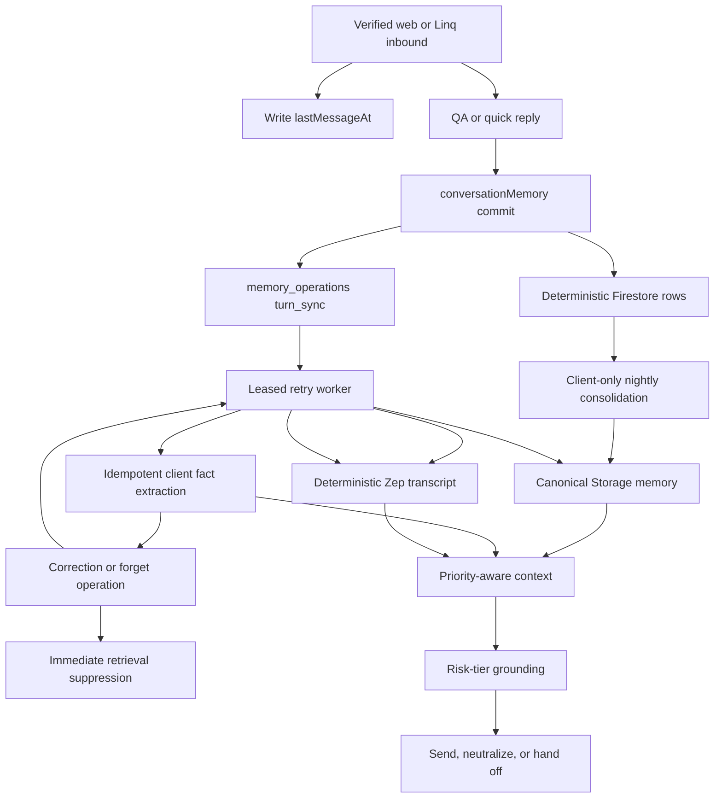

# fix: Harden Evia Memory Continuity And Factual Grounding

## Goal Capsule

| Field | Value |
|---|---|
| Objective | Make Evia remember consistently across web and SMS, make durable consolidation actually run, prevent corrected or forgotten facts from resurfacing, and stop unsupported high-risk facts from reaching users. |
| Code authority | `fix/shared-profile-briefing` and `origin/main` at `ea843ef`. Re-read changed seams if implementation starts after either ref moves. |
| Existing prerequisites | The deployed hallucination wave already provides anti-invention prompts, model-output guards, outbound history recording, grounded summary prompts, and quick-reply fail-closed behavior. The state-parity wave already self-heals missing Zep threads. Current source at `ea843ef` adds `profileBriefing.ts` grounding for facts shared during signup. This plan extends those systems; it does not rebuild them. |
| Execution profile | Firebase Functions, Firestore indexes/rules, Cloud Storage memory files, Zep, and backend tests. No frontend or Hosting change is planned. |
| Stop conditions | Stop before weakening identity isolation, deleting a whole Zep user/thread to remove one fact, claiming a forget operation completed while any store is pending, logging raw memory content in new telemetry, or deploying without explicit production approval. |
| Tail ownership | Implementation owns tests, index deployment, backfill proof, function deployment, synthetic production smokes, monitoring, rollback evidence, and final local/remote/deployed SHA reporting. |

---

## Product Contract

### Summary

Evia currently has four useful memory layers:

1. Firestore conversation history for recent verbatim turns.
2. Zep thread and graph context for long-term conversational recall.
3. Storage-backed canonical memory files plus Firestore embeddings.
4. Firestore learned facts for compact, weighted durable facts.

The layers do not yet behave as one dependable memory system. The correct checkout confirms that nightly consolidation filters on `agent_sessions.lastMessageAt`, but no runtime writes that field. Zep context errors are swallowed into `""`, so `qaAgent` records outages as legitimate empty memory. Web agent turns save Firestore history but skip the Zep transcript and learned-fact tail used by SMS. Corrections search only the ten prompt facts and mutate learned facts without removing stale Storage or Zep copies. Temporary `tool_*` files are injected and searched as if they were durable family memory. `qaAgent` still reads the legacy `seniors` collection before the canonical `senior_profiles` store used by current onboarding, web, and MCP paths.

This plan repairs those verified gaps. It does not add a fifth general-purpose memory store, replace Zep, replace the agent loop, or duplicate the hallucination hardening already deployed.

### Confirmed Current-State Evidence

| Finding | Current source evidence | Disposition |
|---|---|---|
| Nightly selection is effectively dead | `functions/src/scheduled/nightlyMemory.ts` reads `lastMessageAt`; no non-test runtime writer exists. It compares an unknown stored type to an ISO string and does not filter `userType`. | Fix in U2. |
| Zep failure is mislabeled as empty | `functions/src/memory/zepClient.ts:getZepContext` catches both request failures and returns `""`; `qaAgent` only injects `memory_unavailable` when the promise rejects. | Fix in U1. |
| Zep timeout can log after success | `qaAgent` uses an uncleared `Promise.race` timer. A fast Zep result leaves the losing timeout active. | Fix in U1. |
| Web and SMS durable writes differ | `webChat.ts` calls `runQaAgent` directly. User Zep writes, assistant Zep writes, and client fact extraction live in `routeIntent.ts`. | Fix in U3. |
| Correction candidates are truncated | `detectAndApplyCorrection` calls `getRelevantFacts`, which returns at most ten prompt facts. | Fix in U4. |
| Cross-store correction/forget is incomplete | Learned facts are superseded, then a new Zep event is appended. Existing Zep edges/episodes and Storage memory can retain the old assertion. | Fix in U4. |
| Topic ranking exists but is not used | `getRelevantFacts(userId, topic)` already supports semantic reranking; `qaAgent` calls it without the current message and labels the result a complete list. | Wire in U5; do not rebuild retrieval. |
| QA reads a legacy senior store | `qaAgent:getSeniorProfile` reads `seniors/{seniorId}`. MCP already reads `senior_profiles` first and falls back to `seniors`. | Fix in U6. |
| Broad hallucination defenses are already shipped | `outputGuard.ts`, anti-invention clauses, outbound transport history, summary grounding, and quick-reply fail-closed tests exist on `origin/main`. | Preserve; extend only the narrow claim detector in U7. |
| High-risk claim detection remains incomplete | `detectConfidenceClaim` catches a small diagnosis list, proper-name patterns, amounts, and some schedules. It misses common allergy, condition, age, location, relationship, and authority claims. The main verifier still fails open on timeout/garbage. | Fix in U7. |
| Grounding omits the current inbound | The main handoff payload and quick-reply gate receive prior history/context but not the current user message as an explicit evidence block. A draft that truthfully repeats a newly shared fact can be misclassified. | Fix in U7. |
| Tool offloads become long-term memory | `contextManagement.ts` writes `tool_<name>_<timestamp>` to the memory namespace; `getMemoryContext`, substring search, semantic search, and `cara_knows` include all files. | Fix in U8. |
| Memory telemetry retains raw content | `agent_uncertainty_log`, several `console.warn` previews, and handoff alert context store message/reply snippets. Zep logs include raw thread/user IDs and a query prefix. | Reduce in U1/U7/U9. |

### Actors

- A1. Client or authorized family member using authenticated web chat or a verified Linq SMS/iMessage session.
- A2. Caregiver using authenticated web chat or a verified Linq SMS/iMessage session.
- A3. Evia runtime: web/Linq ingress, routing, `qaAgent`, quick reply, memory services, and scheduled workers.
- A4. Operations administrator monitoring aggregate memory health and retry state without unnecessary access to conversation text.

### Requirements

#### Activity And Consolidation

- R1. Every accepted inbound turn for an existing verified session updates `agent_sessions/{phone}.lastMessageAt` with a Firestore server `Timestamp` before model execution. Rejected, rate-limited, invalid-signature, or unbound-identity requests do not update it.
- R2. Nightly family-memory consolidation selects only completed, opted-in client sessions active in the last seven days through a server-side indexed query. Caregiver sessions never enter the family-memory prompt.
- R3. Existing sessions receive a bounded, dry-run-first activity backfill from the latest Firestore user conversation row. Missing roles may be repaired only from an explicit canonical role on `users/{userId}`; ambiguous sessions remain excluded. The backfill never derives state from message text.
- R4. Nightly work is paginated and bounded. One client failure does not block other clients or the existing booking-pattern, conversation-compression, and execution-agent cleanup tasks.

#### Zep Health And Turn Parity

- R5. Zep context retrieval returns a discriminated outcome: `loaded`, `empty`, `unavailable`, or `timeout`. No caller infers provider health from a string.
- R6. An unavailable/timeout result injects the existing `memory_unavailable` instruction. A legitimate empty result does not page operations. Client and caregiver paths use identical status semantics.
- R7. Zep request timers are cleared on every path and use the SDK request `abortSignal` where supported. Fast success must never emit a later timeout warning.
- R8. Successful web and SMS agent/quick turns attempt equivalent recent Firestore rows and Zep user/assistant transcript messages. Eligible client turns run the same learned-fact extraction policy; caregiver turns remain excluded from family-fact extraction. A typed persistence failure is observable but must not re-drive a user turn whose tools or reply may already have committed.
- R9. Turn persistence is idempotent by stable source-turn key. Firestore message IDs, operation IDs, learned-fact IDs, and Zep message UUIDs are deterministic or reconciled before retry. A worker crash after a provider call must not silently create duplicate transcript episodes on retry. Conversation compression must not summarize/delete source rows while their memory sync is unresolved. Zep transcript writes preserve per-user source-turn order and carry the original turn timestamp, not dispatch time.
- R10. Pre-completion onboarding Zep writes and structured business-event writes remain in place unless a unit explicitly replaces them. U3 removes only the duplicate default QA/quick tail in `routeIntent.ts` after shared persistence owns it.

#### Corrections, Forgetting, And Retrieval

- R11. Correction/forget matching uses a dedicated bounded active-fact candidate reader, not the ten-fact prompt reader. Candidate identity comes from the authenticated/verified session, never model-supplied user IDs.
- R12. Correction/forget detection returns a typed outcome (`not_correction`, `no_match`, `ambiguous`, `pending`, `completed`, `failed`) so `qaAgent` does not convert a partial operation into a success claim.
- R13. A correction immediately makes the old fact ineligible for retrieval, installs the corrected fact as current, and durably propagates to applicable Storage files/embeddings and matching Zep edges. Pending propagation is retried and stale lower-priority sources are masked.
- R14. A forget request immediately makes the target ineligible for all Evia retrieval, then removes it from learned facts, Storage files/embeddings, matching Zep edges, and source episodes. The operation record stores references/statuses only; it does not copy the forgotten fact, user message, or transcript excerpt. Physical deletion is not reported complete until all required targets are confirmed.
- R15. If correction/forget matching is ambiguous, Evia asks one clarifying question and changes nothing. If no active fact matches, Evia says it cannot identify that memory rather than guessing.
- R16. Prompt retrieval calls the existing `getRelevantFacts(userId, currentText)` topic path and labels results `Relevant learned facts`. Fresh user text, fresh tool results, canonical live Firestore state, and pending correction/forget suppression outrank every durable memory source.

#### Canonical Context, Grounding, And Transient Data

- R17. A shared server repository reads `senior_profiles/{seniorId}` first and falls back to legacy `seniors/{seniorId}` only when canonical data is absent. `qaAgent`, quick reply, prefetch, and MCP profile reads use the same order; MCP ownership checks remain at the authorization boundary.
- R18. Claim detection covers unsupported medical conditions, allergies, prior events, age, location/address, relationships, schedules, caregiver availability, action/authorization, and money/payment facts even when no proper name appears.
- R19. Grounding evidence explicitly includes the current inbound message, prior conversation, canonical/context facts, and current-turn tool observations. High-risk medical, identity/relationship, authorization/action, and payment claims fail closed to deterministic neutral copy when verification times out or is indeterminate. Grounded claims pass. Low-risk conversational candidates retain an explicitly documented fallback. Existing crisis/emergency fast paths remain ahead of this gate.
- R20. `tool_*` offloads are transient working data. They remain directly readable by exact pointer during a 24-hour lifetime but are excluded from default prompt context, substring search, semantic search, consolidation, and `cara_knows`; expired objects and embeddings are deleted.
- R21. New/changed telemetry contains outcome enums, counts, latency, opaque operation/turn references, and sanitized error classes. It must not add raw messages, fact text, phone numbers, Zep IDs, query prefixes, draft replies, or prior replies.
- R22. Deployment includes required Firestore indexes before dependent code, targeted Functions or a reviewed full Functions deploy, synthetic production smokes, and exact live proof. Hosting is not deployed unless frontend output changes.
- R23. Corrected and forgotten facts cannot be passively resurrected by learned-fact extraction, conversation compression, or nightly consolidation. Durable suppression uses a server-only no-plaintext fingerprint/provenance state; an explicit later request to remember the fact again is a separate confirmed operation.

### Acceptance Examples

- AE1. A client shares a durable preference in web chat and later asks by SMS. Evia recalls it without a duplicate learned fact or duplicate Zep episode.
- AE2. Zep throws. The prompt receives `memory_unavailable`, metrics say `unavailable`, and a medication/allergy answer asks for confirmation instead of using hidden stale memory.
- AE3. Zep successfully returns no context. Metrics say `empty`; no timeout warning or outage alert appears six seconds later.
- AE4. A recently active completed client is selected by nightly consolidation. A completed caregiver and an opted-out client are not selected.
- AE5. A corrected fact ranks below the ten prompt facts. The dedicated candidate reader still finds and corrects it.
- AE6. A user asks Evia to forget a synthetic penicillin allergy. It is suppressed immediately. After completion, no learned fact, memory file, embedding, Zep edge, or source episode returns it, `memory_operations` contains no plaintext copy, and the next extraction/nightly run does not recreate it from old conversation rows.
- AE7. `senior_profiles/s1` and `seniors/s1` disagree. Evia uses the canonical name/location/age/needs while MCP still denies cross-household access.
- AE8. Evia drafts `She has Parkinson's`, `She is allergic to penicillin`, `She is 82`, or `She lives in Sacramento` without evidence. Each enters grounding and is rewritten or held. Evidence-backed equivalents pass.
- AE9. A large invoice/applicant result is offloaded. The current loop can read it by exact pointer, the next unrelated turn cannot retrieve it by default, and cleanup deletes it plus embeddings after 24 hours.
- AE10. The same Linq event or web `clientMessageId` is retried after a worker lease expires. Firestore rows, learned facts, Zep transcript messages, and memory operations do not multiply.

### Scope Boundaries

**In scope**

- Activity timestamping and client-only nightly selection.
- Typed Zep context and privacy-safe Zep logging.
- Web/SMS parity for completed-session QA and quick-reply turns.
- Durable retry/idempotency for external turn-memory writes.
- Cross-store correction/forget semantics.
- Existing topic reranking wired into prompts.
- Canonical senior-profile read order.
- High-risk claim detector/verifier failure behavior.
- Transient tool-result lifecycle.
- Backfill, indexes, tests, runbook, deployment, and production proof.

**Out of scope**

- Replacing Zep, changing the base LLM, or replacing the agent loop.
- Reimplementing the deployed anti-invention/output-guard/outbound-history wave.
- Reimplementing Zep thread self-heal.
- Caregiver-specific Storage memory files or caregiver nightly family summaries.
- A user-facing memory management screen.
- Full account/privacy erasure of legally or operationally retained source conversations. `Forget` here means Evia stops retrieving the fact and removes its derived long-term memory. A request to erase the complete source transcript follows the platform's separate data-erasure policy.
- Bulk cleanup of every legacy `seniors` writer.
- Deleting an entire Zep user/thread to satisfy a single correction or forget request.
- Hosting/frontend work unless implementation unexpectedly changes web artifacts and the scope is re-reviewed.

---

## Planning Contract

### Memory Authority Order

1. Current authenticated user message, including explicit correction/forget intent.
2. Fresh successful tool output and canonical live Firestore state.
3. Pending correction/forget suppression state.
4. Relevant active learned facts.
5. Canonical durable Storage memory files.
6. Zep context and older summarized conversation.
7. Signup-session briefing only where canonical data has no newer value.

No unit may allow a lower layer to override a higher one. `profileBriefing.ts` remains useful recall grounding, but it is a signup snapshot, not authority over newer canonical profile/care-plan data.

### Key Technical Decisions

- KTD1. **Use one turn-memory policy boundary, not another memory store.** Create `functions/src/memory/conversationMemory.ts` to own activity writes, deterministic Firestore turn persistence, Zep transcript scheduling, client fact extraction scheduling, and source-turn idempotency. Existing stores remain the stores of record.
- KTD2. **Mark activity at verified ingress.** Linq writes `lastMessageAt` beside `lastInboundAt` after a valid session is resolved. Web writes it after rate, auth/session, and onboarding guards pass. Use `FieldValue.serverTimestamp()`; do not compare mixed ISO/Timestamp types.
- KTD3. **Keep nightly family memory client-only.** Query equality on `onboardingStep`, `optedOut`, and `userType`, then range/order on `lastMessageAt`. Page by document cursor with bounded concurrency and aggregate-only logs.
- KTD4. **Represent Zep reads and writes explicitly.** `getZepContextResult` returns a discriminated result. Zep write adapters used by the worker must return/throw instead of swallowing errors. Legacy fire-and-forget wrappers may remain only for unaffected call sites and must be visibly named.
- KTD5. **Use deterministic Zep transcript UUIDs and prove the provider contract.** The installed SDK's `Zep.Message` accepts `uuid` and `thread.addMessages` returns `messageUuids`. Derive one UUID per source-turn key and role, persist it before dispatch, and treat provider duplicate/already-exists responses as success. Before rollout, run a non-production contract probe that sends the same UUID twice and confirms one stored message. If Zep does not honor client UUID idempotency, implement read-before-retry reconciliation through `thread.get`; do not ship an unproven exactly-once claim. Persist the source turn's original timestamp on the operation and set Zep `Message.createdAt` from it — never dispatch time — and have the worker process each user's turn_sync operations in source-turn order (younger turns requeue while an older one for the same user is unresolved) so a retried older turn cannot land after its own correction and invert Zep's temporal fact reasoning.
- KTD6. **Use a durable operation ledger for cross-provider work.** Add server-only `memory_operations/{operationId}` with deterministic IDs and per-target outcomes. Do not hand-roll a new claim/lease/backoff state machine: reuse or extend the existing claim/complete/fail primitives in `functions/src/operations/externalSideEffect.ts` (deterministic operation keys, `leaseOwner`/`leaseExpiresAt`, bounded attempts with backoff, `pending/processing/completed/retryable_failed/terminal_failed`), factoring their transaction logic into a shared helper if the memory shape needs it, and follow the existing scheduled sweep-and-retry shape (`retryFailedShiftPayments` in `shiftHours.ts`). The genuinely new part — per-target status for Firestore/Zep/Storage/embeddings — layers on as operation data, not a second state machine. Turn-sync operations reference deterministic Firestore message docs rather than copying text. A scheduled worker reads canonical content only while processing. Because current conversation/session paths are phone-keyed, references may indirectly contain the phone in their Firestore path; do not duplicate it in scalar fields, deny the ledger to clients, and exclude paths from metrics/logs.
- KTD7. **Make learned-fact writes concurrency-safe.** Replace query-then-`add()` dedupe with a deterministic normalized-fact document key or a transactionally maintained norm index. Retried extraction increments one fact at most once per source-turn key; store per-turn mention keys/status rather than blindly increasing weight.
- KTD8. **Do not duplicate fact text into Zep twice.** The shared Zep user transcript is enough for Zep graph extraction. Remove the `learned_facts_extracted` business event containing `source_text` from the completed-turn path unless a measured requirement proves it is needed. Preserve onboarding and true structured business events.
- KTD9. **Stage correction/forget state in learned facts, not plaintext operations.** A correction transaction creates the replacement and marks the old doc `pendingCorrectionOperationId`; a forget transaction marks the fact `pendingForgetOperationId`. Retrieval excludes both immediately. While any correction/forget operation is unresolved for a user, omit Storage memory-file and Zep context from that user's prompt and inject a non-outage `memory_reconciliation_pending` instruction; canonical live state and current learned facts remain available. Enforce this suppression inside the shared readers, not per call site — `getMemoryContext` returns empty for that user, `getRelevantFacts` excludes pending facts, and `searchZepMemory`/`cara_knows` return a reconciliation-pending marker — so scheduled surfaces (morning briefing, weekly digest, trigger engine, matching) and mid-turn memory tools inherit the suppression without individual wiring. This conservative temporary degradation prevents paraphrased stale facts from bypassing exact-string filters. The worker follows referenced learned-fact docs to resolve Storage/Zep targets, then finalizes. Operation records contain IDs/status only. Completed forget strips plaintext/embedding but retains a server-only HMAC fingerprint, category, provenance references, and `forgottenAt` tombstone so passive extraction cannot recreate the fact. Superseded corrections similarly block passive reactivation of the old normalized fact. A later explicit re-remember request may clear the tombstone after confirmation. Failed work remains masked, retryable, and alerted before the degraded state becomes prolonged. Degradation is per-store and bounded: once every target in a store confirms, that store's context is restored for the user, and only the still-unconfirmed store stays omitted — a single stuck Zep target must not keep Storage memory masked indefinitely.
- KTD10. **Distinguish truthful acknowledgement from physical completion.** A pending correction may be acknowledged as active because the old value is already masked and the corrected value is authoritative. A pending forget reply says Evia has stopped using the fact and is finishing deletion; it must not say deletion is complete until every store confirms. Completion copy also briefly discloses that the original message history is retained under the platform's separate data-erasure policy, so the user-facing claim never implies more erasure than the Scope Boundaries definition of forget. No generic model response may override this copy.
- KTD11. **Reuse topic reranking.** U5 only passes `currentText`, fixes prompt labeling, and applies pending-operation suppression. It does not introduce a new retrieval algorithm.
- KTD12. **Extract one canonical senior repository.** The repository owns canonical-first/fallback reads and source metadata. Callers own authorization and prompt formatting. Preserve the current branch's profile briefing as a lower-priority signup snapshot.
- KTD13. **Extend the existing grounding gate by risk.** Add a pure claim classifier module and a typed `supported | unsupported | indeterminate` verifier result. Do not expand `outputGuard.ts`; that module intentionally handles meta-responses and composed URLs, not factual verification.
- KTD14. **Use Storage metadata for transient lifetime.** New offloads set `memoryClass=transient_tool` and `expiresAt`. Prefix recognition covers old `tool_*` files. Cleanup uses Storage `timeCreated`/metadata, with slug timestamp only as a legacy fallback. Embeddings carry file class/expiry or are removed by the existing per-file delete path.
- KTD15. **Roll out in two waves.** Wave A adds typed Zep, activity/indexes/backfill, deterministic turn persistence, and parity. Wave B adds correction/forget propagation, canonical profile reads, risk grounding, and transient cleanup after Wave A metrics are healthy.
- KTD16. **Protect source rows from memory resurrection and premature compression.** Facts record bounded source-turn/message references. Correction/forget marks those source rows `excludeFromMemoryConsolidation`; legacy facts perform a bounded scan of the seven-day consolidation window. Conversation compression skips unresolved `memorySyncStatus` rows and excludes marked content from summaries. Passive extraction skips correction/forget/ambiguous turns and refuses superseded/forgotten fingerprints unless an explicit confirmed re-remember operation clears the tombstone. A fingerprint hit on a fresh verified user assertion is never silent: that turn asks the explicit re-remember confirmation question — this is the R23 entry point — and one confirming reply clears the tombstone through its own recorded operation. The normalization function used for fingerprints is specified once and shared by tombstone writes and extraction checks; tombstone refusals and re-remember confirmations are counted in monitoring.

### Data Changes

**`agent_sessions/{phone}`**

- `lastMessageAt: Timestamp`

**`agent_conversations/{phone}/messages/{deterministicId}` additions**

- Existing `role`, `content`, `timestamp` remain readable.
- Add `sourceTurnKeyHash`, `sourceChannel`, and `memorySyncStatus` where needed.
- Add `excludeFromMemoryConsolidationAt`/reason when a source row contains a corrected or forgotten fact.
- Do not store a raw provider event ID if an opaque hash is sufficient.

**`learned_facts/{userId}/facts/{factId}` additions**

- `mentionTurnKeys` or an equivalent bounded mention ledger for retry-safe weight changes.
- `pendingCorrectionOperationId` or `pendingForgetOperationId` while propagation is unresolved.
- Bounded source-turn/message provenance for exclusion from later consolidation.
- `forgottenFingerprint`, `fingerprintKeyVersion`, `forgottenAt`, and category tombstone fields after forget completion; the HMAC key is supplied through Firebase Secret Manager and never stored in Firestore. Rotation provisions a new key version and stamps new tombstones with it; existing tombstones keep verifying against their recorded version (recomputation is impossible without plaintext), and a key version is never retired while live tombstones still reference it.
- Existing superseded records remain compatible; forget completion strips plaintext and embeddings rather than deleting the tombstone.

**`memory_operations/{operationId}` server-only collection**

- `kind: turn_sync | correction | forget`
- `userId`, `sessionRef`, `sourceTurnKeyHash`, `sourceMessageRefs`, `learnedFactRefs`
- `status`, `attempts`, `nextRetryAt`, `leaseOwner`, `leaseExpiresAt`
- Per-target status/error class for Firestore, Zep transcript, learned facts, Storage, embeddings, Zep edges, and Zep episodes
- `createdAt`, `updatedAt`, `completedAt`, `expiresAt`
- No copied raw user message, fact text, prompt, draft reply, phone scalar, Zep user/thread ID, or query text. Firestore references are server-only and may resolve to existing legacy phone-keyed paths.

**Storage object/embedding metadata**

- New tool offloads: `memoryClass: transient_tool`, `expiresAt`.
- Embedding rows: `memoryClass` and optional `expiresAt` for filtering/cleanup.

**`firestore.indexes.json`**

- `agent_sessions`: `onboardingStep ASC`, `optedOut ASC`, `userType ASC`, `lastMessageAt DESC`.
- `memory_operations`: `status ASC`, `nextRetryAt ASC`.
- `memory_operations`: `status ASC`, `expiresAt ASC` for bounded completed-operation cleanup.
- Add a learned-fact index only if the final dedicated candidate query requires it; do not add speculative indexes.

**`firestore.rules` and `functions/src/data/contract.ts`**

- Explicitly document `memory_operations` as server-only even though default deny already protects it.
- Update `seniors` notes to legacy fallback and record `memory_operations`/transient memory metadata in the contract.

### Flow Design

### Sequencing

1. Characterize current seams and add typed Zep/read-write adapters.
2. Add activity timestamps, the scheduler query/index, bounded backfill, and aggregate metrics.
3. Add deterministic Firestore turn persistence, operation leasing, and Zep UUID contract proof.
4. Move default QA/quick SMS and web turns to the shared memory boundary; remove only superseded `routeIntent` tail writes.
5. Deploy Wave A and observe web/SMS parity, operation age, duplicate counts, and Zep status.
6. Add staged correction/forget operations and pending-state retrieval suppression.
7. Wire topic retrieval, canonical profile reads, risk-tier grounding, and transient-file classification/cleanup.
8. Deploy Wave B, run synthetic correction/forget/grounding/tool-TTL smokes, and monitor before closing.

### Risks And Mitigations

| Risk | Severity | Mitigation |
|---|---|---|
| Zep accepts a duplicate after worker crash | Critical | Deterministic UUID, non-production provider contract probe, read-before-retry fallback, and explicit duplicate reconciliation. |
| Old route writes remain and double-sync SMS | High | Characterization test counts all production `addUserMessageToZep`, `addAssistantMessageToZep`, and `extractAndStoreFacts` call sites before/after U3. Keep onboarding-only paths. |
| Forget operation keeps or exposes plaintext | Critical | Reference-only ledger, pending marker on source fact, no raw telemetry, strip fact/embedding into a no-plaintext tombstone on completion, rule tests, and serialized-document assertions. |
| Pending forget resurfaces through Zep/Storage | Critical | Pending-operation suppression outranks all durable sources immediately; tests inject stale lower-priority copies. |
| Old transcript recreates a corrected/forgotten fact | Critical | Fact provenance, source-row consolidation exclusion, superseded/forgotten HMAC tombstones, and extraction skip on correction/forget turns. |
| Nightly compression deletes an unsynced source row | High | Pending `memorySyncStatus` rows are ineligible for compression; worker completion clears the protection; aged pending rows alert. |
| Wrong fact is corrected/deleted | Critical | Dedicated bounded candidates, one unambiguous LLM-selected target, stable authenticated user identity, and clarification on ties/uncertainty. |
| Scheduler processes caregiver conversations | High | Server-side `userType == client`, mixed-role tests, explicit-role backfill only. |
| Index is not ready before query deploy | High | Deploy indexes first and require `READY` before Wave A functions. |
| Shared `qaAgent` code is deployed to only some callers | High | Generate an import/export deployment manifest before deploy; update every live function whose archive contains changed shared modules or use a reviewed full Functions deploy. |
| Grounding causes false handoffs or latency spikes | High | Pure risk classifier, deterministic neutral copy for indeterminate high-risk claims, kill switch, canary metrics, and grounded controls. |
| Tool file disappears during the active loop | Medium | Exact reads remain available for 24 hours; cleanup uses object creation time and never deletes younger files. |
| Backfill marks stale sessions active | Medium | Use latest `role=user` timestamp only, seven-day cutoff, dry-run counts, no content inference, repeat dry-run must reach zero. |
| Current branch profile briefing conflicts with canonical data | Medium | Explicit priority order: canonical live profile wins; signup briefing fills only absent fields and is labeled as a snapshot. |

---

## Implementation Units

### U1. Typed Zep Outcomes And Privacy-Safe Adapters

- **Goal:** Distinguish loaded, empty, unavailable, and timeout states and make writes observable to the retry worker.
- **Requirements:** R5-R7, R21.
- **Files:** `functions/src/memory/zepClient.ts`, `functions/src/memory/zepClient.test.ts` (create), `functions/src/agents/qaAgent.ts`, `functions/src/agents/qaAgent.test.ts`, `functions/src/agents/turnMetrics.ts`, `functions/src/agents/turnMetrics.test.ts`.
- **Approach:** Add typed context/read/write results; replace the local `Promise.race` with a reusable timeout helper using `finally` and SDK `abortSignal`; retain the existing marker text; sanitize Zep logs to operation/error class and opaque correlation hash; remove raw thread/user/query fields. Split strict worker adapters from explicitly named best-effort legacy wrappers so worker code cannot call an error-swallowing function.
- **Tests:** Loaded; successful empty; template lookup failure with fallback success; both lookups fail; timeout; fast success produces no delayed timeout; client/caregiver parity; strict write throws/returns failure; best-effort wrapper remains non-throwing where retained; logs contain no IDs/query text.
- **Exit:** `qaAgent` has no string-based Zep health inference and no uncleared Zep timer.

### U2. Real Activity Selection And Bounded Nightly Consolidation

- **Goal:** Make the nightly client job select real recent users without mixing caregiver data or starving other nightly tasks.
- **Requirements:** R1-R4, R21-R22.
- **Files:** `functions/src/memory/conversationMemory.ts` (create), `functions/src/memory/conversationMemory.test.ts` (create), `functions/src/linq/webhooks.ts`, `functions/src/linq/webChat.ts`, `functions/src/scheduled/nightlyMemory.ts`, `functions/src/scheduled/nightlyMemory.test.ts` (create), `firestore.indexes.json`, `scripts/backfill-agent-session-last-message-at.mjs` (create), `docs/runbooks/evia-memory-rollout.md` (create).
- **Approach:** Write server activity timestamps at verified ingress; query recent completed opted-in clients with ordering/pagination; use bounded concurrency and per-user outcomes; preserve the already-grounded consolidation prompt; run existing nightly housekeeping even when one memory batch fails. Backfill latest user-message timestamps in dry-run/apply modes and repair only explicit roles.
- **Tests:** SMS/web write; model failure still leaves activity; invalid/rate-limited/unbound requests do not; client selected; stale/incomplete/opted-out/caregiver excluded; Timestamp cutoff correct; paging has no duplicates; ambiguous role skipped; dry-run no writes; repeated apply idempotent; downstream nightly tasks still run after a client failure.
- **Exit:** Index definition exactly matches the query and aggregate scheduler logs show eligible/attempted/succeeded/failed/skipped counts without IDs.

### U3. Shared Web/SMS Turn Persistence And Retry

- **Goal:** Give equivalent completed-session turns equivalent Firestore, Zep, and learned-fact behavior without duplicate side effects.
- **Requirements:** R8-R10, R21-R23.
- **Files:** `functions/src/memory/conversationMemory.ts`, `functions/src/memory/memoryOperations.ts` (create), `functions/src/memory/memoryOperations.test.ts` (create), `functions/src/scheduled/memoryOperationWorker.ts` (create), `functions/src/scheduled/memoryOperationWorker.test.ts` (create), `functions/src/scheduled/nightlyMemory.ts`, `functions/src/scheduled/nightlyMemory.test.ts`, `functions/src/agents/qaAgent.ts`, `functions/src/agents/qaAgent.history.test.ts`, `functions/src/agents/qaAgent.test.ts`, `functions/src/linq/webhooks.ts`, `functions/src/linq/webChat.ts`, `functions/src/linq/webChat.test.ts`, `functions/src/linq/routeIntent.ts`, `functions/src/linq/__tests__/routeIntent.characterization.test.ts`, `functions/src/memory/learnedFacts.ts`, `functions/src/memory/learnedFacts.test.ts`, `functions/src/index.ts`, `firestore.indexes.json`, `firestore.rules`, `functions/src/data/contract.ts`.
- **Approach:** Pass the wrapper's Linq `eventId` through `handleInbound`/route context and use valid web `clientMessageId` as the stable source key. Persist user/assistant rows and create a reference-only `turn_sync` operation in one Firestore batch with deterministic IDs. Return a typed persistence outcome; after tool execution, a Firestore failure is alerted but does not throw into provider/user-turn retry. A one-minute worker transactionally claims due operations through the shared external-side-effect claim primitives (KTD6), calls strict adapters, and retries with leases/backoff, processing each user's turn_sync operations in source-turn order with the original turn timestamp as the Zep `createdAt`. Pending source rows are protected from compression. Use deterministic Zep role UUIDs and prove provider behavior before rollout. Make learned-fact mentions retry-safe and record bounded provenance. Remove only default QA/quick Zep/fact writes from `routeIntent.ts`; preserve onboarding Zep and structured business-event paths. System/trigger/retry channels do not extract user facts unless they carry an original verified user turn key.
- **Tests:** Equivalent web/SMS calls; quick/full agent; client extraction; caregiver exclusion; atomic message/operation batch; persistence failure does not re-drive committed tools; retry same key; two workers claim once; expired lease reclaimed; pending source row not compressed; Zep timeout after provider success reconciled; deterministic message UUID; out-of-order retry preserves per-user source-turn order and original createdAt; max attempts alerts once; operation contains refs not text; onboarding Zep writer remains; no duplicate Firestore row/fact/Zep transcript.
- **Exit:** Source-scan and behavior tests prove one owner for completed-session turn memory and zero accidental removal of onboarding memory.

### U4. Cross-Store Correction And Forget Semantics

- **Goal:** Make a correction or forget request authoritative across every retrieval layer.
- **Requirements:** R11-R15, R21, R23.
- **Files:** `functions/src/memory/learnedFacts.ts`, `functions/src/memory/learnedFacts.test.ts`, `functions/src/memory/memoryOperations.ts`, `functions/src/memory/memoryOperations.test.ts`, `functions/src/scheduled/memoryOperationWorker.ts`, `functions/src/memory/memoryFiles.ts`, `functions/src/memory/memoryFiles.test.ts`, `functions/src/memory/memoryFiles.reconcile.test.ts`, `functions/src/memory/zepClient.ts`, `functions/src/agents/qaAgent.ts`, `functions/src/agents/qaAgent.test.ts`, `functions/src/mcp/server.ts`, `functions/src/data/contract.ts`, `firestore.rules`.
- **Approach:** Add a paginated/capped active-fact candidate reader; make detection typed; transactionally stage pending correction/forget state and a deterministic operation; suppress pending old facts before prompt assembly; omit Zep/Storage prompt context while reconciliation is pending; skip passive extraction for the correction/forget turn; have the worker read referenced fact docs, mark known/legacy-window source rows excluded from consolidation, reconcile exact Storage matches and embeddings, search Zep for target edge/episode UUIDs, update `invalidAt` for corrections, delete matching edges/episodes for forget, and finalize. Treat already-deleted/invalidated targets as success. When passive extraction of a fresh verified user assertion hits a forgotten/superseded fingerprint, ask the explicit re-remember confirmation in that turn instead of silently dropping it; a confirmed yes clears the tombstone via its own operation. Route the existing `delete_memory_file`/`edit_memory_file` MCP tools through this same correction/forget pipeline and validate their `userId` argument against the authenticated/verified session (R11) so no user-facing forget path skips tombstone protection. On completion, emit a non-expiring `agent_audit_log` entry via the existing `logAudit` pattern (event type, user, category, timestamp — no fact text) so accountability survives operation-record expiry. For mixed Zep episodes, privacy wins: delete the episode and accept that unrelated facts in it are permanently removed from the Zep layer; they remain retrievable through learned facts and Storage memory (higher-authority layers), and no Zep re-ingestion is performed. Finalize a forget as a no-plaintext HMAC tombstone, not a fully removed marker that permits passive resurrection. Never delete a whole graph/user/thread.
- **Tests:** Fact below top ten; correction; forget; ambiguous/no-match; pending operation omits Zep/Storage context without recording an outage; immediate suppression with stale/paraphrased Storage/Zep fixtures; correction turn not passively extracted; retry after Storage/Zep failure; exact edge invalidation; exact edge/episode deletion; mixed episode; already-gone target; no plaintext in operation/tombstone; pending fact stays masked; completion strips forgotten plaintext/embedding; old source rows excluded from nightly/rollup; passive exact re-extraction blocked; explicit confirmed re-remember allowed; failed operation does not expire; same request idempotent; user re-states forgotten fact → confirmation asked → confirmed re-remember clears tombstone; pending suppression holds through briefing/digest/trigger and cara_knows/search_memory tool paths, not just the qaAgent prompt; legacy MCP delete/edit memory tools create operations and reject a mismatched userId; completion writes the durable audit entry.
- **Exit:** Evia cannot retrieve the old assertion while work is pending and cannot claim physical forget completion early.

### U5. Wire Topic-Aware Retrieval And Honest Labels

- **Goal:** Use the existing topical reranker and stop presenting ten facts as a complete memory inventory.
- **Requirements:** R16.
- **Files:** `functions/src/agents/qaAgent.ts`, `functions/src/agents/qaAgent.test.ts`, `functions/src/memory/learnedFacts.ts`, `functions/src/memory/learnedFacts.test.ts`.
- **Approach:** Call `getRelevantFacts(userId, text)`, rename the prompt heading to `Relevant learned facts`, apply pending-operation suppression before ranking, and preserve unconfirmed-identity exclusion. Keep weight fallback when embeddings are unavailable.
- **Tests:** Medication query outranks unrelated high-weight family fact; embedding failure falls back; prompt never says complete list; pending old fact excluded; unconfirmed identity receives none.
- **Exit:** No new retrieval service or algorithm is introduced.

### U6. Canonical Senior Profile Repository

- **Goal:** Ensure Evia uses the current senior profile written by onboarding/web while preserving household isolation.
- **Requirements:** R17.
- **Files:** `functions/src/data/seniorProfileRepository.ts` (create), `functions/src/data/seniorProfileRepository.test.ts` (create), `functions/src/agents/qaAgent.ts`, any prefetch module that caches `seniorProfile`, `functions/src/mcp/server.ts`, `functions/src/mcp/__tests__/seniorIsolation.test.ts`, `functions/src/data/contract.ts`, `functions/src/agents/profileBriefing.ts`, `functions/src/agents/__tests__/profileBriefing.test.ts`.
- **Approach:** Extract canonical-first/fallback read with `{profile, source}`; use it in QA/quick/prefetch and MCP after access checks; update contract notes; ensure the current branch's signup briefing fills missing context but never overwrites newer canonical fields.
- **Tests:** Canonical only; legacy only; conflicting both with canonical win; neither; household random ID; prefetch; quick/full agent; cross-tenant MCP denied; signup snapshot cannot override canonical location/age.
- **Exit:** There is one documented source order for Evia senior context.

### U7. Risk-Tier High-Confidence Grounding

- **Goal:** Extend the shipped grounding gate to unsupported high-risk claims that current patterns miss and remove raw-content telemetry from this path.
- **Requirements:** R18-R19, R21.
- **Files:** `functions/src/agents/groundingClaims.ts` (create), `functions/src/agents/groundingClaims.test.ts` (create), `functions/src/agents/qaAgent.ts`, `functions/src/agents/qaAgent.test.ts`, `functions/src/agents/humanHandoff.ts`, `functions/src/agents/humanHandoff.test.ts`, `functions/src/agents/turnMetrics.ts`, `functions/src/agents/turnMetrics.test.ts`, `functions/src/agents/goldenTranscripts.test.ts`, `functions/src/observability/caraOpsAlerts.ts`.
- **Approach:** Move claim classification to a pure output-only module; return claim categories/risk; pass the current inbound as its own verifier evidence block in both full and quick paths; make verifier parsing typed with `indeterminate`; use deterministic category-specific neutral copy for high-risk verifier failures; preserve prior-history, tool-result, canonical-context evidence, supported-claim suppression, and existing upstream crisis handling. Replace raw uncertainty records, console previews, and handoff alert snippets in this path with turn/operation hashes, category, verdict, action, and latency. Keep `outputGuard.ts` unchanged.
- **Tests:** Unsupported Parkinson's/allergy/stroke/kidney disease, age, city/address, relationship, appointment, availability, invoice amount, completed payment/refund, and authority claims; a newly shared fact repeated from the current inbound is supported; grounded prior-context controls; tool-backed controls; high-risk timeout/garbage fails closed; low-risk documented fallback; crisis message still reaches emergency handling; quick/full parity; metrics/logs/alerts contain no raw input/output/prior reply.
- **Exit:** The detector's false-negative fixtures pass without a broad increase in handoff controls.

### U8. Transient Tool-Result Isolation And Cleanup

- **Goal:** Keep large operational snapshots available to the active loop without turning them into durable family memory.
- **Requirements:** R20-R21.
- **Files:** `functions/src/agents/contextManagement.ts`, `functions/src/agents/contextManagement.test.ts`, `functions/src/memory/memoryFiles.ts`, `functions/src/memory/memoryFiles.test.ts`, `functions/src/memory/memoryFiles.reconcile.test.ts`, `functions/src/mcp/server.ts`, `functions/src/scheduled/nightlyMemory.ts`, `functions/src/scheduled/nightlyMemory.test.ts`.
- **Approach:** Tag new tool files with transient metadata/expiry; classify legacy prefix files; filter transient files before prompt concatenation, substring reads, semantic candidates, consolidation context, and `cara_knows`; retain exact `read_memory_file`; clean expired objects with existing embedding deletion. Use Storage object creation metadata first and slug timestamp only for legacy fallback.
- **Tests:** Excluded from prompt/search/`cara_knows`; canonical and intentional durable ad-hoc files remain; exact pointer works; younger file retained; expired file/embeddings removed; legacy slug handled; malformed slug without metadata retained and counted; repeated cleanup idempotent.
- **Exit:** No default retrieval path can surface a transient operational snapshot.

### U9. Rollout Proof, Monitoring, And Runbook

- **Goal:** Ship without index races, partial shared-module deployment, PHI logging, or unverifiable success claims.
- **Requirements:** R21-R22.
- **Files:** `docs/runbooks/evia-memory-rollout.md`, `functions/src/agents/turnMetrics.ts`, `functions/src/scheduled/nightlyMemory.ts`, `functions/src/scheduled/memoryOperationWorker.ts`, `functions/src/observability/caraOpsAlerts.ts`, `functions/src/observability/__tests__/caraOpsAlerts.test.ts`, deployment metadata only when required.
- **Approach:** Document predeploy aggregates, Zep UUID contract proof, index-first order, dry-run/apply backfill, Firebase Secret Manager provisioning/binding and key-rotation procedure for `MEMORY_FINGERPRINT_KEY`, known-working local gate invocations (two-half vitest split; `NODE_OPTIONS=--max-old-space-size=8192` frontend build), a force-resolve procedure for terminally failed operations (inspect per-target statuses, force-finalize with a recorded accepted-risk decision, verify suppression state afterward), shared-module deployment manifest, Wave A/B smokes, monitoring thresholds, completed-operation cleanup, and rollback. Alert only on sustained Zep unavailable/timeout rates or aged operations; dedupe alerts; never page on `empty`.
- **Tests:** Empty Zep no alert; sustained outage alerts once; aged operation alerts once; raw content absent; scheduler/worker aggregate counts; deployment manifest covers every changed shared-code consumer.
- **Exit:** Runbook contains exact commands, expected outputs, project ID `careconnex-d4c8b`, and no secrets or user content.

---

## Verification Contract

### Local Gates

| Gate | Command | Done signal |
|---|---|---|
| Zep and memory services | `npm.cmd test -- --run functions/src/memory/zepClient.test.ts functions/src/memory/conversationMemory.test.ts functions/src/memory/memoryOperations.test.ts functions/src/memory/learnedFacts.test.ts functions/src/memory/memoryFiles.test.ts functions/src/memory/memoryFiles.reconcile.test.ts` | All pass with Firebase/Zep/model APIs mocked. |
| Schedulers | `npm.cmd test -- --run functions/src/scheduled/nightlyMemory.test.ts functions/src/scheduled/memoryOperationWorker.test.ts` | Selection, paging, lease, retry, cleanup, and aggregate scenarios pass. |
| Channel parity | `npm.cmd test -- --run functions/src/linq/webChat.test.ts functions/src/linq/__tests__/routeIntent.characterization.test.ts functions/src/agents/qaAgent.history.test.ts` | Equivalent turns invoke one memory boundary and onboarding writes remain. |
| Agent grounding | `npm.cmd test -- --run functions/src/agents/qaAgent.test.ts functions/src/agents/humanHandoff.test.ts functions/src/agents/groundingClaims.test.ts functions/src/agents/turnMetrics.test.ts functions/src/agents/goldenTranscripts.test.ts` | False-negative, high-risk fail-closed, and grounded-control fixtures pass. |
| Senior profile | `npm.cmd test -- --run functions/src/data/seniorProfileRepository.test.ts functions/src/mcp/__tests__/seniorIsolation.test.ts functions/src/agents/__tests__/profileBriefing.test.ts` | Canonical-first source order and isolation pass. |
| Ops alerts | `npm.cmd test -- --run functions/src/observability/__tests__/caraOpsAlerts.test.ts` | Outage/stuck-operation alerts dedupe and contain no raw content. |
| Functions build | `npm.cmd --prefix functions run build` | Transpile exits zero. |
| Root safety | `npm.cmd run typecheck` then `npm.cmd run build` with `NODE_OPTIONS=--max-old-space-size=8192` (frontend build OOMs at the default heap) | Both exit zero. |
| Broad regression | Two path-partitioned `npm.cmd test -- --run <paths>` halves — the full-tree single run OOMs on this machine | Both halves pass; any pre-existing flake is rerun and documented, not ignored. |

### Provider Contract Gate

Before relying on deterministic Zep UUIDs:

1. Use a non-production Zep user/thread and synthetic text.
2. Send the same user message UUID twice.
3. Fetch the thread and prove only one message with that UUID/content exists, or prove the second call returns a duplicate result the adapter treats as success.
4. Repeat for the assistant role UUID.
5. If duplicates occur, implement/read-test `thread.get` reconciliation before retry and rerun this gate.
6. With a separate synthetic fact, verify edge invalidation and episode deletion remove the fact from `graph.search` and `getUserContext`. If the provider still returns it, stop U4 rollout for product/privacy review; do not silently delete/rebuild the whole production thread.
7. Record counts and UUID hashes only; delete the synthetic thread afterward.

### Backfill Gate

1. Run activity backfill against production in dry-run mode.
2. Report aggregate counts only: scanned, completed, explicit clients, caregivers excluded, ambiguous role, already populated, recent history, stale history, no history, and would update.
3. Apply only after counts are reviewed and explicit production approval is recorded.
4. Re-run dry-run and require `would update = 0`.

### Deployment Gate

1. Re-read changed seams if HEAD differs from `ea843ef`; update plan evidence if behavior drifted.
2. Confirm intended diff, clean unrelated worktree state, branch, local SHA, remote branch SHA, `origin/main` SHA, Firebase project `careconnex-d4c8b`, and preserved secrets/environment values.
3. Deploy `firestore:indexes` first. Poll until the `agent_sessions` and `memory_operations` indexes are `READY`.
4. Apply approved activity backfill when dry-run evidence requires it.
5. Generate the deployment manifest for changed shared modules. At minimum review `linqWebhook`, `chatWithCara`, `consolidateMemoryNightly`, the new memory-operation worker, and `runTriggerEngine`; include any additional live export whose deployed archive calls changed `qaAgent`/memory code.
6. Deploy Wave A functions. Verify function update times/source SHA, run web/SMS/Zep-empty/Zep-failure smokes, and observe metrics before Wave B.
7. Deploy Wave B functions. Run correction/forget/canonical-profile/grounding/tool-offload smokes using synthetic data.
8. Do not deploy Hosting unless the implementation changed frontend artifacts. If it did, stop and amend the plan/deploy scope first.

### Production Smoke Matrix

| Scenario | Expected proof |
|---|---|
| Web to SMS preference | One learned fact and one Zep user/assistant pair; SMS recalls it. |
| SMS to web preference | Web sees the same durable fact without a duplicate. |
| Zep empty | `empty`, no outage alert, no delayed timeout log. |
| Zep unavailable | `unavailable` or `timeout`, marker injected, no raw IDs/content logged. |
| Nightly selection | Synthetic recent client selected; caregiver/opted-out client excluded; aggregate non-zero. |
| Correction | Old synthetic fact suppressed immediately and absent from all stores after completion. |
| Forget | Pending copy does not claim completion; final state absent from all stores and operation plaintext; a following extraction/nightly pass does not recreate it. |
| Canonical profile | Canonical-only synthetic senior supplies correct name/location; cross-user MCP read denied. |
| High-risk grounding | Unsupported synthetic health/location/payment claims neutralized; tool-backed versions pass. |
| Tool offload | Exact read succeeds, default search/context misses it, TTL cleanup removes it and embeddings. |
| Retry | Re-drive same web/Linq turn and confirm all durable counts remain unchanged. |

### Production Monitoring

- `zepContextStatus`: loaded/empty/unavailable/timeout distribution and latency.
- Turn-sync operations: ready/leased/retry/completed/failed, p50/p95 age, duplicate reconciliation count.
- Learned facts: extraction attempted/succeeded/failed/deduped; no fact text.
- Nightly: eligible/attempted/succeeded/failed/skipped by role only.
- Corrections/forget: detected/ambiguous/pending/completed/failed, oldest pending age, and tombstone-refusal / re-remember-confirmation counts.
- Grounding: candidate by risk category, supported, neutralized, handed off, verifier indeterminate, and latency.
- Transient cleanup: scanned/retained/deleted/malformed/failed counts.
- Privacy assertion: no new metric, alert, or Zep failure log contains raw user messages, fact text, phone, Zep IDs, or prompt/reply previews.

### Rollback

- Revert the implementation commit(s) and redeploy every function in the generated shared-module deployment manifest from the prior known-good SHA.
- Leave additive indexes and `lastMessageAt` fields in place; old code ignores them.
- Disable operation claiming before rollback if operation schema changed incompatibly. Do not delete unresolved correction/forget records or clear pending suppression until exported for repair.
- Keep pending forget facts suppressed during rollback; privacy state must not regress.
- Do not reverse activity backfill; it records evidence-derived timestamps only.
- Verify rollback with function update times, web/SMS basic replies, prior metric shape, and no growing operation lease count.

---

## Definition Of Done

- R1-R23 are implemented with no unresolved launch-blocking question.
- Nightly consolidation no longer depends on an unwritten field and cannot process caregiver conversations with the family-memory prompt.
- Zep loaded/empty/unavailable/timeout are distinct, and fast results never emit delayed timeout logs.
- Web and SMS completed-session QA/quick turns have equivalent recent history, Zep transcript, and eligible learned-fact behavior.
- Stable retries do not duplicate Firestore rows, learned facts, Zep messages, or operation records; the Zep provider contract is proven outside production.
- Pre-completion onboarding Zep memory and structured business events still work.
- Corrections below the ten prompt facts can be selected.
- Pending correction/forget state masks stale lower-priority sources immediately.
- A completed forget leaves no target plaintext in learned facts, Storage memory, embeddings, Zep edges/episodes, or the operation record; only the no-plaintext suppression tombstone/provenance remains.
- Corrected/forgotten facts are not recreated by passive extraction, compression, or nightly consolidation, and explicit re-remember is separately confirmed.
- Topic-aware retrieval is wired and its prompt label is honest.
- `senior_profiles` is canonical; `seniors` is fallback only; MCP isolation remains intact.
- Unsupported health, allergy, prior-event, age, location, relationship, schedule, availability, authorization/action, and money/payment claims enter risk-tier grounding.
- High-risk indeterminate verification fails closed to neutral copy; grounded claims are not blocked.
- Transient tool files never enter default memory and are cleaned after 24 hours without breaking exact active-loop reads.
- New/changed telemetry is aggregate/reference-only and contains no raw memory or conversation content.
- Targeted tests, Functions build, root typecheck/build, and broad regression pass.
- Required indexes are `READY` before dependent functions deploy.
- Backfill dry-run/apply/idempotency evidence is recorded when applicable.
- Wave A and Wave B production smokes pass with synthetic data.
- Final report states local SHA, remote SHA, `origin/main` SHA, deployed function update times, index state, Hosting state, smoke results, and every deferred or missed item.

---

## Implementation-Time Checks With Defaults

- **Candidate volume:** Page active facts to a hard cap of 200 per user. If no unambiguous target is found, ask one clarification; never widen prompt context.
- **Zep edge/episode APIs:** The installed `@getzep/zep-cloud@3.22.0` exposes message UUIDs, edge `update/delete`, episode `delete`, and `invalidAt`. Keep calls behind `zepClient.ts`; verify exact response/error shapes with mocked adapters plus the non-production contract probe.
- **Operation retention:** Completed turn-sync/correction operations expire after 30 days. Completed forget records may expire sooner after proof. Failed/unresolved operations do not expire automatically. Completion writes the durable `agent_audit_log` entry before an operation becomes eligible for expiry, so the accountability trail outlives the ledger record.
- **Fingerprint secret:** Provision `MEMORY_FINGERPRINT_KEY` as a random Firebase Secret Manager value before Wave B and bind it only to functions that compute/check tombstones. Never log or backfill raw facts while creating fingerprints. Stamp every tombstone with `fingerprintKeyVersion`; rotation adds a new key version for new tombstones while prior versions stay readable for verification until no tombstone references them — document the rotation procedure in the runbook.
- **Retry defaults:** One-minute worker, lease longer than the maximum provider timeout, exponential backoff with jitter, bounded batch size, and one deduplicated alert after the terminal attempt threshold. Tune values from Wave A latency rather than guessing in code comments.
- **Missing web client ID:** Current UI always supplies `clientMessageId`. Log aggregate missing/invalid counts during Wave A. Do not promise retry idempotency for an invalid/missing key; if non-zero production traffic exists, make the callable reject it in a separately reviewed compatibility change.
