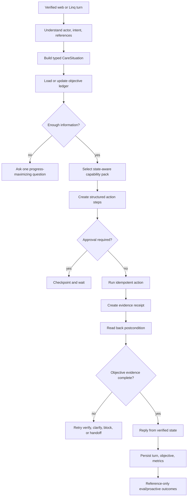

# feat: Raise Evia To Evidence-Driven Care Intelligence

## Goal Capsule

| Field | Value |
|---|---|
| Objective | Establish Evia's measured baseline, then raise the highest-impact deficient capability slices toward a realistically achievable 9/10 through unified care state, objectives, execution proof, temporal reasoning, tool selection, proactivity, and production learning. The target is achieved only when the versioned behavioral rubric maps measured results to at least 9.0; completing implementation is a separate status. |
| Code authority | `fix/memory-wave-hotfixes` and `origin/main` at `4f3aa35`. Memory hardening and two follow-up hotfix batches are committed. Concurrent Firestore hardening remains a start gate: freeze a clean post-hardening SHA and re-read changed seams before U0 implementation. |
| Product authority | The confirmed scope in this session: preserve the existing agent, make consequential behavior evidence-backed, treat the memory plan as the prerequisite, and include tests, trajectory evaluations, canaries, and staged production gates. |
| Required prerequisites | Consume the completed memory proof in `docs/reports/2026-07-20-evia-memory-grounding-hardening-completion.md`; do not reimplement it. Complete the Firestore index/data-integrity hardening contract before adding intelligence queries or indexes. U0 verifies both prerequisites against a clean production/source baseline. |
| Intelligence target | The 9/10 target is an engineering objective, not a self-certified score. Completion requires the capability scorecard and production outcome gates in the Verification Contract. |
| Execution profile | Firebase Functions, Firestore, Zep, the existing OpenAI/Anthropic/Gemini model adapters, MCP tools, Linq SMS/iMessage, authenticated web chat, backend tests, non-production trajectory evals, and staged production rollout. |
| Stop conditions | Stop before weakening identity or authority checks, treating missing health data as a negative fact, storing hidden chain-of-thought, allowing a write claim without completion evidence, enabling autonomous medical judgment, running write-capable evals against production, starting a wave without rollout controls, or deploying a wave whose required scorecard gate is red. |
| Initial authorization boundary | This document authorizes U0 and U1 first. U2-U12 become executable only after U0 freezes the rubric, proves prerequisites and rollout controls, establishes green build/query contracts, and records an explicit build/defer decision for each later unit. |
| Tail ownership | Implementation owns tests, index/rules deployment, non-production provider probes, per-wave function deployment, production smokes, monitoring, rollback evidence, and final local/remote/deployed SHA reporting. Hosting is deployed only if implementation changes a frontend artifact. |

---

## Product Contract

### Summary

This plan upgrades Evia by making the existing agent reason over one current care situation, pursue one explicit objective, act through evidence-producing tools, verify outcomes before speaking, retrieve only relevant context and capabilities, and learn from reviewed production failures. It preserves the current bounded loop and safety boundaries while adding measured temporal care reasoning, interruption-aware proactivity, and selective high-reasoning escalation.

### Problem Frame

The correct checkout is materially more advanced than the earlier audit target. Evia already has a bounded multi-tool loop, role-aware tool allowlists, partial intent capability filtering, active goals, working-memory todos, commitments, pending-action confirmation, action ledgers, idempotency for selected writes, operational snapshots, emotional context, voice mirroring, routing shadows, provider fallback, proactive budgets, and a large evaluation corpus.

The remaining ceiling is architectural fragmentation. Live care facts are loaded by several modules and flattened into prompt prose without a shared provenance/freshness contract. Active goals, todos, commitments, pending matches, and execution tasks represent overlapping pieces of work without one canonical objective record. `complete_task` checks for a pending action but not for a verified postcondition. Tool filtering is intent-only, broad intents remain unfiltered, caregiver turns are not narrowed, and web chat does not pass an intent. The current checkpoint resumes only after the agent loop, so a mid-loop retry still depends on scattered idempotency behavior.

There are also immediate factual defects that must precede broader intelligence work. `qaAgent.ts`, `proactiveReflection.ts`, `weeklyDigest.ts`, and `healthTrends.ts` translate missing wellness fields into negative observations or percentages. `proactiveReflection.ts` requests three-day patterns from a 24-hour dataset. `operationalContext.ts` can label a recent past appointment as the next appointment. These are deterministic prompt/data fabrication, not model uncertainty, and no larger model can correct them reliably.

The intended result is not an agent that sounds more confident. It is an agent that knows what is current, knows what it is trying to finish, asks the one missing question, selects a small relevant capability set, verifies consequential work, communicates with affected people, and exposes uncertainty when evidence is incomplete.

### Confirmed Current-State Evidence

| Area | Current evidence | Planning consequence |
|---|---|---|
| Agent loop | `functions/src/agents/qaAgent.ts` has bounded iterations, time/tool/cost ceilings, recovery, and `complete_task`. | Extend the loop through explicit lifecycle middleware; do not replace it with a new agent framework. |
| Memory | The memory-hardening plan and two hotfix batches are committed; the completion report records deployed indexes/functions, typed Zep outcomes, strict/best-effort adapters, cross-store forget proof, privacy-safe telemetry, and fail-closed risk grounding. | U0 verifies current production/source proof and consumes the shipped contracts. Do not create another memory store, provider-health model, fingerprint key, or grounding verdict path. |
| Care state | `operationalContext.ts` and `situationSnapshot.ts` load useful live data but render early into strings and omit source/freshness/conflict metadata. | Introduce a typed per-turn `CareSituation` assembled before prompt rendering. |
| Goals | `ActiveGoal` supports only booking, matching, and QA multi-step goals with turn-count expiry. | Replace it gradually with a canonical objective ledger and compatibility adapters. |
| Work in progress | `get_work_in_progress`, todos, commitments, pending matches, and `agent_tasks_active` expose partial in-flight state. | Aggregate these behind the objective ledger; do not leave two user-visible definitions of completion. |
| Actions | `CaraActionDefinition` has typed I/O, approval, idempotency, audit, and role controls. | Add postconditions and evidence receipts to the existing contract. |
| Checkpointing | `turnCheckpoint.ts` persists only `loop_complete` with a five-minute TTL. | Add phase checkpoints keyed by stable source turn and objective, with replay-safe action boundaries. |
| Tool selection | `selectToolsForIntent` keeps core tools and intent capabilities, while broad/null intents return the full visible surface. | Build state-aware capability packs and give web/caregiver paths routing parity. |
| Prompt context | The client prompt uses Zep or memory files rather than both and labels a bounded fact set as complete. | The memory-hardening prerequisite fixes retrieval; this plan then treats context as a budgeted projection of typed state. |
| Wellness facts | Missing booleans become concerns/misses in three user-facing surfaces; `healthTrends.ts` divides true counts by all journal rows. | Add one tri-state care-signal contract and migrate every consumer before temporal reasoning. |
| Proactivity | Hourly reflection, scheduled campaigns, daily/weekly caps, DND, opt-out, and review drafts exist. | Add one candidate-ranking policy with evidence, consent, and interruption cost. |
| Matching outcomes | `outcomeAnalytics.ts` injects aggregate hire percentages but does not expose support uncertainty and includes labels not enforced by the computation. | Replace persuasive percentages with calibrated outcome evidence and minimum-support rules. |
| Uncertainty | `groundingClaims.ts`, `humanHandoff.ts`, and `qaAgent.ts` now implement typed `supported | unsupported | indeterminate` verification, current-turn evidence, privacy-safe metrics, and fail-closed high-risk behavior. | Extract or extend this single verifier owner; never stack a second verifier with conflicting verdict or fallback policy. |
| Evals | The repo has static cases, golden transcripts, live onboarding evals, turn metrics, and routing shadows; most CLI agent cases skip without live flags. | Build a reviewed trace-to-regression pipeline and capability scorecard based on outcomes and trajectories. |
| Model routing | Static agent/quick/router/escalation/vision tiers and provider fallback exist. | Add selective difficulty/risk escalation only after the baseline eval proves value. |

### Actors

- A1. Primary client or authorized self-directed senior using Linq or authenticated web chat.
- A2. Secondary family member with care visibility but restricted payment and account authority.
- A3. Caregiver using Linq or authenticated web chat.
- A4. Senior whose care, schedule, preferences, and safety context are being coordinated.
- A5. Admin or care-operations reviewer handling sensitive proactive drafts, handoffs, failed actions, and eval candidates.
- A6. Evia runtime: ingress, context assembly, objective policy, agent loop, MCP/action layer, verification, response, persistence, and scheduled workers.
- A7. External providers: Firebase/Firestore, Zep, Linq, Stripe, model APIs, and other approved integrations.

### Requirements

#### Truth, Authority, And Safety

- R1. U0 re-verifies the deployed memory completion report, follow-up hotfixes, and current production health before dependent intelligence flags can enable. This plan consumes the shipped memory, grounding, fingerprint, and provider-health contracts and never duplicates them.
- R2. Wellness and care observations use explicit `true | false | unknown` semantics. Missing, malformed, omitted, or out-of-window data never becomes a negative observation or enters a negative-rate denominator.
- R3. Every consequential care fact available to reasoning carries source type, source reference, observed/effective time, retrieval time, freshness, authority tier, and confidence/evidence status.
- R4. Fresh authenticated user corrections and fresh successful canonical reads outrank derived observations, durable memory, summaries, signup snapshots, and model inference. Conflicts remain visible until resolved; they are never silently averaged.
- R5. Evia never diagnoses, changes medications, invents clinical meaning, bypasses role/household/payment authority, or treats a probabilistic recommendation as a verified fact.
- R6. Medical, safety, identity, authorization, schedule, availability, and money claims fail closed to a clarification, verification read, neutral response, or human handoff when required evidence is unavailable or indeterminate.

#### Unified Care Situation

- R7. Every full-agent turn builds one typed `CareSituation` for the authenticated actor, selected senior, role, permissions, channel, and source turn before prompt assembly or tool selection.
- R8. The situation can represent current appointments, caregivers, care-plan facts, journal evidence, jobs/matches, invoices/payments, alerts, pending confirmations, failed actions, commitments, active objectives, affected recipients, memory health, and data-provider degradation.
- R9. Each business domain required by the named acceptance flows has one canonical repository or typed wrapper that returns facts and provenance. Existing prompt formatters for those flows consume the shared result rather than repeating independent Firestore queries; unrelated repository consolidation is out of scope.
- R10. Context projection is budgeted and goal-aware. The prompt receives the smallest high-signal subset plus lightweight identifiers for just-in-time reads; it does not receive every loaded record or every tool schema. All external text, including journal notes, memory, provider content, and tool results, is typed as untrusted data, delimited/sanitized at the prompt boundary, and excluded from authority, policy, and tool instructions.
- R11. Partial state is represented explicitly. A failed loader does not erase successful domain state, and the prompt can distinguish `none`, `unknown`, `unavailable`, `stale`, and `loaded`.
- R12. Equivalent authenticated web and Linq turns receive equivalent situation, objective, memory, tool-pack, and persistence policy after channel-specific delivery details are normalized.

#### Objectives, Clarification, And Coordination

- R13. Evia maintains one canonical objective ledger for user goals across turns. Multiple nonterminal objectives may coexist, but exactly one foreground objective is selected per turn; other objectives remain waiting, paused, blocked, completed, cancelled, expired, or failed without losing state.
- R14. An objective records structured intent, referenced entities, required steps, completed steps, missing inputs, expected user reply, blocking condition, promises, affected recipients, action/evidence references, expiry, and terminal reason. It stores no hidden chain-of-thought.
- R15. Existing `activeGoal`, todos, commitments, pending matches, pending actions, and execution-agent state are adapted into the ledger or retained only as implementation details behind it. User-visible work-in-progress reads from one aggregate contract.
- R16. When information is missing, Evia asks one question selected for maximum progress and safety. It does not restart a known workflow, ask several independent questions, or request information already present in authoritative state.
- R17. Short replies such as `yes`, `after three`, `her`, or `that caregiver` resolve against expected replies, referenced entities, the recent assistant question, channel context, and authorized foreground-objective candidates before generic intent routing. When multiple objectives remain plausible, Evia asks one disambiguating question rather than guessing.
- R18. Objective completion requires all mandatory steps, no unresolved confirmation, and valid completion evidence. A response can accurately say `blocked`, `waiting for you`, `waiting for caregiver`, or `needs review` without pretending completion.
- R19. When an action affects another authorized participant, the objective includes the required notification or acknowledgement step and verifies that delivery or queueing occurred.

#### Plan, Act, Verify, And Resume

- R20. The turn lifecycle is explicit and observable: understand, hydrate, plan, approve, act, verify, respond, persist, complete.
- R21. Lifecycle checkpoints use a server-derived, purpose-separated hash over channel, verified principal/session identity, provider conversation identifier, provider message identifier, and objective version. The source-turn key is passed through every Linq, web, onboarding, retry, and trigger invocation into the agent loop. Resume validates actor, channel, objective, and source identity, never replays a completed side effect, and never applies an old checkpoint to a newer inbound message.
- R22. Planned steps are structured action intents and dependencies, not stored private reasoning. A plan can be inspected for status, permissions, and evidence without exposing model chain-of-thought.
- R23. Every mutating action returns or produces an evidence receipt identifying the action, target, outcome, authoritative postcondition, verification time, freshness window, and safe user-facing claim.
- R24. High-risk actions verify postconditions through a fresh read or provider receipt independent of the model's narrative. Handler success or schema-valid output alone is not completion evidence.
- R25. Action retries use deterministic idempotency keys and the existing action/operation ledgers. Verification retries do not repeat the write.
- R26. `complete_task(status=done)` is rejected when required evidence is missing, stale, contradicted, or tied to an unresolved objective step.
- R27. Autonomy policy combines explicit user permissions, actor role, action risk, reversibility, evidence coverage, and current provider health. Learned convenience never overrides a required approval.

#### Tool And Routing Intelligence

- R28. Tool packs are selected from actor role, channel, objective, current step, permissions, risk, and provider availability, not intent alone.
- R29. A normal turn receives a small, non-overlapping capability pack. Universal orientation tools are reduced to the minimum needed for that turn; unmapped tools are observable and excluded by default after migration coverage is complete.
- R30. Web chat and caregiver turns run the same classifier/pack policy as Linq unless a documented channel or role difference requires otherwise.
- R31. Tool metadata declares purpose, preconditions, authority, read/write risk, reversibility, expected evidence, failure recovery, and mutually exclusive alternatives. Errors tell the agent what can be corrected without exposing internals.
- R32. Capability-pack selection, tool choice, argument validity, tool outcome, and unnecessary-tool rate are traceable and evaluable without logging raw care content.
- R33. Deterministic protocol and safety routes stay explicit. Reversible operational routes converge into the main lifecycle only after shadow end-state parity and latency gates pass.

#### Temporal And Outcome Intelligence

- R34. Temporal care reasoning computes rates and patterns only from known observations, reports known/unknown coverage, enforces minimum evidence counts and time windows, and links each derived statement to source records.
- R35. Proactive and monthly health surfaces use the same temporal evidence service; they cannot independently reinterpret missing wellness fields or invent a trend from one observation.
- R36. The authoritative `hired | rejected` outcome may support funnel analytics and offline hypothesis generation only after an eligibility gate covers label validity, missingness, selection mechanism, minimum overall/subgroup support, subgroup disparity, recency, uncertainty, and excluded attributes. It cannot alter user-facing ranking, suitability, or care-quality claims.
- R37. User-facing matching intelligence remains grounded in canonical qualifications, availability, authority-safe preferences, and verified care requirements until retention, cancellations/no-shows, satisfaction, reliability, and care-quality labels have separate source contracts, collection-quality proof, consumers, acceptance examples, and explicit human approval.
- R38. Zep temporal facts or observations may supplement conversational pattern recall after entitlement/API verification, but canonical care state and source-linked local evidence remain authoritative.
- R39. Recommendations explain the relevant evidence and trade-offs in plain language while omitting internal scores that are not calibrated for user interpretation.

#### Proactive Decision Intelligence

- R40. Every proactive source submits a candidate to one decision policy rather than sending directly, except documented emergency and mandatory transactional messages.
- R41. The policy ranks expected benefit, urgency, evidence confidence, objective relevance, consent, interruption cost, recent contact load, DND, duplicate content, and whether another participant is better placed to act.
- R42. Unknown or weak evidence suppresses health/safety pattern claims. Sensitive health, relationship, financial, and caregiver-performance drafts remain review-first until measured precision supports a narrower policy.
- R43. The candidate record includes evidence references, reason code, score components, decision, expiry, review outcome, send outcome, user response outcome, and completed coordination outcome without copying raw journal or conversation content. Every non-winner is explicitly `deferred`, `suppressed`, `obsolete`, or `expired`; deferred candidates carry `nextEligibleAt` and are re-evaluated after cooldown.
- R44. User responses and explicit preferences can reduce or increase non-mandatory outreach categories, but cannot suppress emergency, legally required, or explicitly contracted operational notices. Rollout gates measure recipient value, completed coordination, negative replies, category suppression, and opt-outs in addition to internal reviewer approval.

#### Evaluation, Learning, And Adaptive Reasoning

- R45. Each intelligence capability has a versioned eval suite that grades final environment state, required/forbidden tool trajectory, clarification quality, evidence coverage, safety, latency, and cost across multiple stochastic trials where applicable.
- R46. Reviewed corrections, repeated requests, abandoned objectives, human handoffs, support rescues, tool failures, rejected proactive drafts, and routing disagreements create de-identified eval candidates with immutable source version references, content hashes, root-cause labels, and a review SLA shorter than source retention. Missing or hash-mismatched source versions cannot be exported.
- R47. No production conversation automatically rewrites prompts, tools, policies, or model settings. A human reviewer accepts, rejects, or edits each candidate before it becomes a regression fixture.
- R48. The capability scorecard reports evaluated coverage as well as pass rate. Skipped agent cases, missing providers, and low trial counts cannot be counted as passes or used to approve a rollout.
- R49. Difficulty/risk-aware model escalation uses the existing model tiers and feature flags. It is enabled only when evals show a statistically and operationally meaningful gain over the default route within latency/cost limits.
- R50. High-risk claim verification can use an independent skeptical evaluator with evidence-only input. The generator never grades its own unsupported narrative, and verifier outages follow the risk-specific fail policy.
- R51. Provider fallback preserves objective, tool-pack, checkpoint, and evidence contracts. A provider/model/data-class allowlist is enforced before generator, escalation, verifier, and fallback calls; evidence is minimized, and the turn fails closed when no approved route is available.

#### Privacy, Operations, And Rollout

- R52. New telemetry stores aggregate metrics, enums, purpose-separated HMAC-SHA256 pseudonyms, counts, latencies, model/tool identifiers, and server-only references. HMAC keys are versioned in Secret Manager, rotation is defined, pseudonyms are never authorization inputs, and telemetry adds no raw messages, replies, journal notes, phone numbers, names, care facts, or model reasoning.
- R53. New Firestore collections are server-only unless a specific product surface requires client access. A retention/deletion matrix covers every status and storage location for checkpoints, eval candidates, proactive candidates/drafts, completed objective/action evidence, audit records, and temporary exports, including correction/account deletion propagation, legal holds, and cleanup verification.
- R54. Each wave ships dark or shadow-first, has explicit enable/hold/rollback thresholds, and can be disabled without reverting the memory prerequisite or unrelated agent behavior.
- R55. One ingress-to-response deadline covers context hydration, model calls, tools, verification, response, and persistence needed before delivery. Remaining budget propagates to every loader/provider call with per-operation timeouts; partial-state degradation returns a truthful lower-capability response before the user-facing deadline is exhausted.
- R56. The intelligence score cannot compensate for a broken marketplace. Caregiver signup-to-visible-to-bookable and subscribed-family need-to-ranked-match-to-book-to-successful-payment are non-compensable release floors, with client and caregiver channel parity proven through end-to-end outcomes.

### Key Flows

- F1. Continue a cross-channel scheduling objective
  - **Trigger:** A client says by web that Mom's schedule changed, then replies by SMS, `yes, after three`.
  - **Actors:** A1, A3, A4, A6, A7
  - **Steps:** Memory parity preserves the prior turn; `CareSituation` resolves the senior and pending schedule question; the objective resolves the expected reply; the pack exposes schedule reads/writes; Evia confirms if required, updates once, reads back the appointment, notifies the caregiver, and closes with evidence.
  - **Outcome:** The correct appointment is changed without repeating the question or claiming success before verification.
  - **Covers:** R7-R33, R45

- F2. Handle incomplete wellness data safely
  - **Trigger:** A journal entry has mood and notes but omits appetite and medication fields.
  - **Actors:** A1, A4, A5, A6
  - **Steps:** The care-signal parser marks omitted fields unknown; prompt, digest, trend, and proactive services exclude unknowns from negative claims and rates; weak evidence suppresses outreach.
  - **Outcome:** No surface says appetite was low or medication was missed without an explicit negative observation.
  - **Covers:** R2-R6, R34-R35, R42

- F3. Verify a consequential action
  - **Trigger:** A client asks Evia to cancel or reschedule a confirmed visit.
  - **Actors:** A1, A3, A6, A7
  - **Steps:** The objective identifies approval and affected-recipient steps; the action runs under an idempotency key; the action receipt is followed by a fresh canonical read; the caregiver notification is queued or delivered; only then can `complete_task(done)` succeed.
  - **Outcome:** User-facing completion matches live state and retries do not duplicate changes or messages.
  - **Covers:** R13-R27

- F4. Ask the most useful clarification
  - **Trigger:** A client says, `move her visit`, while two seniors and several visits are in scope.
  - **Actors:** A1, A4, A6
  - **Steps:** The situation identifies unresolved entity and appointment candidates; the objective records both ambiguities; clarification policy asks the single question that most reduces the action risk.
  - **Outcome:** Evia asks one concrete question instead of guessing or restarting the workflow.
  - **Covers:** R7-R18

- F5. Rank proactive care coordination
  - **Trigger:** Several schedulers propose a routine survey, a payment reminder, an unconfirmed visit warning, and a weak appetite pattern on the same day.
  - **Actors:** A1, A3, A5, A6
  - **Steps:** Mandatory messages bypass only as documented; all other candidates enter one policy; unknown appetite evidence is suppressed; visit risk outranks low-value outreach; DND/contact load and review requirements apply.
  - **Outcome:** The family receives at most one eligible non-mandatory message, plus any documented mandatory or emergency notices; losing optional candidates have an explicit disposition and no campaign duplicates.
  - **Covers:** R34-R44

- F6. Learn from a real failure without self-modifying
  - **Trigger:** A user repeats a request after Evia selected the wrong tool and a teammate rescues the thread.
  - **Actors:** A1, A5, A6
  - **Steps:** Metrics create a reference-only candidate; review links the trace, classifies root cause, redacts fixtures, defines expected final state and trajectory, and accepts it into the capability suite; subsequent changes must pass repeated trials.
  - **Outcome:** The failure becomes a durable regression case without raw production content or automatic prompt changes.
  - **Covers:** R45-R48, R52-R54

- F7. Escalate reasoning selectively
  - **Trigger:** A high-risk, multi-constraint request remains ambiguous or conflicted after normal hydration.
  - **Actors:** A1, A5, A6, A7
  - **Steps:** Reasoning policy uses objective complexity, evidence conflict, risk, and failed attempts; a stronger tier receives the same constrained state and tools; a separate evidence-only verifier checks high-risk claims; latency/cost ceilings still apply.
  - **Outcome:** Hard turns improve without paying frontier-model cost on every routine reply or weakening safety during fallback.
  - **Covers:** R45-R55

- F8. Continue a caregiver-led objective across channels
  - **Trigger:** A caregiver starts an availability change in authenticated web chat, then replies by SMS, `actually, Tuesday after three too`.
  - **Actors:** A3, A6, A7
  - **Steps:** The same objective and expected reply survive channel change; the caregiver pack excludes client/payment-authority tools; Evia resolves Tuesday and the time against the foreground objective, confirms when required, updates once, reads back canonical availability, and closes with evidence.
  - **Outcome:** Caregiver parity is proven by a verified end state, not only by equivalent tool metadata.
  - **Covers:** R7-R33, R45, R56

### Acceptance Examples

- AE1. An omitted `tookMeds` field renders as unknown in the QA prompt, weekly digest, proactive reflection, and monthly trend denominator; explicit `false` renders as missed only where the source contract defines that meaning.
- AE2. Proactive reflection cannot request a three-day pattern from a 24-hour input. The requested window and loaded window are identical and recorded in evidence metadata.
- AE3. `CareSituation` returns a fresh future visit as next appointment and never chooses a recent past visit because it sorted descending.
- AE4. A web-to-SMS `yes, after three` reply resolves the pending schedule objective, not generic confirmation or a new booking search.
- AE5. A secondary family member can receive a care update but cannot approve a timesheet or payment through a misleading objective continuation.
- AE6. An action handler returns success but the read-back disagrees. Evia says the change is not confirmed, leaves the objective unresolved, and does not call `complete_task(done)`.
- AE7. A retry after the write checkpoint verifies the existing state and does not repeat the write or caregiver notification.
- AE8. A normal scheduling turn receives scheduling, participant, and required orientation capabilities, not the broad client catalog.
- AE9. An unmapped mutating tool is excluded after the migration gate and raises an action-surface audit failure.
- AE10. Two possible seniors and three possible appointments produce one entity/visit clarification selected from current candidates.
- AE11. A single poor appetite entry cannot produce a multi-day trend or proactive health message. Three explicit observations across the configured window can produce a review draft with source references.
- AE12. `hired | rejected` records can appear in an eligibility-checked offline funnel report but never alter displayed caregiver order, suitability, or quality explanations. A future user-facing outcome signal stays unavailable until validated post-hire evidence has its own approved contract.
- AE13. Four proactive candidates compete under one policy; DND, recent contact, evidence weakness, and objective relevance produce one decision record and at most one eligible non-mandatory send.
- AE14. A production rescue creates a reference-only eval candidate. Nothing enters the golden corpus until an authorized reviewer supplies expected state and accepts the redacted fixture.
- AE15. A hard-turn escalation must beat the default route on the declared eval slice without violating latency, cost, tool, or safety gates before its flag can advance.
- AE16. A provider fallback receives the same objective and evidence requirements; it cannot claim a booking or payment completed from text alone.
- AE17. A checkpoint contains structured lifecycle state and safe references, not hidden reasoning or raw production transcript copies.
- AE18. Capability scorecard output states evaluated trials and skipped trials separately; a 100% pass rate over only deterministic linters cannot approve the intelligence rollout.
- AE19. A caregiver starts an availability update on web and finishes over SMS; one canonical update is verified and no client-only, billing-approval, or household tool is exposed.
- AE20. The scorecard cannot report `target achieved` unless a synthetic caregiver reaches visible/bookable state and a subscribed synthetic family completes need-to-ranked-match-to-book-to-successful-payment without authority or payment defects.
- AE21. Two users submit the same client-provided message ID on different channels or accounts; their server-derived checkpoint keys differ, and neither can load or resume the other's objective or action evidence.
- AE22. A write-capable eval configured with production Firebase, Linq, Stripe, or provider endpoints refuses to start before creating a user, conversation, action, or export record.
- AE23. A custom-claim-only or revoked admin cannot approve, edit, trigger, or send a proactive draft; the reviewed content hash must match transactionally at claim time.

### Scope Boundaries

#### In Scope

- Backend truth fixes for wellness, appointment, prompt, digest, trend, and proactive evidence.
- Typed per-turn care situation and provenance-aware context projection.
- Canonical objective ledger and expected-reply clarification policy.
- Explicit lifecycle middleware, phase checkpoints, action evidence, and completion gates.
- State-aware tool packs for client, caregiver, family-secondary, web, and Linq.
- Temporal care evidence, calibrated outcome evidence, and review-first proactive ranking.
- De-identified production-failure intake, trajectory/outcome evals, scorecards, canaries, and selective model/verifier escalation.
- Required Firestore indexes/rules, feature flags, runbooks, monitoring, deployment, rollback, and production proof.
- Non-compensable marketplace outcome gates for both sides of the platform.

#### Deferred To Follow-Up Work

- A new user-facing admin dashboard for the objective ledger or eval program. Minimal changes to the existing proactive review dashboard are in scope only to replace direct writes with the audited immutable review callable; other operations use server-side records, scripts, alerts, and runbook queries first.
- Zep Observations/custom ontology as a required runtime dependency. Use it only after the installed tier and API behavior are verified; local canonical evidence must work without it.
- Fine-tuning, reinforcement learning, automatic prompt optimization, or custom model training. Reviewed eval evidence must justify a separate plan.
- Voice-call, ambient sensor, wearable, or new multimodal channels beyond the platform's existing text/media behavior.
- A generalized statistical or causal-inference platform. This plan adds bounded support/uncertainty rules for current recommendations only.

#### Outside This Product's Identity

- Autonomous diagnosis, medication instruction, clinical interpretation, or replacement of clinicians and emergency services.
- Hidden chain-of-thought storage or display.
- Unlimited retention of raw conversations, journal content, or tool results for learning.
- A model that changes its own production prompts, permissions, policies, or code from live feedback.
- Replacing the existing agent loop with LangGraph, another framework, or a multi-agent topology solely for architectural fashion.
- Removing deterministic safety/protocol handlers where the model adds no product value.

---

## Planning Contract

### Intelligence Target And Scorecard

The estimated 9/10 target is reached through measurable behavior, not by averaging subjective architecture scores. U0 first ranks observed failure classes by user harm, frequency, rescue/handoff rate, incomplete objectives, repeats, safety, latency, and cost. Each later unit requires a baseline failure slice, expected user outcome, expected measurable uplift, and build/no-build decision; unsupported units stay deferred rather than shipping for architectural completeness.

The rollout scorecard tracks memory continuity, context resolution, clarification efficiency, tool choice, multi-step completion, unsupported-claim rate, verified-action rate, proactive precision and recipient value, emotional/conversational quality, latency, and cost. Each row reports fixture count, evaluated trials, skipped trials, confidence interval or sample support where applicable, current baseline, wave target, and production observation window. U0 freezes a versioned behavioral rubric, user-impact weights, critical-slice floors, representative holdout set, and change-control rule before later implementation can tune against it. Weight or fixture changes after baseline require a new rubric version and cannot retroactively approve the same wave.

Two marketplace floors are non-compensable: caregiver signup-to-visible-to-bookable and subscribed-family need-to-ranked-match-to-book-to-successful-payment. `target achieved` requires both floors green, an overall score of at least 9.0, every critical safety/authority slice green, and no declared capability below its floor. `execution complete` means the authorized units were implemented and measured; it cannot be reported as target achievement when the rubric remains below 9.0 or either marketplace floor is red.

Architecture completion alone cannot move a scorecard row to green. A row becomes green only when its deterministic tests pass, non-production trajectory suite meets its threshold, and production canary remains within the hold/rollback envelope.

### Authority And Evidence Order

1. Current authenticated user message, including explicit correction, cancellation, and approval boundaries.
2. Fresh successful canonical Firestore/provider reads and signed provider receipts.
3. Pending approval, correction/forget suppression, and unresolved action/objective state.
4. Source-linked derived temporal evidence that meets its coverage/window contract.
5. Active learned facts and canonical memory files from the completed memory-hardening prerequisite.
6. Zep temporal context and observations.
7. Conversation summaries, signup briefings, historical trends, and aggregate outcome patterns.
8. Model inference, which may propose a question or action but never create an authoritative fact.

No lower layer can override a higher layer. A conflict produces a typed conflict and resolution step, not silent precedence hidden inside prompt prose.

### High-Level Architecture

### Key Technical Decisions

- KTD1. **Treat the memory plan as a hard dependency, not Unit 1 of this plan.** Implementation checks its Definition of Done and live proof before enabling dependent flags. Urgent wellness and appointment truth fixes may ship independently because they reduce current harm and do not require new memory behavior.
- KTD2. **Keep the current single-agent loop.** Add explicit lifecycle functions around `runQaAgent` and migrate incrementally. Framework replacement would add operational risk without addressing the verified gaps in state, objectives, evidence, and evaluation.
- KTD3. **Build one ephemeral typed `CareSituation`, then project it.** Acceptance-flow domain loaders return `EvidenceFact<T>` values with source, effective time, freshness, authority, health, and trusted/untrusted content classification. The full object stays server-side for the turn; prompts and tools receive bounded, injection-resistant projections. Persist only keyed pseudonyms/aggregate health unless a referenced objective or action needs durable evidence pointers.
- KTD4. **Use just-in-time context for details.** Always load identity, authority, objective, confirmations, and high-level current state. Leave larger lists and historical records behind typed read tools. This reduces attention dilution while preserving discoverability.
- KTD5. **Create one canonical `agent_objectives` ledger with one foreground objective per turn.** `agent_sessions.foregroundObjectiveId` identifies the turn focus while multiple nonterminal records may coexist. Legacy stores remain authoritative through read-through projection adapters until each flow crosses an atomic bridge with source/version/idempotency markers, conflict precedence, drain proof, and rollback reconstruction; no second user-visible work queue is created.
- KTD6. **Keep objective plans structured and inspectable, not private reasoning.** Store intent, steps, dependencies, missing inputs, expected replies, status, and evidence references. Never store model chain-of-thought or free-form hidden rationale.
- KTD7. **Use one-question information gain with deterministic safety constraints.** Candidate questions come from unresolved required fields/entities. Rank by how many next steps they unlock and the consequence of guessing. The model may phrase the chosen question but cannot invent candidates outside the unresolved state.
- KTD8. **Extend `CaraActionDefinition` with postcondition verification.** Add evidence schema, verification policy, freshness, and safe claim rendering. The existing approval, audit, idempotency, and role contract remains the execution boundary.
- KTD9. **Store evidence in the existing action ledger where possible.** Add action result and verification subrecords to `agent_action_ledger`/action-native journals. Introduce a new collection only if the current ledger cannot support TTL/query requirements without breaking existing paths.
- KTD10. **Checkpoint phase boundaries and durable side effects.** Expand `turnCheckpoint.ts` from post-loop reply rescue to lifecycle state keyed by a server-derived HMAC/hash over channel, verified principal/session, provider conversation, provider message, and objective version. Reuse the memory operation's purpose-separated source-key pattern where compatible, pass the key through every agent/retry ingress, checkpoint before waiting and after each committed write, and verify actor/source/objective plus action key before any resume or replay.
- KTD11. **Select capability packs from state, then let the model choose within the pack.** Extend `toolCapabilities.ts`; do not add a second registry. Packs target roughly 10-25 clear tools for normal work, with larger packs allowed only for measured ambiguous/multi-domain turns. Exact thresholds are tuned by eval, not hard-coded as a quality claim.
- KTD12. **Exclude unmapped tools after a measured migration gate.** During migration, audit and warn on unmapped tools. Once every production tool has metadata, change the permissive include default to fail closed and make the audit test a deploy gate.
- KTD13. **Use one shared tri-state temporal evidence service.** `careEvidence.ts` parses wellness observations, computes known/unknown denominators, enforces windows/minimum samples, and returns source-linked observations. QA, weekly digest, monthly trends, proactive reflection, and future care reasoning consume it.
- KTD14. **Do not equate hire selection with care quality.** The existing authoritative `hired | rejected` labels are restricted to funnel analytics and offline hypothesis generation. They cannot alter user-facing ranking, suitability, or care-quality claims. A future quality signal requires its own validated source and plan.
- KTD15. **Use one proactive candidate queue and policy.** U8 first freezes a source manifest covering every current send path, mandatory/optional/emergency class, adapter, dedupe key, retained direct-send rationale, migration wave, and regression test. Emergency and mandatory transactional paths retain direct documented handling; optional candidates are ranked, deduplicated, budgeted, and reviewed by one engine. Non-winners are dispositioned, deferred items re-enter policy after cooldown, and recipient value/harm metrics gate advancement.
- KTD16. **Derive uncertainty from evidence coverage and execution state.** Do not ask the model for a scalar confidence score. Compute policy inputs from missing/old/conflicting facts, tool results, verifier outcomes, objective ambiguity, provider health, and action risk.
- KTD17. **Keep one independent high-risk verifier owner.** Extract or extend the deployed `groundingClaims.ts` + `humanHandoff.ts` + `qaAgent.ts` path into one callable verifier seam. It receives a minimized evidence projection approved for its provider/model/data class, not the generator's hidden reasoning. `supported`, `unsupported`, and `indeterminate` retain explicit fail behavior. Stacked verification calls or conflicting verdict policies are prohibited; no approved route fails closed and routine low-risk replies avoid the latency.
- KTD18. **Add difficulty-aware model escalation behind eval and cost gates.** Reuse `caraModels.ts` tiers. Start log-only, compare default and escalation in non-user-facing trials, and enable only slices where the stronger route improves end-state success enough to justify latency/cost.
- KTD19. **Make production learning human-reviewed and privacy-minimal.** Candidate records contain reason codes, metrics, keyed pseudonyms, immutable source versions/hashes, and server-only source references. Export uses a dedicated least-privilege service identity and Cloud KMS key. A streaming allowlist transformation runs before any local write, plaintext production material is never written to disk, encrypted output is limited to an approved non-synced destination, PII/PHI scanning blocks promotion, reviewer identity is audited, and cryptographic deletion/cleanup evidence is recorded. Only synthetic/redacted fixtures with expected end state/trajectory enter version control.
- KTD20. **Grade outcomes and trajectories over multiple trials.** Final wording alone is insufficient. Evals inspect environment state, required/forbidden tools, duplicate effects, approvals, evidence, clarification, and handoff. Stochastic slices run repeated trials and report evaluated coverage.
- KTD21. **Converge routing only with shadow parity.** Extend `routingShadow.ts` end-state projections and choose reversible flows first. Safety, emergency, identity, opt-out, payment approval, and deterministic protocol routes remain explicit until a separate decision proves agent value and equal safety.
- KTD22. **Build rollout controls before dependent waves.** U0 creates the minimum server-only rollout policy, deterministic cohorts, cache/invalidation contract, expiry, fail-closed defaults, global emergency-off override, and tested propagation/rollback SLA. U12 extends monitoring and final proof. Each wave has dark, shadow/canary, partial, and full states; no umbrella `EVIA_SMARTER=true` flag exists.
- KTD23. **Integrate every query with Firestore hardening.** No new intelligence query lands without a `firestore.query-contracts.json` entry, explicit canonical/fallback classification, index coverage test, additive index deployment through the hardened path, and separate preflight before any full index-file deployment.
- KTD24. **Separate pseudonym purposes and secret lifecycles.** Intelligence telemetry uses a dedicated versioned HMAC secret and module modeled on the memory fingerprint pattern, with purpose and key version stamped on records, overlap/rotation/retirement rules, consuming-function bindings, manifest tests, and fail-closed behavior. The memory fingerprint key is never reused.

### Data Changes

#### `agent_objectives/{objectiveId}`

- Stable `objectiveId`, `sourceTurnKey`, actor/user/senior references, role, channel, structured intent, and minimally necessary sanitized description; `agent_sessions.foregroundObjectiveId` selects the per-turn focus without closing other nonterminal objectives.
- `status`: `active | waiting_user | waiting_external | blocked | paused | completed | cancelled | expired | failed`.
- Structured steps with stable IDs, dependencies, status, required authority, action key, evidence references, and terminal reason.
- `missingInputs`, candidate entity references, `expectedReply`, `affectedRecipients`, and promises/commitment references.
- Created/updated/expiry timestamps, completion evidence summary, version, and feature-policy versions.
- Server-only access, explicit retention, and no chain-of-thought or copied transcript.

#### `agent_turn_checkpoints/{derivedSourceTurnKey}`

- Document ID is server-derived from channel, verified principal/session, provider conversation, provider message, objective version, and a purpose-separated versioned key; raw client/provider IDs are never accepted as the final key.
- Purpose-separated keyed actor pseudonym, channel/source binding hash, objective ID/version, lifecycle phase, completed step/action keys, pending approval/input, safe response draft reference where required, and expiry.
- Every load and resume validates actor, channel, objective, and source bindings before state is returned.
- No raw tool payload dump, raw transcript copy, or hidden reasoning.
- TTL defaults to 24 hours for waiting/recovery checkpoints and a shorter five-minute post-response rescue window; completed checkpoints delete after proof.

#### Existing `agent_action_ledger` And Action-Native Journals

- Add evidence kind, provider/Firestore target reference, expected postcondition, observed postcondition hash/summary, verification status, verified timestamp, freshness expiry, and safe claim code.
- Preserve existing audit, approval, role, idempotency, and fail-closed behavior.

#### `proactive_drafts` / Candidate Policy Fields

- Add candidate type, mandatory class, evidence references, objective relevance, urgency/value/confidence/interruption components, policy version, decision reason, duplicate key, expiry, review result, send result, and response outcome.
- Add explicit loser disposition and `nextEligibleAt`; preserve immutable recipient, body, evidence, and policy fields once review begins.
- Make client access read-only where required and route approve/reject/edit through a transactional `requireAdmin` callable with reviewer UID, reason, timestamp, reviewed-content hash, and audit event. Workers send only the reviewed immutable version.
- Migrate `services/api.ts` review methods and the existing `triggerProactiveDraftSendNow` / `sendApprovedDraftNow` callables to the same Firestore-backed `requireAdmin` boundary. A custom claim alone never grants review or send authority; send claim re-verifies the immutable reviewed-content hash transactionally.
- Remove or avoid copied journal/conversation text in new policy telemetry; authorized server workers dereference source data only for drafting/reviewing.

#### `evia_eval_candidates/{candidateId}`

- Purpose-separated keyed event pseudonym, capability, root-cause label, channel/role/risk enums, immutable source version references and content hashes, metric snapshot, candidate status, reviewer decision, accepted fixture path/version, timestamps, review deadline, and TTL.
- No raw messages, replies, phone, names, journal notes, model reasoning, or care facts.

#### Indexes, Rules, And Retention

- Add only indexes required by objective status/expiry, proactive decision/review, eval candidate review, and checkpoint expiry queries. Every query receives a classified `firestore.query-contracts.json` entry and index-coverage assertion before merge.
- Deploy new indexes through `scripts/deploy-firestore-additive-indexes.mjs`; reserve full `firestore.indexes.json` deployment for a separately reviewed, deletion-safe preflight.
- Deny all new collections to clients by default. Minimal review actions may extend the existing Admin Cara Control Room through sanitized callable APIs; no general client query/write access is added.
- Define a status-by-storage retention matrix before Wave 1 covering objectives, checkpoints, action evidence, proactive candidates/drafts, eval candidates, audit records, and encrypted temporary exports. Include Firestore TTL/cleanup, review SLA, account-deletion/correction propagation, legal-hold exceptions, audit retention, and deletion verification; unresolved objectives/actions are never deleted merely because a timer elapsed.

#### `evia_rollout_policies/{capability}`

- Server-only mode, deterministic cohort percentage/seed, policy version, expiry, observation window, and fail-closed default.
- Cached reads with bounded staleness and explicit invalidation; environment flags can disable but cannot silently broaden a cohort.
- Audited mutations through `requireAdmin`; rollback propagation time is measured and alerted.

#### Intelligence Telemetry Pseudonyms

- Dedicated Secret Manager key and code module, separate from `MEMORY_FINGERPRINT_KEY`, with explicit purpose and key version in each derived record.
- Every consuming function declares the secret binding; a source-scan/manifest test fails when a consumer omits it.
- Rotation supports a bounded overlap window for aggregation, then retires the prior version; unavailable secrets fail closed without falling back to unhashed identifiers.

### Sequencing And Wave Gates

1. **Wave 0 - Control plane, truth, and prerequisites:** freeze a clean post-Firestore-hardening source SHA; verify the memory completion report and production health; finish query-contract/index hardening; create the minimum rollout policy and emergency-off control; establish green semantic typecheck and two-shard test baselines; freeze the rubric, holdout set, critical floors, retention, and marketplace outcome floors; then implement tri-state wellness, temporal-window correctness, and future appointment selection. Gate: prerequisite proof is green, deterministic false-health claims are removed, the non-production eval guard refuses production, rollback propagation meets its SLA, and every later unit has an explicit build/defer decision with expected outcome and measurable uplift.
2. **Wave 1 - Situation and objectives:** only after U0 authorization, ship typed care situation and objective ledger dark, compare projections/WIP against current behavior, then enable reads and clarification for low-risk turns. Gate: state parity, authority isolation, expected-reply accuracy, and latency budget green.
3. **Wave 2 - Evidence execution and tools:** add action receipts/postconditions, phase checkpoints, completion gate, and state-aware packs. Start with read-only and reversible scheduling/messaging flows. Gate: zero duplicate writes in replay tests, verified-action rate target, and tool-choice trajectory target green.
4. **Wave 3 - Temporal and proactive intelligence:** extend the U1 service into new temporal/proactive capabilities, audit all direct-send and direct-write bypasses, keep `hired | rejected` evidence restricted to funnel/offline analytics, and enable one proactive policy. Keep sensitive drafts review-first. Gate: no unknown-as-negative cases, no user-facing match ranking from unvalidated outcome labels, recipient-value and contact-load targets green, and every retained direct-send exception documented and tested.
5. **Wave 4 - Learning and adaptive reasoning:** add eval candidate review, repeated trajectory trials, independent high-risk verifier, and log-only model escalation. Gate: capability scorecard coverage and statistically meaningful slice gains green.
6. **Wave 5 - Routing convergence and full proof:** expand shadow end-state projections, cut over eligible reversible routes one at a time, run production observation windows, and publish final scorecard/local/remote/deployed proof.

### Risks And Mitigations

| Risk | Severity | Mitigation |
|---|---|---|
| New state duplicates existing stores and drifts | Critical | `CareSituation` is ephemeral and canonical repositories remain authoritative; objective adapters consolidate existing WIP instead of creating parallel user-visible truth. |
| Objective resume repeats a consequential action | Critical | Stable source-turn/action keys, pre/post checkpoints, existing idempotency ledgers, and read-back verification before replay. |
| Missing wellness data continues to become negative | Critical | Shared tri-state parser, known-only denominators, migration inventory, compile/test guard banning direct truthiness formatting in care surfaces. |
| Verifier blocks supported care facts | High | Evidence-only three-state verdict, calibrated fixtures, shadow logging, risk-specific policy, and supported-claim false-positive gate. |
| Verifier outage lets unsafe claims through | Critical | High-risk indeterminate/unavailable fails closed; lower-risk behavior follows documented degraded policy. |
| Large `CareSituation` recreates prompt bloat | High | Token budget, goal-aware projection, just-in-time reads, prompt-size metrics, and no raw record arrays in standing context. |
| Untrusted care text injects instructions | Critical | Typed untrusted content, strict delimiters/sanitization, no authority/tool metadata from free text, and adversarial projection/tool tests. |
| Tool packs omit a necessary capability | High | Shadow comparison against broad packs, recovery discovery path, pack-selection evals, and gradual fail-closed migration for unmapped tools. |
| Capability pack leaks unauthorized tools | Critical | Role/authority filtering precedes goal selection and remains enforced again inside action execution. |
| Objective text stores sensitive content | High | Structured intent/entity refs, minimum sanitized description, server-only rules, retention, and no raw transcript/reasoning. |
| Outcome analytics teaches bias or false causality | Critical | Excluded attributes, support/recency thresholds, uncertainty, non-causal wording, subgroup audit, and human review before user-facing claims. |
| Fallback sends sensitive evidence to an unapproved provider | Critical | Provider/model/data-class allowlist, minimized evidence projections, content-free route metrics, and fail-closed routing. |
| Proactivity becomes intrusive | High | One policy, DND/consent/contact load, interruption cost, category preferences, review-first sensitive drafts, and user-response calibration. |
| Learning queue becomes a shadow transcript store | Critical | Reference-only candidates, restricted dereference, redacted/synthetic fixtures, TTL, and privacy tests. |
| Stronger model increases cost without improving outcomes | Medium | Log-only policy, repeated slice evals, explicit minimum gain, latency/cost ceiling, and instant flag rollback. |
| Routing convergence bypasses deterministic protections | Critical | Explicit exclusion list, reversible pilots, side-effect-isolated shadow mode, canonical end-state parity, and per-flow rollback. |
| Cross-wave deploy changes shared code unexpectedly | High | Shared-module consumer manifest, targeted deploy list, index-first deployment, per-wave smokes, update-time/SHA proof. |
| Rollout control cannot stop a bad cohort quickly | Critical | Cached server-side rollout policy, environment emergency-off, bounded propagation, deterministic cohorts, and rollback-SLA canaries. |
| A later wave starts before rollback controls or a trustworthy baseline exist | Critical | U0 owns rollout controls, hard environment guards, rubric/holdout freeze, and semantic build/query-contract baselines; U2-U12 remain unauthorized until its exit is recorded. |
| A new query bypasses the reviewed index/data contract or prompts a destructive full index deploy | Critical | Register each query in `firestore.query-contracts.json`, assert coverage in CI, use additive index deployment, and require a separate reviewed preflight for any full index replacement. |
| Production data or provider side effects leak into eval development | Critical | Hard project/provider guards, synthetic identities, sandbox credentials, dedicated least-privilege export identity, Cloud KMS streaming encryption, no plaintext staging, and audited deletion. |
| An aggregate 9/10 score hides harm to a core marketplace flow | Critical | Non-compensable caregiver and family funnel floors, frozen user-impact weights, holdout protection, and automatic hold when any critical slice is red. |

---

## Implementation Units

### U0. Prerequisite Proof And Capability Baseline

- **Goal:** Establish the control plane, source/data prerequisites, and honest baseline required to authorize later intelligence work.
- **Requirements:** R1, R45, R48, R52-R56.
- **Files:** `docs/reports/2026-07-20-evia-memory-grounding-hardening-completion.md`, `docs/plans/2026-07-19-001-fix-firestore-index-data-integrity-hardening-plan.md`, `firestore.query-contracts.json`, `scripts/audit-firestore-query-contracts.mjs`, `scripts/deploy-firestore-additive-indexes.mjs`, their focused tests, `functions/src/evals/intelligenceScorecard.ts` (create), `functions/src/evals/intelligenceScorecard.test.ts` (create), `functions/src/evals/evalEnvironmentGuard.ts` (create), `functions/src/evals/evalEnvironmentGuard.test.ts` (create), `functions/src/evals/testCases.ts`, `functions/src/evals/runner.ts`, `functions/src/agents/turnMetrics.ts`, `functions/src/config/rolloutPolicy.ts` (create), `functions/src/config/rolloutPolicy.test.ts` (create), `functions/src/observability/intelligencePseudonym.ts` (create), `functions/src/observability/intelligencePseudonym.test.ts` (create), `functions/src/__tests__/intelligenceTelemetrySecretBindings.test.ts` (create), `functions/src/memory/fingerprintKey.ts`, `functions/package.json`, `functions/tsconfig.json`, `docs/runbooks/evia-intelligence-rollout.md` (create), `context/project-overview.md`.
- **Patterns:** Honest skip accounting in `functions/src/evals/runner.ts`; canary metrics in `functions/src/agents/onboardingCanaryWatch.ts`; purpose-separated key handling in `functions/src/memory/fingerprintKey.ts`; memory completion proof; Firestore query-contract and additive-index tooling.
- **Approach:** Freeze a clean source/deploy baseline and record local, remote, and production SHAs; verify the deployed memory contract rather than rebuilding it; complete the Firestore query-contract/index prerequisite; create server-only rollout modes, deterministic cohorts, expiry, cache invalidation, fail-closed defaults, emergency-off, and a tested rollback SLA; add a hard environment/provider guard that refuses write-capable evals in production; establish green Functions semantic typecheck and two-shard test commands before feature work; define the versioned 0-10 rubric, holdout set, critical and marketplace floors, denominators, production windows, and change control; use a dedicated telemetry HMAC secret and binding manifest; rank failure classes and map every later unit to an expected user outcome, measurable uplift, and explicit build/defer decision.
- **Test Scenarios:** Dirty or moving source baseline blocks authorization; memory/index prerequisite failure keeps later units dark; unregistered query fails the contract audit; production project/provider credentials refuse write-capable eval execution; rollout expiry or config failure is fail-closed; emergency-off overrides every cohort and propagates within the SLA; telemetry consumer missing the dedicated secret binding fails; unavailable telemetry key never emits unhashed identity; missing provider marks trials skipped; retries do not inflate fixture count; rubric changes require a new version; a critical or marketplace floor prevents a misleading high average; no source content appears in score artifacts.
- **Exit:** Memory and Firestore prerequisites are proven against a clean SHA, rollout/emergency controls and the hard eval guard are live and tested, Functions semantic typecheck plus both test shards have a reproducible green baseline, the rubric/holdout/retention/marketplace floors are frozen, and every later unit has a justified build/defer decision and named scorecard gate. U2-U12 remain unauthorized until this exit is recorded.

### U1. Tri-State Care Signals And Current Appointment Truth

- **Goal:** Remove deterministic factual fabrication from care prompts, digests, trends, proactivity, and next-visit context.
- **Requirements:** R2-R6, R34-R35, R42.
- **Files:** `functions/src/agents/careEvidence.ts` (create), `functions/src/agents/careEvidence.test.ts` (create), `functions/src/agents/qaAgent.ts`, `functions/src/agents/qaAgent.test.ts`, `functions/src/agents/operationalContext.ts`, `functions/src/agents/operationalContext.test.ts`, `functions/src/scheduled/proactiveReflection.ts`, `functions/src/scheduled/proactiveReflection.test.ts`, `functions/src/scheduled/weeklyDigest.ts`, `functions/src/scheduled/__tests__/weeklyDigest.careEvidence.test.ts` (create), `functions/src/scheduled/healthTrends.ts`, `functions/src/scheduled/healthTrends.test.ts` (create).
- **Patterns:** Explicit boolean parsing in `functions/src/linq/routeCaregiver.ts`; business-date queries in `functions/src/agents/situationSnapshot.ts`; source-linked risk grounding from the memory prerequisite.
- **Approach:** Parse each wellness field into known positive, known negative, or unknown; compute rates from known observations only; include coverage; align loaded and claimed windows; require minimum evidence for patterns; query active appointment candidates from business today, convert `date + startTime` through `functions/src/utils/scheduledTime.ts::apptStartMs`, exclude starts at or before `now`, and sort by resulting instant.
- **Test Scenarios:** Missing/null/malformed/true/false wellness fields across all consumers; zero known denominator; mixed known/unknown rate; 24-hour input cannot produce three-day pattern; exact three-day eligible pattern; prior-day and same-day-past vs same-day/future appointment mix; timezone boundary; query failure returns unavailable, not no appointment.
- **Exit:** No direct truthiness formatter remains for wellness meaning, all user-facing surfaces share the contract, and current appointment selection is future-safe.

### U2. Typed Care Situation And Context Projection

- **Goal:** Give Evia one current, provenance-aware picture of the actor, senior, care state, permissions, in-flight work, and provider health.
- **Requirements:** R3-R12, R34, R38, R52, R55.
- **Files:** `functions/src/agents/careSituation.ts` (create), `functions/src/agents/careSituation.test.ts` (create), `functions/src/agents/careSituationProjection.ts` (create), `functions/src/agents/careSituationProjection.test.ts` (create), `functions/src/agents/operationalContext.ts`, `functions/src/agents/situationSnapshot.ts`, `functions/src/agents/qaAgent.ts`, `functions/src/agents/qaAgent.test.ts`, `functions/src/linq/webChat.ts`, `functions/src/linq/webChat.test.ts`, `functions/src/data/seniorProfileRepository.ts`, `functions/src/data/seniorProfileRepository.test.ts`.
- **Patterns:** Pure prompt augmenters in `functions/src/agents/promptAugmenters.ts`; canonical senior repository from the prerequisite; partial-load fail-soft behavior in `operationalContext.ts` with typed status replacing silent empty arrays.
- **Approach:** Define `EvidenceFact<T>` and domain load results only for acceptance-flow domains, wrapping existing loaders where possible; hydrate identity/authority first; propagate one ingress deadline and per-loader timeout; load independent domains concurrently; preserve partial failures; derive compact headline state; render a goal-aware projection that delimits/sanitizes untrusted text and expose identifiers for detailed tools; measure token/read/latency budgets.
- **Test Scenarios:** Client/caregiver/family-secondary; multiple seniors; fresh/stale/conflicting facts; one slow/hung loader degrades before the ingress deadline while other domains survive; memory unavailable vs empty; unauthorized household isolation; malicious journal/Zep/provider/tool text cannot alter authority or tool instructions; projection excludes irrelevant billing/medical detail; web/Linq parity; token budget overflow selects summaries/identifiers without dropping authority state.
- **Exit:** Full-agent turns use one situation object, prompt sections no longer issue duplicate domain queries, and provenance/freshness is available to objective, tool, and verifier policies.

### U3. Canonical Objective Ledger And Clarification Policy

- **Goal:** Track what the user is trying to accomplish, what remains, who is expected to respond, and what evidence closes the work.
- **Requirements:** R13-R19, R22, R52-R54.
- **Files:** `functions/src/agents/objectiveLedger.ts` (create), `functions/src/agents/objectiveLedger.test.ts` (create), `functions/src/agents/clarificationPolicy.ts` (create), `functions/src/agents/clarificationPolicy.test.ts` (create), `functions/src/agents/qaAgent.ts`, `functions/src/agents/commitmentTracker.ts`, `functions/src/agents/executionAgent.ts`, `functions/src/mcp/server.ts`, `functions/src/linq/routeIntent.ts`, `functions/src/linq/__tests__/routeIntent.objectives.test.ts` (create), `firestore.rules`, `firestore.indexes.json`, `functions/src/data/contract.ts`.
- **Patterns:** Deterministic pending-action records; commitment lifecycle; `get_work_in_progress`; expected-reply state already used by onboarding and shift-offer flows.
- **Approach:** Create versioned objective transitions and deterministic foreground selection; begin with read-through projection adapters while each legacy flow remains authoritative; bridge one flow at a time using source/version/idempotency markers, conflict precedence, drain criteria, and rollback reconstruction; resolve short replies before broad routing; rank one clarification by progress/consequence; expose one WIP view.
- **Test Scenarios:** Create/resume/pause/cancel/expire/complete; concurrent unrelated objectives with one foreground; competing expected replies; interruption and priority; short yes/no/time/pronoun replies; multiple seniors/appointments; answer already in current state; legacy/ledger conflict; repeated bridge/cutover/rollback; commitment linked and fulfilled; external wait; no raw transcript or reasoning; idempotent retry of the same inbound.
- **Exit:** `get_work_in_progress` and prompts use the aggregate contract, migrated flows have one authoritative writer plus proven rollback, no user-visible goal relies only on `turnsRemaining`, and foreground/clarification accuracy meets its Wave 1 gate.

### U4. Explicit Turn Lifecycle And Phase Checkpoints

- **Goal:** Make understand-plan-act-verify behavior observable and resumable without replaying side effects.
- **Requirements:** R20-R22, R25-R26, R51-R55.
- **Files:** `functions/src/agents/turnLifecycle.ts` (create), `functions/src/agents/turnLifecycle.test.ts` (create), `functions/src/agents/turnCheckpoint.ts`, `functions/src/agents/turnCheckpoint.test.ts`, `functions/src/agents/qaAgent.ts`, `functions/src/agents/agentModelTurn.ts`, `functions/src/agents/loopBudget.ts`, `functions/src/agents/recoveryDecision.ts`, `functions/src/agents/turnMetrics.ts`, `functions/src/linq/routeIntent.ts`, `functions/src/linq/webChat.ts`, `functions/src/webhooks.ts`, `functions/src/scheduled/triggerEngine.ts`, corresponding ingress/retry tests, `firestore.rules`, `firestore.indexes.json`, `firestore.query-contracts.json`.
- **Patterns:** Existing loop budget and recovery policy; post-loop checkpoint; deterministic operation keys in the action and external-side-effect ledgers.
- **Approach:** Extract lifecycle boundaries without changing model behavior initially; derive the checkpoint key server-side from channel, verified principal/session, provider conversation/message identity, objective version, and a purpose-separated secret; pass `sourceTurnKey` through every Linq, web, webhook, scheduled, retry, and trigger ingress into `runQaAgent`; persist binding hashes with safe structured state; validate actor, household, channel, source event, and objective version before load/resume; resume from the last completed phase; force post-write resume into verify, never act; retain existing loop and cost ceilings.
- **Test Scenarios:** Crash before action, after action, during verification, after reply, and during persistence; duplicate Linq/web/webhook/scheduled retry; same phone with a different inbound message; same provider event under a different account/channel; forged client key; expired checkpoint; concurrent turns; provider fallback; objective version conflict; binding mismatch refuses resume; checkpoint privacy; budget exhaustion produces blocked/needs-user rather than false done.
- **Exit:** Replay tests produce zero duplicate writes/messages, every lifecycle phase is metric-visible, and the old post-loop rescue remains compatible during rollout.

### U5. Action Evidence, Postconditions, And Adaptive Autonomy

- **Goal:** Prevent Evia from claiming a consequential action completed without authoritative proof.
- **Requirements:** R23-R27, R31, R50-R53.
- **Files:** `functions/src/agents/actionNative/caraActionTypes.ts`, `functions/src/agents/actionNative/runCaraAction.ts`, `functions/src/agents/actionNative/actionExecutionLedger.ts`, `functions/src/agents/actionNative/toolCallJournal.ts`, corresponding existing test files, `functions/src/agents/actions/mcpWriteActionAdapter.ts`, `functions/src/agents/actions/mcpWriteActionAdapter.test.ts`, `functions/src/agents/actionEvidence.ts` (create), `functions/src/agents/actionEvidence.test.ts` (create), `functions/src/agents/autonomyPolicy.ts` (create), `functions/src/agents/autonomyPolicy.test.ts` (create), `functions/src/mcp/server.ts`, `functions/src/agents/qaAgent.ts`.
- **Patterns:** Existing role, approval, audit, idempotency, and fail-closed action-native fields; payment confirmation gates; pending actions.
- **Approach:** Add typed evidence/verify contracts; migrate high-impact scheduling, messaging, payment-adjacent, profile, and care-plan writes first; use fresh read/provider receipt postconditions; generate safe claim codes; compute autonomy from explicit permissions and risk; reject done without evidence.
- **Test Scenarios:** Successful write/read-back; handler success/read-back mismatch; stale evidence; verifier timeout; duplicate action key; approval required/denied/expired; role mismatch; reversible low-risk action; money/medical fail closed; notification evidence; broad MCP adapter cannot pass arbitrary output as verified completion.
- **Exit:** Every launch-critical mutating tool has an action contract or explicit documented exception, and promise-without-evidence/claim-without-receipt metrics are zero in canary.

### U6. State-Aware Capability Packs And Channel Parity

- **Goal:** Reduce tool confusion and context load while preserving recovery and complete platform capability.
- **Requirements:** R28-R33, R45, R51, R55.
- **Files:** `functions/src/agents/toolCapabilities.ts`, `functions/src/agents/toolCapabilities.test.ts`, `functions/src/agents/toolPackSelector.ts` (create), `functions/src/agents/toolPackSelector.test.ts` (create), `functions/src/agents/skillPicker.ts`, `functions/src/agents/qaAgent.ts`, `functions/src/agents/agentModelTurn.ts`, `functions/src/linq/webChat.ts`, `functions/src/linq/webChat.test.ts`, `functions/src/linq/routeIntent.ts`, `functions/src/mcp/server.ts`, `functions/src/mcp/__tests__/parity.test.ts`, `functions/src/agents/actionSurfaceAudit.test.ts`.
- **Patterns:** Existing capability metadata and intent filter; single-skill picker; role-visible MCP lists; launch action parity audit.
- **Approach:** Enrich metadata; classify web/caregiver turns; select packs after situation/objective hydration; reduce universal tools; add an explicit discovery/recovery path; shadow broad vs narrow pack end states; finish metadata coverage, then exclude unmapped tools by default.
- **Test Scenarios:** Client/caregiver/family-secondary packs; web/Linq parity; booking/schedule/billing/care-plan/messaging/memory/mixed objectives; pending confirmation; no objective; emergency; unavailable provider; required tool retained; unauthorized tool excluded; overlapping tool ambiguity; unmapped tool migration; pack size/token/latency and unnecessary-call comparisons.
- **Exit:** Normal-turn pack and trajectory targets pass, no launch action becomes unreachable, and broad/null surfaces no longer default to the full catalog.

### U7. Temporal Care And Offline Funnel Evidence

- **Goal:** Help Evia recognize meaningful care patterns while using current marketplace outcomes only for funnel/offline evaluation until post-hire quality evidence is validated.
- **Requirements:** R34-R39, R45, R52, R55.
- **Files:** `functions/src/agents/careEvidence.ts`, `functions/src/agents/careEvidence.test.ts`, `functions/src/agents/careInsights.ts` (create), `functions/src/agents/careInsights.test.ts` (create), `functions/src/ai/outcomeAnalytics.ts`, `functions/src/ai/outcomeAnalytics.test.ts` (create), `functions/src/ai/matchOutcomes.ts`, `functions/src/ai/matchJob.ts`, `functions/src/aiMatching.ts`, `functions/src/scheduled/healthTrends.ts`, `functions/src/memory/zepClient.ts`, `docs/runbooks/evia-intelligence-rollout.md`.
- **Patterns:** Existing 90-day trend loader; match-outcome records; Zep temporal facts with effective/invalid timestamps; source authority from the memory-hardening prerequisite.
- **Approach:** Produce deterministic care-evidence features before any model summary; include coverage and source refs; require minimum support/recency for trends; repair labels and denominators; restrict `hired | rejected` to marketplace funnel diagnostics, offline experiments, and bias audits; prohibit those labels from user-facing ranking, match explanations, or inferred caregiver quality; require separately validated post-hire quality, retention, reliability, or satisfaction evidence before any later user-facing outcome feature; optionally read Zep observations only after entitlement/API probe and never as canonical care evidence.
- **Test Scenarios:** Sparse/missing/contradictory observations; minimum count/window boundaries; recent correction invalidates old pattern; hired/rejected labels accepted for offline funnel analysis but rejected by user-facing ranking/explanation code; small/outdated/bias-ineligible samples remain hidden; invalid label or subgroup support/disparity fails eligibility; protected/proxy-attribute exclusion; no causal wording; post-hire outcome remains unavailable until its source contract is validated; Zep observation unavailable/contradicted; model summary cannot add unsupported flags.
- **Exit:** Every user-facing care trend is reconstructible from evidence, current `hired | rejected` outcomes cannot affect displayed matching or caregiver quality, and unsupported pattern rate meets the Wave 3 gate.

### U8. Unified Proactive Decision Engine

- **Goal:** Choose the next valuable care-coordination action without becoming noisy, intrusive, or medically speculative.
- **Requirements:** R40-R44, R34-R35, R52-R55.
- **Files:** `docs/evia-proactive-source-manifest.md` (create), `functions/src/scheduled/proactiveDecisionEngine.ts` (create), `functions/src/scheduled/proactiveDecisionEngine.test.ts` (create), `functions/src/scheduled/proactiveReflection.ts`, `functions/src/scheduled/proactiveReflection.test.ts`, `functions/src/scheduled/proactiveBudget.ts`, `functions/src/scheduled/__tests__/proactiveBudget.test.ts`, `functions/src/agents/proactiveCap.ts`, `functions/src/agents/__tests__/proactiveCap.test.ts`, participating scheduled jobs, `functions/src/scheduled/proactiveDraftSender.ts`, `functions/src/scheduled/proactiveDraftSender.test.ts`, `functions/src/admin/requireAdmin.ts`, `functions/src/admin/reviewProactiveDraft.ts` (create), `functions/src/admin/reviewProactiveDraft.test.ts` (create), `services/api.ts`, `tests/proactiveReviewApi.test.ts` (create), `components/admin/ProactiveReflectionDashboard.tsx`, `components/admin/ProactiveReflectionDashboard.test.tsx` (create), `functions/src/agents/objectiveLedger.ts`, `firestore.query-contracts.json`, `firestore.indexes.json`, `firestore.rules`.
- **Patterns:** Existing review drafts, DND/opt-out, daily/weekly budgets, campaign cooldowns, and interaction-agent delivery.
- **Approach:** Freeze a source manifest for every scheduler, trigger, callable, client mutation, adapter, and sender before migration; classify mandatory, optional, and emergency paths with retained-direct-send rationale and tests; define the candidate contract; adapt optional schedulers to submit; rank deterministically before model drafting; disposition every loser and re-evaluate deferred items; consolidate compatible urgent items for the same recipient; dedupe across campaigns/objectives; use active hours/contact load; migrate `services/api.ts` review methods from direct Firestore writes to audited callables; enforce `requireAdmin` against current server-side authorization rather than trusting a custom claim alone; persist an immutable reviewed-field hash and verify it transactionally again at send time; measure recipient replies, useful outcomes, corrections, complaints, opt-outs, and silence by category; keep sensitive candidates review-first.
- **Test Scenarios:** Complete source-manifest coverage; competing candidates with defer/re-evaluate/obsolete/suppress/expire outcomes; mandatory vs optional; documented emergency bypass; DND/opt-out; recent contact; duplicate intent; compatible urgent consolidation; active objective makes a candidate relevant or redundant; weak health evidence; secondary family authority; unauthenticated, stale custom-claim, revoked, and non-admin callers denied; direct client Firestore mutation denied; reviewed recipient/body/category changed before send rejected by immutable hash; approve/reject/edit/expire audit; one send under concurrency; recipient positive/negative/correction/opt-out/no-response metrics; category preference; no raw evidence in candidate.
- **Exit:** Every proactive source is classified, optional sends pass through one policy, admin review/send mutations are server-authorized and immutable, recipient-value and harm gates pass, and each retained direct-send exception is justified and tested.

### U9. Reviewed Trace-To-Eval Learning Flywheel

- **Goal:** Convert real failures into durable, privacy-safe outcome and trajectory regression coverage.
- **Requirements:** R45-R48, R52-R54.
- **Files:** `functions/src/evals/evalCandidateQueue.ts` (create), `functions/src/evals/evalCandidateQueue.test.ts` (create), `functions/src/evals/trajectoryHarness.ts` (create), `functions/src/evals/trajectoryHarness.test.ts` (create), `functions/src/evals/graders.ts` (create), `functions/src/evals/graders.test.ts` (create), `functions/src/evals/evalEnvironmentGuard.ts`, `functions/src/evals/evalEnvironmentGuard.test.ts`, `functions/src/evals/secureExport.ts` (create), `functions/src/evals/secureExport.test.ts` (create), `functions/src/evals/runner.ts`, `functions/src/evals/testCases.ts`, `functions/src/agents/goldenTranscripts.test.ts`, `functions/src/evals/caraTrainingDataset.ts`, `functions/src/agents/turnMetrics.ts`, `functions/src/agents/routingShadow.ts`, `functions/src/agents/onboardingCanaryWatch.ts`, `scripts/export-evia-eval-candidates.mjs` (create), `docs/runbooks/evia-intelligence-rollout.md`, `firestore.query-contracts.json`, `firestore.indexes.json`, `firestore.rules`.
- **Patterns:** Honest skips in the current runner; golden transcript fixtures; onboarding live eval gate; routing shadow end states; no automatic production mutation.
- **Approach:** Emit reference-only candidates from quality flags and operator outcomes; dedupe/cluster by root cause; enforce source-version/hash integrity and review SLA; require the U0 environment guard before any dereference or trajectory write; run export under a dedicated least-privilege service identity; de-identify through a strict allowlist and stream directly into Cloud KMS-backed encrypted output outside the repo without a plaintext local/intermediate file; scan before fixture promotion; verify deletion and audit access; require synthetic/redacted input, expected final state, required/forbidden actions, and graders; define queue owner, review SLA, aging/backlog alerts, after-hours escalation, and user-visible waiting state; run multiple trials and version scorecards.
- **Test Scenarios:** Correction/repeat/handoff/rescue/tool error/routing disagreement/rejected proactive candidate; duplicate event; raw/unkeyed identifier rejected; source version missing/hash mismatch; production project/provider guard refuses execution before reads or writes; export identity cannot access unrelated collections; KMS unavailable fails closed; export creates no plaintext/intermediate file; privacy scan failure blocks promotion; encrypted cleanup is verified/audited; expired/rejected candidate; review SLA/backlog escalation; accepted fixture generation; final-state grader catches false success; trajectory grader catches write-before-approval; multiple trials and skipped coverage; candidate cannot modify prompts/config.
- **Exit:** Every high-severity production failure class has an intake path, reviewed fixtures run in CI/non-production as appropriate, and rollout gates consume evaluated coverage rather than nominal case count.

### U10. Selective Reasoning Escalation And Independent Verification

- **Goal:** Spend additional model intelligence only on turns where evidence shows it improves completion or safety.
- **Requirements:** R45, R49-R51, R55.
- **Files:** `functions/src/agents/reasoningPolicy.ts` (create), `functions/src/agents/reasoningPolicy.test.ts` (create), `functions/src/agents/groundingClaims.ts`, `functions/src/agents/groundingClaims.test.ts`, `functions/src/agents/humanHandoff.ts`, `functions/src/agents/humanHandoff.test.ts`, optional `functions/src/agents/claimVerifier.ts` and test only if the existing verifier owner is extracted rather than wrapped, `functions/src/agents/agentModelTurn.ts`, `functions/src/agents/agentModelTurn.test.ts`, `functions/src/config/providerDataPolicy.ts` (create), `functions/src/config/providerDataPolicy.test.ts` (create), `functions/src/config/caraModels.ts`, `functions/src/config/caraModels.test.ts`, `functions/src/agents/qaAgent.ts`, `functions/src/agents/qaAgent.test.ts`, `functions/src/agents/turnMetrics.ts`, `functions/src/config/featureFlags.ts`, `functions/src/evals/trajectoryHarness.ts`.
- **Patterns:** Existing agent/quick/router/escalation/vision tiers, provider fallback, typed verifier in `groundingClaims.ts`, fail-closed handoff behavior, loop budget, experiments, and shadow metrics.
- **Approach:** Compute difficulty/risk from objective/state/tool signals; run log-only policy; compare default/escalation offline and in shadow; enforce the provider/model/data-class matrix and minimized evidence projection before generator/verifier/fallback calls; preserve exactly one authoritative verification decision and one fail-closed handoff path; if extraction is useful, migrate existing callers atomically and remove the old owner rather than stacking a second verifier; preserve provider-independent schemas; set minimum gain and maximum latency/cost; enable by slice, not globally.
- **Test Scenarios:** Routine low-risk no escalation; multi-domain ambiguity; conflicting authority; repeated tool failures; medical/money claim verifier supported/unsupported/indeterminate/timeout; exactly one verifier call/verdict/handoff per claim; migration cannot double-block or double-charge; disallowed provider/data class fails closed; fallback preserves policy; provider/model/data-class telemetry contains no content; escalation tool parity; cost/latency ceiling; no self-reported confidence; no hidden reasoning stored; model change fails score gate and stays dark.
- **Exit:** Only proven slices escalate, high-risk claims follow the verifier policy, and routine latency/cost do not regress beyond the declared envelope.

### U11. Measured Routing Convergence

- **Goal:** Let the improved lifecycle handle more reversible operational work while preserving deterministic safety and protocol behavior.
- **Requirements:** R33, R45, R51, R54-R55.
- **Files:** `functions/src/agents/routingShadow.ts`, `functions/src/agents/routingShadow.test.ts`, `functions/src/agents/routingShadowTap.ts`, `functions/src/linq/routeIntent.ts`, `functions/src/agents/flowDispatch.test.ts`, selected reversible handler tests, `functions/src/config/featureFlags.ts`, `docs/runbooks/evia-intelligence-rollout.md`.
- **Patterns:** Existing per-flow shadow flags, side-effect isolation, canonical end-state projection, and reminder-management pilot.
- **Approach:** Inventory routes; classify deterministic/safety/reversible; add end-state projections for one flow at a time; compare outcome, tools, approval, latency, and user-facing progression; cut over only green flows; retain a per-flow kill switch and no generic all-flow flag.
- **Test Scenarios:** Projection ignores incidental text/timestamps but includes material authority/effects; shadow has no writes/messages; disagreement captured without raw content; eligible flow cutover/rollback; safety and payment routes excluded; fallback path preserves active objective; no double metrics or duplicate persistence.
- **Exit:** Each converged route has documented parity evidence and rollback, while excluded routes remain explicit and tested.

### U12. Staged Deployment, Monitoring, And 9/10 Proof

- **Goal:** Ship every intelligence wave safely and produce defensible evidence of the achieved capability level.
- **Requirements:** R45-R55 and all acceptance examples.
- **Files:** `functions/src/agents/intelligenceCanaryWatch.ts` (create), `functions/src/agents/intelligenceCanaryWatch.test.ts` (create), `functions/src/scheduled/intelligenceOpsWatch.ts` (create), `functions/src/scheduled/intelligenceOpsWatch.test.ts` (create), `functions/src/config/rolloutPolicy.ts`, `functions/src/config/rolloutPolicy.test.ts`, `functions/src/observability/intelligencePseudonym.ts`, `functions/src/observability/intelligencePseudonym.test.ts`, `functions/src/__tests__/intelligenceTelemetrySecretBindings.test.ts`, `functions/src/index.ts`, `functions/src/config/featureFlags.ts`, `functions/package.json`, `functions/tsconfig.json`, `firestore.query-contracts.json`, `firestore.indexes.json`, `firestore.rules`, `firebase.json`, `scripts/deploy.mjs`, `docs/runbooks/evia-intelligence-rollout.md`, `docs/evia-intelligence-scorecard.md` (create after measured runs).
- **Patterns:** Onboarding canary watch, experiment scorecards, provider-failure alerts, index-first Firebase deploys, and exact function update-time/SHA proof.
- **Approach:** Extend the rollout controls established in U0 with aggregate metrics/thresholds, alert dedupe, per-wave function and telemetry-secret consumer manifests, index/query-contract readiness checks, non-production smokes, production synthetic canaries, observation windows, hold/rollback commands, retention/deletion verification, and final scorecard methodology. Keep telemetry identifiers on the dedicated purpose-separated key with versioned rotation. Do not prefill a 9/10 result before measurements run.
- **Test Scenarios:** Alert threshold/dedupe/recovery; metrics contain no content/phone; rollout policy mode/cohort/version/expiry/cache/fail-closed behavior; emergency-off cannot enable; propagation/rollback SLA; index missing blocks dependent deploy; synthetic user isolation; complete retention matrix/TTL/deletion propagation; provider outage; scorecard refuses low coverage or a red critical floor; Hosting unchanged unless frontend diff; shared consumer manifest complete.
- **Exit:** Authorized waves are deployed and observed independently and final proof identifies every local, remote, production, deferred, and below-target item. `Target achieved` is reported only when all mandatory scorecard gates and critical floors are green and the versioned rubric is at least 9.0; otherwise execution closes with a required follow-up plan.

---

## Verification Contract

### Local Gates

| Gate | Command | Required result |
|---|---|---|
| Source/prerequisites | Record clean local/remote/deployed SHAs; run the memory completion-report checks and the Firestore hardening plan's query-contract/index checks | Memory and Firestore prerequisites are proven from the same clean source baseline before U2-U12 authorization. |
| Control plane | `npm.cmd test -- --run functions/src/config/rolloutPolicy.test.ts functions/src/evals/evalEnvironmentGuard.test.ts functions/src/observability/intelligencePseudonym.test.ts functions/src/__tests__/intelligenceTelemetrySecretBindings.test.ts` | Emergency-off wins, rollback meets the propagation SLA, production evals fail closed, and telemetry identifiers require the dedicated bound secret. |
| Care truth | `npm.cmd test -- --run functions/src/agents/careEvidence.test.ts functions/src/agents/operationalContext.test.ts functions/src/scheduled/proactiveReflection.test.ts functions/src/scheduled/__tests__/weeklyDigest.careEvidence.test.ts functions/src/scheduled/healthTrends.test.ts` | All tri-state, denominator, window, and next-appointment cases pass. |
| Situation/objectives | `npm.cmd test -- --run functions/src/agents/careSituation.test.ts functions/src/agents/careSituationProjection.test.ts functions/src/agents/objectiveLedger.test.ts functions/src/agents/clarificationPolicy.test.ts functions/src/linq/__tests__/routeIntent.objectives.test.ts` | Authority, parity, objective, and one-question cases pass. |
| Lifecycle/actions | `npm.cmd test -- --run functions/src/agents/turnLifecycle.test.ts functions/src/agents/turnCheckpoint.test.ts functions/src/agents/actionEvidence.test.ts functions/src/agents/autonomyPolicy.test.ts functions/src/agents/actionNative/actionExecutionLedger.test.ts functions/src/agents/actionNative/caraActionRegistry.test.ts functions/src/agents/actionNative/toolCallJournal.test.ts functions/src/agents/actions/mcpWriteActionAdapter.test.ts` | Every ingress supplies a server-derived bound source-turn key, replay produces no duplicate effects, and completion requires fresh evidence. |
| Tools/routing | `npm.cmd test -- --run functions/src/agents/toolCapabilities.test.ts functions/src/agents/toolPackSelector.test.ts functions/src/agents/actionSurfaceAudit.test.ts functions/src/mcp/__tests__/parity.test.ts functions/src/agents/routingShadow.test.ts functions/src/agents/flowDispatch.test.ts` | Required tools remain reachable, unauthorized/unmapped tools fail, and shadows stay write-isolated. |
| Care/proactive intelligence | `npm.cmd test -- --run functions/src/agents/careInsights.test.ts functions/src/ai/outcomeAnalytics.test.ts functions/src/scheduled/proactiveDecisionEngine.test.ts functions/src/scheduled/proactiveDraftSender.test.ts functions/src/scheduled/__tests__/proactiveBudget.test.ts functions/src/admin/reviewProactiveDraft.test.ts tests/proactiveReviewApi.test.ts components/admin/ProactiveReflectionDashboard.test.tsx` | Sparse evidence is suppressed, hired/rejected cannot drive user-facing ranking, optional outreach uses one policy, admin authorization is current, and reviewed fields are immutable through send. |
| Learning/reasoning | `npm.cmd test -- --run functions/src/evals/evalCandidateQueue.test.ts functions/src/evals/trajectoryHarness.test.ts functions/src/evals/graders.test.ts functions/src/evals/intelligenceScorecard.test.ts functions/src/evals/secureExport.test.ts functions/src/agents/reasoningPolicy.test.ts functions/src/agents/groundingClaims.test.ts functions/src/agents/humanHandoff.test.ts functions/src/agents/agentModelTurn.test.ts functions/src/config/providerDataPolicy.test.ts` | Privacy, trial accounting, encrypted streaming export, outcome/trajectory grading, provider/data-class routing, escalation, and the single verifier-owner policy pass. |
| Existing agent regression | `npm.cmd test -- --run functions/src/agents/qaAgent.test.ts functions/src/agents/qaAgent.history.test.ts functions/src/agents/goldenTranscripts.test.ts functions/src/linq/webChat.test.ts functions/src/linq/routeIntent.test.ts` | Current conversation, memory, and channel behavior does not regress. |
| Broad tests shard 1 | `npm.cmd test -- --run --shard=1/2 --pool=forks --no-file-parallelism` | First deterministic suite shard passes with no silently ignored failure. |
| Broad tests shard 2 | `npm.cmd test -- --run --shard=2/2 --pool=forks --no-file-parallelism` | Second deterministic suite shard passes with no silently ignored failure. |
| Type/build | U0 adds or repairs `functions` script `typecheck: tsc --noEmit`; then run `$env:NODE_OPTIONS='--max-old-space-size=8192'; npm.cmd run typecheck; npm.cmd run build; npm.cmd --prefix functions run typecheck; npm.cmd --prefix functions run build` | U0 first establishes a reproducible green Functions semantic typecheck baseline; root and Functions then pass semantic TypeScript checks before transpilation and generated artifacts are clean. |
| Static eval report | `npm.cmd run eval` | Evaluated and skipped counts are explicit; no skipped case counts as a pass. |

### Non-Production Trajectory Gate

- Use a non-production Firebase project, synthetic users/seniors/caregivers, mock or sandbox payment/provider accounts, and server-derived Linq/web source-turn keys.
- Before any read, write, message, or provider call, a tested guard must reject the production Firebase project ID `careconnex-d4c8b`, production Linq/Stripe/provider endpoints or credentials, and any environment whose sandbox identity cannot be proven. Refusal is mandatory and cannot be bypassed by a CLI flag.
- Run at least five trials per stochastic high-value scenario unless the scorecard documents a stronger sample requirement. Deterministic state-machine tests remain single-run.
- Grade final Firestore/provider state, required and forbidden tools, approval, duplicates, evidence receipt, clarification count, recipient notification, final response truth, latency, and estimated cost.
- Compare broad vs state-aware tool packs, default vs escalated reasoning, generator-only vs independent high-risk verifier, and legacy vs lifecycle routes without exposing shadow output to users.
- Do not run write-capable live evals against production; the guard must make this technically impossible, not merely a runbook instruction.

### Capability Scorecard Gates

| Capability | Enable threshold | Hold or rollback signal |
|---|---|---|
| Wellness factuality | 100% across tri-state fixtures and zero unknown-as-negative production canaries | Any unsupported missed-medication/appetite claim from absent data. |
| Cross-channel memory/state | 100% synthetic web/Linq parity and at least 95% relevant-context resolution trials | Household leakage, stale correction, or material channel divergence. |
| Clarification | At least 95% of ambiguous cases ask one required question without re-asking known facts | Wrong-entity action or multi-question regression. |
| Tool selection | At least 90% required-tool trajectory success with no unauthorized tool and lower unnecessary-tool rate than broad baseline | Required launch capability unreachable or authority leak. |
| Multi-step completion | At least 90% verified final-state success on declared launch workflows | Duplicate action, false done, or unverified completion. |
| High-risk grounding | Zero unsupported high-risk claims in deterministic/adversarial fixtures; verifier false-positive and indeterminate rates within documented canary bounds | Any unsupported medical/money/authorization completion claim. |
| Proactive precision | At least 80% reviewer approval for sensitive candidates during calibration, with contact-load and opt-out violations at zero | Unsupported health claim, DND/opt-out breach, or duplicate outreach. |
| Proactive recipient value | Positive/useful recipient outcomes exceed the frozen category baseline without increasing corrections, complaints, silence, or opt-outs beyond its hold limit | Any safety complaint, material correction increase, or category-level recipient-harm threshold breach. |
| Caregiver marketplace flow | Frozen floor for caregiver signup -> eligible -> visible -> bookable succeeds in synthetic end-to-end trials and does not regress in the observation window | A qualified caregiver is silently excluded, cannot become visible/bookable, or materially regresses below the frozen floor. |
| Family marketplace flow | Frozen floor for subscribed-family need -> eligible ranked match -> booking -> successful sandbox payment succeeds without authority leakage | A subscribed family cannot reach an eligible caregiver, booking, or correct successful payment state, or any cross-household result appears. |
| Adaptive reasoning | Statistically credible improvement on selected hard slice with no safety regression and within per-slice latency/cost ceiling | No meaningful gain, excessive latency/cost, or fallback parity failure. |
| Emotional/conversation quality | Golden transcript and production quality flags do not regress; repeated-question and generic-helper rates improve or hold | Increased user repeats, handoffs, or tone violations. |

These are initial release thresholds, not proof that the model is universally 9/10. The final scorecard reports residual risk and unsupported slices.

### Deployment Gate

1. Rebase/re-read changed seams and record local branch/SHA, remote branch/SHA, and `origin/main` SHA.
2. Confirm the memory completion report and Firestore index/data-integrity hardening plan's deployed functions, query contracts, indexes, production smokes, and monitoring are green against the frozen source SHA.
3. Run the query-contract coverage audit and all applicable local and non-production gates for the wave.
4. Deploy required indexes through `scripts/deploy-firestore-additive-indexes.mjs`, deploy rules separately as reviewed, and wait until indexes are `READY`. A full `firestore:indexes` replacement requires a separate reviewed preflight and is not the default path.
5. Deploy only the functions that consume changed shared modules plus new workers/watchers; record exact update times and source SHA.
6. Leave Hosting untouched unless the implementation diff changes frontend output. If it does, run root build/browser checks and deploy Hosting in the same approved wave.
7. Verify the rollout-policy cache, cohort assignment, environment emergency-off, and rollback propagation SLA; then enable shadow/log-only mode and advance one capability slice at a time.
8. Run synthetic production smokes with isolated records and clean them through documented safe cleanup.
9. Roll back the current wave's flags/functions if any critical hold signal fires; preserve objective/action evidence needed for repair.

### Production Smoke Matrix

| Smoke | Expected proof |
|---|---|
| Unknown wellness | No negative prompt/digest/trend/proactive statement; coverage records unknown. |
| Same-day next visit | A completed earlier visit is excluded and the next future start instant is selected in the account timezone. |
| Web to Linq objective | Same active objective and expected reply; one verified state change. |
| Caregiver availability objective | A caregiver starts on web, continues by SMS, publishes verified availability, becomes eligible/visible/bookable, and does not repeat completed steps. |
| Multiple seniors | One clarification; no wrong-household or wrong-senior read/write. |
| Action replay | One action ledger entry/effect/notification after retry; resume begins at verify; a cross-account/channel/source binding mismatch cannot load the checkpoint. |
| Tool pack | Required tool present, unauthorized/irrelevant tools absent, pack metadata recorded. |
| Untrusted context | Malicious journal/memory/provider text remains inert data and cannot alter tools, authority, or policy. |
| Verifier | Supported claim passes; unsupported/indeterminate high-risk claim neutralizes or hands off. |
| Proactive ranking | Competing optional candidates yield one policy decision and at most one eligible send; stale/revoked/non-admin review or send access is denied and reviewed-field hash mismatch blocks delivery. |
| Eval intake | Synthetic failure creates one reference-only candidate and no raw text fields. |
| Provider fallback | Objective/evidence/tool constraints remain identical and user response remains truthful. |
| Rollback | Disabling the wave returns the previous behavior without deleting unresolved objective/action evidence. |
| Marketplace floors | Caregiver and subscribed-family synthetic funnels meet their non-compensable floor; a failing slice blocks advancement regardless of aggregate score. |

### Production Monitoring

- Objective starts, resumes, waits, blocks, completes, expires, duplicate-transition rejects, and age by capability.
- Situation loader health, stale/conflict counts, prompt projection tokens, Firestore reads, and channel parity.
- Pack size, required/unnecessary tool calls, invalid arguments, tool errors, recovery, and broad-pack fallbacks.
- Action evidence created/verified/mismatch/indeterminate, completion-gate rejects, and duplicate-effect alarms.
- Care evidence known/unknown coverage, suppressed weak patterns, and unsupported-claim guard events.
- Proactive candidates, policy decisions, review outcomes, sends, positive/negative replies, useful downstream outcomes, corrections, complaints, silence, opt-outs, DND suppression, and per-family/category contact load.
- Caregiver signup/eligibility/visibility/bookability and subscribed-family need/match/booking/successful-payment conversion, failure reason, latency, and critical-floor status.
- Eval candidates by root cause/review state, evaluated trial coverage, pass rates, and regression deltas.
- Model route, fallback, verifier outcome, latency, tokens, cost, and escalation gain by capability slice.
- Privacy assertion: no new metric, alert, objective, checkpoint, proactive candidate, or eval candidate adds raw conversation/journal content, phone, name, or model reasoning outside explicitly authorized source records.

### Rollback

- Disable the affected capability slice before reverting shared code.
- Stop workers from claiming new objective/eval/proactive operations if their schema is incompatible with the prior release.
- Preserve unresolved objective, action, checkpoint, and evidence records for reconciliation; do not mark them complete or delete them to simplify rollback.
- Re-enable legacy active-goal/WIP/tool-pack paths only through compatibility adapters already proven during shadow mode.
- Verify rollback with exact function update times, synthetic web/Linq turns, no growing leases/queues, and prior scorecard metric shape.

---

## Definition Of Done

### Execution Complete

- The memory-hardening completion report and Firestore index/data-integrity hardening prerequisite are re-verified against the frozen source/deploy baseline before dependent intelligence flags are enabled.
- U0 rollout controls, global emergency-off, hard production-eval refusal, dedicated telemetry key/bindings, query-contract audit, rubric/holdout/change control, and rollback propagation proof are complete before U2-U12 authorization.
- Every authorized requirement and AE1-AE23 is implemented and measured. A unit deferred by the baseline build/no-build gate has a named owner and follow-up plan and cannot count toward target achievement; no launch-blocking question remains hidden.
- Missing wellness data is unknown across QA, weekly digest, monthly trends, and proactive reflection; temporal windows and appointment selection are correct.
- Every full-agent channel/role builds the same authority-safe typed care situation and receives a bounded goal-aware projection.
- One objective ledger represents concurrent current work, selects one foreground objective per turn, and preserves expected replies, blockers, promises, recipients, and completion evidence across turns.
- Every agent ingress supplies a server-derived, identity-bound source-turn key; the turn lifecycle can resume after every meaningful boundary without cross-account/channel collision, duplicate writes, messages, approvals, or stale checkpoint application.
- Launch-critical mutating actions cannot support a user-facing completion claim without a fresh evidence receipt/postcondition.
- Normal turns use state-aware tool packs; web/caregiver parity is present; unauthorized and post-migration unmapped tools fail closed.
- Temporal care recommendations expose coverage/support and never convert missing data or correlation into fact; `hired | rejected` remains funnel/offline evidence and cannot affect user-facing ranking or caregiver-quality claims.
- Optional proactive outreach is ranked by one policy, respects consent/DND/contact load, uses current server-side admin authorization plus immutable reviewed hashes, and keeps sensitive drafts review-first until recipient-value and safety gates pass.
- Production failures can become reviewed redacted/synthetic outcome and trajectory fixtures without automatic self-modification or raw-content telemetry; export uses a dedicated least-privilege identity, direct KMS-backed streaming encryption, no plaintext staging, and audited deletion.
- Independent high-risk verification has one authoritative owner, and selective model escalation is enabled only on capability slices that pass safety, gain, latency, and cost gates.
- Routing convergence occurs only per reversible flow with shadow end-state proof and an immediate kill switch.
- Targeted tests, both broad-test shards, Functions semantic typecheck/transpile build, root typecheck/build, static eval report, and non-production trajectory gates pass from the frozen baseline.
- Every query is registered and covered by the query-contract audit; required additive indexes are `READY` before dependent functions deploy; rules deny new server-only collections to clients.
- The caregiver and subscribed-family marketplace flows meet their non-compensable floors; neither can be hidden by a high aggregate score.
- Each wave's synthetic production smokes and observation window pass, with rollback exercised or dry-run proven.
- `docs/evia-intelligence-scorecard.md` reports actual evaluated coverage and results against the frozen rubric. If below 9.0 or any critical floor is red, it labels the result `execution complete, target not achieved` and links the required follow-up plan.
- Final report states local SHA, remote branch SHA, `origin/main` SHA, deployed function update times/source SHA, index/rules state, Hosting state, smoke results, scorecard results, residual risks, and every deferred or missed item.

### Target Achieved

- The frozen behavioral rubric is at least 9.0 with required sample support, all critical safety/authority floors and mandatory capability gates are green, production observation windows remain inside hold limits, and no P0/P1 target blocker is deferred.
- Target status is revoked or rolled back when a critical production hold signal appears; implementation completion alone never implies 9/10 intelligence.

---

## Appendix

### Additional Intelligence Opportunities Found During Planning

| Opportunity | Why it matters | Included decision |
|---|---|---|
| Tri-state temporal care evidence | Current monthly, weekly, proactive, and QA surfaces can infer negatives from missing fields. | Included as the first truth unit and shared service. |
| One-question information gain | Objective state makes it possible to ask the question that unlocks the most safe progress. | Included in the objective/clarification unit. |
| Affected-recipient planning | Care coordination is incomplete when a schedule changes but the caregiver/family is not informed. | Notifications are objective steps with evidence. |
| Bias-aware offline funnel evidence | Existing hire/reject patterns can reveal funnel defects but are not caregiver-quality labels. | Included for eligibility-checked offline diagnostics only; user-facing outcome intelligence requires a separate validated post-hire evidence contract. |
| Evidence-derived uncertainty | Model self-confidence is unreliable; missing/conflicted evidence is measurable. | Included as a policy input for clarification, verification, and handoff. |
| Independent skeptical verifier | A separate evaluator can catch unsupported high-risk claims more reliably than generator self-review. | Included only for high-risk slices behind eval gates. |
| Selective reasoning escalation | Static model tiers exist, but hard turns are not routed by measured difficulty/risk. | Included log-only first, then slice-level enablement after proof. |
| Zep observations | Cross-entity patterns can preserve commitments and recurring behavior. | Optional supplement after entitlement/API proof; never canonical authority. |
| Just-in-time context | Broad prompts and tool catalogs dilute attention. | Included through goal-aware projection and detail-read tools. |
| Adaptive outreach preferences | User responses can teach which optional coordination messages are useful. | Included within consent-bounded proactive calibration. |

### Primary Research Applied

- OpenAI, `A practical guide to building agents`: keep a strong single agent until tool/instruction complexity is measured, define clear tools, establish eval baselines, and use layered guardrails. https://openai.com/business/guides-and-resources/a-practical-guide-to-building-ai-agents/
- OpenAI, `Trace grading`: grade end-to-end decisions and tool calls to locate orchestration failures and regressions. https://developers.openai.com/api/docs/guides/trace-grading
- Anthropic, `Effective context engineering for AI agents`: context is a finite attention budget; prefer small high-signal context and just-in-time retrieval. https://www.anthropic.com/engineering/effective-context-engineering-for-ai-agents
- Anthropic, `Writing effective tools for agents`: tools need clear boundaries, strict schemas, meaningful errors, token-efficient results, and their own evaluations. https://www.anthropic.com/engineering/writing-tools-for-agents
- Anthropic, `Demystifying evals for AI agents`: evaluate outcomes and complete trajectories, run multiple trials, and report harness plus model behavior. https://www.anthropic.com/engineering/demystifying-evals-for-ai-agents
- Anthropic, `Harness design for long-running application development`: structured plans and an evaluator separated from the generator can improve long-running performance; this plan applies the separation only to high-risk evidence verification. https://www.anthropic.com/engineering/harness-design-long-running-apps
- Anthropic, `Trustworthy agents in practice`: keep humans in control, restrict tools and permissions, expose uncertainty, and use layered defenses. https://www.anthropic.com/research/trustworthy-agents
- LangGraph, `Thinking in LangGraph` and `Persistence`: store raw structured state, separate steps for observability/recovery, and checkpoint at durable boundaries. The plan adopts the patterns without migrating frameworks. https://docs.langchain.com/oss/python/langgraph/thinking-in-langgraph and https://docs.langchain.com/oss/javascript/langgraph/persistence
- Zep, `Facts`, `Memory`, and `Observations`: ingest both sides of each turn, preserve temporal validity/invalidation, and treat observations as evidence-backed cross-entity patterns. https://help.getzep.com/facts, https://help.getzep.com/v2/memory, and https://help.getzep.com/observations

### Retention And Deletion Defaults

| Record/storage | Default | Deletion/correction behavior |
|---|---|---|
| Nonterminal objectives and unresolved action evidence | Retain until repaired, cancelled, or explicitly dispositioned; alert at 30 days | Never TTL active work. Account deletion removes personal fields and preserves only legally required pseudonymous audit evidence. |
| Completed/cancelled/expired objectives | 30 days | Firestore TTL after terminal proof; user corrections invalidate linked derived facts immediately. |
| Waiting/recovery checkpoints | 24 hours; post-response rescue 5 minutes | Delete after successful persistence/resume or TTL; account deletion removes immediately unless an active safety/legal hold is documented. |
| Verified action evidence | 90 days unless an existing billing/audit policy requires longer | Keep minimum postcondition/audit metadata; remove copied payloads; propagate account deletion subject to documented legal retention. |
| Proactive candidates/drafts | Rejected/suppressed/obsolete/expired 30 days; reviewed/sent audit 90 days | Remove message body after terminal delivery/review window where source-of-record permits; deletion propagates to recipient references and policy features. |
| Eval candidates | Review SLA 14 days; unaccepted candidates expire at 30 days; accepted candidate metadata 90 days | Source version/hash must still match at review; account deletion invalidates pending candidates; only synthetic/redacted fixtures may remain in version control. |
| Admin/security audit events | 365 days or the existing longer approved audit policy | Pseudonymous minimum metadata only; legal holds are explicit, time-bounded, access-logged, and reviewed. |
| Encrypted temporary eval export | Delete immediately after review, hard cap 24 hours | A dedicated least-privilege identity streams allowlisted/de-identified output directly into Cloud KMS-backed encryption outside the repo; no plaintext local/intermediate file, backup, or sync target is permitted; scanning, access, and cleanup are verified and audited. |

Every default is finalized with privacy/legal review before its first wave. A longer legal/audit requirement must be documented per record class and may not expand the stored fields. Cleanup jobs, Firestore TTLs, account-deletion propagation, correction invalidation, and legal-hold release each have automated verification.

### Implementation-Time Checks With Defaults

- **Clean baseline:** Do not start U0 from the currently concurrent worktree. Commit or otherwise freeze the Firestore hardening work, record exact local/remote/deployed SHAs, update frontmatter, and re-read every changed seam before edits.
- **Memory prerequisite drift:** Use `docs/reports/2026-07-20-evia-memory-grounding-hardening-completion.md` as the proof source. If its contract drifts, map headings and re-establish equivalent DoD references before implementation; do not copy old requirements into a second system.
- **Firestore query/index contract:** Complete the active hardening plan first. Every intelligence query enters `firestore.query-contracts.json`, passes coverage audit, and uses additive index deployment by default; a full replacement needs separate review.
- **Rollout timing:** U0 creates and proves the minimum rollout policy, emergency-off, deterministic cohorts, expiry, fail-closed cache behavior, and rollback SLA. Later units may extend these controls but cannot defer them to U12.
- **Eval environment:** The default is hard refusal when the Firebase project is `careconnex-d4c8b`, a production provider endpoint/credential is detected, or sandbox identity is unproven. No CLI override is allowed for write-capable evals.
- **Telemetry key:** Use a dedicated purpose-separated HMAC secret with explicit version, binding manifest, rotation overlap, and fail-closed behavior. Never reuse `MEMORY_FINGERPRINT_KEY` or emit an unhashed fallback.
- **Zep tier:** Default to local canonical care evidence. Enable observation retrieval only if the active Zep plan and installed SDK support it and a non-production probe confirms shape, latency, deletion/invalidity behavior, and privacy.
- **Retention approval:** Freeze the matrix above before Wave 1 and record any legally required exception without expanding content fields. Completed checkpoints delete after persistence proof.
- **Model names:** Use existing configuration, not hard-coded new model names. Model/provider changes require the scorecard comparison and explicit deployment decision.
- **Escalation gain:** Default minimum is a material absolute end-state improvement on the targeted hard slice with no safety regression; implementation records the statistical/support method and latency/cost ceiling before enabling.
- **Proactive health precision:** Review-first remains the default. No automatic health-pattern outreach is enabled merely because reviewer approval reaches a threshold; safety review must also approve the evidence contract and wording.
- **Outcome-label boundary:** `hired | rejected` is funnel/offline evidence only. User-facing match ranking or quality explanations require a separately approved post-hire outcome contract and cannot be smuggled into this plan during implementation.
- **Marketplace floors:** Freeze caregiver and subscribed-family end-to-end floors in U0. A red floor blocks advancement even when the weighted overall rubric exceeds 9.0.
- **Plan size:** Implement and deploy by wave/unit. Do not combine all units into one unreviewable commit or one production flag.
