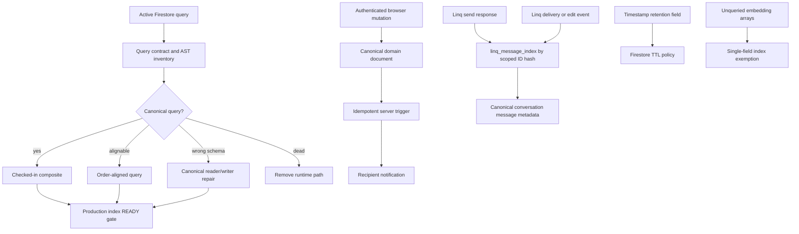

# Firestore Index and Data Integrity Hardening - Plan

## Goal Capsule

| Field | Value |
|---|---|
| Objective | Make every active Firestore query executable, align every audited writer and reader with its canonical schema, restore server-authoritative notification delivery, activate intended retention policies, and prevent unnecessary indexing of large embedding arrays. |
| Code authority | `fix/evia-memory-grounding-hardening` at `636221af`. Re-read every affected query and writer if implementation begins after this branch or `origin/main` moves. |
| Production authority | Firebase project `careconnex-d4c8b`. The implementation must compare local definitions with live composite indexes and TTL policies immediately before each infrastructure change. |
| Execution profile | React/Vite web code, Firebase Functions, Firestore rules, composite indexes, field overrides, read-only production verification, one dry-run-first metadata migration, and Hosting. |
| Stop conditions | Stop the affected release slice before weakening cross-user notification rules, creating indexes for a known wrong schema, deleting a legacy path that has gained production documents, enabling one TTL policy against invalid or unexpectedly old values, printing document contents in audit tooling, accepting unverified Linq events, or deploying dependent code before required composites are `READY`. Unrelated canonical repairs continue when their own gates pass. |
| Tail ownership | Implementation owns tests, additive index deployment, TTL and exemption proof, Functions/rules/Hosting deployment, authenticated production smokes, rollback evidence, and exact local/remote/live SHA reporting. |

---

## Product Contract

### Summary

The source checkout declares 122 composite indexes while production has 119, all `READY`. A production query-planner sweep exercised 118 unique direct query signatures: 80 passed and 38 returned `FAILED_PRECONDITION`. Twelve of those failures belong to wrong-schema or unused paths and must not receive indexes. The remaining active failures collapse to 22 new composites after three compatible query shapes are aligned, plus two manually discovered composites for client-intake rescoring and caregiver-callout notifications. Health-trend loading keeps ascending date semantics because its `limit(100)` makes direction behaviorally significant. Two additional active composites already exist locally but have not been deployed.

The index gaps are only one part of the defect set. Invoice readers use a field their writer does not store. Linq delivery and edit webhooks query fields on root conversation documents even though canonical messages live in a subcollection. Proactive reflection reads an empty collection with no writer. Multiple browser workflows attempt to create notifications for another user despite rules allowing only administrators to do so. Several empty legacy collections remain writable or queryable. Intended TTL fields exist in production but no TTL policy is enabled, and `memory_operations.expiresAt` is the wrong Firestore type. Four large embedding fields are indexed even though no Firestore query filters or orders by them.

This plan fixes those defects as one data-integrity program. It adds only indexes justified by active canonical queries, removes obsolete query surfaces, moves cross-user side effects behind Admin SDK authority, activates retention only after type proof, and installs durable tests so the same drift cannot return silently.

### Problem Frame

Firestore missing-index errors are currently converted into empty arrays, null context, or silent no-ops in several user and scheduled paths. That makes a valid empty result indistinguishable from an unavailable query. The platform can therefore show no appointments, no applicants, no care requests, or no operational signal even though matching documents exist.

Adding every index suggested by an error would preserve several incorrect data models. The correct remediation must first decide whether a query is canonical, wrong, or dead. It must then verify that field names, timestamp types, ownership rules, and production collection usage agree before any index or TTL policy is deployed.

### Confirmed Current-State Evidence

| Finding | Evidence at the reviewed commit and production snapshot | Disposition |
|---|---|---|
| Local and live index sets differ | Local has 122 composites. Production has 119 `READY` composites. The three local-only definitions are one nightly `agent_sessions` index and two `memory_operations` indexes. | Deploy the two active indexes. Replace `status + expiresAt` cleanup with TTL. |
| Active query coverage is incomplete | Read-only production planner execution found 38 rejected direct signatures. Manual checks found missing `clientIntakes(status, createdAt)` and notification-subcollection coverage. | Build the complete contract in U1 and deploy additive canonical indexes in U5 before unrelated schema and legacy work. |
| Runtime logs under-report index failures | No matching production log entry appeared in the 14-day search, while planner execution reproduced failures. Multiple callers swallow query errors. | Add structured observability and user-safe error states in U1/U5. |
| Invoice billing context is schema-incompatible | `functions/src/mcp/server.ts` filters invoices by `userId`; `functions/src/invoicing.ts` writes `clientId`. | Query `clientId`; preserve `payments.userId`. |
| Linq receipt/edit queries target nonexistent root rows | Webhooks query root `agent_conversations` fields. Writers store `agent_conversations/{phone}/messages/{id}`. Production has zero root conversation documents. | Add direct provider-message mapping; never add root indexes. |
| Proactive billing context is a ghost path | `proactiveReflection.ts` reads `billing_events`; no writer exists and production count is zero. | Read canonical `payments` and `invoices`. |
| Browser cross-user notifications cannot land | `firestore.rules` allows subcollection notification creates only for admins, while services and components attempt peer writes and suppress permission errors. | Move delivery to idempotent Functions triggers; keep rules strict. |
| Legacy paths are empty | Production counts are zero for `timesheets`, `media_updates`, `peer_recognitions`, `caregiver_of_month`, `videoInterviews`, and `billing_events`. Canonical `video_interviews` contains data. | Re-verify counts, then retire runtime access and stale indexes/rules without migration. |
| TTL is declared in data but disabled in infrastructure | Production has zero TTL policies. Timestamp TTL fields exist on audit, action, activity, outbound-queue, and iMessage-retry documents. | Add field overrides after retention/type checks. |
| Memory-operation expiry is not TTL-compatible | `memory_operations.expiresAt` is an ISO string. Production currently contains zero operation documents. | Change future writes to `Timestamp`, provide a dry-run migration, then enable TTL. |
| Embedding indexes have no query consumer | Firestore queries never filter/order on the four audited embedding fields. The sole override for `caregivers.embedding` retains ascending indexing. | Add complete `indexes: []` exemptions for all four collection groups. |
| Existing contract test is too shallow | `tests/contractCollections.test.ts` validates collection mentions and broad rules text but not query fields, index coverage, writer-reader compatibility, or rule behavior. | Add AST/manifest, rule-emulator, and canonical-path tests. |

### Actors

- A1. Client or family user performing bookings, cancellations, messaging, reviews, payments, and callout recovery in the web app.
- A2. Caregiver performing applications, interview responses, extra-visit responses, schedule actions, and payment workflows.
- A3. Evia and scheduled Firebase Functions reading operational, billing, memory, appointment, interview, and alert state.
- A4. Linq delivering provider message events that must update the correct canonical message metadata.
- A5. Administrator using audit, client, caregiver, invoice, and operations surfaces.
- A6. Release operator deploying indexes, Functions, rules, TTL policies, and Hosting to `careconnex-d4c8b`.

### Requirements

#### Query And Index Correctness

- R1. Every active compound Firestore query must have a checked-in composite index or be rewritten to reuse an already justified index without changing its business result.
- R2. The repository must contain `firestore.query-contracts.json`, a machine-readable contract covering every active direct, dynamically constructed, collection-group, and subcollection query that requires a composite or has an explicit no-composite disposition.
- R3. CI must fail when an active query contract lacks a local index, when a required local index is duplicated, when any Firestore query-construction callsite is unclassified, or when a forbidden wrong/dead query signature returns to runtime source.
- R4. A production verification mode must execute each contract as a read-only `limit(1)` planner probe, discard returned data, and print only contract IDs, collection names, and pass/fail status.
- R5. User-facing and scheduled paths must not silently convert `failed-precondition` into a legitimate empty result. They must emit a structured error and preserve an unavailable/error state appropriate to the caller.
- R6. The two active local-only composites Q25/Q26 for nightly session selection and memory-operation retries must be deployed and verified `READY` before dependent Functions are considered healthy.

#### Canonical Data Placement

- R7. Invoice billing reads must use `clientId`, matching the canonical invoice writer and existing invoice index. Payment billing reads must continue using `userId`, matching Stripe writes.
- R8. Proactive reflection must build bounded billing context from canonical invoice and payment records. The model prompt allowlist is limited to normalized source type, normalized status, and coarse service/creation date; it excludes amounts, descriptions, payment methods, names, addresses, phones, emails, document IDs, and provider IDs. It must not introduce a replacement `billing_events` writer solely to preserve the ghost collection.
- R9. Linq provider events must resolve messages through an O(1), server-only provider-message map whose document ID is `sha256(providerAccountScope + ":" + providerMessageId)`. No raw provider ID appears in the document path or stored fields, and no root `agent_conversations` query or composite may be introduced.
- R10. Provider-message mapping must reference preallocated canonical conversation rows without copying message text, phone numbers, chat IDs, or user IDs. Delivery, sent, failed, and edit updates must be idempotent, every multipart provider ID must be returned internally and registered, and webhook-before-enrichment must converge without losing the event.
- R11. Canonical collection names remain `shiftHours`, `video_interviews`, `agent_conversations/{phone}/messages`, `clientIntakes`, `invoices`, and `payments`.
- R31. Linq webhook signature verification must remain fail-closed and execute against the raw request body before provider-map access. Missing/invalid signatures, missing/malformed timestamps, timestamps older than five minutes, duplicate event IDs, and invalid provider-message IDs must produce no canonical mutation; deployment must prove `LINQ_WEBHOOK_SECRET` remains configured without exposing it.

#### Notification Authority

- R12. A browser user must never write a notification into another user's root or subcollection path. Cross-user notifications are server-owned side effects.
- R13. Existing server triggers must own booking, appointment, cancellation, job-application, interview, shift, and message transitions. Missing review and extra-visit transitions must be added to the closest existing trigger owner, with one checked-in transition-to-owner matrix and no transition owned twice.
- R14. Notification writes must use `sha256(sourcePath + eventId + recipientId + transitionType)` and create-if-absent transaction semantics. The writer must preserve owner-mutated read/delete state, propagate write failures, and run under a retry-enabled trigger policy so fail-first and delayed replays converge to one notification.
- R15. Notification recipients and safe display payloads must be derived from server-read canonical relationships, not browser-supplied target/name fields. Rules must keep ownership fields immutable where a trigger relies on them, remain owner-readable and owner-updatable for read/soft-delete fields, deny owner hard-delete so retry deduplication state persists, and deny cross-user creation. Administrator deletion remains available. Rule behavior must be proven with the Firestore rules emulator.

#### Retention And Index Efficiency

- R16. TTL policies must be enabled for `agent_audit_log.ttl`, `agent_action_ledger.ttl`, `user_activity_feed.ttl`, `linq_outbound_queue.ttl`, `agent_imessage_retry.ttl`, `memory_operations.expiresAt`, and the new Linq provider-message map TTL field.
- R17. Every TTL-enabled value must be a Firestore `Timestamp`. Null or missing values must intentionally mean not eligible for expiry.
- R18. Completed memory operations must retain their 30-day policy; failed or unresolved operations must never become expiry-eligible.
- R19. TTL field overrides must disable unnecessary single-field indexing unless a proven query requires it.
- R20. `caregivers.embedding`, `clientIntakes.embedding`, `blocks.embedding`, and `facts.embedding` must use `indexes: []`. No vector value may be rewritten or migrated merely to change index configuration.

#### Legacy Retirement

- R21. Runtime reads and writes for empty legacy collections must be removed after an immediate pre-change production count confirms they remain empty.
- R22. The obsolete `videoInterviews` trigger and both camel-case composites must be removed only after canonical `video_interviews` trigger/export coverage is proven.
- R23. The `/caregiver/transactions` page must retain its canonical `shiftHours` behavior while removing the unused legacy `timesheets` fetch and state. User-visible wording may continue using the familiar word "timesheets."

#### Release Safety And Proof

- R24. Additive composites must deploy before any dependent query code. The release must block until every required composite reports `READY`.
- R25. Server notification owners must be live before Hosting removes the blocked browser writes.
- R26. TTL enablement must be preceded by per-policy field-type and retention proof. A nonzero legacy count stops only that collection's cleanup. An unexpected TTL type, derivation, or already-expired population stops only that TTL policy and produces a count-only migration/backup report; unrelated canonical fixes continue.
- R27. Final proof must distinguish local branch/commit, remote branch, `origin/main`, live index/TTL state, live Function update times, Hosting release, authenticated smokes, and any intentionally deferred deployment.
- R32. Additive index creation must use a dedicated script that can only create missing Q1-Q26 composites. The final `firestore.indexes.json` deployment that enables field overrides or removes stale composites is a separate, evidence-gated operation with an exact preflight diff.

#### Verification And Privacy

- R28. Audit and migration tooling must report counts, field-type classes, index signatures, and opaque references only. It must not print document bodies, names, phones, message text, care notes, billing descriptions, or provider IDs.
- R29. Tests must cover canonical writer-reader fields, notification authorization, trigger idempotency, provider receipt mapping, active index coverage, TTL types, exemptions, and forbidden legacy paths.
- R30. The release must include a post-deploy planner sweep and user-flow smokes for both client and caregiver roles, not only a Firebase CLI success line.
- R33. Every user-facing query in the Q1-Q26 contract must define separate loading, true-empty, failed/unavailable, retry/reconnect, stale-data, and recovered states. Error notices and retry controls must be keyboard accessible, use appropriate `status`/`alert` semantics, preserve focus, and never rely on color alone.
- R34. A successful domain mutation must be reported as successful even though notification delivery is asynchronous. Delivery failure is an operational retry state, not a retroactive user-action failure, and the UI must not claim the notification itself was delivered.
- R35. The implementation must independently census every `collection`, `collectionGroup`, `query`, dynamic query-builder, and Admin/client SDK wrapper callsite. Zero unclassified callsites is the gate; post-deploy observation must span seven days or explicitly exercise every longer-cadence scheduled query before closure.

### Acceptance Examples

- AE1. A family billing-summary request finds an invoice written with `clientId` and a payment written with `userId`; one missing side returns an explicit partial result rather than failing the entire summary.
- AE2. A Linq outbound message returns provider ID `m1`. `message.delivered` hashes the scoped ID, direct-reads the map, and updates referenced canonical message metadata with no collection query and no raw provider ID at rest.
- AE3. A Linq edit for an unknown provider ID records one sanitized unmatched-event metric and changes no conversation document.
- AE4. Proactive reflection receives recent canonical invoices/payments and never queries or writes `billing_events`.
- AE5. A caregiver applies to a job in the web app. The application succeeds, the server trigger creates exactly one client notification, and the browser performs no peer notification write.
- AE6. A caregiver accepts or declines an interview. The canonical `video_interviews` trigger creates exactly one notification for the client.
- AE7. A client sends a thread message or cancels a booking. Existing server triggers notify the other participant once; removed browser writes do not create a gap or duplicate.
- AE8. A client posts a review. A new server-owned review transition notifies the caregiver once, even when the Firestore trigger delivery is retried.
- AE9. The caregiver callout hook queries `type == callout`, `isRead == false`, ordered by `createdAt DESC`, and the production planner accepts it.
- AE10. Nightly memory and the memory-operation worker execute after their two checked-in composites are deployed and `READY`.
- AE11. A completed memory operation stores `expiresAt` as `Timestamp`; an unresolved operation keeps `expiresAt` null. TTL is enabled only on the Timestamp field.
- AE12. Existing audit/action/activity documents retain their declared retention windows after TTL activation. No current document is removed merely because its field was the wrong type.
- AE13. A Firestore write containing a 1536-value embedding does not create single-field index entries for the four exempt collection groups, while semantic ranking still works in application code.
- AE14. A pull request adds a composite-dependent query without updating the query contract/index file. The index coverage test fails with the collection and missing field order.
- AE15. Immediately before legacy cleanup, a metadata-only production check finds a nonzero `timesheets` count. Cleanup stops; no rule, API, or index is removed for that collection.
- AE16. A valid signed delivery webhook arrives before send-side enrichment. It creates a 24-hour unresolved map entry; send-side attachment merges preallocated canonical refs, applies the receipt, changes expiry to 365 days from provider acceptance, and leaves no unresolved event.
- AE17. A notification write fails on its first attempt, then the retry runs after the recipient has read or soft-deleted the notification. The transition remains one document and no existing owner state is reset.
- AE18. A health-trend account has more than 100 matching appointments. The query explicitly orders `isoDate ASC` and returns the same oldest-first 100 rows as the pre-hardening query.

### Scope Boundaries

**In scope**

- All active and dead query/index findings from the 2026-07-19 source and production audit.
- Canonical billing, Linq message metadata, notification, appointment, interview, intake, audit, memory, and scheduled-worker data paths.
- Firestore composite indexes, TTL policies, field exemptions, rules, rule tests, contract tests, and production planner checks.
- Removal of runtime access to production-empty legacy paths.
- Functions and Hosting changes required to replace blocked browser notification writes.
- Dry-run-first metadata migration for `memory_operations.expiresAt` if documents appear before implementation.

**Out of scope**

- Relaxing notification rules so one browser user can write another user's notifications.
- Migrating empty legacy collections into canonical stores. A nonzero preflight count creates a separate migration requirement and stops that cleanup slice.
- Replacing Firestore, changing Evia's base model, or redesigning the complete memory architecture.
- Moving embeddings to Firestore vector search. This plan only removes unused scalar/array indexing.
- Rewriting every timestamp in the repository into one representation. Only fields that affect audited queries, TTL, or canonical writer-reader compatibility are included.
- Inspecting or exporting production document contents as part of verification.
- Deleting top-level `notifications`, which remains a distinct registered collection. Only dead or unauthorized browser creation paths are removed.

---

## Planning Contract

### Key Technical Decisions

- KTD1. **Fix schema before adding indexes.** A planner error is not sufficient evidence that an index should exist. Every failed signature is classified as active-canonical, align-to-existing, wrong-schema, or dead before infrastructure changes.
- KTD2. **Keep canonical collection authority explicit.** `functions/src/data/contract.ts` remains the source for canonical collection names. New tests add field/query semantics instead of replacing that registry.
- KTD3. **Use an explicit query contract plus independent AST discovery.** `firestore.query-contracts.json` records direct, dynamic, collection-group, and subcollection queries. A TypeScript compiler-API scan starts from every Firestore SDK query-construction callsite, not from the contract, and requires each callsite to be classified as composite-backed, single-field, direct-document, wrong-schema, or dead with rationale. The contract and discovery inventories must reconcile with zero unclassified callsites.
- KTD4. **Align only three order-insensitive queries.** Add `timestamp DESC` to reply-existence checks, `date DESC` to lateness counts, and `date DESC` to recurring-schedule cancellation. Each already has an inequality on the same ordered field, so missing/null values were already excluded; tests prove identical result membership. Keep health-trend appointments explicitly `isoDate ASC`: its `limit(100)` makes direction semantic, so it receives a separate ascending composite instead of sharing the admin screen's descending index.
- KTD5. **Use a scoped, hashed provider-message map.** Add `linq_message_index/{sha256(providerAccountScope + ":" + providerMessageId)}` as a server-only map to preallocated canonical message references and normalized receipt/edit metadata. Store neither the raw provider ID nor message, phone, chat, user, or billing data. Enriched entries expire 365 days after provider acceptance and events do not refresh that horizon. A webhook-first unresolved entry expires after 24 hours; an event after an enriched entry has expired creates only an unresolved entry/metric and cannot mutate conversation history.
- KTD6. **Make provider identity handoff convergent.** Allocate the logical history ID and canonical message refs before transport without writing a phantom sent row. Change the internal send result to `{ message_id, message_ids }` while preserving `message_id` for callers. After each successful provider part, batch the first canonical sent-row write when needed and merge the hashed map entry; successful parts survive partial multipart failure. If the signed webhook wins the race, it upserts normalized receipt state into the same hashed unresolved map entry and send-side enrichment later attaches refs and applies it. `message.sent` never discovers "the latest outbound" row by chat.
- KTD7. **Use retry-safe, owner-state-preserving notification operations.** The operation ID hashes immutable source path, trigger `eventId`, recipient, and transition type. A transaction creates the notification only when absent and never merges over `isRead` or soft-deletion state. Owner deletion becomes soft-delete only; administrator hard-delete remains exceptional. Trigger handlers run with retry enabled and rethrow notification write failures; duplicate deliveries and delayed replays become no-ops after the first create.
- KTD8. **Extend existing trigger ownership instead of creating a notification API.** Appointment, booking, job application, interview, shift, and thread triggers already exist. Add only uncovered review and extra-visit transitions, then remove browser peer writes.
- KTD9. **Compose a data-minimized proactive billing signal.** Query `payments.userId` and `invoices.clientId` independently, but expose to the model only normalized source type, status, and coarse date. Do not expose amounts, free text, payment instruments, identity/contact fields, or record/provider IDs. Tolerate one source being unavailable without disguising it as an empty success; deployment confirms the configured model endpoint is approved for this metadata class.
- KTD10. **TTL is the cleanup mechanism, not `status + expiresAt`.** Convert `memory_operations.expiresAt` to `Timestamp`, enable TTL, and remove the unused cleanup composite. Failed/unresolved records stay non-expiring through null expiry.
- KTD11. **Index exemptions do not rewrite vectors.** Field overrides alone stop future index fanout and permit background index cleanup. Application-level vector loading/ranking remains unchanged.
- KTD12. **Legacy retirement is evidence-gated.** Production-zero collections may have runtime code, rules, and indexes removed. Any nonzero count stops that collection's cleanup without blocking unrelated canonical fixes.
- KTD13. **Make index failures observable without leaking data.** Structured events contain query-contract ID, collection, caller class, and Firebase error code. They never include filter values, document IDs, user IDs, or returned fields.
- KTD14. **Use two index rollout artifacts.** `scripts/deploy-firestore-additive-indexes.mjs` reads Q1-Q26 and may only create missing composites; it cannot delete indexes or modify field overrides. The checked-in `firestore.indexes.json` remains the desired final state and is deployed only after a preflight diff proves the exact stale removals and field overrides whose separate gates passed.
- KTD15. **Preserve webhook trust boundaries.** Existing raw-body HMAC verification, five-minute replay window, event deduplication, and fail-closed missing-secret behavior stay ahead of all event routing and provider-map reads. Tests lock that order and reject malformed provider identifiers before hashing or writes.
- KTD16. **Separate domain success from notification delivery.** Browser flows await only the canonical domain mutation. The server trigger owns notification retries; the sender UI neither waits for nor claims recipient delivery. Operations alert on exhausted/repeating retries without turning a committed booking, cancellation, application, interview, message, or review into a displayed failure.

### High-Level Data Flow

### Canonical Index Manifest

The final local index file must contain these 24 new active composites. Equality fields are `ASCENDING`; the final range/order field uses the direction shown.

| Contract | Collection group | Fields | Primary callers |
|---|---|---|---|
| Q1 | `execution_agents` | `status`, `lastActiveAt ASC` | `functions/src/agents/executionAgent.ts` |
| Q2 | `clientIntakes` | `phone`, `createdAt DESC` | `functions/src/agents/permissionsConversation.ts` |
| Q3 | `appointments` | `clientId`, `status`, `isoDate DESC` | `functions/src/agents/refundHandler.ts` |
| Q4 | `interview_requests` | `caregiverId`, `status`, `createdAt DESC` | `functions/src/agents/interviewAgent.ts`, `functions/src/linq/routeCaregiver.ts` |
| Q5 | `appointments` | `recurringScheduleId`, `status`, `date DESC` | `functions/src/agents/modifyScheduleFlow.ts`, `functions/src/scheduled/recurringScheduler.ts` |
| Q6 | `replacement_candidates` | `phone`, `status`, `contactedAt DESC` | `functions/src/linq/routeCaregiver.ts` |
| Q7 | `health_signals` | `seniorId`, `detectedAt DESC` | `functions/src/mcp/server.ts` |
| Q8 | `payments` | `userId`, `createdAt DESC` | `functions/src/mcp/server.ts`, `functions/src/scheduled/proactiveReflection.ts` |
| Q9 | `appointments` | `caregiverId`, `status`, `date DESC` | `functions/src/mcp/server.ts` |
| Q10 | `job_applications` | `jobId`, `status`, `appliedAt ASC` | `functions/src/scheduled/staleApplicantNudge.ts` |
| Q11 | `agent_dnd_queue` | `sentAt`, `sendAfter ASC` | `functions/src/scheduled/dndQueueProcessor.ts` |
| Q12 | `admin_alerts` | `type`, `createdAt ASC` | `functions/src/scheduled/opsAnomalyWatch.ts` |
| Q13 | `proactive_drafts` | `userId`, `contextHash`, `createdAt ASC` | `functions/src/scheduled/proactiveReflection.ts` |
| Q14 | `appointments` | `clientId`, `isoDate ASC` | `functions/src/scheduled/healthTrends.ts` oldest-first bounded analysis |
| Q15 | `agent_sessions` | `userType`, `onboardingStep`, `lastInboundAt ASC` | `functions/src/scheduled/familySilenceCheckin.ts` |
| Q16 | `disputes` | `status`, `slaDeadline ASC` | `functions/src/triggers/disputeResolution.ts` |
| Q17 | `invoices` | `status`, `createdAt ASC` | `functions/src/invoicing.ts` |
| Q18 | `clientIntakes` | `userId`, `createdAt DESC` | `functions/src/aiMatching.ts` |
| Q19 | `appointments` | `caregiverId`, `isoDate DESC` | `services/api.ts` admin caregiver detail |
| Q20 | `agent_audit_log` | `eventType`, `timestamp DESC` | `components/admin/AuditDashboard.tsx` |
| Q21 | `interview_requests` | `caregiverId`, `createdAt DESC` | `components/caregiver/CaregiverCareRequestsCard.tsx` |
| Q22 | `clientIntakes` | `status`, `createdAt DESC` | `functions/src/triggers/aiMatchTriggers.ts` intake rescoring |
| Q23 | `notifications` | `type`, `isRead`, `createdAt DESC` | `hooks/useCaregiverCallout.ts` subcollection query |
| Q24 | `appointments` | `clientId`, `isoDate DESC` | `services/api.ts` admin client detail |

The final production set must also include these two already-checked-in active definitions:

| Contract | Collection group | Fields | Primary caller |
|---|---|---|---|
| Q25 | `agent_sessions` | `onboardingStep`, `optedOut`, `userType`, `lastMessageAt DESC` | `functions/src/scheduled/nightlyMemory.ts` |
| Q26 | `memory_operations` | `status`, `nextRetryAt ASC` | `functions/src/scheduled/memoryOperationWorker.ts` |

### Queries That Must Not Receive New Indexes

| Rejected signature | Reason | Required correction |
|---|---|---|
| Root `agent_conversations.messageId` and `chatId + direction + createdAt` | Root documents do not carry message rows; production root count is zero. | Direct `linq_message_index/{providerMessageId}` lookup. |
| `invoices.userId + createdAt` | Canonical invoices use `clientId`. | Change reader to `clientId`; reuse canonical invoice index. |
| `billing_events.userId + createdAt` | No writer and zero production documents. | Read canonical invoices/payments. |
| Ordered web `referrals` queries | Web referral methods have zero callers; referrals are SMS/server-owned by product decision. | Remove dead web methods; preserve backend referral flow. |
| `media_updates.clientId + timestamp` | Zero production documents and no callers. | Remove dead Phase 2 service block. |
| `caregiver_of_month(year, month)` | Zero production documents and no caller/writer. | Remove dead service method. |
| `peer_recognitions.toCaregiverId + createdAt` | Zero production documents and no writer/caller. | Remove dead service method. |
| `interview_requests.caregiverId + clientPhone + createdAt` | The service method has no callers. | Remove the dead method; preserve canonical interview flows. |
| `shifts.caregiverId + clientId + timestamp` | Method has no callers and `timestamp` is not the canonical shift ordering field. | Remove the dead method. |
| Legacy `timesheets` client/caregiver ordered queries | Canonical payroll uses `shiftHours`; production count is zero. | Remove API methods, component fetch, and permissive rule. |
| `memory_operations.status + expiresAt` | No cleanup query exists; TTL is the intended policy. | Remove composite and enable Timestamp TTL. |
| Camel-case `videoInterviews` composites | Canonical collection is `video_interviews`; production camel-case count is zero. | Remove stale trigger and both composites after preflight. |

### Field Override Contract

| Collection group | Field | Configuration | Rationale |
|---|---|---|---|
| `agent_audit_log` | `ttl` | `ttl: true`, `indexes: []` | Six-year audit retention; field is not queried. |
| `agent_action_ledger` | `ttl` | `ttl: true`, `indexes: []` | Six-year action retention; field is not queried. |
| `user_activity_feed` | `ttl` | `ttl: true`, `indexes: []` | One-year family activity retention. |
| `linq_outbound_queue` | `ttl` | `ttl: true`, `indexes: []` | Seven-day post-settlement cleanup. |
| `agent_imessage_retry` | `ttl` | `ttl: true`, `indexes: []` | Six-hour retry-record cleanup. |
| `memory_operations` | `expiresAt` | `ttl: true`, `indexes: []` | Thirty-day completed-operation cleanup; unresolved records remain null. |
| `linq_message_index` | `ttl` | `ttl: true`, `indexes: []` | Unresolved webhook-first rows: 24 hours. Enriched mappings: 365 days from provider acceptance; events never extend expiry. |
| `caregivers` | `embedding` | `indexes: []` | Loaded/ranked in application code, never queried by Firestore. |
| `clientIntakes` | `embedding` | `indexes: []` | Loaded/ranked in application code, never queried by Firestore. |
| `blocks` | `embedding` | `indexes: []` | Memory block semantic ranking occurs in application code. |
| `facts` | `embedding` | `indexes: []` | Learned-fact semantic ranking occurs in application code. |

### Notification Ownership Matrix

The implementation must update this matrix and its contract test if source rereading finds an additional active producer. A transition may have one server notification owner only; the browser owns none.

| Domain transition | Canonical source | Server owner | Recipient derivation | Browser result semantics |
|---|---|---|---|---|
| Appointment created or cancelled | `appointments/{appointmentId}` | Existing appointment triggers in `functions/src/notifications.ts` | Server-read client/caregiver relationship on the appointment | Domain save succeeds without waiting for notification delivery. |
| Booking request state | `booking_requests/{requestId}` | `onBookingRequestWrite` | Server-read request parties, cross-checked against referenced job/appointment where present | Request state is authoritative; no delivery claim. |
| Job application created/state changed | `job_applications/{applicationId}` | Existing application trigger in `notificationTriggers.ts` | Client from canonical job and caregiver from authenticated application ownership | Application succeeds; notification retries are operational. |
| Interview created/decision/cancelled | `video_interviews/{interviewId}` | `onVideoInterviewWrite` | Canonical interview parties | Interview state succeeds independently of notification retry. |
| Shift cancellation or extra-visit decision | `shifts/{shiftId}` | `onShiftStatusChanged` | Canonical shift parties; immutable ownership fields enforced by rules | Shift mutation is authoritative; UI does not claim peer delivery. |
| Thread message created | Canonical thread message document | `onMessageSent` | Server-read thread participants excluding actor and Evia mirror exclusions | Message send status is separate from recipient notification state. |
| Review created | Canonical review document | Existing review trigger export, extended with notification operation | Caregiver from canonical completed appointment/review relationship | Review save succeeds; notification delivery is asynchronous. |

### User-Facing Query State Matrix

All rows must distinguish an empty successful snapshot from a failed or disconnected query. When a prior successful snapshot exists, keep it visibly stale during retry rather than replacing it with a false empty state.

| Surface and contract | Loading | True empty | Failed/disconnected | Retry and recovery |
|---|---|---|---|---|
| Admin client detail, Q24 | Stable detail skeleton | "No appointments" only after a successful empty snapshot | Inline `role="alert"` unavailable state; preserve prior rows as stale | Keyboard-operable retry refetches; focus returns to the status region and success clears stale label. |
| Admin caregiver detail, Q19 | Stable detail skeleton | "No appointments" only after success | Same prior-data preservation and explicit unavailable state | Manual retry plus listener reconnect; announce recovery with `aria-live="polite"`. |
| Audit dashboard, Q20 | Table skeleton with fixed columns | "No audit events" only after success | Keep prior audit rows, show non-color-only alert, and log Q20 only | Retry preserves table focus/scroll and announces recovery. |
| Caregiver care requests, Q21 | Fixed-height request placeholders | "No care requests" only after success | Prior snapshot becomes stale; otherwise show unavailable, never "no requests" | Listener reconnect is automatic and a keyboard retry is available. |
| Caregiver callout banner, Q23 | No false positive banner while unresolved | No banner only after a successful empty snapshot | Expose a non-blocking notification-status alert; do not imply no callout exists | Automatic reconnect plus accessible retry; recovered unread callout receives normal focus behavior without stealing current input focus. |

### Sequencing

1. Add characterization tests, `firestore.query-contracts.json`, independent callsite census, privacy-safe planner tooling, and the additive-only deployment script.
2. Align the three behavior-preserving query shapes, add the 24 desired composites plus retained Q25/Q26 to the final manifest, and make every user-facing Q-contract implement the state matrix.
3. Run the additive script in dry-run mode, review its Q1-Q26-only create list, apply it, and wait for every required composite to report `READY` and pass the live planner. This stage cannot remove composites or activate field overrides.
4. Correct billing/proactive reflection and Linq provider-message placement; establish retry-safe server notification ownership; re-run legacy counts and remove runtime access only for paths still empty. These U2-U4 tracks may proceed independently after characterization.
5. Deploy Functions that depend on the now-`READY` composites and prove notification owners/retry configuration before changing browser behavior.
6. Deploy rules and Hosting after Functions proof, then run authenticated notification, unavailable-state, and user-flow smokes.
7. Run each TTL policy's type/retention/expiry projection. Conditionally create and execute the memory-operation migration only when eligible documents exist; enable passing TTL policies one at a time and verify each live before continuing.
8. Produce the exact final-manifest preflight diff. After all relevant gates pass, deploy embedding exemptions and only the approved stale composite removals; a blocked collection or TTL policy is omitted from that deployment artifact without blocking unrelated changes.
9. Run final planner, TTL, live Function, Hosting, logs, and Git/GitHub proof. Keep a seven-day query-contract observation window (or explicitly exercise every longer-cadence scheduled caller) before closing the hardening work.

### Risks And Mitigations

| Risk | Severity | Mitigation |
|---|---|---|
| An index is added for a wrong schema and makes a broken path look healthy | Critical | Required classification table, forbidden-signature tests, and canonical writer-reader tests before index edits. |
| Browser notification removal creates a delivery gap | Critical | Prove trigger ownership per transition, deploy Functions first, then remove browser writes in Hosting. |
| Trigger retries duplicate notifications | High | Deterministic operation IDs and tests that invoke each transition twice. |
| A notification write fails transiently and the handler swallows it | Critical | Retry-enabled trigger policy, create-if-absent transaction, rethrow on write failure, fail-first test, and alerting for repeated failures. |
| TTL deletes data with an unintended retention value | Critical | Type/count/retention preflight, dry-run migration, separate TTL enablement, and stop on unexpected types. |
| Removing a legacy path loses newly created production data | Critical | Re-run aggregate counts immediately before cleanup; skip only the affected collection if nonzero. |
| Linq message map stores PHI or becomes another transcript store | High | Scoped hashed document key, reference-only allowlist, explicit client deny, 365-day fixed horizon, and serialized-document tests. |
| Multi-part Linq messages map only the first provider ID | High | Register every provider part returned by `sendOneMessage`; allow several provider docs to reference one logical history row. |
| A signed Linq webhook arrives before send-side mapping | High | Preallocate canonical refs; webhook-first unresolved upsert and send-side merge converge on the same hash; 24-hour unresolved TTL and race tests. |
| Linq webhook trust checks are bypassed during refactor | Critical | Preserve raw-body HMAC, freshness, dedup, secret, and identifier validation ahead of routing; negative tests assert zero writes. |
| A subcollection query is absent from AST discovery | High | Explicit contract registry includes dynamic/subcollection queries; production planner mode validates the whole registry. |
| Equality field order or range direction is encoded incorrectly | High | Use Firebase-generated planner signatures, local JSON normalization, and live planner proof before Functions deployment. |
| Index deployment reports success while indexes are still building | High | Require per-index `READY` state and a passing planner sweep, not only CLI exit status. |
| Full Functions deployment changes unrelated shared code | High | Build/test current HEAD, compare environment values, use reviewed full deploy when shared modules fan out, and verify exact function update times. |
| Client screens still swallow listener errors | Medium | Component error-state tests and structured query-contract logging with no filter values. |
| Billing context leaks unnecessary financial or identity data to the model | High | Prompt field allowlist, serialized-prompt test, approved-endpoint deployment gate, and no raw billing logs. |
| The final index manifest accidentally removes indexes during the additive stage | Critical | Additive script permits create operations only; field overrides and deletions use a separate exact-diff deployment after policy-specific gates. |
| Index additions approach project quota | Medium | Record pre/post composite count, remove three stale composites after stabilization, and fail preflight before quota exhaustion. |

---

## Implementation Units

### U1. Query Contract, Planner Tooling, And Failure Observability

- **Goal:** Create a durable inventory that links active query signatures to local composites and live planner proof, including dynamic and subcollection queries the first static sweep missed.
- **Files:** `firestore.query-contracts.json`, `scripts/audit-firestore-query-contracts.mjs`, `tests/firestoreIndexCoverage.test.ts`, `tests/contractCollections.test.ts`, `package.json`, and the active query files listed in the Canonical Index Manifest where error handling changes.
- **Patterns:** TypeScript compiler API for structured source parsing; JSON parsing for `firestore.indexes.json`; existing metadata-only Firebase Admin production audit style; structured aggregate logs used by memory hardening.
- **Decisions:** Keep a checked-in query contract with stable Q1-Q26 IDs. Discovery begins from all imported Admin/client Firestore APIs and local wrappers, including `collection`, `collectionGroup`, `query`, and conditionally assembled query variables; each callsite receives a contract or explicit disposition. Production mode uses placeholder filters, synthetic parent `codex-index-audit` for subcollections, `limit(1)`, and no result serialization. Local test mode never requires cloud credentials.
- **Test Scenarios:** Missing Q23 notification index fails with Q23 and its fields; a duplicate composite fails; a direct, wrapper-built, dynamic, or collection-group query not in the contract fails discovery; a documented single-field/direct-document query passes with rationale; production output contains no returned value or document ID; a mocked `failed-precondition` produces a structured query-contract event rather than an empty-success log; the census reports zero unclassified callsites.
- **Verification:** `npm.cmd test -- --run tests/firestoreIndexCoverage.test.ts tests/contractCollections.test.ts`; execute the planner script against an emulator/mock contract, then against production only at the deployment gate.
- **Covers:** R1-R6, R28-R30; AE9, AE14.

### U2. Canonical Billing And Linq Message Placement

- **Goal:** Remove three wrong/ghost read models and make provider delivery/edit events update canonical message metadata by direct key.
- **Files:** `functions/src/mcp/server.ts`, `functions/src/invoicing.ts`, `functions/src/scheduled/proactiveReflection.ts`, `functions/src/linq/client.ts`, `functions/src/linq/threadMirror.ts`, `functions/src/linq/webhooks.ts`, `functions/src/memory/conversationMemory.ts`, `functions/src/data/contract.ts`, `firestore.rules`, `functions/src/mcp/__tests__/billingPaymentFixes.test.ts`, `functions/src/scheduled/proactiveReflection.test.ts`, `functions/src/linq/__tests__/outboundHistory.test.ts`, existing webhook-auth tests, and new `functions/src/linq/__tests__/providerMessageIndex.test.ts`.
- **Patterns:** Canonical invoice writer in `functions/src/invoicing.ts`; canonical payment writer in `functions/src/stripe.ts`; deterministic message IDs/refs in `conversationMemory.ts`; direct message-ID retry records in `agent_imessage_retry`.
- **Decisions:** Query invoices by `clientId`; load payments/invoices independently; expose only normalized status/source/coarse date to reflection. Preallocate logical history identity, make internal sends return every provider ID, and converge send-first/webhook-first updates through the scoped hash and two TTL horizons from KTD5-KTD6. Preserve fail-closed raw-body signature/freshness/dedup checks before map access. Webhooks never scan conversation roots.
- **Test Scenarios:** Billing summary uses `clientId` for invoices and `userId` for payments; one source failing returns partial/unavailable metadata without erasing the other; serialized model input contains only the billing allowlist and no `billing_events`; one-part, multipart, partial-multipart, queued-redelivery, send-first, and webhook-first cases map every successful provider ID; duplicate and out-of-order events are idempotent; expired/unknown events cannot mutate history; missing/invalid/stale/replayed signatures and malformed IDs produce zero writes; serialized mapping/logs contain no text, raw provider ID, phone, chat, user, or billing identity.
- **Verification:** `npm.cmd test -- --run functions/src/mcp/__tests__/billingPaymentFixes.test.ts functions/src/scheduled/proactiveReflection.test.ts functions/src/linq/__tests__/outboundHistory.test.ts functions/src/linq/__tests__/providerMessageIndex.test.ts`; `npm.cmd --prefix functions run build`.
- **Covers:** R7-R11, R16-R17, R28-R29, R31; AE1-AE4, AE16.

### U3. Server-Authoritative Notification Delivery

- **Goal:** Replace every audited browser cross-user notification attempt with one idempotent server-owned transition while preserving owner read/update behavior.
- **Files:** New `functions/src/notifications/userNotification.ts`, `functions/src/notifications.ts`, `functions/src/triggers/notificationTriggers.ts`, `functions/src/index.ts`, `services/api.ts`, `hooks/useNotifications.ts`, `components/caregiver/CaregiverBookingsPage.tsx`, `components/caregiver/JobBoard.tsx`, `components/client/PostsPage.tsx`, `components/InboxView.tsx`, `components/ReviewSystem.tsx`, `firestore.rules`, new `functions/src/triggers/__tests__/notificationTriggers.test.ts`, new `tests/firestoreNotifications.rules.test.ts`, `package.json`, and `package-lock.json`.
- **Patterns:** Existing `externalOperationDocId` deterministic side-effect IDs; `onAppointmentCreated`, `onMessageSent`, `onBookingRequestWrite`, `onJobApplicationCreate`, `onVideoInterviewWrite`, and `onShiftStatusChanged`; owner update rules for notification read/delete fields.
- **Decisions:** Extract one Admin SDK notification writer that transactionally creates by immutable event operation ID and never merges over owner state. Check in and test the ownership matrix, derive recipients/payloads from server-read canonical documents, lock relied-on ownership fields in rules, enable trigger retries, and rethrow notification write failures. Add review-created and extra-visit accepted/declined handling only where the matrix shows no owner. Remove the dead top-level browser `notificationAPI` creation helper. Do not loosen rules.
- **Test Scenarios:** Each audited transition creates one recipient notification; fail-first retry, duplicate event delivery, delayed replay after read/soft-delete, and two legitimate same-type transitions produce the correct distinct documents without resetting state; owner hard-delete is denied while admin hard-delete remains allowed; malicious browser changes to target/name/ownership fields are denied or ignored in favor of canonical values; the actor is not the recipient; Evia mirrored threads remain excluded; browser source contains no cross-user notification add; domain UI reports its mutation result without claiming notification delivery.
- **Verification:** Run trigger tests and `npx --yes firebase-tools emulators:exec --only firestore "npm.cmd test -- --run tests/firestoreNotifications.rules.test.ts"`; `npm.cmd run typecheck`; `npm.cmd run build`.
- **Covers:** R12-R15, R25, R29-R30; AE5-AE8.

### U4. Empty Legacy Path Retirement

- **Goal:** Remove runtime code, rules, and stale composites that preserve production-empty, noncanonical data models.
- **Files:** `services/api.ts`, `components/caregiver/CaregiverPayments.tsx`, `functions/src/notifications.ts`, `firestore.rules`, `firestore.indexes.json`, `functions/src/data/contract.ts`, new `tests/firestoreCanonicalPaths.test.ts`, and any imports/types left unused by the removed service blocks.
- **Patterns:** `shiftHours` service and payment pages; canonical `video_interviews` trigger in `functions/src/triggers/notificationTriggers.ts`; SMS/server referral exclusion recorded in `AGENT_NATIVE_EXCLUSIONS.md`.
- **Decisions:** Remove legacy `timesheets` CRUD and the unused component fetch/state, but retain user wording and canonical `shiftHours` rendering. Remove unused media, recognition, caregiver-of-month, shift-history, referral-list, and unused interview query methods. Remove the camel-case interview trigger and indexes only after canonical export proof. Remove the permissive `timesheets` rule so the legacy path cannot restart.
- **Test Scenarios:** Runtime collection calls for `timesheets`, `media_updates`, `peer_recognitions`, `caregiver_of_month`, `billing_events`, and `videoInterviews` fail the canonical-path test; normal-language "timesheets" copy does not fail; `/caregiver/transactions` renders shiftHours data; canonical referral MCP/agent tests still pass; canonical video interview notification tests pass; metadata preflight skips a cleanup slice when its mocked count is nonzero.
- **Verification:** `npm.cmd test -- --run tests/firestoreCanonicalPaths.test.ts tests/contractCollections.test.ts functions/src/linq/__tests__/caregiverReferral.test.ts functions/src/triggers/__tests__/interviewLinkTrigger.test.ts`; frontend typecheck/build.
- **Covers:** R11, R21-R23, R26, R28-R29; AE6, AE15.

### U5. Active Query Alignment And Composite Indexes

- **Goal:** Make every Q1-Q26 active query pass locally and in the production planner, with no speculative composites.
- **Files:** `firestore.indexes.json`, new `scripts/deploy-firestore-additive-indexes.mjs`, `functions/src/agents/issueEscalator.ts`, `functions/src/agents/latenessTracker.ts`, `functions/src/agents/executionAgent.ts`, `functions/src/agents/permissionsConversation.ts`, `functions/src/agents/refundHandler.ts`, `functions/src/agents/interviewAgent.ts`, `functions/src/agents/modifyScheduleFlow.ts`, `functions/src/linq/routeCaregiver.ts`, `functions/src/mcp/server.ts`, `functions/src/scheduled/staleApplicantNudge.ts`, `functions/src/scheduled/dndQueueProcessor.ts`, `functions/src/scheduled/opsAnomalyWatch.ts`, `functions/src/scheduled/proactiveReflection.ts`, `functions/src/scheduled/healthTrends.ts`, `functions/src/scheduled/recurringScheduler.ts`, `functions/src/scheduled/familySilenceCheckin.ts`, `functions/src/triggers/disputeResolution.ts`, `functions/src/triggers/aiMatchTriggers.ts`, `functions/src/invoicing.ts`, `functions/src/aiMatching.ts`, `services/api.ts`, `components/admin/AuditDashboard.tsx`, `components/caregiver/CaregiverCareRequestsCard.tsx`, `hooks/useCaregiverCallout.ts`, and focused existing/new tests for those modules.
- **Patterns:** Firebase planner-generated field order; existing descending message/lateness indexes; existing component error states; scheduled Function structured error logging.
- **Decisions:** Add the 24 manifest composites and retain Q25/Q26. Align only the three semantics-preserving queries from KTD4; keep health trends oldest-first with Q14 and admin client detail newest-first with Q24. Implement the user-facing state matrix. The additive script defaults to dry run, compares the live set, accepts only known Q-contract creations, and has no delete/field-override code path. Scheduled/MCP critical queries throw or return typed partial failure after logging; they do not claim a valid empty set on missing-index errors.
- **Test Scenarios:** Every Q1-Q26 signature matches one index; equality and `in` variants of Q4 share one definition; recurring modification and scheduler use Q5; Q14 and Q24 preserve their different bounded-order behavior; reply existence and lateness membership are unchanged when missing/null values are present; additive-script dry run contains creates only and rejects an unknown/non-contract signature; failed listeners satisfy the state/accessibility matrix while genuine empty snapshots retain their empty state; the live planner accepts all contracts after deployment.
- **Verification:** Focused unit/component tests from the query contract, `npm.cmd test -- --run tests/firestoreIndexCoverage.test.ts`, Functions build, frontend typecheck/build, `node scripts/deploy-firestore-additive-indexes.mjs --project careconnex-d4c8b` review followed by the explicit `--apply` run, live `READY` listing, and production planner sweep.
- **Covers:** R1-R6, R24, R29-R30; AE9-AE10, AE14.

### U6. TTL Type Migration And Retention Policies

- **Goal:** Activate every intended retention policy without expiring unresolved work or deleting documents based on an invalid type.
- **Files:** `functions/src/memory/memoryOperations.ts`, `functions/src/memory/memoryOperations.test.ts`, conditionally created `scripts/migrate-memory-operation-expiry.mjs`, `firestore.indexes.json`, `functions/src/observability/auditLog.ts`, `functions/src/observability/actionLedger.ts`, `functions/src/triggers/projectActivityFeed.ts`, `functions/src/linq/outboundQueue.ts`, `functions/src/linq/client.ts`, and new `tests/firestoreTtlContract.test.ts`.
- **Patterns:** Existing Firestore `Timestamp.fromMillis` TTL writers; dry-run-first migration scripts; reference-only memory-operation contract.
- **Decisions:** Change future memory-operation completion writes to `Timestamp | null`. Run a metadata-only preflight first; create the migration script only if eligible ISO-string documents exist, otherwise record zero-count proof and omit the script. For every TTL policy, classify types and project already-expired plus expiring-in-24-hour/7-day/30-day counts, validate the writer's retention derivation, and enable independently. Any unexpected or already-expired compliance/audit population requires an approved backup/export and policy-specific stop before TTL activation.
- **Test Scenarios:** New completed operation uses Timestamp at exactly the 30-day horizon; pending/failed operation expiry is null; zero-document preflight requires no migration artifact; nonzero dry run classifies ISO/Timestamp/null/missing and expiry buckets without printing values; confirmed migration patches only eligible completed docs and is idempotent; enabling one policy cannot silently enable a blocked policy; TTL contract includes every intended collection and removes `status + expiresAt`; current retention constants remain six years, one year, seven days, six hours, thirty days, and the Linq horizons in KTD5.
- **Verification:** `npm.cmd test -- --run functions/src/memory/memoryOperations.test.ts tests/firestoreTtlContract.test.ts`; per-policy production type/expiry projection; conditional migration dry run; Functions build; one-policy-at-a-time live TTL listing.
- **Covers:** R16-R19, R26, R28-R29; AE11-AE12.

### U7. Embedding Exemptions And Rules/Contract Closure

- **Goal:** Remove unnecessary single-field index fanout and ensure infrastructure/rules/contracts describe the final canonical model.
- **Files:** `firestore.indexes.json`, `firestore.rules`, `functions/src/data/contract.ts`, `tests/contractCollections.test.ts`, `tests/firestoreIndexCoverage.test.ts`, `tests/firestoreCanonicalPaths.test.ts`, and new `tests/firestoreFieldOverrides.test.ts`.
- **Patterns:** Firebase field overrides with `indexes: []`; explicit server-only rules for memory operations; current application-level `rankBySimilarity` readers.
- **Decisions:** Replace the partial caregiver embedding override and add exemptions for intake, memory block, and learned-fact embeddings. Add explicit deny for `linq_message_index`. Keep canonical notification owner updates and top-level notification behavior unchanged. Assert no source query filters/orders by an exempt field. Generate and approve an exact final-manifest diff; it may contain only the four exemptions, TTL policies that passed U6, and stale composite removals whose U4 preflights passed.
- **Test Scenarios:** All four embedding overrides are complete exemptions; no embedding query exists; all seven TTL overrides have `ttl: true` and no single-field index; `linq_message_index` is client-denied; `timesheets` rule is gone after zero-count proof; local index JSON has no exact duplicate and no stale camel-case interview index.
- **Verification:** `npm.cmd test -- --run tests/firestoreFieldOverrides.test.ts tests/firestoreCanonicalPaths.test.ts tests/contractCollections.test.ts`; Firebase rules/index dry run.
- **Covers:** R15-R20, R22, R29; AE11-AE13.

### U8. Production Rollout, Smokes, Monitoring, And Rollback Proof

- **Goal:** Ship the corrected model to `careconnex-d4c8b` in dependency order and prove actual user behavior, not only deployment completion.
- **Files:** `context/progress-tracker.md`, deployment evidence generated by the implementation session, and the migration/audit scripts from U1/U6. No source code should be added only to record deploy output.
- **Patterns:** Existing CareConnecxx Firebase deploy proof: exact function update times, Hosting channel/version proof, live bundle hash, planner checks, environment-value comparison, and branch/SHA reporting.
- **Decisions:** Re-run metadata counts first. Deploy additive indexes through the create-only artifact and wait `READY`. Deploy Functions with exact environment parity. Deploy rules and Hosting only after notification owners are live. Enable passing TTL policies independently, then deploy only the approved exemptions/removals from the final exact diff. Monitor missing-index, permission-denied, unmatched/unresolved Linq receipt, notification retry/duplicate, scheduler, and TTL metrics.
- **Test Scenarios:** Client booking, cancellation, review, and message plus caregiver job-application, interview, and extra-visit flows each create exactly one recipient notification; sender state remains successful during a forced notification retry; callout UI, caregiver requests, admin audit/client/caregiver screens, billing summary, proactive reflection, nightly memory, and memory worker complete without index errors; a signed Linq synthetic send covers direct and webhook-first mapping; rules deny browser peer/target tampering; final planner reports every contract passing; rollback disables a new TTL policy without pretending already expired documents can be restored.
- **Verification:** Full focused suite, Functions build, frontend typecheck/build, Firebase dry run, live index/TTL/function/hosting proof, authenticated browser smokes, approved Linq synthetic smoke, 60-minute initial log watch, 24-hour scheduled-path review, and seven-day Q-contract observation or explicit execution of every longer-cadence caller.
- **Covers:** R24-R30; all acceptance examples.

---

## Verification Contract

| Gate | Command or proof | Applies to | Done signal |
|---|---|---|---|
| Contract and index unit tests | `npm.cmd test -- --run tests/firestoreIndexCoverage.test.ts tests/firestoreCanonicalPaths.test.ts tests/firestoreFieldOverrides.test.ts tests/firestoreTtlContract.test.ts tests/contractCollections.test.ts` | U1, U4-U7 | All tests pass with no contract exemptions lacking rationale. |
| Notification rule semantics | `npx --yes firebase-tools emulators:exec --only firestore "npm.cmd test -- --run tests/firestoreNotifications.rules.test.ts"` | U3, U7 | Owner/admin cases pass; peer/unauthenticated creates and ownership/recipient tampering remain denied. |
| Billing/Linq/notification behavior | Focused Vitest files named in U2/U3 | U2-U3 | Canonical fields, idempotency, privacy, and partial-failure scenarios pass. |
| Functions compile | `npm.cmd --prefix functions run build` | U2-U8 | Transpiler exits zero and expected source count compiles. |
| Frontend type safety | `npm.cmd run typecheck` | U3-U5 | No TypeScript errors. |
| Frontend bundle | `npm.cmd run build` | U3-U5, U8 | Vite build exits zero and expected routes/chunks are emitted. |
| Firebase configuration compile | `npx --yes firebase-tools deploy --only "firestore:indexes,firestore:rules" --dry-run --project careconnex-d4c8b` | U5-U7 | Rules/index config compiles; warnings and the exact create/delete/override diff are reviewed, not ignored. |
| Legacy preflight | Metadata-only aggregate count script against production | U4, U8 | Each retirement candidate is zero immediately before removal, or that slice stops. |
| TTL preflight | Per-policy type census and expired/24-hour/7-day/30-day projection; conditional memory migration dry run | U6, U8 | Each policy has approved types/derivation/expiry counts; no unresolved operation has expiry; blocked policies are omitted. |
| Additive index deployment | `node scripts/deploy-firestore-additive-indexes.mjs --project careconnex-d4c8b`, reviewed output, then the same command with `--apply`; verify with `gcloud firestore indexes composite list` | U5, U8 | The artifact contains creates only; Q1-Q26 indexes are present and each reports `READY`. |
| Production query planner | `node scripts/audit-firestore-query-contracts.mjs --project careconnex-d4c8b --live` | U1, U5, U8 | Every active contract passes; output contains no document data. |
| TTL policy proof | `gcloud firestore fields ttls list --project careconnex-d4c8b --database='(default)'` | U6-U8 | All seven intended policies are enabled on the correct fields. |
| Final manifest deployment | Exact preflight diff followed by `npx --yes firebase-tools deploy --only "firestore:indexes" --project careconnex-d4c8b` | U4, U6-U8 | Only approved TTL/exemption changes and preflight-zero stale removals occur; no unrelated composite is removed. |
| Function deployment proof | Firebase deploy result plus Cloud Functions listing/update times | U2-U8 | Exact affected exports are active at the new update time with environment parity. |
| Hosting proof | Hosting release listing and live bundle hash on both domains | U3, U8 | `careconnex-d4c8b.web.app` and `eviacares.com` serve the new browser-write-free bundle. |
| Authenticated smoke proof | Client, caregiver, admin, and approved Linq smoke matrix | U8 | All listed user flows work, notifications are exactly-once, and no index/rule errors occur. |
| Observation closure | Structured Q-contract and scheduled-function metrics for seven days, or explicit safe execution of every longer-cadence caller | U1, U5, U8 | No unclassified/missing-index event appears and every contract has runtime or explicit-execution evidence. |
| Git/GitHub proof | Local branch/SHA, remote branch/SHA, and `origin/main` SHA | U8 | Report clearly separates local, remote branch, main, and deployed revisions. |

---

## Definition of Done

- Every Q1-Q26 production planner contract passes, every required composite is `READY`, and the independent source census has zero unclassified query-construction callsites.
- `firestore.indexes.json` contains the 24 new canonical composites, retained Q25/Q26, seven TTL policies, four embedding exemptions, no duplicate definitions, no `memory_operations(status, expiresAt)` composite, and no camel-case `videoInterviews` index where its zero-count gate passed.
- Invoice, payment, proactive billing, and Linq receipt/edit paths use canonical fields and direct document ownership; serialized tests prove the billing prompt and provider map contain only their allowlisted fields.
- Root `agent_conversations` is no longer queried as a message collection, and `billing_events` is absent from runtime code.
- Linq webhook trust checks remain fail-closed ahead of routing; send-first, webhook-first, multipart, partial-failure, expired-map, invalid-signature, and replay cases pass.
- Browser code contains no cross-user notification creation. Every audited transition has one server owner, canonical recipient derivation, retry-enabled failure propagation, and a create-if-absent operation ID that preserves owner state.
- Notification rules remain strict and pass emulator authorization tests.
- `memory_operations.expiresAt` is `Timestamp | null`, the dry-run migration is idempotent, and all intended TTL policies are enabled live.
- All four embedding fields are exempt from single-field indexing without changing stored vectors or application ranking.
- Production-zero legacy paths are retired only where the final preflight remained zero; any skipped path is reported with count-only evidence and a follow-up migration requirement.
- Active UI and scheduled queries expose the specified accessible loading/empty/unavailable/stale/retry/recovered states instead of silently claiming valid empty results on `failed-precondition`.
- Focused tests, Functions build, frontend typecheck/build, Firebase dry run, live planner, authenticated browser smokes, and approved Linq smoke all pass.
- The release report includes exact additive and final-manifest operations, index/TTL state, Function update times, Hosting proof, 60-minute/24-hour/seven-day monitoring results, rollback state, and local/remote/main/deployed SHAs.

---

## Appendix

### Authoritative Firebase References

- Firestore index behavior and missing-index guidance: `https://firebase.google.com/docs/firestore/query-data/index-overview`
- Firestore index and field-override configuration: `https://firebase.google.com/docs/reference/firestore/indexes`
- Firestore TTL policy requirements and behavior: `https://firebase.google.com/docs/firestore/ttl`

### Implementation-Time Reverification

- Re-read `.firebaserc`, `firebase.json`, `firestore.indexes.json`, `firestore.rules`, `functions/src/data/contract.ts`, and every source file in U2-U7 before editing.
- Re-run local/live index comparison; do not assume the 122/119 snapshot remains current.
- Re-run production metadata counts without printing fields or document IDs.
- Re-run the active query planner inventory after removing dead paths and before finalizing the index JSON.
- Verify the current Linq webhook payload shapes from sanitized key-only logs before changing provider event parsing.
- Verify the current deployment branch, `origin/main`, Firebase project alias, environment values, and live Hosting target before any production command.
