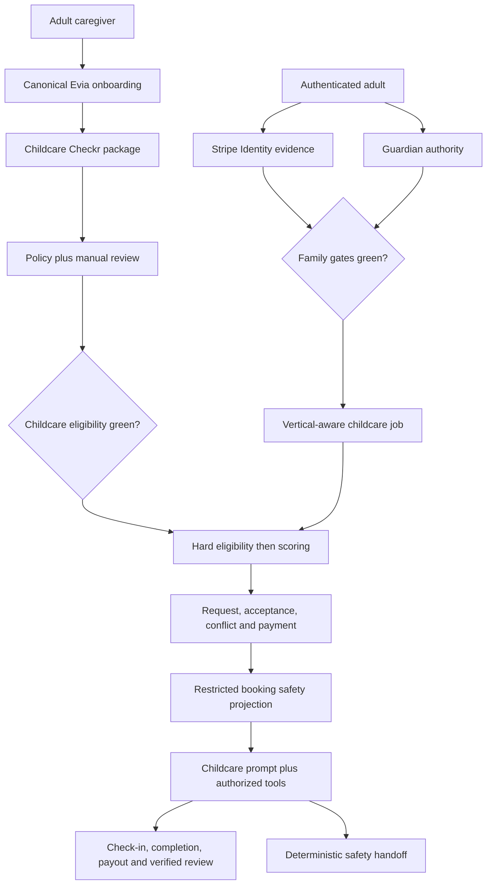

# feat: Add A Verified Childcare Marketplace And Evia Childcare Coordination

## Goal Capsule

| Field | Value |
|---|---|
| Objective | Add an adult-operated childcare marketplace to CareConnecxx that reuses the current caregiver, Checkr, Stripe, matching, booking, payment, and Evia infrastructure while enforcing child-specific identity, screening, privacy, guardian, and safety policy. |
| Product boundary | Parents and guardians use the platform to find, book, pay, and coordinate with individual adult babysitters and nannies. Children never hold accounts or chat directly with Evia. Licensed facilities, preschools, and daycare operations are deferred. |
| Code authority | `fix/memory-wave-hotfixes` at `9f4adf8`. `context/project-overview.md`, `functions/src/data/contract.ts`, and live code outrank older prose. Re-read all referenced seams before implementation because this plan is intentionally not implementation-authorized yet. |
| Trust model | Stripe Identity verifies the adult client; Checkr supplies configured screening reports; CareConnecxx owns role eligibility, manual review, expiry, FCRA workflow, guardian authority, profile visibility, booking authorization, and incident response. No provider result alone means "safe." |
| Execution profile | React/Vite, Firebase Auth, Firestore/Rules/Indexes, Firebase Functions, Checkr, Stripe Identity, Stripe Connect, Stripe payments, Linq SMS/iMessage, and the existing Evia single-agent/tool loop. |
| Stop conditions | Stop before production enablement if launch-state legal review, insurance, screening-package validation, FCRA/adverse-action workflow, guardian authorization, child-data rules, incident escalation, sandbox payment proof, or rollback controls are incomplete. |
| Tail ownership | Implementation owns code, tests, query contracts, indexes/rules, provider sandbox verification, staged deployment, synthetic production smokes, monitoring, rollback proof, and exact Git/Firebase deployment evidence. |

The artifact is technically complete enough to implement, but implementation is not authorized by this planning conversation. The defaults below must be reviewed with the product owner first.

---

## Product Contract

### Summary

CareConnecxx will support `senior` and `child` care verticals in one household marketplace. Shared infrastructure handles adult accounts, caregiver identity, subscriptions, jobs, availability, bookings, payments, reviews, messaging, audit, and support. Child profiles, guardian authority, screening requirements, safety briefings, incident handling, prompt policy, and data visibility remain vertical-specific.

The product is for adults arranging care. A child's data is supplied and controlled by an authenticated parent or guardian. Evia may coordinate childcare with verified adults but never presents herself as a child-facing assistant, investigator, clinician, legal authority, or substitute for emergency services.

### Problem Frame

The current platform is senior-care-specific in its canonical recipient (`senior_profiles`), matching input (`Senior`), prompt builders, tool catalog, job fields, and several appointment consumers. However, it already has the expensive marketplace foundations needed for childcare: canonical caregiver onboarding over Evia SMS, Checkr invitations/webhooks, Stripe Identity for clients, Stripe Connect payouts, jobs, matching, availability, appointment confirmation, payments, reviews, messaging, audit, and admin review.

Adding childcare by renaming senior fields or appending child instructions to the existing prompt would create privacy leaks, incorrect matching, unsafe tool access, and ambiguous screening. The implementation must add an explicit vertical boundary and child-specific canonical contracts while preserving senior-care behavior.

### Actors

- A1. **Verified parent or legal guardian:** Owns or is explicitly authorized for a child profile, creates jobs, selects caregivers, books, pays, and receives communications.
- A2. **Authorized household adult:** May receive updates or assist with scheduling according to scoped permissions but cannot claim guardian, payment, custody, or cancellation authority that was not granted.
- A3. **Childcare provider:** An adult caregiver approved for the childcare vertical, with current required screening and credentials.
- A4. **Multi-vertical caregiver:** An adult approved independently for senior care, childcare, or both; eligibility in one vertical never implies eligibility in another.
- A5. **Trust and Safety reviewer:** Reviews profiles, `consider` results, credentials, incidents, suspensions, disputes, and adverse-action state.
- A6. **Support/admin operator:** Handles operational and payment issues through audited, least-privilege controls.
- A7. **Evia:** Coordinates with verified adults using role-, vertical-, objective-, and evidence-scoped prompts and tools.

### Requirements

#### Vertical And Household Model

- R1. Every recipient, job, match, booking, review, message context, Evia objective, and operational event has an authoritative `careVertical: senior | child`; legacy records without the field resolve to `senior` during compatibility rollout.
- R2. Existing `senior_profiles` remains the canonical senior store. Childcare adds `child_profiles` rather than migrating or overloading senior documents.
- R3. A client household may contain multiple seniors and children. Access is granted per household member and recipient, not inferred from sharing a phone number, last name, payment method, or family group.
- R4. A caregiver may advertise one or both verticals, but public visibility and bookability are computed independently for each vertical.

#### Child Profile And Guardian Authority

- R5. Only authenticated adults may create or control child profiles. The platform does not create child Firebase Auth accounts or permit direct minor-to-Evia conversations.
- R6. Child profiles store the minimum operational data needed for matching and safe care: display name or preferred label, age band, guardian references, care needs, allergies, routines, communication needs, authorized pickup references, emergency contact readiness, and high-level restrictions.
- R7. Exact address, full birth date, custody documents, detailed health information, emergency contacts, and safety notes are never placed in public profiles, matching telemetry, prompts unrelated to the active child, or general-purpose memory.
- R8. Guardian authority is a server-verified state with source, reviewer/attestation, scope, timestamps, and revocation. A household membership or custom claim alone cannot authorize child disclosure, booking, pickup changes, or payment actions.
- R9. Custody/contact restrictions and authorized pickup changes require high-friction confirmation, audit, and immediate invalidation of stale booking projections.

#### Family Identity And Payment Readiness

- R10. A family cannot contact, book, receive an exact care address, or reveal child safety details until the acting adult meets the configured Stripe Identity and platform guardian-authority requirements.
- R11. Stripe Identity status is consumed as identity evidence, not guardian evidence. Failed, canceled, processing, stale, or mismatched identity states fail closed to remediation or human review.
- R12. Payment readiness, subscription entitlement, identity, and guardian authority are separate gates with separate failure messages and audit events.

#### Childcare Provider Screening And Approval

- R13. Childcare providers must be at least 18 and complete the existing canonical caregiver onboarding plus a childcare profile covering age-band experience, childcare skills, rates, availability, references, certifications, transportation, and service limitations.
- R14. Childcare screening uses a separately configured Checkr package and policy. The package is validated for each launch jurisdiction and may include national/county criminal, sex-offender, identity/address trace, watchlist, MVR, fingerprint, state criminal, and child-abuse/neglect registry steps as legally and operationally applicable.
- R15. Checkr `clear`, `consider`, `pending`, `suspended`, `disputed`, canceled, expired, or unavailable states are represented without translating `clear` into a safety guarantee. CareConnecxx makes and audits the eligibility decision.
- R16. Childcare visibility requires current screening, completed profile, required credentials, manual Trust and Safety approval, accepted policies, no active suspension, and jurisdiction eligibility. Expiry immediately removes discovery/contact/bookability until renewed.
- R17. A multi-vertical provider's existing report may satisfy a childcare requirement only when the exact screening components, jurisdiction, subject identity, report age, and policy version are verified. Senior approval alone never grants childcare approval.
- R18. Adverse decisions follow approved FCRA, fair-chance, state/local notice, dispute, waiting, and final-action workflows. The agent, frontend, and webhook may not automatically reject a `consider` result.
- R19. Raw Checkr reports, candidate PII, Stripe identity images, and document files remain in provider-controlled systems or existing restricted storage. Firestore stores provider IDs, derived statuses, component coverage, policy version, timestamps, expiry, and audited decisions only.

#### Marketplace, Matching, And Booking

- R20. Childcare jobs use auto-ID `job_posts` as their canonical store and capture child age bands/count, schedule, location radius, rate, required experience, certifications, allergies/special considerations at a safe abstraction, pets, transportation, recurring/one-time intent, and service exclusions. They do not write the legacy one-document-per-client `job_postings/{clientUid}` mirror.
- R21. Matching first applies hard eligibility: vertical approval, jurisdiction, active screening, guardian/identity/payment gates, distance, availability, age-band support, required credentials, transportation/MVR when requested, and explicit exclusions. Scoring runs only after hard eligibility.
- R22. Match explanations use verified qualifications, availability, rates, experience, reliability, completed booking evidence, and verified reviews. They never infer safety, parenting quality, medical fitness, or suitability from protected attributes or a background-check result alone.
- R23. Public discovery withholds provider contact information and family/child identifying information. Exact address and the minimum care safety briefing become available only after confirmed booking and current authorization.
- R24. A childcare booking is not confirmed until the family request, caregiver acceptance, conflict check, active eligibility recheck, guardian authority, payment authorization, and persisted booking state all succeed.
- R25. One-time and recurring childcare bookings reuse the existing appointment/payment infrastructure through typed vertical-aware adapters. Senior consumers must remain compatible with legacy records and cannot receive child-only fields.
- R26. Check-in, check-out, cancellation, no-show, late arrival, extension, and completion are auditable. Payment capture/payout requires a verified completion state and preserves the existing idempotent Stripe ledger.
- R27. Reviews can be submitted only by participants in a completed platform booking and are labeled by care vertical. Reliability and repeat-booking metrics use verified platform events.

#### Evia Childcare Behavior

- R28. The server selects `careVertical` from authenticated objective/recipient state before prompt or tool selection. The model cannot choose, override, or infer a vertical from untrusted text when authoritative state exists.
- R29. Evia uses a shared core prompt plus a childcare policy/context module. The implementation does not append all childcare instructions and tools to every senior-care turn.
- R30. A childcare prompt receives only the active adult's authority, minimum child projection, objective, unresolved safety inputs, provider eligibility summary, and authorized tools. It receives no raw screening report, identity document, custody document, or unrelated child/senior context.
- R31. Evia never chats directly with a minor, diagnoses, recommends medication, resolves custody disputes, investigates alleged abuse, promises that a provider is safe, or presents a screening result as a guarantee.
- R32. Injury, missing-child, immediate danger, suspected abuse, unsafe pickup, custody conflict, identity mismatch, or serious incident follows deterministic emergency/handoff policy. Model text cannot suppress or complete the escalation.
- R33. Evia verifies current eligibility, caregiver acceptance, payment state, and authoritative booking/postcondition evidence before claiming that care is booked, changed, paid, completed, or communicated.
- R34. Child facts do not enter Zep, learned facts, generic summaries, golden datasets, or long-term conversational memory until a separate child-data memory/privacy contract is approved. Canonical child profiles and booking safety projections remain authoritative.
- R35. Tool selection filters by authenticated role and `careVertical` before intent capability. A childcare turn cannot access senior health, care-plan, family-group, payment-approval, or unrelated household tools.

#### Trust, Privacy, Compliance, And Operations

- R36. Before each state launch, approved counsel/operations records the applicable marketplace, childcare licensing, screening, mandated-reporting, children's privacy/COPPA where applicable, tax/worker-classification, insurance, cancellation, and emergency requirements in a versioned jurisdiction policy.
- R37. Terms, privacy notices, consent, data retention/deletion, incident response, screening disclosures, and family/provider responsibilities are updated before collecting child data.
- R38. New child and screening collections deny client access by default. Product access is added narrowly and tested for owner, authorized adult, assigned caregiver, admin, revoked, expired, cross-household, and cross-vertical cases.
- R39. Every new compound Firestore query is registered in `firestore.query-contracts.json`, passes index coverage, and uses the additive index deployment path.
- R40. Childcare launches behind server-side policy flags by jurisdiction and cohort, with emergency-off, synthetic canaries, incident monitoring, screening-expiry alarms, payment reconciliation, and per-wave rollback.

### Key Flows

- F1. **Parent creates a child profile**
  - **Actors:** A1, A7
  - **Steps:** Authenticate adult; verify identity; establish guardian scope; create minimum child profile; confirm privacy/consent; audit source and version.
  - **Outcome:** A canonical private child profile exists without creating a minor account or general memory entry.
- F2. **Caregiver adds childcare services**
  - **Actors:** A3/A4, A5, A7
  - **Steps:** Select childcare vertical; collect qualifications and limitations through canonical SMS onboarding; validate age; order the configured Checkr package; verify credentials; manually review; project approved public fields.
  - **Outcome:** The caregiver becomes visible/bookable for childcare only after every configured gate is current.
- F3. **Family posts a childcare job and sees matches**
  - **Actors:** A1, A3/A4, A7
  - **Steps:** Select child/children; specify needs and schedule; apply hard eligibility; score eligible providers; expose privacy-safe profiles and evidence-backed explanations.
  - **Outcome:** The family sees only currently eligible providers without child or caregiver contact leakage.
- F4. **Family books and pays**
  - **Actors:** A1, A3/A4, A7
  - **Steps:** Select provider; recheck identity, authority, screening, credentials, availability, and conflict state; authorize payment; obtain caregiver acceptance; persist confirmed booking; release minimum safety briefing.
  - **Outcome:** Both adults receive truthful confirmation and the existing payment ledger owns charge/payout lifecycle.
- F5. **Booking-day coordination**
  - **Actors:** A1/A2, A3/A4, A7
  - **Steps:** Check in; access current safety briefing; coordinate approved updates; handle extension/cancellation; check out; verify completion; capture/pay; request verified reviews.
  - **Outcome:** Operational state, communication, and money movement agree and are auditable.
- F6. **Safety or trust incident**
  - **Actors:** A1-A7 as authorized
  - **Steps:** Detect explicit incident category; preserve minimum evidence; give deterministic emergency direction where applicable; suspend risky access/actions; create high-priority case; notify Trust and Safety; avoid model adjudication.
  - **Outcome:** Human operators own the case and the platform prevents further unsafe matching or disclosure.

### Acceptance Examples

- AE1. A parent verified by Stripe Identity but lacking guardian authority cannot create a booking or view a child's safety details.
- AE2. A child never receives an Auth account, SMS onboarding thread, Evia conversation, payment request, or direct notification.
- AE3. A senior-approved caregiver without the childcare package remains visible for senior care and invisible/unbookable for childcare.
- AE4. A Checkr `consider` webhook places the childcare screening into manual review and cannot trigger automatic rejection or a public badge.
- AE5. An expired childcare screening immediately removes the provider from childcare discovery and blocks a stale booking link while preserving senior eligibility when still valid.
- AE6. A family requesting transportation receives only providers with current required MVR/driver evidence; removing transportation re-runs matching without claiming those providers are safer.
- AE7. A malicious child-profile note cannot change guardian authority, tool access, screening status, prompt policy, or booking approval.
- AE8. A caregiver browsing childcare jobs sees age bands, schedule, approximate area, requirements, and rate but not names, exact address, custody details, allergies, or emergency contacts before confirmation.
- AE9. A confirmed caregiver receives only the current booking's minimum safety briefing; another caregiver and a caregiver from an expired booking cannot read it.
- AE10. "Book the same sitter next Friday" resolves the verified child, caregiver, date, and guardian objective, checks eligibility again, and never reuses a stale screening or payment result.
- AE11. A payment succeeds but the caregiver has not accepted. Evia says payment is authorized/pending and does not say the booking is confirmed.
- AE12. An injury, missing-child report, suspected abuse statement, unsafe pickup request, or custody conflict produces the deterministic escalation/handoff path and never an improvised investigation.
- AE13. A childcare turn cannot call senior health, care-plan, medication, timesheet-approval, or unrelated-household tools.
- AE14. A senior-care turn and its memory context contain no child profile, childcare safety briefing, custody flag, or childcare objective.
- AE15. A completed platform booking permits one verified review from each side; an off-platform or canceled booking cannot generate a verified review.
- AE16. A legacy senior appointment with no `careVertical` continues through existing booking/payment behavior as `senior` after deployment.
- AE17. Every childcare compound query appears in `firestore.query-contracts.json`, and a missing required index blocks deployment before the consuming function enables.
- AE18. A synthetic parent can complete identity-ready child profile -> job -> eligible match -> booking -> caregiver acceptance -> sandbox payment -> completion without production provider effects.

### Scope Boundaries

#### Included In Initial Product

- U.S.-only pilot for individual adult babysitters and nannies.
- One-time and recurring in-home childcare bookings.
- Existing caregiver accounts with independently approved childcare eligibility.
- Parent/guardian identity, child profiles, job posting, matching, booking, payment, reviews, messaging, check-in/out, incident reporting, and Evia coordination.
- Transportation only when the jurisdiction policy and MVR/insurance gates are configured and enabled.

#### Deferred For Later

- Daycare centers, preschools, camps, agencies, family childcare businesses, and facility licensing/inspection workflows.
- Minor caregiver accounts.
- Child-facing Evia, child messaging, educational tutoring, or social features.
- Overnight care, medication administration, unsupervised transportation, infant care, or specialized-needs categories until each has an approved credential/policy package. A reviewed pilot may enable a category explicitly; none is enabled by implication.
- Payroll, household-employer tax filing, W-2/Schedule H automation, benefits, or worker-classification determinations.
- International screening, currencies, identity, licensing, and payouts.
- Storing child facts in long-term AI memory or using child data for model training.

### Review Defaults

These are recommended plan defaults, not implementation authorization:

1. Launch individual adult providers only; exclude facilities and agencies.
2. Pilot in one or two legally reviewed states before nationwide availability.
3. Keep childcare screening separate from current senior approval and require annual renewal plus manual profile review.
4. Add `child_profiles` and vertical-aware adapters; do not migrate `senior_profiles` or create a second payment system.
5. Keep direct minor accounts/chat and child-data AI memory prohibited.
6. Disable overnight, medication, unsupervised transport, infant, and specialized-needs categories until each policy package is approved.

---

## Planning Contract

### Key Technical Decisions

- KTD1. **Add an explicit vertical boundary instead of cloning the application.** Shared adult-account and marketplace services accept a typed `CareVertical`; child recipient, guardian, screening, safety, and prompt contracts remain separate.
- KTD2. **Preserve `senior_profiles`; add `child_profiles`.** The current senior store has many live consumers and legacy fallbacks. A new canonical child repository avoids a high-risk migration and permits child-specific rules and retention.
- KTD3. **Extend jobs and appointments through compatibility adapters.** New records carry `careVertical` and typed recipient references. Legacy missing values resolve to `senior`. Child safety details live in a restricted booking-safety record, not the broadly consumed appointment document.
- KTD4. **Model screening capabilities, not one boolean.** `caregivers/{uid}/screenings/{vertical}` records report/package/policy/component coverage, status, expiry, review, and adverse-action state. Public profiles receive only derived badges/status dates. The existing `backgroundCheckData` remains supported during migration.
- KTD5. **Use Checkr as evidence and CareConnecxx as adjudicator.** Provider statuses never directly write public approval. Webhooks update evidence idempotently; a policy service computes eligibility; `consider` and exceptions enter manual review.
- KTD6. **Separate identity, guardian authority, entitlement, and payment gates.** Stripe Identity verifies the adult. A platform authority record verifies who may act for each child. Neither substitutes for the other.
- KTD7. **Reuse the existing appointment and Stripe ledger after a vertical-aware audit.** Child bookings use the current request/accept/conflict/charge/payout lifecycle, with a compatibility layer that prevents senior consumers from assuming `seniorId` or reading child-only details.
- KTD8. **Filter tools by authority and vertical before intent.** Add vertical metadata beside the current capability map. The selector first removes unauthorized/cross-vertical tools, then applies booking/scheduling/billing/messaging intent filtering.
- KTD9. **Change prompts through composable childcare modules.** Add a child policy/context augmenter and child situation projection to the existing prompt assembly. Do not create one oversized universal prompt or rely on prompt text for authorization.
- KTD10. **Keep child facts out of general AI memory.** Child profiles and active booking safety projections are canonical. Prompt construction may use an ephemeral minimum projection, but Zep/learned-fact ingestion and generic summaries reject child data until separately approved.
- KTD11. **Release safety details only after confirmed booking.** Public jobs use approximate area and high-level requirements. An assigned, currently eligible caregiver receives a server-generated, time-bounded safety projection; revocation invalidates it.
- KTD12. **Use jurisdiction policy as code and release configuration.** Each enabled state/version declares categories, screening components, credential requirements, renewal, transport rules, mandatory notices, escalation contacts, and rollout status. Unknown jurisdictions fail closed.
- KTD13. **Use `job_posts`, not the legacy singleton job mirror.** `job_postings/{clientUid}` can represent only one client job and exists for compatibility. New childcare jobs use auto-ID `job_posts` with `careVertical`, household, and recipient references so multiple children and concurrent jobs cannot overwrite one another.
- KTD14. **Make Cloud Functions the childcare matching authority.** `services/server/matchingEngine.ts` explicitly describes itself as a simulated server while importing frontend Firebase services. Childcare matching runs in `functions/src/aiMatching.ts`/typed backend modules and returns a sanitized projection through an authenticated callable; frontend code never loads the full candidate set to enforce security.
- KTD15. **Use authenticated callables for child-sensitive mutations.** Child profile/authority, childcare jobs, matching, booking, safety projection, review, and incident writes run server-side. `services/api.ts` becomes a typed callable client for these operations rather than directly writing sensitive collections.

### High-Level Technical Design

### Data Contracts

#### `child_profiles/{childId}`

- `householdId`, `guardianUserIds`, `authorizedAdultRefs`, preferred display name, age band, care categories, broad matching requirements, created/updated/version timestamps, status, and retention policy version.
- Restricted references to private operational data; no public read and no minor Auth UID.
- Canonical repository owns household/guardian checks and minimum prompt/match projections.

#### `child_profiles/{childId}/private/safety`

- Allergies, emergency readiness, authorized pickup references, custody/contact restrictions, routines, and other approved minimum safety fields.
- Owner/authorized guardian access only through narrow server projections where possible; no discovery queries.

#### `caregivers/{uid}/screenings/{vertical}`

- Provider/candidate/report references, package and jurisdiction policy version, component coverage, status, result, submitted/completed/expiry timestamps, manual review status, reviewer/audit reference, dispute/adverse-action state, and suspension reason code.
- No raw report content, SSN, document image, or narrative criminal record.

#### Existing Shared Records

- `users/{uid}` gains only vertical enrollment/guardian readiness summaries; sensitive authority details use server-only records.
- `caregivers/{uid}` and `publicCaregiverProfiles/{uid}` gain `careVerticals`, childcare profile fields, and derived per-vertical eligibility/public badges.
- `job_posts`, `appointments`, `booking_requests`, `shift_offers`, `reviews`, `payments`, and audit/agent records gain `careVertical` and typed recipient references where applicable. Legacy absent values resolve to `senior`. `job_postings/{clientUid}` remains a senior compatibility mirror and receives no childcare writer.
- `childcare_booking_safety/{bookingId}` stores the minimum immutable booking-time safety projection and current-access version for assigned participants.
- `guardian_authorities/{authorityId}` stores adult-child scope, source/attestation/review, status, effective/revoked timestamps, and policy version.
- `jurisdiction_care_policies/{state}` is server-only and versioned; production enablement requires an approved active version.

### Sequencing

1. Policy/legal and data authority before collecting child data.
2. Child profile, guardian authorization, rules, and audit before frontend creation.
3. Screening evidence and manual approval before caregiver childcare enrollment.
4. Hard eligibility before matching/scoring.
5. Booking/payment compatibility before Evia mutating tools.
6. Prompt/tool changes after server authorization exists.
7. Trust operations, synthetic E2E, pilot cohort, then state-by-state expansion.

### Risks And Mitigations

| Risk | Severity | Mitigation |
|---|---|---|
| Child data leaks through senior prompts, memory, search, logs, or tools | Critical | Explicit vertical, minimum projections, memory prohibition, source-scan tests, cross-household/cross-vertical adversarial tests, server-only rules. |
| Checkr `clear` is presented as a safety guarantee | Critical | Evidence/status language, manual approval, public copy review, prompt/tool constraints, no automatic public approval webhook. |
| State requirements differ or licensed-care rules are misapplied | Critical | One/two-state pilot, versioned jurisdiction policy, counsel approval, unknown-state fail closed. |
| Existing senior booking/payment behavior regresses | Critical | Legacy defaults to senior, adapter characterization, shared-ledger audit, per-vertical tests, staged flags. |
| Guardian identity is inferred incorrectly | Critical | Separate authority records, high-friction changes, revocation checks, no phone/name inference. |
| Caregiver sees child safety data too early or too long | Critical | Confirmed-booking gate, time-bounded server projection, revocation/version checks, access audit and cleanup. |
| `consider` or dispute causes unlawful automated rejection | Critical | Manual adjudication, FCRA state machine, notice/dispute tests, admin workflow. |
| Childcare tools appear in senior or unauthorized turns | High | Authority/vertical filtering before intent, parity/source-scan tests, action-time enforcement. |
| Marketplace classification or household tax handling is misstated | High | Terms and product copy avoid classification promises; legal review; payroll/tax automation deferred. |
| Incident handling relies on model judgment | Critical | Deterministic classifier/policy triggers, human case ownership, emergency-off, drills and canaries. |

---

## Implementation Units

### U0. Jurisdiction, Trust, And Release Contract

- **Goal:** Define what may legally and operationally launch before code can collect child data or approve providers.
- **Requirements:** R14-R19, R36-R40.
- **Files:** `functions/src/childcare/jurisdictionPolicy.ts` (create), `functions/src/childcare/jurisdictionPolicy.test.ts` (create), `functions/src/config/featureFlags.ts`, `functions/src/data/contract.ts`, `components/LegalDocs.tsx`, `components/pages/PrivacyPolicyPage.tsx`, `docs/runbooks/childcare-launch.md` (create), `docs/policies/childcare-jurisdictions.md` (create).
- **Patterns:** Existing server feature flags, Checkr/MVR package configuration, admin audit, and rollout runbooks.
- **Approach:** Encode a versioned server-only policy for enabled states, service categories, screening components, credentials, renewal, transport, notices, incident contacts, and rollout mode. Update terms/privacy before collection. Record insurance and legal approval as release evidence, not booleans editable by clients.
- **Test Scenarios:** Unknown/disabled state; expired policy; category disabled; transport without MVR policy; missing screening component; policy version change; client attempts policy mutation; emergency-off; legal/privacy version not accepted.
- **Exit:** At least one pilot jurisdiction has approved policy evidence and every unapproved combination fails closed.

### U1. Child Profile, Guardian Authority, And Data Isolation

- **Goal:** Add canonical child data and adult authority without disturbing senior profiles or creating minor accounts.
- **Requirements:** R1-R9, R37-R39.
- **Files:** `types.ts`, `functions/src/data/contract.ts`, `functions/src/data/childProfileRepository.ts` (create), `functions/src/data/childProfileRepository.test.ts` (create), `functions/src/childcare/guardianAuthority.ts` (create), `functions/src/childcare/guardianAuthority.test.ts` (create), `functions/src/childcare/childProfileCallables.ts` (create), `functions/src/childcare/childProfileCallables.test.ts` (create), `services/api.ts`, `firestore.rules`, `firestore.indexes.json`, `firestore.query-contracts.json`, `tests/firestoreRules.childcare.test.ts` (create), `tests/firestoreIndexCoverage.test.ts`.
- **Patterns:** `functions/src/data/seniorProfileRepository.ts`, household-member rules, canonical data contract, additive index workflow.
- **Approach:** Add `CareVertical`, `ChildProfile`, `GuardianAuthority`, and privacy-safe projections. Keep private safety data separate. Route creation and authority-sensitive mutations through authenticated callables, stamp policy/source/version, and default legacy shared records to senior only at adapter boundaries.
- **Test Scenarios:** Parent create/read/update; authorized adult limited scope; revoked authority; cross-household access; guessed child ID; caregiver before/after assignment; custody/pickup change invalidates projection; no child Auth UID; legacy senior behavior; query-contract coverage.
- **Exit:** Child data is canonical, minimum, isolated, auditable, and inaccessible without current adult authority.

### U2. Family Childcare Onboarding And Stripe Identity Gate

- **Goal:** Let an adult create a childcare household/profile only after the correct identity, consent, and authority steps.
- **Requirements:** R5-R12, R20.
- **Files:** `components/auth/onboarding/OnboardingFlow.tsx`, `components/client/IdentityGateModal.tsx`, `components/client/IdentityCallback.tsx`, `components/client/childcare/ChildProfileFlow.tsx` (create), `components/client/childcare/ChildProfileFlow.test.tsx` (create), `services/stripeService.ts`, `services/api.ts`, `functions/src/stripe.ts`, `functions/src/stripeIdentity.childcare.test.ts` (create), `functions/src/childcare/guardianAuthority.ts`, `functions/src/childcare/childProfileCallables.ts`.
- **Patterns:** Existing `v1-createIdentityVerificationSession`, Stripe Identity webhook mirroring, client onboarding gates, multi-senior household model.
- **Approach:** Add adult-facing childcare enrollment and child-profile creation. Reuse Stripe Identity status; add separate guardian attestation/review. Redirect callback to the pending childcare objective without trusting URL parameters for authority. Keep child safety details out of Stripe metadata.
- **Test Scenarios:** Verified/unverified/processing/requires-input identity; callback replay; wrong user/session; identity verified but guardian absent; multiple children; invited adult; revoked guardian; consent version change; no child PII in metadata/logs.
- **Exit:** A verified authorized adult can create and manage child profiles; every other actor receives truthful remediation without partial disclosure.

### U3. Childcare Provider Profile, Checkr Screening, And Manual Review

- **Goal:** Approve caregivers independently for childcare using current, jurisdiction-complete evidence and human review.
- **Requirements:** R4, R13-R19, R36-R40.
- **Files:** `types.ts`, `functions/src/checkr.ts`, `functions/src/checkrApi.ts`, `functions/src/mvrConfig.ts`, `functions/src/childcare/screeningPolicy.ts` (create), `functions/src/childcare/screeningPolicy.test.ts` (create), `functions/src/utils/caregiverEligibility.ts`, `utils/caregiverEligibility.ts`, `functions/src/caregiverPrivate.ts`, `functions/src/caregiverPublicProjection.ts`, `functions/src/agents/onboardingConversation.ts`, `functions/src/agents/caregiverProfileHandler.ts`, `functions/src/agents/caregiverProfileHandler.test.ts`, `functions/src/admin/requireAdmin.ts`, `components/admin/CaregiverVerificationDashboard.tsx`, `components/admin/CaregiverVerificationDashboard.childcare.test.tsx` (create), `components/caregiver/CaregiverOnboardingDashboard.tsx`, `components/caregiver/CaregiverOnboardingDashboard.childcare.test.tsx` (create), `functions/src/checkrApi.test.ts`, `functions/src/checkrBadNewsNotify.test.ts`, `firestore.rules`.
- **Patterns:** Existing Checkr invitation/webhook idempotency, MVR package assertions, private background subcollection, public caregiver projection, canonical SMS onboarding, pre-adverse-action states.
- **Approach:** Add childcare service/profile capture to Evia onboarding; create vertical screening records; configure `CHECKR_PACKAGE_CHILDCARE` and optional transport package; map webhook evidence by report/package; compute eligibility from policy; require manual review; schedule expiry/renewal; keep raw reports provider-side and candidate self-report tools caregiver-only.
- **Test Scenarios:** New/dual-vertical provider; wrong package; component missing; report clear/consider/pending/suspended/disputed/canceled; duplicate/out-of-order webhook; identity mismatch; expiry; renewal; MVR required/optional; manual approval/revocation; adverse-action notice/dispute; senior eligibility unaffected.
- **Exit:** Only current, manually approved, jurisdiction-eligible providers appear or book in childcare, with no automated adverse decision.

### U4. Childcare Jobs, Discovery, And Matching

- **Goal:** Produce privacy-safe childcare jobs and evidence-backed matches after hard eligibility.
- **Requirements:** R20-R23, R27, R39-R40.
- **Files:** `types.ts`, `components/client/postJob/types.ts`, `components/client/postJob/PostJobFlow.tsx`, `components/client/postJob/ChildcareRequirementsStep.tsx` (create), `components/client/postJob/ChildcareRequirementsStep.test.tsx` (create), `services/api.ts`, `services/matchService.ts`, `services/server/matchingEngine.ts`, `functions/src/ai/scoring.ts`, `functions/src/aiMatching.ts`, `functions/src/ai/matchJob.ts`, `functions/src/agents/matchingAgent.ts`, `functions/src/childcare/jobCallables.ts` (create), `functions/src/childcare/jobCallables.test.ts` (create), `functions/src/childcare/matchingEligibility.ts` (create), `functions/src/childcare/matchingEligibility.test.ts` (create), `functions/src/ai/__tests__/scoring.childcare.test.ts` (create), `tests/matchingStackWired.test.ts`, `firestore.query-contracts.json`, `firestore.indexes.json`, `firestore.rules`.
- **Patterns:** `buildAndSaveJobPost`, canonical caregiver bookability post-filter, public projection, distance/availability scoring, matching-stack wiring test.
- **Approach:** Add vertical-aware job schemas and a childcare requirements projection. Write new childcare jobs only to auto-ID `job_posts` through authenticated callables. Run deterministic eligibility and backend-only candidate retrieval before scoring, return only sanitized matches, and keep `services/server/matchingEngine.ts` out of the security boundary. Extend public profiles with verified childcare attributes and age-band experience. Keep names, exact addresses, allergies, custody, and emergency details out of jobs and scoring telemetry.
- **Test Scenarios:** Multiple children/age bands; required CPR; infant/specialized category disabled; transport with/without MVR; expired screening; distance/availability conflict; excluded service; dual vertical; no eligible result; ranking explanation; protected field exclusion; legacy senior matching unchanged.
- **Exit:** Verified families receive only eligible, privacy-safe childcare matches and existing senior matching remains behaviorally equivalent.

### U5. Booking, Safety Projection, Completion, And Payments

- **Goal:** Reuse the mature appointment/payment ledger while making childcare confirmation and safety access explicit.
- **Requirements:** R23-R27, R39-R40.
- **Files:** `types.ts`, `components/client/booking/BookingFlow.tsx`, `components/caregiver/CaregiverBookingsPage.tsx`, `services/api.ts`, `services/availabilityService.ts`, `functions/src/agents/bookingExecutor.ts`, `functions/src/agents/shiftOffer.ts`, `functions/src/agents/__tests__/shiftOffer.test.ts`, `functions/src/appointmentCompletion.ts`, `functions/src/stripe.ts`, `functions/src/stripeConnectWebhook.ts`, `functions/src/childcare/bookingCallables.ts` (create), `functions/src/childcare/bookingCallables.test.ts` (create), `functions/src/childcare/bookingPolicy.ts` (create), `functions/src/childcare/bookingPolicy.test.ts` (create), `functions/src/childcare/safetyProjection.ts` (create), `functions/src/childcare/safetyProjection.test.ts` (create), `functions/src/mcp/__tests__/booking.test.ts`, `firestore.rules`, `firestore.query-contracts.json`, `firestore.indexes.json`.
- **Patterns:** Existing caregiver acceptance before confirmation, conflict checks, payment-method retry, shift payment idempotency, appointment completion, action evidence.
- **Approach:** Add typed vertical adapters, authenticated booking callables, and a server-only booking safety projection. Recheck all family/provider gates transactionally at request and acceptance. Release safety data only to current participants. Reuse Stripe charge/transfer generation and appointment ID, with vertical metadata and no child PII in Stripe metadata. No childcare booking or safety write is performed directly by the browser.
- **Test Scenarios:** Acceptance before/after screening expiry; conflict; duplicate booking/retry; payment success before acceptance; payment failure/retry; recurring series; cancellation; late/no-show; safety projection access/revocation/expiry; caregiver substitution; check-in/out; completion/payout; legacy senior appointment.
- **Exit:** Childcare booking, completion, and payment state agree under retries, and safety data is visible only to current authorized participants.

### U6. Evia Childcare Prompts, Context, Tools, And Memory Boundary

- **Goal:** Let Evia coordinate childcare accurately without contaminating senior context, exposing minors, or relying on prompts for security.
- **Requirements:** R28-R35, R40.
- **Files:** `functions/src/agents/qaAgent.ts`, `functions/src/agents/qaAgent.test.ts`, `functions/src/agents/promptAugmenters.ts`, `functions/src/agents/childcarePromptAugmenter.ts` (create), `functions/src/agents/childcarePromptAugmenter.test.ts` (create), `functions/src/agents/childcareSituation.ts` (create), `functions/src/agents/childcareSituation.test.ts` (create), `functions/src/agents/toolCapabilities.ts`, `functions/src/agents/toolCapabilities.test.ts`, `functions/src/agents/promptContext.ts`, `functions/src/mcp/server.ts`, `functions/src/mcp/__tests__/childcare.test.ts` (create), `functions/src/mcp/__tests__/parity.test.ts`, `functions/src/memory/learnedFacts.ts`, `functions/src/memory/zepClient.ts`, `functions/src/agents/goldenTranscripts.test.ts`.
- **Patterns:** Existing client/caregiver prompt builders, composable augmenters, capability filtering, prompt sanitization, role-enforced MCP tools, evidence/postcondition claims, memory reconciliation.
- **Approach:** Resolve vertical before `runQaAgent`; build an ephemeral child situation from canonical repositories; append a concise child policy/context module only on childcare objectives; filter tool metadata by role/vertical before intent; add narrow child profile/job/match/booking/safety/incident tools with action-time authorization; reject child data from memory ingestion and generic summaries.
- **Test Scenarios:** Parent vs authorized adult vs caregiver; direct minor message; ambiguous senior/child request; malicious profile instructions; cross-child/cross-household reference; custody/pickup change; missing allergy answer; screening expired mid-objective; false-safe wording; booking/payment claim without evidence; emergency categories; tool isolation; Zep/learned-fact rejection; web/Linq parity.
- **Exit:** Evia completes approved childcare flows with truthful evidence, no unauthorized tools or data, and zero child-memory persistence.

### U7. Childcare Product Surfaces And Adult Messaging

- **Goal:** Give families and providers complete childcare workflows without presenting the product to children.
- **Requirements:** R5-R13, R20-R27, R31-R33.
- **Files:** `App.tsx`, `components/client/ClientNavigation.tsx`, `components/client/ClientDashboard.tsx`, `components/client/childcare/ChildcareDashboard.tsx` (create), `components/client/childcare/ChildcareDashboard.test.tsx` (create), `components/client/childcare/ChildProfileCard.tsx` (create), `components/client/childcare/ChildProfileCard.test.tsx` (create), `components/client/childcare/ChildcareMatches.tsx` (create), `components/client/childcare/ChildcareMatches.test.tsx` (create), `components/client/childcare/ChildcareBookingDetails.tsx` (create), `components/client/childcare/ChildcareBookingDetails.test.tsx` (create), `components/caregiver/CaregiverAccountSettings.tsx`, `components/caregiver/CaregiverAccountSettings.childcare.test.tsx` (create), `components/caregiver/JobBoard.tsx`, `components/caregiver/JobBoard.childcare.test.tsx` (create), `components/caregiver/CaregiverBookingsPage.tsx`, `components/caregiver/CaregiverBookingsPage.childcare.test.tsx` (create), `components/shared/CaregiverVerificationBadges.tsx`, `components/shared/CaregiverVerificationBadges.childcare.test.tsx` (create).
- **Patterns:** Existing client/caregiver work surfaces, vertical navigation, booking flow, profile badges, account settings, responsive operational UI.
- **Approach:** Add an adult-facing care-vertical switch and childcare views. Show precise states: identity needed, guardian review, screening pending, manually approved, expiring, unavailable, requested, accepted, confirmed, completed, or incident hold. Avoid "safe"/"passed" guarantees. Hide exact addresses and safety details until authorization permits them.
- **Test Scenarios:** Mobile/desktop; multiple recipients/verticals; empty/no-match states; pending/expired screening; guardian remediation; booking progression; restricted details; revoked session; no child-facing copy/account routes; accessible labels; long names and translations.
- **Exit:** Both sides can complete the declared childcare flows with accurate trust status and no hidden web-only or SMS-only dead end.

### U8. Incident Operations, Evaluation, Rollout, And Production Proof

- **Goal:** Prove the childcare marketplace is safe, operable, and reversible before public expansion.
- **Requirements:** R27, R31-R40 and AE1-AE18.
- **Files:** `functions/src/childcare/incidentPolicy.ts` (create), `functions/src/childcare/incidentPolicy.test.ts` (create), `functions/src/childcare/childcareCanaryWatch.ts` (create), `functions/src/childcare/childcareCanaryWatch.test.ts` (create), `functions/src/config/featureFlags.ts`, `functions/src/index.ts`, `functions/src/evals/testCases.ts`, `functions/src/evals/runner.ts`, `functions/src/agents/goldenTranscripts.test.ts`, `components/admin/AdminCaraControlRoom.tsx`, `firestore.rules`, `firestore.indexes.json`, `firestore.query-contracts.json`, `firebase.json`, `scripts/deploy.mjs`, `docs/runbooks/childcare-launch.md`.
- **Patterns:** Existing output/grounding guards, human handoff, admin alerts, canary watchers, static eval accounting, rollout flags, additive index deploy, exact function update-time/SHA proof.
- **Approach:** Add deterministic incident categories and audited cases; restrict evidence; suspend access when policy requires; create synthetic childcare trajectory evals; monitor funnel, screening expiry, access denials, incidents, booking/payment reconciliation, and prompt/tool violations; roll out by state and cohort with emergency-off and observation windows.
- **Test Scenarios:** Injury, missing child, suspected abuse, unsafe pickup, custody dispute, provider/family report, false report correction, duplicate incident, after-hours escalation, admin access, retention/deletion, provider outage, rollback, synthetic E2E, red critical metric blocks advancement.
- **Exit:** The pilot cohort completes end to end within thresholds, incident drills pass, no critical privacy/safety/payment signal is red, and rollback is proven.

---

## Verification Contract

### Local Gates

| Gate | Command | Required result |
|---|---|---|
| Child data/authority | `npm.cmd test -- --run functions/src/data/childProfileRepository.test.ts functions/src/childcare/guardianAuthority.test.ts functions/src/childcare/childProfileCallables.test.ts tests/firestoreRules.childcare.test.ts` | Owner, guardian, assigned-provider, revoked, cross-household, and private-data cases pass. |
| Screening | `npm.cmd test -- --run functions/src/checkrApi.test.ts functions/src/checkrBadNewsNotify.test.ts functions/src/childcare/screeningPolicy.test.ts functions/src/utils/__tests__/caregiverEligibility.test.ts` | Package/component, webhook, expiry, manual review, and adverse-action behavior pass. |
| Matching | `npm.cmd test -- --run functions/src/childcare/jobCallables.test.ts functions/src/childcare/matchingEligibility.test.ts tests/matchingStackWired.test.ts functions/src/ai/__tests__/scoring.childcare.test.ts` | Hard eligibility and backend-only candidate retrieval precede scoring; no protected/private field enters ranking. |
| Booking/payment | `npm.cmd test -- --run functions/src/childcare/bookingCallables.test.ts functions/src/childcare/bookingPolicy.test.ts functions/src/childcare/safetyProjection.test.ts functions/src/agents/__tests__/bookingExecutor.eligibility.test.ts functions/src/mcp/__tests__/booking.test.ts functions/src/appointmentCompletion.test.ts functions/src/stripeConnectWebhook.test.ts` | Confirmation, retries, access, completion, charge, and payout remain consistent. |
| Evia | `npm.cmd test -- --run functions/src/agents/childcarePromptAugmenter.test.ts functions/src/agents/childcareSituation.test.ts functions/src/agents/toolCapabilities.test.ts functions/src/mcp/__tests__/childcare.test.ts functions/src/mcp/__tests__/parity.test.ts functions/src/agents/qaAgent.test.ts functions/src/agents/goldenTranscripts.test.ts` | Prompt/context isolation, role/vertical tools, memory prohibition, truthfulness, and emergencies pass. |
| UI | `npm.cmd test -- --run components/client/childcare/ChildcareDashboard.test.tsx components/client/childcare/ChildProfileCard.test.tsx components/client/childcare/ChildcareMatches.test.tsx components/client/childcare/ChildcareBookingDetails.test.tsx components/caregiver/CaregiverAccountSettings.childcare.test.tsx components/caregiver/JobBoard.childcare.test.tsx components/caregiver/CaregiverBookingsPage.childcare.test.tsx components/shared/CaregiverVerificationBadges.childcare.test.tsx` | Adult family/provider workflows and privacy states pass. |
| Query/index contract | `npm.cmd run audit:indexes` | Every active compound query is registered and covered; stale/missing indexes fail. |
| Broad suite 1 | `npm.cmd test -- --run --shard=1/2 --pool=forks --no-file-parallelism` | First shard passes. |
| Broad suite 2 | `npm.cmd test -- --run --shard=2/2 --pool=forks --no-file-parallelism` | Second shard passes. |
| Build | `npm.cmd run typecheck; npm.cmd run build; npm.cmd --prefix functions run build` | Root semantic checks/build and Functions transpile complete without generated drift. |
| Static eval | `npm.cmd run eval` | Evaluated and skipped counts are explicit; skipped agent cases cannot approve rollout. |

### Provider Sandbox Gate

- Use Checkr test candidates/packages, Stripe Identity test sessions, Stripe Connect sandbox/test accounts, synthetic adults/children, and non-production Firebase.
- A hard guard refuses production Checkr, Stripe, Linq, and Firebase write-capable trajectory execution.
- Test `clear`, `consider`, pending, exception, dispute, expired, duplicate, and out-of-order Checkr events.
- Test identity verified, processing, requires-input, canceled, wrong-user, and replayed Stripe Identity events.
- Test payment authorization, caregiver acceptance ordering, charge success/failure, transfer, retry, refund/cancellation, and idempotent replay.

### Release Gates

| Capability | Enable threshold | Hold or rollback signal |
|---|---|---|
| Child privacy/authority | 100% deterministic and adversarial isolation cases | Any unauthorized child, custody, pickup, address, or safety-detail disclosure. |
| Provider eligibility | 100% unbookable status/package/expiry cases blocked | Any unapproved, expired, wrong-package, or wrong-jurisdiction provider displayed/contacted/booked. |
| Evia safety | Zero direct-minor, unsafe-guarantee, cross-vertical tool, unsupported booking/payment, or emergency-policy violations | Any prohibited response/action or child fact in memory/telemetry. |
| Marketplace completion | At least 95% synthetic identity-ready profile -> job -> match -> booking -> acceptance -> sandbox payment -> completion trajectories | Silent dead end, duplicate booking/charge/message, or false confirmation. |
| Payments | 100% ledger reconciliation in deterministic replay and sandbox cases | Charge/payout mismatch, duplicate transfer, child PII in provider metadata, or unresolved payment state. |
| Operations | Incident drill, expiry removal, emergency-off, and rollback meet documented SLA | Missed critical incident, stale provider remains bookable, or rollback fails. |

### Deployment Gate

1. Record clean local branch/SHA, remote branch/SHA, `origin/main` SHA, and reviewed jurisdiction-policy version.
2. Confirm current senior marketplace smokes are green before enabling any childcare flag.
3. Run targeted, broad, build, static eval, and provider sandbox gates.
4. Run `npm.cmd run audit:indexes`, deploy additive indexes, and wait for `READY`; deploy rules before child data collection.
5. Deploy required Functions with childcare flags off; verify environment/secret bindings and exact update times/source SHA.
6. Deploy Hosting because the feature adds frontend surfaces; verify both domains serve the expected bundle.
7. Enable one synthetic/admin cohort in one approved state, then a small invited pilot; never enable nationwide by default.
8. Run the production smoke matrix with isolated records and documented safe cleanup.
9. Advance only after the observation window is green; emergency-off or rollback on any critical signal.

### Production Smoke Matrix

| Smoke | Expected proof |
|---|---|
| Adult/child boundary | No child account or direct Evia channel is created. |
| Guardian boundary | Verified non-guardian cannot access or book; authorized guardian can. |
| Screening boundary | Senior-only and expired providers remain unavailable for childcare. |
| Matching privacy | Job/match exposes no child name, exact address, custody, allergy, or emergency details. |
| Booking truth | Request stays pending until caregiver accepts and payment/eligibility checks are green. |
| Safety projection | Assigned caregiver receives the minimum current briefing; unrelated/revoked actors are denied. |
| Evia isolation | Childcare tools/context appear only in the childcare objective; no child fact enters memory. |
| Payment | One charge/ledger/transfer path under retry with no child PII in Stripe metadata. |
| Incident | Synthetic serious incident creates one restricted case, deterministic direction, and operator alert. |
| Rollback | Emergency-off removes childcare discovery/actions without changing senior marketplace behavior. |

### Monitoring

- Family identity and guardian gate outcomes by reason, without child content.
- Child profile/job/booking funnel counts by policy version and jurisdiction.
- Screening invitation/report/manual-review/expiry/adverse-action states and stale-provider alarms.
- Eligible candidates, zero-match reasons, booking request/accept/confirm/cancel/complete, duplicate rejects, and latency.
- Safety projection grants/denials/revocations and unauthorized-access alerts.
- Check-in/out, incidents by severity/category, escalation SLA, operator acknowledgement, and repeat reports.
- Charge/payment/payout/refund reconciliation and idempotency conflicts.
- Evia vertical resolution, child tool selection, unsupported claim, emergency handoff, cross-vertical denial, and memory-rejection metrics.
- Privacy assertion: no raw child profile, safety note, custody information, exact address, Checkr report, identity image, or conversation content in telemetry.

---

## Definition of Done

- The product owner reviews and explicitly approves or revises all six Review Defaults before implementation authorization.
- At least one pilot jurisdiction has approved legal, screening, insurance, privacy, incident, and worker/tax positioning evidence.
- `child_profiles`, guardian authority, private safety data, vertical screening, and booking safety projections have canonical owners, retention, rules, indexes, audit, and deletion/revocation behavior.
- No child Auth account, direct minor chat, child-facing Evia experience, or child-data long-term AI memory exists.
- Family identity, guardian authority, subscription/payment readiness, and provider eligibility remain distinct server-enforced gates.
- Childcare approval requires the configured report components, current expiry, manual review, credentials, jurisdiction policy, and no active hold; `clear` is never presented as a safety guarantee.
- `consider`, dispute, exception, and adverse-action states follow the approved human/legal workflow.
- Jobs and matching reveal only privacy-safe data and apply hard eligibility before scoring.
- Childcare bookings require current authority, eligibility, conflict, acceptance, and payment proof; retries create no duplicate effect.
- Safety details are released only through minimum, versioned, time-bounded projections to current participants.
- Evia receives a modular childcare policy/context and role/vertical tool pack only for an authoritative childcare objective; authorization remains enforced in code and rules.
- Every serious incident category has deterministic immediate policy, restricted case creation, human ownership, monitoring, and rollback behavior.
- Legacy senior records and all declared senior marketplace flows remain green after vertical adapters deploy.
- Targeted tests, both broad shards, root typecheck/build, Functions build, static eval, query/index audit, sandbox trajectories, and production smokes pass.
- Required additive indexes are `READY`, rules are deployed before child collection, Functions/Hosting match the approved SHA, and exact live proof is recorded.
- Pilot observation windows remain within every release threshold; any critical privacy, safety, eligibility, incident, or payment signal holds or rolls back launch.
- Experimental/dead-end implementation code and test data are removed before completion; deferred categories remain impossible to enable accidentally.

---

## Appendix

### Research And Existing Patterns

- CareConnecxx product and launch contracts: `context/project-overview.md`.
- Canonical collection ownership: `functions/src/data/contract.ts`.
- Current provider bookability: `functions/src/utils/caregiverEligibility.ts` and `utils/caregiverEligibility.ts`.
- Current Checkr lifecycle: `functions/src/checkr.ts`, `functions/src/checkrApi.ts`, and `functions/src/mvrConfig.ts`.
- Current Stripe Identity: `services/stripeService.ts`, `functions/src/stripe.ts`, and `components/client/IdentityCallback.tsx`.
- Current booking/payment behavior: `functions/src/agents/bookingExecutor.ts`, `functions/src/stripe.ts`, and `functions/src/stripeConnectWebhook.ts`.
- Current prompt/tool seams: `functions/src/agents/qaAgent.ts`, `functions/src/agents/promptAugmenters.ts`, and `functions/src/agents/toolCapabilities.ts`.
- UrbanSitter Trust and Safety, annual screening/manual review and adult marketplace patterns: https://www.urbansitter.com/trust/
- Checkr marketplace verification and API/adverse-action behavior: https://checkr.com/use-cases/gig-marketplace and https://docs.checkr.com/
- Stripe Identity verification checks and Connect identity boundary: https://docs.stripe.com/identity/verification-checks and https://docs.stripe.com/connect/identity-verification
- U.S. regulated childcare screening/training varies by jurisdiction: https://www.childcare.gov/consumer-education/regulated-child-care/staff-background-checks and https://www.childcare.gov/consumer-education/regulated-child-care/staff-qualifications-and-required-training
- FTC FCRA background-check/adverse-action guidance: https://www.ftc.gov/business-guidance/resources/background-checks-what-employers-need-know
- IRS household employee guidance: https://www.irs.gov/businesses/small-businesses-self-employed/hiring-household-employees

### Implementation-Time Defaults

- Re-read current source and update the reviewed SHA before implementation; this plan was created from a clean worktree but is not authorization.
- Preserve Evia SMS as canonical caregiver onboarding. Add childcare questions to that state machine rather than creating a second web-only caregiver onboarding authority.
- Use annual childcare screening renewal as the product default, but let the jurisdiction policy require a shorter interval or additional official registry/fingerprint steps.
- Keep adult Stripe Identity and Connect KYC provider-hosted; do not copy identity images or raw reports into Firestore.
- Keep exact address hidden until confirmed booking and current participant authorization.
- Use existing pricing configuration patterns; do not hard-code childcare fees until the business model is separately approved.
- Treat infant, overnight, medication, specialized-needs, and unsupervised-transport capabilities as disabled policy categories, not profile checkboxes that silently enable service.
- Do not describe provider screening as a guarantee in UI, prompts, email, SMS, badges, marketing, support, or legal copy.
