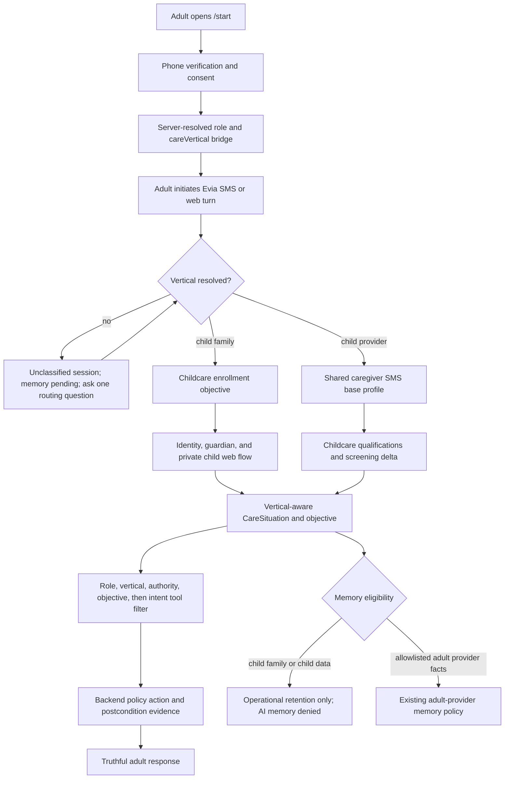

# feat: Add Vertical-Aware Childcare Signup And Evia Isolation

## Goal Capsule

| Field | Value |
|---|---|
| Objective | Add a childcare-specific signup branch and Evia execution boundary without cloning the existing adult-account, SMS onboarding, agent-loop, objective, action-evidence, or marketplace infrastructure. |
| Product authority | `docs/plans/2026-07-20-001-feat-childcare-marketplace-evia-plan.md` remains authoritative for childcare product, legal, trust, screening, guardian, payment, and launch scope. This plan narrows and updates its signup and Evia implementation contract. |
| Code authority | `fix/memory-wave-hotfixes` at `03ea8cb`. The original plan was reviewed at `9f4adf8`; 115 files, including 58 agent files, changed before this re-plan. Implementation must re-read again if the checkout moves. |
| Signup boundary | Caregiver onboarding remains Evia SMS-first. Child-sensitive family data is collected through authenticated web surfaces; Evia coordinates links, status, clarification, and continuation over SMS/web but does not solicit private child safety data in ordinary text. |
| Evia boundary | Preserve the current single-agent loop. Extend the shipped `CareSituation`, objective ledger, tool-pack selector, checkpoint, action-evidence, and canary contracts with vertical-aware state rather than introducing a second childcare agent architecture. |
| Memory boundary | No child-family turn, child profile fact, safety projection, custody/pickup detail, or childcare objective enters Zep, learned facts, memory files, generic summaries, or training/eval fixtures unless a later approved child-memory contract explicitly permits it. |
| Stop conditions | Stop before child data collection or childcare tools enable if vertical resolution is client-controlled, guardian authority is not server-verified, child memory suppression is not proven at every ingress/tail, cross-vertical tools remain reachable, or the parent/provider signup paths contain a web-only or SMS-only dead end. |
| Authorization | This artifact is implementation-ready but not implementation authorization. The original plan's Review Defaults, jurisdiction, legal, screening, privacy, insurance, and incident gates remain mandatory. |

---

## Product Contract

### Summary

CareConnecxx will keep one adult account and marketplace while adding a server-authoritative `senior | child` care vertical. Families enter through the existing phone-verified `/start` experience, but childcare-sensitive details move to authenticated web forms. Providers continue through canonical Evia SMS onboarding, with a reusable base profile and a separate childcare qualification, screening, and manual-approval delta.

Evia remains one coordinator for verified adults. She receives only the active vertical, recipient, authority projection, objective, and allowed tools. Childcare state cannot contaminate senior prompts, objectives, memory, tools, telemetry, or fallback behavior.

### Problem Frame

The current signup bridge carries only `client | caregiver` and a name. The client checklist is explicitly senior-specific, the caregiver checklist has only general senior-care fields, and `runQaAgent` requires `seniorId`. Current cold-inbound and onboarding paths also initialize Zep and write onboarding messages before a childcare memory policy can intervene.

The newer Evia architecture already has typed care situation, objectives, state-aware tool packs, source-turn checkpoints, action evidence, and canary monitoring. A childcare implementation that creates parallel state or prompt systems would discard this work and create conflicting truth. The implementation must verticalize these seams and block memory before data reaches any durable AI-memory adapter.

### Actors

- A1. **Verified parent or guardian:** An authenticated adult establishing or using server-verified authority for one or more child profiles.
- A2. **Authorized household adult:** An authenticated adult with limited recipient-specific permissions that do not imply guardian, pickup, payment, or custody authority.
- A3. **New childcare provider:** An adult entering CareConnecxx primarily to offer childcare.
- A4. **Existing or dual-vertical caregiver:** An adult with an existing senior-care profile who adds childcare through a delta flow rather than repeating base signup.
- A5. **Trust and Safety reviewer:** The human owner of childcare profile, screening, credential, exception, expiry, and adverse-action decisions.
- A6. **Evia:** The existing agent coordinating only with verified adults under authoritative role, vertical, recipient, objective, memory, and tool policy.

### Requirements

#### Vertical And Session Identity

- R1. Adult role and care vertical are separate typed values. `client | caregiver | family-secondary` never implies `senior | child`, and vertical eligibility never changes adult account role.
- R2. The server resolves `careVertical` from an authenticated signup bridge, selected recipient, active objective, or canonical booking/job record before prompt assembly, memory routing, or tool selection. Model text and client-provided URL parameters are not authority.
- R3. `/start` and `v1-createWebOnboardingSession` accept an explicit requested vertical, validate the enum and global enrollment policy, and persist the server-resolved routing result on the bridge with policy version and source. Jurisdiction eligibility remains a separate server gate once an adult supplies a service location; the bridge never grants jurisdiction eligibility.
- R4. `agent_sessions`, web onboarding state, retries, objectives, checkpoints, messages, and operational events propagate the same authoritative vertical and typed recipient reference.
- R5. Legacy records without `careVertical` resolve to `senior` only at documented compatibility adapters. New records never rely on a missing-field default.
- R6. An unclassified cold inbound remains `unclassified` until Evia obtains one routing answer. It cannot initialize long-term memory, bind senior or child tools, or create recipient-specific state while unresolved.

#### Family Childcare Signup

- R7. A parent starts at `/start?role=client&vertical=child`, completes phone verification and consent, and initiates the first message to Evia using the existing A2P-safe handoff.
- R8. Evia explains the next required adult step and sends authenticated links for Stripe Identity, guardian authority, and child-profile completion. She may collect routing-level intent over SMS but does not solicit exact birth date, address, custody, pickup, emergency, allergy, or detailed health information in ordinary text.
- R9. Child profiles are created only through authenticated callables backed by current adult identity and guardian policy. No child Auth account, direct child SMS thread, or child-facing Evia route is created.
- R10. Stripe Identity, guardian authority, consent version, subscription/payment readiness, and child-profile completeness remain separate statuses with truthful remediation and no partial private-data disclosure.
- R11. Identity and child-profile callbacks resume the pending childcare objective using authenticated server state, not URL parameters. Replayed, wrong-user, expired, or mismatched callbacks fail closed.
- R12. A parent can create multiple children without restarting adult signup; every objective and later action names one or more authorized child recipient references explicitly.

#### Caregiver Childcare Signup

- R13. New childcare providers reuse the current caregiver base collection for adult-owned common fields: name, location, story, experience, availability, job type, rate, email, biography, photo, payout account, and applicable documents.
- R14. Childcare-specific provider fields are namespaced under a vertical profile and include age-band experience, childcare services, references, required credentials, transportation/MVR applicability, service limitations, accepted policy version, and adult-age evidence.
- R15. Existing senior caregivers enter an add-childcare delta objective. Completed common profile, membership, payout, and reusable screening components are read and verified rather than re-asked or silently copied.
- R16. Childcare screening package, component coverage, status, expiry, manual approval, jurisdiction, and adverse-action state remain separate from senior approval. Senior eligibility cannot make a provider child-visible or child-bookable.
- R17. The existing onboarding collection tool enforces a server-selected field scope. Base fields preserve current flat compatibility; childcare-specific fields write only to the child vertical profile and cannot overwrite senior specialties or eligibility.
- R18. Completion messaging distinguishes `base profile complete`, `childcare screening pending`, `manual review required`, `childcare approved`, and `childcare unavailable`. Evia never equates Checkr `clear` with safe or approved.

#### Evia State, Tools, And Execution

- R19. `runQaAgent` accepts an authoritative `careVertical` and typed recipient reference. `seniorId` remains a compatibility alias during migration, not the universal recipient contract.
- R20. The existing `CareSituation` gains vertical, recipient, authority, and vertical-domain projections. Childcare uses the same ephemeral situation envelope and load-status/provenance semantics rather than a parallel agent state object.
- R21. The objective ledger stores `careVertical`, typed recipient references, guardian/participant authority references, and vertical policy version. Resume rejects vertical, recipient, actor, source-turn, or objective-version mismatch.
- R22. Tool filtering occurs in this order: authenticated role, care vertical, recipient authority, action risk/provider health, objective pack, then intent. Child turns cannot bind senior health, medication, care-plan, family-group, timesheet-approval, or unrelated-household tools.
- R23. Universal core tools are split into truly vertical-neutral core, senior core, and child core. An unmapped tool fails closed for childcare from the first release, even while senior migration remains fail-open and observable.
- R24. Child profile, guardian, job, match, booking, safety-projection, and incident tools call authenticated backend policy services. Prompt filtering never substitutes for Firestore Rules, callable authorization, or action-time eligibility checks.
- R25. Consequential childcare claims use the existing action-evidence and postcondition contract. Evia cannot claim identity verified, guardian approved, caregiver eligible, booking confirmed, payment completed, message delivered, or incident escalated without fresh authoritative evidence.
- R26. Injury, missing child, suspected abuse, unsafe pickup, custody conflict, identity mismatch, and immediate danger enter deterministic incident/handoff policy before general model routing.

#### Memory, Privacy, And Channel Parity

- R27. The memory decision is made before Zep initialization, transcript enqueue, learned-fact extraction, memory-file initialization, onboarding-data export, nightly summary eligibility, or eval-candidate export.
- R28. Child-family turns and childcare objectives are `memoryEligible: denied` by default. Unclassified turns are `pending`; they never write to AI memory and are never retroactively synchronized after classification. A later authoritative senior turn may begin normal senior memory from that point forward.
- R29. Caregiver onboarding may persist only allowlisted vertical-neutral adult-provider facts already permitted by the existing provider policy. Childcare-specific qualifications, age-band experience, vertical screening, child identities, family details, safety data, and care-recipient content remain canonical-only and prohibited from general AI memory.
- R30. Firestore conversation rows may remain under the approved operational retention contract, but child and unclassified rows carry immutable memory-exclusion metadata and never enter Zep, learned facts, generic summaries, golden datasets, or automatic training fixtures.
- R31. Authenticated web and Linq turns resolve to the same vertical, recipient, objective, memory policy, tool pack, action contract, and final state. Channel-specific delivery changes presentation only.
- R32. Telemetry records policy versions, states, counts, denials, latency, and purpose-separated pseudonyms without raw child content, exact addresses, names, custody/pickup data, safety details, or conversation text.

#### Compatibility And Rollout

- R33. Existing senior family and caregiver signup behavior remains equivalent while vertical fields are introduced dark. No senior user is asked a childcare question or denied a previously valid senior tool because a child module exists.
- R34. Childcare signup and Evia capabilities enable through server-side jurisdiction/cohort policy with global emergency-off, deterministic synthetic canaries, observation windows, and independent rollback from senior behavior.
- R35. A source/consumer manifest covers every bridge, session, objective, retry, trigger, prompt, tool, memory, and persistence seam that reads or writes role, recipient, or vertical. Missing coverage blocks deployment.

### Key Flows

- F1. **Parent starts childcare signup**
  - **Actors:** A1, A6
  - **Steps:** Select family plus childcare; verify phone and consent; text Evia; resolve child vertical; create a pending childcare-enrollment objective; send identity/guardian/profile links; resume after authenticated callbacks.
  - **Outcome:** A verified adult reaches a complete private child profile without senior questions, minor accounts, or child-memory writes.
- F2. **New provider signs up for childcare**
  - **Actors:** A3, A5, A6
  - **Steps:** Select caregiver plus childcare; complete common SMS profile; complete childcare delta; submit secure documents; run childcare Checkr policy; await manual review; verify payout and visibility gates.
  - **Outcome:** The provider is visible/bookable only for explicitly approved verticals.
- F3. **Senior caregiver adds childcare**
  - **Actors:** A4, A5, A6
  - **Steps:** Load current common profile and reusable evidence; ask only missing childcare fields; order/validate missing screening components; review; update child eligibility without modifying senior approval.
  - **Outcome:** No duplicate account, payout setup, common profile, or accidental cross-vertical approval is created.
- F4. **Evia coordinates a childcare objective**
  - **Actors:** A1/A2, A3/A4, A6
  - **Steps:** Resolve actor, vertical, child, and authority; build a minimum child situation; select child-safe tools; execute through backend policy; verify postconditions; notify authorized adults.
  - **Outcome:** Evia completes or truthfully blocks the objective without exposing child data or claiming unsupported success.
- F5. **Cold inbound is ambiguous**
  - **Actors:** A1-A4, A6
  - **Steps:** Create an unclassified operational session; suppress AI memory and recipient tools; ask one role/vertical question; bind the resulting authoritative branch; continue without replaying the inbound.
  - **Outcome:** The system never guesses senior versus child or stores the ambiguous turn in long-term memory.
- F6. **Minor or serious incident contact**
  - **Actors:** A1-A6
  - **Steps:** Detect direct-minor or incident category; block normal tools; provide deterministic emergency/handoff instruction; create a restricted case when authorized; notify human owners.
  - **Outcome:** Evia does not converse as a child-facing assistant or improvise an investigation.

### Acceptance Examples

- AE1. `/start?role=client&vertical=child` creates a bridge with server-resolved child vertical; changing the URL or callable payload after verification cannot create senior/child authority.
- AE2. A parent entering childcare never receives `client_ask_senior`, senior-age, medication, or senior care-plan questions.
- AE3. A parent can text "I need a sitter for my five-year-old" before choosing a vertical; the turn remains memory-pending, receives one routing question, and never initializes or writes Zep.
- AE4. Exact allergy, pickup, custody, address, and emergency fields are accepted through the secure child profile flow and rejected by generic onboarding-field tools.
- AE5. A verified Stripe identity without guardian authority cannot create or resume a child booking objective or view safety details.
- AE6. A child never receives an Auth account, onboarding bridge, direct SMS, Evia thread, payment request, or notification.
- AE7. A new childcare provider completes common questions once, then receives the child qualification and screening branch.
- AE8. A senior-approved caregiver adding childcare is not asked again for name, payout, or unchanged common profile data, and remains child-invisible until separate approval.
- AE9. A childcare `consider`, expired, incomplete, or manual-review state cannot become public approval and does not change valid senior eligibility.
- AE10. A childcare objective cannot bind `get_senior_profile`, medication, senior journal, senior care-plan, family-group, or timesheet-approval tools.
- AE11. A senior objective cannot load a child profile, child safety projection, childcare objective, or childcare screening record.
- AE12. A web childcare turn and equivalent Linq turn produce the same objective, tool eligibility, memory denial, postcondition, and final state.
- AE13. A callback replay or source-turn retry resumes the same phase and creates no duplicate child profile, screening order, booking, message, or payment effect.
- AE14. A childcare booking remains pending when payment is authorized but provider acceptance or current eligibility is missing; Evia describes the exact state.
- AE15. A childcare conversation creates operational message rows marked memory-denied but creates no Zep episode, learned fact, memory file, generic summary input, or raw eval fixture.
- AE16. Emergency-off removes childcare signup continuation and tools while existing senior signup and senior Evia flows continue normally.

### Scope Boundaries

#### Included

- Vertical selection and propagation through web, Linq, sessions, retries, objectives, prompts, tools, persistence, and telemetry.
- Secure family childcare enrollment with Evia-driven continuation.
- New and existing caregiver childcare SMS onboarding branches.
- Vertical-aware extension of current care situation, objective, tool-pack, checkpoint, action-evidence, and canary infrastructure.
- Hard child/unclassified memory denial and adult-provider allowlisting.
- Web/Linq parity, synthetic evaluation, rollout, monitoring, and rollback.

#### Deferred Or Owned By The Parent Plan

- Jurisdiction approval, legal terms, insurance, screening-package selection, adverse action, incident operations, full child data model, marketplace UI, matching, booking, and payment implementation remain owned by `docs/plans/2026-07-20-001-feat-childcare-marketplace-evia-plan.md`.
- Child-facing accounts, conversations, educational features, and child AI memory remain prohibited, not merely deferred.
- A general identity-model migration or replacement of the current agent framework is outside this plan.

---

## Planning Contract

### Product Contract Preservation

The parent childcare Product Contract is unchanged. This plan narrows the signup and Evia implementation approach to the current source and adds no new provider category, jurisdiction, child-facing capability, or memory permission.

### Key Technical Decisions

- KTD1. **Treat role, vertical, and recipient as independent server-owned axes.** Role controls adult capabilities; vertical controls policy/tool/data domains; recipient controls authority and projection. Session vertical is current routing state, not account entitlement, and is revalidated from the foreground objective/recipient each turn. Combining these axes would make dual-vertical providers and multi-recipient households unsafe.
- KTD2. **Use SMS for provider collection and secure web for child-sensitive family data.** Evia remains the coordinator and continuation owner, while custody, pickup, health, emergency, and identity data stay behind authenticated forms and callables.
- KTD3. **Extend the current onboarding machine instead of cloning it.** Common caregiver fields and gates remain shared. Child-specific provider fields use a namespaced vertical profile and a server-selected allowlist. Existing caregivers enter a delta objective.
- KTD4. **Introduce unclassified as a real pre-vertical state.** Cold inbound cannot safely default to senior because the first message may contain child data. Unclassified sessions can retain minimum operational history but cannot initialize AI memory or bind recipient tools.
- KTD5. **Extend `CareSituation`; do not create a second situation authority.** Add a typed recipient union and vertical domain loaders/projections to the shipped envelope. Childcare-specific helper modules may build child domains, but `runQaAgent` receives one situation contract.
- KTD6. **Verticalize the objective ledger before childcare agent behavior.** Every objective, checkpoint, retry, and evidence receipt binds actor, vertical, recipient, and policy version. This prevents a senior objective or old callback from resuming against child state.
- KTD7. **Filter tool authority before intent and split core tools.** Current senior tools cannot remain universal core. Truly neutral tools are separate from senior and child core; childcare unmapped tools fail closed immediately.
- KTD8. **Deny memory before adapter entry.** A shared `MemoryEligibilityDecision` is computed at ingress and carried through the turn. Zep initialization, transcript sync, learned facts, memory files, summaries, onboarding export, and eval intake each independently enforce it.
- KTD9. **Allowlist only vertical-neutral adult-provider memory.** A caregiver's common experience, availability, and rate may follow the existing adult-provider memory policy. Childcare qualifications, age-band experience, screening, and all child/family/safety content stay in canonical provider/child records and are excluded from general memory even in a caregiver thread.
- KTD10. **Reuse action evidence and deterministic incident policy.** Childcare mutations use the current evidence/postcondition architecture; serious incident categories bypass general model discretion and enter the parent plan's restricted case workflow.
- KTD11. **Keep backend policy authoritative.** Web forms and MCP tools call the same guardian, screening, eligibility, booking, safety, and incident services. Frontend visibility and prompt instructions are defense in depth, not authorization.
- KTD12. **Roll out vertical plumbing before child data.** Land typed fields, adapters, memory denial, tool filtering, and senior regression proof with childcare disabled. Enable synthetic child signup only after every source/consumer manifest entry is green.

### High-Level Technical Design

### Data Contract Changes

#### Shared Types

- `CareVertical = "senior" | "child"`; onboarding may additionally use transient `"unclassified"` before authoritative resolution.
- `RecipientRef = { careVertical: "senior"; seniorId: string } | { careVertical: "child"; childId: string }`.
- `MemoryEligibilityDecision = { status: "allowed" | "denied" | "pending"; reasonCode; policyVersion; decidedAt; source }`.

#### `web_onboarding_sessions/{phone}`

- Add requested and resolved vertical, vertical policy version, source, and status.
- Preserve verified UID, role, phone, name, consent, referral, TTL, and inbound-first behavior.
- Client payload may request a vertical but cannot grant jurisdiction, guardian, child, provider, or booking authority.

#### `agent_sessions/{phone}`

- Add `careVertical`, typed `recipientRef`, vertical policy version, and memory eligibility.
- Treat session vertical as current/foreground routing state, never proof that the adult or provider is entitled or approved for that vertical.
- Preserve `seniorId` during compatibility rollout; derive it only from a senior `recipientRef`.
- Do not create a Zep thread solely for a child-only family session. A multi-vertical adult may retain an existing senior Zep thread reference, but child and unclassified turns must neither read nor write it; memory eligibility is enforced per turn/objective rather than inferred from thread existence.

#### Caregiver Onboarding State

- Keep current base fields for compatibility.
- Add `verticalProfiles.child` for child-specific provider fields and policy acceptance.
- Track `requestedVerticals`, per-vertical collection status, per-vertical screening status, and per-vertical approval status separately.

#### `agent_objectives/{objectiveId}`

- Add `careVertical`, `recipientRefs`, authority references, vertical policy version, and memory eligibility.
- Objective and checkpoint resume validates the full actor/vertical/recipient/source/version binding.

#### Conversation And Telemetry Records

- Stamp source channel, vertical, policy version, and memory eligibility without copying child profile content.
- Memory-denied and pending rows are excluded from every consolidation, Zep, fact, summary, and eval query by contract and coverage test.

### Sequencing

1. **Wave 0 - Rebase and manifest:** freeze current SHA, inventory every role/recipient/vertical/memory consumer, and prove senior baselines.
2. **Wave 1 - Dark vertical plumbing:** add types, bridge/session propagation, unclassified state, memory decisions, and compatibility adapters with childcare disabled.
3. **Wave 2 - Family enrollment:** add secure parent flow, guardian/identity callbacks, objective continuation, and no-memory proof using synthetic records.
4. **Wave 3 - Provider enrollment:** add new-provider and dual-vertical delta collection, childcare screening policy, and manual-review status.
5. **Wave 4 - Evia execution:** enable vertical care situation, objectives, child-safe tool packs, backend actions, evidence claims, and incident routing in non-production.
6. **Wave 5 - Canary and rollout:** run web/Linq parity, memory-leak, senior-regression, synthetic marketplace, emergency-off, and jurisdiction/cohort observation gates.

### Risks And Mitigations

| Risk | Severity | Mitigation |
|---|---|---|
| Current client onboarding asks senior questions in a child flow | Critical | Resolve vertical before collection and use a distinct parent childcare objective plus secure child-profile flow. |
| Child text reaches Zep or learned facts before vertical resolution | Critical | Introduce pending/denied memory eligibility before initialization and independently guard every adapter and query. |
| Childcare creates a second Evia state system | High | Extend current care situation, objective, checkpoint, action evidence, tool pack, and canary contracts. |
| Universal core tools leak senior data into child turns | Critical | Split neutral/senior/child core and fail closed for every unmapped childcare tool. |
| Existing caregiver repeats the whole signup | High | Use a delta objective and verify reusable common fields/provider evidence before asking anything. |
| Child approval inherits senior Checkr state | Critical | Store and compute screening, expiry, policy, and manual approval per vertical. |
| Sensitive child data is solicited over SMS | Critical | Restrict SMS to routing/status/coordination and use authenticated forms for private child data. |
| Callback or retry resumes the wrong child/objective | Critical | Bind UID, actor, vertical, recipient, objective version, callback source, and source-turn checkpoint. |
| Senior signup regresses during verticalization | High | Compatibility adapters, dark rollout, senior golden transcripts, both broad test shards, and independent rollback. |
| Plan drifts behind active Evia implementation | High | Re-read all manifest seams and update reviewed SHA before U0; treat paths as starting points, not proof of unchanged source. |

---

## Implementation Units

### U0. Current-Source Manifest And Senior Baseline

- **Goal:** Freeze the implementation baseline and enumerate every vertical, recipient, onboarding, retry, tool, and memory consumer before changing contracts.
- **Dependencies:** None. This is the start gate for this plan.
- **Requirements:** R1-R6, R27-R35.
- **Files:** `docs/plans/2026-07-20-001-feat-childcare-marketplace-evia-plan.md`, `context/project-overview.md`, `functions/src/data/contract.ts`, `functions/src/agents/onboardingContract.ts`, `functions/src/linq/client.ts`, `functions/src/linq/webhooks.ts`, `functions/src/linq/webChat.ts`, `functions/src/agents/qaAgent.ts`, `functions/src/agents/careSituation.ts`, `functions/src/agents/objectiveLedger.ts`, `functions/src/agents/toolCapabilities.ts`, `functions/src/agents/toolPackSelector.ts`, `functions/src/memory/conversationMemory.ts`, `functions/src/memory/learnedFacts.ts`, `functions/src/memory/zepClient.ts`, `docs/runbooks/childcare-launch.md` (create in parent plan).
- **Approach:** Record clean local/remote source; create a source/consumer manifest; capture existing senior family/provider onboarding, web/Linq turns, tool packs, memory persistence, and retry outcomes; update every stale path and parent-plan dependency before implementation proceeds.
- **Test Scenarios:** Fresh/returning client; fresh/returning caregiver; web bridge; cold inbound; onboarding resume; web/Linq completed turn; retry; Zep unavailable; tool pack; existing senior booking.
- **Exit:** The manifest has one owner/test per seam and the senior baseline is reproducible before vertical code lands.

### U1. Vertical Types, Web Bridge, And Session Propagation

- **Goal:** Establish one authoritative vertical and recipient contract from `/start` through every agent ingress.
- **Dependencies:** U0.
- **Requirements:** R1-R6, R19, R21, R31, R33, R35.
- **Files:** `types.ts`, `components/auth/onboarding/OnboardingFlow.tsx`, `components/auth/onboarding/OnboardingFlow.childcare.test.tsx` (create), `hooks/useOnboardingSession.ts`, `functions/src/index.ts`, `functions/src/index.webOnboarding.childcare.test.ts` (create), `functions/src/linq/client.ts`, `functions/src/linq/webhooks.ts`, `functions/src/linq/__tests__/handleInbound.childcareOnboarding.test.ts` (create), `functions/src/linq/webChat.ts`, `functions/src/linq/webChat.test.ts`, `functions/src/data/contract.ts`, `firestore.rules`.
- **Patterns:** Authenticated phone/token match in `v1-createWebOnboardingSession`; inbound-first A2P bridge; server-derived source-turn identity; legacy senior compatibility adapters.
- **Approach:** Add vertical selection to the existing role flow; validate requested vertical against server policy; stamp bridge/session/persistence records; add unclassified cold-inbound state; propagate vertical/recipient through Linq, web, retry, and trigger calls; retain `seniorId` only as a senior compatibility alias.
- **Test Scenarios:** Client/caregiver plus senior/child combinations; changed URL after verification; payload/token mismatch; disabled jurisdiction; expired bridge; returning dual-vertical adult; cold childcare phrase; ambiguous cold inbound; retry; legacy missing vertical; no child authority from query parameters.
- **Exit:** Every ingress provides an authoritative or explicitly unclassified vertical, and no new record depends on missing vertical inference.

### U2. Secure Parent Childcare Enrollment And Objective Continuation

- **Goal:** Let an adult complete childcare enrollment without passing through senior questions or placing private child data in SMS.
- **Dependencies:** U1 and the parent plan's child-profile/authority schema unit.
- **Requirements:** R7-R12, R21, R24-R25, R31-R32.
- **Files:** `components/client/childcare/ChildProfileFlow.tsx` (create), `components/client/childcare/ChildProfileFlow.test.tsx` (create), `components/client/IdentityGateModal.tsx`, `components/client/IdentityCallback.tsx`, `services/api.ts`, `services/stripeService.ts`, `functions/src/childcare/guardianAuthority.ts` (create), `functions/src/childcare/guardianAuthority.test.ts` (create), `functions/src/childcare/childProfileCallables.ts` (create), `functions/src/childcare/childProfileCallables.test.ts` (create), `functions/src/stripe.ts`, `functions/src/stripeIdentity.childcare.test.ts` (create), `functions/src/agents/objectiveLedger.ts`, `functions/src/agents/objectiveLedger.test.ts`, `functions/src/agents/onboardingConversation.ts`, `firestore.rules`, `firestore.query-contracts.json`, `firestore.indexes.json`.
- **Patterns:** Current Stripe Identity callable/callback; objective expected-reply continuation; server-only sensitive mutations; additive index/query-contract workflow.
- **Approach:** Create a childcare enrollment objective after first inbound; send secure identity/guardian/profile links; collect private data through authenticated callables; persist only minimum SMS status; resume using authenticated objective/callback bindings; support multiple children under one adult account.
- **Test Scenarios:** Identity verified/processing/requires-input/canceled; guardian absent/revoked; wrong-user callback; callback replay; multiple children; invited adult; consent-version change; private field sent through generic onboarding tool; no child PII in link, metadata, logs, or SMS response.
- **Exit:** A verified authorized adult can create and resume child profiles, while unauthorized or incomplete actors receive exact remediation and no private disclosure.

### U3. Childcare Provider SMS Base And Delta Onboarding

- **Goal:** Reuse common caregiver onboarding while independently collecting and approving childcare qualifications.
- **Dependencies:** U1 and the parent plan's jurisdiction, screening-package, manual-review, and adverse-action contract.
- **Requirements:** R13-R18, R24-R25, R31-R35.
- **Files:** `functions/src/agents/onboardingContract.ts`, `functions/src/agents/__tests__/onboardingContract.test.ts`, `functions/src/agents/caregiverOnboardingDirective.ts`, `functions/src/agents/__tests__/caregiverOnboardingDirective.test.ts`, `functions/src/agents/onboardingConversation.ts`, `functions/src/agents/qaAgent.onboarding.test.ts`, `functions/src/agents/caregiverProfileHandler.ts`, `functions/src/agents/caregiverProfileHandler.test.ts`, `functions/src/checkr.ts`, `functions/src/checkrApi.ts`, `functions/src/mvrConfig.ts`, `functions/src/childcare/screeningPolicy.ts` (create), `functions/src/childcare/screeningPolicy.test.ts` (create), `functions/src/utils/caregiverEligibility.ts`, `functions/src/caregiverPublicProjection.ts`, `functions/src/caregiverPrivate.ts`, `components/caregiver/CaregiverOnboardingDashboard.tsx`, `components/caregiver/CaregiverOnboardingDashboard.childcare.test.tsx` (create), `components/admin/CaregiverVerificationDashboard.tsx`, `components/admin/CaregiverVerificationDashboard.childcare.test.tsx` (create), `firestore.rules`.
- **Patterns:** Existing collect-then-gate flow; `save_onboarding_field` allowlists; Checkr invitation/webhook idempotency; per-field profile absorber; public projection; manual review.
- **Approach:** Separate base and child field contracts; route new providers through base then child delta; route existing caregivers directly to missing child fields; verify reusable evidence; create per-vertical screening and approval; preserve senior profile and visibility independently.
- **Test Scenarios:** New child-only provider; dual-vertical provider; existing senior provider; missing common field; adult age failure; infant/overnight/medication/transport category disabled; MVR required/optional; wrong Checkr package; duplicate/out-of-order webhook; clear/consider/pending/expired/disputed; manual approval/revocation; senior eligibility unchanged.
- **Exit:** Providers answer common questions once, and only current manually approved child eligibility produces child visibility/bookability.

### U4. Vertical-Aware Care Situation, Objectives, And Checkpoints

- **Goal:** Make the shipped intelligence state safe for senior and child recipients without parallel truth.
- **Dependencies:** U1; U2 and U3 provide the authoritative family/provider state adapters.
- **Requirements:** R19-R21, R25-R26, R31-R35.
- **Files:** `functions/src/agents/careSituation.ts`, `functions/src/agents/careSituation.test.ts`, `functions/src/agents/careSituationProjection.ts`, `functions/src/agents/careSituationProjection.test.ts`, `functions/src/agents/objectiveLedger.ts`, `functions/src/agents/objectiveLedger.test.ts`, `functions/src/agents/objectiveAdapters.ts`, `functions/src/agents/objectiveAdapters.test.ts`, `functions/src/agents/turnSourceKey.ts`, `functions/src/agents/turnSourceKey.test.ts`, `functions/src/agents/turnPhaseCheckpoint.ts`, `functions/src/agents/turnPhaseCheckpoint.test.ts`, `functions/src/agents/qaAgent.ts`, `functions/src/agents/qaAgent.test.ts`, `functions/src/data/childProfileRepository.ts` (create), `functions/src/data/childProfileRepository.test.ts` (create).
- **Patterns:** Current evidence facts/domain statuses; compact situation projection; objective version transitions; server-derived checkpoint source key; action evidence.
- **Approach:** Add typed recipient union and vertical policy to current state; load child authority/profile/safety summaries through child repositories; preserve explicit unavailable/stale/conflict states; bind objective and checkpoint resume to actor/vertical/recipient; prevent old senior adapters from consuming child domains.
- **Test Scenarios:** Senior/child/dual household; multiple children; parent/authorized adult/provider; revoked authority; stale callback; cross-child/cross-household; vertical mismatch; partial loader failure; malicious profile text; checkpoint collision/replay; legacy senior objective.
- **Exit:** Every agent turn has one vertical-aware situation/objective, and no cross-vertical or cross-recipient resume succeeds.

### U5. Tool-Pack And Backend Action Isolation

- **Goal:** Expose only authorized vertical tools and require backend policy plus postcondition evidence for every childcare mutation.
- **Dependencies:** U4 and the parent plan's child profile, job, matching, booking, safety, and incident backend services.
- **Requirements:** R22-R26, R31-R35.
- **Files:** `functions/src/agents/toolCapabilities.ts`, `functions/src/agents/toolCapabilities.test.ts`, `functions/src/agents/toolPackSelector.ts`, `functions/src/agents/toolPackSelector.test.ts`, `functions/src/mcp/server.ts`, `functions/src/mcp/__tests__/childcare.test.ts` (create), `functions/src/mcp/__tests__/parity.test.ts`, `functions/src/agents/actionEvidence.ts`, `functions/src/agents/actionEvidence.test.ts`, `functions/src/agents/actionNative/caraActionTypes.ts`, `functions/src/agents/actionNative/runCaraAction.ts`, `functions/src/agents/actions/mcpWriteActionAdapter.ts`, `functions/src/childcare/childProfileCallables.ts` (created in U2), `functions/src/childcare/jobCallables.ts` (from parent plan), `functions/src/childcare/bookingCallables.ts` (from parent plan), `functions/src/childcare/incidentPolicy.ts` (from parent plan), `functions/src/agents/qaAgent.ts`.
- **Patterns:** Capability metadata; objective-aware pack selector; role-specific MCP handlers; high-stakes mutation classification; action receipt/postcondition verification.
- **Approach:** Add vertical metadata and split core tools; filter role/vertical/authority before objective/intent; create narrow child tools over parent-plan backend services; mark all childcare mutations high-stakes; route incident categories deterministically; return safe evidence claim codes.
- **Test Scenarios:** Child/senior core sets; unmapped child tool; unauthorized adult; expired screening; wrong child; direct tool argument forgery; backend denial; successful mutation/read-back; stale evidence; payment before acceptance; emergency category; web/Linq parity; senior tool availability unchanged.
- **Exit:** Child turns have no senior/private/unmapped tools, and no consequential claim succeeds without backend authorization and fresh evidence.

### U6. Child Prompt Policy And Hard Memory Denial

- **Goal:** Give Evia minimum childcare context while proving that child data cannot enter any AI-memory or learning path.
- **Dependencies:** U1 and U4; U5 supplies the final child-safe tool surface.
- **Requirements:** R19-R20, R26-R32, R35.
- **Files:** `functions/src/agents/promptAugmenters.ts`, `functions/src/agents/childcarePromptAugmenter.ts` (create), `functions/src/agents/childcarePromptAugmenter.test.ts` (create), `functions/src/agents/qaAgent.ts`, `functions/src/agents/qaAgent.test.ts`, `functions/src/linq/webhooks.ts`, `functions/src/linq/webChat.ts`, `functions/src/linq/webChat.test.ts`, `functions/src/memory/memoryEligibility.ts` (create), `functions/src/memory/memoryEligibility.test.ts` (create), `functions/src/memory/conversationMemory.ts`, `functions/src/memory/conversationMemory.childcare.test.ts` (create), `functions/src/memory/learnedFacts.ts`, `functions/src/memory/learnedFacts.test.ts`, `functions/src/memory/zepClient.ts`, `functions/src/memory/zepClient.test.ts`, `functions/src/memory/memoryFiles.ts`, `functions/src/memory/memoryFiles.test.ts`, `functions/src/scheduled/nightlyMemory.ts`, `functions/src/scheduled/nightlyMemory.test.ts`, `functions/src/evals/evalCandidateQueue.ts`, `functions/src/agents/goldenTranscripts.test.ts`, `functions/src/data/contract.ts`.
- **Patterns:** Composable prompt augmenters; prompt sanitization; typed Zep outcomes; completed-turn persistence; memory reconciliation/tombstones; reference-only eval candidates.
- **Approach:** Compute memory eligibility at ingress; carry it through `runQaAgent` and persistence; prevent Zep creation/writes/search, fact extraction, memory-file initialization, onboarding export, summary consolidation, and eval export for denied/pending turns; allowlist adult-provider facts; inject concise childcare policy and minimum situation only for authoritative child objectives.
- **Test Scenarios:** Child web/SMS turn; unclassified cold inbound; explicit child details before classification; adult provider qualification; provider mentions a family/child; child profile injection attempt; existing accidental Zep ID; reconciliation path; nightly consolidation; eval intake; unsupported-safe claim; direct minor; senior memory parity.
- **Exit:** Adversarial tests find zero child data in Zep, learned facts, memory files, summaries, or fixtures, while approved senior and adult-provider memory behavior remains green.

### U7. Parity, Canary, Rollout, And Proof

- **Goal:** Prove both signup paths and Evia vertical isolation before any childcare cohort can enable.
- **Dependencies:** U0-U6 and the parent plan's launch-control/incident-operations unit.
- **Requirements:** R31-R35 and AE1-AE16.
- **Files:** `functions/src/agents/intelligenceCanaryWatch.ts`, `functions/src/agents/intelligenceCanaryWatch.test.ts`, `functions/src/childcare/childcareCanaryWatch.ts` (from parent plan), `functions/src/config/rolloutPolicy.ts`, `functions/src/config/rolloutPolicy.test.ts`, `functions/src/config/featureFlags.ts`, `functions/src/evals/testCases.ts`, `functions/src/evals/runner.ts`, `functions/src/index.ts`, `firebase.json`, `firestore.query-contracts.json`, `firestore.indexes.json`, `firestore.rules`, `scripts/deploy.mjs`, `docs/runbooks/childcare-launch.md` (create in parent plan).
- **Patterns:** Existing rollout policy/emergency-off; deterministic cohorts; intelligence canary; two-shard suite; query-contract and additive-index deployment; exact Firebase function/update proof.
- **Approach:** Add signup, vertical, memory-denial, tool-isolation, objective, and senior-regression canaries; run provider sandboxes and synthetic web/Linq trajectories; enable one jurisdiction/cohort dark to canary to partial to full; keep child signup collection off until legal/privacy gates are signed.
- **Test Scenarios:** New parent; new provider; dual provider; callback retry; source-turn replay; memory leak; cross-vertical tool; cross-household access; Checkr outage; Stripe outage; emergency-off; index missing; rules denial; senior signup/booking/memory regression; rollback with unresolved objectives preserved.
- **Exit:** Every release gate is green, rollback is proven, and the final report separates local, remote, deployed, deferred, and legally blocked state.

---

## Verification Contract

### Local Gates

| Gate | Command | Required result |
|---|---|---|
| Signup bridge | `npm.cmd test -- --run components/auth/onboarding/OnboardingFlow.childcare.test.tsx functions/src/index.webOnboarding.childcare.test.ts functions/src/linq/__tests__/handleInbound.childcareOnboarding.test.ts` | Role/vertical/identity bridge, unclassified routing, and legacy senior behavior pass. |
| Family enrollment | `npm.cmd test -- --run components/client/childcare/ChildProfileFlow.test.tsx functions/src/childcare/guardianAuthority.test.ts functions/src/childcare/childProfileCallables.test.ts functions/src/stripeIdentity.childcare.test.ts` | Identity, guardian, callback, private-data, and multi-child cases pass. |
| Provider enrollment | `npm.cmd test -- --run functions/src/agents/__tests__/onboardingContract.test.ts functions/src/agents/__tests__/caregiverOnboardingDirective.test.ts functions/src/agents/qaAgent.onboarding.test.ts functions/src/childcare/screeningPolicy.test.ts components/caregiver/CaregiverOnboardingDashboard.childcare.test.tsx components/admin/CaregiverVerificationDashboard.childcare.test.tsx` | Base/delta collection, per-vertical screening, manual review, and senior independence pass. |
| State and resume | `npm.cmd test -- --run functions/src/agents/careSituation.test.ts functions/src/agents/careSituationProjection.test.ts functions/src/agents/objectiveLedger.test.ts functions/src/agents/objectiveAdapters.test.ts functions/src/agents/turnSourceKey.test.ts functions/src/agents/turnPhaseCheckpoint.test.ts` | Vertical/recipient/authority state and retry bindings reject collisions and stale state. |
| Tools and evidence | `npm.cmd test -- --run functions/src/agents/toolCapabilities.test.ts functions/src/agents/toolPackSelector.test.ts functions/src/mcp/__tests__/childcare.test.ts functions/src/mcp/__tests__/parity.test.ts functions/src/agents/actionEvidence.test.ts` | Child-safe packs, unmapped-tool denial, backend auth, and postconditions pass. |
| Memory isolation | `npm.cmd test -- --run functions/src/memory/memoryEligibility.test.ts functions/src/memory/conversationMemory.childcare.test.ts functions/src/memory/learnedFacts.test.ts functions/src/memory/zepClient.test.ts functions/src/memory/memoryFiles.test.ts functions/src/scheduled/nightlyMemory.test.ts functions/src/agents/childcarePromptAugmenter.test.ts functions/src/agents/goldenTranscripts.test.ts` | Child/unclassified data produces zero AI-memory, consolidation, or fixture writes and senior/provider allowlisted behavior remains green. |
| Existing agent regression | `npm.cmd test -- --run functions/src/agents/qaAgent.test.ts functions/src/agents/qaAgent.onboarding.test.ts functions/src/linq/webChat.test.ts functions/src/agents/goldenTranscripts.test.ts` | Current senior conversation, onboarding, web/Linq, and memory behavior does not regress. |
| Broad shard 1 | `npm.cmd test -- --run --shard=1/2 --pool=forks --no-file-parallelism` | First suite shard passes without ignored failures. |
| Broad shard 2 | `npm.cmd test -- --run --shard=2/2 --pool=forks --no-file-parallelism` | Second suite shard passes without ignored failures. |
| Type/build | `$env:NODE_OPTIONS='--max-old-space-size=8192'; npm.cmd run typecheck; npm.cmd run build; npm.cmd --prefix functions run typecheck; npm.cmd --prefix functions run build` | Root and Functions semantic typechecks and builds pass. |
| Query/index | `npm.cmd run audit:indexes` | Every new query has a contract and covered additive index before deployment. |
| Static eval | `npm.cmd run eval` | Childcare evaluated/skipped counts are explicit; no skipped case is a pass. |

### Non-Production Trajectory Gate

- Use synthetic adults, children, providers, households, jobs, and bookings in a non-production Firebase project with Stripe/Checkr/Linq sandbox or mock credentials.
- A hard environment guard refuses production Firebase, Linq, Stripe, Checkr, or provider writes before creating an identity session, thread, child profile, screening, booking, payment, message, or export.
- Run repeated parent/provider web and SMS trajectories, including dual-vertical and retry cases.
- Inspect final Firestore/provider state, tools, objective, evidence, messages, memory stores, indexes, and prohibited-write assertions rather than grading final wording alone.

### Release Gates

| Capability | Enable threshold | Hold or rollback signal |
|---|---|---|
| Senior compatibility | 100% declared senior signup/memory/tool/booking regressions green | Any senior user enters child flow, loses a valid tool, or changes final state. |
| Parent signup | At least 95% repeated synthetic phone -> objective -> identity -> guardian -> child profile completion | Senior question, private SMS solicitation, dead end, callback mismatch, or unauthorized disclosure. |
| Provider signup | At least 95% new and dual-provider trajectories reach the correct review/eligibility state | Repeated common signup, wrong Checkr package, inherited approval, or false visibility. |
| Memory isolation | 100% deterministic/adversarial cases create zero child AI-memory/summary/fixture writes | Any child content or identifier enters Zep, learned facts, memory files, summary, or eval fixture. |
| Tool isolation | 100% child turns expose only allowed neutral/child tools and backend policy denies forged authority | Any senior/private/unmapped/cross-household tool reaches execution. |
| Claim truth | Zero unsupported identity, guardian, approval, booking, payment, delivery, or incident-completion claims | Any consequential claim without fresh evidence. |
| Channel parity | Web and Linq trajectories reach equivalent objectives, authority, tools, memory decisions, and final state | Material channel-only capability or dead end. |
| Rollback | Emergency-off propagates within the existing rollout-policy SLA and preserves senior operation | Child action remains enabled or senior behavior changes during rollback. |

### Deployment Gate

1. Re-read manifest seams and record clean local branch/SHA, remote branch/SHA, and `origin/main` SHA.
2. Confirm the parent childcare plan's legal, jurisdiction, screening, privacy, incident, and authorization gates for the intended wave.
3. Run targeted tests, both broad shards, type/build, static eval, query/index audit, and non-production trajectories.
4. Deploy additive indexes and rules before any child data collection; wait for required indexes to reach `READY`.
5. Deploy Functions with childcare flags off; verify exact update times, secret/environment bindings, and source SHA.
6. Deploy Hosting only when the approved wave changes `/start`, identity callback, or child/profile surfaces; verify desktop/mobile flows before enablement.
7. Enable dark telemetry, then synthetic canary, then one approved jurisdiction/cohort. Stop on any red critical gate.
8. Verify no child data appeared in memory systems after each observation window and exercise emergency-off before expansion.

### Production Smoke Matrix

| Smoke | Expected proof |
|---|---|
| Parent child entry | Child vertical bridge and objective; no senior question or AI-memory write. |
| Secure child profile | Authenticated guardian creates minimum profile; forged/replayed actor is denied. |
| New provider | Shared base then childcare delta; correct screening/review state; not visible early. |
| Existing senior provider | Only missing childcare delta; senior approval unchanged; child visibility remains independently gated. |
| Cross-vertical tools | Child turn has no senior health/care-plan/timesheet tools; senior turn has no child private tools. |
| Memory denial | Operational row is marked denied; Zep, facts, files, summaries, and eval fixtures remain absent. |
| Booking truth | Payment authorization without acceptance/eligibility remains pending and Evia says so. |
| Incident | Deterministic handoff/case policy runs without model adjudication. |
| Retry | One objective/profile/screening/booking/message/effect after duplicate source event. |
| Rollback | Child signup/action disappears while senior signup and Evia remain functional. |

---

## Definition of Done

- The parent childcare Product Contract and this narrowed signup/Evia plan are both referenced by the implementation report.
- Reviewed SHAs and the source/consumer manifest match the implementation baseline; no stale file assumption remains hidden.
- Role, care vertical, and recipient are independent server-authoritative values from `/start` through every ingress, objective, checkpoint, tool, persistence, and telemetry seam.
- Unclassified cold inbound cannot initialize AI memory or recipient tools and resolves through one routing question.
- Parent childcare signup never enters the senior checklist and keeps private child data in authenticated web/callable flows.
- New providers reuse the base caregiver flow; existing providers complete only the childcare delta; senior and child approvals remain independent.
- Current `CareSituation`, objective ledger, checkpoint, action evidence, tool pack, and canary systems own both verticals without a parallel childcare agent architecture.
- Child tools are filtered by role, vertical, recipient authority, objective, and intent, with childcare unmapped tools failing closed.
- Childcare consequential claims require fresh backend postcondition evidence; serious incidents use deterministic handoff policy.
- Child and unclassified turns produce zero Zep, learned-fact, memory-file, generic-summary, or raw-fixture writes; adult-provider memory is explicitly allowlisted.
- Web and Linq reach equivalent authority, objective, tool, memory, evidence, and final states.
- Existing senior signup, agent conversation, memory, tools, matching, booking, payment, and rollback behavior remains green.
- Targeted tests, both broad shards, typechecks/builds, static eval, query/index audit, sandbox trajectories, and production smokes pass.
- Required indexes are `READY`, rules precede child collection, Functions/Hosting match the approved SHA, and exact deployment proof is recorded.
- Emergency-off, retention/deletion, memory cleanup, monitoring, and rollback are proven before cohort expansion.
- Experimental or abandoned duplicate signup/state/prompt code is removed; no child collection or capability can be enabled outside approved jurisdiction policy.

---

## Appendix

### Current-Source Findings Incorporated

- `/start` currently models only `client | caregiver`: `components/auth/onboarding/OnboardingFlow.tsx`.
- `v1-createWebOnboardingSession` and `web_onboarding_sessions` currently carry role/name but no vertical: `functions/src/index.ts`, `functions/src/data/contract.ts`, and `hooks/useOnboardingSession.ts`.
- Client onboarding is senior-specific and caregiver onboarding is a shared adult base: `functions/src/agents/onboardingContract.ts`, `functions/src/agents/onboardingDirective.ts`, and `functions/src/agents/caregiverOnboardingDirective.ts`.
- `runQaAgent`, `CareSituation`, and objectives still use senior-specific recipient fields: `functions/src/agents/qaAgent.ts`, `functions/src/agents/careSituation.ts`, and `functions/src/agents/objectiveLedger.ts`.
- Current universal core tools include senior reads and unmapped tools remain fail-open: `functions/src/agents/toolCapabilities.ts`.
- Zep currently initializes on cold/mid-onboarding sessions and onboarding messages are written before a childcare memory decision: `functions/src/linq/webhooks.ts`.
- Completed web client turns currently request fact extraction: `functions/src/linq/webChat.ts` and `functions/src/memory/conversationMemory.ts`.
- Shipped intelligence modules now available for reuse include `careSituation.ts`, `careSituationProjection.ts`, `objectiveLedger.ts`, `toolPackSelector.ts`, `turnSourceKey.ts`, `turnPhaseCheckpoint.ts`, `actionEvidence.ts`, and `intelligenceCanaryWatch.ts`.

### Implementation-Time Defaults

- Preserve Evia SMS as canonical caregiver onboarding.
- Use secure authenticated web forms for private child profile and guardian data; SMS carries only minimum routing, status, and coordination.
- Default unclassified and child-family memory eligibility to denied/pending, never allowed.
- Default new/unmapped childcare tools to denied.
- Preserve `seniorId` only as a migration alias; new childcare code uses typed recipient references.
- Do not reuse senior approval as childcare eligibility.
- Do not describe a provider as safe, passed, guaranteed, or approved until CareConnecxx's current manual vertical decision says approved; even then, avoid safety guarantees.
- Do not enable child data collection before parent-plan legal/privacy/jurisdiction gates are approved.
