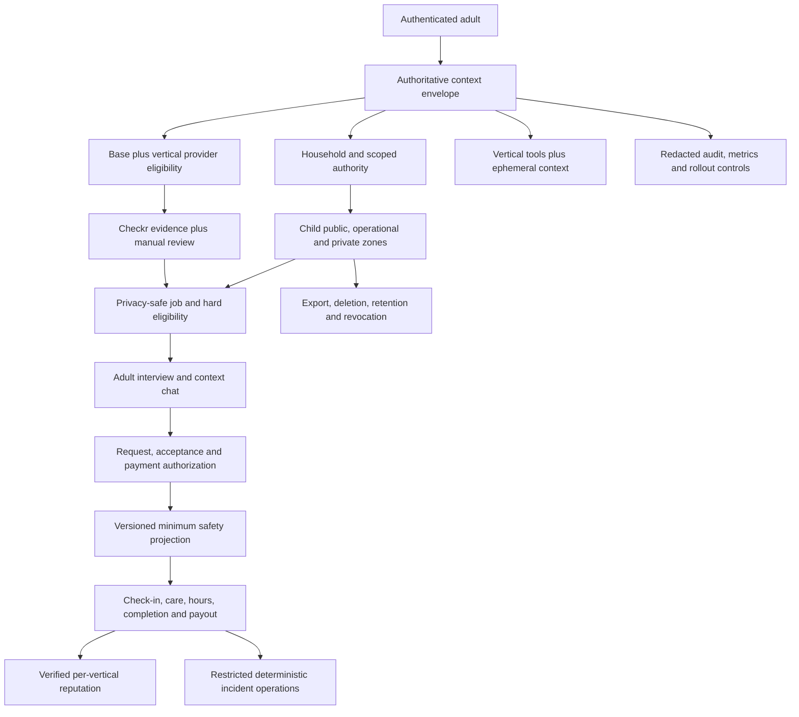

# feat: Implement The Verified Childcare Marketplace And Evia Vertical Coordination

## Goal Capsule

| Field | Value |
|---|---|
| Objective | Add an adult-operated childcare marketplace to CareConnecxx that reuses the current adult-account and marketplace foundation while enforcing child-specific authority, privacy, screening, messaging, safety, and incident policy end to end. |
| Product boundary | Parents and authorized adults find, interview, book, pay, and coordinate with individual adult babysitters and nannies. Children do not hold accounts, receive direct notifications, or converse with Evia. Licensed facilities, preschools, camps, and agencies remain outside this release. |
| Code authority | Live source at `feff7ecc4690204f158f4f796d03f1c675334e86`. `context/project-overview.md`, `functions/src/data/contract.ts`, deployed Firebase configuration, and current code outrank older prose. U0 refreshes this authority before implementation if the branch moves. |
| Product Contract preservation | Existing R1-R40 behavior from the superseded marketplace plan is preserved and clarified. R41-R63 close platform-wide messaging, lifecycle, reputation, administration, migration, and abuse-control gaps found in the live source. |
| Trust model | Stripe Identity provides adult identity evidence. Checkr provides configured screening evidence. CareConnecxx owns guardian authority, provider eligibility, per-vertical visibility, booking authorization, access revocation, incident handling, and every user-facing claim. |
| Execution profile | React/Vite, Firebase Auth, Firestore, Cloud Storage, Firebase Functions, Firebase Hosting, Checkr, Stripe Identity, Stripe Connect and payments, Linq SMS/iMessage, web chat, and the current Evia agent/tool loop. |
| Stop conditions | Stop before collecting production child data or enabling discovery if jurisdiction approval, insurance, business pricing, guardian policy, Storage and Firestore isolation, screening configuration, incident operations, deletion/export, sandbox payment proof, migration rehearsal, monitoring, or rollback proof is incomplete. |
| Tail ownership | Implementation owns code, tests, schema migrations, Rules, indexes, Storage policy, provider sandbox proof, staged Firebase deployment, production-safe synthetic smokes, monitoring, rollback, and exact Git/Firebase deployment evidence. |

---

## Product Contract

### Summary

CareConnecxx will support `senior` and `child` care verticals in one adult marketplace without treating a child as a platform user. Shared adult accounts and marketplace infrastructure remain reusable. Recipient data, authority, screening, safety, messaging disclosure, incident handling, AI context, retention, and visibility are independently enforced per vertical.

The implementation must change every shared reader and writer that could consume a child record. Adding childcare screens or fields without classifying chat, notifications, recurring jobs, reviews, calendars, swaps, refunds, proactive messages, Storage, deletion, support, and administration is not a valid partial launch.

### Problem Frame

The current platform is deeply senior-specific. It uses `senior_profiles`, senior-shaped onboarding, pairwise chat rooms, broad caregiver ratings, direct browser mutations, senior-oriented scheduled messages, broad admin access, and Auth-only account deletion. Childcare can reuse mature infrastructure only after those shared seams become server-authoritative and vertical-aware.

The previous plans established the correct child/privacy and Evia direction but did not assign every live consumer or define canonical household ownership, Storage, deletion/export, vertical chat, review aggregation, least-privilege administration, and migration cutover. This plan closes those gaps and becomes the single implementation source.

### Actors

- A1. **Primary parent or guardian:** An authenticated adult with current identity evidence and server-verified authority for one or more children.
- A2. **Authorized household adult:** An authenticated adult with explicit recipient-scoped permissions for viewing, scheduling, messaging, pickup, emergency, cancellation, or payment actions; no permission is inferred from household membership.
- A3. **Payer:** An authenticated adult authorized to fund, approve, dispute, or refund a booking. Payer authority may differ from guardian or scheduling authority.
- A4. **Childcare caregiver:** An adult provider with an approved childcare vertical profile, current required evidence, and jurisdiction eligibility.
- A5. **Dual-vertical caregiver:** A provider whose common adult profile is shared while senior and childcare approval, services, ratings, screening, and visibility remain independent.
- A6. **Trust and Safety reviewer:** A least-privilege operator who reviews childcare qualifications, screening evidence, authority exceptions, incidents, suspensions, and adverse-action state.
- A7. **Billing or support operator:** A least-privilege operator who resolves payment or support work without automatic access to child safety, custody, pickup, health, or incident evidence.
- A8. **Evia:** An adult-facing coordinator whose context, tools, memory eligibility, and claims are bound to authoritative actor, vertical, recipient, objective, and evidence state.
- A9. **Child:** A care recipient and prohibited platform actor. A child receives no Auth account, direct SMS, push, email, payment request, or Evia conversation.
- A10. **System operator:** The owner of rollout flags, monitoring, data lifecycle, incident escalation, migration, backup/restore, and emergency-off controls.

### Requirements

**Vertical, household, and compatibility**

- R1. `careVertical` (typed `CareVertical`) is a required server-owned field on every new recipient, objective, job, application, match, interview, booking, appointment, shift, review, conversation, notification context, payment ledger reference, incident, audit event, and operational projection.
- R2. Legacy records created before the migration cutoff may resolve an absent vertical to `senior`. New or rewritten records missing a valid vertical fail closed; they never silently become senior. For the browser-writable shared collections (`appointments`, `chatRooms`, `reviews`, `booking_requests`), fail-closed is enforced immediately in all Admin-SDK/server writers; the Rules-level `careVertical` requirement activates only after a recorded Hosting bake window, with an interim onCreate backfill trigger, so live pre-deploy senior SPA sessions never break and no browser write silently lands as senior.
- R3. One canonical `households/{householdId}` record owns recipient membership and adult relationships. The primary adult UID may seed the ID, but phone, surname, payment method, family group, or shared address never proves membership.
- R4. `senior_profiles` remains the canonical senior store. Childcare uses `child_profiles`; neither collection is migrated into or overloaded by the other.
- R5. Every child action resolves an authoritative tuple of actor, account role, household, vertical, recipient, permission scope, objective or booking, and policy version before reading private data or exposing tools.
- R6. `guardian_authorities` is the authority source. Any child-document guardian list is a transactionally maintained projection and cannot independently grant access.
- R7. A household may contain multiple seniors and children. Recipient access, guardian authority, scheduling, pickup, messaging, payment, and emergency permissions are independently scoped and revocable.
- R8. A complete source-and-consumer manifest classifies every shared collection reader, writer, trigger, scheduler, browser surface, agent tool, rule, index, export, and admin view as shared-safe, senior-only, child-specific, migrated, or disabled.

**Child data, Storage, and lifecycle**

- R9. Only authenticated adults may create or control child profiles. No child Firebase Auth account, phone ownership, direct Evia thread, or child-facing route is created.
- R10. Child profiles store the minimum operational data needed for care and matching. Exact birth date, address, emergency contacts, custody evidence, pickup details, detailed health data, and safety notes are separated from public and broadly consumed records.
- R11. Child-sensitive mutations use authenticated backend services. Browser clients do not directly write child profiles, authorities, childcare jobs, booking safety, reviews, incidents, or restricted files.
- R12. Child files use dedicated Cloud Storage paths with owner, authority, assigned-provider, reviewer-role, expiry, content-type, size, and revocation enforcement. Private child files do not rely on permanent download-token URLs.
- R13. Retention is purpose-specific and versioned for child profile, authority, booking safety, messages, incidents, audit, analytics, and provider evidence. TTL or cleanup workers have retry, orphan, legal-hold, and proof-of-deletion behavior.
- R14. An authenticated data request can export, correct, revoke, or delete eligible child and adult data while preserving only approved financial, dispute, safety, and legal records. Stripe Identity redaction and Storage cleanup are tracked to completion.
- R15. Deleting Firebase Auth alone is never presented as account deletion. Account deletion is a server-owned workflow with reauthentication, dependency checks, tombstones where required, provider cleanup, and final status.
- R16. Child aging, household transfer, guardian revocation, authority expiry, and account recovery have explicit state transitions. No recipient is silently converted into an adult account.

**Identity, consent, authority, and abuse controls**

- R17. Stripe Identity verifies the acting adult, not parenthood or guardian authority. Identity, guardian authority, consent, subscription entitlement, payment readiness, and recipient permission are separate gates.
- R18. Guardian authority stores source, scope, subject, reviewer or attestation, effective time, expiry, revocation, policy version, and audit references. High-risk changes require recent authentication and high-friction confirmation. Recent authentication is verified from the ID token's server-checked `auth_time` claim, never a client-reported or Firestore-stored timestamp. Removing or reducing a co-guardian's existing authority requires notice to the affected adult, a dispute-hold state, and an operator review path; no adult can silently lock out another adult who holds current authority.
- R19. Custody/contact restrictions, authorized pickup, exact address, emergency contacts, payer changes, and guardian changes invalidate stale safety projections, links, sessions, notifications, and pending objectives immediately.
- R20. Every adult who receives product messages has verified adult contact ownership, channel consent, opt-out state, and disclosure scope. A child phone number is never accepted as a notification target.
- R21. Sensitive callables enforce Auth, App Check where supported, rate limits, idempotency, replay controls, object-level authorization, input bounds, and enumeration-safe errors.
- R22. Callback state binds the authenticated user, source objective, provider session, expected state, expiry, and one-time consumption. URL parameters do not grant authority or select a child.
- R23. Terms, privacy, screening, biometric/identity disclosure, communication consent, guardian attestation, and childcare policy acceptance are versioned consent receipts, not mutable booleans.

**Provider profile, screening, and eligibility**

- R24. A caregiver has one reusable adult base profile and namespaced `senior` and `child` vertical profiles. Childcare fields never overwrite senior services, rates, approval, or reputation.
- R25. Childcare profiles include adult-age evidence, supported age bands, services, experience, references, required credentials, availability, rates, transport capability, limitations, jurisdiction, and accepted policy version.
- R26. Childcare screening policy is independently configured and evaluated per vertical. Founder decision 2026-07-22: the existing Checkr base package is shared by both verticals; the shared package ID is encoded as the childcare-accepted package in policy, while evaluation (exact component, jurisdiction, identity, report age, expiry, policy version), approval, renewal, and adverse-action state remain fully independent per vertical.
- R27. Checkr states remain evidence states. `clear` is not a safety guarantee or automatic public approval; `consider`, dispute, exception, and adverse-action paths require the approved human/legal process.
- R28. Childcare visibility requires complete profile, required credentials, current screening components, manual approval, current policy acceptance, jurisdiction eligibility, no active suspension, and any required membership or payout readiness.
- R29. Provider eligibility is rechecked at discovery, contact, application, interview, booking request, acceptance, substitution, check-in, and payout-sensitive transitions.
- R30. Public provider projections expose only approved vertical attributes and derived evidence labels. Raw reports, candidate PII, identity files, internal reasons, and narrative records remain restricted.
- R31. Expiry, revocation, policy change, adverse state, or emergency-off removes childcare discovery, contact, and bookability without changing still-valid senior eligibility.

**Jobs, discovery, interviews, booking, care, and payment**

- R32. Childcare jobs use auto-ID `job_posts` and typed child requirement projections. They never write the legacy singleton `job_postings/{clientUid}` mirror.
- R33. Public jobs and applications expose age bands, approximate area, schedule, rate, requirements, and safe abstractions only. They exclude child names, exact address, custody, pickup, emergency contacts, and detailed health facts.
- R34. Hard eligibility runs before scoring, notification, application, interview, or recommendation. AI ranking receives only eligible candidates and approved features.
- R35. Interviews are adult-to-adult, vertical-scoped, and gated by identity, authority, provider eligibility, and disclosure policy. Meeting links, calendar events, email, and SMS contain no child-sensitive data.
- R36. A childcare booking is confirmed only after family request, provider acceptance, conflict check, current family/provider gates, payment authorization, persisted state, and authoritative postcondition evidence.
- R37. One-time, recurring, overnight, sibling, extension, cancellation, no-show, replacement, callout, swap, and transport flows use typed vertical adapters and revalidate eligibility at every actor change.
- R38. The assigned eligible caregiver receives only the current booking's minimum versioned safety projection. Access is time-bounded and revoked on cancellation, substitution, expiry, authority change, or incident hold.
- R39. Check-in, check-out, location, task completion, hours, corrections, cash confirmation, refunds, disputes, chargebacks, capture, transfer, payout, and reconciliation remain idempotent and auditable.
- R40. Pricing, subscription entitlement, caregiver fees, screening fees, sibling rates, cancellation/refund rules, taxes, and payout behavior are server-configured and approved before pilot activation; no childcare amount is inferred from senior defaults.

**Messaging, notifications, reviews, and reputation**

- R41. Family-provider chat is vertical- and context-scoped. A pair who coordinates senior and childcare work receives separate authorized conversations; participant pair alone is not a conversation key.
- R42. Conversation creation, participant changes, disclosure state, deletion, and access revocation are server-owned. Pre-booking messages cannot disclose restricted child data; confirmed-booking safety data remains outside generic chat history.
- R43. Push, SMS, email, calendar, and in-app notifications use audience-safe templates and fetch sensitive detail only after authenticated access. Lock-screen and email subject text contains no child name, exact address, custody, health, or incident detail.
- R44. Reviews are created server-side only by booking participants after verified completion, once per reviewer and booking, and stamped with vertical and recipient-safe context.
- R45. Ratings, reliability, cancellation, response, completion, repeat-booking, and review aggregates are calculated per vertical. Cross-vertical history may be labeled separately but cannot imply childcare qualification.
- R46. Favorites, care teams, recent providers, public profiles, search, calendars, histories, summaries, and dashboards preserve vertical and recipient context and never deduplicate away distinct senior/child relationships.

**Evia and AI boundary**

- R47. Signup carries independent role, vertical, and recipient intent from `/start` through `web_onboarding_sessions`, `agent_sessions`, Linq/web ingress, objective creation, and final canonical persistence.
- R48. Unclassified inbound is a real fail-closed state. It may classify role/vertical but cannot read recipient data, initialize general memory, expose recipient tools, or retroactively synchronize earlier turns.
- R49. Evia receives an authoritative actor/vertical/recipient/objective envelope before prompt construction or tool selection. The model cannot override that envelope from user or stored text.
- R50. Childcare context is an ephemeral minimum projection. Child facts, safety data, custody, pickup, and childcare objectives do not enter Zep, learned facts, memory files, generic summaries, proactive reflection, training datasets, or evaluation captures.
- R51. Tool filtering applies authenticated role, vertical, authority, action risk, provider health, objective pack, and intent in that order. Unknown child-context tools fail closed.
- R52. Childcare actions use plan-act-verify semantics and authoritative evidence before Evia claims booked, changed, accepted, paid, sent, completed, or escalated.
- R53. Injury, missing child, suspected abuse, unsafe pickup, custody conflict, identity mismatch, serious incident, or immediate danger follows deterministic policy and human ownership. Model text cannot suppress, investigate, or complete the escalation.
- R54. Every scheduled, triggered, or proactive AI source is classified. Senior health/care-plan jobs skip child records; child-safe sources require approved templates, context, budgets, dedupe, and memory-denial behavior.

**Administration, compliance, observability, and rollout**

- R55. Child safety and incident access uses least-privilege operator roles for Trust and Safety, billing, support, screening, incident response, and system administration. Broad `isAdmin` alone does not grant every child-sensitive read.
- R56. Sensitive operator access requires reason, recent authentication where appropriate, actor identity, object scope, timestamp, and immutable audit. Support impersonation or silent household switching cannot grant child access.
- R57. Logs, analytics, alerts, traces, error payloads, provider metadata, exports, and model/eval telemetry prohibit raw child PII, safety notes, exact address, custody, pickup, identity images, and screening narratives.
- R58. Before each state launch, approved counsel and operations record marketplace, childcare licensing, screening, fair-chance/FCRA, mandated-reporting, child privacy, worker classification, tax, insurance, cancellation, emergency, and data-retention requirements in versioned policy.
- R59. Firestore and Cloud Storage deny new child paths by default. Rules tests cover owner, authorized adult by scope, assigned caregiver, reviewer role, billing/support denial, revoked, expired, cross-household, cross-child, and cross-vertical access.
- R60. Every compound query is registered in `firestore.query-contracts.json`, covered by additive indexes, and exercised in emulator or staging before its consumer is enabled.
- R61. Childcare launches behind server-authoritative jurisdiction and cohort flags with emergency-off, write-disable, discovery-disable, synthetic canaries, observation windows, and reversible migration stages. Childcare flags are Firestore-resident and runtime-flippable with short-TTL caching — never `process.env` values requiring a functions redeploy; emergency-off must take effect without a deploy.
- R62. Deployment proof includes Git SHA, Firebase project, Functions update times, Hosting release, Rules, Storage Rules, indexes, secrets/config presence, scheduler state, migration counts, smoke results, monitoring health, and rollback proof.
- R63. No production enablement occurs while any source consumer is unclassified, required legal/business decision is unresolved, provider sandbox state is unproven, critical privacy test is skipped, data deletion is incomplete, or a red release metric is active.

### Key Flows

- F1. **Parent starts childcare enrollment:** Select family and childcare, verify phone and adult contact, create a vertical-bound objective, complete identity/guardian/consent, create a secure child profile, and resume through authenticated state.
- F2. **Authorized adult joins:** Receive an adult invite, authenticate independently, accept consent, receive explicit recipient scopes, and verify that household membership alone grants nothing.
- F3. **Existing caregiver adds childcare:** Load reusable adult profile and verified evidence, collect only missing childcare fields, complete childcare screening/manual review, and preserve senior approval independently.
- F4. **Family posts and interviews:** Select authorized children, create a privacy-safe job, hard-filter providers, review evidence-backed matches, and conduct an adult-only interview without child-sensitive disclosure.
- F5. **Request and confirm booking:** Recheck actor, recipient, provider, schedule, jurisdiction, entitlement, and payment; persist request; receive caregiver acceptance; confirm exactly once; create a versioned safety projection.
- F6. **Coordinate care:** Use vertical-scoped chat and notifications, reveal minimum safety data only to current participants, process approved updates, check in/out, complete hours, capture payment, and request verified reviews.
- F7. **Replace or cancel caregiver:** Revoke old access first, revalidate the replacement, require appropriate adult authorization, create a new projection, and reconcile payment/notifications without duplicate effects.
- F8. **Manage authority or pickup:** Require recent authentication and high-friction confirmation, update canonical authority, invalidate all derived access, notify approved adults without exposing restricted detail, and audit the action.
- F9. **Handle serious incident:** Classify deterministically, create one restricted case, preserve evidence, deliver approved emergency direction, alert the correct operator, enforce holds, and prevent model improvisation.
- F10. **Delete or export data:** Reauthenticate, resolve legal holds, export authorized data, revoke access, delete eligible Firestore/Storage/AI/provider data, redact Stripe Identity when approved, and provide completion status.
- F11. **Operate dual verticals:** Switch recipient/vertical explicitly across profiles, search, jobs, bookings, chat, calendars, reviews, and Evia without cross-loading data or approval.
- F12. **Roll out and roll back:** Rehearse migration, deploy additive infrastructure dark, run sandbox and synthetic proof, enable one jurisdiction/cohort, observe, and disable childcare without altering senior behavior.

### Acceptance Examples

- AE1. A Stripe-verified adult without guardian authority cannot create a child booking or read private child data.
- AE2. A child never receives an account, direct SMS, push, email, payment request, or Evia conversation.
- AE3. A new childcare record without `careVertical` is rejected; a verified pre-cutover senior record without it remains readable as senior.
- AE4. A family member invited through the current family-group flow gains no child authority until an explicit authority record exists.
- AE5. A pair coordinating senior care and childcare receives separate chat contexts; neither context exposes the other's messages or recipient data.
- AE6. Revoking or replacing a caregiver removes safety, file, chat, and exact-address access before the replacement receives access.
- AE7. A direct Storage URL or SDK read by an unrelated authenticated user cannot retrieve a child file.
- AE8. Deleting an account starts a tracked lifecycle workflow rather than only deleting Auth; eligible child files and provider identity references reach a provable terminal state.
- AE9. A senior-approved caregiver without current childcare approval remains visible for senior care and unavailable for childcare.
- AE10. Checkr `consider`, dispute, missing component, wrong package, expired report, and policy mismatch never auto-approve or auto-reject publicly.
- AE11. Childcare review and reliability totals exclude senior reviews unless shown as separately labeled cross-vertical history.
- AE12. A child job exposes age bands and approximate area but not names, exact address, allergies, custody, pickup, or emergency contacts.
- AE13. A family requesting transport receives only providers with current required transport evidence and jurisdiction capability.
- AE14. Payment authorization before caregiver acceptance remains pending and is never described as confirmed care.
- AE15. Duplicate booking, webhook, callback, message, review, refund, and payout events converge to one authoritative effect.
- AE16. A childcare appointment is ignored by senior health trends, care-plan reminders, medication flows, and senior memory jobs.
- AE17. A lock-screen notification for childcare contains generic adult-safe text and fetches detail only after authenticated authorization.
- AE18. A billing operator can reconcile a payment without reading custody or child safety details; a Trust and Safety reviewer sees only approved incident/screening scope.
- AE19. A malicious child profile, message, job note, or provider bio cannot change prompt policy, authority, tool access, eligibility, or booking approval.
- AE20. A custody, pickup, or authority change invalidates stale callbacks, objectives, links, safety projections, and pending high-risk actions.
- AE21. An existing caregiver adding childcare is not asked again for unchanged name, payout, or common profile data.
- AE22. Childcare-specific qualifications never enter general Evia memory, even when discussed in a caregiver thread.
- AE23. An unclassified cold inbound writes no AI memory and accesses no senior or child recipient tool.
- AE24. A serious incident creates one restricted case and deterministic operator alert, without notifying a suspected unsafe party through a generic broadcast.
- AE25. Every shared collection consumer appears in the manifest and has a test, explicit skip, or documented disablement before enablement.
- AE26. Firestore and Storage emulator suites deny cross-household, cross-child, revoked, expired, broad-admin, and unassigned-provider access.
- AE27. Migration rehearsal reports old, migrated, rejected, and unresolved counts; unresolved records block production enablement.
- AE28. A complete synthetic trajectory reaches identity-ready child profile, job, match, interview, booking, acceptance, payment, care completion, and review without production provider effects.
- AE29. Emergency-off removes childcare discovery, contact, mutation, and proactive messaging while leaving senior flows operational.
- AE30. Production proof records one Git SHA and matching Functions, Hosting, Rules, Storage Rules, indexes, scheduler, configuration, and smoke evidence.

### Scope Boundaries

**Included**

- Individual adult babysitter and nanny marketplace in approved US pilot jurisdictions.
- Adult family/provider enrollment, profiles, screening, jobs, matching, interviews, booking, communication, care operations, payment, reviews, incidents, Evia, administration, data lifecycle, and rollout.
- One-time and recurring care, sibling bookings, and transport only when explicitly enabled by jurisdiction and evidence policy.

**Deferred**

- Licensed facilities, daycare centers, preschools, camps, agencies, and facility inspection/licensing workflows.
- Overnight care, medication administration, infant care, and specialized-needs categories until each has an approved credential/policy package; a reviewed pilot may enable a category explicitly — none is enabled by implication. Booking adapters for these flows may ship dark, but category enablement stays closed.
- Payroll, household-employer tax filing, W-2/Schedule H automation, benefits, or worker-classification determinations.
- International jurisdictions, currencies, screening, identity, and payouts.
- Child-facing application experiences or direct minor communications.
- General AI memory for child/family content.
- Medical diagnosis, medication recommendation, custody adjudication, abuse investigation, or autonomous emergency decision-making.

### Success Criteria

- Zero unauthorized child, custody, pickup, exact-address, safety, or incident disclosures in deterministic and adversarial coverage.
- Zero child facts written to general AI memory, learned facts, generic summaries, proactive reflection, or eval/training stores.
- Every new child-sensitive write is server-authorized, idempotent, auditable, and covered by Rules or backend policy tests.
- Every shared consumer is classified and senior regressions pass before childcare enablement.
- At least 95% of repeated synthetic full-funnel trajectories complete without dead ends; all safety, authority, payment, and duplicate-effect cases pass at 100%.
- Emergency-off, migration rollback, data deletion, provider expiry removal, and incident drills meet the approved runbook thresholds.

---

## Planning Contract

### Key Technical Decisions

- KTD1. **Use one adult marketplace with an explicit vertical boundary.** Shared infrastructure accepts typed context; child recipient, authority, screening, safety, memory, and incident contracts remain separate.
- KTD2. **Create one canonical household.** `households` and scoped membership replace inference and gradually absorb the current split family sources; compatibility readers remain during migration.
- KTD3. **Keep authority singular.** `guardian_authorities` grants access. Embedded ID lists are derived caches with version checks, never independent authorization.
- KTD4. **Allow legacy missing vertical only before a recorded cutoff.** New records require `careVertical`; this prevents malformed childcare data from falling into senior paths.
- KTD5. **Make the context envelope server-owned.** Actor, role, household, vertical, recipient, permission, objective/booking, policy, and memory eligibility are resolved before prompts, queries, tools, or mutations.
- KTD6. **Use authenticated callables for child-sensitive operations.** Direct browser reads are limited to safe projections; direct sensitive writes are removed.
- KTD7. **Separate child data zones.** Public/search, operational, private safety, restricted incident, provider evidence, and audit data have different schemas, rules, retention, and operator roles.
- KTD8. **Treat Storage as a separate security boundary.** Private files use dedicated paths, short-lived authorized delivery, revocation, lifecycle cleanup, and emulator coverage.
- KTD9. **Use one base provider profile plus namespaced vertical profiles.** Common adult fields are reused; services, rates, credentials, screening, approval, and reputation are independent per vertical.
- KTD10. **Treat external providers as evidence systems.** Stripe and Checkr IDs/statuses are stored minimally; raw identity and report content remains provider-side; webhooks update evidence but never directly approve public access.
- KTD11. **Hard-filter before ranking or notification.** Backend eligibility precedes candidate retrieval output, scoring, job invites, applications, and interviews.
- KTD12. **Reuse booking/payment ledgers through typed adapters.** Childcare uses existing IDs and idempotency while blocking senior-only assumptions and direct browser mutations.
- KTD13. **Version booking safety projections.** Each projection is immutable, minimum, booking-bound, and access-versioned; changes produce a replacement version and revoke the old one.
- KTD14. **Key conversations by vertical and context.** Participant pairs are insufficient. Chat authorization follows booking/objective state, while safety data stays outside generic messages.
- KTD15. **Compute reviews and reliability per vertical.** Global caregiver reputation becomes a derived display option, not the eligibility source for childcare.
- KTD16. **Filter notifications at the data source.** Sensitive detail is fetched after authentication; lock screens, email subjects, calendar titles, analytics, and provider metadata remain generic.
- KTD17. **Keep child facts out of general AI memory.** Childcare uses ephemeral canonical projections. Memory eligibility is decided before Zep initialization, transcript persistence, fact extraction, files, summaries, proactive jobs, or eval capture.
- KTD18. **Extend the current Evia loop.** Current care situation, objective ledger, checkpoints, evidence, tool packs, and ingress paths gain typed vertical/recipient support; no parallel child agent is created.
- KTD19. **Classify every scheduler and trigger.** Shared collection consumers must explicitly support child, skip child, or remain disabled; source scanning enforces the manifest.
- KTD20. **Use least-privilege operator roles.** Trust and Safety, incident, screening, billing, support, and system administration have separate callable and Rules authorization.
- KTD21. **Use tracked lifecycle workflows.** Deletion, export, redaction, orphan cleanup, legal hold, and provider cleanup are durable state machines with retries and terminal proof.
- KTD22. **Require App Check and abuse controls on sensitive entry points.** Authentication alone does not prevent automated enumeration, replay, or costly identity/screening abuse. App Check is greenfield in this repo: no client `initializeAppCheck` exists and callables use the v1 API (manual `context.app` verification). U2 creates a shared `requireAppCheck` helper and registers the client provider in `lib/firebase.ts`; enforcement scopes to new childcare callables first so existing senior clients without tokens keep working. Console provider registration and e2e debug-token strategy are founder-run U1/deployment prerequisites.
- KTD23. **Use transactional state plus outbox effects.** Booking, authority, incident, notification, and payment state changes commit once; external sends and provider actions retry from durable effect records.
- KTD24. **Keep business policy server-configured.** Pricing, entitlement, fees, transport, screening, cancellation, and jurisdiction availability are reviewed configuration, not client constants.
- KTD25. **Deploy additive and dark before enablement.** Schemas, rules, indexes, code, and monitoring land with flags off; migration and synthetic proof precede cohort enablement.

### High-Level Technical Design

### Authoritative Context Envelope

Every child-sensitive service accepts or resolves the following server-side values and rejects contradictions:

- `actorUserId`, adult account role, recent-auth state, channel, and consent status.
- `householdId`, `careVertical`, typed recipient reference, and permission scopes.
- Objective, job, interview, booking, shift, conversation, or incident context ID.
- Jurisdiction policy version, feature-flag cohort, and provider eligibility version.
- Data classification, disclosure phase, memory eligibility, source event, and idempotency key.

### Core Data Contracts

- `households/{householdId}`: canonical adult-owned household, status, primary adult, policy version, and derived recipient/vertical summaries.
- `household_memberships/{membershipId}`: adult-to-household role and explicit recipient/action scopes; no child data.
- `guardian_authorities/{authorityId}`: authoritative adult-child relationship, source, scope, state, review, effective/expiry/revocation, and policy version.
- `child_profiles/{childId}`: preferred display label, age band, household, broad care categories, operational state, derived authority version, and retention policy.
- `child_profiles/{childId}/private/safety/versions/{version}`: restricted minimum safety source data, change provenance, current version, and retention controls.
- `caregivers/{uid}/vertical_profiles/{vertical}`: vertical services, age bands, experience, rates, availability overrides, credentials, limitations, policy acceptance, and profile completeness.
- `caregivers/{uid}/screenings/{vertical}`: package, components, jurisdiction, provider references, status, expiry, review, dispute/adverse-action, and eligibility version.
- `publicCaregiverProfiles/{uid}`: approved safe base fields plus derived per-vertical visibility, evidence labels, services, and reputation projections.
- `job_posts/{jobId}` and `job_applications/{applicationId}`: explicit vertical, household, recipient requirement projection, disclosure phase, and eligibility version.
- `booking_requests/{bookingId}`, `appointments/{appointmentId}`, `shifts/{shiftId}`: explicit vertical, typed recipient references, actor/eligibility versions, state-machine version, and payment/notification correlation IDs.
- `childcare_booking_safety/{bookingId}/versions/{version}`: immutable minimum projection and current participant-access version.
- `chatRooms/{roomId}`: context key, vertical, booking/interview/objective reference, participants, disclosure phase, access version, retention, and safe summary; generic messages contain no safety projection.
- `reviews/{reviewId}` and provider reputation projections: booking-bound reviewer identity, vertical, idempotency, moderation state, and derived per-vertical aggregates.
- `childcare_incidents/{incidentId}`: restricted category, booking/recipient references, reporter, evidence references, case owner, holds, status, notifications, and immutable audit.
- `consent_receipts/{receiptId}`: adult, policy type/version, channel, source, timestamp, and revocation where applicable.
- `data_lifecycle_requests/{requestId}`: export/delete/redact scope, legal holds, provider tasks, retries, terminal proof, and retained-record reasons.
- `jurisdiction_care_policies/{state}` and server flags: approved services, screening, credentials, pricing references, disclosures, escalation contacts, and rollout mode.

### System-Wide Consumer Rule

U0 creates `docs/architecture/childcare-consumer-manifest.md` and a machine-readable contract. Every reader/writer of `users`, `senior_profiles`, `child_profiles`, `caregivers`, `publicCaregiverProfiles`, jobs, applications, interviews, booking requests, appointments, shifts, hours, reviews, chat rooms, threads, notifications, payments, audits, memory, and incidents must name one disposition:

1. Shared and vertical-aware through a typed adapter.
2. Senior-only with an explicit child skip and characterization test.
3. Child-specific with server authorization and privacy tests.
4. Legacy compatibility reader removed after migration.
5. Disabled before childcare enablement.

### Sequencing

1. U0 source freeze, consumer manifest, compatibility characterization, and migration contract.
2. U1 jurisdiction, legal, insurance, business pricing, provider configuration, and release policy.
3. U2-U3 household/authority, child data zones, Storage, and lifecycle before production child collection.
4. U4-U5 family/provider enrollment and eligibility while discovery remains disabled.
5. U6 hard-eligible jobs, applications, interviews, discovery, and matching.
6. U7-U9 booking, operations, payment, reputation, conversation, and notifications.
7. U10 Evia ingress, tools, memory denial, scheduled/trigger classification, and incident handoff.
8. U11-U12 complete web/admin workflows and least-privilege operations.
9. U13 observability, privacy assertions, evals, canaries, and data reconciliation.
10. U14 migration rehearsal, additive deploy, dark production smokes, pilot enablement, observation, and rollback proof.

### Risks And Mitigations

| Risk | Severity | Mitigation |
|---|---|---|
| Malformed child record enters a senior path | Critical | Legacy cutoff plus new-write rejection, schema assertions, manifest tests, and reconciliation. |
| Child data leaks through chat, notifications, files, logs, prompts, or scheduled jobs | Critical | Data zones, context chat, generic notifications, Storage isolation, source redaction, memory denial, and consumer manifest. |
| Authority cache drifts from canonical authority | Critical | Singular authority source, transactional projection/version, action-time recheck, and revocation fan-out. |
| Broad admin or support role reads child safety data | Critical | Scoped operator roles, reason-for-access, recent auth, Rules/callable denial tests, and audit review. |
| Checkr or Stripe state is treated as platform approval | Critical | Evidence-only adapters, manual policy decision, truthful copy, webhook idempotency, and provider sandbox tests. |
| Appointment or payment legacy consumer assumes senior fields | Critical | Typed adapters, shared-consumer inventory, characterization tests, additive migration, and dark rollout. |
| Direct browser write bypasses child policy | Critical | Callable-only sensitive paths, Rules deny, App Check, and browser negative tests. |
| Account deletion leaves child or identity data orphaned | Critical | Durable lifecycle workflow, provider redaction, Storage scan, legal-hold matrix, retries, and terminal proof. |
| Pricing or jurisdiction policy is guessed during implementation | High | U1 blocks activation until approved configuration exists; no hard-coded childcare defaults. |
| Incident workflow alerts an unsafe party or relies on model judgment | Critical | Deterministic category routing, restricted notification graph, case ownership, evidence holds, and drills. |
| An adult with authority locks out a legitimate co-guardian through unilateral revocation | High | R18 notice, dispute-hold state, operator review path, high-friction confirmation, and revocation audit. |
| Two overlapping plans produce conflicting changes | High | This artifact supersedes both older plans and owns all implementation traceability. |

---

## Implementation Units

### Unit Index

| Unit | Title | Primary files | Depends on |
|---|---|---|---|
| U0 | Source freeze, consumer manifest, and migration contract | `functions/src/data/contract.ts`, manifest and migration files | None |
| U1 | Jurisdiction, legal, business, and release policy | feature flags, policy docs, legal pages | U0 |
| U2 | Household, memberships, guardian authority, and permissions | household/authority repositories and Rules | U0-U1 |
| U3 | Child profiles, Storage, retention, export, and deletion | child repositories, lifecycle workers, Rules | U2 |
| U4 | Family signup, identity, consent, and callback resume | `/start`, identity and onboarding bridge | U2-U3 |
| U5 | Provider vertical profile, screening, and eligibility | onboarding, Checkr, profile projection, admin review | U0-U1 |
| U6 | Jobs, applications, interviews, discovery, and matching | job callables, matching, interview flows | U2-U5 |
| U7 | Booking, appointment, availability, and safety projection | booking adapters and safety repository | U2-U6 |
| U8 | Shift operations, payments, refunds, reviews, and reputation | shift/payment/review modules | U7 |
| U9 | Context chat, notifications, email, SMS, and calendar privacy | chat and notification services | U6-U8 |
| U10 | Evia context, tools, memory denial, triggers, and proactive work | agent, MCP, Linq, memory and scheduler modules | U2-U9 |
| U11 | Family and caregiver web product surfaces | profile, dashboard, search, booking and settings components | U4-U10 |
| U12 | Admin RBAC, screening, incidents, billing, and support | admin callables, Rules and dashboards | U1-U10 |
| U13 | Observability, privacy assertions, evals, and canaries | audit, redaction, eval and monitoring modules | U2-U12 |
| U14 | Migration, staged deployment, production proof, and rollback | migrations, deploy scripts and runbook | U0-U13 |

### Flow-To-Unit Mapping

| Flow | Owning units |
|---|---|
| F1 Parent starts childcare enrollment | U4 (contracts from U2-U3) |
| F2 Authorized adult joins | U2 |
| F3 Existing caregiver adds childcare | U5 |
| F4 Family posts and interviews | U6 |
| F5 Request and confirm booking | U7 |
| F6 Coordinate care | U8-U9 |
| F7 Replace or cancel caregiver | U7-U8 |
| F8 Manage authority or pickup | U2 (surfaces in U11) |
| F9 Handle serious incident | U12 (Evia handoff in U10) |
| F10 Delete or export data | U3 |
| F11 Operate dual verticals | U10-U11 |
| F12 Roll out and roll back | U14 |

### U0. Source Freeze, Consumer Manifest, And Migration Contract

- **Goal:** Establish a current, mechanically checked baseline so no hidden senior-only consumer or stale plan reference survives into implementation.
- **Requirements:** R1-R8, R54, R60-R63; AE3, AE16, AE25, AE27, AE30.
- **Dependencies:** None.
- **Files:** `functions/src/data/contract.ts`, `types.ts`, `services/api.ts`, `functions/src/index.ts`, `firestore.rules`, `storage.rules`, `firestore.indexes.json`, `firestore.query-contracts.json`, `docs/architecture/childcare-consumer-manifest.md` (create), `functions/src/data/childcareConsumerManifest.ts` (create), `functions/src/data/childcareConsumerManifest.test.ts` (create), `functions/src/migrations/backfillCareVertical.ts` (create), `functions/src/migrations/backfillCareVertical.test.ts` (create), `scripts/audit-childcare-consumers.mjs` (create), `package.json`.
- **Patterns:** `functions/src/data/contract.ts`, existing migration modules, `tests/firestoreIndexCoverage.test.ts`, and current launch/parity source scans.
- **Approach:** Record clean source and deployed baselines; enumerate every shared collection and consumer; assign disposition, owner, required field behavior, query/index, test, rollout flag, and rollback. Define migration cutoff and schema version. Backfill legacy senior records idempotently in bounded batches with dry run, resume cursor, unresolved quarantine, before/after counts, and no child inference. Add CI audit that rejects unregistered consumers and new shared writes without explicit vertical handling.
- **Test Scenarios:** Clean/stale source; new unregistered consumer; legacy absent vertical; post-cutoff absent vertical; malformed vertical; dual records; dry-run/retry/resume; partial failure; deleted source; unresolved quarantine; index query requiring absent fields; migration rollback.
- **Verification:** Consumer audit passes with zero unclassified sources; migration emulator rehearsal converges under retries; senior characterization fixtures are captured before behavior changes.
- **Exit:** Every shared seam has an owner and disposition, current code references are exact, and migration can run and roll back without guessing.

### U1. Jurisdiction, Legal, Business, And Release Policy

- **Goal:** Turn legal, insurance, screening, pricing, retention, communication, and operational decisions into versioned server policy before child data collection.
- **Requirements:** R23-R31, R40, R57-R63.
- **Dependencies:** U0.
- **Files:** `functions/src/childcare/jurisdictionPolicy.ts` (create), `functions/src/childcare/jurisdictionPolicy.test.ts` (create), `functions/src/config/featureFlags.ts`, `functions/src/config/featureFlags.test.ts`, `functions/src/data/contract.ts`, `components/LegalDocs.tsx`, `components/pages/PrivacyPolicyPage.tsx`, `components/pages/TermsOfServicePage.tsx`, `components/TrustAndSafetyPage.tsx`, `components/HelpPage.tsx`, `components/FamilyFAQ.tsx`, `components/Subscription.tsx`, `services/stripeService.ts`, `docs/policies/childcare-jurisdictions.md` (create), `docs/policies/childcare-data-retention.md` (create), `docs/runbooks/childcare-launch.md` (create).
- **Patterns:** Current feature flags, Stripe price configuration, Checkr/MVR config, legal/help surfaces, and release runbooks.
- **Approach:** Define at least one pilot jurisdiction with approved service categories, caregiver age, screening components, credential/renewal rules (childcare screening renewal defaults to annual unless jurisdiction policy overrides), transport, guardian process, incident contacts, reporting obligations, insurance evidence, retention, terms/consent versions, family entitlement, caregiver fee, screening fee, sibling/overnight/cancellation/refund behavior, and emergency-off. Unknown or incomplete combinations remain disabled. Store approval references and effective versions server-side; never expose mutation to clients. Founder attested 2026-07-22 that jurisdiction/legal/insurance approvals are complete; U1 still records the concrete approval references (dates, document/counsel/insurer identifiers) in the versioned policy — attestation alone does not populate the policy record.
- **Test Scenarios:** Unknown/disabled state; expired policy; missing insurance/legal evidence; unsupported category; transport without MVR; pricing missing; policy version transition; stale consent; client policy mutation; emergency-off; read-only public projection.
- **Verification:** Policy tests fail closed for every incomplete combination; legal/business approval evidence is recorded outside client-editable state; public copy contains no safety guarantee.
- **Exit:** A pilot can be configured without code changes and cannot activate until every required approval reference is present.

### U2. Household, Memberships, Guardian Authority, And Permissions

- **Goal:** Create one adult household and recipient-scoped authorization model without treating current family-group membership as guardian proof.
- **Requirements:** R3-R7, R17-R23, R55-R59; AE1, AE4, AE18, AE20, AE26.
- **Dependencies:** U0-U1.
- **Files:** `types.ts`, `functions/src/data/contract.ts`, `functions/src/childcare/householdRepository.ts` (create), `functions/src/childcare/householdRepository.test.ts` (create), `functions/src/childcare/guardianAuthority.ts` (create), `functions/src/childcare/guardianAuthority.test.ts` (create), `functions/src/childcare/authorityCallables.ts` (create), `functions/src/childcare/authorityCallables.test.ts` (create), `functions/src/agents/familyGroupManager.ts`, `functions/src/agents/familyGroupManager.test.ts`, `functions/src/agents/careRecipients.ts`, `lib/firebase.ts`, `functions/src/childcare/requireAppCheck.ts` (create), `functions/src/childcare/requireAppCheck.test.ts` (create), `components/pages/JoinFamilyPage.tsx`, `components/FamilyManager.tsx`, `services/api.ts`, `functions/src/admin/requireAdmin.ts`, `firestore.rules`, `tests/firestoreRules.childcare.test.ts` (create), `firestore.query-contracts.json`, `firestore.indexes.json`.
- **Patterns:** Existing multi-senior household back-references and family invitations, but replace their authorization role with explicit scoped membership/authority.
- **Approach:** Define canonical household creation and stable ownership; migrate current family sources into compatibility projections; add adult invitation tokens bound to household, intended contact, expiry, nonce, and scope proposal; require invited adult authentication and consent; persist separate membership and guardian authority; implement permission checks for view, schedule, message, pickup, emergency, cancellation, payment, and management; fan out revocation to objectives, chat, safety, and pending actions transactionally/outbox-backed. Decide the phone-only family-member mapping explicitly: SMS-joined adults without Firebase Auth become provisional or excluded-until-authenticated memberships, never authorized ones. No child-vertical data may flow through the legacy phone-keyed `family_groups` readers during migration — a recycled phone number satisfies the current phone-in-list rule, so those readers stay senior-only until removed. Household Rules authorize via membership-record lookups only; a household ID derivable from a caller's (publicly visible) UID proves nothing. Co-guardian revocation follows the R18 notice/dispute-hold/review contract. This unit extends `resolveRecipientKey`/`describeWhoIsWho` in `functions/src/agents/careRecipients.ts` with the typed recipient union rather than creating a parallel recipient-resolution seam.
- **Test Scenarios:** Primary adult; invited adult; wrong contact; replayed/expired invite; household member without guardian authority; partial scopes; payer not guardian; guardian not payer; cross-child and cross-household; revoked/expired authority; concurrent change; family-group compatibility; admin/support denial.
- **Verification:** Firestore emulator and callable tests prove object-level scopes; revocation produces one access-version change and durable invalidation effects.
- **Exit:** Every adult action is attributable to a current explicit scope, and no current family-group shortcut can grant child access.

### U3. Child Profiles, Storage, Retention, Export, And Deletion

- **Goal:** Provide canonical child data zones and a complete privacy lifecycle across Firestore, Storage, external identity, messaging references, and AI state.
- **Requirements:** R9-R16, R57-R60; AE2, AE6-AE8, AE19, AE26.
- **Dependencies:** U2.
- **Files:** `types.ts`, `functions/src/data/childProfileRepository.ts` (create), `functions/src/data/childProfileRepository.test.ts` (create), `functions/src/childcare/childProfileCallables.ts` (create), `functions/src/childcare/childProfileCallables.test.ts` (create), `functions/src/childcare/childFileAccess.ts` (create), `functions/src/childcare/childFileAccess.test.ts` (create), `functions/src/privacy/dataLifecycle.ts` (create), `functions/src/privacy/dataLifecycle.test.ts` (create), `functions/src/scheduled/childcareLifecycleWorker.ts` (create), `functions/src/scheduled/childcareLifecycleWorker.test.ts` (create), `services/api.ts`, `services/documentUpload.ts`, `firestore.rules`, `storage.rules`, `tests/firestoreRules.childcare.test.ts`, `tests/storageRules.childcare.test.ts` (create), `firestore.indexes.json`, `firestore.query-contracts.json`, `firebase.json`.
- **Patterns:** Current senior repository, audit/action ledgers, and durable memory-operation workers. For file delivery, follow the short-lived Admin-SDK `getSignedUrl()` pattern in `functions/src/utils/mediaIntake.ts`, `functions/src/agents/interviewLinks.ts`, and `functions/src/agents/careMemory.ts` — never the legacy restricted caregiver-document paths, whose stored `getDownloadURL()` tokens permanently bypass Storage Rules (the exact anti-pattern R12 prohibits).
- **Approach:** Separate profile summary, operational care requirements, private safety versions, restricted incident references, and files. Use server-authorized uploads or short-lived access and eliminate permanent-token assumptions. Build export/delete/redact state machine with recent auth, authority check, legal holds, child scope, Firestore deletes/tombstones, Storage deletes, Stripe Identity redaction task, Linq/Evia reference cleanup, orphan scans, retries, and user-visible status. Define age-band recalculation and age-out behavior without exposing full DOB broadly.
- **Test Scenarios:** Create/read/update by authorized scope; unauthorized file SDK/direct URL; assigned caregiver current/expired; content type/size; malware scan failure; revocation during upload; export scope; legal hold; partial deletion retry; Stripe processing redaction; orphan file; deleted adult with another guardian; child ages out; no child Auth.
- **Verification:** Firestore and Storage emulator suites pass; lifecycle retries reach terminal status without deleting retained financial/audit evidence; orphan scan is clean.
- **Exit:** Child data has one canonical owner, minimum projections, restricted files, and provable export/deletion/revocation behavior.

### U4. Family Signup, Identity, Consent, And Callback Resume

- **Goal:** Carry role and vertical independently from `/start` through phone verification, first inbound, secure profile completion, and objective resume.
- **Requirements:** R17-R23, R47-R54; AE1-AE3, AE20, AE23.
- **Dependencies:** U2-U3.
- **Files:** `components/auth/onboarding/OnboardingFlow.tsx`, `components/auth/PhoneSignupPage.tsx`, `components/client/IdentityGateModal.tsx`, `components/client/IdentityCallback.tsx`, `components/client/childcare/ChildProfileFlow.tsx` (create), `components/client/childcare/ChildProfileFlow.test.tsx` (create), `services/stripeService.ts`, `services/api.ts`, `functions/src/index.ts`, `functions/src/stripe.ts`, `functions/src/stripeIdentity.childcare.test.ts` (create), `functions/src/linq/client.ts`, `functions/src/linq/webhooks.ts`, `functions/src/linq/webChat.ts`, `functions/src/linq/webChat.test.ts`, `functions/src/agents/onboardingContract.ts`, `functions/src/agents/onboardingConversation.ts`, `functions/src/agents/objectiveLedger.ts`, `functions/src/agents/turnPhaseCheckpoint.ts`, `firestore.rules`, `firestore.indexes.json`.
- **Patterns:** Current inbound-first web onboarding bridge, phone verification, Stripe Identity callback, objective ledger, and checkpoint resume.
- **Approach:** Add typed role/vertical/recipient intent to signup and bridge docs; keep unclassified inbound pending and memory-denied — this inverts the live always-initialize invariant: every `initializeZepOnFirstContact` call site in `functions/src/linq/webhooks.ts` (first contact, secondary family member, pending-consent opt-in, web bridge) and the deliberately widened lazy Zep self-heal must become memory-eligibility-aware, or childcare sessions leak into Zep; create family childcare objective on first authoritative child inbound; send authenticated identity/guardian/profile links; reuse one Stripe session per objective with idempotency; bind callback to authenticated actor/objective and consume once; resume from canonical state; keep exact private child data out of SMS, URL, metadata, logs, and onboarding tools. U4 and U5 both edit `onboardingContract.ts`/`onboardingConversation.ts`; execute them sequentially, never in parallel.
- **Test Scenarios:** Client/caregiver senior parity; parent childcare; ambiguous inbound; wrong role/vertical; processing/requires-input/canceled/verified identity; callback wrong user/replay/expiry; duplicate first inbound; multiple children; consent version change; opt-out; no child PII in bridge or Stripe metadata; App Check/rate limit.
- **Verification:** Focused web, callable, Linq, and objective tests pass; no senior question appears in child signup; no child fact enters AI memory.
- **Exit:** A verified authorized adult can securely complete and resume childcare enrollment, and every ambiguous or unauthorized path fails closed with useful remediation.

### U5. Provider Vertical Profile, Screening, And Eligibility

- **Goal:** Enroll and approve childcare providers independently while reusing verified adult base-profile work.
- **Requirements:** R24-R31, R47-R54; AE9-AE10, AE13, AE21-AE22.
- **Dependencies:** U0-U1.
- **Files:** `types.ts`, `functions/src/checkr.ts`, `functions/src/checkrApi.ts`, `functions/src/checkrApi.test.ts`, `functions/src/checkrBadNewsNotify.test.ts`, `functions/src/mvrConfig.ts`, `functions/src/childcare/screeningPolicy.ts` (create), `functions/src/childcare/screeningPolicy.test.ts` (create), `functions/src/utils/caregiverEligibility.ts`, `utils/caregiverEligibility.ts`, `functions/src/caregiverPrivate.ts`, `functions/src/caregiverPublicProjection.ts`, `functions/src/publicCaregiverProfile.ts`, `functions/src/agents/onboardingConversation.ts`, `functions/src/agents/onboardingContract.ts`, `functions/src/agents/caregiverProfileHandler.ts`, `functions/src/agents/caregiverProfileHandler.test.ts`, `functions/src/agents/onboardingAgent.ts`, `functions/src/scheduled/onboardingReengagement.ts`, `functions/src/scheduled/backgroundCheckExpiry.ts`, `components/pages/UploadPage.tsx`, `components/pages/BgcheckConsentPage.tsx`, `components/caregiver/CaregiverOnboardingDashboard.tsx`, `components/admin/CaregiverVerificationDashboard.tsx`, `firestore.rules`, `storage.rules`.
- **Patterns:** Canonical Evia SMS onboarding, collect-then-gate flow, Checkr invitation/webhook idempotency, MVR configuration, restricted evidence, public projection, and manual review.
- **Approach:** Define base versus namespaced vertical fields and server-selected collection scope; route new providers through base then child delta and existing providers directly to missing child fields; reuse only exactly verified evidence; create child screening and credential lifecycle (per founder decision the base Checkr package is shared across verticals, so `screeningPolicy.ts` encodes the shared package as childcare-accepted while keeping per-vertical eligibility versions, renewal, and adverse-action state independent — "wrong package" test scenarios become policy-mismatch scenarios); map out-of-order webhooks by provider IDs and idempotency; require manual decision; implement truthful status and renewal; keep childcare-specific qualifications out of general memory and senior profile fields. Caution: `firestore.rules` contains two `match /caregivers` blocks (~lines 155 and 637); Firestore rules OR across matching blocks, so any tightening or new `vertical_profiles` subcollection rules must account for both or the second block silently re-grants.
- **Test Scenarios:** New and dual provider; base reuse; wrong package/component/state; clear/consider/pending/suspended/disputed/canceled; invitation expiry; duplicate/out-of-order webhook; adult age failure; credential expiry; renewal; MVR optional/required; manual approve/revoke; adverse action; policy change; senior eligibility unchanged.
- **Verification:** Screening policy, webhook, expiry, onboarding, projection, and rule tests pass; public projection never contains restricted evidence or universal safety language.
- **Exit:** Only current, manually approved, jurisdiction-eligible caregivers can appear or act in childcare, independently of senior status.

### U6. Jobs, Applications, Interviews, Discovery, And Matching

- **Goal:** Create privacy-safe childcare demand and allow only hard-eligible providers to discover, apply, interview, or rank.
- **Requirements:** R32-R35, R40-R46; AE11-AE13, AE19, AE25.
- **Dependencies:** U2-U5.
- **Files:** `types.ts`, `components/client/postJob/types.ts`, `components/client/postJob/PostJobFlow.tsx`, `components/client/postJob/ChildcareRequirementsStep.tsx` (create), `components/client/postJob/ChildcareRequirementsStep.test.tsx` (create), `components/client/PostsPage.tsx`, `components/client/EditJobPostModal.tsx`, `components/caregiver/JobBoard.tsx`, `components/caregiver/CaregiverJobBoardPage.tsx`, `services/api.ts`, `services/matchService.ts`, `functions/src/agents/buildJobPost.ts`, `functions/src/agents/jobPostContract.ts`, `functions/src/agents/matchingAgent.ts`, `functions/src/agents/interviewAgent.ts`, `functions/src/ai/scoring.ts`, `functions/src/ai/__tests__/scoring.childcare.test.ts` (create), `functions/src/ai/caregiverReputation.ts`, `functions/src/aiMatching.ts`, `functions/src/ai/matchJob.ts`, `functions/src/childcare/jobCallables.ts` (create), `functions/src/childcare/jobCallables.test.ts` (create), `functions/src/childcare/matchingEligibility.ts` (create), `functions/src/childcare/matchingEligibility.test.ts` (create), `functions/src/triggers/aiMatchTriggers.ts`, `functions/src/triggers/jobApplicationTriggers.ts`, `functions/src/triggers/jobNotifications.ts`, `functions/src/triggers/interviewLinkTrigger.ts`, `functions/src/scheduled/jobMatchNotifications.ts`, `functions/src/scheduled/staleApplicantNudge.ts`, `functions/src/scheduled/interviewResponseReminder.ts`, `functions/src/createVideoInterviewRequest.ts`, `firestore.rules`, `firestore.indexes.json`, `firestore.query-contracts.json`.
- **Patterns:** Auto-ID job posts, server matching, caregiver bookability post-filter, application triggers, interview meeting generation, and current matching-stack wiring tests.
- **Approach:** Add vertical job/application/interview schemas and privacy-safe requirement projection; move child mutations and candidate retrieval behind callables; apply family and provider gates before scoring or notification; compute approximate location server-side; sanitize explanations; stamp disclosure phase; recheck eligibility before application and interview; use generic child-safe email/SMS/calendar content; prevent legacy singleton job mirror writes.
- **Test Scenarios:** Multiple children/age bands; required CPR; disabled infant/specialized category; transport; expired provider; distance/availability conflict; protected/private field exclusion; no eligible results; duplicate application; withdrawn job; interview gating; calendar privacy; policy change mid-flow; senior matching parity.
- **Verification:** Matching, trigger, job/application, interview, source-wiring, index, and Rules tests pass; browser never receives an ineligible full candidate set or child PII.
- **Exit:** Authorized families and eligible caregivers can complete job-to-interview flow without private disclosure or security reliance on frontend filtering.

### U7. Booking, Appointment, Availability, And Safety Projection

- **Goal:** Extend request, acceptance, recurrence, conflict, and safety access through typed server adapters without exposing child details in shared appointment records.
- **Requirements:** R36-R40, R46; AE6, AE14-AE16, AE20.
- **Dependencies:** U2-U6.
- **Files:** `types.ts`, `components/client/booking/BookingFlow.tsx`, `components/client/ClientVisitsPage.tsx`, `components/caregiver/CaregiverBookingsPage.tsx`, `components/caregiver/CaregiverCalendarPage.tsx`, `components/Schedule.tsx`, `services/api.ts`, `services/availabilityService.ts`, `functions/src/agents/bookingExecutor.ts`, `functions/src/agents/shiftOffer.ts`, `functions/src/agents/shiftTimeChange.ts`, `functions/src/agents/modifyScheduleFlow.ts`, `functions/src/agents/gpsCheckin.ts`, `functions/src/utils/appointmentDoc.ts`, `functions/src/linq/routeIntent.ts`, `functions/src/linq/inboundHelpers.ts`, `functions/src/childcare/bookingCallables.ts` (create), `functions/src/childcare/bookingCallables.test.ts` (create), `functions/src/childcare/bookingPolicy.ts` (create), `functions/src/childcare/bookingPolicy.test.ts` (create), `functions/src/childcare/safetyProjection.ts` (create), `functions/src/childcare/safetyProjection.test.ts` (create), `functions/src/scheduled/shiftGenerator.ts`, `functions/src/scheduled/recurringScheduler.ts`, `functions/src/scheduled/shiftOfferExpiry.ts`, `functions/src/triggers/appointmentUpdated.ts`, `functions/src/triggers/notificationTriggers.ts`, `functions/src/mcp/__tests__/booking.test.ts`, `firestore.rules`, `firestore.indexes.json`, `firestore.query-contracts.json`.
- **Patterns:** Caregiver acceptance before confirmation, booked-slot conflict checks, recurring generation, GPS/check-in authorization, and action-evidence postconditions.
- **Approach:** Define booking/appointment/shift adapters with vertical and typed recipient references; replace direct child browser mutations; transactionally recheck family/provider/policy/payment state at request and acceptance; create immutable safety versions and access versions; revoke before substitution/cancellation; adapt recurrence, conflict, calendar, and location logic; prevent senior consumers from loading child-only fields.
- **Test Scenarios:** Request/accept order; screening expiry before acceptance; conflict; duplicate request; sibling/recurring/overnight; cancellation; extension; location; pickup change; safety read by assigned/unassigned/revoked caregiver; substitution; policy disable; stale link; direct browser write denial; legacy senior appointment.
- **Verification:** Booking, recurrence, conflict, safety, Rules, index, and UI tests pass under duplicate/reordered events.
- **Exit:** Booking state, access, schedule, and safety projection agree under retries and actor changes without leaking child data into broad appointment surfaces.

### U8. Shift Operations, Payments, Refunds, Reviews, And Reputation

- **Goal:** Make the complete care lifecycle and financial ledger vertical-aware, server-authorized, idempotent, and reputation-safe.
- **Requirements:** R37-R46; AE11, AE14-AE16, AE18, AE28.
- **Dependencies:** U7.
- **Files:** `types.ts`, `components/caregiver/CaregiverCalendarPage.tsx`, `components/caregiver/CaregiverBookingsPage.tsx`, `components/client/ClientVisitsPage.tsx`, `components/client/Payments.tsx`, `components/ReviewSystem.tsx`, `components/client/LeaveReviewModal.tsx`, `components/WeeklySummary.tsx`, `services/api.ts`, `services/stripeService.ts`, `functions/src/appointmentCompletion.ts`, `functions/src/shiftHours.ts`, `functions/src/paymentMethods.ts`, `functions/src/stripe.ts`, `functions/src/stripeConnectWebhook.ts`, `functions/src/triggers/refundProcessor.ts`, `functions/src/triggers/refundProcessor.test.ts` (create), `functions/src/triggers/disputeResolution.ts`, `functions/src/agents/timesheetHandler.ts`, `functions/src/agents/refundHandler.ts`, `functions/src/agents/caregiverSwapHandler.ts`, `functions/src/agents/clientSwapRequestHandler.ts`, `functions/src/agents/__tests__/swapAcceptance.test.ts`, `functions/src/agents/replacementAgent.ts`, `functions/src/caregiverCallout.ts`, `functions/src/childcare/reviewCallables.ts` (create), `functions/src/childcare/reviewCallables.test.ts` (create), `functions/src/childcare/reputationProjection.ts` (create), `functions/src/childcare/reputationProjection.test.ts` (create), `functions/src/triggers/reviewProjection.ts` (create), `functions/src/billing/createValidatedShiftHours.ts`, `functions/src/scheduled/pendingTimesheetNudge.ts`, `firestore.rules`, `firestore.indexes.json`, `firestore.query-contracts.json`.
- **Patterns:** Current appointment completion, validated hours, Stripe action ledger, refund/dispute state machines, swap/callout flows, and review aggregation trigger.
- **Approach:** Remove direct childcare shift/review writes; recheck authority and provider eligibility for start/end, hours, correction, cash, cancellation, replacement, swap, refund, and payout; keep payment metadata child-PII-free; preserve one ledger correlation per booking/shift; create booking-bound review callable and per-vertical reputation projection; rebuild historical senior aggregate explicitly; use transactional/outbox effects for notifications and Stripe actions.
- **Test Scenarios:** Start/end by assigned/unassigned provider; guardian versus payer; hours correction; cash confirmation; duplicate capture/transfer; failed payment retry; partial/full refund; chargeback/dispute; late/no-show; swap/replacement eligibility; review before completion; duplicate/off-platform review; moderation; per-vertical aggregate; senior payment parity.
- **Verification:** Shift, payment, refund, swap, callout, review, reputation, Rules, and reconciliation tests pass; one retry path yields one charge, transfer, refund, and review.
- **Exit:** Care, money, and reputation state agree under retries and never transfer senior qualification or ratings into childcare eligibility.

### U9. Context Chat, Notifications, Email, SMS, And Calendar Privacy

- **Goal:** Separate senior and childcare communication contexts and prevent notification channels from disclosing restricted child data.
- **Requirements:** R20, R35, R41-R43, R46, R57; AE2, AE5-AE6, AE17, AE24.
- **Dependencies:** U6-U8.
- **Files:** `services/chatService.ts`, `services/notificationService.ts`, `components/InboxView.tsx`, `components/chat/CaraChat.tsx`, `components/client/ClientDashboard.tsx`, `components/caregiver/CaregiverFamiliesPage.tsx`, `functions/src/notifications.ts`, `functions/src/notifications/userNotification.ts`, `functions/src/pushNotifications.ts`, `functions/src/email.ts`, `functions/src/sms.ts`, `functions/src/linq/threadMirror.ts`, `functions/src/linq/threadMirror.test.ts`, `functions/src/childcare/conversationPolicy.ts` (create), `functions/src/childcare/conversationPolicy.test.ts` (create), `functions/src/childcare/conversationCallables.ts` (create), `functions/src/childcare/conversationCallables.test.ts` (create), `functions/src/triggers/interviewLinkTrigger.ts`, `functions/src/triggers/notificationTriggers.ts`, `firestore.rules`, `firestore.indexes.json`, `firestore.query-contracts.json`.
- **Patterns:** Existing chat-room subscriptions, server notification writer, Linq thread mirror, consent/opt-out handling, and calendar/meeting link generation.
- **Approach:** Replace participant-pair child room creation with a server context key containing vertical and interview/booking/objective; stamp disclosure and access versions; authorize every room/message read/write; separate safety projection from message body; revoke room access on booking/authority changes; sanitize notification body, push payload, email subject/body, SMS, calendar title/description, and logs; fetch sensitive details only inside authenticated views; preserve senior pairwise compatibility during migration. The suspected-unsafe-party exclusion is built here as a generic notification-graph hook; U12's `incidentPolicy.ts` (which depends on U10) supplies the incident categories later — a deliberate, non-circular ordering.
- **Test Scenarios:** Same pair senior and child; multiple children/bookings; pre-booking and confirmed phases; wrong room ID; revoked adult/provider; replacement; blocked user; deleted conversation; generic lock screen; email/calendar privacy; opt-out; duplicate notification; suspected unsafe party excluded; senior room compatibility.
- **Verification:** Conversation callable, Rules, notification snapshot, Linq mirror, and UI tests pass; static source scan rejects child-sensitive fields in outbound templates and generic message payloads.
- **Exit:** Adult communication remains useful while every channel preserves vertical, context, consent, disclosure phase, and revocation.

### U10. Evia Context, Tools, Memory Denial, Triggers, And Proactive Work

- **Goal:** Make Evia coordinate childcare accurately across SMS and web while preventing cross-vertical tools, unsupported claims, child memory, and unsafe proactive behavior.
- **Requirements:** R47-R54, R57, R63; AE16, AE19, AE22-AE24.
- **Dependencies:** U2-U9.
- **Files:** `functions/src/agents/qaAgent.ts`, `functions/src/agents/qaAgent.test.ts`, `functions/src/agents/promptAugmenters.ts`, `functions/src/agents/childcarePromptAugmenter.ts` (create), `functions/src/agents/childcarePromptAugmenter.test.ts` (create), `functions/src/agents/careSituation.ts`, `functions/src/agents/careSituationProjection.ts`, `functions/src/agents/childcareSituation.ts` (create), `functions/src/agents/childcareSituation.test.ts` (create), `functions/src/agents/objectiveLedger.ts`, `functions/src/agents/turnPhaseCheckpoint.ts`, `functions/src/agents/actionEvidence.ts`, `functions/src/agents/toolCapabilities.ts`, `functions/src/agents/toolCapabilities.test.ts`, `functions/src/agents/promptContext.ts`, `functions/src/agents/operationalContext.ts`, `functions/src/agents/pendingActions.ts`, `functions/src/linq/client.ts`, `functions/src/linq/webhooks.ts`, `functions/src/linq/webChat.ts`, `functions/src/mcp/server.ts`, `functions/src/mcp/__tests__/childcare.test.ts` (create), `functions/src/mcp/__tests__/parity.test.ts`, `functions/src/memory/zepClient.ts`, `functions/src/memory/learnedFacts.ts`, `functions/src/memory/memoryEligibility.ts` (create), `functions/src/memory/memoryEligibility.test.ts` (create), `functions/src/memory/conversationMemory.ts`, `functions/src/memory/memoryFiles.ts`, `functions/src/evals/evalCandidateQueue.ts`, `functions/src/scheduled/nightlyMemory.ts`, `functions/src/scheduled/proactiveReflection.ts`, `functions/src/scheduled/proactiveDraftSender.ts`, `functions/src/scheduled/healthTrends.ts`, `functions/src/scheduled/weeklyDigest.ts`, `functions/src/scheduled/firstVisitActivation.ts`, `functions/src/scheduled/familySatisfactionCheckin.ts`, `functions/src/scheduled/morningBriefing.ts`, `functions/src/scheduled/upcomingVisitReminder.ts`, `functions/src/scheduled/preShiftFamilyCheckin.ts`, `functions/src/scheduled/inShiftUpdate.ts`, `functions/src/evals/caraTrainingDataset.ts`, `functions/src/evals/testCases.ts`, `functions/src/agents/goldenTranscripts.test.ts`.
- **Patterns:** Existing care situation, objective ledger, checkpoint/resume, action evidence, capability packs, source keys, output grounding, memory operation controls, and proactive policy engine.
- **Approach:** Extend current state with typed recipient union and context envelope; resolve vertical before `runQaAgent`; load child minimum projections through authorized repositories; apply dynamic child tool pack and fail closed for unknown child tools; enforce action-time authorization and evidence; decide memory eligibility before any Zep/fact/transcript/file/summary/eval operation through a typed `MemoryEligibilityDecision` returned by `memoryEligibility.ts`, stamp denied rows with immutable memory-exclusion metadata, and gate the lazy Zep self-heal on the same decision; classify every scheduled/triggered source in U0 manifest; make senior-only sources skip child; add approved child-safe proactive templates only where U1 policy allows; prohibit retroactive memory sync.
- **Test Scenarios:** Parent/authorized adult/provider; direct minor; unclassified inbound; senior/child/dual household; multiple children; malicious canonical text; cross-household/cross-child; wrong objective; child tool in senior turn; senior tool in child turn; provider qualification; unsupported booked/paid/sent claim; emergency; existing Zep ID; nightly/proactive/eval denial; scheduled senior job sees child record; retries/checkpoint collision; web/Linq parity.
- **Verification:** Agent unit, MCP parity, static eval, golden transcript, memory denial, scheduled-source, and trajectory tests pass with explicit evaluated/skipped counts.
- **Exit:** Evia can complete authorized childcare objectives with verified outcomes, no cross-vertical access, no child memory, and deterministic human escalation.

### U11. Family And Caregiver Web Product Surfaces

- **Goal:** Provide complete, responsive adult web workflows for multi-recipient households and dual-vertical providers without overloading senior profiles.
- **Requirements:** R3-R16, R24-R46 (UI exposure only — enforcement ownership stays with U2-U9); AE1-AE18, AE21, AE28.
- **Dependencies:** U4-U10.
- **Files:** `App.tsx`, `components/ClientProfileDashboard.tsx`, `components/ClientProfile.tsx`, `components/ClientProfile.childcare.test.tsx` (create), `components/client/AccountSettings.tsx`, `components/client/ClientNavigation.tsx`, `components/client/ClientDashboard.tsx`, `components/client/MyCareTeam.tsx`, `components/client/BrowseCaregivers.tsx`, `components/FindCaregivers.tsx`, `components/ClientCaregiverProfile.tsx`, `components/ClientCaregiverProfile.childcare.test.tsx` (create), `components/CaregiverProfile.tsx`, `components/CaregiverProfile.childcare.test.tsx` (create), `components/caregiver/CaregiverAccountSettings.tsx`, `components/caregiver/CaregiverAccountSettings.childcare.test.tsx` (create), `components/caregiver/CaregiverOnboardingDashboard.tsx`, `components/caregiver/ProfileApprovalBanner.tsx`, `components/caregiver/PublicCaregiverProfile.tsx`, `components/caregiver/PublicCaregiverProfile.childcare.test.tsx` (create), `components/shared/CaregiverVerificationBadges.tsx`, `components/client/childcare/ChildcareDashboard.tsx` (create), `components/client/childcare/ChildcareDashboard.test.tsx` (create), `components/client/childcare/ChildProfileCard.tsx` (create), `components/client/childcare/ChildProfileCard.test.tsx` (create), `components/client/childcare/ChildcareMatches.tsx` (create), `components/client/childcare/ChildcareMatches.test.tsx` (create), `components/client/childcare/ChildcareBookingDetails.tsx` (create), `components/client/childcare/ChildcareBookingDetails.test.tsx` (create), `components/client/childcare/AuthorityAndPrivacyPanel.tsx` (create), `components/client/childcare/AuthorityAndPrivacyPanel.test.tsx` (create), `components/caregiver/ChildcareVerticalProfile.tsx` (create), `components/caregiver/ChildcareVerticalProfile.test.tsx` (create).
- **Patterns:** Existing client/caregiver operational UI, account settings, profile editor, public profile, vertical navigation, status banners, bookings, and verification badges.
- **Approach:** Keep adult account settings separate from recipient profiles; turn client profile into a recipient hub with explicit vertical/recipient switch; preserve senior route behavior; add secure child cards and authority/privacy state; add caregiver base/senior/child sections and per-vertical approval/visibility; show exact remediation states; update discovery, favorites, care team, calendars, and histories to preserve context; remove unsafe direct writes; test desktop/mobile, accessibility, long text, and loading/error/empty/revoked states.
- **Test Scenarios:** Senior-only, child-only, dual household; multiple children; authorized adult scope; caregiver dual profile; pending/expired/revoked status; no matches; restricted detail; direct URL; mobile navigation; long names; accessible controls; network retry; emergency-off; senior UI parity.
- **Verification:** Focused component/browser tests pass across desktop and mobile; no sensitive field appears in public projection, HTML source, analytics payload, or unauthenticated route.
- **Exit:** Families and providers can complete every declared workflow without SMS-only/web-only dead ends or cross-vertical confusion.

### U12. Admin RBAC, Screening, Incidents, Billing, And Support

- **Goal:** Give operators the minimum tools required to review and recover childcare work without granting every admin unrestricted child access.
- **Requirements:** R27-R31, R53, R55-R59; AE10, AE18, AE24, AE26.
- **Dependencies:** U1-U10.
- **Files:** `functions/src/admin/requireAdmin.ts`, `functions/src/admin/requireOperatorScope.ts` (create), `functions/src/admin/requireOperatorScope.test.ts` (create), `functions/src/admin/adminCaregiverActions.ts`, `functions/src/admin/adminUserActions.ts`, `functions/src/admin/adminSupportActions.ts`, `functions/src/admin/adminRecoveryActions.ts`, `functions/src/adminAlerts.ts`, `functions/src/childcare/incidentPolicy.ts` (create), `functions/src/childcare/incidentPolicy.test.ts` (create), `functions/src/childcare/incidentCallables.ts` (create), `functions/src/childcare/incidentCallables.test.ts` (create), `functions/src/triggers/adminAlertNotifier.ts`, `components/AdminView.tsx`, `components/admin/AdminCaregiverManager.tsx`, `components/admin/AdminClientManager.tsx`, `components/admin/AdminAppointments.tsx`, `components/admin/AdminReviews.tsx`, `components/admin/CaregiverVerificationDashboard.tsx`, `components/admin/AdminCaraControlRoom.tsx`, `components/admin/ChildcareIncidentQueue.tsx` (create), `components/admin/ChildcareIncidentQueue.test.tsx` (create), `components/admin/AuditTrail.tsx`, `firestore.rules`, `storage.rules`.
- **Patterns:** Existing callable admin gates, audit dashboard, recovery actions, caregiver verification, alerts, disputes, and support queues.
- **Approach:** Introduce operator scopes for trust/safety, screening, incident, billing, support, and system; require recent auth/reason for sensitive access; replace broad child reads with sanitized queues and narrow detail callables; define deterministic incident categories, restricted evidence, case owner, reporting/handoff, litigation hold, suspected-party exclusion, suspension/hold effects, appeal/correction, and immutable audit; keep billing/support views recipient-safe.
- **Test Scenarios:** Scope allow/deny; broad admin without child scope; reason missing; stale auth; screening versus incident; billing reconciliation without safety data; cross-case access; suspected unsafe party; duplicate/false incident; after-hours; evidence hold; resolution/appeal; operator removal; emergency-off.
- **Verification:** Callable, Rules, Storage, component, and audit tests pass; access review shows no broad operator path to private child safety or incident files.
- **Exit:** Required operational work is possible with least privilege, complete audit, deterministic incident ownership, and no generic-admin shortcut.

### U13. Observability, Privacy Assertions, Evals, And Canaries

- **Goal:** Detect privacy, authority, eligibility, payment, AI, lifecycle, and migration failures before users or operators depend on bad state.
- **Requirements:** R54, R57, R60-R63; AE15-AE19, AE23-AE30.
- **Dependencies:** U2-U12.
- **Files:** `functions/src/observability/auditLog.ts`, `functions/src/observability/actionLedger.ts`, `functions/src/safety/redactPii.ts`, `functions/src/agents/activityFeedMap.ts`, `functions/src/childcare/childcareCanaryWatch.ts` (create), `functions/src/childcare/childcareCanaryWatch.test.ts` (create), `functions/src/childcare/privacyAssertions.ts` (create), `functions/src/childcare/privacyAssertions.test.ts` (create), `functions/src/evals/testCases.ts`, `functions/src/evals/runner.ts`, `functions/src/evals/caraTrainingDataset.ts`, `functions/src/config/slaConstants.ts`, `functions/src/scheduled/opsAnomalyWatch.ts`, `functions/src/scheduled/adminAlertAging.ts`, `components/admin/AdminCaraControlRoom.tsx`, `scripts/audit-childcare-consumers.mjs`, `scripts/audit-firestore-query-contracts.mjs`, `docs/runbooks/childcare-launch.md`.
- **Patterns:** Current audit/action ledgers, PII redaction, static eval accounting, intelligence canary watcher, proactive metrics, and admin alert aging.
- **Approach:** Define privacy-safe metrics for funnel, authority denials, provider expiry, matching, booking transitions, payment reconciliation, message disclosure, memory denial, incident SLA, lifecycle tasks, migration counts, and source manifest. Add assertions that reject raw child fields from logs, telemetry, metadata, prompts, eval fixtures, and outbound templates. Create red/amber thresholds, dedupe, escalation owner, synthetic records, dashboard slices, and automatic rollout hold signals.
- **Test Scenarios:** Raw field leak; redactor failure; high denial spike; stale provider remains visible; duplicate charge; memory write; incident SLA miss; lifecycle stuck; migration mismatch; canary duplicate; missing metric; false positive correction; alert delivery failure.
- **Verification:** Privacy/source scans, canary tests, static eval, metric contract, and alert routing pass with synthetic identifiers only.
- **Exit:** Every critical promise has a measurable signal, owner, threshold, and rollout response without putting child data in telemetry.

### U14. Migration, Staged Deployment, Production Proof, And Rollback

- **Goal:** Ship childcare additively, verify it against production infrastructure without real child/provider effects, and prove complete reversal without senior regression.
- **Requirements:** R1-R8, R59-R63; AE25-AE30.
- **Dependencies:** U0-U13.
- **Files:** `functions/src/migrations/backfillCareVertical.ts`, `functions/src/migrations/migrateHouseholds.ts` (create), `functions/src/migrations/migrateHouseholds.test.ts` (create), `functions/src/migrations/backfillProviderVerticalProfiles.ts` (create), `functions/src/migrations/backfillProviderVerticalProfiles.test.ts` (create), `functions/src/index.ts`, `firestore.rules`, `storage.rules`, `firestore.indexes.json`, `firestore.query-contracts.json`, `firebase.json`, `scripts/deploy.mjs`, `scripts/audit-childcare-consumers.mjs`, `docs/runbooks/childcare-launch.md`, `docs/policies/childcare-jurisdictions.md`.
- **Patterns:** Existing additive index deployment, migration callables, targeted Firebase deploy, function update-time verification, Hosting release proof, feature flags, and emergency-off.
- **Approach:** Rehearse all migrations in emulator and copied non-production data; deploy indexes/Rules/Storage Rules and server code with all childcare flags off; verify secrets/config and scheduled functions; run provider sandboxes and isolated synthetic production reads/writes with automatic cleanup; enable internal then pilot cohort in one jurisdiction; observe thresholds; expand only by approved wave; rollback by emergency-off/write-disable before code reversal; retain compatible data and reconcile effects.
- **Test Scenarios:** Dry run/resume; unresolved legacy record; partial deploy; missing index/config/secret; stale function; Rules mismatch; Hosting mismatch; scheduler omitted; synthetic cleanup failure; red canary; rollback during booking; rollback after payment; senior smoke before/after; migration rerun.
- **Verification:** Exact Git SHA maps to Functions, Hosting, Rules, Storage Rules, indexes, config, migration, and smoke evidence; emergency-off and rollback drill preserve senior production behavior.
- **Exit:** Childcare can be enabled and disabled by controlled cohort with complete infrastructure proof, no real provider effects during smoke, and no unresolved migration or red metric.

---

## Verification Contract

### Local And Emulator Gates

| Gate | Command | Required result |
|---|---|---|
| Consumer manifest | `npm.cmd run audit:childcare-consumers` | Zero unclassified shared consumers and zero post-cutoff writes lacking vertical handling. |
| Data and authority | `npm.cmd test -- --run functions/src/childcare/householdRepository.test.ts functions/src/childcare/guardianAuthority.test.ts functions/src/childcare/authorityCallables.test.ts functions/src/data/childProfileRepository.test.ts functions/src/childcare/childProfileCallables.test.ts` | Household, scope, authority, profile, revocation, and cross-tenant cases pass. |
| Firestore Rules | `npm.cmd test -- --run tests/firestoreRules.childcare.test.ts` | Owner, scoped adult, assigned provider, operator scope, revoked, expired, cross-child, cross-household, and cross-vertical cases pass. |
| Storage Rules | `npm.cmd test -- --run tests/storageRules.childcare.test.ts functions/src/childcare/childFileAccess.test.ts` | Private child and incident file access, upload validation, revocation, and cleanup cases pass. |
| Lifecycle | `npm.cmd test -- --run functions/src/privacy/dataLifecycle.test.ts functions/src/scheduled/childcareLifecycleWorker.test.ts` | Export, delete, hold, redaction, retry, orphan, and terminal-proof cases pass. |
| Signup and identity | `npm.cmd test -- --run components/client/childcare/ChildProfileFlow.test.tsx functions/src/stripeIdentity.childcare.test.ts functions/src/linq/webChat.test.ts` | Role/vertical bridge, identity status, callback, private-data, and resume cases pass. |
| Screening | `npm.cmd test -- --run functions/src/childcare/screeningPolicy.test.ts functions/src/checkrApi.test.ts functions/src/checkrBadNewsNotify.test.ts functions/src/agents/caregiverProfileHandler.test.ts` | Package/component, webhook order, expiry, manual review, and adverse-action cases pass. |
| Jobs and matching | `npm.cmd test -- --run functions/src/childcare/jobCallables.test.ts functions/src/childcare/matchingEligibility.test.ts functions/src/ai/__tests__/scoring.childcare.test.ts tests/matchingStackWired.test.ts` | Privacy projection and hard eligibility precede scoring, application, notification, and interview. |
| Booking and safety | `npm.cmd test -- --run functions/src/childcare/bookingCallables.test.ts functions/src/childcare/bookingPolicy.test.ts functions/src/childcare/safetyProjection.test.ts functions/src/mcp/__tests__/booking.test.ts` | Request, acceptance, recurrence, substitution, revocation, safety version, and retry cases pass. |
| Care and money | `npm.cmd test -- --run functions/src/appointmentCompletion.test.ts functions/src/stripeConnectWebhook.test.ts functions/src/childcare/reviewCallables.test.ts functions/src/childcare/reputationProjection.test.ts functions/src/triggers/refundProcessor.test.ts` | Completion, hours, payment, refund, dispute, review, and per-vertical reputation reconcile. |
| Communication | `npm.cmd test -- --run functions/src/childcare/conversationPolicy.test.ts functions/src/childcare/conversationCallables.test.ts functions/src/linq/threadMirror.test.ts` | Context isolation, revocation, consent, notification privacy, and duplicate send cases pass. |
| Evia | `npm.cmd test -- --run functions/src/agents/childcarePromptAugmenter.test.ts functions/src/agents/childcareSituation.test.ts functions/src/agents/toolCapabilities.test.ts functions/src/mcp/__tests__/childcare.test.ts functions/src/mcp/__tests__/parity.test.ts functions/src/agents/goldenTranscripts.test.ts` | Role/vertical tools, memory denial, evidence claims, emergency policy, and web/Linq parity pass. |
| Memory isolation | `npm.cmd test -- --run functions/src/memory/memoryEligibility.test.ts functions/src/agents/childcareSituation.test.ts` | The `MemoryEligibilityDecision` precedes every memory subsystem; denied rows carry immutable exclusion metadata; the lazy Zep self-heal denies ineligible sessions. |
| Admin and incidents | `npm.cmd test -- --run functions/src/admin/requireOperatorScope.test.ts functions/src/childcare/incidentPolicy.test.ts functions/src/childcare/incidentCallables.test.ts components/admin/ChildcareIncidentQueue.test.tsx` | Least privilege, access reason, incident ownership, evidence, notification, and audit pass. |
| Privacy and canaries | `npm.cmd test -- --run functions/src/childcare/privacyAssertions.test.ts functions/src/childcare/childcareCanaryWatch.test.ts` | Logs, telemetry, metadata, prompts, evals, alerts, and canary thresholds contain no prohibited data. |
| Query/index contract | `npm.cmd run audit:indexes` | Every active compound query is registered and covered; stale or missing indexes fail. |
| Broad suite 1 | `npm.cmd test -- --run --shard=1/2 --pool=forks --no-file-parallelism` | First shard passes without hidden skips. |
| Broad suite 2 | `npm.cmd test -- --run --shard=2/2 --pool=forks --no-file-parallelism` | Second shard passes without hidden skips. |
| Semantic/build | `npm.cmd run typecheck; npm.cmd --prefix functions run typecheck; npm.cmd run build; npm.cmd --prefix functions run build` | Root and Functions typecheck/build pass without generated drift (frontend build needs `NODE_OPTIONS=--max-old-space-size=8192`). |
| Static eval | `npm.cmd run eval` | Evaluated and skipped counts are explicit; no skipped childcare safety case can approve rollout. |

### Required Security And Privacy Matrix

Every child profile, file, authority, job, interview, booking, safety projection, conversation, review, incident, and lifecycle endpoint is tested for:

- Unauthenticated, wrong-role, wrong-household, wrong-child, wrong-vertical, revoked, expired, stale-version, and malformed identifiers.
- Owner versus authorized adult by each scope, assigned versus unassigned caregiver, Trust and Safety versus billing/support operator, and system-only paths.
- App Check missing/invalid where enforced, rate limit, duplicate/replay, idempotency collision, concurrent revocation, and enumeration-safe error behavior.
- Logs, metrics, alerts, provider metadata, push/email/SMS/calendar output, and AI/eval persistence with prohibited data assertions.

### Provider Sandbox Gate

- Use Stripe test Identity, payment, Connect, refund, dispute, and webhook events with idempotency and out-of-order replay.
- Verify Identity session reuse, expiry, `requires_input`, cancellation, verified state, and redaction workflow.
- Use Checkr test candidates/packages and verify invitation, package/component mapping, pending, clear, consider, suspended, dispute, expiry, renewal, duplicate, and out-of-order events.
- Verify no Checkr state directly grants public childcare approval and no raw report or identity image enters Firestore, Storage, logs, or analytics.
- Use synthetic adults/children in non-production Firebase; never test production provider side effects.
- A hard code-enforced environment guard refuses production Firebase, Linq, Stripe, Checkr, or other provider write-capable execution before creating any synthetic artifact (pattern: the existing trajectory-harness no-bypass sandbox guard).

### Migration Rehearsal Gate

- Capture source counts and invariants for users, households/family groups, senior profiles, caregivers, public profiles, jobs, applications, interviews, bookings, appointments, shifts, reviews, chat rooms, notifications, payments, and agent sessions.
- Run dry run, bounded apply, interruption/resume, idempotent rerun, reconciliation, unresolved quarantine, and rollback against emulator and approved copied non-production data.
- Require zero unexplained count differences, zero post-cutoff missing verticals, zero orphan authority/file references, and explicit resolution for every quarantined record.

### Release Gates

| Capability | Enable threshold | Hold or rollback signal |
|---|---|---|
| Consumer coverage | 100% manifest classification and source audit | Any unclassified shared reader/writer/trigger/scheduler or stale required file reference. |
| Child privacy and authority | 100% deterministic/adversarial isolation | Any unauthorized child, custody, pickup, exact-address, safety, file, chat, or incident disclosure. |
| Provider eligibility | 100% ineligible state/package/component/expiry/jurisdiction cases blocked | Any unapproved or stale provider discovered, contacted, interviewed, substituted, checked in, or paid. |
| Messaging privacy | 100% vertical-context and notification-template cases | Cross-vertical room reuse, stale participant access, or child detail in generic outbound content. |
| Evia safety | Zero direct-minor, child-memory, cross-tool, false-confirmation, or emergency-policy violations | Any prohibited tool, memory write, unsupported claim, or model-controlled incident outcome. |
| Channel parity | Authenticated web and Linq turns resolve to the same vertical, recipient, objective, memory policy, tool pack, action contract, and final state | Any channel-divergent tool pack, memory decision, or final state. |
| Senior compatibility | 100% declared senior signup/memory/tool/booking regressions green | Any senior user asked a childcare question, entering a child flow, losing a previously valid tool, or reaching a changed final state. |
| Marketplace completion | At least 95% repeated synthetic full-funnel trajectories | Dead end, duplicate effect, state disagreement, or unauthorized disclosure. |
| Money and reputation | 100% ledger and per-vertical aggregate reconciliation | Duplicate/missing charge, transfer, refund, review, or cross-vertical reputation contamination. |
| Data lifecycle | 100% export/delete/redact/hold/orphan cases reach expected terminal state | Auth-only deletion, stuck provider task, orphan private file, or unexplained retained data. |
| Operations | Incident, expiry, access review, migration, emergency-off, and rollback drills meet approved SLA | Missed critical case, stale access, unresolved migration, red canary, or rollback regression. |

### Deployment Gate

1. Confirm clean implementation scope and exact commit SHA; re-run U0 manifest if source moved.
2. Verify target Firebase production project, active CLI identity, required secrets/config, App Check provider registration and debug-token strategy, Stripe/Checkr webhook destinations, and approved pilot policy.
3. Deploy additive Firestore indexes and wait until required indexes are ready.
4. Deploy Firestore Rules and Storage Rules with childcare paths denied or server-only while flags remain off.
5. Deploy Functions with sensitive callables, triggers, and schedulers dark; verify deployed names and update times against the Git SHA.
6. Run migration dry run, bounded production-safe legacy migration, reconciliation, and unresolved-record gate.
7. Deploy Hosting only after exact desktop/mobile profile, signup, callback, and childcare routes pass local browser verification; after release, verify both production domains serve the expected bundle.
8. Run isolated synthetic production smokes with no real child identity, no real Checkr/Stripe effect, and automatic cleanup proof.
9. Enable internal cohort, then one pilot jurisdiction/cohort; observe the approved window before expansion.
10. Record Hosting release, Functions update times, Rules/Storage Rules releases, index state, scheduler state, flag state, migration counts, smoke IDs, monitoring, and rollback drill.

### Production Smoke Matrix

| Smoke | Expected proof |
|---|---|
| Adult/child boundary | No child Auth account or direct child communication is created. |
| Legacy cutoff | Pre-cutover missing vertical is senior-compatible; post-cutoff missing vertical is rejected. |
| Household/guardian | Membership alone cannot access; scoped authority can; revocation removes access immediately. |
| Storage | Unrelated, broad-support, expired, and revoked actors cannot read private files. |
| Screening | Senior-only, wrong-package, expired, and unapproved providers remain unavailable for childcare. |
| Matching/interview | Only eligible providers appear; job and meeting content contain no restricted child data. |
| Booking truth | Request remains pending until provider acceptance and all current gates succeed. |
| Safety version | Current assigned caregiver receives the minimum projection; old/revoked versions are denied. |
| Communication | Senior and child chat contexts are separate and outbound notifications are generic. |
| Care/payment/review | One completion, charge, transfer, and per-vertical review result under retry. |
| Evia | Child tools/context appear only in authoritative child objectives, no child data enters memory, and the operational row is stamped memory-denied. |
| Incident | One restricted case, approved direction, correct operator alert, and suspected-party exclusion. |
| Lifecycle | Synthetic export/delete completes with expected holds, Storage cleanup, and provider redaction state. |
| Emergency-off | Child discovery, writes, proactive work, and contact stop while senior behavior remains operational. |

### Rollback Contract

- First disable child discovery, contact, mutations, proactive sources, and new external provider actions through server flags.
- Preserve accepted payment/booking state for controlled reconciliation; do not blindly delete or reverse ledgers.
- Revoke safety/chat/file access that no longer has a current booking or authority.
- Stop migration batches at a recorded cursor; compatibility adapters continue reading already migrated records.
- Roll back Hosting/Functions only after flags contain user impact; Rules remain at the stricter compatible version unless a tested rollback requires otherwise.
- Run senior production smokes before and after rollback and document every residual child record, pending payment, incident, provider task, and lifecycle task.

---

## Definition of Done

- The Product Contract, all R1-R63 requirements, F1-F12 flows, and AE1-AE30 acceptance examples trace to at least one implementation unit and verification gate.
- The two superseded plans have no unique uncarried requirement or implementation responsibility.
- U0 reports zero unclassified shared consumers and all repo paths are refreshed against the implementation source SHA.
- Canonical household, authority, child profile, Storage, provider vertical, screening, job, booking, safety, conversation, reputation, incident, lifecycle, and policy contracts have authoritative owners.
- New child-sensitive writes are callable-only, Auth/App-Check/rate/idempotency protected as applicable, Rules-denied from unauthorized clients, and audit-covered.
- Legacy missing vertical behavior is cutoff-bound; new missing verticals fail closed; migrations reconcile with zero unexplained records.
- Client and caregiver web profiles support adult accounts, multiple recipients, vertical switching, dual-provider profiles, exact remediation, and mobile/desktop accessibility.
- Chat, notifications, email, SMS, calendar, logs, analytics, provider metadata, AI prompts, memory, and evals pass prohibited-child-data assertions.
- Provider eligibility, replacement, expiry, review, and reputation are independent per vertical and rechecked at every sensitive transition.
- Booking, shift, payment, refund, dispute, payout, and review effects converge exactly once under retries and out-of-order events.
- Data export, deletion, provider redaction, legal hold, Storage cleanup, orphan detection, and age-out behavior reach auditable terminal states.
- Least-privilege operator roles and deterministic incident workflows pass scope, access-reason, recent-auth, suspected-party, and evidence-hold tests.
- All focused suites, broad shards, index audit, semantic build, static eval, provider sandbox, migration rehearsal, production-safe smokes, and rollback drills pass without hidden critical skips.
- Exact Git and Firebase production proof is recorded before cohort enablement.
- Childcare remains disabled for every jurisdiction or capability missing approved policy evidence.
- Experimental, abandoned, duplicate, compatibility-dead, or generated implementation artifacts are removed before completion; unrelated user changes are preserved.

---

## Appendix

### Current High-Risk Consumers To Classify In U0

- Profiles and discovery: `components/ClientProfileDashboard.tsx`, `components/ClientProfile.tsx`, `components/CaregiverProfile.tsx`, `components/ClientCaregiverProfile.tsx`, `components/FindCaregivers.tsx`, `components/client/BrowseCaregivers.tsx`, and public profile projections.
- Jobs and interviews: post-job components, `functions/src/agents/buildJobPost.ts`, match services, application/notification triggers, scheduled job nudges, and video interview/calendar generation.
- Appointments and shifts: client/caregiver dashboards, calendars, visits, booking flow, recurring generation, swaps, callouts, hours, completion, reminders, and care feeds.
- Communication: `services/chatService.ts`, `components/InboxView.tsx`, thread mirrors, push/email/SMS, notification triggers, and lock-screen payloads.
- Reviews and reliability: browser review writes, review trigger, public profile aggregates, matching reliability features, and admin review tools.
- Family permissions: current family invite/group sources, join tokens, care-plan family tools, payment approvals, and household-recipient readers.
- Evia: web onboarding bridge, AgentSession, Linq/web ingress, prompt/context builders, tool server, memory writers, eval/training capture, proactive jobs, and scheduled senior health/care summaries.
- Administration and lifecycle: broad admin Rules, caregiver/client/appointment/review views, support/billing/recovery actions, Auth-only deletion, Storage recipient paths, audit/analytics, and exports.
- Shared seams named by review (must appear in the manifest explicitly): `functions/src/utils/appointmentDoc.ts` (`canonicalApptFields` — every appointment writer spreads it), `functions/src/linq/routeIntent.ts`, `functions/src/linq/inboundHelpers.ts`, `functions/src/agents/careRecipients.ts` (`resolveRecipientKey`/`describeWhoIsWho`/`recipientMedical`), `functions/src/ai/caregiverReputation.ts` plus the `caregiver_reputation` and `match_history` collections, `functions/src/ai/feedback.ts`, `functions/src/ai/outcomeAnalytics.ts`, and `services/server/matchingEngine.ts` (browser-resident "simulated server" that must stay outside the security boundary).

### Implementation-Time Defaults

- Preserve `senior_profiles` and senior behavior; add child contracts rather than renaming senior data globally.
- Use the current Evia loop and intelligence modules; do not create a second childcare agent.
- Use secure authenticated web forms for child-sensitive data; ordinary SMS carries routing, status, and adult coordination only.
- Treat unclassified and child-family turns as memory denied or pending before any memory subsystem is initialized.
- Store only provider reference IDs and derived evidence needed for policy; avoid raw identity/screening data and child PII in third-party metadata.
- Use server-generated, time-bounded file and safety access; do not depend on permanent download URLs for private data.
- Reject a new record missing a vertical instead of inferring senior from content.
- Prefer explicit unavailable/stale/conflict states over silently omitting failed loaders or assuming approval.
- Keep every childcare feature flag off until its unit and upstream dependencies satisfy the release gate.

### Pilot Staging Notes (Advisory, 2026-07-22 Review)

Non-normative staging options a solo-operator pilot may take without violating any requirement:

- U12 operator roles may collapse to two (`childSafetyOperator` vs `generalOperator`) for pilot; the child-safety boundary itself (R55) is not collapsible. Expand to the six-role split when real second operators exist.
- Childcare proactive-message templates (U10) may defer entirely; the nine proactive/scheduled jobs must still be classified skip-child in U0 — that part is safety work, not polish.
- Self-serve dual-vertical caregiver UI (parts of U11) may stage behind admin-driven vertical-profile creation via U12 tools; eligibility enforcement (R24-R31) ships regardless of who populates the data.
- U13 may trim to the release-gating metrics (privacy leaks, authority denials, duplicate charges) and defer funnel dashboards.
- Top schedule risks: U8 (money correctness — this repo's history has repeated live payment bugs on the senior flow alone), U10 (the agent/memory/scheduler stack changed in five waves in the past week; rebase U10 assumptions against HEAD before starting), and U1 (external legal/insurance approval is the likely calendar bottleneck; track it outside the engineering sequence so it isn't discovered late).

### Review Amendments (2026-07-22)

Reviewed at `feff7ecc` by parallel feasibility, coherence, scope, security-lens, and supersession-coverage passes; all verified findings were folded into the body above. Notable: R2 fail-closed transition mechanics for live senior SPA sessions; R18 `auth_time`-based recent-auth and co-guardian dispute contract; R61 Firestore-resident runtime flags; KTD22 App Check greenfield ownership (client init + `requireAppCheck` helper in U2, provisioning in U1/deployment); U3 corrected to the `getSignedUrl()` delivery pattern (the legacy token-URL lineage is prohibited); U4 named the `initializeZepOnFirstContact` call sites and lazy Zep self-heal that must become eligibility-aware; restored from the superseded plans: Functions typecheck gate, hard non-production environment guard, memory-isolation seams and gate, channel-parity and senior-compatibility release gates, overnight/medication/infant/specialized category deferral, annual screening-renewal default, dual-domain Hosting proof, and the memory-denied smoke stamp.

### Primary External Guidance

- Firebase Rules and product-specific enforcement: https://firebase.google.com/docs/rules
- Firebase App Check for callable Functions: https://firebase.google.com/docs/app-check/cloud-functions
- Stripe Identity verification sessions, idempotency, metadata, and redaction: https://docs.stripe.com/identity/verification-sessions
- Stripe Identity launch privacy practices: https://docs.stripe.com/identity/before-going-live
- Checkr partner status and webhook guidance: https://docs.checkr.com/partners/images/PartnerCertificationRequirementsV1-3.pdf
- FTC COPPA business guidance for adult/child collection and retention analysis: https://www.ftc.gov/business-guidance/resources/complying-coppa-frequently-asked-questions
