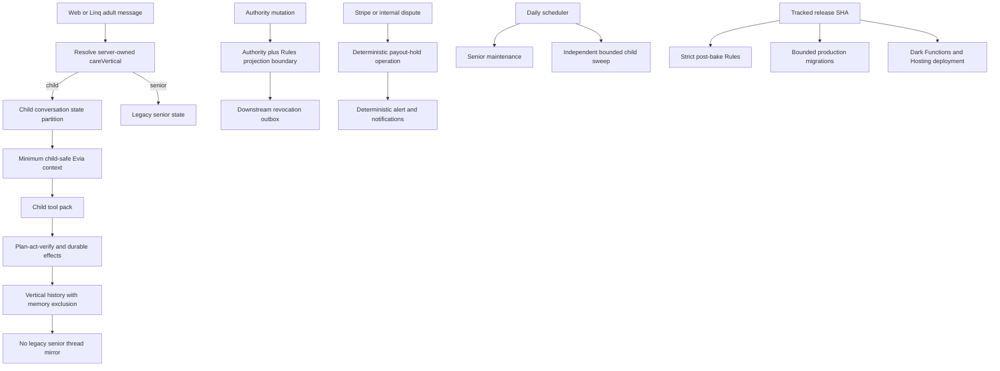

# fix: Remediate Validated Childcare Launch Blockers

## Goal Capsule

| Field | Value |
|---|---|
| Objective | Correct all 15 validated childcare launch blockers before childcare code, Rules, migrations, or Hosting are deployed to production. |
| Product authority | `docs/plans/2026-07-22-002-feat-childcare-marketplace-consolidated-implementation-plan.md` remains the source for childcare product behavior. This plan narrows execution to defects found in the current implementation. |
| Code authority | Current working tree based on `feff7ecc4690204f158f4f796d03f1c675334e86`. Re-read changed source before editing because the childcare implementation is not yet committed. |
| Safety boundary | No child-capable text, access, state, payment, notification, or scheduling path may silently fall back to a senior default. |
| Execution profile | React/Vite, Firebase Auth, Firestore, Cloud Functions, Firebase Messaging, Stripe, Linq SMS/iMessage, web chat, and Evia's agent loop. |
| Stop conditions | Do not deploy while any P1 requirement below is unproven, any Rules test is skipped, migration production behavior contradicts the runbook, the working tree contains required untracked source, or exact Git/Firebase proof is unavailable. |
| Tail ownership | Implementation includes code, focused and broad tests, emulator-backed Rules tests, migration rehearsal, commit/push, staged Firebase deployment, Hosting deployment, production-safe verification, and rollback evidence. |

---

## Product Contract

### Summary

The childcare implementation compiles and its focused suites pass, but fifteen validated defects violate the original childcare contract across privacy, vertical isolation, authorization, payments, scheduling, Rules, and deployment. The remediation must preserve existing senior behavior while making every childcare-capable path explicit, fail-closed, idempotent, and independently verifiable.

### Problem Frame

The defects share one architectural pattern: shared senior infrastructure accepts missing vertical, authority, context, or correlation data and continues under a permissive default. That behavior is acceptable only for cutoff-bounded legacy senior records. It is not acceptable for a live request that is explicitly child-capable.

Passing TypeScript and unit tests do not prove this release. The current Rules run skipped emulator-dependent cases, several asynchronous failures are swallowed, and the production migration instructions cannot be executed as written. The release gate therefore requires both code correction and operational proof.

### Requirements

**Messaging, Evia, and state isolation**

- R1. Every childcare-capable web, SMS, iMessage, and transport mirror call passes a server-resolved `careVertical`; child turns never write to legacy `threads/cara_{uid}` structures.
- R2. An explicit childcare signup remains typed as child intent when childcare flags are off or unreadable and returns a typed unavailable result; it never enters senior onboarding.
- R3. Conversation rows, recent-user queries, rolling summaries, and rollup operations are partitioned by care vertical. Child rows never enter senior prompts or generic summaries, and senior rows never enter child prompts.
- R4. Legacy and phase checkpoints store and validate care vertical as part of checkpoint identity. A checkpoint created under one vertical cannot resume under another.
- R5. Childcare-capable observability never stores raw phone, inbound text, reply text, child identifiers, or child context in `agent_uncertainty_log` or sibling generic telemetry.

**Privacy, authorization, and account isolation**

- R6. Childcare ratings and comments remain private and absent from public reputation until a scoped moderation and child-PII redaction decision succeeds. Public projections use an exact recipient-safe field allowlist and explicit moderation version.
- R7. Reducing or revoking guardian authority denies every synchronous access surface before the callable reports success: operational summaries, callable reads, active room subscriptions, file-grant minting, upload confirmation, pending actions, objectives, provider assignments, and browser cache. Repair mechanisms remain defense in depth, not the primary revocation boundary.
- R8. Broad `isAdmin()` alone does not grant reads to any child-bearing booking, appointment, dispute, incident, conversation, file, or shared record. Childcare operator access is scoped by role and object, requires a bounded access reason and recent authentication where sensitive, fails closed when audit persistence fails, and is served through the operator-callable boundary.
- R9. Family and caregiver childcare access caches are keyed by Firebase UID and cleared on every authentication transition. One account can never observe another account's cached children, household, or provider state.
- R21. Child file downloads use an authenticated authority-checking delivery path so a previously granted bearer URL cannot outlive revocation. Uploads remain quarantined until the server verifies object existence, exact size, content type, checksum, overwrite/replay status, and malware-scan result; only verified-clean files can receive read grants.
- R22. Quality telemetry and mandatory security audit are separate schemas. Quality telemetry prohibits raw content and direct identifiers. Security audit permits only approved actor/object references and structured reason codes, defines retention/legal-hold behavior, and never accepts unredacted free-form child context.

**Matching and notifications**

- R10. Matching resolves the assignment vertical before loading an intake and loads only the assignment's referenced same-vertical source. A latest-record query cannot choose between verticals.
- R11. A booking-context childcare push requires an existing, child-stamped booking and a currently authorized, non-excluded recipient. Missing or malformed context produces no push.
- R23. Every Evia action artifact is vertical-bound from proposal through approval, execution, verification, audit, replay, and recovery. A senior approval or pending action can never execute a childcare mutation, and revocation is rechecked immediately before execution.

**Payments and scheduling**

- R12. Childcare dispute payout holds are durable and idempotent. A hold failure cannot be acknowledged as success, and retries produce one hold, one alert, and one notification per party.
- R13. Childcare shift generation failures remain retryable or enter a durable reconciliation queue. Daily childcare maintenance runs even when there are no senior bookings or a senior cleanup branch returns.
- R14. Senior cleanup never deletes childcare shifts. Childcare rolling sweeps are bounded, resumable, and observable.

**Schema, migration, and release**

- R15. After the recorded Hosting bake window and migration cutoff, browser and server writes to shared collections require an explicit valid `careVertical`; missing values cannot default to senior.
- R16. Production migration behavior and `docs/runbooks/childcare-launch.md` agree exactly. Every required production mutation has a bounded, authenticated, idempotent, observable path with dry-run, resume, reconciliation, and rollback.
- R17. Required source, tests, scripts, Rules, indexes, and runbooks are tracked in Git before build or deployment proof is accepted.
- R18. Firestore and Storage Rules tests run against emulators with zero skipped authorization cases.
- R19. Childcare remains dark until all focused suites, broad build gates, migration rehearsal, sandbox payment tests, senior regression smokes, and staged deployment checks pass.
- R20. No deployment is complete until local SHA, remote SHA, Firebase project, Functions update times, Rules releases, index readiness, Hosting releases for both production domains, flag state, migration counts, and rollback evidence are recorded.
- R24. Production App Check is in enforce mode before pilot enablement. Both Hosting domains mint and refresh valid tokens, childcare callables reject absent or invalid tokens, and production debug tokens are prohibited.
- R25. Migration apply endpoints require restricted Cloud IAM invocation, an allowlisted named operator, `POST` with a bounded structured request, exact project and release SHA, immutable run ID, approved dry-run digest, replay protection, append-only audit, time-bounded enablement, and post-cutover disablement or removal. A shared secret may be secondary confirmation but is never the primary authorization boundary.
- R26. Production cutover uses an immutable create-only record containing writer cutover time, project ID, release SHA, Hosting release, and schema version. Deployment never edits source or creates a second release SHA to set the cutoff.
- R27. Migration resume state is server-owned and durable: lease, migration version, immutable cutoff, source high-water mark, next cursor, batch sequence, cumulative classifications, and terminal state. Partial pages cannot mark a run reconciled, arbitrary cursor jumps are rejected, and a final independent full-scan audit is required.
- R28. Deployment proof is collected live against an expected-artifact manifest and has a maximum evidence age. Hand-authored signal JSON cannot satisfy release proof.
- R29. Child-file malware verification is performed inside the production GCP project by a private authenticated scanner. A trusted finalize dispatcher creates a generation-bound scan operation, the scanner can read quarantined objects and publish bounded Pub/Sub results but cannot write Firestore, and a trusted result consumer validates and persists `pending`, `scanning`, `clean`, `rejected`, or `error` state. Timeout, retry, reconciliation, retention, signature freshness, supply-chain attestation, region compatibility, and scanner deployment are release-gated.
- R30. Child review moderation has a scoped operator queue and explicit, audited `pending`, `published`, `rejected`, `unpublished`, and `deleted` transitions. Publication and reputation projection are deterministic and repairable, and overdue pending work creates an operational alert without publishing by default.
- R31. Compatibility and strict Firestore Rules are selected only through a tracked stage-aware deployment command. An append-only hash-chained release-stage ledger authorizes compatibility release, writer bake completion, migration reconciliation, strict release, terminal shutdown, and cleanup finalization. The command validates ledger state, project, Git SHA, requested stage, source hash, and resulting Firebase release; an unknown, unapproved, or out-of-order stage fails closed.
- R32. App Check enforcement distinguishes normal verified requests from high-risk mutations that consume limited-use tokens. The guarded mutation manifest is explicit and tested; token replay cannot repeat an authority, child-record, file, booking, payment, dispute, or operator mutation.
- R33. Migration write capability has a terminal server-side disabled state that survives redeployment. After reconciliation, operator IAM and secrets are revoked and a tracked cleanup commit removes migration exports before the childcare pilot is enabled.

### Actors

- A1. Family adult using childcare signup, profile, matching, chat, booking, payment, and review flows.
- A2. Childcare provider coordinating through the caregiver account.
- A3. Authorized co-guardian whose access may be granted, reduced, disputed, or revoked.
- A4. Trust and Safety operator with scoped child-safety access.
- A5. Billing operator who can reconcile payment state without reading unrelated child data.
- A6. System operator executing migrations, feature flags, deployment, monitoring, and rollback.
- A7. Evia, which may coordinate adult users but must not create child accounts, child threads, or durable child memory.

### Key Flows

- F1. Childcare conversation
  - **Trigger:** An enrolled adult sends a childcare message by web, SMS, or iMessage.
  - **Steps:** Resolve vertical from server-owned session state, isolate history and checkpoint state, load minimum child-safe context, execute allowed tools, verify effects, and save only exclusion-stamped vertical history.
  - **Outcome:** No child content enters senior threads, generic memory, or raw telemetry.
  - **Covered by:** R1-R5.

- F2. Childcare unavailable
  - **Trigger:** An adult explicitly selects childcare while flags are disabled or unavailable.
  - **Steps:** Preserve typed child intent, create no senior-compatible bridge, return unavailable guidance, and retain no child details.
  - **Outcome:** No accidental senior onboarding or memory initialization.
  - **Covered by:** R2.

- F3. Authority revocation
  - **Trigger:** A permitted adult or operator reduces or revokes access.
  - **Steps:** Validate current authority and dispute policy, mutate authority and Rules-backed projection atomically, invalidate active conversation/file/action access, notify required adults, and write a durable audit/outbox record.
  - **Outcome:** Revoked access is denied before success is returned.
  - **Covered by:** R7-R8.

- F4. Dispute and payout hold
  - **Trigger:** Stripe or an internal dispute record reports a childcare payment concern.
  - **Steps:** Resolve the child booking, create a deterministic hold operation, apply or reconcile the payout hold, create deterministic notifications and alerts, then acknowledge the event.
  - **Outcome:** Retries converge and a failed hold remains visible and retryable.
  - **Covered by:** R12.

- F5. Scheduled shift maintenance
  - **Trigger:** A booking becomes confirmed or the daily rolling scheduler runs.
  - **Steps:** Route by vertical, generate bounded child shifts, exclude child records from senior cleanup, persist retry/reconciliation state on failure, and continue independent vertical work.
  - **Outcome:** Child shifts are neither silently omitted nor deleted by senior maintenance.
  - **Covered by:** R13-R14.

- F6. Production cutover
  - **Trigger:** The implementation commit is approved for staged rollout.
  - **Steps:** Track all source, run local and emulator gates, deploy additive indexes plus compatibility Rules, private scanner, dark Functions, and Hosting from the migration-release SHA, record the immutable cutover, observe the writer bake window, run bounded production migrations, deploy strict Rules, terminally disable and remove migration execution, redeploy the complete surface from the cleanup SHA, verify both Hosting domains, enable a pilot cohort, observe, and preserve emergency-off rollback.
  - **Outcome:** Every staged artifact maps to its exact Git SHA, the final production surface maps to the migration-cleanup SHA, and no unexplained migration or authorization gap remains.
  - **Covered by:** R15-R20, R24-R33.

- F7. Child file lifecycle
  - **Trigger:** An authorized adult or assigned provider uploads or requests a restricted child file.
  - **Steps:** Recheck current authority, create a single-use upload intent, quarantine the object, verify metadata and malware result server-side, expose only verified-clean files through an authenticated download path, and recheck authority on every read.
  - **Outcome:** Revocation immediately blocks new and previously initiated reads, and unverified content is never delivered.
  - **Covered by:** R7, R21.

- F8. Evia action approval
  - **Trigger:** Evia proposes or resumes a mutating action that requires adult approval.
  - **Steps:** Bind proposal and approval to principal, vertical, object, source turn, action schema, and expiry; recheck authority and vertical immediately before execution; record deterministic evidence and terminal outcome.
  - **Outcome:** An approval cannot cross verticals, principals, expired authority, or a previous action lifecycle.
  - **Covered by:** R4, R7, R23.

### Acceptance Examples

- AE1. Given a child-stamped web session, when an inbound message is handled, then no write occurs under `threads/cara_{uid}` and the child conversation remains visible only through the childcare conversation surface.
- AE2. Given flags are off, when a user submits `careVertical: "child"` and sends the first text, then the response is childcare-unavailable and no senior onboarding step or senior memory row is created.
- AE3. Given one phone previously used a senior flow, when its child session runs, then senior history, summaries, and checkpoints are absent from the child prompt.
- AE4. Given a child turn triggers every uncertainty branch, then logs contain only approved pseudonymous fields and no raw question, reply, phone, child ID, or recipient label.
- AE5. Given a review comment includes a child's name or other identifying text, when submitted, then it is withheld or redacted before public read while the private moderation record remains auditable.
- AE6. Given viewer projection refresh fails during revocation, when the callable completes, then it does not report success while the revoked user can still read the child profile.
- AE7. Given a generic administrator without a child operator scope, when reading a child booking directly, then Rules deny access.
- AE8. Given account A loads child summaries and logs out, when account B logs in without a page reload, then no cached value from account A renders or drives routing.
- AE9. Given a child assignment and a newer senior intake, when matching runs, then only the referenced child intake is passed to child eligibility.
- AE10. Given a childcare room references a missing booking, when a message is created, then no push is sent.
- AE11. Given payout hold fails once and succeeds on retry, when Stripe redelivers the event, then exactly one hold, alert, and notification per party exist.
- AE12. Given there are zero accepted senior bookings but confirmed child bookings exist, when the daily scheduler runs, then child shifts are topped up.
- AE13. Given first-run senior cleanup and existing scheduled child shifts, when cleanup runs, then child shifts remain and child maintenance still executes.
- AE14. Given a post-cutoff browser write omits `careVertical`, when Rules evaluate it, then the write is denied rather than classified as senior.
- AE15. Given the production project, when each migration follows the runbook in bounded apply mode, then the implementation permits the approved path, records reconciliation, and supports resume without an undocumented bypass.
- AE16. Given a child file read grant was created before authority revocation, when the revoked adult retries the same URL or request, then access is denied immediately.
- AE17. Given an upload declares an allowed type and size but the stored object differs or fails malware scanning, when confirmation runs, then the file remains quarantined and cannot receive a read grant.
- AE18. Given simultaneous senior and childcare pending actions for one phone, when one approval arrives, then only the matching vertical-bound action can execute.
- AE19. Given an absent or invalid App Check token on either production Hosting domain, when a childcare callable is invoked, then it is rejected and no write occurs.
- AE20. Given a migration run is interrupted after a committed page, when another operator resumes it, then the server-owned cursor and lease produce no skipped or duplicate classifications and the final full scan reconciles exactly.

### Scope Boundaries

**In scope**

- All 15 validated findings and their regression tests.
- Shared-path audits needed to ensure equivalent call sites receive the same fix.
- Firestore Rules transition mechanics and migration/runbook alignment.
- Dark deployment, production verification, and rollback proof after implementation.

**Out of scope**

- New childcare product features, categories, pricing, or geography.
- Rewriting the senior marketplace or renaming legacy Cara identifiers.
- Enabling real childcare cohorts before the original plan's external and operational gates remain satisfied.
- Replacing Firestore, Firebase Auth, Stripe, Linq, or the Evia model stack.

---

## Planning Contract

### Key Technical Decisions

- KTD1. **Make vertical explicit at every child-capable boundary.** Optional vertical parameters remain acceptable only for proven senior-only callers. A caller that can process child state must resolve and pass the vertical or fail closed.
- KTD2. **Partition durable conversation state, not only prompt assembly.** Filtering at the final prompt is insufficient because rollups and checkpoints can already have combined state. History rows, summaries, checkpoint identity, queries, and cleanup all carry vertical.
- KTD13. **Use a small immutable vertical execution context.** Child-capable boundaries receive a typed context containing principal, care vertical, channel, conversation partition, and source-turn identity. It is not a mutable catch-all; domain payloads and authorization remain owned by their modules.
- KTD3. **Keep child history operational and memory-ineligible.** Child conversation history may support the current adult coordination thread, but it stays vertical-scoped and exclusion-stamped and never enters generic summaries, Zep, learned facts, training, or evaluation capture.
- KTD4. **Revocation is synchronous for access denial.** The authority record and Rules-backed projection are updated in one transaction or through a design that denies on either state. Outbox repair handles downstream fanout, not immediate read authorization.
- KTD5. **Separate private review intake from public projection.** Store the participant's original rating and comment in a server-only pending moderation record. Pending reviews do not affect public reputation. A scoped moderator may publish a separate allowlisted projection with redaction version and no child/object identifiers; rejection, unpublish, deletion, and stale-projection cleanup are explicit state transitions. No child comment or rating is public before moderation.
- KTD14. **Separate quality telemetry from security audit.** Quality signals use pseudonymous correlations and enumerated event metadata only. Security audit uses approved actor/object references plus structured reason codes, has restricted read access and retention/legal-hold policy, and fails closed for sensitive operator access while non-security quality logging remains non-blocking.
- KTD15. **Serve restricted child files through authority-checking delivery.** Permanent or reusable bearer download URLs are not compatible with immediate revocation, including privacy exports. Uploads remain quarantined until server-side metadata verification and an in-project private ClamAV scan complete. A trusted Eventarc dispatcher creates scan work, a private Cloud Run scanner reads quarantine and publishes a bounded Pub/Sub result, and a trusted subscriber persists validated state; the scanner never receives Firestore write authority and no external malware vendor receives child objects.
- KTD6. **Key client caches by authenticated principal.** Cache entries carry UID and role and are invalidated by the central auth-state boundary, not by individual page unmount behavior.
- KTD7. **Bind matching to assignment references.** Assignment vertical and source identifiers are authoritative. "Latest intake for account" is not a valid dual-vertical lookup.
- KTD16. **Bind Evia actions end to end.** Proposal, approval, execution, verification, checkpoint, and audit share one immutable vertical-bound operation identity. Approval text or phone identity alone never authorizes execution.
- KTD8. **Use durable idempotency for financial effects.** Stripe event IDs, dispute IDs, appointment IDs, and notification recipients form deterministic operation/document keys. A webhook returns failure or leaves a retryable operation when the payout hold is not established.
- KTD9. **Decouple childcare scheduling from senior query shape.** The child sweep runs as an independent bounded phase so an empty senior query or senior cleanup return cannot suppress it.
- KTD10. **Use an explicit Rules transition, not a permanent default.** Legacy missing vertical remains readable only under the recorded cutoff compatibility contract. New creates and rewrites require explicit vertical after the Hosting bake window.
- KTD11. **Production migrations need an operator-bound write path.** Keep hard guards against accidental execution, but authorize the intended production path through restricted Cloud IAM, named operator identity, exact project and SHA, approved dry-run digest, durable run state, bounded apply, and cumulative reconciliation rather than an impossible blanket refusal or secret-only HTTP endpoint.
- KTD17. **Record cutover as immutable data, not source.** A create-only cutover record binds writer cutover time, project, schema, migration-release SHA, and Hosting release. A separate create-only finalization record binds the later migration-cleanup SHA. Neither deployment stage edits source to set runtime cutoff data.
- KTD18. **Treat migrations as forward-only unless an inverse is proven.** Normal rollback disables flags, freezes migration leases, preserves append-only ledgers, and rolls forward with compatible code. An old Hosting bundle that omits vertical cannot be restored after strict Rules activate.
- KTD19. **Collect live release evidence.** The deploy gate queries Git, Firebase, IAM, Rules, indexes, Hosting, flags, schedulers, migration runs, and rollout holds against an expected manifest. Operator-authored signal files are diagnostic input only.
- KTD20. **Deploy Rules by named stage and ledger authority.** A tracked release command selects either the compatibility or strict artifact, requires the expected append-only release-stage ledger predecessor, validates immutable release inputs, hashes the exact source, and verifies the resulting Firebase Rules release. Operators never swap Rules files or advance stages manually.
- KTD21. **Consume limited-use App Check tokens only for high-risk mutation boundaries.** Ordinary reads and low-risk calls require normal enforcement; authority, child-record, file, booking, financial, dispute, and operator mutations consume limited-use tokens and use operation idempotency for retry.
- KTD22. **Retire migration execution in code and infrastructure.** A terminal cutover record denies migration writes before IAM revocation. A required cleanup commit then removes exports and credentials, is deployed, and becomes the final pilot SHA so later full Functions deploys cannot restore the surface.
- KTD12. **Release from a tracked commit only.** Untracked implementation files, skipped Rules tests, or local-only proof block deployment regardless of passing builds.

### Technical Design

### Sequencing

1. U1 defines the shared immutable vertical execution context and fixes signup, session, transport, and thread ingress.
2. U9 partitions durable conversation history, summaries, checkpoints, cleanup, and retention after U1 establishes trustworthy classification.
3. U3 establishes the authoritative synchronous revocation boundary after U1.
4. U10 binds Evia proposal, approval, execution, verification, and recovery to the same vertical operation identity after U1, U3, and U9.
5. U2 closes raw telemetry and public-review exposure; U11 hardens file delivery/upload; U12 enforces App Check; U13 scopes operator access; and U14 binds browser caches to the authenticated UID. These units may proceed in parallel after U1 and depend on U3 wherever they consume revocable authority.
6. U4 corrects matching and push side effects independently of U5 payment and U6 scheduling reliability.
7. U7 completes writer classification, compatibility/strict Rules artifacts, immutable cutover, durable migrations, and cumulative reconciliation after U1-U6 and U9-U14 are green.
8. U15 implements the terminal migration-retirement mechanism after U7. U8 then owns the staged release, executes U15's controls after strict Rules and reconciliation, redeploys all final artifacts from the cleanup SHA, transitions App Check to enforce, and only then completes post-cutover probes and pilot enablement.

### Assumptions

- The original childcare plan's legal, insurance, jurisdiction, and product decisions remain unchanged.
- The current working tree contains the intended U0-U14 implementation; implementation begins by confirming no unrelated user changes are accidentally included.
- Existing server-side child repositories and operator-role helpers remain the preferred patterns.
- The production Firebase project remains `careconnex-d4c8b`; this must still be verified from `.firebaserc` and CLI state at execution time.
- Childcare flags remain off throughout every implementation unit and staged deployment step until U8's documented pilot-enable gate.

### Operational Thresholds

- Writer bake: 48 continuous hours after both production domains serve the vertical-complete bundle, with zero unstamped writes across the complete shared-writer manifest.
- Live deployment evidence: no more than 30 minutes old when a release gate is evaluated.
- Synchronous revocation: every direct authorization surface denies before the mutation returns success.
- Asynchronous revocation fanout: complete within 5 minutes; any miss keeps rollout on hold and pages operations.
- Review moderation: pending items are actioned within 24 hours or page the moderation queue owner; overdue work remains private.
- Malware scanning: terminal result within 10 minutes, at most 3 automatic attempts, ClamAV signatures no more than 24 hours old, and 7-day quarantine retention unless legal hold applies.
- Migration lease: 10 minutes with server-owned renewal and takeover only after expiry.
- Migration approval evidence: source high-water mark and approved dry-run digest no more than 30 minutes old when apply begins.
- Pilot observation: at least 24 continuous hours with zero red canaries before cohort expansion.

### Risks and Mitigations

| Risk | Mitigation |
|---|---|
| Senior regression from making vertical mandatory | Preserve cutoff-bounded legacy readers, add senior characterization tests, and activate strict Rules only after Hosting bake proof. |
| Child messages become invisible after removing senior mirror | Verify the childcare context-room list and unread behavior before removing every legacy mirror write. |
| Revocation transaction exceeds Rules/data constraints | Keep the synchronous access-denial projection minimal; move notifications and broad fanout to an idempotent outbox. |
| Authenticated file proxy adds latency or cost | Stream only authorized bounded objects, use short server-side cache metadata rather than bearer grants, and monitor latency/error budgets before pilot. |
| Malware scanner is unavailable | Keep uploads quarantined and surface retry/reconciliation; never fail open to readable. |
| Moderation stalls reviews | Define an operator SLA and queue monitoring; keep ratings and comments private until approval rather than weakening the publication boundary. |
| Stripe retries create duplicate effects | Use deterministic operation and notification IDs and test duplicate and out-of-order delivery. |
| Scheduler timeout from child sweep | Page by stable cursor, persist watermark/reconciliation, and cap work per invocation. |
| Strict Rules break an old SPA bundle | Record the Hosting bake window, monitor interim backfill, then deploy strict Rules only after old writers have aged out. |
| Production migration guard becomes too permissive | Require restricted IAM, named operator, exact project/SHA, approved dry-run digest, explicit apply confirmation, bounded run state, secondary secret, and reconciliation hold. |
| Migration lease or cursor state corrupts progress | Keep append-only batch ledgers, server-owned cursors, immutable run inputs, replay-safe pages, and a final independent full scan. |
| App Check enforcement blocks legitimate clients | Prove token mint/refresh on both domains during dark bake, monitor denials, and use emergency-off without accepting production debug tokens. |
| Green tests hide behavior because mocks swallow Firestore API gaps | Make mocks implement used Admin SDK primitives and assert durable writes rather than only return values/log strings. |

---

## Implementation Units

### U1. Shared vertical context and ingress isolation

- **Goal:** Close finding 1, preserve the R2 fail-closed childcare signup path, and provide one required context contract for every child-capable boundary.
- **Requirements:** R1-R2.
- **Files:**
  - `functions/src/data/contract.ts`
  - `functions/src/index.ts`
  - `functions/src/linq/webhooks.ts`
  - `functions/src/linq/webChat.ts`
  - `functions/src/linq/client.ts`
  - `functions/src/linq/threadMirror.ts`
  - `functions/src/agents/turnSourceKey.ts`
  - `functions/src/mcp/runTool.ts`
  - `functions/src/linq/threadMirror.test.ts`
  - `functions/src/linq/webChat.test.ts`
  - `functions/src/linq/__tests__/handleInbound.routing.test.ts`
- **Patterns:** Server-owned session vertical in `functions/src/agents/qaAgent.ts`; source-turn identity in `functions/src/agents/turnSourceKey.ts`; child context envelope in `functions/src/agents/childcareSituation.ts`.
- **Approach:**
  - Define a small immutable vertical execution context containing authenticated principal, typed care vertical, channel, conversation partition, and source-turn identity.
  - Require that context at child-capable mirror, transport-history, Evia, MCP, and action boundaries rather than accepting an optional vertical string.
  - Preserve explicit child intent in the web onboarding bridge even when flags are disabled or unreadable; store a typed unavailable state rather than deleting the vertical.
  - Pass the server-resolved context through inbound and outbound Linq/web paths, including `sendMessage` and transport history recording.
  - Skip both inbound and outbound writes to `threads/cara_{uid}` for child turns while preserving childcare context-room visibility and senior mirror behavior.
  - Audit every `mirrorToWebThread` and transport recorder caller; a child-capable caller without context fails the consumer audit.
- **Test Scenarios:**
  - Child web inbound, web outbound, SMS inbound, SMS outbound, retry, help command, split message, and self-delivering tool paths produce zero legacy mirror writes.
  - Senior mirror, unread count, optimistic-message reconciliation, and transport history behavior remain unchanged.
  - Flags off, flag read error, pending vertical, explicit child, and explicit senior signup never cross-route.
  - Model/tool input cannot override the server-owned vertical.
  - Missing context at a child-capable boundary fails closed and produces privacy-safe observability.
- **Verification:** Ingress and mirror suites assert the resolved context at each boundary and exact Firestore writes.
- **Exit:** No child-capable ingress or transport call can omit vertical context or enter a senior thread.

### U9. Durable conversation, summary, and checkpoint partition

- **Goal:** Close findings 2-4 by partitioning every durable Evia conversation-state lifecycle.
- **Requirements:** R3-R4.
- **Files:**
  - `functions/src/agents/qaAgent.ts`
  - `functions/src/agents/contextManagement.ts`
  - `functions/src/agents/turnCheckpoint.ts`
  - `functions/src/agents/turnPhaseCheckpoint.ts`
  - `functions/src/agents/turnSourceKey.ts`
  - `functions/src/linq/threadMirror.ts`
  - `functions/src/memory/conversationMemory.ts`
  - `functions/src/scheduled/nightlyMemory.ts`
  - `functions/src/data/childcareConsumerManifest.ts`
  - `scripts/audit-childcare-consumers.mjs`
  - `firestore.indexes.json`
  - `firestore.query-contracts.json`
  - `functions/src/agents/qaAgent.history.test.ts`
  - `functions/src/agents/contextManagement.test.ts`
  - `functions/src/agents/turnCheckpoint.test.ts`
  - `functions/src/agents/turnPhaseCheckpoint.test.ts`
  - `functions/src/data/childcareConsumerManifest.test.ts`
- **Patterns:** Memory exclusion stamps in `functions/src/memory/memoryEligibility.ts`; query-contract audit; bounded history composition in `functions/src/agents/contextManagement.ts`.
- **Approach:**
  - Use a physical phone-plus-vertical conversation partition for new rows, summaries, and checkpoints so opposite verticals cannot race on one document identity.
  - Version the partition schema and treat unstamped pre-cutover conversation rows and checkpoints as senior only.
  - Make history queries, recent-user queries, rolling summaries, transport rows, side-channel rows, checkpoint writes/loads/clears, TTL cleanup, and retention vertical-specific.
  - Preserve immutable memory-exclusion metadata when summarizing child operational history; child summaries remain excluded from Zep, learned facts, memory files, training, and eval adoption.
  - Classify every direct `agent_conversations` reader/writer, compressor, memory worker, provider-message mapper, and cleanup job in the consumer manifest; reject unclassified consumers in CI.
  - Define concurrency behavior for simultaneous senior and child turns on the same phone and vertical-specific checkpoint cleanup.
- **Test Scenarios:**
  - Mixed historical rows for one phone return only the selected vertical.
  - Child rollup produces a child-stamped excluded summary; senior rollup cannot read, fold, delete, or overwrite it.
  - Same text and phone with opposite vertical cannot resume either legacy or phase checkpoint.
  - Old unstamped rows/checkpoints resolve senior-only and never enter a child turn.
  - Concurrent senior and child turns retain independent locks, summaries, checkpoints, and TTL cleanup.
  - Every direct collection consumer is classified and the audit fails on a new unregistered consumer.
- **Verification:** History, context, checkpoint, consumer, and index suites assert physical partition IDs and memory exclusion.
- **Exit:** Conversation state cannot cross verticals before, during, or after prompt construction.

### U10. Vertical-bound Evia action lifecycle

- **Goal:** Prevent pending actions, approvals, tools, evidence, and objectives from crossing verticals or surviving revoked authority.
- **Requirements:** R7, R23.
- **Files:**
  - `functions/src/agents/pendingActions.ts`
  - `functions/src/agents/approvalHandler.ts`
  - `functions/src/agents/toolExecutionLedger.ts`
  - `functions/src/agents/actionEvidence.ts`
  - `functions/src/agents/objectiveLedger.ts`
  - `functions/src/mcp/runTool.ts`
  - `functions/src/linq/webhooks.ts`
  - `functions/src/agents/pendingActions.test.ts`
  - `functions/src/agents/approvalHandler.test.ts`
  - `functions/src/agents/actionEvidence.test.ts`
  - `functions/src/agents/objectiveLedger.test.ts`
  - `functions/src/mcp/__tests__/childcare.test.ts`
- **Patterns:** Deterministic operation evidence in `functions/src/agents/actionEvidence.ts`; child tool input stamping in `functions/src/agents/qaAgent.ts`.
- **Approach:**
  - Bind proposal, lookup, approval, execution ledger, result evidence, objective state, and recovery checkpoint to one immutable operation identity containing principal, vertical, object, action schema, source turn, and expiry.
  - Recheck current authority, provider assignment, feature flags, and vertical immediately before mutation, even when the proposal was valid.
  - Make webhook approval interception resolve the same operation identity before routing; phone plus approval text is insufficient.
  - Use deterministic terminal outcomes so retries return verified evidence without repeating mutation.
  - Invalidate or deny pending child actions synchronously when authority or assignment is revoked.
- **Test Scenarios:**
  - Simultaneous senior and child actions for one phone; identical approval text approves only the matching operation.
  - Revocation, booking cancellation, provider replacement, or flag disablement between proposal and approval denies execution.
  - Duplicate approval, post-action crash, checkpoint recovery, and replay return one terminal effect.
  - Model-supplied vertical or object ID cannot alter the server-bound operation.
- **Verification:** Action, approval, evidence, objective, MCP parity, and webhook routing suites assert one vertical-bound lifecycle.
- **Exit:** Evia cannot execute or resume a mutation outside the exact approved vertical operation.

### U2. Child-safe telemetry and moderated review publication

- **Goal:** Close findings 5 and 6 by separating private child-capable content from generic telemetry and public reviews.
- **Requirements:** R5-R6, R22, R30.
- **Files:**
  - `functions/src/agents/qaAgent.ts`
  - `functions/src/observability/auditLog.ts`
  - `functions/src/childcare/operatorAudit.ts`
  - `functions/src/childcare/childcareMetrics.ts`
  - `functions/src/childcare/childcareTelemetryScan.ts`
  - `functions/src/childcare/reviewCallables.ts`
  - `functions/src/childcare/reviewModerationCallables.ts`
  - `functions/src/triggers/reviewProjection.ts`
  - `services/api.ts`
  - `components/admin/AdminReviews.tsx`
  - `components/admin/ChildcareReviewModerationQueue.tsx`
  - `firestore.rules`
  - `firestore.indexes.json`
  - `firestore.query-contracts.json`
  - `functions/src/childcare/childcareMetrics.test.ts`
  - `functions/src/childcare/childcareTelemetryScan.test.ts`
  - `functions/src/childcare/privacyAssertions.test.ts`
  - `functions/src/childcare/reviewCallables.test.ts`
  - `functions/src/childcare/reviewModerationCallables.test.ts`
  - `functions/src/childcare/operatorAudit.test.ts`
  - `components/admin/AdminReviews.test.tsx`
  - `components/admin/ChildcareReviewModerationQueue.test.tsx`
  - `tests/firestoreRules.childcare.test.ts`
- **Patterns:** Approved field allowlists and privacy assertions in `functions/src/childcare`; server-only projection pattern in `functions/src/childcare/reputationProjection.ts`.
- **Approach:**
  - Centralize child-safe uncertainty/quality logging behind a helper that accepts typed event codes, pseudonymous principal/correlation IDs, bounded numeric metadata, and no raw content.
  - Route every child-capable uncertainty branch through that helper and scan sibling logs for equivalent raw fields.
  - Separate quality telemetry from security audit. Audit accepts only approved actor/object references and structured reason codes, has restricted reads and retention/legal-hold behavior, and fails closed when a sensitive operator action cannot be audited.
  - Keep original child rating and comment server-only in pending moderation state. Pending child reviews do not affect public reputation.
  - Add a server-paged moderation queue available only through the scoped operator callable boundary. Require recent authentication, a bounded reason code, immutable reviewer identity, and a security-audit write before any decision succeeds.
  - Mount the queue in the existing `AdminReviews` surface and route all list/decision operations through `services/api.ts`; the browser never queries private review records directly.
  - Define loading, empty, recoverable error, cursor pagination, stale-auth reauthentication, concurrent-decision refresh, and terminal decision states. Preserve the operator's queue position and reason draft across a safe refresh, but clear sensitive data on auth change.
  - Implement a compare-and-set state machine for `pending -> published|rejected`, `published -> unpublished`, and terminal deletion. Every transition records source version, moderation/redaction version, reason code, actor, and timestamp.
  - Publish a separate recipient-safe projection only after approval. Derive its deterministic ID from the private review and source version so retries cannot duplicate reputation effects.
  - Reconcile projection drift and stale aggregates with a bounded repair job; repair never promotes a pending or rejected review. Alert when pending work exceeds the 24-hour SLA.
  - Make public Rules deny private/pending child review reads and permit only the approved projection schema.
- **Test Scenarios:**
  - Every format, grounding, confidence, handoff, and promise branch on a child turn emits no raw phone/question/reply.
  - Telemetry scanner rejects child IDs, names, phone numbers, free text, reply text, console output, and error payloads.
  - Security audit rejects free-form child context, enforces reason codes, preserves required legal-hold records, and denies unauthorized direct reads.
  - Child review before completion, duplicate review, raw child PII, moderation pending/rejected/published/unpublished/deleted, and stale projection cases.
  - Unauthorized or stale-auth moderator, duplicate approval, concurrent decisions, approval-audit failure, overdue queue alert, and projection repair.
  - Anonymous and authenticated public reads cannot access pending/private child review text.
  - Pending or rejected child reviews do not affect reputation; published and later unpublished projections update aggregates exactly once.
  - Senior review behavior remains compatible.
- **Verification:** Privacy assertion, telemetry scan, review callable, projection, and Rules suites pass.
- **Exit:** Generic logs and public review reads contain no unmoderated child-capable text.

### U3. Transactional revocation and synchronous denial

- **Goal:** Close finding 7 by denying every synchronous access surface before revocation succeeds.
- **Requirements:** R7.
- **Files:**
  - `functions/src/childcare/authorityCallables.ts`
  - `functions/src/childcare/guardianAuthority.ts`
  - `functions/src/data/childProfileRepository.ts`
  - `functions/src/childcare/conversationPolicy.ts`
  - `functions/src/childcare/childFileAccess.ts`
  - `functions/src/childcare/bookingCallables.ts`
  - `functions/src/childcare/safetyProjection.ts`
  - `functions/src/agents/pendingActions.ts`
  - `functions/src/agents/objectiveLedger.ts`
  - `firestore.rules`
  - `functions/src/childcare/authorityCallables.test.ts`
  - `functions/src/childcare/guardianAuthority.test.ts`
  - `functions/src/childcare/conversationPolicy.test.ts`
  - `functions/src/childcare/childFileAccess.test.ts`
  - `functions/src/childcare/bookingCallables.test.ts`
  - `functions/src/childcare/safetyProjection.test.ts`
  - `functions/src/agents/pendingActions.test.ts`
  - `tests/firestoreRules.childcare.test.ts`
- **Patterns:** Transactional authority mutation in `functions/src/childcare/guardianAuthority.ts`; access-version checks in child repositories; derived invalidation outbox.
- **Approach:**
  - Move the minimum `authorizedViewerUids` removal into the same transaction or denial boundary as authority reduction/revocation.
  - Return success only after the Rules-backed operational summary is inaccessible to the revoked UID.
  - Synchronously deny new callable reads, active room subscriptions, file-grant minting, upload confirmation, pending action execution, objectives, and provider-assignment access using authority/access versions.
  - Limit asynchronous non-access effects to notices and archival fanout, and require completion within the 5-minute revocation-fanout SLA.
  - Keep outbox effects deterministic and visible; outbox failure cannot restore access or produce a success response while a synchronous surface remains open.
- **Test Scenarios:**
  - Refresh failure, transaction conflict, retry, duplicate revocation, dispute hold, expired authority, and projection drift.
  - Revoked user is denied immediately by Rules, callable reads, existing listeners, room reads, file grant, upload confirmation, pending action, and objective execution even when downstream outbox work fails.
  - Provider replacement and booking cancellation revoke assignment-derived access before success.
- **Verification:** Authority, conversation, file-grant, action, and emulator Rules tests pass with no skipped revocation cases.
- **Exit:** Every synchronous access path denies the revoked principal before success is returned.

### U11. Restricted child-file verification, malware scanning, and revocable delivery

- **Goal:** Make child uploads verifiably safe and child downloads immediately revocable.
- **Requirements:** R7, R21, R29.
- **Files:**
  - `functions/src/childcare/childFileAccess.ts`
  - `functions/src/childcare/childFileScan.ts`
  - `functions/src/childcare/childFileScanResult.ts`
  - `functions/src/childcare/safetyProjection.ts`
  - `functions/src/privacy/dataLifecycle.ts`
  - `functions/src/index.ts`
  - `infra/childcare-file-scanner/Dockerfile`
  - `infra/childcare-file-scanner/package.json`
  - `infra/childcare-file-scanner/package-lock.json`
  - `infra/childcare-file-scanner/tsconfig.json`
  - `infra/childcare-file-scanner/scan.ts`
  - `scripts/deploy-childcare-file-scanner.mjs`
  - `firestore.rules`
  - `firestore.indexes.json`
  - `firestore.query-contracts.json`
  - `storage.rules`
  - `functions/src/childcare/childFileAccess.test.ts`
  - `functions/src/childcare/childFileScan.test.ts`
  - `functions/src/childcare/childFileScanResult.test.ts`
  - `functions/src/childcare/safetyProjection.test.ts`
  - `functions/src/privacy/dataLifecycle.test.ts`
  - `infra/childcare-file-scanner/scan.test.ts`
  - `tests/firestoreRules.childcare.test.ts`
  - `tests/storageRules.childcare.test.ts`
- **Patterns:** Current child-file intent records and authority checks; server-only private safety zone.
- **Approach:**
  - Replace reusable bearer download URLs with an authenticated delivery endpoint that rechecks current authority, assignment, file state, expiry, and access version on every request.
  - Route child-related privacy export downloads through the same authority-rechecking delivery boundary. The lifecycle exporter returns an opaque export reference, never a signed Storage URL.
  - Keep upload intents single-use and bind them to principal, child, purpose, expected content type, maximum bytes, checksum, object key, and expiry.
  - On confirmation, inspect the actual object metadata and generation; reject absence, overwrite/replay, size/type mismatch, and checksum mismatch.
  - Handle Storage-finalize through a trusted Eventarc dispatcher that validates the upload intent and object generation, creates the pending Firestore operation, and publishes an immutable scan request.
  - Deploy a private Cloud Run ClamAV scanner in the same GCP project. Pub/Sub invokes it with an authenticated service account; conditional Storage IAM permits reads only from the quarantined child prefix, and the scanner can publish only the bounded result topic. It has no Firestore write role.
  - Consume scanner results in a trusted Function that validates operation ID, object generation, checksum, scanner image digest, signature version, attempt, and result schema before changing scan state. Duplicate, stale, malformed, or unsigned results are rejected and audited.
  - Persist `pending`, `scanning`, `clean`, `rejected`, and `error` states with engine/signature version, object generation, checksum, attempt count, timestamps, and bounded reason code. Only a matching terminal `clean` result can transition the file to readable.
  - Enforce a 10-minute terminal-result SLA and at most 3 retries. Timeouts and exhausted retries remain quarantined, page operations, and enter reconciliation; quota or scanner outage never fails open.
  - Build from a digest-pinned base image with locked dependencies. Attest the produced image to the approved Git SHA and dependency lock; deploy by immutable image digest, not a mutable tag.
  - Discover the live Storage bucket location and reject incompatible Eventarc, Pub/Sub, or Cloud Run placement before deployment. Require healthy ClamAV signatures no more than 24 hours old; stale or unavailable signatures keep files quarantined.
  - Add a deterministic local adapter with clean, malicious, timeout, and engine-error fixtures. Deployment automation verifies image attestation/digest, Eventarc dispatcher, Pub/Sub topics/subscriptions, conditional Storage IAM, absence of Firestore IAM, scanner health, signature freshness, resource limits, and budget alert before release.
  - Add orphan/quarantine cleanup after 7 days unless legal hold applies, with generation-safe deletion and audit.
- **Test Scenarios:**
  - Pre-revocation grant replay after revocation, expired authority, provider replacement, and URL/request replay.
  - Oversized upload, MIME mismatch, checksum mismatch, absent object, generation overwrite, duplicate confirmation, malware result, scan failure, and orphan cleanup.
  - Duplicate Eventarc or Pub/Sub delivery, stale generation/result, malformed or forged result, unauthorized scanner invocation, accidental Firestore role, retry exhaustion, scanner timeout, stale signatures, region mismatch, mutable image tag, quota exhaustion, legal hold, and deployment IAM drift.
  - Only verified-clean files are readable; pending, quarantined, rejected, and deleted files are denied.
- **Verification:** Direct HTTP, file lifecycle, Storage Rules, and revocation suites pass with no skipped emulator cases.
- **Exit:** No bearer credential survives revocation and no unverified upload becomes readable.

### U12. Production App Check enforcement and replay resistance

- **Goal:** Turn App Check from monitor-only registration into an enforceable pilot prerequisite.
- **Requirements:** R24, R32.
- **Files:**
  - `functions/src/childcare/requireAppCheck.ts`
  - `functions/src/childcare/appCheckPolicy.ts`
  - `functions/src/childcare/appCheckProbe.ts`
  - `functions/src/config/featureFlags.ts`
  - `functions/src/childcare/deployGate.ts`
  - `functions/src/index.ts`
  - `lib/firebase.ts`
  - `lib/childcareCallable.ts`
  - `services/api.ts`
  - `scripts/audit-childcare-appcheck-callers.mjs`
  - `docs/runbooks/childcare-launch.md`
  - `functions/src/childcare/requireAppCheck.test.ts`
  - `functions/src/childcare/appCheckPolicy.test.ts`
  - `functions/src/childcare/appCheckProbe.test.ts`
  - `functions/src/childcare/deployGate.test.ts`
  - `tests/childcareAppCheckCallerAudit.test.ts`
- **Patterns:** Existing monitor/enforce helper and Firestore-resident childcare flags.
- **Approach:**
  - Keep monitor mode for dark deployment observation, but require a recorded transition to enforce before pilot enablement.
  - Verify both production Hosting domains initialize App Check, mint valid tokens, and refresh them across auth/session transitions.
  - Define one machine-readable policy manifest for every childcare callable. Normal reads and low-risk operations require standard App Check enforcement; high-risk mutations consume limited-use tokens.
  - Apply Firebase callable `consumeAppCheckToken` configuration at the exported high-risk function boundary; the shared policy test compares the manifest with the compiled callable exports so a helper-only check cannot masquerade as replay protection.
  - Classify authority grant/update/revoke, child-profile create/update/delete/export, file intent/confirm/read-grant, booking accept/cancel/check-in/check-out, payment/refund/dispute, and operator mutations as limited-use boundaries. Any new high-risk callable fails CI until classified.
  - Introduce one childcare callable wrapper that owns callable name lookup, policy classification, authentication context, and Firebase's `limitedUseAppCheckTokens: true` option for guarded mutations. Migrate every childcare `httpsCallable` call site to the wrapper, including direct component calls that bypass `services/api.ts`.
  - Have the wrapper request a fresh limited-use token immediately before a guarded mutation. Retry obtains a new token but reuses the durable operation/idempotency key, so network recovery cannot repeat the effect.
  - Add a static client-to-policy audit that enumerates direct `httpsCallable` usage, the client callable registry, and server exports. CI fails on bypasses, missing policy entries, or client/server classification drift.
  - Add an operator-only, no-domain-write production probe that is exported with `consumeAppCheckToken`, accepts a server-issued single-purpose challenge, and returns only bounded verification metadata. It exists solely to prove limited-use consumption and replay denial without mutating care data.
  - Make the deploy gate read the effective production enforcement mode and prove absent, invalid, expired, debug, and replayed token denial through normal read probes and the no-op limited-use probe.
  - Prohibit production debug tokens and document emergency rollback without silently disabling enforcement.
- **Test Scenarios:**
  - Valid, absent, invalid, expired, consumed/replayed, and debug token behavior in monitor and enforce modes.
  - Limited-use token consumed once, same operation retried with a fresh token, duplicate idempotency key, callable omitted from the policy manifest, and normal read behavior.
  - Direct component callable bypass, wrong client classification, missing wrapper option, and client/server manifest drift fail the static audit.
  - Probe rejects a non-operator, missing or stale challenge, wrong project/origin, replayed token, and attempts to pass a domain payload.
  - Both Hosting domains, signed-in and signed-out transitions, token refresh, and emergency-off.
  - Pilot gate refuses monitor mode or unverifiable provider registration.
- **Verification:** Client initialization, callable guard, deploy-gate, and production-safe token probes pass.
- **Exit:** Pilot childcare callables reject unverified application traffic on both production domains.

### U13. Scoped operator authorization and audited access

- **Goal:** Close finding 8 across every shared child-bearing collection, not only bookings.
- **Requirements:** R8, R22.
- **Files:**
  - `functions/src/childcare/operatorAccess.ts`
  - `functions/src/admin/requireOperatorScope.ts`
  - `functions/src/childcare/operatorCallables.ts`
  - `functions/src/childcare/operatorAudit.ts`
  - `firestore.rules`
  - `functions/src/data/childcareConsumerManifest.ts`
  - `functions/src/childcare/operatorCallables.test.ts`
  - `functions/src/admin/requireOperatorScope.test.ts`
  - `functions/src/childcare/operatorAudit.test.ts`
  - `tests/firestoreRules.childcare.test.ts`
- **Patterns:** Existing operator-role helpers, reason-for-access audit, and server-only child repositories.
- **Approach:**
  - Inventory bookings, appointments, disputes, incidents, conversations, files, reviews, safety projections, payments, and any shared collection that can carry child references.
  - Classify each read as participant-only, child-safety operator, billing operator, sanitized projection, or server-only.
  - Remove broad-admin shortcuts, including broad admin satisfying `generalOperator`.
  - Require exact object scope, structured access reason, recent authentication for sensitive reads, and fail-closed audit persistence.
  - Serve operator reads through narrow callables that return minimum projections; direct Rules access remains denied where object-level scope cannot be proven safely.
- **Test Scenarios:**
  - Generic admin, billing, support, child-safety, screening, participant, revoked operator, and stranger across every classified collection.
  - Missing reason, invalid object scope, stale auth, failed audit write, list/query access, and cross-household/cross-child request.
- **Verification:** Operator callable, audit, consumer-manifest, and emulator Rules matrices pass.
- **Exit:** No generic admin or operator can read child-bearing data outside a scoped, audited need.

### U14. UID-bound browser cache lifecycle

- **Goal:** Close finding 9 without coupling browser state to backend authority implementation.
- **Requirements:** R9.
- **Files:**
  - `components/shared/childcareAccess.ts`
  - `context/CareConnexContext.tsx`
  - `services/api.ts`
  - `components/ClientProfileDashboard.childcare.test.tsx`
  - `components/ClientProfile.childcare.test.tsx`
  - `components/client/ClientNavigation.childcare.test.tsx`
  - `components/caregiver/CaregiverAccountSettings.childcare.test.tsx`
- **Patterns:** Central Firebase auth observer and UID-keyed local role cache.
- **Approach:**
  - Key family and caregiver access promises by authenticated UID plus role.
  - Clear fulfilled and rejected cache entries on login, logout, principal change, role change, and auth-token invalidation.
  - Prevent stale promise resolution from updating a component after the authenticated principal changes.
  - Render no previous-principal data while the current principal's request is pending or unavailable.
- **Test Scenarios:**
  - Account A to logout to account B without reload; client-to-caregiver role change; token refresh; rejected request followed by retry; rapid auth switch while a promise is in flight.
  - No cached child summary or provider state renders or drives navigation before the current UID's request resolves.
- **Verification:** Same-SPA auth-transition tests assert data, navigation, and loading state.
- **Exit:** Browser childcare state always belongs to the currently authenticated principal.

### U4. Same-vertical matching and fail-closed notification context

- **Goal:** Close findings 10 and 11 by binding background effects to authoritative vertical records.
- **Requirements:** R10-R11.
- **Files:**
  - `functions/src/aiMatching.ts`
  - `functions/src/childcare/matchingEligibility.ts`
  - `functions/src/pushNotifications.ts`
  - `functions/src/childcare/conversationPolicy.ts`
  - `functions/src/childcare/notificationPolicy.ts`
  - `functions/src/childcare/matchingEligibility.test.ts`
  - `functions/src/childcare/conversationPolicy.test.ts`
  - `functions/src/childcare/notificationPolicy.test.ts`
  - `functions/src/pushNotifications.test.ts`
- **Patterns:** Child eligibility computation in `functions/src/childcare/matchingEligibility.ts`; fail-closed excluded-recipient logic in `functions/src/childcare/conversationPolicy.ts`.
- **Approach:**
  - Resolve assignment vertical before any intake query.
  - Require a vertical-specific source reference on child assignments and validate source ownership and vertical before scoring.
  - Keep legacy latest-intake fallback only for explicitly senior-compatible assignments and never let intake data override assignment vertical.
  - Require booking existence, child stamp, matching room context, participant membership, and exclusion check before child push delivery.
  - Treat missing, malformed, mismatched, or unreadable context as no-send plus privacy-safe observability.
- **Test Scenarios:**
  - Child assignment with newer senior intake, senior assignment with newer child intake, missing source, cross-user source, malformed vertical, and replay.
  - Missing booking, deleted booking, senior booking referenced by child room, excluded recipient, removed participant, valid participant, and Firestore read failure.
  - Generic lock-screen payload remains text-free.
- **Verification:** Matching and notification suites assert selected source IDs and push-send counts.
- **Exit:** Matching and pushes cannot infer child context from an account-level latest record or absent booking.

### U5. Durable childcare dispute and payout-hold processing

- **Goal:** Close finding 12 and satisfy retry convergence for Stripe and internal disputes.
- **Requirements:** R12.
- **Files:**
  - `functions/src/stripe.ts`
  - `functions/src/triggers/disputeResolution.ts`
  - `functions/src/childcare/shiftPayments.ts`
  - `functions/src/childcare/paymentPolicy.ts`
  - `functions/src/childcare/payoutHoldWorker.ts`
  - `functions/src/childcare/shiftPayments.test.ts`
  - `functions/src/childcare/paymentPolicy.test.ts`
  - `functions/src/childcare/payoutHoldWorker.test.ts`
  - `functions/src/stripeConnectWebhook.test.ts`
  - `functions/src/triggers/disputeResolution.test.ts`
- **Patterns:** Existing Stripe action ledger and settlement tests in `functions/src/__tests__/shiftPayment.settlement.test.ts`; deterministic childcare review IDs in `functions/src/childcare/reviewCallables.ts`.
- **Approach:**
  - Transactionally create one deterministic payout-hold operation keyed by dispute and appointment correlation before acknowledging Stripe or the internal dispute trigger.
  - Use explicit `pending`, `processing`, `held`, `already_held`, `already_paid_requires_recovery`, `missing_correlation`, `retryable_failure`, and terminal escalation states with lease, attempt, next-attempt, and evidence fields.
  - Acknowledge the source event only after the durable operation is committed. If operation persistence fails, throw so the source retries; do not perform an untracked inline hold.
  - Process pending operations with an idempotent worker using bounded exponential retry and a scheduled reconciliation sweep. A transient provider/Firestore failure remains durable and visible; exhaustion creates one deterministic critical alert and payout release remains blocked.
  - Use deterministic IDs for party notifications and admin alerts.
  - Preserve non-child Stripe dispute behavior exactly.
- **Test Scenarios:**
  - Duplicate Stripe delivery, duplicate Firestore trigger, out-of-order internal/Stripe disputes, operation-write failure, worker crash after hold, lease expiry, transient hold failure, retry exhaustion, missing PaymentIntent metadata, missing shift, senior shift, already transferred payout, and notification write retry.
  - One retry yields one authoritative hold and one notification per recipient.
- **Verification:** Runtime webhook tests exercise real handler branches, not source-string assertions, and ledger reconciliation remains one-to-one.
- **Exit:** No childcare dispute can be acknowledged while its payout risk is invisible or non-retryable.

### U6. Independent, bounded childcare shift maintenance

- **Goal:** Close finding 13 by separating child scheduling from senior early returns and cleanup.
- **Requirements:** R13-R14.
- **Files:**
  - `functions/src/scheduled/shiftGenerator.ts`
  - `functions/src/childcare/bookingCallables.ts`
  - `functions/src/childcare/shiftGenerationOperations.ts`
  - `functions/src/appointmentCompletion.ts`
  - `functions/src/childcare/bookingCallables.test.ts`
  - `functions/src/childcare/shiftGenerationOperations.test.ts`
  - `functions/src/appointmentCompletion.test.ts`
  - `functions/src/scheduled/shiftGenerator.test.ts`
  - `functions/src/scheduled/__tests__/childcareSkipClassification.test.ts`
- **Patterns:** Bounded migration cursors in `functions/src/migrations`; child booking state machine in `functions/src/childcare/bookingCallables.ts`.
- **Approach:**
  - Run senior and child maintenance as independent phases with independent error and completion telemetry.
  - Move the child sweep before or outside senior empty/cleanup returns.
  - Filter senior cleanup by explicit senior compatibility so it cannot delete child-stamped shifts.
  - In the accepted-booking state transition, transactionally enqueue a deterministic generation operation keyed by booking and schedule version. A booking cannot report accepted without durable generation work.
  - Process generation operations with a leased idempotent worker; deterministic shift IDs make crash/replay converge. Persist retry state and alert on exhaustion rather than swallowing the error.
  - Have the scheduled child sweep reconcile confirmed bookings against both the rolling horizon and generation-operation ledger, creating missing operations rather than directly hiding gaps.
  - Page confirmed child bookings using a stable cursor/watermark and cap per invocation.
  - Persist reconciliation counts for missing horizon, generation failures, and cleanup exclusions.
- **Test Scenarios:**
  - Child-only database, senior-only database, mixed database, zero bookings, first cleanup, repeated cleanup, expired child booking, enqueue failure, transient generation failure, worker crash, lease expiry, retry exhaustion, resume cursor, invocation cap, and duplicate trigger.
  - Senior cleanup leaves child shifts byte-identical.
  - Child failure does not corrupt senior work, but remains visible and retryable.
- **Verification:** Scheduler tests assert both vertical phases, persisted retry state, and exact shift counts under replay.
- **Exit:** Child shift continuity no longer depends on senior query results or best-effort catches.

### U7. Strict vertical cutover and executable production migrations

- **Goal:** Close findings 14 and 15 by enforcing the schema contract and making the production runbook truthful.
- **Requirements:** R15-R18, R25-R27, R31.
- **Files:**
  - `functions/src/data/contract.ts`
  - `firestore.rules`
  - `functions/src/migrations/backfillCareVertical.ts`
  - `functions/src/migrations/migrateHouseholds.ts`
  - `functions/src/migrations/backfillProviderVerticalProfiles.ts`
  - `functions/src/migrations/nonProductionGuard.ts`
  - `functions/src/migrations/migrationRun.ts`
  - `functions/src/migrations/migrationReconciliation.ts`
  - `functions/src/childcare/releaseStageLedger.ts`
  - `functions/src/index.ts`
  - `firestore.strict.rules`
  - `scripts/deploy-childcare-rules-stage.mjs`
  - `scripts/audit-childcare-consumers.mjs`
  - `scripts/childcare-deploy-plan.mjs`
  - `docs/runbooks/childcare-launch.md`
  - `functions/src/migrations/backfillCareVertical.test.ts`
  - `functions/src/migrations/migrateHouseholds.test.ts`
  - `functions/src/migrations/backfillProviderVerticalProfiles.test.ts`
  - `functions/src/migrations/migrationRun.test.ts`
  - `functions/src/migrations/migrationReconciliation.test.ts`
  - `functions/src/childcare/releaseStageLedger.test.ts`
  - `functions/src/data/childcareConsumerManifest.test.ts`
  - `tests/firestoreRules.childcare.test.ts`
  - `tests/firestoreRulesContract.childcare.test.ts`
  - `tests/childcareRulesStageDeploy.test.ts`
  - `tests/contractCollections.test.ts`
- **Patterns:** Bounded/resumable care-vertical backfill; exact production environment resolution in existing deployment guards; query-contract and consumer-manifest audits.
- **Approach:**
  - Audit every browser and Admin SDK writer in shared collections and require explicit vertical after cutover.
  - Track compatibility and strict Rules as separately deployable artifacts in the same release commit. Compatibility Rules protect child paths while the new Hosting bundle bakes; strict Rules require valid vertical on creates and rewrites.
  - Persist an append-only, server-only release-stage ledger with deterministic event IDs, exact predecessor event/hash, project, operator, Git SHA, artifact hashes/releases, evidence digest, and timestamp. Events are create-only and the accepted sequence is `compatibility_deployed`, `writer_bake_complete`, `migrations_reconciled`, `strict_deployed`, `migrations_terminal`, `cleanup_finalized`, `appcheck_enforced`, `pilot_authorized`, then `pilot_enabled`.
  - Require scoped, recently authenticated operator authorization and live evidence for each ledger append. A duplicate identical event is idempotent; conflicting, skipped, rewritten, or forked history is rejected and holds rollout.
  - Add a stage-aware Rules deploy command that accepts only `compatibility` or `strict`, verifies the exact Firebase project and approved Git SHA, requires the correct ledger predecessor, selects the tracked source without editing it, hashes the selected source, and refuses an unknown or out-of-order stage.
  - After deployment, query the Firebase Rules release and persist the requested stage, source hash, release ID, project, operator, and SHA in live proof. A mismatched release or unverifiable source hash fails the gate.
  - Replace the source constant edit with an immutable create-only cutover record binding writer cutover time, schema version, exact project, release SHA, and Hosting release. Migration classification reads this record.
  - Replace contradictory and secret-only migration guards with restricted Cloud IAM invocation, named allowlisted operator identity, `POST` only, bounded structured input, exact project/SHA/run ID, approved dry-run digest, explicit apply confirmation, Secret Manager secondary confirmation, replay protection, and append-only audit.
  - Persist server-owned migration-run state with lease, migration version, immutable cutoff, source high-water mark, next cursor, batch sequence, and terminal state. Reject arbitrary cursor jumps, concurrent workers, version/cutoff drift, and expired or stolen leases.
  - Advance the cursor with the committed batch ledger. Replaying the prior page is safe; skipping an uncommitted page is impossible.
  - Persist cross-page uniqueness state required by the household migration and treat source read failures as unresolved, never best effort.
  - Define mutually exclusive per-migration classification formulas whose totals equal the source universe. Orthogonal counters are labeled separately.
  - Persist append-only run/batch results and derive rollout hold from every active run. Partial pages cannot mark reconciliation complete, and a later zero page cannot clear an earlier quarantine.
  - Require an explicit audited operator resolution to clear an unresolved item and a final independent read-only full scan before enablement.
  - Keep synthetic smoke and rollback harnesses non-production-only unless their production-safe design is separately proven; do not weaken those guards to fix migration execution.
  - Update the runbook to match actual endpoints, parameters, guard behavior, ordering, and rollback.
- **Test Scenarios:**
  - Pre-cutoff missing senior record, post-cutoff missing create/update, invalid vertical, child-to-senior rewrite, senior-to-child rewrite, stale old SPA writer, and strict Rules activation.
  - Compatibility then strict stage ordering, missing/skipped/forked ledger predecessor, conflicting duplicate event, unknown stage, wrong project/SHA, dirty or untracked Rules source, source-hash mismatch, failed deploy, and Firebase release-verification mismatch.
  - Production project without IAM authorization, wrong operator/project/SHA, wrong HTTP method, missing or stale secondary secret, no dry-run digest, digest mismatch, replayed operation ID, bounded apply, lease conflict, resume, retry, cutoff/version drift, partial failure, and endpoint shutdown.
  - Duplicate household owner across page boundaries, source collection read failure, page replay, arbitrary cursor jump, and concurrent resume.
  - Classification formulas reconcile to the source universe; partial pages, prior quarantine, or unresolved records hold rollout until explicit resolution and final full scan.
  - Emulator Rules matrix covers owner, participant, scoped operator, generic admin denial, revoked, expired, cross-household, cross-child, and cross-vertical.
- **Verification:** Consumer/index/contract audits and emulator Rules suites pass with zero skipped cases; migration rehearsals converge under interruption and replay to exact source totals and zero unresolved records.
- **Exit:** The code and runbook expose one safe, executable production cutover path and reject every undocumented path.

### U15. Permanent migration-surface retirement

- **Goal:** Make migration shutdown survive credential rotation, rollback attempts, and future full Functions deployments.
- **Requirements:** R25-R27, R33.
- **Files:**
  - `functions/src/migrations/migrationRun.ts`
  - `functions/src/migrations/nonProductionGuard.ts`
  - `functions/src/index.ts`
  - `functions/src/childcare/releaseStageLedger.ts`
  - `functions/src/childcare/deploymentManifest.ts`
  - `scripts/collect-childcare-live-proof.mjs`
  - `docs/runbooks/childcare-launch.md`
  - `functions/src/migrations/migrationRetirement.test.ts`
- **Patterns:** Immutable cutover records and server-owned migration terminal state from U7; the shared expected-artifact contract consumed later by U8.
- **Approach:**
  - Add an immutable terminal `writesDisabledAt` state checked before authentication, lease acquisition, dry run, apply, resume, or reconciliation mutation. Once set, no request or redeployment can reopen migration writes.
  - After every migration independently reconciles, atomically freeze all leases, write the terminal state, deny live invocation, revoke operator invoker IAM, disable or rotate the secondary secret, and collect denial proof.
  - Append `migrations_terminal` only after live denial and credential proof. Require that ledger event before accepting the cleanup commit or deployment.
  - Create a tracked cleanup commit that removes production migration exports from `functions/src/index.ts`, deletes obsolete route wiring, and removes migration credentials from the deployment manifest. Preserve read-only ledgers and audit access.
  - Deploy the complete Firebase artifact set from the cleanup SHA so Functions, Rules, indexes, Storage Rules, private scanner image/Eventarc/IAM, and both Hosting domains map to the final pilot commit. Verify deleted Functions are absent and a later full Functions deployment cannot recreate them.
  - Append `cleanup_finalized` and record a create-only finalization document linking the original migration-release SHA, cleanup SHA, terminal-state timestamp, deleted endpoint names, IAM revocations, and proof bundle. Both require exact agreement with the prior ledger chain.
- **Test Scenarios:**
  - Terminal state set before, during, and after a lease; delayed request; stale operator token; rotated secret; rollback attempt; repeated retirement; and full Functions redeployment.
  - No caller can dry-run, apply, resume, acquire a lease, or clear terminal state after shutdown.
  - Cleanup build exports no production migration endpoint while read-only ledgers and final reconciliation remain queryable to scoped operators.
- **Verification:** Unit tests, compiled export manifest, live Functions/IAM inventory, secret state, terminal-state probe, and finalization record all agree.
- **Exit:** Production migration mutation is absent from the final pilot artifact and cannot be restored by credentials or routine redeployment.

### U8. Full release verification, commit, and staged deployment

- **Goal:** Satisfy R17-R20 and prove the remediated implementation is the exact code committed, pushed, and deployed.
- **Requirements:** R17-R20, R24-R33.
- **Files:**
  - `package.json`
  - `firebase.json`
  - `firestore.indexes.json`
  - `firestore.query-contracts.json`
  - `storage.rules`
  - `scripts/deploy.mjs`
  - `scripts/deploy-firestore-additive-indexes.mjs`
  - `scripts/deploy-childcare-rules-stage.mjs`
  - `scripts/deploy-childcare-file-scanner.mjs`
  - `scripts/childcare-deploy-plan.mjs`
  - `scripts/collect-childcare-live-proof.mjs`
  - `functions/src/childcare/deploymentManifest.ts`
  - `functions/src/childcare/productionReadinessProbe.ts`
  - `functions/src/childcare/productionProofRecorder.ts`
  - `docs/runbooks/childcare-launch.md`
  - `context/progress-tracker.md`
- **Patterns:** Existing Firebase targeted deployment script; exact deployment proof contract in the original childcare plan and runbook.
- **Approach:**
  - Review the complete worktree, ensure every required source file is tracked, and exclude unrelated user changes.
  - Run semantic typechecks, production builds, focused suites, broad childcare suites, emulator Rules/Storage suites, evals, consumer audit, index audit, migration rehearsal, payment sandbox, file-scan sandbox, App Check enforcement proof, and browser flow verification. Update `test:rules:childcare` to start both Firestore and Storage emulators and run both Rules suites so their emulator branches cannot self-skip.
  - Commit the implementation intentionally and push the approved branch according to repository convention.
  - Collect a pre-deploy live baseline against a machine-readable expected-artifact manifest; reject stale or hand-authored evidence.
  - Deploy additive indexes and wait for readiness, then use the stage-aware command to deploy compatibility Firestore Rules, Storage Rules, the private file scanner/Eventarc/IAM stack, dark Functions, and Hosting to both production domains from the migration-release SHA.
  - Record the immutable cutover and observe the 48-hour mechanical bake gate: zero unstamped writes across every shared collection for the full window, writer-manifest audit green, expected Hosting bundle adoption, and stale-tab refresh-required behavior.
  - Append each release-stage event only from fresh live evidence. The stage ledger, not operator memory or a runbook checkbox, authorizes the next command.
  - Run bounded production migrations through operator-bound IAM, reconcile all runs, append `migrations_reconciled`, then use the stage-aware command to deploy strict Rules and run post-cutover probes.
  - Split smokes into write-capable non-production synthetic suites and production-safe read-only/authenticated probes. Never invoke a non-production-only write harness against production.
  - Collect live evidence for local/remote/origin SHAs; exact Firebase project and operator; expected Functions status/runtime/update time/invoker IAM/release SHA; Firestore and Storage Rules releases; index readiness; Hosting releases and bundle hashes; flags; App Check mode; migration runs; reconciliation; schedulers; rollout holds; and evidence timestamps.
  - Execute U15 after reconciliation: set terminal migration state, revoke IAM and secrets, commit export removal, and deploy the complete final artifact set from the cleanup SHA.
  - Transition App Check from monitor to enforce after the final-SHA deployment. Prove normal token mint/refresh on both Hosting domains and limited-use replay denial through the operator-only no-write probe; record effective enforcement state in live proof and append `appcheck_enforced`.
  - Keep flags off through migration, retirement, final-SHA deployment, App Check enforcement, and post-cutover proof. After all stop conditions clear, append `pilot_authorized` with the exact cohort and evidence digest, enable only that cohort, then append `pilot_enabled` with live flag evidence.
  - Define rollback by phase. Before migration, revert code/artifacts if compatible. During/after migration, disable flags, freeze leases, preserve ledgers, and roll forward; never redeploy an old Hosting writer after strict Rules activate.
  - Run senior smokes before and after each material deployment stage and execute the rollback drill before cohort expansion.
  - Update `context/progress-tracker.md` with factual commit/deployment state and any remaining deferred work.
- **Test Scenarios:**
  - Clean checkout build, missing tracked file, stale local branch, remote or `origin/main` SHA mismatch, wrong Firebase project/operator, partial deploy, missing function, public migration invoker, missing child callable invoker, pending index, Firestore or Storage Rules release mismatch, stale evidence, Hosting bundle mismatch, monitor-only App Check, red canary, failed migration count, and rollback after payment initiation.
  - Both production domains mint App Check tokens and serve the expected bundle hash; stale tabs receive refresh-required behavior rather than silent write loss.
  - Post-cutover migration endpoints reject every caller, retired credentials cannot authorize a request, removed exports are absent, and a full Functions deploy cannot resurrect them.
- **Verification:** Fresh live evidence maps every stage to its exact remote SHA, maps the complete final Firebase surface to the cleanup SHA, and demonstrates zero red canaries, skipped critical tests, or unexplained migration records.
- **Exit:** The childcare implementation is launchable under the approved dark-to-pilot sequence, or deployment remains stopped with a concrete failed gate.

---

## Verification Contract

| Gate | Command or proof | Units | Done signal |
|---|---|---|---|
| Functions typecheck | `npm.cmd --prefix functions run typecheck` | All backend units | Exit 0 with no diagnostics. |
| Root typecheck | `npm.cmd run typecheck` | All frontend/shared-contract units | Exit 0 with no diagnostics. |
| Functions build | `npm.cmd --prefix functions run build` | All backend units | All function sources transpile with zero errors. |
| Web production build | `npm.cmd run build` | U1, U12, U14, U8 | Vite production build exits 0. |
| Messaging ingress | `npm.cmd test -- --run functions/src/linq/threadMirror.test.ts functions/src/linq/webChat.test.ts functions/src/linq/__tests__/handleInbound.routing.test.ts` | U1 | All web/Linq/transport scenarios pass with required vertical context and no child senior-thread writes. |
| Evia durable state | `npm.cmd test -- --run functions/src/agents/qaAgent.history.test.ts functions/src/agents/contextManagement.test.ts functions/src/agents/turnCheckpoint.test.ts functions/src/agents/turnPhaseCheckpoint.test.ts functions/src/data/childcareConsumerManifest.test.ts` | U9 | Physical partitions, exclusion stamps, checkpoints, and all direct consumers are vertical-safe. |
| Evia action lifecycle | `npm.cmd test -- --run functions/src/agents/pendingActions.test.ts functions/src/agents/approvalHandler.test.ts functions/src/agents/actionEvidence.test.ts functions/src/agents/objectiveLedger.test.ts functions/src/mcp/__tests__/childcare.test.ts` | U10 | Proposal through recovery uses one vertical-bound operation identity and retries produce one effect. |
| Privacy and reviews | `npm.cmd test -- --run functions/src/childcare/privacyAssertions.test.ts functions/src/childcare/childcareMetrics.test.ts functions/src/childcare/childcareTelemetryScan.test.ts functions/src/childcare/reviewCallables.test.ts functions/src/childcare/reviewModerationCallables.test.ts components/admin/AdminReviews.test.tsx components/admin/ChildcareReviewModerationQueue.test.tsx` | U2 | No raw child-capable telemetry; moderation transitions, audit, SLA alerting, projection, repair, and existing-admin-surface integration are deterministic. |
| Revocation | `npm.cmd test -- --run functions/src/childcare/authorityCallables.test.ts functions/src/childcare/guardianAuthority.test.ts functions/src/childcare/conversationPolicy.test.ts functions/src/childcare/childFileAccess.test.ts functions/src/childcare/bookingCallables.test.ts functions/src/childcare/safetyProjection.test.ts functions/src/agents/pendingActions.test.ts` | U3 | Every synchronous surface, including cancellation and provider replacement, denies revoked authority before success. |
| Child files | `npm.cmd test -- --run functions/src/childcare/childFileAccess.test.ts functions/src/childcare/childFileScan.test.ts functions/src/childcare/childFileScanResult.test.ts functions/src/childcare/safetyProjection.test.ts functions/src/privacy/dataLifecycle.test.ts tests/firestoreRules.childcare.test.ts tests/storageRules.childcare.test.ts`; `npm.cmd --prefix infra/childcare-file-scanner test`; `npm.cmd --prefix infra/childcare-file-scanner run build`; plus scanner deployment proof | U11 | Dispatcher/result trust boundary, no Firestore scanner IAM, image attestation, signature freshness, region placement, export proxy, retry/timeout, revocation, quarantine, and verified-clean cases pass. |
| App Check | `npm.cmd test -- --run functions/src/childcare/requireAppCheck.test.ts functions/src/childcare/appCheckPolicy.test.ts functions/src/childcare/appCheckProbe.test.ts functions/src/childcare/deployGate.test.ts tests/childcareAppCheckCallerAudit.test.ts`; `node scripts/audit-childcare-appcheck-callers.mjs`; plus production-safe domain and no-write replay probes | U12 | Enforce mode, token refresh, wrapper-only client routing, limited-use classification, and replay denial are proven on both domains without care-data mutation. |
| Operator access | `npm.cmd test -- --run functions/src/childcare/operatorCallables.test.ts functions/src/admin/requireOperatorScope.test.ts functions/src/childcare/operatorAudit.test.ts` plus Rules matrix | U13 | Generic admin is denied and scoped audited access passes for every child-bearing collection. |
| Browser cache | `npm.cmd test -- --run components/ClientProfileDashboard.childcare.test.tsx components/ClientProfile.childcare.test.tsx components/client/ClientNavigation.childcare.test.tsx components/caregiver/CaregiverAccountSettings.childcare.test.tsx` | U14 | Same-SPA principal changes show no stale data or navigation. |
| Matching and push | `npm.cmd test -- --run functions/src/childcare/matchingEligibility.test.ts functions/src/childcare/conversationPolicy.test.ts functions/src/childcare/notificationPolicy.test.ts functions/src/pushNotifications.test.ts` | U4 | Same-vertical source and fail-closed push assertions pass. |
| Dispute and payout | `npm.cmd test -- --run functions/src/childcare/shiftPayments.test.ts functions/src/childcare/paymentPolicy.test.ts functions/src/childcare/payoutHoldWorker.test.ts functions/src/stripeConnectWebhook.test.ts functions/src/triggers/disputeResolution.test.ts functions/src/__tests__/shiftPayment.settlement.test.ts` | U5 | Source acknowledgement follows durable enqueue; retry convergence produces one hold and deterministic notifications. |
| Shift continuity | `npm.cmd test -- --run functions/src/childcare/bookingCallables.test.ts functions/src/childcare/shiftGenerationOperations.test.ts functions/src/scheduled/shiftGenerator.test.ts functions/src/scheduled/__tests__/childcareSkipClassification.test.ts functions/src/appointmentCompletion.test.ts` | U6 | Accepted booking, durable enqueue, worker replay, cleanup, retry, and bounded reconciliation cases pass. |
| Consumer audit | `npm.cmd run audit:childcare-consumers` | U7 | Zero unclassified consumers and zero post-cutoff unstamped writers. |
| Index audit | `npm.cmd run audit:indexes` | U7-U8 | Local contracts and composite indexes match. |
| Release-stage ledger and Rules deployer | `npm.cmd test -- --run functions/src/childcare/releaseStageLedger.test.ts tests/childcareRulesStageDeploy.test.ts` plus compatibility/strict emulator rehearsals | U7, U8, U15 | Append-only stage chain authorizes only the next approved transition; source hash, project, SHA, and Firebase release ID agree. |
| Firestore Rules | `npm.cmd run test:rules:childcare` plus contract suite | U2, U3, U7, U11, U13 | Both emulators start and every Firestore authorization case runs; zero skipped. |
| Storage Rules | `npm.cmd run test:rules:childcare` plus file-access suite | U3, U11, U8 | Both emulators start; zero Storage cases skip and all revocation/expiry cases pass. |
| Migration rehearsal | Operator-bound bounded dry-run/apply/interruption/resume against emulator and copied non-production data | U7 | Server-owned run state reconciles exactly to source totals with zero unresolved records. |
| Migration retirement | `npm.cmd test -- --run functions/src/migrations/migrationRetirement.test.ts` plus live Functions/IAM/secret inventory | U15 | Terminal state denies all writes, credentials are revoked, exports are absent, and full redeploy cannot restore them. |
| Static eval | `npm.cmd run eval` | U1-U4, U9-U10 | No childcare memory, action, hallucination, or vertical-routing regression. |
| Browser QA | Local production build on desktop and mobile viewports | U1-U4, U11-U14, U8 | Signup, profile switch, account switch, chat, review, file, App Check, and revoked-access flows behave correctly. |
| Deployment plan | `npm.cmd run childcare:deploy-plan` using live collected evidence | U8 | Planner reports no missing cutover, test, scanner, App Check, migration-retirement, flag, artifact, threshold, or proof prerequisite. |
| Firebase proof | Live collector plus Firebase/Git/API evidence from `docs/runbooks/childcare-launch.md` | U8, U15 | Evidence no older than 30 minutes maps each stage to its SHA and the complete final surface to the cleanup SHA. |

### Required Regression Matrix

| Concern | Child | Senior | Mixed or replay |
|---|---|---|---|
| Thread mirror | Never mirrors to senior thread | Existing mirror preserved | Same adult in both verticals stays separated |
| History and checkpoint | Child-only, excluded | Senior-only | Opposite vertical cannot resume or summarize |
| Evia action lifecycle | Child operation identity | Senior operation identity | Approval, replay, and recovery cannot cross verticals |
| Reviews | Private until scoped moderation | Existing contract preserved | Concurrent decisions and repair remain vertical-specific |
| Authority | Scoped and revocable | Unchanged | Generic admin denied child path |
| Files | Authenticated, in-project scanned, quarantined, revocable | Existing senior files unchanged | Prior grant fails after revocation; stale scan generation ignored |
| Cache | UID-bound | UID-bound | Account switch has zero stale render |
| Matching | Referenced child intake | Senior source | Latest opposite-vertical intake ignored |
| Push | Existing authorized booking required | Existing behavior | Missing/mismatched context sends nothing |
| Dispute | Durable hold and retry | Existing behavior | Duplicate/out-of-order events converge |
| Scheduler | Independent bounded sweep | Existing maintenance | Cleanup excludes child and both phases run |
| Rules | Explicit vertical after cutoff | Legacy grace before cutoff | Missing/invalid post-cutoff write denied |
| App Check | Enforced; high-risk writes consume limited-use tokens | Existing non-child surfaces unchanged | Both domains mint tokens and replay is denied |
| Migration | IAM/operator-bound durable run, then exports removed | Legacy data classified by immutable cutoff | Interrupted pages reconcile; final redeploy cannot restore writes |

---

## Definition of Done

- [ ] All 15 validated findings are fixed with regression tests that exercise runtime behavior.
- [ ] Original childcare requirements R1-R2, R41, R44, R50, R55, R59, R61, and R62 are satisfied by code and proof.
- [ ] Child messages never enter legacy senior threads, senior prompt history, generic summaries, checkpoints, telemetry, or public unmoderated review text.
- [ ] Guardian revocation denies every synchronous Rules, callable, room, file-grant, upload-confirmation, action, objective, assignment, listener, and browser-cache surface before success is returned.
- [ ] Restricted child and privacy-export downloads recheck authority on every request and no reusable bearer URL survives revocation.
- [ ] Child uploads remain quarantined until actual object metadata, checksum, and the private in-project scanner are server-verified clean; dispatcher/result isolation, no scanner Firestore IAM, image attestation, region placement, signature freshness, timeout, retry, Eventarc/PubSub, and retention controls are proven.
- [ ] Broad admin access to every child-bearing shared collection is replaced with scoped, object-bound, recently authenticated, audited operator access.
- [ ] Browser childcare access state is keyed to the authenticated UID and cleared on auth transitions.
- [ ] Evia pending actions, approvals, tools, evidence, objectives, and checkpoints share one vertical-bound operation identity and recheck authority before mutation.
- [ ] Matching and push notifications fail closed on missing or cross-vertical context.
- [ ] Dispute events acknowledge only after deterministic payout-hold work is durable; the worker and notifications converge exactly once under crash, retry, and out-of-order delivery.
- [ ] Accepted bookings enqueue deterministic shift-generation work before success; workers and bounded reconciliation recover gaps independently of senior early returns and cleanup.
- [ ] Strict post-bake Rules reject missing or invalid vertical on new and rewritten shared records.
- [ ] Quality telemetry and security audit use separate approved schemas, retention, access, and free-text rules.
- [ ] Child reviews remain private and absent from reputation until scoped moderation publishes an allowlisted projection; queue authorization, transition audit, 24-hour alerting, unpublish/delete, and repair are proven.
- [ ] Production App Check is enforced on both Hosting domains with no production debug tokens; every childcare caller uses the audited wrapper and every classified high-risk mutation consumes a limited-use token with replay denial.
- [ ] Production migration endpoints use IAM-bound named operators, structured `POST`, immutable run identity, approved dry-run digest, server-owned lease/cursor, append-only audit, replay protection, and post-cutover shutdown.
- [ ] The immutable cutover and finalization records bind one project, writer time, schema version, migration-release SHA, cleanup SHA, and Hosting release without deployment-time source edits.
- [ ] Migration classification formulas reconcile exactly to the source universe, cross-page duplicates are detected, partial pages cannot clear rollout hold, and a final independent full scan passes.
- [ ] Functions and web typechecks/builds pass.
- [ ] Focused, broad, eval, consumer, index, Firestore Rules, and Storage Rules gates pass with zero hidden critical skips.
- [ ] Every required implementation file is tracked and reviewed before commit.
- [ ] The approved branch is committed and pushed with local SHA equal to remote SHA.
- [ ] Additive indexes are ready before dependent Functions or Rules activate.
- [ ] The append-only release-stage ledger has one valid chain from compatibility deployment through pilot enablement, and each transition is backed by fresh live evidence.
- [ ] Compatibility and strict Rules artifacts are tracked together and deployed only through the ledger-authorized stage command with verified source hash and Firebase release ID.
- [ ] Every deployment stage maps to its exact approved Git SHA; the final Functions, Firestore Rules, Storage Rules, indexes, scanner infrastructure, and Hosting surface maps to the cleanup SHA.
- [ ] Both production Hosting domains serve the expected bundle.
- [ ] Deployment proof is collected live against an expected manifest, is within the maximum evidence age, and includes exact Git, project, operator, Function/IAM, Rules, index, Hosting, App Check, flag, migration, scheduler, and rollout-hold state.
- [ ] Write-capable migration state is terminally disabled, operator IAM and secrets are revoked, exports are removed in the cleanup commit, and a full Functions redeploy cannot restore them.
- [ ] The 48-hour writer bake, 30-minute evidence age, 5-minute revocation fanout, 24-hour moderation, 10-minute malware scan, 24-hour signature freshness, 7-day quarantine, 10-minute migration lease, and 24-hour pilot observation thresholds are met.
- [ ] Childcare flags remain dark until migration, synthetic smoke, senior regression, monitoring, and rollback gates pass.
- [ ] Pilot enablement occurs only after all stop conditions clear and produces no red canary.
- [ ] `context/progress-tracker.md` records the exact implementation, Git, Firebase, Hosting, and remaining-work state.
